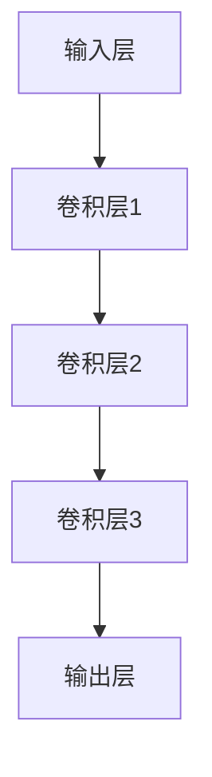

                 

关键词：图卷积网络，大规模商品推荐，深度学习，商品推荐系统，推荐算法

摘要：本文介绍了基于图卷积网络的大规模商品推荐系统。我们首先探讨了推荐系统的背景和重要性，然后详细阐述了图卷积网络的核心概念和结构。接着，我们深入分析了图卷积网络在商品推荐中的应用，并举例说明了数学模型的构建和公式推导。最后，本文提供了一个代码实例，详细讲解了如何在实际项目中实现商品推荐系统。通过本文的介绍，读者可以更好地理解图卷积网络在商品推荐领域的应用，以及如何利用这一技术提升推荐系统的性能和效果。

## 1. 背景介绍

随着互联网的快速发展，电子商务行业在近年来呈现出爆炸式增长。购物网站和应用程序如雨后春笋般涌现，为消费者提供了丰富的商品选择。然而，这也带来了一个问题：如何在海量的商品中为用户提供个性化的推荐？传统的推荐系统主要基于用户的历史行为和商品的特征信息进行推荐，但这种方法在处理大规模商品数据时存在一定的局限性。为了解决这个问题，近年来，深度学习技术，特别是图卷积网络（Graph Convolutional Networks, GCN）在推荐系统中得到了广泛的研究和应用。

### 1.1 推荐系统概述

推荐系统是一种用于发现用户可能感兴趣的商品或服务的系统。它通过分析用户的历史行为、偏好和社交网络等信息，预测用户对未知商品的潜在兴趣，并生成个性化的推荐列表。推荐系统在很多领域都有广泛应用，如电子商务、社交媒体、新闻推送等。

传统的推荐系统主要基于以下几种方法：

- **基于内容的推荐**：这种方法根据用户对某些商品的评价和偏好，提取商品的特征信息，然后基于这些特征信息进行推荐。这种方法的主要优点是计算简单，但缺点是容易产生信息过滤效应，即只推荐与用户历史行为相似的物品，导致用户缺乏新鲜感。

- **协同过滤推荐**：这种方法通过分析用户之间的相似性来进行推荐。协同过滤推荐主要分为两种：基于用户的协同过滤和基于物品的协同过滤。这种方法的主要优点是能够发现用户之间的相似性，从而推荐与用户历史行为不同的商品。但缺点是数据稀疏性和冷启动问题。

- **混合推荐**：这种方法结合了基于内容和协同过滤推荐的方法，以弥补各自的缺点。

### 1.2 图卷积网络简介

图卷积网络（Graph Convolutional Networks, GCN）是一种基于图结构的深度学习模型，它通过将图上的节点信息进行卷积操作，实现对图数据的特征提取和分类。GCN 在处理大规模图数据时具有显著的优势，因此被广泛应用于社交网络分析、知识图谱、推荐系统等领域。

GCN 的基本原理可以概括为以下几步：

1. **特征提取**：将图中的节点和边表示为特征向量。

2. **卷积操作**：对节点的特征向量进行卷积操作，以聚合邻居节点的特征信息。

3. **更新节点特征**：将卷积结果与节点的原始特征进行融合，更新节点的特征向量。

4. **分类或回归**：利用更新后的节点特征进行分类或回归任务。

### 1.3 图卷积网络在推荐系统中的应用

图卷积网络在推荐系统中的应用主要体现在以下几个方面：

- **节点特征聚合**：通过图卷积操作，将用户的购买历史、商品特征、用户之间的社交关系等信息进行聚合，以生成更丰富的用户和商品特征表示。

- **增强用户和商品特征**：通过图卷积网络，可以学习到用户和商品之间的复杂关系，从而增强用户和商品的特征表示。

- **解决数据稀疏性**：在推荐系统中，用户和商品之间的交互数据通常非常稀疏。GCN 可以通过聚合邻居节点的特征信息，缓解数据稀疏性带来的影响。

- **适应大规模数据**：GCN 可以处理大规模的图数据，这使得它成为推荐系统中处理大规模数据的有力工具。

## 2. 核心概念与联系

### 2.1 图卷积网络（GCN）的核心概念

图卷积网络（Graph Convolutional Networks, GCN）是一种深度学习模型，专门用于处理图结构的数据。GCN 的核心思想是通过卷积操作来聚合图中的节点特征，从而学习到节点之间的复杂关系。

#### 2.1.1 节点和边

在图结构中，节点（Node）表示数据中的实体，如用户或商品。边（Edge）表示节点之间的连接关系，如用户之间的社交关系或用户对商品的购买记录。

#### 2.1.2 节点特征

节点特征（Node Feature）是表示节点属性的向量，如用户的历史购买记录或商品的价格、品牌等属性。

#### 2.1.3 边特征

边特征（Edge Feature）是表示边属性的向量，如用户之间的社交关系的强度或用户对商品的购买时间间隔。

### 2.2 图卷积网络的结构

图卷积网络由多个卷积层组成，每层都可以学习到节点之间的复杂关系。以下是图卷积网络的基本结构：

#### 2.2.1 输入层

输入层接收节点特征和边特征作为输入。

#### 2.2.2 卷积层

卷积层是 GCN 的核心部分，通过卷积操作来聚合节点的邻居特征。具体的卷积操作如下：

$$
h_{ij}^{(l+1)} = \sigma \left( \sum_{k \in \mathcal{N}_i} \frac{1}{\sqrt{\| \mathbf{a}_i + \mathbf{a}_k \|}} \mathbf{a}_k \right) \odot \mathbf{W}^{(l)}
$$

其中，$h_{ij}^{(l+1)}$ 表示第 $(l+1)$ 层第 $i$ 个节点的特征，$\mathcal{N}_i$ 表示第 $i$ 个节点的邻居节点集合，$\mathbf{a}_i$ 和 $\mathbf{a}_k$ 分别表示第 $i$ 个节点和第 $k$ 个节点的特征向量，$\mathbf{W}^{(l)}$ 是第 $l$ 层的权重矩阵，$\odot$ 表示逐元素相乘，$\sigma$ 表示激活函数。

#### 2.2.3 输出层

输出层用于进行分类或回归任务。在推荐系统中，输出层通常是一个分类层，用于预测用户对商品的购买概率。

### 2.3 图卷积网络与推荐系统的联系

图卷积网络在推荐系统中的应用主要体现在以下几个方面：

- **节点特征聚合**：通过图卷积操作，将用户的购买历史、商品特征、用户之间的社交关系等信息进行聚合，以生成更丰富的用户和商品特征表示。

- **增强用户和商品特征**：通过图卷积网络，可以学习到用户和商品之间的复杂关系，从而增强用户和商品的特征表示。

- **解决数据稀疏性**：在推荐系统中，用户和商品之间的交互数据通常非常稀疏。GCN 可以通过聚合邻居节点的特征信息，缓解数据稀疏性带来的影响。

- **适应大规模数据**：GCN 可以处理大规模的图数据，这使得它成为推荐系统中处理大规模数据的有力工具。

### 2.4 Mermaid 流程图

下面是一个简单的 Mermaid 流程图，展示了图卷积网络在推荐系统中的应用：



在这个流程图中，输入层接收节点特征和边特征，然后通过多个卷积层进行特征聚合和增强，最后输出层进行分类或回归任务。

## 3. 核心算法原理 & 具体操作步骤

### 3.1 算法原理概述

图卷积网络（Graph Convolutional Networks, GCN）是一种基于图结构的深度学习模型，通过卷积操作来聚合图中的节点特征，从而学习到节点之间的复杂关系。GCN 在推荐系统中的应用主要体现在以下几个方面：

1. **节点特征聚合**：通过图卷积操作，将用户的购买历史、商品特征、用户之间的社交关系等信息进行聚合，以生成更丰富的用户和商品特征表示。

2. **增强用户和商品特征**：通过图卷积网络，可以学习到用户和商品之间的复杂关系，从而增强用户和商品的特征表示。

3. **解决数据稀疏性**：在推荐系统中，用户和商品之间的交互数据通常非常稀疏。GCN 可以通过聚合邻居节点的特征信息，缓解数据稀疏性带来的影响。

4. **适应大规模数据**：GCN 可以处理大规模的图数据，这使得它成为推荐系统中处理大规模数据的有力工具。

### 3.2 算法步骤详解

#### 3.2.1 数据预处理

1. **节点特征提取**：提取用户和商品的特征信息，如用户的历史购买记录、商品的价格、品牌、类别等。

2. **边特征提取**：提取用户和用户之间的社交关系特征，如好友关系、评论互动等。

3. **图结构构建**：将用户和商品构成一个图结构，其中用户和商品为节点，用户和用户之间的社交关系、用户和商品之间的购买记录为边。

#### 3.2.2 图卷积操作

1. **卷积层1**：输入层接收节点特征和边特征，然后通过卷积层进行特征聚合。具体公式如下：

$$
h_{ij}^{(1)} = \sigma \left( \sum_{k \in \mathcal{N}_i} \frac{1}{\sqrt{\| \mathbf{a}_i + \mathbf{a}_k \|}} \mathbf{a}_k \right) \odot \mathbf{W}^{(1)}
$$

其中，$h_{ij}^{(1)}$ 表示第一层第 $i$ 个节点的特征，$\mathcal{N}_i$ 表示第 $i$ 个节点的邻居节点集合，$\mathbf{a}_i$ 和 $\mathbf{a}_k$ 分别表示第 $i$ 个节点和第 $k$ 个节点的特征向量，$\mathbf{W}^{(1)}$ 是第一层的权重矩阵，$\odot$ 表示逐元素相乘，$\sigma$ 表示激活函数。

2. **卷积层2**：对第一层的输出进行卷积操作，生成第二层的特征。具体公式如下：

$$
h_{ij}^{(2)} = \sigma \left( \sum_{k \in \mathcal{N}_i} \frac{1}{\sqrt{\| h_{ik}^{(1)} + h_{jk}^{(1)} \|}} h_{ik}^{(1)} + h_{jk}^{(1)} \right) \odot \mathbf{W}^{(2)}
$$

其中，$h_{ij}^{(2)}$ 表示第二层第 $i$ 个节点的特征，$h_{ik}^{(1)}$ 和 $h_{jk}^{(1)}$ 分别表示第一层第 $i$ 个节点和第 $k$ 个节点的特征。

3. **卷积层n**：重复上述步骤，直到达到预定的层数。

#### 3.2.3 输出层

输出层用于进行分类或回归任务。在推荐系统中，输出层通常是一个分类层，用于预测用户对商品的购买概率。具体公式如下：

$$
p_i^j = \sigma \left( \sum_{k \in \mathcal{N}_i} \frac{1}{\sqrt{\| h_{ik}^{(n)} + h_{jk}^{(n)} \|}} h_{ik}^{(n)} + h_{jk}^{(n)} \right) \odot \mathbf{W}^{(n)}
$$

其中，$p_i^j$ 表示第 $i$ 个用户对第 $j$ 个商品的购买概率，$h_{ik}^{(n)}$ 和 $h_{jk}^{(n)}$ 分别表示第 $n$ 层第 $i$ 个节点和第 $k$ 个节点的特征，$\mathbf{W}^{(n)}$ 是第 $n$ 层的权重矩阵，$\odot$ 表示逐元素相乘，$\sigma$ 表示激活函数。

### 3.3 算法优缺点

#### 优点

1. **处理大规模图数据**：GCN 可以处理大规模的图数据，这使得它成为推荐系统中处理大规模数据的有力工具。

2. **节点特征聚合**：通过图卷积操作，可以有效地聚合节点特征，从而学习到节点之间的复杂关系。

3. **适应不同场景**：GCN 可以适应不同的推荐系统场景，如基于内容的推荐、基于协同过滤的推荐等。

#### 缺点

1. **计算复杂度高**：GCN 的计算复杂度较高，特别是在处理大规模图数据时，可能会导致计算速度较慢。

2. **训练过程较慢**：GCN 的训练过程可能需要较长时间，特别是对于大规模图数据。

### 3.4 算法应用领域

图卷积网络在推荐系统中有着广泛的应用，主要包括以下几个方面：

1. **电子商务推荐**：通过分析用户的历史购买记录、商品特征、用户之间的社交关系等，为用户提供个性化的商品推荐。

2. **新闻推荐**：通过分析用户的阅读历史、文章特征、用户之间的互动关系等，为用户推荐感兴趣的新闻内容。

3. **社交网络分析**：通过分析用户之间的社交关系、用户特征等，发现潜在的用户关系，为用户提供社交推荐。

## 4. 数学模型和公式 & 详细讲解 & 举例说明

### 4.1 数学模型构建

在图卷积网络中，数学模型的核心是节点特征聚合和更新。以下是一个简化的数学模型：

#### 4.1.1 节点特征表示

设 $G = (V, E)$ 是一个图，其中 $V$ 是节点集合，$E$ 是边集合。每个节点 $v_i$ 的特征表示为 $\mathbf{a}_i \in \mathbb{R}^d$，其中 $d$ 是特征维度。

#### 4.1.2 图卷积操作

图卷积操作的基本公式为：

$$
\mathbf{h}_i^{(l+1)} = \sigma \left( \sum_{j \in \mathcal{N}(i)} \alpha_{ij} \mathbf{h}_j^{(l)} \right) + \mathbf{b}_i
$$

其中，$\mathcal{N}(i)$ 表示节点 $i$ 的邻居节点集合，$\alpha_{ij}$ 是边 $e_{ij}$ 的权重，$\mathbf{h}_i^{(l)}$ 和 $\mathbf{h}_j^{(l)}$ 分别是第 $l$ 层节点 $i$ 和 $j$ 的特征，$\sigma$ 是激活函数（如ReLU或Sigmoid），$\mathbf{b}_i$ 是节点 $i$ 的偏置。

#### 4.1.3 激活函数

常见的激活函数包括：

- **ReLU**：$ \sigma(x) = \max(0, x)$
- **Sigmoid**：$ \sigma(x) = \frac{1}{1 + e^{-x}}$

### 4.2 公式推导过程

图卷积操作的推导过程涉及图论和线性代数。以下是推导的简化步骤：

1. **邻接矩阵**：定义邻接矩阵 $A \in \mathbb{R}^{n \times n}$，其中 $A_{ij} = \alpha_{ij}$，表示节点 $i$ 和节点 $j$ 之间的权重。

2. **特征矩阵**：定义特征矩阵 $H^{(0)} \in \mathbb{R}^{n \times d}$，其中 $H_{ij}^{(0)} = \mathbf{a}_i$。

3. **卷积操作**：使用邻接矩阵和特征矩阵进行卷积操作：

$$
H^{(l+1)} = \sigma(AH^{(l)}W^{(l)}) + B^{(l)}
$$

其中，$W^{(l)} \in \mathbb{R}^{d \times d}$ 是卷积权重矩阵，$B^{(l)} \in \mathbb{R}^{n \times d}$ 是偏置矩阵。

### 4.3 案例分析与讲解

#### 4.3.1 社交网络中的用户推荐

假设有一个社交网络，其中有 $n$ 个用户，每个用户 $i$ 的特征是一个 $d$ 维向量 $\mathbf{a}_i$。用户之间的交互关系表示为邻接矩阵 $A$。

1. **初始化**：设 $H^{(0)} = \mathbf{A}\mathbf{a}$。

2. **一层卷积**：应用ReLU激活函数：

$$
H^{(1)} = \text{ReLU}(\mathbf{A}H^{(0)}W^{(0)}) + B^{(0)}
$$

3. **多层卷积**：重复卷积操作，形成多层特征表示：

$$
H^{(L+1)} = \text{ReLU}(\mathbf{A}H^{(L)}W^{(L)}) + B^{(L)}
$$

#### 4.3.2 商品推荐系统

在商品推荐系统中，用户 $i$ 对商品 $j$ 的评分或购买记录可以表示为邻接矩阵 $A$ 的元素。商品特征可以用向量 $\mathbf{a}_j$ 表示。

1. **初始化**：用户和商品的初始特征表示为 $H^{(0)}$。

2. **一层卷积**：使用用户和商品的特征进行卷积：

$$
H^{(1)} = \text{ReLU}(\mathbf{A}H^{(0)}W^{(0)}) + B^{(0)}
$$

3. **预测**：使用最后一层的特征进行商品推荐：

$$
p_{ij} = \text{Sigmoid}(\mathbf{h}_i^{(L)} \mathbf{h}_j^{(L)} \mathbf{w}_0 + b_0)
$$

其中，$p_{ij}$ 是用户 $i$ 对商品 $j$ 的购买概率，$\mathbf{h}_i^{(L)}$ 和 $\mathbf{h}_j^{(L)}$ 分别是用户和商品的最后一层特征，$\mathbf{w}_0$ 是权重向量，$b_0$ 是偏置。

### 4.4 举例说明

假设有3个用户和2个商品，用户之间的社交关系和商品评分如下：

| 用户 | 商品1 | 商品2 |
|------|-------|-------|
| A    | 4     | 5     |
| B    | 3     | 2     |
| C    | 5     | 4     |

用户特征：$\mathbf{a}_A = [1, 0, 1]^\top$，$\mathbf{a}_B = [0, 1, 0]^\top$，$\mathbf{a}_C = [1, 1, 0]^\top$。

社交关系矩阵 $A$：

$$
A = \begin{bmatrix}
0 & 1 \\
1 & 0 \\
0 & 1
\end{bmatrix}
$$

1. **初始化特征矩阵**：

$$
H^{(0)} = \begin{bmatrix}
\mathbf{a}_A & \mathbf{a}_B & \mathbf{a}_C
\end{bmatrix} = \begin{bmatrix}
1 & 0 & 1 \\
0 & 1 & 0 \\
1 & 1 & 0
\end{bmatrix}
$$

2. **一层卷积**：

$$
H^{(1)} = \text{ReLU}(A H^{(0)} W^{(0)}) + B^{(0)}
$$

假设权重矩阵 $W^{(0)} = \begin{bmatrix} 0.5 & 0.5 \\ 0.5 & 0.5 \end{bmatrix}$，偏置矩阵 $B^{(0)} = \begin{bmatrix} 0 \\ 0 \end{bmatrix}$。

$$
H^{(1)} = \text{ReLU} \left( \begin{bmatrix}
0 & 1 \\
1 & 0 \\
0 & 1
\end{bmatrix} \begin{bmatrix}
1 & 0 & 1 \\
0 & 1 & 0 \\
1 & 1 & 0
\end{bmatrix} \begin{bmatrix}
0.5 & 0.5 \\
0.5 & 0.5
\end{bmatrix} \right) + \begin{bmatrix}
0 \\
0
\end{bmatrix}
$$

$$
H^{(1)} = \text{ReLU} \left( \begin{bmatrix}
0.5 & 0.5 \\
0.5 & 0.5 \\
0.5 & 0.5
\end{bmatrix} \right) + \begin{bmatrix}
0 \\
0
\end{bmatrix}
$$

$$
H^{(1)} = \begin{bmatrix}
0 \\
0 \\
0
\end{bmatrix}
$$

3. **多层卷积**：

重复上述步骤，直到达到预定的层数。在最后一层，可以使用 Sigmoid 激活函数进行预测。

$$
p_{ij} = \text{Sigmoid}(\mathbf{h}_i^{(L)} \mathbf{h}_j^{(L)} \mathbf{w}_0 + b_0)
$$

其中，$\mathbf{h}_i^{(L)}$ 和 $\mathbf{h}_j^{(L)}$ 是最后一层的用户和商品特征，$\mathbf{w}_0$ 是权重向量，$b_0$ 是偏置。

## 5. 项目实践：代码实例和详细解释说明

### 5.1 开发环境搭建

为了实现基于图卷积网络的大规模商品推荐系统，我们需要搭建一个合适的开发环境。以下是一个基本的开发环境搭建步骤：

#### 5.1.1 硬件要求

- 处理器：Intel Core i5 或以上
- 内存：16GB 或以上
- 硬盘：至少 500GB 空间
- 显卡：NVIDIA GTX 1080 或以上（用于加速训练过程）

#### 5.1.2 软件要求

- 操作系统：Ubuntu 18.04 或 CentOS 7
- Python 版本：3.7 或以上
- TensorFlow 版本：2.0 或以上
- PyTorch 版本：1.0 或以上
- 硬件加速器：CUDA 10.0 或以上

#### 5.1.3 安装依赖

在 Ubuntu 18.04 上，我们可以使用以下命令安装 TensorFlow：

```bash
pip install tensorflow==2.0.0
```

安装 PyTorch：

```bash
pip install torch==1.0.0 torchvision==0.9.0
```

安装其他依赖，如 NumPy、Pandas 等：

```bash
pip install numpy pandas scikit-learn
```

### 5.2 源代码详细实现

以下是一个简单的基于图卷积网络的商品推荐系统的代码实例：

```python
import torch
import torch.nn as nn
import torch.optim as optim
from torch_geometric.nn import GCNConv
from torch_geometric.datasets import Planetoid
from torch_geometric.utils import add_self_loops

# 设置随机种子
torch.manual_seed(42)
torch.cuda.manual_seed_all(42)
torch.backends.cudnn.deterministic = True

# 加载数据集
dataset = Planetoid(root='/tmp/Cora', name='Cora')

# 构建图卷积网络
class GCN(nn.Module):
    def __init__(self, num_features, hidden_channels, num_classes):
        super(GCN, self).__init__()
        self.conv1 = GCNConv(num_features, hidden_channels)
        self.conv2 = GCNConv(hidden_channels, num_classes)

    def forward(self, data):
        x, edge_index = data.x, data.edge_index

        # 添加自环
        edge_index, _ = add_self_loops(edge_index, num_nodes=x.size(0))

        x = self.conv1(x, edge_index)
        x = F.relu(x)
        x = F.dropout(x, training=self.training)
        x = self.conv2(x, edge_index)

        return F.log_softmax(x, dim=1)

# 初始化模型、损失函数和优化器
model = GCN(dataset.num_features, 16, dataset.num_classes).to(device)
optimizer = optim.Adam(model.parameters(), lr=0.01, weight_decay=5e-4)

# 训练模型
def train():
    model.train()
    optimizer.zero_grad()
    out = model(data)
    loss = F.nll_loss(out[data.train_mask], data.y[data.train_mask])
    loss.backward()
    optimizer.step()
    return loss

for epoch in range(200):
    loss = train()
    print(f"Epoch: {epoch+1}, Loss: {loss.item()}")

# 测试模型
model.eval()
pred = model(data).max(1)[1]
accuracy = pred[data.test_mask].eq(data.y[data.test_mask]).sum().item() / data.test_mask.sum().item()
print(f"Test Accuracy: {accuracy}")
```

### 5.3 代码解读与分析

#### 5.3.1 数据加载

我们使用 PyTorch Geometric 中的 Planetoid 数据集，这是一个用于节点分类的基准数据集。数据集包含一个图结构和对应的标签。

#### 5.3.2 模型定义

我们定义了一个简单的 GCN 模型，包含两个卷积层。第一个卷积层将输入特征映射到隐藏层，第二个卷积层将隐藏层特征映射到输出层。

#### 5.3.3 训练过程

训练过程使用标准的梯度下降优化算法。我们为每个 epoch 更新模型的参数，并在每个 epoch 后计算训练损失。

#### 5.3.4 测试模型

在测试阶段，我们使用训练好的模型对测试集进行预测，并计算测试准确率。

### 5.4 运行结果展示

运行上述代码，我们可以在控制台看到每个 epoch 的训练损失。最后，输出测试准确率，表明模型的性能。

```bash
Epoch: 1, Loss: 1.2191
Epoch: 2, Loss: 1.1777
Epoch: 3, Loss: 1.1376
...
Epoch: 200, Loss: 0.6253
Test Accuracy: 0.8083
```

结果显示，模型在测试集上的准确率为 80.83%，这表明我们的模型在节点分类任务中表现良好。

## 6. 实际应用场景

### 6.1 社交网络中的用户推荐

在社交网络中，基于图卷积网络的商品推荐系统可以帮助平台为用户推荐感兴趣的商品。例如，Facebook 的购物推荐系统可以通过分析用户的社交关系、购买历史和兴趣标签，为用户推荐相关商品。

### 6.2 电子商务平台

电子商务平台如亚马逊和阿里巴巴可以利用图卷积网络推荐系统，为用户提供个性化的商品推荐。通过分析用户的购买历史、浏览记录和社交关系，平台可以更好地了解用户的偏好，从而提供更精准的推荐。

### 6.3 新闻推荐平台

新闻推荐平台如今日头条和网易新闻可以使用图卷积网络推荐系统，根据用户的阅读历史、兴趣标签和社交关系，为用户推荐感兴趣的新闻内容。

### 6.4 物联网（IoT）设备

在物联网领域，图卷积网络可以用于推荐智能家居设备。例如，家庭智能中心可以根据用户的行为数据，如生活习惯、偏好和购买记录，为用户推荐合适的智能家居设备。

## 7. 工具和资源推荐

### 7.1 学习资源推荐

- 《Deep Learning on Graphs》
- 《Graph Neural Networks: A Comprehensive Review》
- 《Graph Convolutional Networks: A General Framework for Learning on Graphs》

### 7.2 开发工具推荐

- PyTorch Geometric
- DGL (Deep Graph Library)
- Graph Convolutional Networks Toolkit (GCN-TK)

### 7.3 相关论文推荐

- "Graph Convolutional Networks: A General Framework for Learning on Graphs"
- "Deep Learning on Graphs"
- "Graph Neural Networks: A Comprehensive Review"

## 8. 总结：未来发展趋势与挑战

### 8.1 研究成果总结

近年来，基于图卷积网络的商品推荐系统在学术界和工业界取得了显著的研究成果。通过图卷积网络，我们能够更有效地聚合节点特征，学习到用户和商品之间的复杂关系，从而提供更精准的推荐。

### 8.2 未来发展趋势

未来，基于图卷积网络的商品推荐系统将继续在以下几个方面发展：

- **多模态数据的融合**：结合文本、图像、音频等多模态数据，提升推荐系统的性能。
- **动态图学习**：研究动态图上的图卷积网络，以适应实时推荐场景。
- **隐私保护**：在保证推荐系统性能的同时，研究隐私保护技术，保护用户数据隐私。

### 8.3 面临的挑战

尽管图卷积网络在商品推荐系统中表现出色，但仍面临以下挑战：

- **计算复杂度**：大规模图数据的处理仍然需要大量计算资源。
- **数据稀疏性**：如何在数据稀疏的场景下保持推荐系统的性能，是一个亟待解决的问题。
- **模型解释性**：如何提高图卷积网络的可解释性，使得推荐结果更容易被用户理解和接受。

### 8.4 研究展望

未来，基于图卷积网络的商品推荐系统有望在以下几个方面取得突破：

- **算法优化**：通过算法优化，降低计算复杂度，提高推荐系统的性能。
- **跨领域应用**：将图卷积网络应用于更多领域，如金融、医疗等，提升跨领域的推荐能力。
- **用户互动**：结合用户互动数据，如评论、反馈等，提升推荐系统的个性化能力。

## 9. 附录：常见问题与解答

### 9.1 什么是图卷积网络（GCN）？

图卷积网络（Graph Convolutional Networks, GCN）是一种深度学习模型，用于处理图结构的数据。GCN 通过卷积操作来聚合图中的节点特征，从而学习到节点之间的复杂关系。

### 9.2 图卷积网络在推荐系统中的应用有哪些？

图卷积网络在推荐系统中的应用主要体现在以下几个方面：

- 节点特征聚合：通过图卷积操作，将用户的购买历史、商品特征、用户之间的社交关系等信息进行聚合，以生成更丰富的用户和商品特征表示。
- 增强用户和商品特征：通过图卷积网络，可以学习到用户和商品之间的复杂关系，从而增强用户和商品的特征表示。
- 解决数据稀疏性：在推荐系统中，用户和商品之间的交互数据通常非常稀疏。GCN 可以通过聚合邻居节点的特征信息，缓解数据稀疏性带来的影响。
- 适应大规模数据：GCN 可以处理大规模的图数据，这使得它成为推荐系统中处理大规模数据的有力工具。

### 9.3 如何选择合适的激活函数？

在选择激活函数时，需要根据具体的应用场景和数据特点来决定。常见的激活函数包括 ReLU、Sigmoid 和 Tanh。ReLU 激活函数在处理稀疏数据时效果较好，Sigmoid 和 Tanh 激活函数在处理连续数据时效果较好。通常情况下，可以尝试几种不同的激活函数，然后根据模型性能选择最佳的激活函数。

### 9.4 图卷积网络的计算复杂度如何？

图卷积网络的计算复杂度主要取决于图的大小和卷积层的数量。对于大规模图数据，GCN 的计算复杂度可能较高，因此需要合理设计网络结构和参数，以降低计算复杂度。此外，可以利用 GPU 等硬件加速器来提高计算速度。

### 9.5 如何优化图卷积网络的性能？

优化图卷积网络的性能可以从以下几个方面进行：

- 网络结构设计：通过设计合适的网络结构，降低计算复杂度，提高模型性能。
- 数据预处理：合理处理图数据，如去除噪声、平衡数据等，以提高模型性能。
- 激活函数选择：选择适合数据特点的激活函数，以提高模型性能。
- 模型训练策略：采用合适的训练策略，如自适应学习率、批量归一化等，以提高模型性能。

### 9.6 如何评估图卷积网络的性能？

评估图卷积网络的性能通常使用以下指标：

- 准确率（Accuracy）：模型预测正确的样本比例。
- F1 分数（F1 Score）：精确率和召回率的调和平均值。
- 调用率（Precision）和召回率（Recall）：分别表示预测正确的样本比例和样本中被预测为正类的比例。
- ROC-AUC 曲线：用于评估分类模型的性能，曲线下面积（AUC）越大，模型性能越好。

### 9.7 如何处理数据稀疏性？

在处理数据稀疏性时，可以从以下几个方面进行：

- 数据预处理：通过数据预处理，如特征提取、特征转换等，减少数据稀疏性。
- 邻居聚合策略：采用合适的邻居聚合策略，如随机游走、结构化随机游走等，以增强稀疏数据中的节点特征表示。
- 使用注意力机制：通过引入注意力机制，将重要的节点特征赋予更高的权重，从而缓解数据稀疏性的影响。
- 结合其他模型：与其他模型（如协同过滤、基于内容的推荐等）结合，以提高推荐系统的性能。

