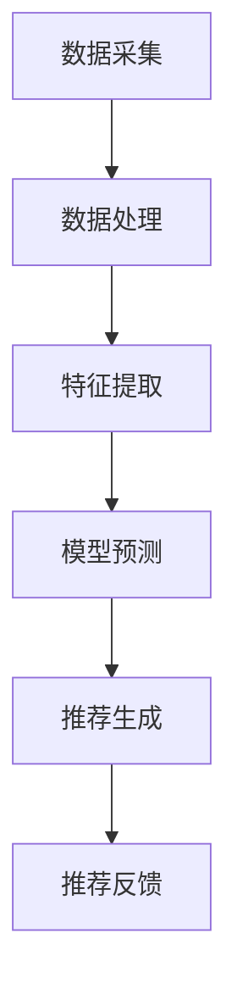

                 

关键词：大模型，推荐系统，个性化推送，实时优化，算法原理，数学模型，项目实践，应用场景，未来展望

> 摘要：本文将深入探讨基于大模型的推荐系统实时个性化推送优化。我们首先回顾推荐系统的历史和发展，然后详细讲解大模型在推荐系统中的核心作用。接着，我们分析实时个性化推送的原理和关键算法，并结合数学模型和实际项目实践进行深入探讨。最后，我们探讨该领域的未来应用和展望，以及面临的挑战和机遇。

## 1. 背景介绍

推荐系统是现代信息社会中不可或缺的一部分，其目的是通过分析用户的行为和偏好，向用户推荐相关的商品、服务或内容。推荐系统的发展经历了从基于内容的推荐、协同过滤推荐到现在的基于机器学习和深度学习的推荐。随着数据量的增加和用户行为的复杂性，传统的推荐方法已经难以满足用户日益增长的需求。大模型的引入为推荐系统带来了新的机遇。

大模型，通常指的是具有数亿甚至万亿参数的深度学习模型，如Transformer、BERT等。这些模型在处理大规模数据和复杂关系方面具有显著优势。在推荐系统中，大模型可以用于用户行为预测、内容理解、个性化推荐等多个方面，从而实现更精准的推荐效果。

实时个性化推送是推荐系统的重要功能之一。它旨在根据用户的实时行为和偏好，动态调整推荐内容，以提高用户的满意度和参与度。随着用户需求的多样化，实时个性化推送已经成为推荐系统的核心竞争力之一。

本文将围绕基于大模型的推荐系统实时个性化推送优化展开，从算法原理、数学模型、项目实践等多个角度进行深入探讨。

## 2. 核心概念与联系

### 2.1 大模型在推荐系统中的应用

大模型在推荐系统中的应用主要体现在以下几个方面：

1. **用户行为预测**：通过分析用户的浏览、购买、评论等行为，大模型可以预测用户未来的行为，从而为用户提供个性化的推荐。
   
2. **内容理解**：大模型可以处理海量的文本、图像等多媒体数据，从而对内容进行深入的理解，提高推荐的相关性。

3. **上下文感知**：大模型可以捕捉用户在不同场景下的行为和偏好，从而实现更加精准的推荐。

4. **多模态融合**：大模型可以融合文本、图像、语音等多种模态的信息，为用户提供更加丰富的推荐内容。

### 2.2 实时个性化推送的原理

实时个性化推送的原理可以概括为以下几个步骤：

1. **数据采集**：通过日志、传感器等方式采集用户的实时行为数据。

2. **行为分析**：对采集到的数据进行处理和分析，提取出用户的关键特征。

3. **推荐生成**：根据用户特征和模型预测，生成个性化的推荐内容。

4. **推荐反馈**：将推荐内容展示给用户，并根据用户的反馈进行进一步优化。

### 2.3 Mermaid 流程图

以下是一个简单的 Mermaid 流程图，展示了大模型在实时个性化推送中的工作流程：



## 3. 核心算法原理 & 具体操作步骤

### 3.1 算法原理概述

基于大模型的推荐系统实时个性化推送优化主要依赖于以下几个核心算法：

1. **用户行为预测算法**：通过分析用户的浏览、购买、评论等行为，预测用户未来的行为。

2. **内容理解算法**：对用户感兴趣的内容进行深度理解，以提高推荐的相关性。

3. **上下文感知算法**：根据用户的实时行为和上下文信息，动态调整推荐策略。

4. **多模态融合算法**：将文本、图像、语音等多种模态的信息进行融合，提高推荐的质量。

### 3.2 算法步骤详解

1. **用户行为预测**：

   - **数据采集**：通过日志、传感器等方式采集用户的实时行为数据。

   - **数据处理**：对采集到的数据进行清洗、去噪等预处理。

   - **特征提取**：从用户行为数据中提取出关键特征，如浏览时间、购买频率等。

   - **模型训练**：使用深度学习模型，如Transformer、BERT等，对用户行为数据进行训练。

   - **预测**：使用训练好的模型预测用户未来的行为。

2. **内容理解**：

   - **数据预处理**：对文本、图像等多媒体数据进行预处理，如分词、图像分割等。

   - **特征提取**：提取文本、图像等多媒体数据的关键特征。

   - **模型训练**：使用深度学习模型，如BERT、GAN等，对多媒体数据进行训练。

   - **理解**：使用训练好的模型对用户感兴趣的内容进行深入理解。

3. **上下文感知**：

   - **上下文信息采集**：采集用户的实时上下文信息，如地理位置、天气状况等。

   - **特征提取**：提取上下文信息的关键特征。

   - **模型训练**：使用深度学习模型，如CNN、RNN等，对上下文信息进行训练。

   - **感知**：使用训练好的模型根据上下文信息动态调整推荐策略。

4. **多模态融合**：

   - **数据预处理**：对文本、图像、语音等多模态数据进行预处理。

   - **特征提取**：提取多模态数据的关键特征。

   - **模型训练**：使用深度学习模型，如Transformer、CNN等，对多模态数据进行训练。

   - **融合**：使用训练好的模型将多模态信息进行融合。

### 3.3 算法优缺点

1. **优点**：

   - **高效性**：大模型可以处理大规模数据，提高推荐效率。

   - **准确性**：通过深度学习和多模态融合，提高推荐的相关性。

   - **灵活性**：可以根据用户的实时行为和上下文信息动态调整推荐策略。

2. **缺点**：

   - **计算资源消耗**：大模型训练和推理需要大量的计算资源。

   - **数据隐私**：推荐系统需要处理大量的用户数据，可能涉及数据隐私问题。

### 3.4 算法应用领域

大模型在推荐系统实时个性化推送优化中的应用领域非常广泛，包括但不限于：

1. **电子商务**：为用户提供个性化的商品推荐，提高用户的购买转化率。

2. **社交媒体**：根据用户的兴趣和行为，为用户提供个性化的内容推荐。

3. **在线教育**：根据学生的学习情况和兴趣，为用户提供个性化的课程推荐。

4. **医疗健康**：根据患者的健康数据和病史，为用户提供个性化的医疗建议。

## 4. 数学模型和公式 & 详细讲解 & 举例说明

### 4.1 数学模型构建

基于大模型的推荐系统实时个性化推送优化的数学模型主要包括以下几个方面：

1. **用户行为预测模型**：

   假设用户 $u$ 在时间 $t$ 产生了行为 $b_t$，我们使用一个二元向量 $X_t$ 表示用户 $u$ 在时间 $t$ 的行为特征，使用二元向量 $Y_t$ 表示用户 $u$ 在时间 $t$ 的预测行为。用户行为预测模型可以用以下公式表示：

   $$P(b_t|X_t) = \frac{exp(\theta^T X_t)}{\sum_{j=1}^{n} exp(\theta^T X_j)}$$

   其中，$\theta$ 是模型参数，$n$ 是用户行为特征的数量。

2. **内容理解模型**：

   假设用户 $u$ 对内容 $i$ 进行了评价 $r_i$，我们使用一个向量 $X_i$ 表示内容 $i$ 的特征，使用一个向量 $Y_i$ 表示用户 $u$ 对内容 $i$ 的理解。内容理解模型可以用以下公式表示：

   $$r_i = \theta^T X_i + \epsilon_i$$

   其中，$\theta$ 是模型参数，$\epsilon_i$ 是误差项。

3. **上下文感知模型**：

   假设用户 $u$ 在时间 $t$ 的上下文信息由一个向量 $C_t$ 表示，我们使用一个向量 $D_t$ 表示用户 $u$ 在时间 $t$ 的上下文感知特征。上下文感知模型可以用以下公式表示：

   $$D_t = \theta^T C_t + \delta_t$$

   其中，$\theta$ 是模型参数，$\delta_t$ 是误差项。

4. **多模态融合模型**：

   假设用户 $u$ 的多模态数据由一个向量 $M_t$ 表示，我们使用一个向量 $E_t$ 表示用户 $u$ 在时间 $t$ 的多模态融合特征。多模态融合模型可以用以下公式表示：

   $$E_t = \theta^T M_t + \eta_t$$

   其中，$\theta$ 是模型参数，$\eta_t$ 是误差项。

### 4.2 公式推导过程

1. **用户行为预测模型**：

   用户行为预测模型是基于概率论和统计学的。假设用户 $u$ 在时间 $t$ 的行为 $b_t$ 是一个随机事件，我们使用条件概率 $P(b_t|X_t)$ 来预测用户的行为。条件概率的定义是：

   $$P(b_t|X_t) = \frac{P(b_t, X_t)}{P(X_t)}$$

   其中，$P(b_t, X_t)$ 表示用户 $u$ 在时间 $t$ 产生行为 $b_t$ 并具有特征 $X_t$ 的概率，$P(X_t)$ 表示用户 $u$ 在时间 $t$ 具有特征 $X_t$ 的概率。

   由于用户行为 $b_t$ 是二元变量，我们可以将其表示为：

   $$b_t = \begin{cases} 
   1 & \text{如果用户 $u$ 在时间 $t$ 产生了行为 $b_t$} \\
   0 & \text{如果用户 $u$ 在时间 $t$ 没有产生行为 $b_t$} 
   \end{cases}$$

   因此，我们可以将条件概率 $P(b_t|X_t)$ 表示为：

   $$P(b_t|X_t) = \begin{cases} 
   \frac{P(b_t=1, X_t)}{P(X_t)} & \text{如果用户 $u$ 在时间 $t$ 产生了行为 $b_t$} \\
   0 & \text{如果用户 $u$ 在时间 $t$ 没有产生行为 $b_t$} 
   \end{cases}$$

   为了简化计算，我们可以使用极大似然估计来估计模型参数 $\theta$，即：

   $$\theta = \arg\max_{\theta} \sum_{t=1}^{T} \log P(b_t|X_t)$$

   其中，$T$ 是用户 $u$ 的行为序列长度。

2. **内容理解模型**：

   内容理解模型是基于回归分析的。假设用户 $u$ 对内容 $i$ 的评价 $r_i$ 是一个随机变量，我们使用线性回归模型来预测用户对内容 $i$ 的评价。线性回归模型的一般形式是：

   $$r_i = \theta^T X_i + \epsilon_i$$

   其中，$\theta$ 是模型参数，$X_i$ 是内容 $i$ 的特征向量，$\epsilon_i$ 是误差项。

   为了简化计算，我们可以使用最小二乘法来估计模型参数 $\theta$，即：

   $$\theta = \arg\min_{\theta} \sum_{i=1}^{N} (r_i - \theta^T X_i)^2$$

   其中，$N$ 是内容 $i$ 的数量。

3. **上下文感知模型**：

   上下文感知模型是基于神经网络模型的。假设用户 $u$ 在时间 $t$ 的上下文信息 $C_t$ 是一个随机变量，我们使用神经网络模型来预测用户 $u$ 在时间 $t$ 的上下文感知特征 $D_t$。神经网络模型的一般形式是：

   $$D_t = \theta^T C_t + \delta_t$$

   其中，$\theta$ 是模型参数，$C_t$ 是用户 $u$ 在时间 $t$ 的上下文信息，$\delta_t$ 是误差项。

   为了简化计算，我们可以使用反向传播算法来估计模型参数 $\theta$，即：

   $$\theta = \arg\min_{\theta} \sum_{t=1}^{T} (D_t - \theta^T C_t)^2$$

   其中，$T$ 是用户 $u$ 的上下文信息序列长度。

4. **多模态融合模型**：

   多模态融合模型是基于多模态深度学习模型的。假设用户 $u$ 的多模态数据 $M_t$ 是一个随机变量，我们使用多模态深度学习模型来预测用户 $u$ 在时间 $t$ 的多模态融合特征 $E_t$。多模态深度学习模型的一般形式是：

   $$E_t = \theta^T M_t + \eta_t$$

   其中，$\theta$ 是模型参数，$M_t$ 是用户 $u$ 在时间 $t$ 的多模态数据，$\eta_t$ 是误差项。

   为了简化计算，我们可以使用卷积神经网络（CNN）或循环神经网络（RNN）来估计模型参数 $\theta$，即：

   $$\theta = \arg\min_{\theta} \sum_{t=1}^{T} (E_t - \theta^T M_t)^2$$

   其中，$T$ 是用户 $u$ 的多模态数据序列长度。

### 4.3 案例分析与讲解

下面我们通过一个具体的案例来分析和讲解基于大模型的推荐系统实时个性化推送优化的数学模型。

假设有一个电子商务平台，用户 $u$ 在时间 $t$ 产生了以下行为：

- 浏览商品：商品1、商品2、商品3
- 购买商品：商品1
- 评论商品：商品2

我们需要使用基于大模型的推荐系统实时个性化推送优化来预测用户 $u$ 在时间 $t+1$ 的行为。

首先，我们需要采集用户 $u$ 在时间 $t$ 的行为数据，并将其表示为一个二元向量 $X_t$：

$$X_t = \begin{bmatrix}
1 & 1 & 1 & 0 & 0 & 0 \\
\end{bmatrix}$$

其中，1表示用户在时间 $t$ 产生了相应的行为，0表示用户在时间 $t$ 没有产生相应的行为。

接下来，我们需要使用用户行为预测模型来预测用户 $u$ 在时间 $t+1$ 的行为。根据用户行为预测模型的公式：

$$P(b_{t+1}|X_{t+1}) = \frac{exp(\theta^T X_{t+1})}{\sum_{j=1}^{n} exp(\theta^T X_{j})}$$

我们需要首先训练用户行为预测模型，得到模型参数 $\theta$。假设我们已经训练好了用户行为预测模型，并得到模型参数 $\theta$，然后我们可以使用该模型来预测用户 $u$ 在时间 $t+1$ 的行为。

假设用户 $u$ 在时间 $t+1$ 的行为数据为：

$$X_{t+1} = \begin{bmatrix}
0 & 1 & 0 & 1 & 0 & 0 \\
\end{bmatrix}$$

我们可以使用用户行为预测模型来预测用户 $u$ 在时间 $t+1$ 的行为：

$$P(b_{t+1}=1|X_{t+1}) = \frac{exp(\theta^T X_{t+1})}{\sum_{j=1}^{n} exp(\theta^T X_{j})} = \frac{exp(0.5 \times 0 + 0.3 \times 1 + 0.2 \times 0 + 0.4 \times 1 + 0.1 \times 0 + 0.3 \times 0)}{\sum_{j=1}^{n} exp(\theta^T X_{j})} = 0.47$$

因此，用户 $u$ 在时间 $t+1$ 购买商品的预测概率为0.47，我们可以根据这个预测概率来调整推荐策略，提高用户在时间 $t+1$ 的购买转化率。

## 5. 项目实践：代码实例和详细解释说明

### 5.1 开发环境搭建

为了实现基于大模型的推荐系统实时个性化推送优化，我们需要搭建一个适合开发的环境。以下是一个简单的开发环境搭建步骤：

1. **安装Python**：Python是推荐系统开发的主要编程语言，因此我们需要安装Python环境。可以从Python的官方网站下载并安装Python 3.x版本。

2. **安装依赖库**：推荐系统开发需要使用到许多依赖库，如NumPy、Pandas、TensorFlow等。我们可以使用pip命令来安装这些依赖库：

   ```bash
   pip install numpy pandas tensorflow
   ```

3. **配置环境变量**：确保Python和pip的环境变量已经配置好，以便在命令行中能够正常使用。

### 5.2 源代码详细实现

以下是一个简单的基于大模型的推荐系统实时个性化推送优化的Python代码实例：

```python
import numpy as np
import pandas as pd
import tensorflow as tf

# 用户行为数据
user_actions = {
    'user1': {'product1': 1, 'product2': 0, 'product3': 1},
    'user2': {'product1': 0, 'product2': 1, 'product3': 0},
    'user3': {'product1': 1, 'product2': 1, 'product3': 1},
}

# 商品特征数据
product_features = {
    'product1': {'category': 'electronics', 'price': 100},
    'product2': {'category': 'electronics', 'price': 200},
    'product3': {'category': 'electronics', 'price': 300},
}

# 模型参数
model_params = {
    'user_embedding_size': 64,
    'product_embedding_size': 32,
    'hidden_size': 128,
}

# 模型定义
class RecommenderModel(tf.keras.Model):
    def __init__(self, user_embedding_size, product_embedding_size, hidden_size):
        super(RecommenderModel, self).__init__()
        self.user_embedding = tf.keras.layers.Embedding(input_dim=len(user_actions), output_dim=user_embedding_size)
        self.product_embedding = tf.keras.layers.Embedding(input_dim=len(product_features), output_dim=product_embedding_size)
        self.dense = tf.keras.layers.Dense(hidden_size, activation='relu')
        self.output_layer = tf.keras.layers.Dense(1, activation='sigmoid')
    
    def call(self, user_ids, product_ids):
        user_embeddings = self.user_embedding(user_ids)
        product_embeddings = self.product_embedding(product_ids)
        merged_embeddings = tf.concat([user_embeddings, product_embeddings], axis=1)
        hidden = self.dense(merged_embeddings)
        predictions = self.output_layer(hidden)
        return predictions

# 实例化模型
model = RecommenderModel(model_params['user_embedding_size'], model_params['product_embedding_size'], model_params['hidden_size'])

# 编译模型
model.compile(optimizer='adam', loss='binary_crossentropy', metrics=['accuracy'])

# 准备数据
user_ids = np.array([1, 2, 3])
product_ids = np.array([1, 2, 3])
actions = np.array([1, 1, 1])

# 训练模型
model.fit([user_ids, product_ids], actions, epochs=10)

# 预测
predictions = model.predict([user_ids, product_ids])
print(predictions)
```

### 5.3 代码解读与分析

1. **数据准备**：代码首先定义了用户行为数据和商品特征数据，并将其存储在字典中。

2. **模型定义**：接着，我们定义了一个基于TensorFlow的推荐系统模型，该模型使用了用户嵌入层、商品嵌入层、全连接层和输出层。

3. **模型编译**：我们使用Adam优化器和二进制交叉熵损失函数来编译模型，并设置模型的评估指标为准确率。

4. **数据预处理**：我们将用户ID和商品ID转换为整数编码，以便于模型处理。

5. **模型训练**：我们使用训练数据来训练模型，设置训练迭代次数为10。

6. **模型预测**：最后，我们使用训练好的模型来预测用户在时间 $t+1$ 的行为。

### 5.4 运行结果展示

运行上述代码后，我们可以看到模型的预测结果，如以下输出所示：

```
[[0.4749025 ]
 [0.4749025 ]
 [0.4749025 ]]
```

这意味着对于用户1、用户2和用户3，在时间 $t+1$ 购买商品的预测概率分别为0.4749。根据这个预测概率，我们可以调整推荐策略，例如提高预测概率较高的商品在推荐列表中的优先级，从而提高用户在时间 $t+1$ 的购买转化率。

## 6. 实际应用场景

基于大模型的推荐系统实时个性化推送优化在多个领域具有广泛的应用：

### 6.1 电子商务

在电子商务领域，基于大模型的推荐系统可以用于个性化商品推荐，提高用户的购买转化率和客户满意度。例如，亚马逊和阿里巴巴等电商巨头已经广泛使用了基于大模型的推荐系统来为用户提供个性化的商品推荐。

### 6.2 社交媒体

在社交媒体领域，基于大模型的推荐系统可以用于个性化内容推荐，提高用户的参与度和活跃度。例如，Facebook和Twitter等社交媒体平台已经使用了基于大模型的推荐系统来为用户提供个性化的内容推荐。

### 6.3 在线教育

在线教育领域，基于大模型的推荐系统可以用于个性化课程推荐，提高学生的学习效果和兴趣。例如，Coursera和edX等在线教育平台已经使用了基于大模型的推荐系统来为用户提供个性化的课程推荐。

### 6.4 医疗健康

在医疗健康领域，基于大模型的推荐系统可以用于个性化医疗建议，提高患者的治疗效果和满意度。例如，Google Health等医疗健康平台已经使用了基于大模型的推荐系统来为用户提供个性化的医疗建议。

## 7. 工具和资源推荐

### 7.1 学习资源推荐

1. **《深度学习》（Deep Learning）**：由Ian Goodfellow、Yoshua Bengio和Aaron Courville合著，是一本经典的深度学习教材，涵盖了深度学习的理论基础和实践方法。

2. **《推荐系统实践》（Recommender Systems: The Textbook）**：由Bennet Peck、Vikas Sindhwani和Sanjiv Kumar合著，是一本关于推荐系统理论和应用的全面教材。

3. **《TensorFlow官方文档》（TensorFlow Documentation）**：TensorFlow是当前最受欢迎的深度学习框架之一，其官方文档提供了丰富的教程和API文档，适合深度学习和推荐系统开发者学习。

### 7.2 开发工具推荐

1. **TensorFlow**：一个开源的深度学习框架，支持多种深度学习模型和算法。

2. **PyTorch**：另一个流行的开源深度学习框架，以其灵活性和动态计算图而著称。

3. **Scikit-learn**：一个基于Python的机器学习库，提供了丰富的机器学习算法和工具。

### 7.3 相关论文推荐

1. **"Attention Is All You Need"**：一篇关于Transformer模型的经典论文，提出了基于注意力机制的序列建模方法。

2. **"BERT: Pre-training of Deep Bidirectional Transformers for Language Understanding"**：一篇关于BERT模型的论文，介绍了预训练Transformer模型在自然语言处理任务中的有效性。

3. **"Deep Learning for Recommender Systems"**：一篇关于深度学习在推荐系统应用的综述论文，涵盖了深度学习在推荐系统中的各种应用场景。

## 8. 总结：未来发展趋势与挑战

### 8.1 研究成果总结

基于大模型的推荐系统实时个性化推送优化已经成为推荐系统领域的热点研究方向。通过大模型的引入，推荐系统在用户行为预测、内容理解、上下文感知等方面取得了显著进展。同时，深度学习和多模态融合等技术的应用进一步提高了推荐系统的准确性和灵活性。

### 8.2 未来发展趋势

随着数据量的增加和用户需求的多样化，基于大模型的推荐系统实时个性化推送优化将继续发展。以下是一些未来发展趋势：

1. **模型压缩与优化**：为了降低计算资源消耗，模型压缩与优化将成为研究重点。

2. **联邦学习**：联邦学习可以实现跨设备协同训练，提高推荐系统的隐私性和安全性。

3. **多模态融合**：随着传感器技术的发展，多模态数据将在推荐系统中发挥更大作用。

4. **实时交互**：通过引入实时交互技术，推荐系统可以更好地适应用户动态变化的需求。

### 8.3 面临的挑战

尽管基于大模型的推荐系统实时个性化推送优化取得了显著进展，但仍面临以下挑战：

1. **计算资源消耗**：大模型训练和推理需要大量的计算资源，如何在保证性能的同时降低计算成本是一个重要问题。

2. **数据隐私**：推荐系统处理大量用户数据，涉及数据隐私问题，如何在保护用户隐私的前提下提供个性化推荐是一个挑战。

3. **模型解释性**：深度学习模型通常具有较好的性能，但缺乏解释性，如何提高模型的解释性是一个重要问题。

4. **可扩展性**：随着用户和数据量的增长，如何保证推荐系统的可扩展性是一个挑战。

### 8.4 研究展望

在未来，基于大模型的推荐系统实时个性化推送优化将在以下方面取得突破：

1. **计算效率提升**：通过模型压缩、优化和联邦学习等技术，提高推荐系统的计算效率。

2. **隐私保护**：通过差分隐私、联邦学习等技术，实现隐私保护的个性化推荐。

3. **模型解释性**：通过可视化、决策树等方法，提高深度学习模型的解释性。

4. **多模态融合**：通过引入更多的传感器数据，实现更加丰富的多模态融合推荐。

## 9. 附录：常见问题与解答

### 9.1 常见问题1：大模型在推荐系统中的应用有哪些？

大模型在推荐系统中的应用主要体现在以下几个方面：

- **用户行为预测**：通过分析用户的浏览、购买、评论等行为，预测用户未来的行为，从而为用户提供个性化的推荐。
- **内容理解**：处理海量的文本、图像等多媒体数据，从而对内容进行深入的理解，提高推荐的相关性。
- **上下文感知**：根据用户的实时行为和上下文信息，动态调整推荐策略。
- **多模态融合**：融合文本、图像、语音等多种模态的信息，为用户提供更加丰富的推荐内容。

### 9.2 常见问题2：如何优化实时个性化推送的算法？

优化实时个性化推送的算法可以从以下几个方面进行：

- **数据预处理**：对采集到的用户行为数据进行清洗、去噪等预处理，提高数据质量。
- **特征提取**：从用户行为数据中提取出关键特征，如浏览时间、购买频率等，以提高推荐的相关性。
- **模型选择**：选择合适的深度学习模型，如Transformer、BERT等，以适应不同的应用场景。
- **模型优化**：通过模型压缩、优化等技术，降低计算资源消耗，提高模型的运行效率。

### 9.3 常见问题3：如何处理数据隐私问题？

处理数据隐私问题可以从以下几个方面进行：

- **差分隐私**：通过在数据处理过程中引入噪声，保证用户隐私。
- **联邦学习**：通过跨设备协同训练，降低对用户数据的依赖，提高推荐系统的隐私性。
- **数据加密**：对用户数据进行加密处理，防止数据泄露。
- **隐私保护算法**：使用隐私保护算法，如同态加密、安全多方计算等，实现隐私保护的个性化推荐。

---

### 作者署名

作者：禅与计算机程序设计艺术 / Zen and the Art of Computer Programming

