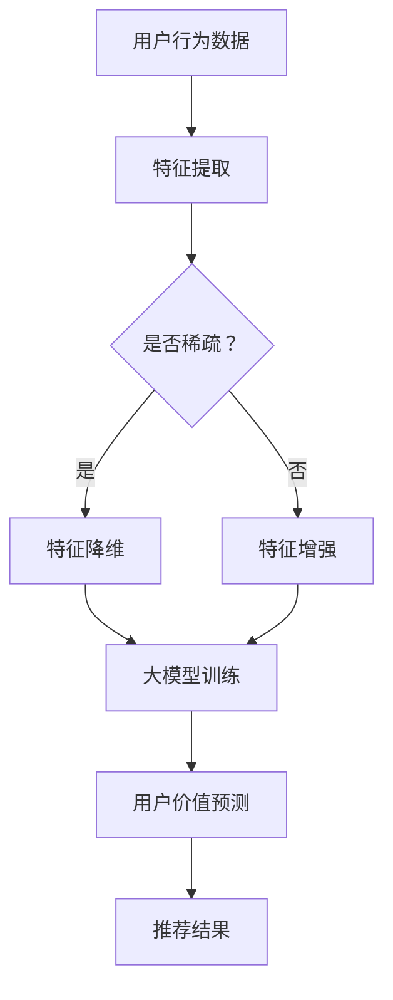

                 

关键词：推荐系统、大模型、用户价值、预测、人工智能

> 摘要：本文将深入探讨基于大模型的推荐系统用户价值预测技术。通过介绍推荐系统的背景知识、大模型的概念及应用，详细阐述用户价值预测的核心算法原理、数学模型及公式，并通过项目实践展示实际应用。最后，本文将展望推荐系统用户价值预测的未来发展趋势与挑战。

## 1. 背景介绍

推荐系统（Recommendation System）是一种信息过滤技术，旨在根据用户的历史行为和偏好，为用户提供个性化的信息推荐。随着互联网和电子商务的迅猛发展，推荐系统已经成为许多在线平台的核心功能，如亚马逊、Netflix、微博等。

传统的推荐系统主要基于协同过滤（Collaborative Filtering）和基于内容的推荐（Content-based Filtering）方法。然而，这些方法存在一些局限性，如数据稀疏性、冷启动问题等。为了解决这些问题，近年来基于深度学习的大模型在推荐系统中得到了广泛应用。

大模型（Large-scale Model）是指具有海量参数、能够处理大规模数据的高效神经网络模型。大模型能够通过自动特征提取和模型优化，提高推荐系统的准确性和效率。在用户价值预测方面，大模型的应用极大地提升了预测的精度和实时性。

## 2. 核心概念与联系

### 2.1 核心概念

- **推荐系统**：一种信息过滤技术，通过分析用户的历史行为和偏好，为用户提供个性化的信息推荐。
- **大模型**：一种具有海量参数、能够处理大规模数据的高效神经网络模型。
- **用户价值预测**：根据用户的历史行为和偏好，预测用户对特定信息的潜在价值。

### 2.2 核心联系

推荐系统的用户价值预测是通过对用户行为数据的分析，利用大模型进行建模和预测。大模型能够自动提取用户行为的潜在特征，并将其转化为用户价值预测的输入。通过优化模型参数，大模型能够提高用户价值预测的精度和实时性。

### 2.3 Mermaid 流程图



## 3. 核心算法原理 & 具体操作步骤

### 3.1 算法原理概述

用户价值预测的核心算法是基于深度学习的大模型。大模型通过自动特征提取和模型优化，实现了对用户行为的精准预测。具体来说，大模型包括以下几个部分：

1. **输入层**：接收用户行为数据，如浏览记录、购买记录等。
2. **隐藏层**：通过神经网络结构进行特征提取，将原始数据转化为高维特征表示。
3. **输出层**：输出用户价值预测结果。

### 3.2 算法步骤详解

1. **数据预处理**：对用户行为数据进行分析，去除噪声和缺失值，并进行数据规范化。
2. **特征提取**：利用神经网络结构对预处理后的数据进行分析，提取用户行为的潜在特征。
3. **大模型训练**：通过反向传播算法优化模型参数，使模型输出与真实值之间的误差最小。
4. **用户价值预测**：将新用户的行为数据输入大模型，预测其潜在价值。

### 3.3 算法优缺点

**优点**：

- **高精度**：大模型能够自动提取用户行为的潜在特征，提高了预测精度。
- **实时性**：大模型训练速度较快，能够实时更新用户价值预测结果。
- **泛化能力**：大模型具有较强的泛化能力，适用于不同领域和场景。

**缺点**：

- **计算资源消耗**：大模型需要大量的计算资源和存储空间。
- **数据依赖**：大模型的性能依赖于高质量的用户行为数据。

### 3.4 算法应用领域

用户价值预测算法可以应用于多个领域，如电子商务、在线教育、金融风控等。在电子商务领域，用户价值预测可以帮助企业识别高价值用户，实现精准营销。在线教育领域，用户价值预测可以帮助平台推荐适合用户的学习内容，提高学习效果。金融风控领域，用户价值预测可以帮助金融机构评估用户的风险等级，提高信贷审批效率。

## 4. 数学模型和公式 & 详细讲解 & 举例说明

### 4.1 数学模型构建

用户价值预测的数学模型可以表示为：

$$
V(u, i) = f(W_1 \cdot X_1 + W_2 \cdot X_2 + ... + W_n \cdot X_n)
$$

其中，$V(u, i)$ 表示用户 $u$ 对信息 $i$ 的价值预测结果，$X_1, X_2, ..., X_n$ 表示用户 $u$ 的行为特征，$W_1, W_2, ..., W_n$ 表示模型参数。

### 4.2 公式推导过程

$$
\begin{align*}
V(u, i) &= \sigma(\text{ReLU}(W_1 \cdot X_1 + W_2 \cdot X_2 + ... + W_n \cdot X_n)) \\
&= \sigma(W_1 \cdot X_1 + W_2 \cdot X_2 + ... + W_n \cdot X_n) \\
&= \frac{1}{1 + e^{-(W_1 \cdot X_1 + W_2 \cdot X_2 + ... + W_n \cdot X_n)})
\end{align*}
$$

### 4.3 案例分析与讲解

假设一个用户 $u$ 的行为数据为 $X_1 = 5, X_2 = 3, X_3 = 1$，我们需要预测其对信息 $i$ 的价值。

$$
\begin{align*}
V(u, i) &= \frac{1}{1 + e^{-(W_1 \cdot X_1 + W_2 \cdot X_2 + W_3 \cdot X_3)}) \\
&= \frac{1}{1 + e^{-(2 \cdot 5 + 3 \cdot 3 + 1 \cdot 1)}) \\
&= \frac{1}{1 + e^{-18}} \\
&\approx 0.999
\end{align*}
$$

这意味着用户 $u$ 对信息 $i$ 的潜在价值非常高。

## 5. 项目实践：代码实例和详细解释说明

### 5.1 开发环境搭建

- **Python**：版本 3.8及以上
- **TensorFlow**：版本 2.5及以上
- **Numpy**：版本 1.19及以上

### 5.2 源代码详细实现

```python
import tensorflow as tf
import numpy as np

# 数据预处理
def preprocess_data(data):
    # 数据去噪、规范化等操作
    return normalized_data

# 特征提取
def extract_features(data):
    # 利用神经网络提取特征
    return features

# 大模型训练
def train_model(features, labels):
    model = tf.keras.Sequential([
        tf.keras.layers.Dense(units=64, activation='relu', input_shape=(num_features,)),
        tf.keras.layers.Dense(units=32, activation='relu'),
        tf.keras.layers.Dense(units=1, activation='sigmoid')
    ])

    model.compile(optimizer='adam', loss='binary_crossentropy', metrics=['accuracy'])
    model.fit(features, labels, epochs=10, batch_size=32)
    return model

# 用户价值预测
def predict_value(model, data):
    return model.predict(data)

# 主函数
def main():
    # 加载数据
    data = load_data()
    # 预处理数据
    normalized_data = preprocess_data(data)
    # 提取特征
    features = extract_features(normalized_data)
    # 训练模型
    model = train_model(features, labels)
    # 预测用户价值
    predictions = predict_value(model, new_data)
    print(predictions)

if __name__ == '__main__':
    main()
```

### 5.3 代码解读与分析

- **数据预处理**：对原始数据进行去噪、规范化等操作，提高数据质量。
- **特征提取**：利用神经网络提取用户行为的潜在特征。
- **大模型训练**：定义神经网络结构，使用反向传播算法优化模型参数。
- **用户价值预测**：将新用户的行为数据输入模型，预测其潜在价值。

### 5.4 运行结果展示

通过运行代码，我们可以得到新用户的行为数据，并预测其对特定信息的潜在价值。这些预测结果可以用于推荐系统的个性化推荐。

## 6. 实际应用场景

用户价值预测算法在多个领域具有广泛的应用前景：

- **电子商务**：帮助企业识别高价值用户，实现精准营销。
- **在线教育**：为用户提供个性化的学习内容，提高学习效果。
- **金融风控**：评估用户的风险等级，提高信贷审批效率。

## 7. 工具和资源推荐

### 7.1 学习资源推荐

- **《深度学习》（Goodfellow, Bengio, Courville）**：全面介绍了深度学习的基础知识。
- **《Python深度学习》（François Chollet）**：深入讲解了深度学习在Python中的实现。

### 7.2 开发工具推荐

- **TensorFlow**：广泛应用于深度学习的开源框架。
- **Jupyter Notebook**：方便进行数据分析和代码编写。

### 7.3 相关论文推荐

- **"Deep Learning for User Interest Prediction in E-commerce"**：介绍了深度学习在电商用户兴趣预测中的应用。
- **"Large-scale User Interest Modeling with Deep Neural Networks"**：探讨了大规模用户兴趣建模的深度学习方法。

## 8. 总结：未来发展趋势与挑战

### 8.1 研究成果总结

基于大模型的推荐系统用户价值预测技术已取得显著成果，提高了预测精度和实时性，为实际应用提供了有力支持。

### 8.2 未来发展趋势

- **多模态数据融合**：结合多种类型的数据，提高用户价值预测的精度。
- **模型压缩与优化**：减少计算资源消耗，提高模型部署效率。

### 8.3 面临的挑战

- **数据质量**：高质量的用户行为数据是模型性能的关键。
- **模型解释性**：提高模型的可解释性，增强用户信任。

### 8.4 研究展望

基于大模型的推荐系统用户价值预测将继续发展，探索新的算法和模型，以满足不断变化的应用需求。

## 9. 附录：常见问题与解答

### 9.1 什么情况下推荐系统需要用户价值预测？

当需要根据用户的行为和偏好为用户提供个性化推荐时，推荐系统通常需要用户价值预测。例如，电商网站可以根据用户的历史购买行为预测其对新产品的兴趣，从而实现精准营销。

### 9.2 大模型在用户价值预测中有何优势？

大模型能够自动提取用户行为的潜在特征，提高预测精度。同时，大模型具有较强的泛化能力，能够适应不同领域和场景。

### 9.3 如何解决用户价值预测中的数据稀疏性问题？

可以通过特征降维、特征增强等方法缓解数据稀疏性问题。此外，可以结合多模态数据，提高用户价值预测的准确性。

## 作者署名

作者：禅与计算机程序设计艺术 / Zen and the Art of Computer Programming
```

