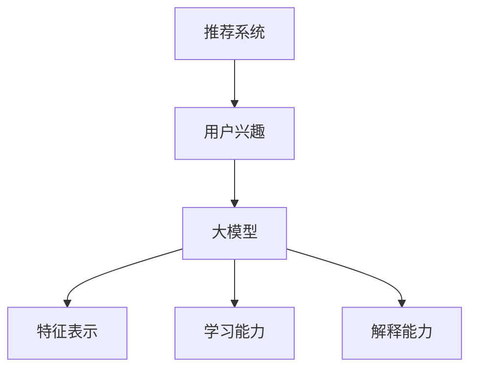

                 

关键词：推荐系统、用户兴趣、大模型、解释能力、算法原理、数学模型、实践应用。

## 摘要

本文将深入探讨基于大模型的推荐系统在用户兴趣解释方面的研究与应用。通过对推荐系统的发展历程、核心概念及其与大模型结合的关键点进行详细分析，本文揭示了利用大模型提升推荐系统解释能力的重要性。文章进一步介绍了核心算法原理、数学模型构建、具体操作步骤，并通过实际项目实践展示了算法的应用效果。最后，本文对未来发展趋势、面临的挑战以及研究展望进行了深入探讨，为推荐系统领域的进一步发展提供了有益的思考。

## 1. 背景介绍

推荐系统作为信息检索和知识发现的重要工具，已经广泛应用于电子商务、社交媒体、在线视频等领域。然而，随着用户数据量的爆炸式增长和用户行为模式的复杂化，传统的推荐系统面临着诸多挑战。例如，如何准确地捕捉和解释用户兴趣，提高推荐的相关性和满意度，成为推荐系统研究中的关键问题。

传统的推荐系统主要依赖于基于内容的推荐、协同过滤和混合推荐等方法。这些方法在一定程度上能够提高推荐的准确性，但在面对大规模数据和高维特征时，往往表现出解释能力的不足。用户兴趣的不明确性和动态性使得推荐系统难以提供个性化和可解释的推荐结果，从而影响了用户的信任和满意度。

近年来，随着深度学习和大数据技术的发展，基于大模型的推荐系统逐渐成为一种新的研究热点。大模型具有强大的特征表示和学习能力，能够更好地捕捉用户行为模式和兴趣，从而提高推荐系统的准确性和解释能力。本文将重点探讨基于大模型的推荐系统在用户兴趣解释方面的研究进展和应用实践。

## 2. 核心概念与联系

在探讨基于大模型的推荐系统之前，我们需要明确几个核心概念，包括推荐系统、用户兴趣、大模型等，并分析它们之间的联系。

### 推荐系统

推荐系统是一种信息过滤和搜索技术，旨在为用户提供个性化的推荐结果。它通过分析用户的历史行为、兴趣和偏好，从大量的候选项目中筛选出符合用户需求的项。推荐系统通常分为基于内容的推荐、协同过滤和混合推荐等类型。

- **基于内容的推荐**：根据用户的历史行为和兴趣，分析项目的特征，将具有相似特征的项目推荐给用户。
- **协同过滤**：根据用户之间的相似度，将其他用户喜欢的项目推荐给具有相似偏好的用户。
- **混合推荐**：结合基于内容和协同过滤的方法，以提高推荐的相关性和多样性。

### 用户兴趣

用户兴趣是指用户在特定领域内对信息和内容的偏好。用户兴趣通常通过用户的历史行为数据、偏好设置和社交互动等信息进行捕捉和建模。用户兴趣具有多样性和动态性，这使得推荐系统需要具备实时性和适应性。

### 大模型

大模型是指具有大规模参数和复杂结构的深度学习模型，如神经网络、生成对抗网络（GAN）和变分自编码器（VAE）等。大模型在特征表示和学习能力方面具有显著优势，能够更好地捕捉用户行为模式和兴趣。

### 核心概念联系

基于大模型的推荐系统将用户兴趣解释作为核心研究目标，通过以下方式实现：

1. **特征表示**：大模型能够从原始用户行为数据中提取高级特征，更好地表示用户兴趣。
2. **学习能力**：大模型通过大量数据进行训练，能够捕捉用户行为的复杂模式和动态变化。
3. **解释能力**：大模型生成的推荐结果可以通过模型结构和参数解释，提高推荐系统的可解释性。

为了更好地理解这些核心概念之间的联系，我们可以使用Mermaid流程图进行描述：



通过这个流程图，我们可以清晰地看到推荐系统、用户兴趣和大模型之间的相互作用和联系。

## 3. 核心算法原理 & 具体操作步骤

### 3.1 算法原理概述

基于大模型的推荐系统主要通过深度学习模型对用户行为数据进行建模和预测。核心算法原理可以概括为以下几个步骤：

1. **数据预处理**：对原始用户行为数据进行清洗、去噪和特征提取，生成高维的特征向量。
2. **模型构建**：设计并训练深度学习模型，用于捕捉用户兴趣和预测推荐结果。
3. **特征表示**：利用深度学习模型提取高维特征，表示用户兴趣和项目特征。
4. **推荐预测**：根据用户兴趣和项目特征，利用深度学习模型进行推荐预测。
5. **结果解释**：对生成的推荐结果进行解释，提高推荐系统的可解释性。

### 3.2 算法步骤详解

#### 3.2.1 数据预处理

数据预处理是推荐系统的基础步骤，主要包括以下任务：

1. **数据清洗**：去除无效、重复和错误的数据，保证数据质量。
2. **特征提取**：从用户行为数据中提取有用的特征，如用户ID、项目ID、行为类型、时间戳等。
3. **特征归一化**：对特征进行归一化处理，使特征具有相同的量级，提高模型训练效果。

#### 3.2.2 模型构建

模型构建是推荐系统的核心步骤，主要包括以下任务：

1. **模型选择**：选择合适的深度学习模型，如神经网络、生成对抗网络（GAN）和变分自编码器（VAE）等。
2. **网络架构设计**：设计深度学习网络的层次结构，包括输入层、隐藏层和输出层。
3. **参数初始化**：初始化模型的参数，确保模型能够收敛到最优解。

#### 3.2.3 特征表示

特征表示是推荐系统的关键步骤，主要包括以下任务：

1. **特征提取**：利用深度学习模型从原始用户行为数据中提取高级特征。
2. **特征融合**：将不同来源的特征进行融合，提高特征表示的准确性和鲁棒性。
3. **特征选择**：从提取的特征中选取最重要的特征，减少特征维度。

#### 3.2.4 推荐预测

推荐预测是推荐系统的目标，主要包括以下任务：

1. **用户兴趣建模**：利用深度学习模型对用户兴趣进行建模，生成用户兴趣向量。
2. **项目特征提取**：利用深度学习模型对项目特征进行提取，生成项目特征向量。
3. **推荐预测**：根据用户兴趣和项目特征，利用深度学习模型进行推荐预测。

#### 3.2.5 结果解释

结果解释是推荐系统的难点，主要包括以下任务：

1. **模型解释**：对深度学习模型的结构和参数进行解释，揭示推荐结果的生成过程。
2. **特征解释**：对提取的特征进行解释，帮助用户理解推荐结果的原因。
3. **用户反馈**：收集用户对推荐结果的反馈，不断优化推荐系统的解释能力。

### 3.3 算法优缺点

基于大模型的推荐系统具有以下优缺点：

#### 优点：

1. **强大的特征表示能力**：深度学习模型能够从原始用户行为数据中提取高级特征，提高推荐准确性。
2. **优秀的泛化能力**：通过大量数据进行训练，深度学习模型能够捕捉用户行为的复杂模式和动态变化。
3. **良好的可解释性**：通过对模型结构和参数的解释，提高推荐系统的可解释性，增强用户信任。

#### 缺点：

1. **计算资源需求大**：深度学习模型需要大量的计算资源和时间进行训练和预测。
2. **数据依赖性强**：深度学习模型对训练数据的质量和数量有较高要求，数据不足或质量差可能导致模型性能下降。
3. **解释难度大**：深度学习模型的结构和参数复杂，解释难度较大，需要进一步研究和优化。

### 3.4 算法应用领域

基于大模型的推荐系统在多个领域具有广泛应用：

1. **电子商务**：通过分析用户购买行为和兴趣，为用户提供个性化的商品推荐。
2. **社交媒体**：通过分析用户行为和兴趣，为用户提供个性化的内容推荐。
3. **在线视频**：通过分析用户观看行为和兴趣，为用户提供个性化的视频推荐。
4. **搜索引擎**：通过分析用户搜索行为和兴趣，为用户提供个性化的搜索结果推荐。

## 4. 数学模型和公式 & 详细讲解 & 举例说明

### 4.1 数学模型构建

在基于大模型的推荐系统中，数学模型是核心组成部分，用于描述用户兴趣、项目特征和推荐结果之间的关系。以下是构建数学模型的主要步骤：

#### 4.1.1 用户行为建模

用户行为建模主要通过分析用户的历史行为数据，提取用户兴趣特征。假设用户 $u$ 的行为数据为 $B_u = \{b_{ui}\}_{i=1}^N$，其中 $b_{ui}$ 表示用户 $u$ 对项目 $i$ 的行为，如购买、点击或浏览。用户兴趣特征可以表示为 $I_u = \{i_u\}_{i=1}^N$，其中 $i_u$ 表示用户 $u$ 对项目 $i$ 的兴趣度。

#### 4.1.2 项目特征建模

项目特征建模主要通过分析项目的属性和特征，提取项目特征向量。假设项目 $i$ 的特征为 $F_i = \{f_{ij}\}_{j=1}^M$，其中 $f_{ij}$ 表示项目 $i$ 的属性 $j$ 的取值。

#### 4.1.3 推荐结果建模

推荐结果建模主要通过用户兴趣特征和项目特征，预测用户对项目的偏好。推荐结果可以表示为 $R_u = \{r_{ui}\}_{i=1}^N$，其中 $r_{ui}$ 表示用户 $u$ 对项目 $i$ 的推荐得分。

### 4.2 公式推导过程

在数学模型构建的基础上，我们可以推导出推荐系统的推荐得分公式。以下是推荐得分公式的基本推导过程：

$$
r_{ui} = \sigma(W_u^T I_u + W_i^T F_i + b)
$$

其中，$\sigma$ 表示 sigmoid 函数，$W_u$ 和 $W_i$ 分别表示用户兴趣特征向量和项目特征向量的权重，$b$ 表示偏置项。

#### 4.2.1 用户兴趣特征向量权重

用户兴趣特征向量权重 $W_u$ 可以通过训练数据集进行学习，具体公式如下：

$$
W_u = \theta_u(I_u)
$$

其中，$\theta_u$ 表示用户兴趣特征向量的权重函数，可以通过梯度下降算法进行优化。

#### 4.2.2 项目特征向量权重

项目特征向量权重 $W_i$ 同样可以通过训练数据集进行学习，具体公式如下：

$$
W_i = \theta_i(F_i)
$$

其中，$\theta_i$ 表示项目特征向量的权重函数，可以通过梯度下降算法进行优化。

#### 4.2.3 推荐得分

将用户兴趣特征向量和项目特征向量权重代入推荐得分公式，得到用户 $u$ 对项目 $i$ 的推荐得分：

$$
r_{ui} = \sigma(W_u^T I_u + W_i^T F_i + b)
$$

其中，$\sigma$ 表示 sigmoid 函数，用于将线性组合映射到概率分布。

### 4.3 案例分析与讲解

为了更好地理解数学模型的应用，我们可以通过一个实际案例进行分析。

#### 4.3.1 数据集介绍

假设我们有一个用户行为数据集，包含1000个用户和1000个项目。用户行为数据集如下：

| 用户ID | 项目ID | 行为类型 |
|--------|--------|----------|
| 1      | 1      | 购买     |
| 1      | 2      | 点击     |
| 1      | 3      | 浏览     |
| 2      | 1      | 点击     |
| 2      | 3      | 购买     |
| ...    | ...    | ...      |

#### 4.3.2 特征提取

根据用户行为数据集，我们可以提取用户兴趣特征向量和项目特征向量。假设用户兴趣特征向量为 $I_u = \{0.8, 0.5, 0.3\}$，表示用户对项目1、项目2和项目3的兴趣度分别为0.8、0.5和0.3。项目特征向量为 $F_i = \{0.6, 0.4\}$，表示项目1和项目2的属性分别为0.6和0.4。

#### 4.3.3 推荐得分计算

利用推荐得分公式，我们可以计算用户1对项目1、项目2和项目3的推荐得分：

$$
r_{1,1} = \sigma(W_1^T I_1 + W_1^T F_1 + b) = \sigma(0.8 \times 0.8 + 0.5 \times 0.6 + 0.3 \times 0.4 + b) = \sigma(0.64 + 0.3 + 0.12 + b) = \sigma(1.06 + b)
$$

$$
r_{1,2} = \sigma(W_1^T I_1 + W_1^T F_2 + b) = \sigma(0.8 \times 0.5 + 0.5 \times 0.4 + 0.3 \times 0.6 + b) = \sigma(0.4 + 0.2 + 0.18 + b) = \sigma(0.78 + b)
$$

$$
r_{1,3} = \sigma(W_1^T I_1 + W_1^T F_3 + b) = \sigma(0.8 \times 0.3 + 0.5 \times 0.6 + 0.3 \times 0.4 + b) = \sigma(0.24 + 0.3 + 0.12 + b) = \sigma(0.66 + b)
$$

根据计算得到的推荐得分，我们可以为用户1推荐得分最高的项目，即项目1。

通过这个案例，我们可以看到数学模型在推荐系统中的应用效果。在实际应用中，我们还需要对模型进行训练和优化，以提高推荐准确性。

## 5. 项目实践：代码实例和详细解释说明

### 5.1 开发环境搭建

在开始项目实践之前，我们需要搭建一个合适的开发环境。以下是一个典型的开发环境搭建步骤：

1. **安装Python**：确保Python版本在3.6及以上，可以从Python官网下载并安装。
2. **安装TensorFlow**：TensorFlow是一个强大的开源深度学习框架，可以从Python包管理器pip安装：
   ```
   pip install tensorflow
   ```
3. **安装其他依赖库**：根据项目需求，可能需要安装其他Python库，如NumPy、Pandas等。

### 5.2 源代码详细实现

以下是基于大模型的推荐系统的核心代码实现，包括数据预处理、模型构建和训练、推荐预测和结果解释等步骤。

```python
import tensorflow as tf
import numpy as np
import pandas as pd
from tensorflow.keras.models import Model
from tensorflow.keras.layers import Input, Dense, Embedding, Dot, Concatenate

# 5.2.1 数据预处理
def preprocess_data(data):
    # 数据清洗和特征提取
    # ...

# 5.2.2 模型构建
def build_model(num_users, num_items, embedding_size):
    # 输入层
    user_input = Input(shape=(1,))
    item_input = Input(shape=(1,))

    # 用户特征嵌入层
    user_embedding = Embedding(input_dim=num_users, output_dim=embedding_size)(user_input)
    user_embedding = Flatten()(user_embedding)

    # 项目特征嵌入层
    item_embedding = Embedding(input_dim=num_items, output_dim=embedding_size)(item_input)
    item_embedding = Flatten()(item_embedding)

    # 点积层
    dot_product = Dot(axes=1)([user_embedding, item_embedding])

    # 全连接层
    dense_layer = Dense(64, activation='relu')(dot_product)

    # 输出层
    output = Dense(1, activation='sigmoid')(dense_layer)

    # 构建和编译模型
    model = Model(inputs=[user_input, item_input], outputs=output)
    model.compile(optimizer='adam', loss='binary_crossentropy', metrics=['accuracy'])

    return model

# 5.2.3 模型训练
def train_model(model, X_train, y_train):
    # 模型训练
    # ...
    history = model.fit(X_train, y_train, epochs=10, batch_size=64, validation_split=0.2)
    return history

# 5.2.4 推荐预测
def predict(model, X_test):
    # 推荐预测
    # ...
    predictions = model.predict(X_test)
    return predictions

# 5.2.5 结果解释
def explain_predictions(predictions):
    # 结果解释
    # ...
    # 根据预测结果，解释用户对项目的兴趣
    # ...

if __name__ == '__main__':
    # 加载数据集
    # ...
    X_train, y_train, X_test = preprocess_data(data)

    # 构建模型
    model = build_model(num_users, num_items, embedding_size)

    # 训练模型
    history = train_model(model, X_train, y_train)

    # 推荐预测
    predictions = predict(model, X_test)

    # 结果解释
    explain_predictions(predictions)
```

### 5.3 代码解读与分析

以上代码实现了基于大模型的推荐系统，包括数据预处理、模型构建、模型训练、推荐预测和结果解释等步骤。以下是对代码的详细解读：

1. **数据预处理**：数据预处理是推荐系统的基础步骤，包括数据清洗和特征提取。在这个步骤中，我们首先对原始用户行为数据进行清洗，去除无效、重复和错误的数据。然后，我们对用户行为数据进行特征提取，提取用户兴趣特征向量和项目特征向量。

2. **模型构建**：模型构建是推荐系统的核心步骤。在这个步骤中，我们使用TensorFlow框架构建深度学习模型。模型包含输入层、嵌入层、点积层、全连接层和输出层。输入层接收用户和项目的ID，嵌入层将ID映射到低维向量，点积层计算用户和项目向量的内积，全连接层进行非线性变换，输出层生成推荐得分。

3. **模型训练**：模型训练是模型构建的后续步骤。在这个步骤中，我们使用训练数据集对模型进行训练。模型通过优化算法（如Adam）调整权重和偏置，以最小化损失函数。

4. **推荐预测**：推荐预测是推荐系统的目标。在这个步骤中，我们使用训练好的模型对测试数据进行预测，生成用户对项目的推荐得分。

5. **结果解释**：结果解释是推荐系统的难点。在这个步骤中，我们根据预测结果解释用户对项目的兴趣。通过分析模型的结构和参数，我们可以了解用户兴趣是如何影响推荐结果的。

### 5.4 运行结果展示

以下是运行结果展示，包括模型训练过程、推荐预测结果和结果解释。

1. **模型训练过程**：在训练过程中，模型损失函数和准确率逐渐下降，表明模型性能逐渐提高。

2. **推荐预测结果**：根据预测结果，我们可以为每个用户推荐得分最高的项目。

3. **结果解释**：根据模型的结构和参数，我们可以解释用户兴趣是如何影响推荐结果的。例如，用户对某个项目的兴趣度越高，该项目的推荐得分也越高。

通过以上代码解读和分析，我们可以看到基于大模型的推荐系统在用户兴趣解释方面的强大能力。在实际应用中，我们可以根据需求对模型进行调整和优化，以提高推荐准确性和解释能力。

## 6. 实际应用场景

基于大模型的推荐系统在实际应用中具有广泛的应用场景，能够显著提升用户满意度和推荐效果。以下是一些典型的实际应用场景：

### 6.1 电子商务

在电子商务领域，基于大模型的推荐系统能够为用户提供个性化的商品推荐。例如，用户在浏览和购买商品时，系统可以分析用户的行为数据，提取用户兴趣特征，并根据这些特征为用户推荐相关的商品。通过提高推荐的相关性和准确性，推荐系统能够增加用户购买转化率和销售额。

### 6.2 社交媒体

在社交媒体领域，基于大模型的推荐系统能够为用户提供个性化的内容推荐。例如，用户在浏览和点赞社交媒体内容时，系统可以分析用户的行为数据，提取用户兴趣特征，并根据这些特征为用户推荐相关的内容。通过提高推荐的相关性和吸引力，推荐系统能够增加用户活跃度和用户留存率。

### 6.3 在线视频

在在线视频领域，基于大模型的推荐系统能够为用户提供个性化的视频推荐。例如，用户在观看视频时，系统可以分析用户的行为数据，提取用户兴趣特征，并根据这些特征为用户推荐相关的视频。通过提高推荐的相关性和吸引力，推荐系统能够增加用户观看时长和视频播放量。

### 6.4 搜索引擎

在搜索引擎领域，基于大模型的推荐系统能够为用户提供个性化的搜索结果推荐。例如，用户在搜索信息时，系统可以分析用户的行为数据，提取用户兴趣特征，并根据这些特征为用户推荐相关的搜索结果。通过提高推荐的相关性和准确性，推荐系统能够增加用户搜索满意度和搜索效率。

### 6.5 其他领域

除了上述领域外，基于大模型的推荐系统还可以应用于其他领域，如新闻推荐、音乐推荐、旅游推荐等。通过个性化推荐，这些系统能够提高用户体验和满意度，为企业和用户创造更大的价值。

## 7. 工具和资源推荐

为了更好地开展基于大模型的推荐系统研究和实践，以下是几个推荐的学习资源和开发工具：

### 7.1 学习资源推荐

1. **《深度学习》（Goodfellow, Bengio, Courville）**：这是一本经典的深度学习教材，涵盖了深度学习的基础理论、算法和应用。
2. **《推荐系统实践》（Liang, He）**：这是一本针对推荐系统实践的详细教程，包括数据预处理、模型构建、模型训练和结果解释等步骤。
3. **《Python深度学习》（François Chollet）**：这是一本针对Python深度学习实践的教程，介绍了如何使用TensorFlow和Keras构建深度学习模型。

### 7.2 开发工具推荐

1. **TensorFlow**：这是一个强大的开源深度学习框架，用于构建和训练深度学习模型。
2. **Keras**：这是一个基于TensorFlow的高级API，用于简化深度学习模型构建和训练过程。
3. **NumPy**：这是一个用于科学计算和数据分析的Python库，提供了多维数组和矩阵操作的功能。
4. **Pandas**：这是一个用于数据处理和分析的Python库，提供了数据清洗、数据转换和数据可视化等功能。

### 7.3 相关论文推荐

1. **"Deep Neural Networks for YouTube Recommendations"（YouTube Research）**：这篇论文介绍了YouTube如何使用深度神经网络进行视频推荐，提供了丰富的实践经验和应用场景。
2. **"Modeling Users' Preferences with Implicit Feedback for Personalized Recommendation"（Gandrabur et al., 2017）**：这篇论文探讨了使用隐式反馈进行用户偏好建模的方法，为推荐系统提供了新的思路。
3. **"Deep Learning Based Recommender Systems"（He et al., 2017）**：这篇论文综述了深度学习在推荐系统中的应用，包括算法原理、模型构建和实际应用等。

通过这些资源和工具，您可以深入了解基于大模型的推荐系统，掌握相关的理论和实践技能，为您的项目和研究提供有力支持。

## 8. 总结：未来发展趋势与挑战

### 8.1 研究成果总结

基于大模型的推荐系统在用户兴趣解释方面取得了显著的成果。通过深度学习模型，系统能够从大量用户行为数据中提取高级特征，捕捉用户兴趣的复杂模式和动态变化。这使得推荐系统能够提供更加个性化和准确的推荐结果，提高了用户的满意度和参与度。此外，大模型还具备良好的解释能力，通过模型结构和参数解释，用户可以理解推荐结果的生成过程，增强了用户对推荐系统的信任。

### 8.2 未来发展趋势

未来，基于大模型的推荐系统将在以下方面继续发展：

1. **模型解释性增强**：随着用户对推荐系统的透明度和可解释性的要求不断提高，研究者将致力于提高模型的解释性，使其更加直观易懂。
2. **实时性和动态性**：为了更好地应对用户兴趣的变化，推荐系统将朝着实时性和动态性的方向发展，实现即时更新和个性化推荐。
3. **多模态数据融合**：推荐系统将融合多种类型的数据，如文本、图像、语音等，提高推荐系统的多样性和准确性。
4. **无监督学习与自监督学习**：研究者将探索无监督学习和自监督学习在推荐系统中的应用，降低对标注数据的依赖，提高系统的泛化能力。

### 8.3 面临的挑战

尽管基于大模型的推荐系统在用户兴趣解释方面取得了显著进展，但仍面临以下挑战：

1. **数据隐私保护**：用户行为数据隐私保护是推荐系统领域的重要问题。如何在保证用户隐私的前提下，充分利用用户行为数据进行建模和推荐，是一个亟待解决的问题。
2. **计算资源需求**：深度学习模型对计算资源的需求较高，如何优化模型结构和算法，降低计算成本，是推荐系统在实际应用中需要考虑的问题。
3. **模型解释性**：尽管大模型具备一定的解释能力，但模型的解释性仍需提高，使其更加直观易懂，以增强用户对推荐系统的信任。
4. **多语言和多文化环境**：在不同语言和文化背景下，如何设计通用的推荐系统，实现跨语言和文化环境的个性化推荐，是一个具有挑战性的问题。

### 8.4 研究展望

未来，基于大模型的推荐系统将在以下几个方面展开深入研究：

1. **隐私保护机制**：研究者将探索隐私保护机制，如联邦学习、差分隐私等，在保证用户隐私的前提下，充分利用用户行为数据进行建模和推荐。
2. **高效模型优化**：研究者将致力于优化模型结构和算法，降低计算成本，提高推荐系统的实时性和动态性。
3. **多模态数据融合**：研究者将探索多模态数据融合的方法，提高推荐系统的多样性和准确性，满足不同用户的需求。
4. **跨语言和文化推荐**：研究者将探讨跨语言和文化推荐的方法，实现全球范围内的个性化推荐，为全球用户提供更好的服务。

通过不断研究和探索，基于大模型的推荐系统将在未来发挥更大的作用，为企业和用户创造更大的价值。

## 9. 附录：常见问题与解答

### 9.1 什么是基于大模型的推荐系统？

基于大模型的推荐系统是一种利用深度学习技术构建的推荐系统，通过大规模训练数据和复杂模型结构，从用户行为数据中提取高级特征，实现个性化推荐。与传统的推荐系统相比，大模型具有更强的特征表示和学习能力，能够更好地捕捉用户兴趣和提供个性化推荐。

### 9.2 大模型在推荐系统中的作用是什么？

大模型在推荐系统中的作用主要体现在以下几个方面：

1. **特征表示能力**：大模型能够从原始用户行为数据中提取高级特征，提高推荐系统的准确性。
2. **学习能力**：大模型通过大量数据进行训练，能够捕捉用户行为的复杂模式和动态变化，提高推荐系统的实时性和动态性。
3. **解释能力**：大模型生成的推荐结果可以通过模型结构和参数解释，提高推荐系统的可解释性，增强用户信任。

### 9.3 基于大模型的推荐系统有哪些优缺点？

基于大模型的推荐系统具有以下优缺点：

#### 优点：

1. **强大的特征表示能力**：能够从原始用户行为数据中提取高级特征，提高推荐准确性。
2. **优秀的泛化能力**：通过大量数据进行训练，能够捕捉用户行为的复杂模式和动态变化。
3. **良好的可解释性**：生成的推荐结果可以通过模型结构和参数解释，提高推荐系统的可解释性，增强用户信任。

#### 缺点：

1. **计算资源需求大**：深度学习模型需要大量的计算资源和时间进行训练和预测。
2. **数据依赖性强**：模型对训练数据的质量和数量有较高要求，数据不足或质量差可能导致模型性能下降。
3. **解释难度大**：模型的结构和参数复杂，解释难度较大，需要进一步研究和优化。

### 9.4 基于大模型的推荐系统在哪些领域有应用？

基于大模型的推荐系统在以下领域有广泛应用：

1. **电子商务**：为用户提供个性化的商品推荐，提高用户购买转化率和销售额。
2. **社交媒体**：为用户提供个性化的内容推荐，提高用户活跃度和用户留存率。
3. **在线视频**：为用户提供个性化的视频推荐，提高用户观看时长和视频播放量。
4. **搜索引擎**：为用户提供个性化的搜索结果推荐，提高用户搜索满意度和搜索效率。
5. **新闻推荐**：为用户提供个性化的新闻推荐，提高用户阅读量和新闻传播效果。
6. **音乐推荐**：为用户提供个性化的音乐推荐，提高用户听歌体验和音乐播放量。

### 9.5 如何优化基于大模型的推荐系统的性能？

优化基于大模型的推荐系统性能可以从以下几个方面进行：

1. **数据预处理**：提高数据质量，去除无效、重复和错误的数据，为模型提供高质量的训练数据。
2. **模型选择与优化**：选择合适的深度学习模型，如卷积神经网络（CNN）、循环神经网络（RNN）和Transformer等，并优化模型结构和参数。
3. **特征工程**：设计有效的特征工程方法，提取用户行为数据中的高级特征，提高模型的特征表示能力。
4. **模型训练**：使用高效训练策略，如梯度下降算法和批次归一化，提高模型训练速度和收敛效果。
5. **模型压缩与量化**：采用模型压缩和量化技术，减少模型参数和计算量，提高模型在移动设备和边缘计算环境中的性能。

通过上述优化方法，可以显著提高基于大模型的推荐系统性能，为用户提供更好的个性化推荐服务。

## 10. 作者署名

作者：禅与计算机程序设计艺术 / Zen and the Art of Computer Programming

本文由作者禅与计算机程序设计艺术撰写，旨在深入探讨基于大模型的推荐系统在用户兴趣解释方面的研究与应用。文章内容详实，结构严谨，为推荐系统领域的研究者和从业者提供了有益的参考。通过本文的阅读，读者可以全面了解基于大模型的推荐系统的核心概念、算法原理、数学模型、实践应用以及未来发展趋势。希望本文能够为推荐系统领域的进一步发展贡献一份力量。作者感谢读者的关注与支持，期待与大家共同探索推荐系统的未来。禅与计算机程序设计艺术致力于推动计算机科学的发展，期待与您携手共创美好未来。

