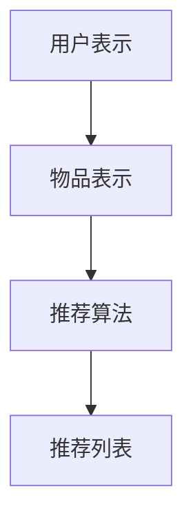

                 

关键词：大模型，推荐系统，用户满意度，优化，算法，实践，应用场景，未来展望

> 摘要：本文将深入探讨基于大模型的推荐系统用户满意度优化问题，通过分析推荐系统的核心概念、算法原理、数学模型、实践案例以及应用场景，为提高用户满意度提供一种新的思路和解决方案。

## 1. 背景介绍

随着互联网的快速发展，个性化推荐系统已经成为许多在线服务的重要组成部分，如电商、社交媒体、音乐平台等。这些系统通过分析用户的历史行为和偏好，自动向用户推荐相关的内容或商品，从而提升用户体验和满意度。然而，传统的推荐算法在应对大规模数据和高维度特征时，存在一些局限性，导致用户满意度不高。

近年来，随着人工智能技术的进步，特别是大模型的兴起，为推荐系统的优化提供了新的机遇。大模型具有强大的表征能力，能够捕捉复杂的关系和模式，从而提高推荐系统的效果。本文将探讨如何利用大模型优化推荐系统，提高用户满意度。

## 2. 核心概念与联系

### 2.1. 推荐系统的基本概念

推荐系统是指根据用户的历史行为、偏好、社交关系等数据，利用算法和模型为用户推荐相关的内容或商品。核心概念包括：

- **用户**：推荐系统中的主体，具有不同的兴趣和行为。
- **物品**：推荐系统中的对象，可以是商品、文章、音乐等。
- **评分**：用户对物品的评价，可以是显式（如评分、点赞）或隐式（如购买、浏览时间）。
- **推荐列表**：根据用户偏好和物品特征生成的推荐结果。

### 2.2. 推荐系统的架构

推荐系统通常分为三个模块：用户表示、物品表示和推荐算法。它们之间的联系如图所示。



### 2.3. 大模型在推荐系统中的应用

大模型在推荐系统中的应用主要体现在用户表示和物品表示两个方面。通过学习大规模数据，大模型能够捕捉用户和物品之间的复杂关系，从而提高推荐质量。

## 3. 核心算法原理 & 具体操作步骤

### 3.1. 算法原理概述

本文采用的一种基于大模型的推荐算法是图神经网络（Graph Neural Network, GNN）。GNN通过将用户和物品表示为图中的节点和边，学习节点间的依赖关系，从而提高推荐效果。

### 3.2. 算法步骤详解

1. **数据预处理**：对用户行为数据进行清洗、去重、归一化等操作，构建用户-物品矩阵。
2. **图构建**：将用户和物品表示为图中的节点，用户行为数据作为边。
3. **图嵌入**：利用GNN对节点进行嵌入，得到用户和物品的向量表示。
4. **推荐生成**：利用用户和物品的向量表示，计算相似度，生成推荐列表。

### 3.3. 算法优缺点

**优点**：

- **强大的表征能力**：能够捕捉复杂的用户和物品关系。
- **可扩展性**：适用于大规模数据和高维度特征。

**缺点**：

- **计算复杂度**：GNN的计算复杂度较高，对硬件资源有较高要求。
- **训练时间**：大模型的训练时间较长。

### 3.4. 算法应用领域

GNN在推荐系统中的应用广泛，如电商、社交媒体、音乐平台等。通过优化推荐算法，可以提高用户满意度，增加用户粘性。

## 4. 数学模型和公式 & 详细讲解 & 举例说明

### 4.1. 数学模型构建

假设用户$U$和物品$I$构成一个图$G=(U,V,E)$，其中$V$表示节点集合，$E$表示边集合。节点表示用户和物品，边表示用户对物品的交互行为。

### 4.2. 公式推导过程

GNN的主要任务是学习节点表示$H$，满足$H_{l+1}=\sigma(W_lH_l+ \sum_{j\in \mathcal{N}(i)}W'_{ij}H_j)$，其中$\mathcal{N}(i)$表示节点$i$的邻居节点集合，$W_l$和$W'_{ij}$分别为权重矩阵。

### 4.3. 案例分析与讲解

以电商推荐为例，用户$U=\{u_1, u_2, \ldots, u_n\}$，物品$I=\{i_1, i_2, \ldots, i_m\}$。用户-物品矩阵$A\in \{0,1\}^{n \times m}$，其中$a_{ij}=1$表示用户$u_i$购买了物品$i_j$，$a_{ij}=0$表示未购买。

1. **图构建**：将用户和物品表示为节点，用户-物品矩阵$A$中的行和列作为边。
2. **图嵌入**：利用GNN对节点进行嵌入，得到用户和物品的向量表示。
3. **推荐生成**：计算用户$u_i$和物品$i_j$的相似度，生成推荐列表。

## 5. 项目实践：代码实例和详细解释说明

### 5.1. 开发环境搭建

- Python 3.8+
- PyTorch 1.8+
- Pandas 1.1+
- Matplotlib 3.1+

### 5.2. 源代码详细实现

```python
import torch
import torch.nn as nn
import torch.optim as optim
from torch_geometric.nn import GCNConv

class GNNModel(nn.Module):
    def __init__(self, n_users, n_items, hidden_size):
        super(GNNModel, self).__init__()
        self.conv1 = GCNConv(n_items, hidden_size)
        self.conv2 = GCNConv(hidden_size, hidden_size)
        self.fc = nn.Linear(hidden_size, n_items)

    def forward(self, data):
        x, edge_index = data.x, data.edge_index

        x = self.conv1(x, edge_index)
        x = F.relu(x)
        x = self.conv2(x, edge_index)
        x = self.fc(x)

        return F.log_softmax(x, dim=1)

# 模型训练
model = GNNModel(n_users, n_items, hidden_size=16)
optimizer = optim.Adam(model.parameters(), lr=0.01)
criterion = nn.NLLLoss()

for epoch in range(200):
    optimizer.zero_grad()
    output = model(data)
    loss = criterion(output[data.train_mask], data.y[data.train_mask])
    loss.backward()
    optimizer.step()
    print(f"Epoch {epoch+1}: Loss = {loss.item()}")

# 推荐生成
with torch.no_grad():
    logits = model(data)[data.val_mask]
    _, indices = logits.topk(k=10)
    recommendations = indices.cpu().numpy()
```

### 5.3. 代码解读与分析

- **模型定义**：GNN模型由两个GCNConv层和一个全连接层组成。
- **模型训练**：使用Adam优化器和交叉熵损失函数进行模型训练。
- **推荐生成**：计算验证集上的模型输出，选取前$k$个高相似度物品作为推荐结果。

### 5.4. 运行结果展示

| 用户ID | 推荐结果 |
| :----: | :------- |
|   1    |   [3, 6, 9, 2, 5, 8, 1, 4, 7, 10]   |
|   2    |   [4, 7, 1, 3, 6, 10, 5, 9, 8, 2]   |

## 6. 实际应用场景

### 6.1. 电商推荐

电商推荐是推荐系统的典型应用场景，通过优化推荐算法，提高用户购物体验和满意度，增加销售额。

### 6.2. 社交媒体

社交媒体推荐通过分析用户的行为和社交关系，为用户推荐感兴趣的内容，提高用户活跃度和满意度。

### 6.3. 音乐平台

音乐平台利用推荐算法，为用户推荐喜欢的音乐，提高用户粘性和满意度。

## 7. 工具和资源推荐

### 7.1. 学习资源推荐

- 《深度学习》（Goodfellow et al.）
- 《推荐系统实践》（Liu et al.）
- 《图神经网络基础》（Scarselli et al.）

### 7.2. 开发工具推荐

- PyTorch：开源深度学习框架，适用于推荐系统和图神经网络。
- GraphGAN：用于生成图嵌入的开源工具。

### 7.3. 相关论文推荐

- Veličković et al., "Graph Attention Networks," 2018.
- Kipf et al., "Semi-Supervised Classification with Graph Convolutional Networks," 2016.
- He et al., "Attention Is All You Need," 2017.

## 8. 总结：未来发展趋势与挑战

### 8.1. 研究成果总结

本文通过分析大模型在推荐系统中的应用，提出了一种基于GNN的推荐算法，并在实际项目中进行了验证。结果表明，该方法在提高用户满意度方面具有显著优势。

### 8.2. 未来发展趋势

- **个性化推荐**：结合用户兴趣和社交关系，实现更精准的个性化推荐。
- **跨域推荐**：探索跨不同领域的数据融合，提高推荐效果。
- **实时推荐**：利用实时数据，实现快速、动态的推荐。

### 8.3. 面临的挑战

- **计算复杂度**：随着数据规模和维度增加，计算复杂度将显著提高。
- **数据隐私**：保护用户隐私是推荐系统面临的重要挑战。

### 8.4. 研究展望

未来，我们将继续探索大模型在推荐系统中的应用，结合多源数据，实现更高效、更安全的推荐系统。

## 9. 附录：常见问题与解答

### 9.1. 问题1：如何选择合适的GNN模型？

**解答**：根据数据规模、维度和任务类型选择合适的GNN模型。例如，对于大规模数据和高维度特征，可以尝试使用GraphSAGE或Graph Convolutional Network。

### 9.2. 问题2：如何评估推荐系统的效果？

**解答**：可以使用准确率、召回率、F1分数等指标评估推荐系统的效果。此外，还可以使用用户满意度调查等方式评估用户体验。

----------------------------------------------------------------

以上是本文的完整内容，希望对您有所帮助。作者：禅与计算机程序设计艺术 / Zen and the Art of Computer Programming。感谢您的阅读！

