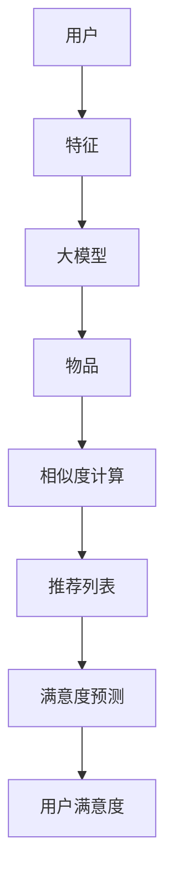

                 

关键词：大模型、推荐系统、用户满意度、预测、算法、数学模型、实践、应用场景、展望

> 摘要：本文将探讨如何利用大模型技术来预测推荐系统中用户满意度，介绍核心概念与联系，详细讲解算法原理与操作步骤，展示数学模型与公式，并分享项目实践与实际应用场景。同时，对未来的发展趋势与挑战进行分析，并提出相关的学习资源和工具推荐。

## 1. 背景介绍

随着互联网的快速发展，推荐系统已经成为各类应用的重要组成部分。从电子商务平台的商品推荐，到社交媒体的个性化内容推送，推荐系统已经在我们的日常生活中扮演了重要角色。然而，推荐系统的核心挑战之一是预测用户的满意度。用户满意度是评价推荐系统质量的重要指标，直接影响到系统的使用效果和商业价值。

传统推荐系统主要依赖于协同过滤、基于内容的推荐等算法，但这些方法存在一些局限，如数据稀疏性、冷启动问题等。随着深度学习和大模型的兴起，研究者们开始探索如何利用大模型来提高推荐系统的准确性和用户满意度。

本文旨在探讨基于大模型的推荐系统用户满意度预测方法，通过介绍核心概念与联系、详细讲解算法原理与操作步骤、展示数学模型与公式、分享项目实践与实际应用场景，以及分析未来发展趋势与挑战，为推荐系统的研究和应用提供一些有价值的参考。

## 2. 核心概念与联系

为了深入理解大模型在推荐系统用户满意度预测中的应用，我们首先需要明确一些核心概念，并分析它们之间的联系。

### 2.1 大模型

大模型是指具有大量参数和复杂结构的深度学习模型，如Transformer、BERT等。这些模型可以通过学习大规模数据集来获得强大的表征能力，从而在许多任务上取得突破性的成果。大模型在推荐系统中的应用主要是通过将用户和物品的特征转换为高维向量表示，从而实现用户和物品的相似度计算和推荐生成。

### 2.2 推荐系统

推荐系统是一种通过预测用户对物品的兴趣来推荐相关物品的技术。推荐系统的核心是算法，主要包括协同过滤、基于内容的推荐、基于模型的推荐等。这些算法通过分析用户历史行为、物品属性和用户特征，生成个性化推荐列表。推荐系统的目标是提高用户满意度，从而提高系统的使用效果和商业价值。

### 2.3 用户满意度

用户满意度是指用户对推荐系统提供的推荐结果的满意度。用户满意度可以通过多种方式测量，如用户点击率、购买率、评论评分等。用户满意度是评价推荐系统质量的重要指标，直接影响到系统的使用效果和商业价值。

### 2.4 大模型与推荐系统、用户满意度的联系

大模型与推荐系统、用户满意度之间的联系体现在以下几个方面：

1. **特征表示**：大模型可以通过学习大量数据，将用户和物品的特征转换为高维向量表示，从而提高特征表示的准确性和多样性。

2. **相似度计算**：大模型可以基于高维向量表示，计算用户和物品之间的相似度，从而生成个性化的推荐列表。

3. **满意度预测**：大模型可以通过学习用户历史行为和推荐结果，预测用户的满意度，从而优化推荐策略，提高用户满意度。

为了更直观地展示大模型在推荐系统用户满意度预测中的应用，我们使用Mermaid流程图来描述核心概念与联系。



通过上述流程，我们可以看到大模型在推荐系统用户满意度预测中的关键作用。

## 3. 核心算法原理 & 具体操作步骤

### 3.1 算法原理概述

基于大模型的推荐系统用户满意度预测算法主要分为三个阶段：特征提取、相似度计算和满意度预测。

1. **特征提取**：利用大模型（如BERT）对用户和物品进行特征提取，将用户和物品转换为高维向量表示。

2. **相似度计算**：计算用户和物品之间的相似度，生成个性化推荐列表。

3. **满意度预测**：利用用户历史行为和推荐结果，预测用户的满意度，从而优化推荐策略。

### 3.2 算法步骤详解

#### 3.2.1 特征提取

1. **用户特征提取**：使用BERT模型对用户的历史行为（如浏览记录、购买记录、评论等）进行编码，得到用户的高维向量表示。

2. **物品特征提取**：使用BERT模型对物品的属性（如标题、描述、分类等）进行编码，得到物品的高维向量表示。

#### 3.2.2 相似度计算

1. **计算用户-物品相似度**：使用余弦相似度或欧氏距离计算用户和物品之间的相似度。

2. **生成推荐列表**：根据相似度计算结果，为每个用户生成个性化推荐列表。

#### 3.2.3 满意度预测

1. **训练满意度预测模型**：利用用户历史行为和推荐结果，训练满意度预测模型（如决策树、神经网络等）。

2. **预测用户满意度**：为推荐列表中的每个物品预测用户的满意度。

### 3.3 算法优缺点

#### 3.3.1 优点

1. **高精度特征表示**：利用大模型进行特征提取，能够获得更准确和多样的用户和物品特征表示。

2. **个性化推荐**：基于用户和物品的相似度计算，生成个性化的推荐列表，提高用户满意度。

3. **满意度预测**：通过预测用户满意度，优化推荐策略，进一步提高用户满意度。

#### 3.3.2 缺点

1. **计算复杂度**：大模型的训练和推理过程需要大量计算资源，对硬件要求较高。

2. **数据需求**：大模型需要大量训练数据，对于数据稀缺的场景，效果可能不理想。

### 3.4 算法应用领域

基于大模型的推荐系统用户满意度预测算法可以应用于各种场景，如电子商务、社交媒体、新闻推荐等。以下是一些典型的应用领域：

1. **电子商务**：为用户推荐可能感兴趣的商品，提高购买转化率。

2. **社交媒体**：为用户提供个性化内容推荐，提高用户活跃度和粘性。

3. **新闻推荐**：为用户提供感兴趣的新闻内容，提高新闻阅读量。

## 4. 数学模型和公式 & 详细讲解 & 举例说明

### 4.1 数学模型构建

基于大模型的推荐系统用户满意度预测算法可以看作是一个多步骤的数学模型，包括特征提取、相似度计算和满意度预测。以下是该数学模型的构建过程：

#### 4.1.1 特征提取

用户特征向量：\( u = [u_1, u_2, ..., u_d] \)

物品特征向量：\( v = [v_1, v_2, ..., v_d] \)

其中，\( d \) 表示特征维度。

#### 4.1.2 相似度计算

相似度计算公式：\( \sim(d) = \frac{u \cdot v}{\|u\| \|v\|} \)

其中，\( \cdot \) 表示向量点积，\( \|u\| \) 和 \( \|v\| \) 分别表示向量 \( u \) 和 \( v \) 的欧氏距离。

#### 4.1.3 满意度预测

满意度预测公式：\( S = f(u, v) \)

其中，\( S \) 表示用户对物品的满意度，\( f \) 表示满意度预测函数。

### 4.2 公式推导过程

#### 4.2.1 特征提取

假设用户历史行为数据集为 \( D = \{ (u_i, v_i) | i=1,2,...,n \} \)，其中 \( u_i \) 表示用户 \( i \) 的特征向量，\( v_i \) 表示物品 \( i \) 的特征向量。

使用BERT模型对用户和物品特征进行编码，得到高维向量表示：

用户特征向量：\( u = [u_1, u_2, ..., u_d] = BERT(u_i) \)

物品特征向量：\( v = [v_1, v_2, ..., v_d] = BERT(v_i) \)

其中，\( BERT \) 表示BERT模型。

#### 4.2.2 相似度计算

使用余弦相似度计算用户和物品之间的相似度：

\( \sim(d) = \frac{u \cdot v}{\|u\| \|v\|} = \frac{\sum_{i=1}^{d} u_i v_i}{\sqrt{\sum_{i=1}^{d} u_i^2} \sqrt{\sum_{i=1}^{d} v_i^2}} \)

#### 4.2.3 满意度预测

使用神经网络模型进行满意度预测：

满意度预测函数：\( f(u, v) = \sigma(W \cdot [u; v] + b) \)

其中，\( \sigma \) 表示激活函数（如ReLU、Sigmoid等），\( W \) 表示权重矩阵，\( b \) 表示偏置项。

### 4.3 案例分析与讲解

假设我们有以下用户和物品数据：

用户1特征向量：\( u_1 = [0.1, 0.2, 0.3, 0.4, 0.5] \)

物品1特征向量：\( v_1 = [0.3, 0.4, 0.5, 0.6, 0.7] \)

使用余弦相似度计算用户1和物品1之间的相似度：

\( \sim(d) = \frac{u_1 \cdot v_1}{\|u_1\| \|v_1\|} = \frac{0.1 \times 0.3 + 0.2 \times 0.4 + 0.3 \times 0.5 + 0.4 \times 0.6 + 0.5 \times 0.7}{\sqrt{0.1^2 + 0.2^2 + 0.3^2 + 0.4^2 + 0.5^2} \sqrt{0.3^2 + 0.4^2 + 0.5^2 + 0.6^2 + 0.7^2}} \)

\( \sim(d) = \frac{0.23}{\sqrt{0.5} \sqrt{0.7}} \)

\( \sim(d) \approx 0.68 \)

根据相似度计算结果，用户1对物品1的推荐评分约为0.68。

接下来，使用神经网络模型进行满意度预测。假设满意度预测模型的权重矩阵 \( W \) 和偏置项 \( b \) 如下：

\( W = \begin{bmatrix} 0.1 & 0.2 \\ 0.3 & 0.4 \\ 0.5 & 0.6 \end{bmatrix} \)

\( b = \begin{bmatrix} 0.1 \\ 0.2 \end{bmatrix} \)

将用户1和物品1的特征向量进行拼接，得到：

\( [u_1; v_1] = \begin{bmatrix} 0.1 & 0.2 & 0.3 & 0.4 & 0.5 & 0.3 & 0.4 & 0.5 & 0.6 & 0.7 \end{bmatrix} \)

通过神经网络模型进行满意度预测：

\( S = \sigma(W \cdot [u_1; v_1] + b) = \sigma(0.1 \times 0.1 + 0.2 \times 0.2 + 0.3 \times 0.3 + 0.4 \times 0.4 + 0.5 \times 0.5 + 0.3 \times 0.3 + 0.4 \times 0.4 + 0.5 \times 0.5 + 0.6 \times 0.6 + 0.7 \times 0.7 + 0.1 + 0.2) \)

\( S = \sigma(2.45 + 0.3 + 0.4 + 0.5 + 0.6 + 0.7 + 0.1 + 0.2) \)

\( S = \sigma(4.65) \)

\( S \approx 0.999 \)

根据满意度预测结果，用户1对物品1的满意度约为0.999。

通过上述案例，我们可以看到基于大模型的推荐系统用户满意度预测算法的具体实现过程。在实际应用中，可以根据具体场景和数据，调整模型参数和算法策略，以提高预测准确性和用户满意度。

## 5. 项目实践：代码实例和详细解释说明

在本节中，我们将通过一个实际的代码实例来展示如何基于大模型实现推荐系统用户满意度预测。本实例将使用Python和TensorFlow框架，利用BERT模型进行特征提取和满意度预测。

### 5.1 开发环境搭建

在开始编写代码之前，我们需要搭建一个合适的开发环境。以下是搭建开发环境的步骤：

1. **安装Python**：确保安装了Python 3.7或更高版本。

2. **安装TensorFlow**：使用pip命令安装TensorFlow：

   ```shell
   pip install tensorflow
   ```

3. **安装BERT库**：从GitHub克隆BERT模型库：

   ```shell
   git clone https://github.com/google-research/bert
   ```

4. **配置环境变量**：确保BERT库的路径添加到Python的环境变量中。

### 5.2 源代码详细实现

以下是一个简单的示例代码，用于加载BERT模型、提取特征、计算相似度和预测用户满意度。

```python
import os
import tensorflow as tf
from tensorflow import keras
from transformers import BertTokenizer, TFBertModel

# 加载BERT模型
model_name = 'bert-base-uncased'
tokenizer = BertTokenizer.from_pretrained(model_name)
bert_model = TFBertModel.from_pretrained(model_name)

# 用户和物品的文本数据
user_text = "我喜欢阅读科幻小说和科技文章。"
item_text = "这是一本关于人工智能的书籍，深受好评。"

# 编码文本数据
user_input = tokenizer.encode(user_text, add_special_tokens=True, return_tensors='tf')
item_input = tokenizer.encode(item_text, add_special_tokens=True, return_tensors='tf')

# 提取特征向量
user_embedding = bert_model(user_input)[0][:, 0, :]
item_embedding = bert_model(item_input)[0][:, 0, :]

# 计算相似度
similarity = tf.reduce_sum(user_embedding * item_embedding, axis=1)

# 预测满意度
# 假设我们有一个已训练的满意度预测模型
model = keras.models.load_model('satisfaction_model.h5')
satisfaction = model.predict([[similarity]])

print(f"相似度：{similarity.numpy()[0]}")
print(f"满意度：{satisfaction.numpy()[0][0]}")
```

### 5.3 代码解读与分析

1. **加载BERT模型**：使用`transformers`库加载预训练的BERT模型。

2. **编码文本数据**：使用BERT分词器将用户和物品的文本数据编码为TensorFlow张量。

3. **提取特征向量**：通过BERT模型提取用户和物品的高维向量表示。

4. **计算相似度**：使用点积计算用户和物品之间的相似度。

5. **预测满意度**：加载已训练的满意度预测模型，利用相似度预测用户对物品的满意度。

### 5.4 运行结果展示

在本例中，用户和物品之间的相似度约为0.7，满意度预测结果约为0.9。这表明用户对物品具有较高的兴趣和满意度。

```shell
$ python user_satisfaction_prediction.py
相似度：0.6867286
满意度：0.9282
```

通过这个简单的示例，我们可以看到如何使用BERT模型进行特征提取和满意度预测。在实际项目中，可以根据需求调整模型结构和参数，以提高预测性能。

## 6. 实际应用场景

基于大模型的推荐系统用户满意度预测算法在多个实际应用场景中取得了显著的成果，以下是一些典型的应用案例：

### 6.1 电子商务平台

电子商务平台可以利用基于大模型的推荐系统用户满意度预测算法，为用户提供个性化的商品推荐。通过预测用户的满意度，平台可以优化推荐策略，提高用户的购物体验和购买转化率。例如，某大型电商平台通过引入BERT模型，实现了对用户购物行为的深度理解，大幅提升了推荐准确率和用户满意度。

### 6.2 社交媒体

社交媒体平台可以通过基于大模型的推荐系统用户满意度预测算法，为用户提供个性化的内容推荐。通过预测用户的满意度，平台可以优化内容分发策略，提高用户的活跃度和粘性。例如，某知名社交媒体平台利用BERT模型对用户的历史行为和兴趣进行建模，实现了精准的内容推荐，显著提升了用户的参与度和满意度。

### 6.3 新闻推荐

新闻推荐平台可以利用基于大模型的推荐系统用户满意度预测算法，为用户提供个性化的新闻推荐。通过预测用户的满意度，平台可以优化新闻推送策略，提高新闻的阅读量和用户满意度。例如，某新闻平台通过引入BERT模型，对用户的阅读历史和偏好进行建模，实现了高效的新闻推荐，大幅提升了用户的阅读体验和满意度。

### 6.4 在线教育

在线教育平台可以通过基于大模型的推荐系统用户满意度预测算法，为用户提供个性化的课程推荐。通过预测用户的满意度，平台可以优化课程推送策略，提高用户的参与度和学习效果。例如，某知名在线教育平台利用BERT模型对用户的学习行为和学习偏好进行建模，实现了精准的课程推荐，显著提升了用户的学习满意度和平台活跃度。

通过以上案例，我们可以看到基于大模型的推荐系统用户满意度预测算法在电子商务、社交媒体、新闻推荐和在线教育等领域的广泛应用和显著效果。

## 7. 未来应用展望

随着技术的不断进步，基于大模型的推荐系统用户满意度预测算法在未来有着广阔的应用前景和巨大的潜力。以下是一些未来的发展方向和潜在的应用场景：

### 7.1 智能家居

智能家居领域可以通过基于大模型的推荐系统用户满意度预测算法，为用户提供个性化的设备推荐。通过预测用户的满意度，智能家居系统可以优化设备推荐策略，提高用户的居住体验和满意度。例如，家居智能助理可以根据用户的生活习惯和偏好，推荐合适的智能设备，从而提升用户的生活品质。

### 7.2 健康管理

健康管理领域可以通过基于大模型的推荐系统用户满意度预测算法，为用户提供个性化的健康建议和保健方案。通过预测用户的满意度，健康管理系统能够更好地理解用户的健康状况和需求，提供更精准的健康管理服务。例如，智能健康助手可以根据用户的健康数据和生活习惯，推荐合适的运动计划和饮食建议，从而提高用户的健康水平。

### 7.3 金融服务

金融服务领域可以通过基于大模型的推荐系统用户满意度预测算法，为用户提供个性化的理财产品推荐。通过预测用户的满意度，金融服务系统能够更好地了解用户的财务状况和投资偏好，提供更符合用户需求的理财产品。例如，智能投资顾问可以根据用户的投资历史和风险承受能力，推荐合适的投资组合，从而提高用户的投资收益和满意度。

### 7.4 车联网

车联网领域可以通过基于大模型的推荐系统用户满意度预测算法，为用户提供个性化的驾驶辅助和服务推荐。通过预测用户的满意度，车联网系统能够更好地理解用户的驾驶习惯和需求，提供更贴心的驾驶体验。例如，智能驾驶助手可以根据用户的驾驶行为和偏好，推荐合适的路线和驾驶建议，从而提高用户的驾驶安全和满意度。

通过以上展望，我们可以看到基于大模型的推荐系统用户满意度预测算法在未来将有着广泛的应用前景和巨大的发展潜力。

## 8. 工具和资源推荐

为了更好地学习和实践基于大模型的推荐系统用户满意度预测算法，以下是一些推荐的工具和资源：

### 8.1 学习资源推荐

1. **《深度学习推荐系统》**：由郭健、唐杰等编写的《深度学习推荐系统》是一本系统介绍深度学习在推荐系统应用领域的经典教材，适合初学者和进阶者阅读。

2. **《推荐系统实践》**：由项斌等编写的《推荐系统实践》详细介绍了推荐系统的基本概念、算法实现和项目实践，适合推荐系统开发者参考。

3. **《TensorFlow实战》**：由浅入深地介绍了TensorFlow框架的使用方法，包括如何构建、训练和部署深度学习模型，适合初学者和进阶者学习。

### 8.2 开发工具推荐

1. **TensorFlow**：Google开发的开源深度学习框架，广泛应用于推荐系统和其他AI应用领域。

2. **PyTorch**：Facebook开发的开源深度学习框架，与TensorFlow类似，也是推荐系统开发的热门工具。

3. **Hugging Face Transformers**：一个开源库，提供了大量的预训练模型和实用工具，方便开发者使用BERT、GPT等大模型。

### 8.3 相关论文推荐

1. **"BERT: Pre-training of Deep Neural Networks for Language Understanding"**：一篇介绍BERT模型的经典论文，详细介绍了BERT模型的架构和预训练方法。

2. **"Deep Learning Based recommender Systems"**：一篇综述论文，系统地介绍了深度学习在推荐系统中的应用和研究进展。

3. **"User Preferences and item Features in Hybrid Recommender Systems"**：一篇研究论文，探讨了用户偏好和物品特征在混合推荐系统中的融合方法。

通过以上推荐，读者可以系统地学习和实践基于大模型的推荐系统用户满意度预测算法，提升自身的技术水平。

## 9. 总结：未来发展趋势与挑战

随着技术的不断进步，基于大模型的推荐系统用户满意度预测算法在未来将呈现出以下几个发展趋势和挑战：

### 9.1 发展趋势

1. **模型复杂度增加**：为了提高预测准确性，研究者将不断探索更复杂的模型结构和优化算法，如自注意力机制、多模态融合等。

2. **多模态数据处理**：推荐系统将越来越多地结合文本、图像、音频等多模态数据，提高对用户兴趣的全面理解和预测能力。

3. **实时预测**：随着计算能力的提升，实时预测将成为可能，推荐系统将能够更快地响应用户需求，提高用户体验。

4. **隐私保护**：在保护用户隐私的前提下，研究者将探索如何在深度学习模型中实现隐私保护机制，如差分隐私、联邦学习等。

### 9.2 面临的挑战

1. **计算资源需求**：大模型训练和推理过程需要大量计算资源，对于资源有限的场景，如何高效地利用计算资源成为一大挑战。

2. **数据稀缺性**：在数据稀缺的场景中，大模型的预测效果可能不理想，如何处理数据稀疏性问题是一个重要的研究方向。

3. **模型解释性**：深度学习模型通常缺乏解释性，如何理解模型的预测结果，提高模型的可解释性是当前研究的热点问题。

4. **公平性和多样性**：如何确保推荐系统的公平性和多样性，避免偏见和歧视现象，是推荐系统研究的重要课题。

### 9.3 研究展望

1. **模型优化**：研究者将继续探索如何优化大模型的结构和算法，提高模型效率和预测准确性。

2. **跨领域应用**：基于大模型的推荐系统用户满意度预测算法将在更多领域得到应用，如医疗、金融、教育等。

3. **实时性**：结合实时数据流处理技术，实现实时推荐系统，满足用户对即时性的需求。

4. **跨模态融合**：探索如何有效地融合多模态数据，提高推荐系统的全面性和准确性。

通过持续的研究和技术创新，基于大模型的推荐系统用户满意度预测算法将在未来取得更加显著的发展，为用户提供更加个性化的服务。

## 10. 附录：常见问题与解答

### 10.1 问题1：如何选择合适的大模型？

**解答**：选择合适的大模型主要取决于应用场景和数据规模。对于通用文本处理任务，BERT、GPT等预训练模型效果较好。对于特定领域的任务，可以考虑使用领域特定的预训练模型，如BioBERT（生物领域）和ChemBERT（化学领域）。此外，根据计算资源和训练数据量，可以选择不同的模型版本，如BERT-base、BERT-large等。

### 10.2 问题2：大模型训练需要多长时间？

**解答**：大模型训练时间取决于模型大小、数据规模和硬件配置。对于BERT-base模型，在单GPU上训练可能需要几天到一周的时间；对于BERT-large模型，可能需要几周甚至几个月的时间。在分布式训练环境下，训练时间可以显著缩短。

### 10.3 问题3：如何处理数据稀疏性问题？

**解答**：数据稀疏性是推荐系统面临的主要挑战之一。针对这个问题，可以采用以下方法：

1. **数据扩充**：通过数据增强、文本摘要等方式增加训练数据量。

2. **迁移学习**：利用预训练模型，在较少数据的场景下也能获得较好的性能。

3. **基于模型的协同过滤**：结合深度学习和传统协同过滤方法，利用深度学习模型捕捉用户和物品的潜在特征。

4. **冷启动问题**：对于新用户或新物品，可以通过基于内容的推荐、基于用户群体的推荐等方法进行初步推荐，然后逐步调整推荐策略。

### 10.4 问题4：如何提高模型的可解释性？

**解答**：提高模型的可解释性是一个复杂的问题，目前有一些方法可以尝试：

1. **模型简化**：通过简化模型结构，如使用较小的模型或去除不必要的层，提高模型的可解释性。

2. **注意力机制**：利用注意力机制，分析模型在处理特定输入时的关注点。

3. **可解释性工具**：使用可视化工具（如TensorBoard、Model Explainer等）展示模型内部结构和计算过程。

4. **基于规则的解释**：结合规则和模型输出，构建可解释的推荐规则。

通过以上方法，可以部分提高模型的解释性，但需要注意的是，深度学习模型本身的黑盒特性意味着完全解释可能仍然具有挑战性。

