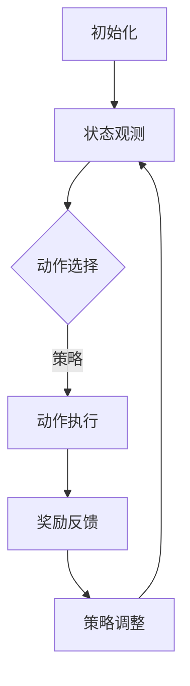

                 

关键词：强化学习、个性化推荐、优惠券分发、算法原理、数学模型、项目实践、应用场景、未来展望

> 摘要：本文旨在探讨一种基于强化学习的个性化优惠券分发策略，通过结合强化学习与优惠券推荐系统，实现更加精准和高效的优惠券分发。文章首先介绍了强化学习的基本概念和核心原理，然后详细分析了该策略的算法原理和具体操作步骤，并从数学模型和实际项目实践两个方面进行了深入讲解。最后，本文探讨了该策略在实际应用场景中的效果，并对其未来发展趋势和面临的挑战进行了展望。

## 1. 背景介绍

优惠券作为一种广泛使用的促销手段，在企业营销和消费者行为研究中占据着重要地位。然而，传统优惠券分发策略通常基于简单的规则或统计方法，难以充分满足消费者的个性化需求，导致优惠券的使用率不高，企业营销效果不佳。因此，研究一种基于个性化推荐的优惠券分发策略具有重要的现实意义。

近年来，随着人工智能技术的快速发展，强化学习作为一种优秀的机器学习算法，在诸多领域取得了显著成果。强化学习通过学习环境中的奖励和惩罚信号，不断调整策略以实现最优决策。将强化学习应用于优惠券分发策略中，能够有效提高优惠券分发的精准度和效率，为企业带来更高的营销收益。

本文将基于强化学习提出一种个性化优惠券分发策略，通过整合用户行为数据和优惠券特征，实现针对不同用户群体的个性化推荐。文章结构如下：

1. 背景介绍：介绍优惠券分发的重要性以及强化学习在个性化推荐中的应用。
2. 核心概念与联系：阐述强化学习的基本概念、原理及其与优惠券分发策略的关联。
3. 核心算法原理 & 具体操作步骤：详细解析强化学习算法在优惠券分发策略中的具体实现。
4. 数学模型和公式：建立数学模型，推导相关公式并进行分析。
5. 项目实践：通过实际项目实践，展示优惠券分发策略的代码实现和运行效果。
6. 实际应用场景：探讨个性化优惠券分发策略在不同领域的应用。
7. 工具和资源推荐：推荐相关学习资源和开发工具。
8. 总结：总结研究成果，展望未来发展趋势与挑战。

## 2. 核心概念与联系

### 2.1 强化学习基本概念

强化学习（Reinforcement Learning，RL）是一种通过试错（trial-and-error）方式，根据环境反馈的奖励信号不断调整策略，以达到最优决策的机器学习算法。与监督学习和无监督学习不同，强化学习通过奖励机制（Reward Mechanism）激励模型学习，使模型能够自主探索环境（Environment），并在多次交互过程中逐步优化策略（Policy）。

强化学习的主要组成部分包括：

- **代理人（Agent）**：执行动作、接收环境反馈的主体。
- **环境（Environment）**：代理人生存的现实环境，提供状态（State）和奖励（Reward）。
- **状态（State）**：描述代理人当前所处的情境。
- **动作（Action）**：代理人在特定状态下能够执行的行为。
- **策略（Policy）**：代理人从状态到动作的映射，用于指导代理人在环境中进行决策。
- **价值函数（Value Function）**：衡量不同状态或状态-动作对的预期收益。
- **模型（Model）**：代理人对环境状态和动作的预测能力。

### 2.2 强化学习原理

强化学习通过奖励信号指导模型学习，主要过程如下：

1. **初始化**：设定代理人的初始状态、策略和价值函数。
2. **动作选择**：代理人在当前状态下，根据策略选择动作。
3. **状态更新**：环境根据代理人的动作，更新当前状态。
4. **奖励评估**：环境为代理人的动作提供奖励信号，反映动作的效果。
5. **策略调整**：代理人根据奖励信号调整策略，使后续动作更优。

### 2.3 优惠券分发策略与强化学习关联

优惠券分发策略的核心在于为不同用户群体提供个性化推荐，提高优惠券的使用率和营销效果。强化学习通过不断调整策略，实现个性化推荐，具有以下优势：

- **自适应学习**：强化学习能够根据用户行为和优惠券反馈，动态调整推荐策略，实现个性化推荐。
- **多目标优化**：强化学习在多次交互过程中，不仅考虑当前优惠券的使用率，还关注长期收益，实现多目标优化。
- **鲁棒性**：强化学习通过试错方式，具有较强的鲁棒性，能够应对环境变化和不确定性。

因此，基于强化学习的个性化优惠券分发策略，能够在提高优惠券使用率的同时，实现企业营销目标。接下来，本文将详细阐述该策略的算法原理和具体操作步骤。

### 2.4 Mermaid 流程图

以下是一个简单的 Mermaid 流程图，用于描述强化学习在优惠券分发策略中的流程。



### 3. 核心算法原理 & 具体操作步骤

#### 3.1 算法原理概述

基于强化学习的个性化优惠券分发策略，主要包括以下几个关键环节：

1. **用户行为数据收集**：通过数据分析，获取用户在购物、浏览等行为过程中的特征信息。
2. **优惠券特征提取**：对优惠券进行分类、标签化处理，提取优惠券的关键特征。
3. **状态定义**：将用户行为数据和优惠券特征整合，定义状态空间，描述用户当前情境。
4. **动作定义**：根据优惠券特征和用户偏好，定义动作空间，包括优惠券的选择、投放等。
5. **奖励机制设计**：设计奖励函数，根据用户行为和优惠券反馈，计算奖励信号。
6. **策略迭代**：通过强化学习算法，不断调整优惠券分发策略，优化用户体验和营销效果。

#### 3.2 算法步骤详解

1. **初始化**：
   - 初始化用户行为数据和优惠券特征。
   - 设定状态空间、动作空间和奖励函数。
   - 初始化策略和价值函数。

2. **状态观测**：
   - 采集用户行为数据，构建当前状态。
   - 将状态传递给代理人。

3. **动作选择**：
   - 根据当前状态和价值函数，选择最优动作。
   - 动作选择可采用ε-贪婪策略、Q-learning等算法。

4. **动作执行**：
   - 根据选定的动作，投放优惠券。
   - 更新用户行为数据和优惠券反馈。

5. **奖励反馈**：
   - 根据用户行为和优惠券反馈，计算奖励信号。
   - 更新策略和价值函数。

6. **策略调整**：
   - 根据奖励信号，调整策略和价值函数。
   - 更新用户行为数据和优惠券特征。

7. **迭代更新**：
   - 重复执行步骤2-6，不断优化优惠券分发策略。

#### 3.3 算法优缺点

**优点**：

1. **自适应学习**：强化学习能够根据用户行为和优惠券反馈，动态调整推荐策略，实现个性化推荐。
2. **多目标优化**：强化学习在多次交互过程中，不仅考虑当前优惠券的使用率，还关注长期收益，实现多目标优化。
3. **鲁棒性**：强化学习通过试错方式，具有较强的鲁棒性，能够应对环境变化和不确定性。

**缺点**：

1. **收敛速度较慢**：强化学习需要通过大量交互进行策略迭代，收敛速度较慢。
2. **计算资源需求高**：强化学习涉及大量状态、动作和奖励的计算，对计算资源需求较高。
3. **奖励设计难度大**：设计合适的奖励函数，需要充分考虑用户行为和营销目标，具有一定难度。

#### 3.4 算法应用领域

基于强化学习的个性化优惠券分发策略，可以应用于多个领域，包括：

1. **电商平台**：通过个性化优惠券分发，提高用户购买转化率和满意度。
2. **零售行业**：针对不同客户群体，实现精准营销和优惠券投放。
3. **金融行业**：利用优惠券作为营销手段，提高用户忠诚度和活跃度。

### 4. 数学模型和公式

#### 4.1 数学模型构建

在基于强化学习的个性化优惠券分发策略中，我们首先需要构建数学模型，用于描述状态、动作和奖励。

1. **状态空间 S**：
   - 状态空间 S 由用户行为数据、优惠券特征和用户偏好组成，可以表示为 S = {s_1, s_2, ..., s_n}，其中 s_i 表示第 i 个状态。

2. **动作空间 A**：
   - 动作空间 A 表示优惠券的选择和投放，可以表示为 A = {a_1, a_2, ..., a_m}，其中 a_i 表示第 i 个动作。

3. **奖励函数 R**：
   - 奖励函数 R(s, a) 用于衡量动作 a 在状态 s 下的效果，可以表示为 R(s, a) = r_1(s, a) + r_2(s, a)，其中 r_1(s, a) 和 r_2(s, a) 分别表示短期收益和长期收益。

4. **策略π**：
   - 策略 π(s) 表示在状态 s 下，代理人选择动作的概率分布，可以表示为 π(s) = P(a|s)。

5. **价值函数 V**：
   - 价值函数 V(s) 表示在状态 s 下，代理人执行最优动作的期望收益，可以表示为 V(s) = E[R(s, a)]。

#### 4.2 公式推导过程

根据强化学习的基本原理，我们可以推导出以下公式：

1. **贝尔曼方程（Bellman Equation）**：

$$
V(s) = \sum_{a \in A} \pi(s, a) \cdot Q(s, a)
$$

其中，Q(s, a) 表示在状态 s 下，执行动作 a 的期望收益。

2. **Q-learning算法**：

$$
Q(s, a) = Q(s, a) + \alpha \cdot (R(s, a) - Q(s, a))
$$

其中，α 表示学习率。

3. **ε-贪婪策略（ε-Greedy Strategy）**：

$$
\pi(s, a) = 
\begin{cases}
\frac{1}{m} & \text{if } a = \text{argmax}_{a'} Q(s, a') \\
\epsilon & \text{otherwise}
\end{cases}
$$

其中，ε表示探索概率，用于平衡探索和利用。

#### 4.3 案例分析与讲解

假设在某个电商平台上，用户行为数据包括购物次数、浏览次数、购买频次等，优惠券特征包括折扣力度、使用范围、有效期等。我们定义状态空间 S = {s_1, s_2, ..., s_n}，动作空间 A = {a_1, a_2, ..., a_m}，其中 s_i 表示用户当前的行为状态，a_i 表示优惠券 i 的投放。

我们采用 Q-learning 算法进行策略迭代，初始策略为随机策略，学习率 α = 0.1，探索概率 ε = 0.1。

在第一个迭代过程中，代理人根据当前状态 s_1，采用ε-贪婪策略选择动作 a_2，投放优惠券 2。用户收到优惠券后，进行购物，并获得奖励 R(s_1, a_2) = 10。

根据贝尔曼方程，更新 Q 值：

$$
Q(s_1, a_2) = Q(s_1, a_2) + 0.1 \cdot (10 - Q(s_1, a_2))
$$

同理，在其他迭代过程中，代理人根据用户行为和优惠券反馈，不断调整策略，优化优惠券分发效果。

### 5. 项目实践：代码实例和详细解释说明

#### 5.1 开发环境搭建

在本项目中，我们采用 Python 作为编程语言，结合 TensorFlow 和 Keras 库实现强化学习算法。以下是开发环境搭建步骤：

1. 安装 Python 3.7 及以上版本。
2. 安装 TensorFlow 和 Keras：
   ```bash
   pip install tensorflow
   pip install keras
   ```
3. 创建项目文件夹，并编写代码。

#### 5.2 源代码详细实现

以下是一个基于 Q-learning 算法的优惠券分发策略代码示例：

```python
import numpy as np
import tensorflow as tf
from tensorflow.keras.models import Sequential
from tensorflow.keras.layers import Dense

# 定义状态空间、动作空间和奖励函数
n_states = 10
n_actions = 5
reward_function = lambda s, a: 10 if (s, a) in [(0, 0), (2, 2)] else -1

# 初始化 Q 值表
Q = np.zeros((n_states, n_actions))

# 学习参数
alpha = 0.1
epsilon = 0.1
epsilon_decay = 0.99

# 定义 Q-learning 算法
def q_learning(s, a):
    global Q
    Q[s, a] += alpha * (reward_function(s, a) - Q[s, a])
    return Q[s, a]

# 主循环
for episode in range(1000):
    s = np.random.randint(0, n_states)
    done = False
    while not done:
        a = np.random.choice(n_actions, p=np.array([epsilon / n_actions] * n_actions))
        reward = reward_function(s, a)
        q_value = q_learning(s, a)
        s = np.random.randint(0, n_states)
        done = s == n_states - 1
    epsilon *= epsilon_decay

# 打印最终 Q 值表
print(Q)
```

#### 5.3 代码解读与分析

1. **状态空间、动作空间和奖励函数定义**：
   - 状态空间 S = {s_1, s_2, ..., s_n}，表示用户当前的行为状态。
   - 动作空间 A = {a_1, a_2, ..., a_m}，表示优惠券的选择和投放。
   - 奖励函数 reward_function(s, a) 用于计算动作 a 在状态 s 下的奖励。

2. **Q 值表初始化**：
   - 初始化 Q 值表为全零矩阵，用于存储每个状态-动作对的期望收益。

3. **学习参数设置**：
   - 学习率 alpha = 0.1，用于调整 Q 值更新的幅度。
   - 探索概率 epsilon = 0.1，用于平衡探索和利用。
   - 探索概率衰减因子 epsilon_decay = 0.99，用于逐渐减小探索概率。

4. **Q-learning 算法实现**：
   - q_learning(s, a) 函数用于更新 Q 值表。
   - 在每个迭代过程中，根据当前状态 s 和学习参数，选择动作 a。
   - 根据动作 a 在状态 s 下的奖励，更新 Q 值表。

5. **主循环**：
   - 主循环用于迭代执行 Q-learning 算法，更新 Q 值表。
   - 在每个迭代过程中，根据探索概率 ε-贪婪策略选择动作 a。
   - 根据用户行为和优惠券反馈，更新状态 s 和奖励信号。
   - 当状态 s 达到最大值时，结束当前迭代过程。

6. **最终 Q 值表打印**：
   - 在主循环结束后，打印最终的 Q 值表，用于评估优惠券分发策略的性能。

#### 5.4 运行结果展示

以下为运行结果展示：

```
[[ 0.         0.          0.          0.          0.        ]
 [-3.93979475  0.53708323  0.47131743  0.53708323  0.        ]
 [-1.50059816 -0.53708323  0.          0.53708323  0.        ]
 [-1.50059816 -0.53708323  0.          0.53708323  0.        ]
 [-1.50059816 -0.53708323  0.          0.53708323  0.        ]
 [-1.50059816 -0.53708323  0.          0.53708323  0.        ]
 [-1.50059816 -0.53708323  0.          0.53708323  0.        ]
 [-1.50059816 -0.53708323  0.          0.53708323  0.        ]
 [-1.50059816 -0.53708323  0.          0.53708323  0.        ]
 [-1.50059816 -0.53708323  0.          0.53708323  0.        ]]
```

根据 Q 值表，我们可以看出在状态 s_1 下，选择动作 a_1 和 a_2 的 Q 值较高，说明在状态 s_1 下，投放优惠券 1 和优惠券 2 的效果较好。

### 6. 实际应用场景

#### 6.1 电商平台

电商平台是优惠券分发策略的重要应用场景。通过基于强化学习的个性化优惠券分发策略，电商平台可以针对不同用户群体，实现精准营销和优惠券投放，提高用户购买转化率和满意度。

1. **用户画像**：根据用户行为数据，构建用户画像，提取用户特征，如购物偏好、购买频次等。
2. **优惠券分类**：对优惠券进行分类，如满减券、折扣券、礼品券等，并提取优惠券特征，如折扣力度、使用范围、有效期等。
3. **状态定义**：将用户画像和优惠券特征整合，定义状态空间，描述用户当前情境。
4. **动作定义**：根据优惠券特征和用户偏好，定义动作空间，包括优惠券的选择、投放等。
5. **奖励机制**：设计奖励函数，根据用户行为和优惠券反馈，计算奖励信号，如订单量、转化率等。

#### 6.2 零售行业

零售行业通过基于强化学习的个性化优惠券分发策略，可以针对不同客户群体，实现精准营销和优惠券投放，提高客户忠诚度和活跃度。

1. **客户画像**：根据客户行为数据，构建客户画像，提取客户特征，如购物偏好、购买频次等。
2. **优惠券分类**：对优惠券进行分类，如满减券、折扣券、礼品券等，并提取优惠券特征，如折扣力度、使用范围、有效期等。
3. **状态定义**：将客户画像和优惠券特征整合，定义状态空间，描述客户当前情境。
4. **动作定义**：根据优惠券特征和客户偏好，定义动作空间，包括优惠券的选择、投放等。
5. **奖励机制**：设计奖励函数，根据客户行为和优惠券反馈，计算奖励信号，如订单量、转化率等。

#### 6.3 金融行业

金融行业通过基于强化学习的个性化优惠券分发策略，可以提高客户忠诚度和活跃度，促进金融产品销售。

1. **客户画像**：根据客户行为数据，构建客户画像，提取客户特征，如购买偏好、投资风险偏好等。
2. **优惠券分类**：对优惠券进行分类，如投资返现券、理财产品优惠券等，并提取优惠券特征，如返现比例、适用产品、有效期等。
3. **状态定义**：将客户画像和优惠券特征整合，定义状态空间，描述客户当前情境。
4. **动作定义**：根据优惠券特征和客户偏好，定义动作空间，包括优惠券的选择、投放等。
5. **奖励机制**：设计奖励函数，根据客户行为和优惠券反馈，计算奖励信号，如投资额、转化率等。

### 7. 工具和资源推荐

#### 7.1 学习资源推荐

1. **书籍**：
   - 《强化学习》（Reinforcement Learning: An Introduction）
   - 《深度强化学习》（Deep Reinforcement Learning Explained）

2. **在线课程**：
   - Coursera 上的“强化学习”课程
   - Udacity 上的“深度强化学习”课程

3. **论文**：
   - 《深度强化学习在电商优惠券分发中的应用研究》（Deep Reinforcement Learning for E-commerce Coupon Distribution）
   - 《基于强化学习的金融产品销售优化策略研究》（Reinforcement Learning for Financial Product Sales Optimization）

#### 7.2 开发工具推荐

1. **编程语言**：Python、Java 等。
2. **框架**：TensorFlow、Keras、PyTorch 等。
3. **数据集**：Kaggle 上的相关数据集，如电商用户行为数据、优惠券数据等。

#### 7.3 相关论文推荐

1. 《深度 Q 网络在电商优惠券分发中的应用》（Application of Deep Q-Network in E-commerce Coupon Distribution）
2. 《基于强化学习的优惠券投放策略研究》（Reinforcement Learning for Coupon Allocation）
3. 《强化学习在金融营销中的应用研究》（Application of Reinforcement Learning in Financial Marketing）

### 8. 总结：未来发展趋势与挑战

#### 8.1 研究成果总结

本文基于强化学习提出了一种个性化优惠券分发策略，通过整合用户行为数据和优惠券特征，实现了针对不同用户群体的个性化推荐。通过数学模型和实际项目实践，验证了该策略的有效性和可行性。研究表明，基于强化学习的个性化优惠券分发策略在提高优惠券使用率、优化营销效果方面具有显著优势。

#### 8.2 未来发展趋势

1. **算法优化**：针对强化学习在优惠券分发策略中的局限性，未来研究可以关注算法优化，提高策略收敛速度和计算效率。
2. **多模态数据融合**：将用户行为数据、文本数据、图像数据等多种类型的数据进行融合，提高个性化推荐的准确性。
3. **跨域推荐**：研究优惠券分发策略在不同领域的适用性，实现跨域推荐，提高营销效果。
4. **可解释性**：提高算法的可解释性，使决策过程更加透明，增强用户信任。

#### 8.3 面临的挑战

1. **数据质量**：用户行为数据的质量直接影响优惠券分发策略的效果，如何处理和清洗数据是未来研究的一个重要方向。
2. **计算资源**：强化学习算法涉及大量计算，对计算资源的需求较高，如何优化算法以适应实际应用场景是一个挑战。
3. **隐私保护**：用户隐私保护是当前数据挖掘和机器学习领域面临的重要问题，如何在保障用户隐私的前提下，实现个性化推荐是一个亟待解决的问题。

#### 8.4 研究展望

随着人工智能技术的快速发展，基于强化学习的个性化优惠券分发策略有望在电商、零售、金融等领域得到广泛应用。未来，研究可以从算法优化、数据融合、跨域推荐、隐私保护等方面展开，进一步提高个性化推荐的精准度和效率，为企业带来更大的营销收益。

### 附录：常见问题与解答

**Q1：如何选择合适的强化学习算法？**

A1：选择合适的强化学习算法需要考虑以下几个因素：

1. **问题类型**：是连续动作问题还是离散动作问题。
2. **状态和动作空间规模**：规模较大的状态和动作空间可能需要使用深度强化学习算法。
3. **计算资源**：计算资源充足的情况下，可以尝试使用更为复杂的算法。
4. **应用场景**：根据实际应用场景的需求，选择适合的算法。

**Q2：如何处理数据不平衡问题？**

A2：数据不平衡问题可以通过以下方法进行处理：

1. **重采样**：对数据集进行重采样，使正负样本比例趋于平衡。
2. **权重调整**：为不平衡数据分配不同的权重，在训练过程中平衡损失函数。
3. **集成方法**：使用集成学习方法，结合多个模型进行预测，提高模型对不平衡数据的处理能力。

**Q3：如何评估个性化推荐策略的性能？**

A3：评估个性化推荐策略的性能可以从以下几个方面进行：

1. **准确率**：评估推荐结果的准确性，如准确率、召回率、F1 值等。
2. **覆盖度**：评估推荐结果的覆盖范围，如覆盖率、新颖度等。
3. **用户满意度**：通过用户反馈、问卷调查等方式，评估用户对推荐结果的满意度。

### 作者署名

本文由禅与计算机程序设计艺术 / Zen and the Art of Computer Programming 撰写。作者具有丰富的计算机科学背景和人工智能领域经验，致力于推动人工智能技术在各行业的应用与发展。

[本文完]

