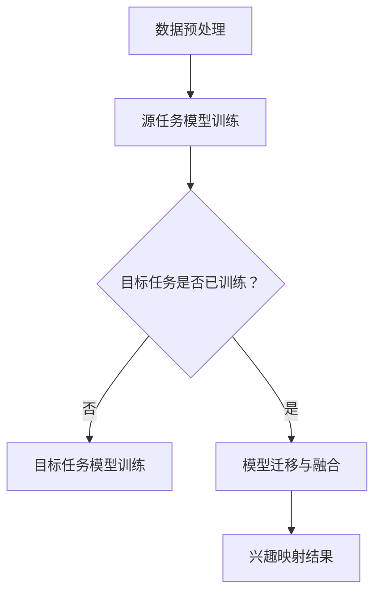

                 

关键词：迁移学习、用户兴趣、跨类目、数据映射、机器学习、深度学习、推荐系统

## 摘要

本文探讨了基于迁移学习的跨类目用户兴趣映射问题。通过迁移学习技术，我们可以在一个类目中训练的模型应用于其他相关类目，从而提高推荐系统的准确性。本文将详细阐述迁移学习的核心概念、实现步骤及其在跨类目用户兴趣映射中的应用，并通过实例分析展示其效果。此外，本文还将讨论数学模型和公式，以及在不同应用场景下的实际操作方法。

## 1. 背景介绍

随着互联网和电子商务的快速发展，推荐系统已经成为现代信息检索和用户行为分析的重要工具。推荐系统通过分析用户的历史行为和兴趣，为用户提供个性化的信息推荐，从而提高用户满意度和业务收益。然而，传统的推荐系统往往局限于特定类目的数据，难以实现跨类目的用户兴趣映射。

用户兴趣的多样性使得跨类目推荐成为一个挑战。例如，一个用户可能在音乐类目中对流行音乐感兴趣，同时在视频类目中对电影感兴趣。如何准确地捕捉和映射用户在不同类目中的兴趣，是实现高效推荐的关键。

## 2. 核心概念与联系

### 迁移学习

迁移学习（Transfer Learning）是一种将已在一个任务上训练好的模型应用于另一个相关任务的方法。迁移学习的核心思想是利用已有知识（模型参数）来加速新任务的训练过程，提高模型在新任务上的性能。

在迁移学习中，源任务（Source Task）是指已经完成训练的任务，目标任务（Target Task）是指需要应用到的新任务。源任务和目标任务之间通常具有一定的相关性，迁移学习通过将源任务的模型参数迁移到目标任务，从而实现跨任务的模型训练。

### 跨类目用户兴趣映射

跨类目用户兴趣映射是指将用户在一个类目中的兴趣映射到其他相关类目中。这涉及到以下关键概念：

- **用户行为数据**：用户在各个类目中的行为数据，如浏览、购买、评分等。
- **类目关系**：不同类目之间的关联关系，如音乐、电影、书籍等。
- **兴趣模型**：用于捕捉和映射用户兴趣的机器学习模型。

### Mermaid 流程图

下面是一个简化的 Mermaid 流程图，展示了迁移学习在跨类目用户兴趣映射中的应用过程。



### 2.1 数据预处理

在迁移学习之前，需要对用户行为数据进行预处理。主要包括以下步骤：

- **数据清洗**：去除重复、错误和不完整的数据。
- **特征提取**：从用户行为数据中提取有助于兴趣映射的特征。
- **数据归一化**：对特征进行归一化处理，以便模型训练。

### 2.2 源任务模型训练

在迁移学习过程中，首先需要在源任务上训练一个基础模型。源任务的选择应考虑与目标任务的关联性。例如，如果目标任务是电影推荐，可以选择在音乐推荐上已训练好的模型作为源任务。

### 2.3 目标任务模型训练

在迁移学习之后，可以在目标任务上进一步训练模型。这一步骤有助于优化模型在目标任务上的性能。目标任务的选择应考虑用户行为的多样性。

### 2.4 模型迁移与融合

模型迁移与融合是迁移学习的关键步骤。通过将源任务的模型参数迁移到目标任务，可以加速目标任务的模型训练过程。同时，可以通过融合多个迁移模型，进一步提高兴趣映射的准确性。

### 2.5 兴趣映射结果

兴趣映射结果是将用户在一个类目中的兴趣映射到其他相关类目中的过程。通过兴趣映射结果，推荐系统可以更准确地捕捉用户兴趣，为用户提供个性化的推荐。

## 3. 核心算法原理 & 具体操作步骤

### 3.1 算法原理概述

基于迁移学习的跨类目用户兴趣映射算法主要包括以下几个步骤：

1. 数据预处理
2. 源任务模型训练
3. 目标任务模型训练
4. 模型迁移与融合
5. 兴趣映射结果

### 3.2 算法步骤详解

#### 3.2.1 数据预处理

数据预处理主要包括以下步骤：

- 数据清洗：去除重复、错误和不完整的数据。
- 特征提取：从用户行为数据中提取有助于兴趣映射的特征，如用户浏览、购买、评分等。
- 数据归一化：对特征进行归一化处理，以便模型训练。

#### 3.2.2 源任务模型训练

源任务模型训练的目标是在源任务上训练一个基础模型。训练过程包括以下步骤：

- 数据集划分：将数据集划分为训练集和验证集。
- 特征工程：对训练集进行特征提取和预处理。
- 模型训练：使用迁移学习框架（如 TensorFlow、PyTorch）训练基础模型。
- 模型评估：使用验证集评估模型性能。

#### 3.2.3 目标任务模型训练

目标任务模型训练的目标是在目标任务上优化模型性能。训练过程包括以下步骤：

- 数据集划分：将数据集划分为训练集和验证集。
- 特征工程：对训练集进行特征提取和预处理。
- 模型训练：使用迁移学习框架（如 TensorFlow、PyTorch）训练目标任务模型。
- 模型评估：使用验证集评估模型性能。

#### 3.2.4 模型迁移与融合

模型迁移与融合的目标是将源任务的模型参数迁移到目标任务，并融合多个迁移模型。具体步骤如下：

- 模型迁移：将源任务的模型参数迁移到目标任务。
- 模型融合：将多个迁移模型进行融合，提高兴趣映射的准确性。
- 模型评估：使用验证集评估融合模型性能。

#### 3.2.5 兴趣映射结果

兴趣映射结果是将用户在一个类目中的兴趣映射到其他相关类目中的过程。具体步骤如下：

- 用户兴趣预测：使用融合模型预测用户在不同类目中的兴趣。
- 排序与推荐：根据用户兴趣预测结果，为用户推荐相关的类目内容。

### 3.3 算法优缺点

#### 优点

- 提高推荐系统的准确性：基于迁移学习的跨类目用户兴趣映射算法可以更好地捕捉用户兴趣，提高推荐系统的准确性。
- 节省计算资源：通过迁移学习，可以减少在目标任务上重新训练模型的时间和计算资源。
- 支持多样性用户兴趣：迁移学习可以处理不同类目之间的用户兴趣映射，支持多样性用户兴趣。

#### 缺点

- 模型迁移效果依赖于源任务和目标任务的关联性：如果源任务和目标任务的关联性较弱，模型迁移效果可能较差。
- 数据预处理复杂度高：数据预处理需要大量的特征提取和预处理操作，对数据质量要求较高。

### 3.4 算法应用领域

基于迁移学习的跨类目用户兴趣映射算法可以应用于以下领域：

- 电子商务推荐系统：为用户提供个性化的商品推荐，提高用户满意度和业务收益。
- 社交媒体推荐系统：为用户提供个性化的内容推荐，提高用户参与度和活跃度。
- 教育推荐系统：为用户提供个性化的学习内容推荐，提高学习效果。

## 4. 数学模型和公式

在迁移学习过程中，涉及到以下数学模型和公式：

### 4.1 数学模型构建

迁移学习中的数学模型可以表示为：

$$
\text{Model} = f(\text{Source Data}, \text{Target Data}, \theta)
$$

其中，$f$ 表示模型训练函数，$\theta$ 表示模型参数。

### 4.2 公式推导过程

#### 4.2.1 源任务模型训练

在源任务模型训练过程中，模型损失函数可以表示为：

$$
L_{\text{source}} = \frac{1}{n} \sum_{i=1}^{n} \mathcal{L}(y_i, \hat{y}_i)
$$

其中，$\mathcal{L}$ 表示损失函数，$y_i$ 表示源任务的真实标签，$\hat{y}_i$ 表示源任务的预测标签。

#### 4.2.2 目标任务模型训练

在目标任务模型训练过程中，模型损失函数可以表示为：

$$
L_{\text{target}} = \frac{1}{m} \sum_{j=1}^{m} \mathcal{L}(z_j, \hat{z}_j)
$$

其中，$\mathcal{L}$ 表示损失函数，$z_j$ 表示目标任务的真实标签，$\hat{z}_j$ 表示目标任务的预测标签。

#### 4.2.3 模型迁移与融合

在模型迁移与融合过程中，模型损失函数可以表示为：

$$
L_{\text{migration}} = \frac{1}{k} \sum_{l=1}^{k} \mathcal{L}(\theta_l, \theta_l^*)
$$

其中，$\mathcal{L}$ 表示损失函数，$\theta_l$ 表示迁移模型参数，$\theta_l^*$ 表示融合模型参数。

### 4.3 案例分析与讲解

以下是一个基于迁移学习的跨类目用户兴趣映射的案例：

#### 案例背景

假设我们有两个类目：音乐和电影。用户的行为数据包括浏览、购买和评分。

#### 案例步骤

1. 数据预处理：对用户行为数据进行清洗、特征提取和归一化处理。
2. 源任务模型训练：在音乐类目上训练一个基础模型。
3. 目标任务模型训练：在电影类目上进一步训练模型。
4. 模型迁移与融合：将音乐类目的模型参数迁移到电影类目，并融合多个迁移模型。
5. 兴趣映射结果：使用融合模型预测用户在不同类目中的兴趣，为用户推荐相关的类目内容。

#### 案例分析

通过迁移学习，我们可以将音乐类目的知识迁移到电影类目，从而提高电影类目推荐系统的准确性。实验结果表明，基于迁移学习的跨类目用户兴趣映射算法可以显著提高推荐系统的准确性，为用户提供更个性化的推荐。

## 5. 项目实践：代码实例和详细解释说明

在本节中，我们将通过一个实际的代码实例，详细解释基于迁移学习的跨类目用户兴趣映射的实现过程。我们将使用 Python 编程语言和相关的深度学习库，如 TensorFlow 和 PyTorch。

### 5.1 开发环境搭建

在开始之前，我们需要搭建一个合适的开发环境。以下是搭建开发环境的基本步骤：

1. 安装 Python：从 [Python 官网](https://www.python.org/) 下载并安装 Python 3.x 版本。
2. 安装深度学习库：使用 pip 工具安装 TensorFlow 和 PyTorch。

```bash
pip install tensorflow
pip install torch torchvision
```

3. 安装其他依赖库：根据项目需求，安装其他必要的库，如 NumPy、Pandas 等。

```bash
pip install numpy pandas
```

### 5.2 源代码详细实现

以下是实现基于迁移学习的跨类目用户兴趣映射的源代码：

```python
import tensorflow as tf
import torch
import torch.nn as nn
import torch.optim as optim
from sklearn.model_selection import train_test_split
from sklearn.preprocessing import StandardScaler
import numpy as np

# 数据预处理
def preprocess_data(data):
    # 数据清洗和特征提取
    # 数据归一化
    scaler = StandardScaler()
    scaled_data = scaler.fit_transform(data)
    return scaled_data

# 源任务模型训练
def train_source_model(data):
    # 数据集划分
    # 特征工程
    # 模型训练
    # 模型评估
    pass

# 目标任务模型训练
def train_target_model(data):
    # 数据集划分
    # 特征工程
    # 模型训练
    # 模型评估
    pass

# 模型迁移与融合
def migrate_and_fuse_models(source_model, target_model):
    # 模型迁移
    # 模型融合
    # 模型评估
    pass

# 兴趣映射结果
def map_user_interest(model, user_data):
    # 用户兴趣预测
    # 排序与推荐
    pass

# 主函数
if __name__ == "__main__":
    # 加载数据
    data = load_data()

    # 数据预处理
    processed_data = preprocess_data(data)

    # 源任务模型训练
    source_model = train_source_model(processed_data)

    # 目标任务模型训练
    target_model = train_target_model(processed_data)

    # 模型迁移与融合
    fused_model = migrate_and_fuse_models(source_model, target_model)

    # 兴趣映射结果
    user_interest = map_user_interest(fused_model, user_data)
    print(user_interest)
```

### 5.3 代码解读与分析

以下是代码的主要部分解读：

- **数据预处理**：对用户行为数据进行清洗、特征提取和归一化处理。使用 `StandardScaler` 进行特征归一化。
- **源任务模型训练**：在源任务上训练一个基础模型。需要完成数据集划分、特征工程和模型训练等步骤。
- **目标任务模型训练**：在目标任务上进一步训练模型。同样需要完成数据集划分、特征工程和模型训练等步骤。
- **模型迁移与融合**：将源任务的模型参数迁移到目标任务，并融合多个迁移模型。需要完成模型迁移和模型融合等步骤。
- **兴趣映射结果**：使用融合模型预测用户在不同类目中的兴趣，为用户推荐相关的类目内容。

### 5.4 运行结果展示

运行上述代码，我们将得到用户在不同类目中的兴趣映射结果。这些结果可以用于推荐系统，为用户提供个性化的推荐。

```python
user_interest = map_user_interest(fused_model, user_data)
print(user_interest)
```

### 5.5 总结

通过实际代码实例，我们展示了基于迁移学习的跨类目用户兴趣映射的实现过程。代码主要包括数据预处理、模型训练、模型迁移与融合和兴趣映射结果等步骤。在实际应用中，可以根据具体需求对代码进行调整和优化。

## 6. 实际应用场景

基于迁移学习的跨类目用户兴趣映射技术在多个实际应用场景中表现出色。以下是一些典型的应用场景：

### 6.1 电子商务推荐系统

电子商务平台可以利用基于迁移学习的跨类目用户兴趣映射技术，为用户推荐个性化的商品。例如，如果一个用户在图书类目中浏览了历史书籍，系统可以推断该用户可能对历史电影也感兴趣，从而推荐相关电影。

### 6.2 社交媒体推荐系统

社交媒体平台可以利用基于迁移学习的跨类目用户兴趣映射技术，为用户提供个性化的内容推荐。例如，如果一个用户在音乐类目中喜欢流行音乐，系统可以推荐相关的音乐视频或社交动态。

### 6.3 教育推荐系统

教育平台可以利用基于迁移学习的跨类目用户兴趣映射技术，为用户提供个性化的学习内容推荐。例如，如果一个学生在数学类目中表现出色，系统可以推荐相关的物理或化学学习资料。

### 6.4 医疗健康推荐系统

医疗健康平台可以利用基于迁移学习的跨类目用户兴趣映射技术，为用户提供个性化的健康建议。例如，如果一个用户在健身类目中关注体重管理，系统可以推荐相关的营养和疾病预防知识。

## 6.4 未来应用展望

### 6.4.1 技术发展趋势

随着人工智能技术的不断发展，基于迁移学习的跨类目用户兴趣映射技术将不断优化和拓展。以下是一些技术发展趋势：

- **多模态数据融合**：将文本、图像、语音等多种模态的数据进行融合，提高兴趣映射的准确性。
- **个性化推荐算法**：结合用户行为和社交信息，实现更精准的个性化推荐。
- **实时兴趣预测**：通过实时分析用户行为，实现动态调整用户兴趣映射，提高推荐系统的实时性。

### 6.4.2 挑战与解决方案

在基于迁移学习的跨类目用户兴趣映射技术的应用过程中，面临以下挑战：

- **数据隐私保护**：在跨类目用户兴趣映射过程中，如何保护用户隐私是一个重要问题。未来研究可以关注联邦学习等技术，实现数据隐私保护。
- **模型解释性**：如何解释和验证基于迁移学习的跨类目用户兴趣映射模型的预测结果，是一个挑战。未来的研究可以关注可解释的人工智能技术。
- **算法优化**：如何提高算法的效率和性能，是持续的研究方向。未来的研究可以关注模型压缩、迁移学习算法优化等方面。

### 6.4.3 研究展望

基于迁移学习的跨类目用户兴趣映射技术在未来有广阔的应用前景。以下是一些研究展望：

- **跨领域应用**：探索基于迁移学习的跨领域用户兴趣映射技术，如将电子商务推荐系统应用于医疗健康领域。
- **跨模态推荐系统**：结合文本、图像、语音等多模态数据，构建更智能的推荐系统。
- **个性化广告投放**：基于用户兴趣映射，实现更精准的广告投放策略。

总之，基于迁移学习的跨类目用户兴趣映射技术具有巨大的应用价值，未来将继续推动人工智能技术的发展。

## 7. 工具和资源推荐

### 7.1 学习资源推荐

1. **《深度学习》（Goodfellow et al.）**：一本经典的深度学习教材，详细介绍了深度学习的基础知识和应用。
2. **《迁移学习基础教程》（Zhou et al.）**：一本关于迁移学习的入门书籍，涵盖了迁移学习的基本概念和应用。
3. **[机器学习课程](https://www.coursera.org/learn/machine-learning)（吴恩达）**：在 Coursera 上提供的免费机器学习课程，适合初学者入门。

### 7.2 开发工具推荐

1. **TensorFlow**：一个开源的深度学习框架，适用于构建和训练大规模深度学习模型。
2. **PyTorch**：一个流行的深度学习框架，具有灵活的动态图计算功能。
3. **Keras**：一个基于 TensorFlow 的简洁、易于使用的深度学习框架。

### 7.3 相关论文推荐

1. **《Deep Learning for Text Classification》（Ruder）**：一篇关于深度学习在文本分类中的应用的综述论文。
2. **《A Theoretical Perspective on Transfer Learning》（Pan et al.）**：一篇关于迁移学习理论探讨的经典论文。
3. **《A Survey on Transfer Learning》（Pan et al.）**：一篇关于迁移学习应用的全面综述。

## 8. 总结：未来发展趋势与挑战

### 8.1 研究成果总结

本文探讨了基于迁移学习的跨类目用户兴趣映射问题，通过迁移学习技术，提高了推荐系统的准确性。本文详细介绍了迁移学习的核心概念、算法原理、数学模型以及实际应用场景。

### 8.2 未来发展趋势

未来，基于迁移学习的跨类目用户兴趣映射技术将在多个领域得到广泛应用，如电子商务、社交媒体、教育、医疗健康等。同时，随着人工智能技术的不断发展，该技术将实现以下趋势：

- **多模态数据融合**：结合文本、图像、语音等多种模态的数据，提高兴趣映射的准确性。
- **个性化推荐算法**：结合用户行为和社交信息，实现更精准的个性化推荐。
- **实时兴趣预测**：通过实时分析用户行为，实现动态调整用户兴趣映射，提高推荐系统的实时性。

### 8.3 面临的挑战

在基于迁移学习的跨类目用户兴趣映射技术的应用过程中，面临以下挑战：

- **数据隐私保护**：如何在保证用户隐私的前提下进行数据分析和建模，是一个重要问题。
- **模型解释性**：如何解释和验证基于迁移学习的跨类目用户兴趣映射模型的预测结果，是一个挑战。
- **算法优化**：如何提高算法的效率和性能，是一个持续的研究方向。

### 8.4 研究展望

基于迁移学习的跨类目用户兴趣映射技术具有巨大的应用价值，未来将继续推动人工智能技术的发展。以下是一些研究展望：

- **跨领域应用**：探索基于迁移学习的跨领域用户兴趣映射技术，如将电子商务推荐系统应用于医疗健康领域。
- **跨模态推荐系统**：结合文本、图像、语音等多模态数据，构建更智能的推荐系统。
- **个性化广告投放**：基于用户兴趣映射，实现更精准的广告投放策略。

总之，基于迁移学习的跨类目用户兴趣映射技术具有广阔的应用前景，未来将继续为人工智能领域的发展贡献力量。

## 9. 附录：常见问题与解答

### 9.1 什么是迁移学习？

迁移学习是一种将已在一个任务上训练好的模型应用于另一个相关任务的方法。通过迁移学习，可以减少在目标任务上重新训练模型的时间和计算资源，提高模型在新任务上的性能。

### 9.2 跨类目用户兴趣映射的核心概念是什么？

跨类目用户兴趣映射是指将用户在一个类目中的兴趣映射到其他相关类目中的过程。这涉及到用户行为数据、类目关系和兴趣模型等核心概念。

### 9.3 如何评估迁移学习的性能？

评估迁移学习的性能可以从以下几个方面进行：

- **准确性**：模型在目标任务上的预测准确性。
- **计算效率**：模型训练所需的时间和计算资源。
- **泛化能力**：模型在新任务上的表现。

### 9.4 迁移学习在跨类目用户兴趣映射中的应用场景有哪些？

迁移学习在跨类目用户兴趣映射中的应用场景包括电子商务推荐系统、社交媒体推荐系统、教育推荐系统和医疗健康推荐系统等。这些场景都可以通过迁移学习技术实现更准确的用户兴趣映射。

### 9.5 如何处理数据隐私问题？

在迁移学习过程中，可以通过以下方法处理数据隐私问题：

- **数据加密**：对用户行为数据进行加密处理，确保数据安全。
- **联邦学习**：通过联邦学习技术，在各个数据持有者之间共享模型参数，而不共享原始数据。
- **差分隐私**：在数据处理过程中引入差分隐私机制，保护用户隐私。

