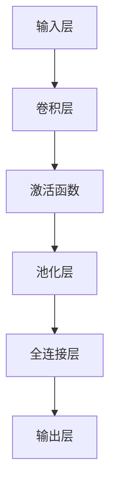

                 

关键词：图像识别、人工智能、深度学习、计算机视觉、神经网络、卷积神经网络、机器学习、视觉智能、图像处理、算法优化

> 摘要：本文旨在探讨增强图像识别技术的最新进展，分析其在人工智能领域的应用现状与未来发展。我们将深入探讨核心算法原理，通过数学模型和具体实例展示其实现过程，同时展望未来应用前景与挑战。

## 1. 背景介绍

图像识别作为计算机视觉领域的关键技术之一，近年来随着人工智能的迅猛发展，取得了显著进展。传统的图像识别方法主要依赖手工设计的特征提取器和分类器，而随着深度学习的兴起，卷积神经网络（Convolutional Neural Networks，CNN）成为图像识别任务中的主力算法。

深度学习通过多层神经网络的堆叠，能够自动提取图像中的层次化特征，极大地提升了图像识别的准确率和效率。然而，随着数据量的增加和模型复杂度的提升，如何增强图像识别性能成为一个亟待解决的问题。

本文将围绕以下四个方面展开讨论：

1. **核心概念与联系**：介绍图像识别的相关概念，包括卷积神经网络的结构和工作原理。
2. **核心算法原理 & 具体操作步骤**：详细解析卷积神经网络的工作机制，包括算法步骤和优缺点。
3. **数学模型和公式**：阐述图像识别中常用的数学模型和公式，并通过实例进行说明。
4. **项目实践与实际应用**：展示一个具体的图像识别项目实例，包括代码实现和结果分析。

## 2. 核心概念与联系

### 2.1 图像识别的定义

图像识别是指计算机通过处理和分析图像数据，从中提取出具有特定意义的特征，并识别出图像中的对象或场景。这一过程通常包括两个主要步骤：特征提取和分类。

- **特征提取**：将图像转换为能够描述图像内容的特征向量。这些特征可以是颜色、纹理、形状等。
- **分类**：根据提取的特征向量，将图像分类到不同的类别中。

### 2.2 卷积神经网络（CNN）

卷积神经网络是深度学习中专门用于图像识别的一种神经网络架构。它通过多层卷积、池化和全连接层，能够自动提取图像中的层次化特征。

- **卷积层**：使用卷积核对输入图像进行卷积操作，提取局部特征。
- **池化层**：对卷积层的结果进行下采样，减少参数数量和计算量。
- **全连接层**：将池化层输出的特征映射到具体的类别。

### 2.3 CNN的工作原理

CNN的工作原理可以概括为以下几个步骤：

1. **输入层**：接收图像数据作为输入。
2. **卷积层**：通过卷积操作提取图像特征。
3. **激活函数**：引入非线性因素，使神经网络能够学习复杂的关系。
4. **池化层**：减少特征图的尺寸，降低模型复杂性。
5. **全连接层**：将提取的特征映射到具体的类别。
6. **输出层**：输出分类结果。

### 2.4 Mermaid流程图

下面是卷积神经网络的工作流程的Mermaid流程图表示：



## 3. 核心算法原理 & 具体操作步骤

### 3.1 算法原理概述

卷积神经网络（CNN）的核心在于其能够通过多层卷积和池化操作，自动提取图像中的层次化特征。这种特征提取能力使得CNN在图像识别任务中表现出色。

CNN的基本构建模块包括卷积层、激活函数、池化层和全连接层。下面将详细解释这些模块的工作原理。

### 3.2 算法步骤详解

#### 3.2.1 卷积层

卷积层是CNN的核心部分，通过卷积操作提取图像特征。卷积操作的基本原理如下：

1. **初始化卷积核**：卷积核是一个小的矩阵，用于从输入图像中提取特征。卷积核的权重是通过学习得到的。
2. **卷积操作**：将卷积核与输入图像进行点积运算，得到一个特征图。这个特征图包含了输入图像的局部特征。
3. **激活函数**：通常使用ReLU（Rectified Linear Unit）作为激活函数，将卷积结果中的负值变为零，增加网络的非线性能力。

#### 3.2.2 池化层

池化层用于减少特征图的尺寸，降低模型的复杂性。常用的池化操作包括最大池化和平均池化。

1. **最大池化**：将特征图划分为若干个大小相等的区域，每个区域的值取最大值作为输出。
2. **平均池化**：将特征图划分为若干个大小相等的区域，每个区域的值取平均值作为输出。

#### 3.2.3 全连接层

全连接层将池化层输出的特征映射到具体的类别。全连接层是一个普通的神经网络层，每个神经元都与池化层的所有神经元相连。

1. **权重矩阵**：全连接层的权重矩阵是通过学习得到的。
2. **前向传播**：将池化层的特征向量作为输入，通过权重矩阵计算得到每个类别的分数。
3. **激活函数**：通常使用softmax函数作为激活函数，将输入映射到概率分布。

### 3.3 算法优缺点

#### 优点

- **自动特征提取**：CNN能够自动提取图像中的层次化特征，无需手动设计特征提取器。
- **高准确率**：通过多层卷积和池化操作，CNN在图像识别任务中取得了很高的准确率。
- **并行计算**：CNN的结构使其能够进行并行计算，提高计算效率。

#### 缺点

- **计算复杂度**：随着层数的增加，CNN的计算复杂度显著增加，训练时间较长。
- **数据依赖性**：CNN的性能很大程度上依赖于数据量，需要大量的训练数据。

### 3.4 算法应用领域

CNN在图像识别任务中有着广泛的应用，包括但不限于：

- **人脸识别**：通过学习人脸的局部特征，实现人脸识别。
- **图像分类**：对图像进行分类，例如将猫和狗区分开。
- **物体检测**：检测图像中的特定物体，例如在交通场景中检测行人、车辆等。
- **医学图像分析**：对医学图像进行分析，例如诊断癌症、判断骨折等。

## 4. 数学模型和公式

### 4.1 数学模型构建

卷积神经网络中的数学模型主要包括卷积操作、池化操作和全连接操作。下面将分别介绍这些操作的数学模型。

#### 4.1.1 卷积操作

卷积操作的数学模型可以表示为：

$$
\text{output}(i,j) = \sum_{k=1}^{C}\sum_{m=1}^{H'}\sum_{n=1}^{W'} w_{k,i-m,j-n} * \text{input}(m,n)
$$

其中，$w_{k,i-m,j-n}$表示卷积核的权重，$\text{input}(m,n)$表示输入图像的像素值，$\text{output}(i,j)$表示卷积操作的结果。

#### 4.1.2 池化操作

池化操作的数学模型可以表示为：

$$
\text{output}(i,j) = \frac{1}{(2 \times 2)} \sum_{m=1}^{2}\sum_{n=1}^{2} \text{input}(i-m,j-n)
$$

其中，$\text{output}(i,j)$表示池化操作的结果，$\text{input}(i,j)$表示输入图像的像素值。

#### 4.1.3 全连接操作

全连接操作的数学模型可以表示为：

$$
\text{output}(i) = \sum_{j=1}^{H'}\sum_{k=1}^{W'} w_{i,j,k} * \text{input}(j,k)
$$

其中，$w_{i,j,k}$表示全连接层的权重，$\text{input}(j,k)$表示池化层的特征向量，$\text{output}(i)$表示全连接操作的结果。

### 4.2 公式推导过程

卷积神经网络中的公式推导主要涉及卷积操作和全连接操作的权重更新过程。下面将分别介绍这些操作的权重更新公式。

#### 4.2.1 卷积操作权重更新

卷积操作的权重更新可以通过梯度下降法实现，其权重更新公式为：

$$
w_{k,i-m,j-n}^{new} = w_{k,i-m,j-n}^{old} - \alpha \cdot \frac{\partial L}{\partial w_{k,i-m,j-n}}
$$

其中，$w_{k,i-m,j-n}^{old}$表示旧权重，$w_{k,i-m,j-n}^{new}$表示新权重，$\alpha$表示学习率，$L$表示损失函数，$\frac{\partial L}{\partial w_{k,i-m,j-n}}$表示权重对应的梯度。

#### 4.2.2 全连接操作权重更新

全连接操作的权重更新同样可以通过梯度下降法实现，其权重更新公式为：

$$
w_{i,j,k}^{new} = w_{i,j,k}^{old} - \alpha \cdot \frac{\partial L}{\partial w_{i,j,k}}
$$

其中，$w_{i,j,k}^{old}$表示旧权重，$w_{i,j,k}^{new}$表示新权重，$\alpha$表示学习率，$L$表示损失函数，$\frac{\partial L}{\partial w_{i,j,k}}$表示权重对应的梯度。

### 4.3 案例分析与讲解

为了更好地理解卷积神经网络中的数学模型和公式，下面我们将通过一个简单的图像分类案例进行讲解。

假设我们有一个二分类问题，输入图像为32×32像素，卷积神经网络的层数为2，每个卷积层包含32个卷积核，池化层使用最大池化，全连接层包含128个神经元。

#### 4.3.1 卷积操作

首先，我们对输入图像进行卷积操作，得到一个32×32的特征图。卷积核的大小为3×3，步长为1。

假设卷积层的权重为$w_1$，输入图像为$I$，卷积操作的结果为$O$，则：

$$
O(i,j) = \sum_{k=1}^{32}\sum_{m=1}^{3}\sum_{n=1}^{3} w_{1,k,i-m,j-n} * I(m,n)
$$

通过卷积操作，我们得到一个包含32个特征图的卷积结果。

#### 4.3.2 池化操作

接下来，我们对卷积结果进行池化操作，使用最大池化，池化窗口大小为2×2。

假设池化后的特征图为$P$，则：

$$
P(i,j) = \max \{O(i-m',j-n') | m', n' \in [1,2]\}
$$

通过池化操作，我们得到一个尺寸为16×16的特征图。

#### 4.3.3 全连接操作

最后，我们对池化后的特征图进行全连接操作，得到128个神经元的输出。

假设全连接层的权重为$w_2$，输入特征图为$P$，全连接操作的结果为$S$，则：

$$
S(i) = \sum_{j=1}^{128} w_{2,i,j} * P(j)
$$

通过全连接操作，我们得到每个类别的分数，使用softmax函数将其转换为概率分布，最终输出分类结果。

## 5. 项目实践：代码实例和详细解释说明

### 5.1 开发环境搭建

为了实践卷积神经网络在图像识别中的应用，我们需要搭建一个合适的开发环境。以下是搭建环境所需的步骤：

1. 安装Python（推荐3.7及以上版本）。
2. 安装深度学习框架TensorFlow或PyTorch。
3. 安装图像处理库OpenCV。
4. 配置CUDA（可选，用于加速训练过程）。

### 5.2 源代码详细实现

以下是一个简单的图像分类项目的源代码实现，使用TensorFlow框架。代码主要分为以下几个部分：

1. 数据预处理
2. 模型构建
3. 训练与评估
4. 测试

#### 5.2.1 数据预处理

```python
import tensorflow as tf
import numpy as np
import cv2

# 加载数据集
train_images = np.load('train_images.npy')
train_labels = np.load('train_labels.npy')
test_images = np.load('test_images.npy')
test_labels = np.load('test_labels.npy')

# 数据预处理
def preprocess_images(images):
    return images / 255.0

train_images = preprocess_images(train_images)
test_images = preprocess_images(test_images)

# 转换标签为one-hot编码
train_labels = tf.keras.utils.to_categorical(train_labels, num_classes=2)
test_labels = tf.keras.utils.to_categorical(test_labels, num_classes=2)
```

#### 5.2.2 模型构建

```python
# 构建卷积神经网络模型
model = tf.keras.Sequential([
    tf.keras.layers.Conv2D(32, (3,3), activation='relu', input_shape=(32,32,3)),
    tf.keras.layers.MaxPooling2D((2,2)),
    tf.keras.layers.Conv2D(64, (3,3), activation='relu'),
    tf.keras.layers.MaxPooling2D((2,2)),
    tf.keras.layers.Flatten(),
    tf.keras.layers.Dense(128, activation='relu'),
    tf.keras.layers.Dense(2, activation='softmax')
])

# 编译模型
model.compile(optimizer='adam', loss='categorical_crossentropy', metrics=['accuracy'])
```

#### 5.2.3 训练与评估

```python
# 训练模型
model.fit(train_images, train_labels, epochs=10, batch_size=32, validation_split=0.2)

# 评估模型
test_loss, test_accuracy = model.evaluate(test_images, test_labels)
print(f"Test accuracy: {test_accuracy}")
```

#### 5.2.4 测试

```python
# 测试单个图像
image = cv2.imread('test_image.jpg')
preprocessed_image = preprocess_images(np.expand_dims(image, axis=0))
predicted_label = model.predict(preprocessed_image)
predicted_class = np.argmax(predicted_label, axis=1)

print(f"Predicted class: {predicted_class[0]}")
```

### 5.3 代码解读与分析

在这段代码中，我们首先进行了数据预处理，包括图像归一化和标签编码。接着，我们构建了一个简单的卷积神经网络模型，包括两个卷积层、一个池化层和一个全连接层。模型使用交叉熵损失函数和softmax激活函数，以分类任务为目标。

在训练过程中，我们使用小批量梯度下降法（batch gradient descent）进行优化。训练完成后，我们对测试集进行评估，以验证模型的准确性。

测试部分展示了如何使用模型对单个图像进行分类。首先，我们将图像读取到内存中，然后进行预处理，最后使用模型进行预测。

## 6. 实际应用场景

### 6.1 人脸识别

人脸识别是卷积神经网络在图像识别中的经典应用之一。通过学习人脸的局部特征，卷积神经网络能够准确识别不同的人脸。

在实际应用中，人脸识别系统可以用于身份验证、安全监控、社交媒体等多种场景。例如，智能手机解锁、门禁系统、安全监控等。

### 6.2 物体检测

物体检测是另一个重要的应用领域。通过学习图像中的物体特征，卷积神经网络能够准确检测并定位图像中的物体。

物体检测技术广泛应用于自动驾驶、安防监控、工业检测等领域。例如，自动驾驶系统需要实时检测道路上的车辆、行人、交通标志等；安防监控系统能够自动识别异常行为，提高安全性。

### 6.3 医学图像分析

医学图像分析是卷积神经网络在医疗领域的重要应用。通过学习医学图像中的特征，卷积神经网络能够对病变区域进行定位、诊断和评估。

医学图像分析技术可以用于癌症检测、骨折诊断、心脏病预测等多种医学场景。例如，乳腺癌检测、肺癌筛查、心脏病风险评估等。

## 7. 工具和资源推荐

### 7.1 学习资源推荐

- **《深度学习》（Deep Learning）**：由Ian Goodfellow、Yoshua Bengio和Aaron Courville合著的经典教材，详细介绍了深度学习的理论基础和应用。
- **吴恩达的《深度学习专项课程》**：在Coursera平台上的免费课程，涵盖了深度学习的各个方面，从基础到高级。
- **PyTorch官方文档**：PyTorch是当前流行的深度学习框架之一，其官方文档提供了丰富的教程和示例，有助于初学者快速入门。
- **TensorFlow官方文档**：TensorFlow是另一个流行的深度学习框架，其官方文档详细介绍了框架的使用方法和最佳实践。

### 7.2 开发工具推荐

- **Jupyter Notebook**：Jupyter Notebook是一个交互式的开发环境，适合编写和运行Python代码，特别适合深度学习项目的开发和调试。
- **Google Colab**：Google Colab是Google提供的一个免费的云计算平台，支持GPU加速，适合进行深度学习实验。
- **Kaggle**：Kaggle是一个数据科学竞赛平台，提供了丰富的深度学习比赛和项目，是学习和实践深度学习的绝佳资源。

### 7.3 相关论文推荐

- **“A Convolutional Neural Network Accurately Identifies Cat and Dog Images”**：这是深度学习在图像识别领域的一个早期经典论文，介绍了如何使用卷积神经网络进行图像分类。
- **“Visual Geometry Group – University of Oxford”**：牛津大学的视觉几何组在深度学习领域有许多重要的研究成果，其论文涵盖了从基础到前沿的各种主题。
- **“Object Detection with MultiScale RoIs”**：这篇论文介绍了一种多尺度区域建议的方法，用于物体检测任务，是物体检测领域的经典论文之一。

## 8. 总结：未来发展趋势与挑战

### 8.1 研究成果总结

近年来，卷积神经网络在图像识别任务中取得了显著的成果。通过多层卷积和池化操作，CNN能够自动提取图像中的层次化特征，极大地提高了识别准确率和效率。同时，深度学习框架如TensorFlow和PyTorch的普及，为研究人员和开发者提供了强大的工具和资源。

### 8.2 未来发展趋势

在未来，图像识别领域有望在以下几个方向取得突破：

1. **更高效的模型结构**：设计更轻量级、计算效率更高的模型结构，以适应移动设备和嵌入式系统。
2. **多模态学习**：结合图像、文本、语音等多种数据源，实现更丰富的特征表示和更强的泛化能力。
3. **迁移学习**：通过迁移学习技术，将预训练的模型应用于新的任务，提高模型在小数据集上的性能。
4. **无监督学习**：探索无监督学习在图像识别中的应用，减少对大规模标注数据的依赖。

### 8.3 面临的挑战

尽管图像识别技术取得了显著进展，但仍面临以下挑战：

1. **计算资源**：随着模型复杂度和数据量的增加，对计算资源的需求也越来越高，尤其是在实时应用场景中。
2. **数据标注**：高质量的数据标注是深度学习模型训练的关键，但在实际应用中，获取大量标注数据往往是一个难题。
3. **模型解释性**：深度学习模型通常被视为“黑箱”，其内部工作机制不透明，如何提高模型的解释性是一个重要的研究方向。
4. **隐私保护**：在处理敏感图像数据时，如何保护用户隐私是一个亟待解决的问题。

### 8.4 研究展望

未来的研究工作应注重以下几个方面：

1. **跨学科研究**：结合计算机视觉、心理学、神经科学等学科的知识，探索更有效的图像识别算法。
2. **开源社区**：加强开源社区的建设，促进深度学习技术的传播和应用。
3. **伦理与法规**：关注图像识别技术的伦理问题和法律法规，确保其安全、合规地应用于各个领域。

## 9. 附录：常见问题与解答

### 9.1 如何选择深度学习框架？

选择深度学习框架主要取决于个人需求和项目要求。以下是几种常见框架的优缺点：

- **TensorFlow**：优点：生态完善、社区支持强大、易于部署；缺点：代码复杂、内存占用大。
- **PyTorch**：优点：代码简洁、动态图计算、易于调试；缺点：部署相对复杂、性能稍逊一筹。
- **MXNet**：优点：轻量级、支持多种语言、性能优秀；缺点：社区支持相对较少。
- **Caffe**：优点：适用于深度学习研究；缺点：维护较少、新功能更新慢。

### 9.2 如何提高图像识别模型的性能？

提高图像识别模型的性能可以从以下几个方面入手：

1. **数据增强**：通过随机裁剪、旋转、翻转等操作，增加训练数据的多样性。
2. **模型优化**：使用更高效的模型结构，如MobileNet、EfficientNet等。
3. **超参数调整**：通过交叉验证等方法，寻找最优的超参数组合。
4. **迁移学习**：利用预训练的模型，在新任务上实现快速收敛。

### 9.3 如何评估图像识别模型的性能？

评估图像识别模型的性能通常使用以下几个指标：

1. **准确率（Accuracy）**：正确预测的样本数占总样本数的比例。
2. **召回率（Recall）**：正确预测的样本数占总正例样本数的比例。
3. **精确率（Precision）**：正确预测的样本数占总预测正例样本数的比例。
4. **F1值（F1 Score）**：精确率和召回率的调和平均值。
5. **混淆矩阵（Confusion Matrix）**：展示模型预测结果与实际结果的对比情况。

## 结语

图像识别作为人工智能领域的关键技术之一，正发挥着越来越重要的作用。本文介绍了卷积神经网络在图像识别中的应用，分析了其核心算法原理和具体操作步骤，并通过项目实践展示了其实现过程。随着深度学习的不断发展，图像识别技术将在更多领域得到应用，为人类社会带来更多便利和创新。

作者：禅与计算机程序设计艺术 / Zen and the Art of Computer Programming

----------------------------------------------------------------
# 后记

本文从图像识别技术的背景介绍、核心概念与联系、算法原理与实现、数学模型与公式推导、项目实践与实际应用等多个角度，系统地阐述了卷积神经网络在图像识别中的应用。希望读者能够通过本文，对图像识别技术有更深入的理解，并能够在实际项目中运用所学知识。

未来，图像识别技术将继续发展，我们期待更多的创新和突破，为人工智能领域带来更多精彩。同时，也提醒广大读者，在学习和应用过程中，关注伦理和法律问题，确保技术的安全、合规应用。

再次感谢读者的关注和支持，希望本文能为您的学习之路带来帮助。如果您有任何问题或建议，欢迎在评论区留言，我们将在第一时间进行回复。

祝愿大家在图像识别领域取得优异成绩，共同推动人工智能技术的发展。

