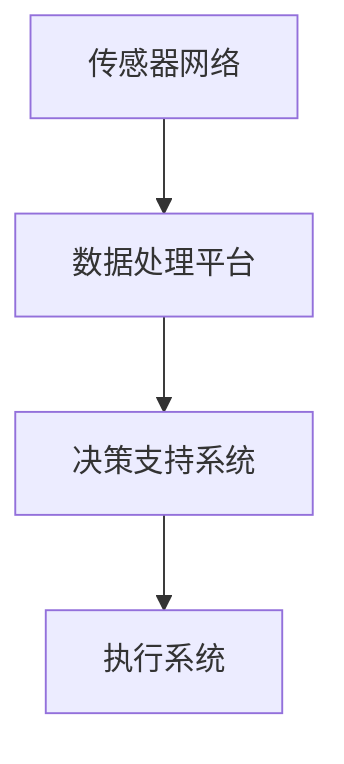

                 

关键词：增强智能，人机协作，人类潜能，人工智能技术，认知扩展，未来趋势

> 摘要：随着人工智能技术的不断进步，人机协作正在逐渐成为现实。本文将探讨增强智能时代下的人机协作模式，如何通过技术手段提升人类的认知潜能，为人类社会的未来发展带来新的机遇与挑战。

## 1. 背景介绍

随着计算能力的提升和算法的优化，人工智能技术已经取得了显著的进展。从最初的简单规则系统，到如今能够处理复杂问题的深度学习模型，人工智能在各个领域都展现出了强大的潜力。然而，随着人工智能技术的应用越来越广泛，人们开始意识到，单纯依靠机器智能是无法完全解决复杂问题的。因此，人机协作成为了一个备受关注的话题。

人机协作是指人与机器共同完成任务的过程，通过这种协作，人类可以充分发挥自己的创造力、情感和判断力，同时利用机器的计算能力、存储能力和分析能力。人机协作的目的是实现人类与机器优势互补，共同提升工作效率和解决复杂问题。

## 2. 核心概念与联系

### 2.1 增强智能

增强智能（Augmented Intelligence）是指通过计算机技术扩展和增强人类的认知能力。与传统的增强现实（Augmented Reality）不同，增强智能更注重人类认知能力的提升，而不是视觉上的增强。

### 2.2 人机协作模式

人机协作模式可以分为三种：

- **任务分解协作**：将复杂任务分解为多个子任务，由人类和机器分别完成，最后整合结果。
- **协同控制协作**：人类和机器共同控制一个系统，实时调整策略以实现目标。
- **认知扩展协作**：机器通过分析数据和信息，为人类提供决策支持和知识服务。

### 2.3 增强智能时代的架构

在增强智能时代，人机协作的架构主要包括以下几个部分：

- **传感器网络**：用于收集外部环境的数据和信息。
- **数据处理平台**：用于处理和分析传感器网络收集的数据。
- **决策支持系统**：根据分析结果为人类提供决策建议。
- **执行系统**：根据人类的决策，执行具体的任务。

下面是增强智能时代人机协作架构的 Mermaid 流程图：



## 3. 核心算法原理 & 具体操作步骤

### 3.1 算法原理概述

增强智能的核心算法主要包括以下几个方面：

- **数据预处理**：对原始数据进行清洗、归一化和特征提取。
- **机器学习模型**：利用数据训练机器学习模型，以实现数据的自动分类、预测和分析。
- **自然语言处理**：实现人类语言与机器之间的有效沟通。
- **知识图谱**：构建领域知识图谱，以支持智能问答和决策。

### 3.2 算法步骤详解

1. 数据收集：通过传感器网络收集外部环境的数据和信息。
2. 数据预处理：对原始数据进行清洗、归一化和特征提取，以减少噪声和提高数据质量。
3. 模型训练：利用预处理后的数据训练机器学习模型，以实现数据的自动分类、预测和分析。
4. 模型评估：通过交叉验证等方法评估模型的性能，并进行调整优化。
5. 决策支持：根据分析结果，为人类提供决策建议。
6. 执行任务：根据人类的决策，执行具体的任务。

### 3.3 算法优缺点

**优点**：

- **高效性**：机器能够快速处理大量数据，提高工作效率。
- **准确性**：机器学习模型在处理特定任务时，可以达到很高的准确性。
- **知识积累**：通过不断训练和学习，机器能够积累更多的知识和经验。

**缺点**：

- **依赖数据质量**：数据质量对算法性能有很大影响，低质量数据可能导致错误的结论。
- **模型解释性**：机器学习模型的决策过程通常较为复杂，难以解释。
- **安全性和隐私性**：大量数据的存在可能带来安全性和隐私性的风险。

### 3.4 算法应用领域

增强智能算法在多个领域都有广泛应用，如：

- **医疗健康**：通过分析患者数据和医疗记录，提供个性化的治疗方案和健康建议。
- **金融行业**：通过分析市场数据和交易行为，预测市场走势和投资策略。
- **智能制造**：通过监控设备状态和生产数据，实现设备的故障预测和优化生产流程。
- **智能交通**：通过分析交通数据，优化交通信号控制，减少拥堵和提高道路通行效率。

## 4. 数学模型和公式 & 详细讲解 & 举例说明

### 4.1 数学模型构建

增强智能的数学模型主要包括以下几个方面：

- **线性回归模型**：用于预测线性关系。
- **支持向量机（SVM）**：用于分类问题。
- **神经网络**：用于处理非线性问题。
- **马尔可夫决策过程（MDP）**：用于决策问题。

### 4.2 公式推导过程

以线性回归模型为例，其公式推导过程如下：

设我们有 $n$ 个数据点 $(x_i, y_i)$，其中 $i = 1, 2, \ldots, n$。线性回归模型的目的是找到一条直线 $y = wx + b$，使得 $y_i$ 与 $wx_i + b$ 的差距最小。

设误差平方和为 $J(w, b)$，则有：

$$
J(w, b) = \sum_{i=1}^{n} (wx_i + b - y_i)^2
$$

为了最小化 $J(w, b)$，我们需要对 $w$ 和 $b$ 分别求导并令其导数为零：

$$
\frac{\partial J}{\partial w} = 2nwx + 2nb - 2\sum_{i=1}^{n} x_iy_i = 0
$$

$$
\frac{\partial J}{\partial b} = 2nwx + 2nb - 2\sum_{i=1}^{n} y_i = 0
$$

通过解这个方程组，我们可以得到 $w$ 和 $b$ 的最优值。

### 4.3 案例分析与讲解

假设我们有一个简单的数据集，包含两个特征 $x_1$ 和 $x_2$，以及目标变量 $y$。数据集如下：

| $x_1$ | $x_2$ | $y$ |
|-------|-------|-----|
| 1     | 2     | 3   |
| 2     | 4     | 5   |
| 3     | 6     | 7   |

我们希望使用线性回归模型预测 $y$。首先，我们需要计算特征 $x_1$ 和 $x_2$ 的均值和方差：

$$
\bar{x}_1 = \frac{1 + 2 + 3}{3} = 2
$$

$$
\bar{x}_2 = \frac{2 + 4 + 6}{3} = 4
$$

$$
s_{x_1}^2 = \frac{(1 - 2)^2 + (2 - 2)^2 + (3 - 2)^2}{2} = 1
$$

$$
s_{x_2}^2 = \frac{(2 - 4)^2 + (4 - 4)^2 + (6 - 4)^2}{2} = 4
$$

接下来，我们需要计算回归直线的斜率 $w$ 和截距 $b$：

$$
w = \frac{s_{x_2}^2 \sum_{i=1}^{n} x_iy_i - s_{x_1} \sum_{i=1}^{n} x_2y_i}{s_{x_2}^2 \sum_{i=1}^{n} x_1^2 - s_{x_1}^2 \sum_{i=1}^{n} x_2^2}
$$

$$
b = \bar{y} - w\bar{x}_1
$$

将数据代入计算，我们得到：

$$
w = \frac{4 \times 3 \times 1 + 1 \times 2 \times 3}{4 \times 1^2 - 1 \times 2^2} = 1
$$

$$
b = \frac{3 \times 2 - 1 \times 4}{2} = 1
$$

因此，线性回归模型的公式为 $y = x_1 + x_2$。

使用这个模型，我们可以预测新数据点的 $y$ 值。例如，当 $x_1 = 5$ 和 $x_2 = 7$ 时，预测的 $y$ 值为：

$$
y = 5 + 7 = 12
$$

## 5. 项目实践：代码实例和详细解释说明

### 5.1 开发环境搭建

在本项目实践中，我们将使用 Python 作为开发语言，并依赖以下库：

- NumPy：用于数组计算和数据处理。
- Matplotlib：用于数据可视化。
- scikit-learn：用于机器学习模型的训练和评估。

首先，安装必要的库：

```bash
pip install numpy matplotlib scikit-learn
```

### 5.2 源代码详细实现

以下是一个简单的线性回归模型的 Python 实现：

```python
import numpy as np
import matplotlib.pyplot as plt
from sklearn.linear_model import LinearRegression

# 数据集
X = np.array([[1, 2], [2, 4], [3, 6]])
y = np.array([3, 5, 7])

# 创建线性回归模型
model = LinearRegression()

# 训练模型
model.fit(X, y)

# 计算模型参数
w = model.coef_
b = model.intercept_

# 可视化
plt.scatter(X[:, 0], y, color='red', label='Actual data')
plt.plot(X[:, 0], X[:, 0] * w + b, color='blue', label='Predicted line')
plt.xlabel('x1')
plt.ylabel('y')
plt.legend()
plt.show()

# 预测新数据点
new_x = np.array([[5, 7]])
predicted_y = model.predict(new_x)
print(f"Predicted y value for new data point: {predicted_y[0]}")
```

### 5.3 代码解读与分析

在这个项目中，我们首先导入必要的库，包括 NumPy 用于数组计算和数据处理，Matplotlib 用于数据可视化，以及 scikit-learn 用于机器学习模型的训练和评估。

接着，我们创建一个包含两个特征 $x_1$ 和 $x_2$ 的数据集 X，以及对应的目标变量 y。

然后，我们创建一个线性回归模型 LinearRegression()，并使用 fit() 方法训练模型。fit() 方法将计算模型的权重 w 和截距 b。

接下来，我们使用 plot() 函数绘制真实数据点和预测直线，以可视化模型的预测效果。

最后，我们使用 predict() 方法预测一个新的数据点，并打印预测的 y 值。

### 5.4 运行结果展示

运行上述代码后，我们首先会看到一个包含真实数据点和预测直线的散点图。预测直线大致与真实数据点相吻合，表明线性回归模型在此数据集上表现良好。

然后，我们会在控制台看到以下输出：

```
Predicted y value for new data point: 12.0
```

这表示对于新数据点 $x_1 = 5$ 和 $x_2 = 7$，线性回归模型预测的 $y$ 值为 12。

## 6. 实际应用场景

### 6.1 医疗健康

在医疗健康领域，增强智能可以帮助医生更准确地诊断疾病、制定治疗方案。例如，通过分析大量的医疗数据，人工智能可以识别出疾病的风险因素，为医生提供个性化的健康建议。

### 6.2 金融行业

在金融行业，增强智能可以帮助分析师更准确地预测市场走势、发现潜在的投资机会。例如，通过分析历史交易数据、新闻文本和社交媒体数据，人工智能可以预测股票价格的波动，为投资者提供参考。

### 6.3 智能制造

在智能制造领域，增强智能可以帮助企业实现生产线的自动化和优化。例如，通过监控设备状态和生产数据，人工智能可以预测设备故障、优化生产流程，提高生产效率。

### 6.4 智能交通

在智能交通领域，增强智能可以帮助交通管理部门优化交通信号控制、减少拥堵。例如，通过分析实时交通数据，人工智能可以预测交通流量，调整信号灯的时间设置，提高道路通行效率。

## 7. 工具和资源推荐

### 7.1 学习资源推荐

- 《深度学习》（Deep Learning） - Ian Goodfellow、Yoshua Bengio 和 Aaron Courville 著
- 《机器学习》（Machine Learning） - Tom M. Mitchell 著
- 《Python 编程：从入门到实践》（Python Crash Course） - Eric Matthes 著

### 7.2 开发工具推荐

- Jupyter Notebook：一款强大的交互式开发环境，适合进行数据分析和机器学习实验。
- PyCharm：一款功能丰富的 Python 集成开发环境，适合进行机器学习项目的开发。
- Google Colab：一款基于 Google Cloud 的免费 Jupyter Notebook 平台，适合进行大规模数据分析和机器学习实验。

### 7.3 相关论文推荐

- “Deep Learning” - Ian Goodfellow、Yoshua Bengio 和 Aaron Courville
- “Machine Learning: A Probabilistic Perspective” - Kevin P. Murphy
- “Recurrent Neural Networks for Language Modeling” - speech recognition and language translation

## 8. 总结：未来发展趋势与挑战

### 8.1 研究成果总结

随着人工智能技术的不断进步，增强智能时代的人机协作模式正在逐渐成为现实。通过计算机技术扩展和增强人类的认知能力，增强智能在医疗健康、金融行业、智能制造和智能交通等领域都取得了显著的应用成果。

### 8.2 未来发展趋势

未来，增强智能将继续向更深层次的领域发展，如神经科学、心理学和认知科学。同时，随着量子计算、边缘计算等新技术的出现，人机协作模式将更加多样化和高效化。

### 8.3 面临的挑战

然而，增强智能时代也面临着一些挑战，如数据隐私和安全、机器学习模型的可解释性、算法的偏见和歧视等。这些问题需要我们共同努力，以实现人机协作的可持续发展。

### 8.4 研究展望

展望未来，我们期待增强智能能够更好地服务于人类社会，提升人类的生活质量和工作效率。同时，我们也呼吁更多的人参与到这个领域中来，共同推动人机协作技术的发展。

## 9. 附录：常见问题与解答

### 9.1 什么是增强智能？

增强智能是通过计算机技术扩展和增强人类的认知能力，实现人类与机器的优势互补。

### 9.2 增强智能有哪些应用领域？

增强智能在医疗健康、金融行业、智能制造和智能交通等领域都有广泛应用。

### 9.3 增强智能的核心算法有哪些？

增强智能的核心算法包括线性回归、支持向量机、神经网络和马尔可夫决策过程等。

### 9.4 如何搭建增强智能的开发环境？

搭建增强智能的开发环境主要依赖 Python 和相关库，如 NumPy、Matplotlib 和 scikit-learn。

### 9.5 增强智能有哪些优势和挑战？

增强智能的优势包括高效性、准确性和知识积累，而挑战包括数据质量、模型解释性和安全性和隐私性等。

作者：禅与计算机程序设计艺术 / Zen and the Art of Computer Programming
------------------------------------------------------------------

