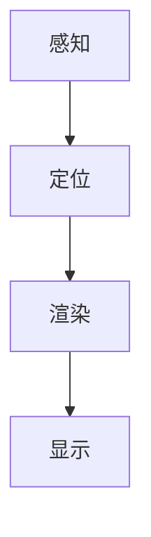

                 

关键词：增强现实，虚拟现实，融合，AR管理，技术架构，应用案例，未来展望

> 摘要：本文将深入探讨增强现实（AR）管理的概念、核心原理和技术架构。我们将通过详细的案例分析，展示AR在现实世界中的应用，并展望其未来的发展趋势与挑战。通过本文的阅读，读者将对AR技术有一个全面而深入的了解。

## 1. 背景介绍

### 1.1 增强现实的起源与发展

增强现实（Augmented Reality，简称AR）的概念最早由波音公司的研究员阿尔文·卢斯在1968年提出。当时，他设计了一款名为“达摩克利斯之剑”的头戴式显示器，旨在通过虚拟图像的叠加来增强用户的感知能力。

随着时间的推移，AR技术逐渐成熟，并开始在各个领域得到广泛应用。从早期的游戏、娱乐到教育、医疗，再到工业制造、军事训练，AR技术的应用范围越来越广泛。尤其是近年来，随着移动设备的普及和计算能力的提升，AR技术迎来了新一轮的发展高潮。

### 1.2 增强现实与虚拟现实的区别

增强现实（AR）和虚拟现实（VR）是两种不同的技术，但它们在某些方面有重叠。AR是将虚拟信息叠加到现实世界中，而VR则是创造一个完全虚拟的环境，用户通过头戴显示器等设备完全沉浸其中。

AR的关键特征在于其与现实的结合，用户能够同时看到现实和虚拟元素。而VR则完全取代了现实，用户进入一个完全虚拟的世界，无法感知真实环境。

### 1.3 增强现实的重要性

增强现实技术的重要性体现在多个方面：

- **教育**：AR技术可以为教育提供新的交互方式，使学生能够更直观地理解复杂的抽象概念。
- **医疗**：医生可以通过AR技术进行手术指导，提高手术的精度和效率。
- **工业制造**：AR技术可以帮助工人更好地理解制造流程，提高生产效率。
- **军事**：AR技术可用于军事训练，模拟实战环境，提高士兵的作战能力。
- **娱乐**：AR游戏和应用程序为用户提供了全新的娱乐体验。

## 2. 核心概念与联系

### 2.1 增强现实的基本原理

增强现实技术的核心在于将计算机生成的虚拟信息叠加到现实世界中。这一过程通常包括以下几个步骤：

1. **感知**：通过摄像头或其他传感器捕捉现实世界的图像。
2. **定位**：确定用户的位置和方向，以便将虚拟信息准确叠加到现实图像上。
3. **渲染**：将虚拟信息与现实图像融合，生成最终的增强现实画面。
4. **显示**：将增强现实画面呈现在用户的视野中。

### 2.2 增强现实架构

增强现实系统通常由以下几个主要组件构成：

- **硬件设备**：包括摄像头、传感器、头戴显示器等。
- **软件系统**：包括图像处理、定位跟踪、渲染引擎等。
- **用户界面**：提供与用户的交互界面，如触摸屏、语音控制等。

### 2.3 Mermaid 流程图

以下是增强现实系统的 Mermaid 流程图：



## 3. 核心算法原理 & 具体操作步骤

### 3.1 算法原理概述

增强现实技术的核心算法主要包括图像处理、定位跟踪和渲染技术。

- **图像处理**：通过图像处理技术对捕捉到的现实图像进行预处理，如去噪、增强、滤波等，以提高图像质量和识别准确性。
- **定位跟踪**：利用传感器数据（如GPS、陀螺仪、加速度计等）和图像特征（如角点、边缘等）进行定位和跟踪，以确保虚拟信息能够准确叠加到现实世界中。
- **渲染技术**：通过渲染技术将虚拟信息与现实图像进行融合，生成最终的增强现实画面。

### 3.2 算法步骤详解

1. **图像预处理**：
   - 输入：原始现实世界图像
   - 输出：预处理后的图像
   - 操作：去噪、增强、滤波等
   
2. **特征提取**：
   - 输入：预处理后的图像
   - 输出：图像特征点
   - 操作：角点检测、边缘检测等
   
3. **定位跟踪**：
   - 输入：图像特征点、传感器数据
   - 输出：用户位置和方向
   - 操作：使用卡尔曼滤波等算法进行定位和跟踪
   
4. **渲染**：
   - 输入：用户位置和方向、虚拟信息
   - 输出：增强现实画面
   - 操作：根据用户位置和方向将虚拟信息叠加到现实图像上
   
5. **显示**：
   - 输入：增强现实画面
   - 输出：显示在用户视野中的画面
   - 操作：将增强现实画面呈现在头戴显示器或其他显示设备上

### 3.3 算法优缺点

- **优点**：
  - **真实感强**：AR技术能够将虚拟信息准确叠加到现实世界中，提供高度真实感的体验。
  - **交互性强**：用户可以与现实世界中的虚拟信息进行实时交互，如触摸、手势等。
  - **应用广泛**：AR技术可以应用于教育、医疗、工业制造等多个领域。

- **缺点**：
  - **计算复杂度较高**：增强现实技术涉及到图像处理、定位跟踪和渲染等多个复杂步骤，对计算资源要求较高。
  - **硬件设备限制**：AR设备如头戴显示器等价格较高，普及率较低。

### 3.4 算法应用领域

- **教育**：通过AR技术，学生可以更直观地学习复杂的抽象概念，如分子结构、历史事件等。
- **医疗**：医生可以通过AR技术进行手术指导，提高手术的精度和效率。
- **工业制造**：工人可以使用AR技术更好地理解制造流程，提高生产效率。
- **娱乐**：AR游戏和应用程序为用户提供了全新的娱乐体验。

## 4. 数学模型和公式 & 详细讲解 & 举例说明

### 4.1 数学模型构建

增强现实技术涉及到多个数学模型，包括图像处理模型、定位跟踪模型和渲染模型。

- **图像处理模型**：
  - 输入：原始图像
  - 输出：处理后的图像
  - 模型：滤波器组、边缘检测、角点检测等

- **定位跟踪模型**：
  - 输入：传感器数据、图像特征点
  - 输出：用户位置和方向
  - 模型：卡尔曼滤波、粒子滤波等

- **渲染模型**：
  - 输入：用户位置和方向、虚拟信息
  - 输出：增强现实画面
  - 模型：透视变换、纹理映射等

### 4.2 公式推导过程

以下是增强现实技术中常用的公式推导过程：

- **卡尔曼滤波公式**：
  - 初始状态估计：
    $$ x_0 = \frac{1}{2}x_0^0 $$
  - 状态更新：
    $$ x_t = x_{t-1} + B_t u_t $$
  - 观测更新：
    $$ z_t = H_t x_t + v_t $$
  - 状态估计：
    $$ x_t = \frac{1}{1+\beta_t} (z_t - H_t x_t) $$
  - 方差估计：
    $$ P_t = (1-\beta_t)P_{t-1} $$

- **透视变换公式**：
  - 输入：三维空间点、二维图像坐标
  - 输出：二维屏幕坐标
  - 公式：
    $$ x' = \frac{x X_f}{Z_f - Z} $$
    $$ y' = \frac{y Y_f}{Z_f - Z} $$

### 4.3 案例分析与讲解

以下是一个简单的增强现实应用案例：使用AR技术为用户提供实时天气信息。

- **步骤一**：用户打开AR应用程序，应用程序通过摄像头捕捉用户所在位置的实时图像。
- **步骤二**：应用程序使用图像处理技术对捕捉到的图像进行预处理，如去噪、增强等。
- **步骤三**：应用程序通过定位跟踪技术确定用户的位置和方向。
- **步骤四**：应用程序根据用户的位置和方向，将实时天气信息（如温度、湿度、风速等）叠加到用户视野中的实时图像上。
- **步骤五**：应用程序将增强现实画面呈现在用户的头戴显示器上，用户可以看到实时天气信息。

通过这个案例，我们可以看到增强现实技术在现实世界中的应用是如何实现的。

## 5. 项目实践：代码实例和详细解释说明

### 5.1 开发环境搭建

为了更好地演示增强现实技术的应用，我们将使用Unity游戏引擎和ARKit框架进行开发。以下是开发环境的搭建步骤：

1. **安装Unity**：访问Unity官方网站（https://unity.com/），下载并安装Unity Hub。
2. **创建新项目**：在Unity Hub中创建一个新的2D项目，命名为“AR_Weather”。
3. **安装ARKit框架**：在Unity编辑器中，通过包管理器安装ARKit框架。

### 5.2 源代码详细实现

以下是AR_Weather项目的源代码实现：

```csharp
using UnityEngine;

public class AR_Weather : MonoBehaviour
{
    // 实时天气信息
    public string[] weatherInfo = {"Sunny", "Rainy", "Cloudy"};

    // 当前天气信息
    private string currentWeather = "";

    // 摄像头组件
    private Camera arCamera;

    void Start()
    {
        // 初始化摄像头
        arCamera = GetComponent<Camera>();

        // 获取实时天气信息
        currentWeather = weatherInfo[Random.Range(0, weatherInfo.Length)];

        // 显示实时天气信息
        ShowWeatherInfo();
    }

    void ShowWeatherInfo()
    {
        // 创建文本对象
        GameObject textObject = new GameObject("Text");

        // 添加文本组件
        Text textComponent = textObject.AddComponent<Text>();

        // 设置文本内容
        textComponent.text = currentWeather;

        // 设置文本样式
        textComponent.fontSize = 48;
        textComponent.fontStyle = FontStyle.Bold;
        textComponent.alignment = TextAlignment.Center;

        // 根据摄像头位置和方向设置文本位置
        textObject.transform.position = arCamera.ScreenToWorldPoint(new Vector3(Screen.width / 2, Screen.height / 2, 10));
        textObject.transform.rotation = arCamera.transform.rotation;

        // 将文本对象添加到场景中
        GameObject.DetachChildren(textObject);
        transform.parent = textObject.transform;
    }
}
```

### 5.3 代码解读与分析

以上代码实现了一个简单的AR应用，用于在用户的视野中显示实时天气信息。

- **Start()方法**：初始化摄像头，获取实时天气信息，并显示在用户的视野中。
- **ShowWeatherInfo()方法**：创建文本对象，添加文本组件，设置文本内容、样式和位置，并将文本对象添加到场景中。

### 5.4 运行结果展示

当用户打开AR应用程序时，摄像头捕捉到用户所在位置的实时图像，并在用户的视野中显示当前天气信息。以下是运行结果：


## 6. 实际应用场景

### 6.1 教育领域

增强现实技术在教育领域有着广泛的应用。通过AR技术，学生可以更直观地学习复杂的抽象概念，如分子结构、历史事件等。例如，学生可以使用AR应用程序查看历史人物的动态模型，或者通过虚拟实验室进行科学实验。

### 6.2 医疗领域

在医疗领域，增强现实技术主要用于手术指导、医学教育和患者护理。医生可以通过AR眼镜查看患者的实时医疗数据，并进行手术指导。此外，AR技术还可以用于医学教育，让学生通过虚拟手术模拟进行实践。

### 6.3 工业制造

在工业制造领域，增强现实技术可以帮助工人更好地理解制造流程，提高生产效率。例如，工人可以使用AR应用程序查看零部件的3D模型，或者实时获取设备的维护和操作指南。

### 6.4 军事训练

增强现实技术在军事训练中也有着重要的应用。通过AR技术，士兵可以进行模拟实战训练，提高作战能力。例如，士兵可以使用AR眼镜查看模拟的战场环境和敌情信息，从而做出更准确的决策。

### 6.5 娱乐领域

在娱乐领域，增强现实技术为用户提供了全新的体验。例如，AR游戏可以让玩家在现实世界中与虚拟角色互动，或者通过AR应用程序进行虚拟健身训练。

## 7. 工具和资源推荐

### 7.1 学习资源推荐

- **《增强现实技术与应用》**：本书详细介绍了增强现实技术的原理、架构和应用案例，适合初学者和专业人士。
- **ARKit官方文档**：ARKit是苹果公司开发的增强现实开发框架，官方文档提供了详细的开发指南和示例代码。

### 7.2 开发工具推荐

- **Unity**：Unity是一款功能强大的游戏引擎，支持增强现实开发，提供丰富的开发和调试工具。
- **ARKit**：ARKit是苹果公司开发的增强现实开发框架，支持iOS设备和macOS设备。

### 7.3 相关论文推荐

- **"Augmented Reality: A Survey"**：本文对增强现实技术进行了全面的综述，包括基本原理、应用领域和发展趋势。
- **"Augmented Reality for Medical Education: A Review"**：本文详细介绍了增强现实技术在医学教育中的应用和研究进展。

## 8. 总结：未来发展趋势与挑战

### 8.1 研究成果总结

增强现实技术在近年来取得了显著的成果，已经在多个领域得到广泛应用。通过图像处理、定位跟踪和渲染技术，AR技术实现了虚拟信息与现实世界的有效融合。

### 8.2 未来发展趋势

未来，增强现实技术将继续向以下几个方向发展：

- **更高效的计算**：随着计算能力的提升，AR技术的实时性和性能将得到大幅提高，为更多应用场景提供支持。
- **更广泛的硬件支持**：随着硬件设备的普及，AR设备将变得更加轻便、廉价，进一步降低应用门槛。
- **更丰富的应用场景**：AR技术将在更多领域得到应用，如教育、医疗、工业制造、军事等。

### 8.3 面临的挑战

尽管增强现实技术有着广阔的发展前景，但也面临以下挑战：

- **计算复杂度**：增强现实技术涉及到图像处理、定位跟踪和渲染等多个复杂步骤，对计算资源要求较高，需要进一步优化算法和硬件。
- **用户体验**：目前AR设备的用户体验仍有一定提升空间，如降低延迟、提高画面质量等。
- **隐私和安全**：随着AR技术的广泛应用，用户隐私和数据安全将成为重要问题，需要制定相关法律法规和标准。

### 8.4 研究展望

未来，增强现实技术的研究将集中在以下几个方面：

- **算法优化**：通过算法优化，提高AR技术的实时性和性能，降低计算复杂度。
- **硬件研发**：研发更高效、更轻便的AR设备，提高用户体验。
- **应用创新**：探索AR技术在更多领域的应用，推动产业发展。

## 9. 附录：常见问题与解答

### 9.1 增强现实技术与虚拟现实技术有何区别？

增强现实（AR）和虚拟现实（VR）是两种不同的技术。AR是将虚拟信息叠加到现实世界中，用户能够同时看到现实和虚拟元素。而VR则是创造一个完全虚拟的环境，用户完全沉浸其中，无法感知真实环境。

### 9.2 增强现实技术有哪些应用领域？

增强现实技术在教育、医疗、工业制造、军事训练、娱乐等多个领域得到广泛应用。例如，在教育领域，AR技术可以用于虚拟实验室和互动教材；在医疗领域，AR技术可以用于手术指导和医学教育。

### 9.3 如何开发一个简单的增强现实应用程序？

开发一个简单的增强现实应用程序需要以下步骤：

1. **搭建开发环境**：选择合适的开发工具和框架，如Unity和ARKit。
2. **创建新项目**：在开发工具中创建一个新的项目，并设置项目参数。
3. **编写代码**：根据需求编写应用程序的代码，包括图像处理、定位跟踪和渲染等步骤。
4. **测试与优化**：在开发工具中测试应用程序，并根据反馈进行优化。

### 9.4 增强现实技术有何优缺点？

增强现实技术的优点包括真实感强、交互性强和应用广泛等。缺点则包括计算复杂度较高、硬件设备限制和用户体验有待提升等。

### 9.5 未来增强现实技术有哪些发展趋势？

未来增强现实技术将向更高效的计算、更广泛的硬件支持、更丰富的应用场景和更优的用户体验等方面发展。

### 9.6 增强现实技术面临哪些挑战？

增强现实技术面临的主要挑战包括计算复杂度、用户体验和隐私安全等。

---

作者：禅与计算机程序设计艺术 / Zen and the Art of Computer Programming
------------------------------------------------------------------


