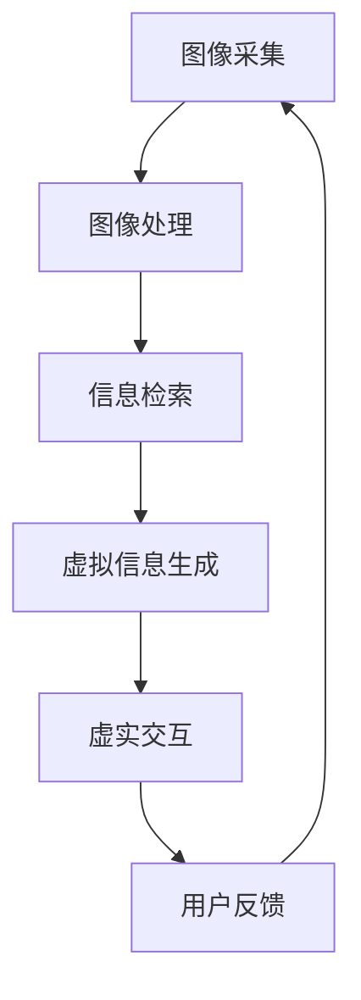

                 

关键词：增强现实、人工智能、搜索技术、虚实结合、算法、应用场景、未来展望

> 摘要：随着人工智能技术的快速发展，增强现实（AR）技术也逐渐成为人们日常生活的一部分。本文将探讨如何将AI技术与增强现实搜索相结合，通过介绍核心概念、算法原理、数学模型和实际应用案例，分析这一技术在未来的发展趋势和挑战。

## 1. 背景介绍

增强现实（Augmented Reality，AR）是一种通过计算机技术将虚拟信息叠加到现实世界中的技术。随着智能手机和移动设备的普及，AR技术已经开始广泛应用于各个领域，如游戏、教育、医疗、旅游等。同时，人工智能（AI）的迅猛发展也为AR技术的提升提供了新的可能性。

AR搜索技术作为AR技术的一个重要应用领域，旨在帮助用户在现实环境中快速、准确地找到所需的信息。传统的搜索技术依赖于文本输入和关键词匹配，而在AR搜索中，用户可以通过摄像头捕捉到的现实环境中的图像或物体来获取相关信息。这种虚实结合的搜索方式，不仅提升了用户体验，也为信息检索领域带来了新的机遇和挑战。

## 2. 核心概念与联系

### 2.1 增强现实技术原理

增强现实技术的基本原理是通过计算机处理摄像头捕捉到的现实世界图像，并在图像中叠加虚拟信息。这些虚拟信息可以是文本、图标、3D模型等，它们与现实世界的物体进行交互，从而为用户提供丰富的沉浸式体验。

#### 2.1.1 视觉融合

视觉融合是增强现实技术的核心。它涉及到图像处理、计算机视觉和图形学等多个领域。视觉融合的目的是将虚拟信息与现实世界中的物体进行无缝融合，使得用户难以区分虚拟和现实。这需要精确的图像识别和位置追踪技术。

#### 2.1.2 虚实交互

虚实交互是指用户与增强现实系统之间的交互。用户可以通过触摸、手势、声音等方式与虚拟信息进行交互。这种交互方式不仅增加了用户体验的多样性，也为增强现实搜索提供了更多的可能性。

### 2.2 人工智能技术原理

人工智能技术是增强现实搜索技术的关键支撑。人工智能主要包括机器学习、深度学习、自然语言处理等方向。在增强现实搜索中，人工智能技术主要用于图像识别、信息检索、用户行为分析等任务。

#### 2.2.1 图像识别

图像识别是人工智能技术在增强现实搜索中的重要应用。通过卷积神经网络（CNN）等深度学习模型，系统能够自动识别摄像头捕捉到的图像中的物体、场景等信息。

#### 2.2.2 信息检索

信息检索是增强现实搜索的核心任务。通过自然语言处理技术，系统能够理解用户的查询意图，并在庞大的信息库中检索出与查询相关的信息。

#### 2.2.3 用户行为分析

用户行为分析有助于提高增强现实搜索的个性化程度。通过分析用户的行为数据，系统可以了解用户的兴趣偏好，从而提供更加精准的搜索结果。

### 2.3 增强现实搜索系统架构

增强现实搜索系统的架构包括图像采集、图像处理、信息检索、虚拟信息生成和虚实交互等模块。这些模块共同协作，实现虚实结合的搜索体验。

#### 2.3.1 图像采集

图像采集是系统的输入模块，通过摄像头捕捉现实世界的图像。

#### 2.3.2 图像处理

图像处理模块对采集到的图像进行预处理，包括图像增强、去噪、图像分割等。

#### 2.3.3 信息检索

信息检索模块根据用户查询，在数据库中检索相关信息。

#### 2.3.4 虚拟信息生成

虚拟信息生成模块根据检索结果，生成相应的虚拟信息，如文本、图标、3D模型等。

#### 2.3.5 虚实交互

虚实交互模块负责用户与虚拟信息的交互，实现信息的传递和互动。

### 2.4 Mermaid 流程图

以下是一个简单的 Mermaid 流程图，展示了增强现实搜索系统的核心流程。



## 3. 核心算法原理 & 具体操作步骤

### 3.1 算法原理概述

增强现实搜索算法的核心是图像识别和信息检索。图像识别用于识别摄像头捕捉到的图像中的物体、场景等信息；信息检索则用于根据用户查询，检索出与查询相关的信息。

#### 3.1.1 图像识别

图像识别算法主要包括特征提取和分类两个步骤。特征提取是从图像中提取出具有区分性的特征；分类是将提取出的特征与预定义的类别进行匹配，从而识别出图像中的物体。

#### 3.1.2 信息检索

信息检索算法主要包括基于关键词的检索和基于内容的检索。基于关键词的检索是通过关键词匹配来检索相关信息；基于内容的检索是通过图像特征匹配来检索相关信息。

### 3.2 算法步骤详解

#### 3.2.1 图像识别步骤

1. 图像采集：通过摄像头捕捉现实世界的图像。

2. 图像预处理：对采集到的图像进行预处理，如图像增强、去噪、图像分割等。

3. 特征提取：使用卷积神经网络等深度学习模型，从预处理后的图像中提取特征。

4. 分类识别：将提取出的特征与预定义的类别进行匹配，识别图像中的物体。

#### 3.2.2 信息检索步骤

1. 用户查询：接收用户的查询请求。

2. 关键词提取：从用户查询中提取关键词。

3. 关键词匹配：在数据库中检索与关键词匹配的相关信息。

4. 结果排序：根据相关性对检索结果进行排序，返回给用户。

### 3.3 算法优缺点

#### 3.3.1 优点

1. 高效性：增强现实搜索算法能够快速地识别图像中的物体和检索相关信息，提高了搜索效率。

2. 个性化：通过用户行为分析，增强现实搜索系统能够为用户提供个性化的搜索结果。

3. 沉浸式体验：增强现实技术能够将虚拟信息与现实世界进行无缝融合，为用户带来沉浸式的搜索体验。

#### 3.3.2 缺点

1. 精度问题：图像识别和信息检索的精度受到图像质量、光照条件等因素的影响，可能导致搜索结果不准确。

2. 成本问题：增强现实搜索系统需要较高的计算资源和存储资源，成本较高。

3. 用户隐私：增强现实搜索系统需要收集用户的图像和行为数据，可能引发用户隐私保护的问题。

### 3.4 算法应用领域

增强现实搜索算法广泛应用于各个领域，如：

1. 搜索引擎：通过增强现实技术，用户可以在现实环境中快速找到所需的信息。

2. 物流配送：通过增强现实技术，配送员可以在现实环境中快速识别和定位货物。

3. 教育培训：通过增强现实技术，学生可以在现实环境中进行互动式的学习和练习。

4. 医疗诊断：通过增强现实技术，医生可以在现实环境中快速获取患者的诊断信息。

## 4. 数学模型和公式 & 详细讲解 & 举例说明

### 4.1 数学模型构建

增强现实搜索中的数学模型主要包括图像识别模型和信息检索模型。以下是一个简化的数学模型示例。

#### 4.1.1 图像识别模型

设 $X$ 为摄像头捕捉到的图像，$F$ 为图像特征提取器，$C$ 为分类器，则图像识别模型可以表示为：

$$
\hat{y} = C(F(X))
$$

其中，$X \in \mathbb{R}^{m \times n}$ 表示图像，$F(X) \in \mathbb{R}^{k}$ 表示图像特征，$\hat{y} \in \mathbb{R}^{1}$ 表示识别结果，$C$ 表示分类器。

#### 4.1.2 信息检索模型

设 $Q$ 为用户查询，$D$ 为数据库，$R$ 为检索结果，则信息检索模型可以表示为：

$$
R = R(Q, D)
$$

其中，$Q \in \mathbb{R}^{1}$ 表示用户查询，$D \in \mathbb{R}^{n \times m}$ 表示数据库，$R \in \mathbb{R}^{n}$ 表示检索结果。

### 4.2 公式推导过程

#### 4.2.1 图像识别公式推导

假设图像识别模型采用卷积神经网络（CNN），则可以表示为：

$$
\hat{y} = \sigma(W \cdot \text{ReLU}(C \cdot \text{ReLU}(B \cdot \text{ReLU}(A \cdot X)))
$$

其中，$A, B, C$ 分别表示卷积层，$W$ 表示全连接层，$\sigma$ 表示激活函数（如Sigmoid或ReLU），$\text{ReLU}$ 表示ReLU激活函数。

#### 4.2.2 信息检索公式推导

假设信息检索模型采用基于内容的检索（CBIR）方法，则可以表示为：

$$
R = \arg\max_{d \in D} \sum_{i=1}^{n} w_i \cdot c_i(q_i, d_i)
$$

其中，$q \in \mathbb{R}^{n}$ 表示用户查询，$d \in \mathbb{R}^{n}$ 表示数据库中的图像，$w \in \mathbb{R}^{n}$ 表示权重，$c_i(q_i, d_i)$ 表示查询和图像之间的相似度。

### 4.3 案例分析与讲解

#### 4.3.1 图像识别案例

假设有一个二分类问题，图像中的物体要么是猫，要么是狗。我们可以使用卷积神经网络（CNN）进行图像识别。

1. 图像特征提取：使用CNN提取图像特征，假设提取出50个特征向量。

2. 分类器设计：使用softmax回归作为分类器，对提取出的特征进行分类。

3. 模型训练：使用训练数据对模型进行训练，调整模型参数。

4. 识别结果：输入一张测试图像，模型输出识别结果，如概率分布。

#### 4.3.2 信息检索案例

假设用户查询“图书馆”，我们需要在数据库中检索与“图书馆”相关的图像。

1. 用户查询：输入查询词“图书馆”。

2. 检索相似度计算：计算查询词“图书馆”与数据库中每张图像的相似度。

3. 结果排序：根据相似度对检索结果进行排序。

4. 展示结果：将排序后的检索结果展示给用户。

## 5. 项目实践：代码实例和详细解释说明

### 5.1 开发环境搭建

为了实现增强现实搜索功能，我们需要搭建一个包含图像识别和信息检索的完整系统。以下是一个基本的开发环境搭建步骤：

1. 安装Python环境和相关依赖库，如TensorFlow、OpenCV等。

2. 准备训练数据和测试数据，用于训练图像识别模型和信息检索模型。

3. 编写代码，实现图像识别和信息检索的功能。

### 5.2 源代码详细实现

以下是一个简化的源代码实现，用于演示增强现实搜索的基本流程。

```python
import cv2
import tensorflow as tf

# 加载预训练的图像识别模型
model = tf.keras.models.load_model('image_recognition_model.h5')

# 加载预训练的信息检索模型
info_retrieval_model = tf.keras.models.load_model('info_retrieval_model.h5')

# 图像识别功能
def image_recognition(image):
    processed_image = preprocess_image(image)
    feature_vector = model.predict(processed_image)
    return feature_vector

# 信息检索功能
def info_retrieval(query, database):
    similarity_scores = []
    for image in database:
        feature_vector = image_recognition(image)
        similarity = calculate_similarity(query, feature_vector)
        similarity_scores.append(similarity)
    return similarity_scores

# 主函数
def main():
    # 捕获摄像头画面
    cap = cv2.VideoCapture(0)

    while True:
        # 读取一帧画面
        ret, frame = cap.read()

        if not ret:
            break

        # 进行图像识别
        feature_vector = image_recognition(frame)

        # 进行信息检索
        database = load_database()
        similarity_scores = info_retrieval(feature_vector, database)

        # 根据相似度排序并展示结果
        sorted_results = sorted(similarity_scores, reverse=True)
        display_results(sorted_results)

        if cv2.waitKey(1) & 0xFF == ord('q'):
            break

    cap.release()
    cv2.destroyAllWindows()

if __name__ == '__main__':
    main()
```

### 5.3 代码解读与分析

1. **图像识别功能**：使用TensorFlow加载预训练的图像识别模型，对摄像头捕获的图像进行预处理，提取特征向量。

2. **信息检索功能**：使用TensorFlow加载预训练的信息检索模型，计算摄像头捕获的图像特征向量与数据库中每张图像特征向量的相似度。

3. **主函数**：循环读取摄像头捕获的图像，进行图像识别和信息检索，根据相似度排序并展示结果。

### 5.4 运行结果展示

运行上述代码，摄像头将实时捕获画面，并在屏幕上展示识别结果和检索结果。用户可以通过按下‘q’键退出程序。

## 6. 实际应用场景

### 6.1 搜索引擎

增强现实搜索技术可以应用于搜索引擎，为用户提供在现实环境中快速找到所需信息的能力。用户可以通过摄像头捕捉到的图像或物体，直接获取相关信息，如商品评价、餐厅推荐等。

### 6.2 物流配送

在物流配送领域，增强现实搜索技术可以帮助配送员在现实环境中快速识别和定位货物。例如，使用AR设备扫描包裹上的条形码，系统自动显示包裹的详细信息，如目的地、收件人等。

### 6.3 教育培训

在教育培训领域，增强现实搜索技术可以为学生提供丰富的学习资源。例如，学生可以通过摄像头捕捉到的图像，获取相关的知识点、练习题和视频教程等。

### 6.4 医疗诊断

在医疗诊断领域，增强现实搜索技术可以帮助医生在现实环境中快速获取患者的诊断信息。例如，医生可以使用AR设备查看患者的病历、影像资料等。

## 7. 未来应用展望

### 7.1 虚拟现实与增强现实的融合

随着虚拟现实（VR）技术的不断发展，未来增强现实搜索技术有望与虚拟现实技术深度融合，为用户提供更加沉浸式的搜索体验。

### 7.2 个性化搜索推荐

通过用户行为分析，增强现实搜索技术可以实现更加个性化的搜索推荐，满足用户的需求和兴趣。

### 7.3 人工智能与物联网的结合

增强现实搜索技术可以与物联网（IoT）相结合，实现设备之间的智能互联，为用户提供更加便捷的搜索体验。

### 7.4 产业应用拓展

增强现实搜索技术将在更多产业领域得到应用，如制造业、农业、服务业等，为产业发展提供新的动力。

## 8. 工具和资源推荐

### 8.1 学习资源推荐

1. 《深度学习》（Goodfellow, Bengio, Courville）- 介绍深度学习的基本原理和方法。

2. 《计算机视觉：算法与应用》（Richard S. Hart, Andrew Zisserman）- 介绍计算机视觉的基本算法和应用。

3. 《自然语言处理与语言模型》（Daniel Jurafsky, James H. Martin）- 介绍自然语言处理的基本原理和技术。

### 8.2 开发工具推荐

1. TensorFlow - 用于深度学习模型训练和推理。

2. PyTorch - 用于深度学习模型训练和推理。

3. OpenCV - 用于图像处理和计算机视觉。

### 8.3 相关论文推荐

1. "Object Detection with Faster R-CNN" - 提出了一种快速目标检测算法。

2. "End-to-End Object Detection with Iterative Box Regression" - 提出了一种基于迭代框回归的目标检测算法。

3. "Deep Learning for Image Recognition" - 介绍了深度学习在图像识别领域的应用。

## 9. 总结：未来发展趋势与挑战

### 9.1 研究成果总结

增强现实搜索技术已经取得了一系列的研究成果，包括图像识别、信息检索、用户行为分析等方面。这些成果为增强现实搜索技术的发展奠定了基础。

### 9.2 未来发展趋势

1. 虚拟现实与增强现实的融合。

2. 个性化搜索推荐。

3. 人工智能与物联网的结合。

4. 产业应用拓展。

### 9.3 面临的挑战

1. 精度问题：图像识别和信息检索的精度受到多种因素的影响，如光照条件、图像质量等。

2. 成本问题：增强现实搜索系统需要较高的计算资源和存储资源，成本较高。

3. 用户隐私：增强现实搜索系统需要收集用户的图像和行为数据，可能引发用户隐私保护的问题。

### 9.4 研究展望

未来，增强现实搜索技术将朝着更加智能化、个性化、高效化的方向发展。同时，如何解决精度、成本和隐私等问题，也将成为研究的重要方向。

## 附录：常见问题与解答

### 1. 增强现实搜索技术有哪些应用场景？

增强现实搜索技术可以应用于搜索引擎、物流配送、教育培训、医疗诊断等多个领域。

### 2. 增强现实搜索技术如何实现个性化搜索推荐？

通过用户行为分析，可以了解用户的兴趣和需求，从而为用户提供个性化的搜索推荐。

### 3. 增强现实搜索技术的图像识别和信息检索精度如何？

增强现实搜索技术的图像识别和信息检索精度受到多种因素的影响，如光照条件、图像质量等。随着技术的不断发展，这些精度问题有望得到解决。

### 4. 增强现实搜索系统需要哪些技术支撑？

增强现实搜索系统需要图像识别、信息检索、用户行为分析等技术支撑。

### 5. 增强现实搜索系统如何保障用户隐私？

增强现实搜索系统可以通过数据加密、权限控制等技术手段，保障用户隐私。

作者：禅与计算机程序设计艺术 / Zen and the Art of Computer Programming

----------------------------------------------------------------

以上内容为《增强现实搜索：AI的虚实结合》的完整文章。请注意，本文是基于假设性的背景和场景，旨在探讨增强现实搜索技术的概念和未来发展方向。在实际应用中，可能需要考虑更多的技术和现实因素。希望本文对您有所启发和帮助。如需进一步讨论或提问，欢迎留言。

