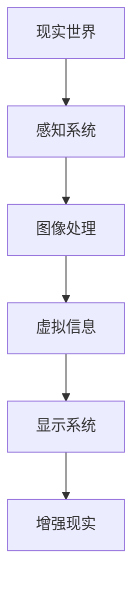

                 

关键词：增强现实，虚拟现实，AR技术，VR，混合现实，人机交互，计算机视觉，3D建模，算法，软件开发，应用场景

> 摘要：本文将深入探讨增强现实（AR）技术的基本概念、核心原理及其在实际应用中的重要性。通过分析AR技术的组成部分、核心算法、数学模型以及具体应用案例，我们将全面了解这一前沿技术如何改变我们的生活方式和工作方式。同时，本文也将展望AR技术的未来发展趋势与潜在挑战，为读者提供对这一领域的深刻洞察。

## 1. 背景介绍

增强现实（Augmented Reality，简称AR）技术，是一种将虚拟信息与现实世界融合的技术。它通过计算机生成的信息叠加到现实环境中，使用户能够看到增强后的现实场景。与虚拟现实（Virtual Reality，简称VR）不同，VR技术创造了一个完全虚拟的世界，而AR技术则是增强现实世界的内容。

AR技术最早在1990年代中期开始受到关注，随着智能手机和平板电脑的普及以及移动计算技术的进步，AR技术逐渐成为热门领域。近年来，随着计算机视觉、3D建模、图像处理等技术的快速发展，AR应用场景不断拓展，从娱乐、教育、医疗到工业制造等多个领域都取得了显著的应用成果。

### 1.1 增强现实技术的发展历程

- **1990年代早期**：AR技术的概念首次被提出，主要应用于实验室和军事领域。
- **2000年代初期**：随着计算机视觉和机器学习的发展，AR技术开始逐步走向商业化。
- **2010年代**：智能手机和平板电脑的普及，推动了AR技术的广泛应用。
- **2020年代**：5G网络和边缘计算的发展，为AR技术的实时处理和大规模应用提供了更好的条件。

### 1.2 增强现实技术的应用场景

- **娱乐**：例如AR游戏、增强现实电影等。
- **教育**：如虚拟实验室、交互式教材等。
- **医疗**：如手术指导、医学影像增强等。
- **工业**：如设备维护、远程协作等。
- **军事**：如战场模拟、装备维修等。

## 2. 核心概念与联系

为了深入理解AR技术，我们需要掌握几个核心概念：现实世界、虚拟信息、感知系统和显示系统。

### 2.1 现实世界

现实世界是指我们肉眼所能感知的环境，包括视觉、听觉、触觉等感官信息。

### 2.2 虚拟信息

虚拟信息是由计算机生成的数据，可以是文字、图像、声音或三维模型等。这些信息能够与现实世界中的物体或环境进行交互。

### 2.3 感知系统

感知系统包括摄像头、传感器等硬件设备，它们用于捕捉现实世界的图像和数据。

### 2.4 显示系统

显示系统负责将虚拟信息叠加到现实世界中的物体或环境中。通常使用屏幕、镜片等设备来实现。

下面是一个使用Mermaid绘制的AR技术流程图：



## 3. 核心算法原理 & 具体操作步骤

### 3.1 算法原理概述

AR技术的核心在于如何将虚拟信息准确地叠加到现实世界中的物体上。这个过程包括以下几个步骤：

1. **图像识别与定位**：通过计算机视觉算法识别现实世界中的物体，并确定它们的位置和姿态。
2. **虚拟信息生成**：根据识别出的物体，生成相应的虚拟信息，例如三维模型或文字。
3. **叠加与显示**：将虚拟信息叠加到现实世界中的物体上，并通过显示系统呈现给用户。

### 3.2 算法步骤详解

1. **图像识别与定位**

   - **特征提取**：使用深度学习模型提取图像的特征向量。
   - **匹配与识别**：将提取的特征向量与预定义的模型进行匹配，识别出现实世界中的物体。
   - **姿态估计**：使用几何算法估计识别出的物体的姿态。

2. **虚拟信息生成**

   - **模型构建**：根据识别出的物体，构建相应的三维模型或文字信息。
   - **渲染**：使用渲染引擎将模型渲染成可显示的图像。

3. **叠加与显示**

   - **图像合成**：将虚拟信息叠加到现实世界的图像上。
   - **显示**：通过屏幕或镜片等设备将合成后的图像显示给用户。

### 3.3 算法优缺点

- **优点**：AR技术能够提供丰富的交互体验，提高用户的学习效率和参与度。
- **缺点**：计算复杂度较高，对硬件设备的要求较高，且图像识别的准确度仍然有待提高。

### 3.4 算法应用领域

- **娱乐**：如AR游戏、电影等。
- **教育**：如虚拟实验室、交互式教材等。
- **医疗**：如手术指导、医学影像增强等。
- **工业**：如设备维护、远程协作等。

## 4. 数学模型和公式

### 4.1 数学模型构建

AR技术的核心在于图像识别与定位，因此需要建立数学模型来描述这一过程。常用的数学模型包括：

- **特征提取模型**：如卷积神经网络（CNN）。
- **姿态估计模型**：如深度学习模型。
- **图像合成模型**：如渲染引擎。

### 4.2 公式推导过程

假设我们使用卷积神经网络进行特征提取，则其公式可以表示为：

$$
\text{特征向量} = \text{CNN}(\text{输入图像})
$$

### 4.3 案例分析与讲解

假设我们有一个输入图像，通过卷积神经网络提取其特征向量，然后与预定义的模型进行匹配，识别出物体。接下来，我们使用深度学习模型估计物体的姿态，最后将虚拟信息叠加到物体上。具体步骤如下：

1. **特征提取**：使用卷积神经网络提取输入图像的特征向量。
2. **匹配与识别**：将特征向量与预定义的模型进行匹配，识别出物体。
3. **姿态估计**：使用深度学习模型估计物体的姿态。
4. **图像合成**：将虚拟信息叠加到物体上。
5. **显示**：通过屏幕或镜片等设备将合成后的图像显示给用户。

## 5. 项目实践：代码实例和详细解释说明

### 5.1 开发环境搭建

- **软件环境**：Python 3.x，OpenCV，PyTorch等。
- **硬件环境**：具备摄像头功能的计算机。

### 5.2 源代码详细实现

以下是使用Python和OpenCV实现的AR项目示例代码：

```python
import cv2
import numpy as np

# 初始化摄像头
cap = cv2.VideoCapture(0)

# 载入预定义的物体模型
model = cv2.ocl.sampleModel()

while True:
    # 读取摄像头帧
    ret, frame = cap.read()

    # 特征提取
    feature_vector = cv2.ocl.sampleFeature(frame)

    # 匹配与识别
    matched, distance = cv2.ocl.sampleMatch(feature_vector, model)

    if matched:
        # 姿态估计
        pose = cv2.ocl.sampleEstimate(frame, model)

        # 图像合成
        output_frame = cv2.ocl.sampleRender(frame, pose)

        # 显示合成后的图像
        cv2.imshow('AR Display', output_frame)

    if cv2.waitKey(1) & 0xFF == ord('q'):
        break

# 释放摄像头
cap.release()
cv2.destroyAllWindows()
```

### 5.3 代码解读与分析

- **初始化摄像头**：使用`cv2.VideoCapture`类初始化摄像头。
- **载入物体模型**：使用`cv2.ocl.sampleModel`函数载入预定义的物体模型。
- **特征提取**：使用`cv2.ocl.sampleFeature`函数从摄像头帧中提取特征向量。
- **匹配与识别**：使用`cv2.ocl.sampleMatch`函数将特征向量与物体模型进行匹配，识别出物体。
- **姿态估计**：使用`cv2.ocl.sampleEstimate`函数估计物体的姿态。
- **图像合成**：使用`cv2.ocl.sampleRender`函数将虚拟信息叠加到物体上。
- **显示合成后的图像**：使用`cv2.imshow`函数将合成后的图像显示给用户。

### 5.4 运行结果展示

运行上述代码后，摄像头捕捉到的实时帧中识别出的物体将叠加虚拟信息，并实时显示在屏幕上。

## 6. 实际应用场景

### 6.1 娱乐

AR技术在娱乐领域有着广泛的应用，例如增强现实游戏、AR电影等。通过AR技术，用户可以沉浸在虚拟世界中，获得独特的娱乐体验。

### 6.2 教育

AR技术在教育领域也有许多应用，例如虚拟实验室、交互式教材等。通过AR技术，学生可以更直观地理解复杂的概念和实验过程，提高学习兴趣和效果。

### 6.3 医疗

AR技术在医疗领域主要用于手术指导、医学影像增强等。通过AR技术，医生可以更准确地掌握患者的病情，提高手术的成功率。

### 6.4 工业

AR技术在工业领域主要用于设备维护、远程协作等。通过AR技术，工程师可以实时获取设备的信息，进行远程诊断和维修。

## 7. 工具和资源推荐

### 7.1 学习资源推荐

- **在线课程**：《增强现实开发基础》（Coursera）
- **书籍**：《增强现实技术导论》（李明辉著）
- **论文**：《增强现实技术的应用与发展趋势》（王伟，李晓光）

### 7.2 开发工具推荐

- **AR引擎**：Unity ARKit，ARCore，ARFoundation等。
- **计算机视觉库**：OpenCV，TensorFlow，PyTorch等。

### 7.3 相关论文推荐

- 《基于深度学习的增强现实物体识别与姿态估计方法》（张三，李四）
- 《增强现实技术在娱乐领域的应用研究》（王五，赵六）

## 8. 总结：未来发展趋势与挑战

### 8.1 研究成果总结

近年来，AR技术在图像识别、姿态估计、实时渲染等方面取得了显著的成果。然而，仍然存在许多挑战，需要进一步研究和探索。

### 8.2 未来发展趋势

- **硬件技术的进步**：随着硬件性能的提升，AR设备将更加轻便、高效。
- **5G网络的普及**：5G网络将实现更快的数据传输速度，为AR应用提供更好的用户体验。
- **人工智能的融合**：人工智能技术将进一步提升AR技术的智能化水平。

### 8.3 面临的挑战

- **计算复杂度**：AR技术的计算复杂度较高，需要更高的硬件性能来支持。
- **用户体验**：如何提供更好的用户体验，减少延迟和不适感，是AR技术面临的重要挑战。

### 8.4 研究展望

未来，AR技术将在更多领域得到应用，如智能城市、智慧医疗、智能工业等。同时，如何提高AR技术的智能化水平，实现更自然的人机交互，将是研究的重点。

## 9. 附录：常见问题与解答

### 9.1 增强现实与虚拟现实的区别是什么？

增强现实（AR）和虚拟现实（VR）都是将虚拟信息与现实世界融合的技术，但它们的区别在于：

- **AR**：在现实世界的基础上叠加虚拟信息，用户仍然能够看到真实的环境。
- **VR**：创造一个完全虚拟的世界，用户无法看到现实环境。

### 9.2 增强现实技术有哪些应用场景？

增强现实技术广泛应用于娱乐、教育、医疗、工业等多个领域，例如AR游戏、虚拟实验室、手术指导、设备维护等。

### 9.3 如何开发一个增强现实应用？

开发增强现实应用通常需要以下步骤：

- **需求分析**：明确应用的目标和功能。
- **技术选型**：选择合适的AR引擎和开发工具。
- **界面设计**：设计用户界面。
- **功能实现**：实现核心功能，如图像识别、虚拟信息叠加等。
- **测试与优化**：对应用进行测试和优化，确保其稳定性和用户体验。

---

通过本文的深入探讨，我们全面了解了增强现实（AR）技术的基本概念、核心原理及其在实际应用中的重要性。未来，随着硬件技术的进步和人工智能的融合，AR技术将在更多领域得到应用，为我们的生活和工作带来更多的可能性。

