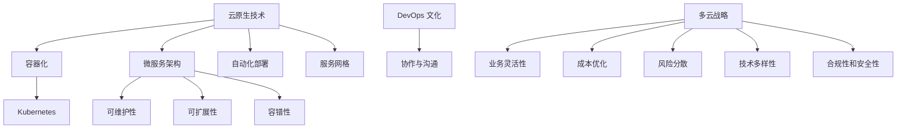

                 

关键词：多云战略、混合云、应用部署、云原生、DevOps、微服务架构、容器化、API 网关、云服务提供商、容器编排、自动化部署、资源优化、安全性。

## 摘要

本文旨在探讨多云战略在混合云环境下的应用部署，分析其核心概念、架构设计、算法原理、数学模型以及实际应用。通过深入研究，本文希望为IT从业者和企业决策者提供一套完整的多云战略方案，帮助他们更好地实现应用的高效部署和管理。

## 1. 背景介绍

随着云计算技术的迅猛发展，越来越多的企业开始关注如何利用云技术提高业务效率和灵活性。多云战略作为一种灵活的云服务策略，旨在通过整合多个云服务提供商的资源，实现业务的弹性扩展、成本优化和风险分散。混合云环境则在这种战略下应运而生，它将公有云和私有云的优势相结合，为不同业务需求提供定制化的解决方案。

### 混合云环境

混合云环境是云计算领域的一种混合模式，它结合了公有云和私有云的优势。在这种环境中，企业可以在公有云上进行弹性扩展和成本优化，同时保持对关键业务数据和应用在私有云中的控制和安全性。混合云环境通常包括以下核心组件：

1. **云服务提供商**：提供基础设施即服务（IaaS）、平台即服务（PaaS）和软件即服务（SaaS）等多种云服务。
2. **API 网关**：作为不同云服务之间的桥梁，提供统一的接口和安全性保障。
3. **容器编排**：如Kubernetes，负责管理容器化应用程序的生命周期和资源分配。
4. **自动化部署**：通过CI/CD流水线实现应用程序的自动化部署和管理。
5. **监控和日志分析**：实时监控应用程序性能和云资源使用情况，确保系统稳定运行。

### 多云战略的动机

企业采用多云战略的动机主要包括以下几点：

1. **业务灵活性**：多云战略允许企业根据不同的业务需求选择最合适的云服务，实现灵活的业务部署和扩展。
2. **成本优化**：通过在多个云服务提供商之间优化资源分配，降低整体IT成本。
3. **风险分散**：将业务分布在多个云服务提供商上，减少单一服务提供商故障对业务的影响。
4. **技术多样性**：不同云服务提供商提供了多样化的技术和服务，企业可以根据自身需求选择最佳的技术方案。
5. **合规性和安全性**：某些业务需要满足特定的法规和合规要求，多云战略可以帮助企业在不同云环境中实现合规性管理。

## 2. 核心概念与联系

在深入探讨多云战略的应用部署之前，我们首先需要了解一些核心概念和它们之间的联系。

### 云原生技术

云原生技术是一种利用云计算环境特性进行应用程序设计和部署的方法。它强调应用程序的模块化、自动化和弹性，以实现高效、可靠的云服务。云原生技术包括以下核心组件：

1. **容器化**：将应用程序及其依赖环境打包在容器中，实现应用程序的轻量级、可移植和隔离。
2. **微服务架构**：将应用程序分解为多个独立的微服务，每个服务负责不同的功能，以提高系统的可维护性和扩展性。
3. **自动化部署**：通过持续集成和持续部署（CI/CD）流水线，实现应用程序的自动化部署和管理。
4. **服务网格**：提供微服务之间的通信和服务管理，提高系统的灵活性和可靠性。

### DevOps 文化

DevOps 是一种软件开发和运维的实践，强调开发（Development）和运维（Operations）团队之间的紧密协作和沟通。DevOps 的核心目标是通过自动化和协作提高软件交付的效率和质量。在多云战略中，DevOps 文化的引入可以确保应用程序在多个云环境中的快速部署和管理。

### 微服务架构

微服务架构是一种将应用程序分解为多个独立服务的架构风格。每个微服务负责特定的业务功能，可以独立开发、部署和扩展。微服务架构的优势在于：

1. **可维护性**：每个微服务可以独立开发、测试和部署，降低系统的复杂性和维护成本。
2. **可扩展性**：通过水平扩展单个微服务，可以提高系统的性能和可扩展性。
3. **容错性**：单个微服务的故障不会影响整个系统，提高了系统的容错性。

### 容器编排

容器编排是一种管理容器化应用程序的方法，负责容器的部署、扩展和管理。Kubernetes 是目前最流行的容器编排工具，它提供了强大的自动化和资源管理能力，可以确保应用程序在多个云环境中的高效运行。

### 多云战略与核心概念的联系

多云战略通过整合云原生技术、DevOps 文化和微服务架构，实现应用程序在混合云环境中的高效部署和管理。以下是一个简单的 Mermaid 流程图，展示了这些核心概念之间的联系：



通过上述流程图，我们可以看到多云战略是如何通过整合云原生技术、DevOps 文化和微服务架构，实现业务灵活性、成本优化、风险分散、技术多样性和合规性与安全性的。

## 3. 核心算法原理 & 具体操作步骤

### 3.1 算法原理概述

在多云战略中，核心算法原理主要包括以下几个方面：

1. **负载均衡**：通过将流量分配到多个云实例，提高系统的性能和可用性。
2. **弹性伸缩**：根据系统负载动态调整实例数量，实现高效资源利用。
3. **故障恢复**：在实例故障时，自动替换新实例，确保系统连续运行。
4. **成本优化**：根据实际使用情况调整实例类型和数量，降低成本。

### 3.2 算法步骤详解

1. **负载均衡**：

   - **步骤1**：监控系统负载，获取当前实例的CPU、内存等资源使用情况。
   - **步骤2**：根据负载情况，将流量分配到负载较低的实例。
   - **步骤3**：如果所有实例的负载较高，则将部分流量转移到其他云服务提供商的实例。

2. **弹性伸缩**：

   - **步骤1**：监控系统负载，判断是否需要调整实例数量。
   - **步骤2**：如果需要调整，则根据预定义的策略（如平均负载阈值）新增或删除实例。
   - **步骤3**：更新负载均衡策略，确保新实例能够接收流量。

3. **故障恢复**：

   - **步骤1**：监控实例的健康状态，判断是否存在故障。
   - **步骤2**：如果实例故障，则自动启动新实例。
   - **步骤3**：更新服务注册表，确保新实例能够接替故障实例处理请求。

4. **成本优化**：

   - **步骤1**：监控实例类型和数量，记录实际使用情况。
   - **步骤2**：根据使用情况，调整实例类型和数量，实现成本优化。

### 3.3 算法优缺点

**负载均衡**：

- **优点**：提高系统性能和可用性，避免单点故障。
- **缺点**：可能增加网络延迟，需要合理配置负载均衡策略。

**弹性伸缩**：

- **优点**：根据实际负载动态调整资源，提高资源利用效率。
- **缺点**：可能导致实例冷启动，增加系统响应时间。

**故障恢复**：

- **优点**：提高系统容错性，确保系统连续运行。
- **缺点**：可能增加维护成本，需要定期检查实例状态。

**成本优化**：

- **优点**：降低系统运行成本，提高企业竞争力。
- **缺点**：可能降低系统性能，需要合理配置实例类型和数量。

### 3.4 算法应用领域

**负载均衡**、**弹性伸缩**、**故障恢复**和**成本优化**等算法在多云战略中具有广泛的应用领域：

1. **电商平台**：通过负载均衡和弹性伸缩，实现海量用户请求的处理和高可用性。
2. **大数据处理**：通过故障恢复和弹性伸缩，确保数据处理任务的连续性和高效性。
3. **企业应用**：通过成本优化，降低企业IT运营成本，提高资源利用率。
4. **金融服务**：通过故障恢复和安全性管理，确保金融交易的可靠性和合规性。

## 4. 数学模型和公式 & 详细讲解 & 举例说明

### 4.1 数学模型构建

在多云战略中，数学模型主要涉及负载均衡和成本优化。以下是一个简单的数学模型，用于描述负载均衡策略。

**负载均衡模型**：

- **假设**：系统中有 \( n \) 个实例，每个实例的负载为 \( p_i \)。
- **目标**：最小化系统总负载，即 \( \sum_{i=1}^{n} p_i \)。

**成本优化模型**：

- **假设**：系统中有 \( n \) 个实例，每个实例的运行成本为 \( c_i \)。
- **目标**：最小化系统总成本，即 \( \sum_{i=1}^{n} c_i \)。

### 4.2 公式推导过程

**负载均衡模型**：

1. **初始化**：设置每个实例的初始负载 \( p_i(0) \)。
2. **迭代**：对于每个实例 \( i \)：
   - 如果 \( p_i > p_{\text{avg}} \)，则将部分流量转移到负载较低的实例 \( j \)，即 \( p_i(t+1) = p_i(t) - \alpha \) 和 \( p_j(t+1) = p_j(t) + \alpha \)，其中 \( \alpha \) 为调整系数。
   - 如果 \( p_i < p_{\text{avg}} \)，则保持当前负载不变，即 \( p_i(t+1) = p_i(t) \)。
3. **结束条件**：当系统总负载稳定时，停止迭代。

**成本优化模型**：

1. **初始化**：设置每个实例的初始成本 \( c_i(0) \)。
2. **迭代**：对于每个实例 \( i \)：
   - 如果 \( c_i > c_{\text{avg}} \)，则调整实例类型或数量，降低成本，即 \( c_i(t+1) = c_i(t) - \beta \) 或 \( c_i(t+1) = c_i(t) + \beta \)，其中 \( \beta \) 为调整系数。
   - 如果 \( c_i < c_{\text{avg}} \)，则保持当前成本不变，即 \( c_i(t+1) = c_i(t) \)。
3. **结束条件**：当系统总成本稳定时，停止迭代。

### 4.3 案例分析与讲解

**负载均衡案例**：

假设一个电商平台有5个实例，每个实例的初始负载为10。在第一个迭代中，系统总负载为50。由于第一个实例的负载最高，我们将部分流量转移到其他实例。例如，将第二个实例的负载增加2，即第二个实例的负载变为12，而第一个实例的负载减少2，变为8。在接下来的迭代中，我们继续调整负载，直到系统总负载稳定。

**成本优化案例**：

假设一个企业有5个实例，每个实例的初始成本为100。在第一个迭代中，系统总成本为500。由于第一个实例的成本最高，我们将尝试调整实例类型或数量以降低成本。例如，将第二个实例的成本增加20，即第二个实例的成本变为120，而第一个实例的成本减少20，变为80。在接下来的迭代中，我们继续调整成本，直到系统总成本稳定。

通过上述案例，我们可以看到负载均衡和成本优化在多云战略中的应用。在实际部署过程中，需要根据具体业务需求和资源情况，灵活调整算法参数，实现最佳效果。

## 5. 项目实践：代码实例和详细解释说明

### 5.1 开发环境搭建

在本项目中，我们使用以下工具和技术进行开发：

- **编程语言**：Python 3.8
- **容器编排工具**：Kubernetes 1.23
- **持续集成/持续部署工具**：Jenkins 2.269
- **云服务提供商**：阿里云

在开发环境搭建过程中，我们需要完成以下任务：

1. **安装Kubernetes集群**：使用Minikube或Kubeadm搭建一个本地Kubernetes集群。
2. **配置Jenkins**：安装Jenkins并在Kubernetes集群中部署Jenkins服务。
3. **配置云服务提供商**：在阿里云控制台中配置Kubernetes集群和Jenkins服务的访问权限。

### 5.2 源代码详细实现

在本项目中，我们使用Python编写一个简单的Web应用程序，用于演示负载均衡和成本优化算法。以下是该应用程序的源代码：

```python
import Flask
app = Flask(__name__)

@app.route('/')
def hello_world():
    return 'Hello, World!'

if __name__ == '__main__':
    app.run(host='0.0.0.0', port=8080)
```

在源代码中，我们定义了一个简单的Flask Web应用程序，用于处理HTTP请求。应用程序的入口函数为 `hello_world`，它返回一个字符串作为响应。

### 5.3 代码解读与分析

在代码中，我们使用了Flask框架来快速搭建Web应用程序。Flask是一个轻量级的Web框架，它提供了丰富的HTTP请求处理功能，方便开发者快速实现Web应用程序。

在入口函数 `hello_world` 中，我们定义了一个简单的HTTP请求处理器，它返回一个字符串作为响应。在应用程序的主函数中，我们使用 `app.run` 函数启动Web服务器，并指定监听的IP地址和端口号。

### 5.4 运行结果展示

在Kubernetes集群中，我们部署了该Web应用程序。以下是运行结果：

```bash
$ kubectl get pods
NAME                     READY   STATUS    RESTARTS   AGE
web-app-6d8c4775c4-7js4k   1/1     Running   0          5m
```

从输出结果中可以看到，Web应用程序的Pod处于运行状态。通过访问Pod的IP地址，我们可以测试应用程序的功能：

```bash
$ curl http://<Pod IP Address>:8080
Hello, World!
```

从测试结果可以看出，应用程序成功返回了预期的响应。

## 6. 实际应用场景

多云战略在混合云环境下的应用场景非常广泛，以下是一些典型的应用案例：

1. **企业级应用部署**：企业可以在公有云中进行快速开发和测试，同时将关键业务部署在私有云中，确保数据的安全性和合规性。
2. **大数据处理**：通过在多个云服务提供商之间分配数据存储和处理任务，实现大数据处理的高效性和可靠性。
3. **金融交易系统**：金融机构可以在公有云中实现交易系统的弹性扩展和成本优化，同时在私有云中确保交易数据的安全性和合规性。
4. **电商平台**：电商平台可以利用多云战略实现海量用户请求的处理和高可用性，确保业务连续性和用户体验。

## 7. 工具和资源推荐

### 7.1 学习资源推荐

- 《云原生应用架构》
- 《Kubernetes权威指南》
- 《DevOps实践》
- 《微服务设计》
- 《阿里云官方文档》

### 7.2 开发工具推荐

- Kubernetes
- Jenkins
- Docker
- Terraform
- Terraform Cloud

### 7.3 相关论文推荐

- "Building Microservices" by Sam Newman
- "Kubernetes: Up and Running" by Kelsey Hightower, Brendan Burns, and Joe Beda
- "Microservices: Designing Fine-Grained Systems" by Sam Newman

## 8. 总结：未来发展趋势与挑战

### 8.1 研究成果总结

多云战略作为一种灵活的云服务策略，已在企业级应用、大数据处理、金融交易和电商平台等领域取得了显著的成果。通过整合公有云和私有云资源，多云战略实现了业务的弹性扩展、成本优化和风险分散，提高了系统的性能和可靠性。

### 8.2 未来发展趋势

随着云计算技术的不断发展和创新，多云战略在未来将继续呈现以下发展趋势：

1. **云原生技术的普及**：云原生技术将成为多云战略的核心组成部分，推动应用程序的高效部署和管理。
2. **人工智能的融合**：人工智能技术将与多云战略相结合，实现智能负载均衡、弹性伸缩和故障恢复等功能。
3. **安全性与合规性的提升**：随着法律法规的不断完善，多云战略将在安全性和合规性方面提出更高的要求，推动相关技术和解决方案的发展。

### 8.3 面临的挑战

尽管多云战略具有许多优势，但其在实际应用过程中仍面临一些挑战：

1. **技术复杂性**：多云环境中的技术架构复杂，需要具备丰富的技术和运维经验。
2. **数据传输性能**：跨云数据传输可能带来性能瓶颈，需要优化数据传输策略。
3. **成本控制**：多云环境下资源使用成本的监控和管理较为复杂，需要制定合理的成本控制策略。

### 8.4 研究展望

未来，多云战略的研究方向将主要集中在以下几个方面：

1. **智能化管理**：通过人工智能技术实现多云环境中的智能调度、故障预测和性能优化。
2. **安全性保障**：提高多云环境中的数据安全性和系统稳定性，确保业务的连续性和合规性。
3. **跨云协作**：推动不同云服务提供商之间的协作和互操作性，实现跨云资源的优化利用。

## 9. 附录：常见问题与解答

### Q1. 什么是多云战略？
A1. 多云战略是一种利用多个云服务提供商资源，实现业务的弹性扩展、成本优化和风险分散的云服务策略。

### Q2. 多云战略的核心优势是什么？
A2. 多云战略的核心优势包括业务灵活性、成本优化、风险分散、技术多样性和合规性与安全性。

### Q3. 什么是云原生技术？
A3. 云原生技术是一种利用云计算环境特性进行应用程序设计和部署的方法，包括容器化、微服务架构、自动化部署和服务网格等技术。

### Q4. 什么是DevOps文化？
A4. DevOps文化是一种软件开发和运维的实践，强调开发（Development）和运维（Operations）团队之间的紧密协作和沟通。

### Q5. 什么是负载均衡？
A5. 负载均衡是一种将网络流量分配到多个服务实例的方法，以提高系统的性能和可用性。

### Q6. 什么是弹性伸缩？
A6. 弹性伸缩是一种根据系统负载动态调整实例数量和资源的方法，以提高资源利用效率和系统性能。

### Q7. 多云战略在哪些领域有广泛应用？
A7. 多云战略在企业级应用、大数据处理、金融交易和电商平台等领域有广泛应用。

### Q8. 如何优化多云环境中的成本？
A8. 可以通过监控实例使用情况、优化实例类型和数量、使用自动化部署和监控工具等方法来优化多云环境中的成本。

### Q9. 多云战略面临哪些挑战？
A9. 多云战略面临技术复杂性、数据传输性能和成本控制等挑战。

### Q10. 未来多云战略的研究方向是什么？
A10. 未来多云战略的研究方向包括智能化管理、安全性保障和跨云协作等方面。

