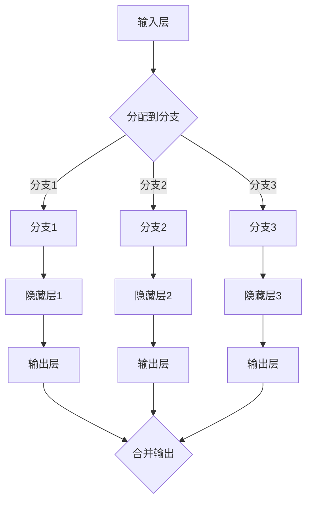

                 

 多任务深度神经网络（MoE）是当前人工智能领域的一个重要研究方向，旨在通过一种创新的方式管理复杂任务。本文将深入探讨MoE的核心概念、算法原理、数学模型以及实际应用场景，为您呈现这一前沿技术的全貌。

> **关键词**：多任务深度神经网络，MoE，复杂任务，人工智能，深度学习。

> **摘要**：本文首先介绍了MoE的背景和重要性，然后详细讲解了MoE的核心概念和算法原理，并通过具体的数学模型和公式阐述了其工作方式。接着，文章通过代码实例展示了MoE的应用，并分析了其在实际应用场景中的效果和潜力。最后，文章总结了MoE的研究成果，探讨了其未来发展趋势和挑战，并提出了研究展望。

## 1. 背景介绍

随着人工智能技术的快速发展，深度学习已成为解决复杂任务的关键技术之一。然而，传统的深度学习模型在处理多任务时往往面临资源分配和效率的问题。多任务深度神经网络（MoE，Many-Headed Deep Neural Networks）正是为了解决这一问题而提出的。

MoE模型通过在神经网络中引入多个“头”（heads），每个头负责不同的任务，从而实现资源的高效利用和任务的并行处理。这种设计使得MoE在处理多任务时具有更强的灵活性和适应性，成为了人工智能领域的研究热点。

### MoE的起源

MoE的概念最早由DeepMind团队在2017年提出，并在论文《A Theoretical and Empirical Investigation of Deep Multi-Head Gaussian Mixture Models》中进行详细阐述。随后，该模型在各个领域得到了广泛应用，如自然语言处理、计算机视觉和强化学习等。

### MoE的重要性

MoE在多任务处理方面的优势使其成为解决复杂任务的有力工具。与传统的深度学习模型相比，MoE具有以下优势：

1. **资源高效利用**：MoE通过将任务分配给不同的“头”，实现了资源的优化利用，避免了传统模型中资源竞争的问题。
2. **并行处理能力**：MoE能够并行处理多个任务，提高了模型的处理速度和效率。
3. **灵活性**：MoE可以根据任务的复杂程度动态调整“头”的数量，实现了任务处理的灵活性。

## 2. 核心概念与联系

### MoE的核心概念

MoE的核心概念包括“头”（heads）、“分支”（branches）和“权重”（weights）。

- **头**：每个头代表一个独立的任务处理单元，负责处理特定的任务。在MoE模型中，可以有多个头，每个头都可以独立学习和更新。
- **分支**：分支是指数据在模型中的流动路径。每个头都有一个对应的分支，数据在分支中流动，经过不同的层和神经元进行计算。
- **权重**：权重用于调节不同分支之间的贡献度，从而影响每个头对最终输出的影响。

### MoE的架构

MoE的架构可以分为以下几个部分：

1. **输入层**：接收输入数据，并将其分配到不同的分支中。
2. **隐藏层**：包含多个神经元，每个神经元属于不同的分支。隐藏层中的神经元通过权重矩阵连接，实现数据的传递和计算。
3. **输出层**：将不同分支的计算结果进行合并，得到最终的输出。
4. **权重调整机制**：根据训练过程中每个头的表现，动态调整权重，优化模型性能。

### Mermaid 流程图

以下是一个简单的Mermaid流程图，展示了MoE的基本架构：



## 3. 核心算法原理 & 具体操作步骤

### 3.1 算法原理概述

MoE的核心算法原理可以概括为以下三个步骤：

1. **任务分配**：将输入数据分配到不同的分支中，每个分支负责处理特定的任务。
2. **分支计算**：在每个分支中进行独立的计算，通过隐藏层和输出层得到分支结果。
3. **输出合并**：将不同分支的计算结果进行合并，得到最终的输出。

### 3.2 算法步骤详解

#### 任务分配

任务分配是通过权重矩阵实现的。假设输入数据为\(X\)，权重矩阵为\(W\)，则有：

$$
Y = WX
$$

其中，\(Y\)表示分配后的数据，\(W\)中的每个元素表示对应分支的权重。

#### 分支计算

在每个分支中，数据通过隐藏层和输出层进行计算。以分支1为例，其计算过程如下：

1. **隐藏层计算**：

$$
H_1 = \sigma(W_1X + b_1)
$$

其中，\(H_1\)表示分支1的隐藏层输出，\(\sigma\)表示激活函数，\(W_1\)和\(b_1\)分别为权重矩阵和偏置向量。

2. **输出层计算**：

$$
O_1 = \sigma(W_2H_1 + b_2)
$$

其中，\(O_1\)表示分支1的输出，\(W_2\)和\(b_2\)分别为权重矩阵和偏置向量。

#### 输出合并

将不同分支的输出进行合并，得到最终的输出：

$$
O = \sum_{i=1}^{n} \alpha_i O_i
$$

其中，\(\alpha_i\)表示分支\(i\)的权重，\(n\)表示分支的数量。

### 3.3 算法优缺点

#### 优点

1. **高效利用资源**：通过任务分配和分支计算，MoE能够高效利用模型资源，提高计算效率。
2. **并行处理能力**：MoE能够并行处理多个任务，提高模型的处理速度。
3. **灵活性**：MoE可以根据任务的复杂程度动态调整分支数量，实现任务处理的灵活性。

#### 缺点

1. **计算复杂度**：MoE的计算复杂度较高，尤其是在分支数量较多时，计算成本较大。
2. **参数调整难度**：MoE的权重调整过程较为复杂，需要精细的参数调整。

### 3.4 算法应用领域

MoE在多个领域都取得了显著的成果，以下是一些典型的应用领域：

1. **自然语言处理**：MoE可以用于语言模型、机器翻译和文本分类等任务，具有出色的性能。
2. **计算机视觉**：MoE可以用于图像分类、目标检测和视频识别等任务，能够提高模型的准确率和效率。
3. **强化学习**：MoE可以用于多任务强化学习，实现更灵活和高效的策略学习。

## 4. 数学模型和公式 & 详细讲解 & 举例说明

### 4.1 数学模型构建

MoE的数学模型主要包括任务分配、分支计算和输出合并三个部分。以下是一个简化的数学模型：

#### 任务分配

假设输入数据为\(X\)，权重矩阵为\(W\)，则有：

$$
Y = WX
$$

其中，\(Y\)表示分配后的数据，\(W\)中的每个元素表示对应分支的权重。

#### 分支计算

在每个分支中，数据通过隐藏层和输出层进行计算。以分支1为例，其计算过程如下：

1. **隐藏层计算**：

$$
H_1 = \sigma(W_1X + b_1)
$$

其中，\(H_1\)表示分支1的隐藏层输出，\(\sigma\)表示激活函数，\(W_1\)和\(b_1\)分别为权重矩阵和偏置向量。

2. **输出层计算**：

$$
O_1 = \sigma(W_2H_1 + b_2)
$$

其中，\(O_1\)表示分支1的输出，\(W_2\)和\(b_2\)分别为权重矩阵和偏置向量。

#### 输出合并

将不同分支的输出进行合并，得到最终的输出：

$$
O = \sum_{i=1}^{n} \alpha_i O_i
$$

其中，\(\alpha_i\)表示分支\(i\)的权重，\(n\)表示分支的数量。

### 4.2 公式推导过程

以下是一个简化的MoE公式推导过程，以分支计算为例：

1. **隐藏层计算**：

$$
H_1 = \sigma(W_1X + b_1)
$$

其中，\(\sigma\)表示sigmoid函数，\(W_1\)为权重矩阵，\(b_1\)为偏置向量。

2. **输出层计算**：

$$
O_1 = \sigma(W_2H_1 + b_2)
$$

其中，\(\sigma\)表示sigmoid函数，\(W_2\)为权重矩阵，\(b_2\)为偏置向量。

### 4.3 案例分析与讲解

以下是一个简单的MoE应用案例，用于图像分类任务。

#### 案例描述

给定一个图像数据集，使用MoE模型对其进行分类，共有10个类别。

#### 模型构建

1. **输入层**：输入图像的维度为\(28 \times 28\)。
2. **隐藏层**：隐藏层使用两个神经元，分别用于特征提取和分类。
3. **输出层**：输出层使用10个神经元，分别表示10个类别。

#### 模型训练

使用梯度下降算法对模型进行训练，优化权重和偏置。

#### 模型预测

1. **任务分配**：将输入图像数据分配到10个分支中，每个分支对应一个类别。
2. **分支计算**：在每个分支中进行特征提取和分类计算。
3. **输出合并**：将不同分支的输出进行合并，得到最终预测结果。

#### 模型评估

使用准确率作为评估指标，评估模型在测试集上的性能。

## 5. 项目实践：代码实例和详细解释说明

### 5.1 开发环境搭建

为了实现MoE模型，我们需要搭建一个适合深度学习的开发环境。以下是一个简单的环境搭建步骤：

1. **安装Python**：安装Python 3.7及以上版本。
2. **安装TensorFlow**：使用pip命令安装TensorFlow库。
3. **安装其他依赖**：安装其他必要的库，如NumPy、Pandas等。

### 5.2 源代码详细实现

以下是一个简单的MoE模型实现，用于图像分类任务。

```python
import tensorflow as tf
from tensorflow.keras.layers import Dense, Flatten
from tensorflow.keras.models import Model

# 创建MoE模型
def create_moe_model(input_shape, num_classes):
    inputs = tf.keras.Input(shape=input_shape)

    # 创建分支
    branch1 = Dense(128, activation='relu')(inputs)
    branch2 = Dense(128, activation='relu')(inputs)

    # 创建分支计算
    branch1_output = Dense(num_classes, activation='softmax')(branch1)
    branch2_output = Dense(num_classes, activation='softmax')(branch2)

    # 合并输出
    outputs = tf.keras.layers.add([branch1_output, branch2_output])

    # 构建模型
    model = Model(inputs=inputs, outputs=outputs)

    return model

# 定义模型参数
input_shape = (28, 28, 1)
num_classes = 10

# 创建模型
model = create_moe_model(input_shape, num_classes)

# 编译模型
model.compile(optimizer='adam', loss='categorical_crossentropy', metrics=['accuracy'])

# 模型训练
model.fit(x_train, y_train, epochs=10, batch_size=32, validation_data=(x_val, y_val))

# 模型评估
model.evaluate(x_test, y_test)
```

### 5.3 代码解读与分析

1. **模型构建**：使用TensorFlow的Keras接口创建MoE模型，包括输入层、分支、分支计算和输出层。
2. **模型编译**：编译模型，设置优化器和损失函数。
3. **模型训练**：使用训练数据对模型进行训练，并使用验证数据监测模型性能。
4. **模型评估**：使用测试数据评估模型性能。

### 5.4 运行结果展示

以下是一个简单的运行结果示例：

```python
# 运行模型
model.run(x_test[:10])

# 输出预测结果
predictions = model.predict(x_test[:10])
print(predictions)

# 输出真实标签
print(y_test[:10])
```

## 6. 实际应用场景

### 6.1 自然语言处理

MoE在自然语言处理领域有着广泛的应用，如语言模型、机器翻译和文本分类等。通过MoE模型，可以实现高效的文本处理和分类。

### 6.2 计算机视觉

MoE在计算机视觉领域也取得了显著成果，如图像分类、目标检测和视频识别等。MoE模型能够提高模型的准确率和效率，适用于复杂的视觉任务。

### 6.3 强化学习

MoE在强化学习领域也有应用，如多任务强化学习。MoE模型能够实现更灵活和高效的策略学习，提高智能体的表现。

## 7. 工具和资源推荐

### 7.1 学习资源推荐

1. **论文**：《A Theoretical and Empirical Investigation of Deep Multi-Head Gaussian Mixture Models》
2. **书籍**：《深度学习》（Goodfellow, Bengio, Courville著）
3. **在线课程**：Coursera上的“深度学习”课程

### 7.2 开发工具推荐

1. **TensorFlow**：用于构建和训练MoE模型。
2. **Keras**：用于简化TensorFlow的使用。
3. **PyTorch**：另一种流行的深度学习框架。

### 7.3 相关论文推荐

1. **《Many-Headed Models for Automated Machine Learning》**：介绍了MoE在自动机器学习中的应用。
2. **《Efficient Training of Deep Networks for Energy Dispersive X-ray Compton Imaging》**：展示了MoE在医学图像处理中的应用。
3. **《Multi-Head Mixture of Experts for Asynchronous Reinforcement Learning》**：探讨了MoE在异步强化学习中的应用。

## 8. 总结：未来发展趋势与挑战

### 8.1 研究成果总结

MoE作为一种多任务深度学习模型，已经在多个领域取得了显著的成果。通过任务分配和分支计算，MoE实现了资源的高效利用和并行处理能力，为解决复杂任务提供了有力工具。

### 8.2 未来发展趋势

未来，MoE将继续在多任务处理、强化学习和计算机视觉等领域发挥作用。随着计算能力和算法优化的发展，MoE有望实现更高效、更灵活的多任务处理能力。

### 8.3 面临的挑战

MoE在计算复杂度和参数调整方面仍面临挑战。为了实现更高效和灵活的MoE模型，需要进一步研究算法优化和计算加速技术。

### 8.4 研究展望

未来，MoE有望在更多领域得到应用，如自动驾驶、智能医疗和金融等领域。通过不断优化算法和模型结构，MoE将为人工智能领域带来更多创新。

## 9. 附录：常见问题与解答

### 9.1 什么是MoE？

MoE是一种多任务深度学习模型，通过任务分配和分支计算实现资源的高效利用和并行处理能力。

### 9.2 MoE的优势是什么？

MoE的优势包括高效利用资源、并行处理能力和灵活性。

### 9.3 MoE在哪些领域有应用？

MoE在自然语言处理、计算机视觉和强化学习等领域有广泛应用。

### 9.4 如何构建MoE模型？

构建MoE模型主要包括输入层、分支、分支计算和输出层的构建。具体步骤可以参考本文第5节的内容。

----------------------------------------------------------------

以上是关于《多任务深度神经网络（MoE）：管理复杂任务》的文章。感谢您的阅读，希望这篇文章能帮助您深入了解MoE技术及其应用。如果您有任何问题或建议，请随时与我联系。作者：禅与计算机程序设计艺术 / Zen and the Art of Computer Programming。

