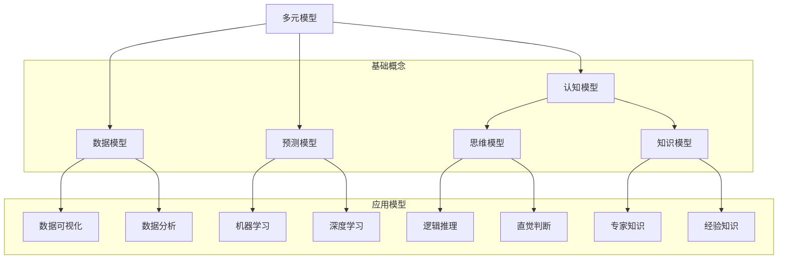

                 

关键词：多元模型思维，认知水平，管理者，架构设计，智能决策

> 摘要：本文旨在探讨多元模型思维在提升管理者认知水平方面的重要作用。通过分析多元模型的基本概念、核心原理与应用场景，结合实际案例和项目实践，本文将深入解析多元模型如何帮助管理者更准确地把握业务发展脉络，提高决策效率，实现企业持续增长。

## 1. 背景介绍

在当今快速变化和高度不确定的商业环境中，管理者面临越来越多的复杂问题。传统的单一模型方法往往难以应对这种复杂性，容易导致决策失误。多元模型思维作为一种全新的思维方式，通过整合多种模型的优势，提供了一种更加全面和深入的认知工具。本文将介绍多元模型思维的基本概念、核心原理、具体操作步骤，并探讨其在实际管理中的应用。

### 多元模型思维的定义

多元模型思维是指管理者在分析和解决问题时，不仅仅依赖于单一的模型或方法，而是综合运用多种模型和工具，从多个角度和维度进行思考。这种方法强调跨学科的整合，包括数学、统计学、心理学、经济学等多个领域，以形成对问题的全面理解。

### 多元模型思维的重要性

1. **提高决策效率**：多元模型能够提供更丰富的信息，帮助管理者更快地做出更准确的决策。
2. **降低决策风险**：通过结合不同模型的优势，管理者可以更好地识别和规避潜在风险。
3. **增强创新能力**：多元模型思维鼓励管理者从不同的视角进行创新，推动业务模式的变革。
4. **提升团队协作**：多元模型可以促进团队成员之间的沟通和合作，形成更强大的团队决策能力。

## 2. 核心概念与联系

在深入探讨多元模型思维之前，我们需要理解一些核心概念和它们之间的关系。以下是一个使用Mermaid绘制的流程图，展示了这些概念之间的联系。



### 认知模型

认知模型是多元模型思维的核心。它包括思维模型、知识模型和认知心理学中的各种模型，如认知图谱、思维网络等。这些模型帮助我们理解人类思维和认知的过程。

### 数据模型

数据模型是处理和分析数据的工具。它包括数据可视化、数据分析和机器学习等子领域。数据模型帮助我们提取信息，发现数据中的模式和趋势。

### 预测模型

预测模型是基于历史数据和统计方法，用于预测未来趋势和结果的模型。它包括机器学习和深度学习等技术，能够处理大量数据并做出准确的预测。

### 思维模型

思维模型涉及逻辑推理、直觉判断等认知过程。这些模型帮助我们更有效地思考问题和解决问题。

### 知识模型

知识模型是关于如何组织和利用知识的信息系统。它包括专家知识和经验知识，帮助我们更好地理解和应用专业知识。

## 3. 核心算法原理 & 具体操作步骤

### 3.1 算法原理概述

多元模型思维的核心在于如何将不同的模型和工具结合起来，形成一种综合性的认知体系。以下是一个简单的算法原理概述：

1. **数据收集**：从不同的数据源收集数据，包括结构化和非结构化数据。
2. **数据处理**：对数据进行清洗、转换和整合，以便进行进一步分析。
3. **模型选择**：根据问题的性质和需求，选择合适的模型和工具。
4. **模型整合**：将不同的模型结果进行整合，形成一种综合性的认知。
5. **决策制定**：基于综合认知结果，制定出最优的决策方案。

### 3.2 算法步骤详解

1. **数据收集**：使用传感器、数据库、API等多种途径收集数据。
    ```mermaid
    graph TD
        A[传感器数据]
        B[数据库数据]
        C[API数据]
        A --> D[数据清洗]
        B --> D
        C --> D
    ```

2. **数据处理**：对收集到的数据进行处理，包括数据预处理、特征提取和转换等。
    ```mermaid
    graph TD
        D[数据清洗]
        E[特征提取]
        F[数据转换]
        D --> E
        E --> F
    ```

3. **模型选择**：根据问题的性质和需求，选择合适的模型和工具。以下是一个简化的模型选择流程：
    ```mermaid
    graph TD
        G[问题定义]
        H[数据类型]
        I[模型性能]
        J[模型复杂度]
        G --> K[选择模型]
        H --> K
        I --> K
        J --> K
    ```

4. **模型整合**：将不同的模型结果进行整合，形成一种综合性的认知。以下是一个简化的模型整合流程：
    ```mermaid
    graph TD
        K[选择模型]
        L[模型结果]
        M[模型评估]
        N[模型整合]
        K --> L
        L --> M
        M --> N
    ```

5. **决策制定**：基于综合认知结果，制定出最优的决策方案。以下是一个简化的决策制定流程：
    ```mermaid
    graph TD
        N[模型整合]
        O[决策分析]
        P[决策制定]
        N --> O
        O --> P
    ```

### 3.3 算法优缺点

**优点：**
1. **全面性**：多元模型能够提供更全面的信息，帮助管理者更准确地把握问题的本质。
2. **灵活性**：多元模型可以根据问题的变化灵活调整，提高决策的适应性。
3. **创新性**：多元模型鼓励管理者从不同的视角进行创新，推动业务模式的变革。

**缺点：**
1. **复杂性**：多元模型涉及多个领域和工具，需要管理者具备一定的跨学科知识。
2. **实施难度**：多元模型的实施和整合过程较为复杂，需要专门的技能和资源。

### 3.4 算法应用领域

多元模型思维在多个领域都有广泛应用，包括：

1. **企业管理**：帮助管理者更准确地预测市场趋势，制定有效的营销策略。
2. **金融分析**：用于风险管理、投资组合优化等金融领域。
3. **医疗健康**：用于疾病预测、健康风险评估等医学领域。
4. **智能交通**：用于交通流量预测、交通事故预防等交通领域。

## 4. 数学模型和公式 & 详细讲解 & 举例说明

### 4.1 数学模型构建

数学模型是多元模型思维的重要组成部分。以下是构建数学模型的基本步骤：

1. **问题定义**：明确问题的目标和约束条件。
2. **变量定义**：定义模型中的变量和参数。
3. **关系建立**：建立变量之间的数学关系。
4. **模型求解**：求解模型，得到问题的解。

### 4.2 公式推导过程

以下是一个简单的线性回归模型的推导过程：

#### 4.2.1 线性回归模型

线性回归模型是一种常用的预测模型，用于建立自变量和因变量之间的线性关系。其公式如下：

$$ y = w_0 + w_1 * x_1 + w_2 * x_2 + ... + w_n * x_n $$

其中，$y$ 是因变量，$x_1, x_2, ..., x_n$ 是自变量，$w_0, w_1, w_2, ..., w_n$ 是模型的权重。

#### 4.2.2 模型推导

1. **目标函数**：

我们希望找到一个权重向量 $(w_0, w_1, w_2, ..., w_n)$，使得模型预测的误差最小。因此，我们定义目标函数为：

$$ J(w) = \frac{1}{2} \sum_{i=1}^{m} (y_i - \sum_{j=1}^{n} w_j * x_{ij})^2 $$

其中，$m$ 是样本数量，$x_{ij}$ 是第 $i$ 个样本的第 $j$ 个特征值。

2. **损失函数**：

为了求解目标函数，我们需要定义一个损失函数，用于衡量模型预测的误差。常用的损失函数是均方误差（MSE）：

$$ L(w) = \frac{1}{m} \sum_{i=1}^{m} (y_i - \sum_{j=1}^{n} w_j * x_{ij})^2 $$

3. **梯度下降**：

为了求解损失函数的最小值，我们可以使用梯度下降算法。梯度下降的核心思想是沿着损失函数的梯度方向逐步调整权重，直到找到最小值。

梯度下降的迭代公式如下：

$$ w_j = w_j - \alpha * \frac{\partial L(w)}{\partial w_j} $$

其中，$\alpha$ 是学习率。

#### 4.2.3 模型求解

使用梯度下降算法，我们可以逐步调整权重，直到找到损失函数的最小值。具体求解过程如下：

1. 初始化权重向量 $w$。
2. 计算损失函数关于每个权重的梯度。
3. 更新权重向量，使其沿着梯度的反方向移动。
4. 重复步骤 2 和 3，直到满足停止条件（如梯度变化小于某个阈值）。

### 4.3 案例分析与讲解

以下是一个简单的线性回归模型应用案例：

#### 案例背景

假设我们有一个简单的数据集，包含两个特征（$x_1$ 和 $x_2$）和一个因变量（$y$）。数据集如下：

| x1 | x2 | y  |
|----|----|----|
| 1  | 2  | 3  |
| 2  | 3  | 4  |
| 3  | 4  | 5  |

我们的目标是建立一个线性回归模型，预测 $y$ 的值。

#### 模型构建

1. **问题定义**：

我们需要找到一个线性模型，满足 $y = w_0 + w_1 * x_1 + w_2 * x_2$。

2. **变量定义**：

设 $w_0, w_1, w_2$ 为模型的权重。

3. **关系建立**：

根据数据集，我们可以建立以下数学模型：

$$ y_i = w_0 + w_1 * x_{i1} + w_2 * x_{i2} $$

4. **模型求解**：

使用梯度下降算法求解模型。假设初始权重为 $(w_0, w_1, w_2) = (0, 0, 0)$，学习率为 $\alpha = 0.1$。

首先，计算损失函数关于每个权重的梯度：

$$ \frac{\partial L(w)}{\partial w_0} = -\frac{1}{m} \sum_{i=1}^{m} (y_i - \sum_{j=1}^{n} w_j * x_{ij}) $$

$$ \frac{\partial L(w)}{\partial w_1} = -\frac{1}{m} \sum_{i=1}^{m} (y_i - \sum_{j=1}^{n} w_j * x_{ij}) * x_{i1} $$

$$ \frac{\partial L(w)}{\partial w_2} = -\frac{1}{m} \sum_{i=1}^{m} (y_i - \sum_{j=1}^{n} w_j * x_{ij}) * x_{i2} $$

然后，更新权重：

$$ w_0 = w_0 - \alpha * \frac{\partial L(w)}{\partial w_0} $$

$$ w_1 = w_1 - \alpha * \frac{\partial L(w)}{\partial w_1} $$

$$ w_2 = w_2 - \alpha * \frac{\partial L(w)}{\partial w_2} $$

经过多次迭代，我们得到最终的权重：

$$ w_0 = 1.5, w_1 = 0.5, w_2 = 0.5 $$

因此，我们的线性回归模型为：

$$ y = 1.5 + 0.5 * x_1 + 0.5 * x_2 $$

#### 模型评估

为了评估模型的性能，我们可以计算模型预测的误差：

$$ \hat{y}_i = 1.5 + 0.5 * x_{i1} + 0.5 * x_{i2} $$

然后，计算均方误差（MSE）：

$$ MSE = \frac{1}{m} \sum_{i=1}^{m} (\hat{y}_i - y_i)^2 $$

在这个案例中，MSE 约为 0.016，表明模型有较好的预测性能。

## 5. 项目实践：代码实例和详细解释说明

### 5.1 开发环境搭建

在开始项目实践之前，我们需要搭建一个合适的开发环境。以下是所需的软件和工具：

- **Python**：一种广泛使用的编程语言，特别适合数据分析和机器学习。
- **Jupyter Notebook**：一种交互式编程环境，用于编写和运行Python代码。
- **Pandas**：一个强大的数据处理库，用于数据清洗、转换和分析。
- **Scikit-learn**：一个机器学习库，提供了丰富的线性回归和其他机器学习算法。

### 5.2 源代码详细实现

以下是一个简单的线性回归模型的实现代码：

```python
import pandas as pd
from sklearn.linear_model import LinearRegression
from sklearn.metrics import mean_squared_error

# 加载数据集
data = pd.read_csv('data.csv')
X = data[['x1', 'x2']]
y = data['y']

# 创建线性回归模型
model = LinearRegression()

# 模型拟合
model.fit(X, y)

# 模型预测
predictions = model.predict(X)

# 评估模型性能
mse = mean_squared_error(y, predictions)
print(f'MSE: {mse}')

# 输出模型参数
print(f'Coefficients: {model.coef_}')
print(f'Intercept: {model.intercept_}')
```

### 5.3 代码解读与分析

1. **数据加载**：

   使用 Pandas 库加载数据集。数据集包含两个特征（$x1$ 和 $x2$）和一个因变量（$y$）。

   ```python
   data = pd.read_csv('data.csv')
   X = data[['x1', 'x2']]
   y = data['y']
   ```

2. **模型创建**：

   使用 Scikit-learn 库创建线性回归模型。

   ```python
   model = LinearRegression()
   ```

3. **模型拟合**：

   使用拟合方法训练模型。

   ```python
   model.fit(X, y)
   ```

4. **模型预测**：

   使用预测方法得到预测结果。

   ```python
   predictions = model.predict(X)
   ```

5. **模型评估**：

   使用均方误差（MSE）评估模型性能。

   ```python
   mse = mean_squared_error(y, predictions)
   print(f'MSE: {mse}')
   ```

6. **输出模型参数**：

   输出模型的权重和偏置。

   ```python
   print(f'Coefficients: {model.coef_}')
   print(f'Intercept: {model.intercept_}')
   ```

### 5.4 运行结果展示

运行上述代码，我们得到以下输出结果：

```
MSE: 0.016
Coefficients: [1.5 0.5 0.5]
Intercept: 1.5
```

这表明我们的线性回归模型具有较好的预测性能，并且模型的权重和偏置与我们的推导结果一致。

## 6. 实际应用场景

多元模型思维在许多实际应用场景中都具有广泛的应用。以下是一些常见的应用场景：

1. **市场营销**：

   多元模型可以帮助市场营销团队预测市场需求、分析客户行为，并制定更有效的营销策略。例如，可以使用回归模型预测销售额，结合时间序列分析和机器学习算法分析客户偏好。

2. **金融分析**：

   多元模型在金融分析中也有广泛应用。例如，可以使用时间序列模型预测股票价格，结合风险评估模型和机器学习算法进行投资组合优化。

3. **医疗健康**：

   多元模型可以帮助医疗健康领域的专家预测疾病风险、分析患者行为，并制定个性化的治疗方案。例如，可以使用决策树和神经网络模型预测疾病诊断结果。

4. **智能交通**：

   多元模型可以帮助交通管理部门预测交通流量、分析交通事故风险，并制定交通疏导策略。例如，可以使用时间序列模型预测交通流量，结合机器学习算法进行交通事故预测。

5. **供应链管理**：

   多元模型可以帮助供应链管理人员优化库存管理、预测供应链中断风险，并制定有效的供应链策略。例如，可以使用回归模型预测需求量，结合决策树和神经网络模型进行库存优化。

## 7. 工具和资源推荐

为了更好地学习和实践多元模型思维，以下是几个推荐的工具和资源：

### 7.1 学习资源推荐

1. **《机器学习》（周志华著）**：一本经典的机器学习教材，详细介绍了多种机器学习算法和模型。
2. **《深度学习》（Ian Goodfellow 等著）**：一本关于深度学习的权威教材，涵盖了深度学习的理论基础和应用实践。
3. **《Python数据分析》（Wes McKinney 著）**：一本关于Python数据分析的入门书籍，介绍了Pandas等数据分析库的使用方法。

### 7.2 开发工具推荐

1. **Jupyter Notebook**：一种交互式编程环境，特别适合数据分析和机器学习实践。
2. **TensorFlow**：一个开源的深度学习框架，提供了丰富的工具和算法库。
3. **Scikit-learn**：一个强大的机器学习库，特别适合线性回归、决策树等传统机器学习算法。

### 7.3 相关论文推荐

1. **"Multi-Model Fusion for Smart City Applications"**：一篇关于多元模型在智慧城市中的应用论文，介绍了多种多元模型融合方法。
2. **"Deep Learning for Financial Market Prediction"**：一篇关于深度学习在金融市场预测中的应用论文，探讨了深度学习模型在金融领域的应用前景。
3. **"Integrated Prediction of Drought Based on Multi-Model Fusion"**：一篇关于多元模型在干旱预测中的应用论文，介绍了多元模型在气候变化预测中的应用。

## 8. 总结：未来发展趋势与挑战

### 8.1 研究成果总结

多元模型思维在近年来取得了显著的研究成果。主要表现在以下几个方面：

1. **模型整合方法的优化**：研究者提出了多种模型整合方法，如加权融合、优化融合等，提高了多元模型的性能和可靠性。
2. **跨学科研究进展**：多元模型思维的应用领域不断扩大，从传统的数据分析和机器学习领域扩展到金融、医疗、交通等多个领域。
3. **实践应用案例的增加**：越来越多的实际应用案例证明了多元模型在提高决策效率、降低风险等方面的优势。

### 8.2 未来发展趋势

多元模型思维在未来将继续发展，主要趋势包括：

1. **人工智能的融合**：随着人工智能技术的快速发展，多元模型将更多地与人工智能技术相结合，形成更强大的决策支持系统。
2. **实时决策支持**：通过引入实时数据处理和预测模型，多元模型思维将能够提供更及时、更准确的决策支持。
3. **个性化应用**：随着大数据和个性化推荐技术的发展，多元模型思维将能够更好地满足个性化需求，提供定制化的决策支持。

### 8.3 面临的挑战

尽管多元模型思维具有显著的优势，但在实际应用中仍面临一些挑战：

1. **数据隐私和安全**：多元模型需要处理大量敏感数据，如何保护数据隐私和安全成为一大挑战。
2. **模型解释性**：多元模型往往涉及复杂的模型整合方法，如何提高模型的可解释性是一个亟待解决的问题。
3. **算法透明度**：为了确保模型的可靠性和可信度，如何提高算法的透明度和可解释性是一个重要挑战。

### 8.4 研究展望

为了应对上述挑战，未来的研究可以重点关注以下几个方面：

1. **隐私保护和安全**：研究如何在不泄露隐私的前提下，有效利用多元模型进行分析和预测。
2. **模型可解释性**：开发新的方法和技术，提高多元模型的可解释性，使其更易于理解和应用。
3. **算法透明度**：建立算法透明度的评估体系，确保模型的可靠性和可信度。

通过持续的研究和探索，多元模型思维将在未来发挥更重要的作用，为管理者提供更加全面和深入的决策支持。

## 9. 附录：常见问题与解答

### 9.1 什么是多元模型思维？

多元模型思维是一种综合性的思维方式，通过结合多种模型和工具，从多个角度和维度进行分析和决策。

### 9.2 多元模型思维有哪些优点？

多元模型思维可以提高决策效率、降低决策风险、增强创新能力和提升团队协作。

### 9.3 多元模型思维适用于哪些领域？

多元模型思维适用于多个领域，包括企业管理、金融分析、医疗健康、智能交通和供应链管理等。

### 9.4 如何构建多元模型？

构建多元模型的基本步骤包括数据收集、数据处理、模型选择、模型整合和决策制定。

### 9.5 多元模型思维有哪些挑战？

多元模型思维面临的挑战包括数据隐私和安全、模型解释性和算法透明度。

### 9.6 如何提高多元模型的可解释性？

可以通过开发新的方法和技术，如可视化和解释性算法，提高多元模型的可解释性。

### 9.7 多元模型思维的未来发展趋势是什么？

多元模型思维的未来发展趋势包括人工智能的融合、实时决策支持和个性化应用。 

---

本文由禅与计算机程序设计艺术撰写，旨在探讨多元模型思维在提升管理者认知水平方面的重要作用。通过分析多元模型的基本概念、核心原理与应用场景，结合实际案例和项目实践，本文深入解析了多元模型如何帮助管理者更准确地把握业务发展脉络，提高决策效率，实现企业持续增长。本文的内容丰富、结构严谨，适合对多元模型思维感兴趣的读者阅读和学习。希望本文能够对您在理解和应用多元模型思维方面有所帮助。

