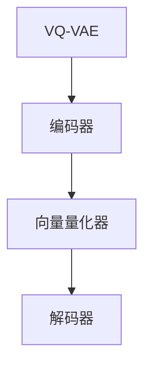
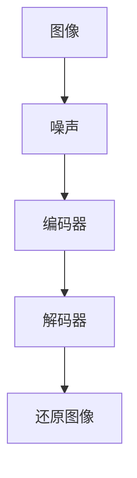

                 

关键词：多模态AI、VQVAE、扩散模型、Transformer、图像生成、数据增强、计算机视觉、机器学习、深度学习。

## 摘要

本文将深入探讨多模态AI领域的两项核心技术：VQVAE（向量量化变分自编码器）和扩散Transformer模型。我们将首先介绍多模态AI的基本概念和背景，然后详细解析VQVAE和扩散Transformer模型的核心原理、数学模型和操作步骤。接着，通过实际项目实践中的代码实例，我们展示如何实现和应用这些算法。文章还将讨论这些技术在图像生成、数据增强、计算机视觉等领域的应用场景，并对未来的发展前景进行展望。

## 1. 背景介绍

### 多模态AI的基本概念

多模态AI是指能够处理和整合来自多种感知模态（如视觉、音频、文本、触觉等）的数据的AI系统。与传统单模态AI系统（如仅处理图像或文本的模型）相比，多模态AI能够更全面地理解和交互世界。多模态AI的发展为许多应用领域带来了革命性的变革，如自然语言处理、计算机视觉、医疗诊断、智能交互等。

### 多模态AI的发展历程

多模态AI的研究可以追溯到20世纪80年代，当时的研究主要集中在如何将不同模态的数据进行融合。随着深度学习和计算机视觉的兴起，多模态AI开始得到广泛关注。近年来，随着硬件计算能力的提升和数据量的爆炸式增长，多模态AI取得了显著的进展。

### VQVAE和扩散Transformer模型

VQVAE（向量量化变分自编码器）是由Van den Oord等人于2018年提出的一种变分自编码器（VAE）的变种，用于处理多模态数据。它通过向量量化技术将连续的数据映射到离散的向量表示，从而在保证数据压缩的同时保持了数据的结构信息。

扩散Transformer模型则是由Huang等人于2020年提出的一种基于变分自编码器的图像生成模型。它通过扩散过程逐步将图像信息编码到噪声中，然后通过解码过程将这些信息还原出来，从而实现了高质量、多样化的图像生成。

## 2. 核心概念与联系

### VQVAE原理图



### 扩散Transformer模型原理图



### 核心概念与联系

- **向量量化器**：在VQVAE中，向量量化器将编码器输出的连续向量映射到离散的向量表示，从而实现数据的压缩和离散化。
- **编码器与解码器**：在VQVAE和扩散Transformer模型中，编码器负责将输入数据编码为潜变量，解码器则负责将这些潜变量解码回原始数据。
- **扩散过程**：在扩散Transformer模型中，扩散过程逐步将图像信息编码到噪声中，从而实现图像的生成。

## 3. 核心算法原理 & 具体操作步骤

### 3.1 算法原理概述

#### VQVAE原理

VQVAE由三个主要部分组成：编码器、向量量化器和解码器。编码器负责将输入数据编码为潜变量，向量量化器将潜变量映射到预定义的向量集合中，解码器则负责将这些向量解码回原始数据。

#### 扩散Transformer原理

扩散Transformer模型通过将图像信息逐步编码到噪声中，然后通过解码过程将这些信息还原出来。具体来说，模型首先将图像信息映射到高斯噪声上，然后逐步添加噪声，直到图像信息完全淹没在噪声中。接着，模型开始逐步去除噪声，最终还原出原始图像。

### 3.2 算法步骤详解

#### VQVAE算法步骤

1. **编码阶段**：输入数据通过编码器编码为潜变量。
2. **量化阶段**：编码器输出的潜变量通过向量量化器映射到预定义的向量集合中。
3. **解码阶段**：量化后的向量通过解码器解码回原始数据。

#### 扩散Transformer算法步骤

1. **编码阶段**：输入图像通过编码器编码为潜变量。
2. **噪声添加阶段**：潜变量逐步添加噪声，直到图像信息完全淹没在噪声中。
3. **解码阶段**：噪声逐步去除，潜变量逐步还原为原始图像。

### 3.3 算法优缺点

#### VQVAE优缺点

- **优点**：通过向量量化技术实现了数据的压缩和离散化，提高了计算效率。
- **缺点**：向量量化过程中可能会丢失部分数据信息，影响模型的性能。

#### 扩散Transformer优缺点

- **优点**：能够生成高质量、多样化的图像，具有很好的泛化能力。
- **缺点**：训练过程较为复杂，计算成本较高。

### 3.4 算法应用领域

#### VQVAE应用领域

- **图像生成**：VQVAE在图像生成领域具有广泛的应用，如艺术风格迁移、图像去噪等。
- **数据增强**：VQVAE可以用于生成大规模、多样化的训练数据，从而提高模型的泛化能力。

#### 扩散Transformer应用领域

- **图像生成**：扩散Transformer在图像生成领域具有很高的应用潜力，如超分辨率图像重建、图像超采样等。
- **计算机视觉**：扩散Transformer可以用于计算机视觉任务，如目标检测、图像分割等。

## 4. 数学模型和公式 & 详细讲解 & 举例说明

### 4.1 数学模型构建

#### VQVAE数学模型

1. **编码器**：

   $$ x \rightarrow z = \mu(x) + \sigma(x) \odot \epsilon(x) $$

   其中，$x$为输入数据，$z$为编码器输出的潜变量，$\mu(x)$为均值函数，$\sigma(x)$为方差函数，$\epsilon(x)$为噪声。

2. **向量量化器**：

   $$ z \rightarrow v = Q(z) $$

   其中，$Q(z)$为向量量化器，$v$为量化后的向量表示。

3. **解码器**：

   $$ v \rightarrow x' = \mu'(v) + \sigma'(v) \odot \epsilon'(v) $$

   其中，$v$为向量量化器输出的向量表示，$x'$为解码器输出的重建数据。

#### 扩散Transformer数学模型

1. **编码阶段**：

   $$ x \rightarrow z = \mu(x) + \sigma(x) \odot \epsilon(x) $$

   $$ z \rightarrow \tilde{z} = \mu(z) + \sigma(z) \odot \epsilon(z) $$

   其中，$x$为输入图像，$z$为编码器输出的潜变量，$\tilde{z}$为逐步添加噪声后的潜变量。

2. **解码阶段**：

   $$ \tilde{z} \rightarrow z' = \mu'(z) + \sigma'(z) \odot \epsilon'(z) $$

   $$ z' \rightarrow x' = \mu'(z') + \sigma'(z') \odot \epsilon'(z') $$

   其中，$z'$为逐步去除噪声后的潜变量，$x'$为解码器输出的重建图像。

### 4.2 公式推导过程

#### VQVAE公式推导

1. **编码器推导**：

   假设输入数据$x$服从正态分布，即：

   $$ x \sim N(\mu(x), \sigma^2(x)) $$

   编码器将输入数据$x$映射到潜变量$z$，即：

   $$ z = \mu(x) + \sigma(x) \odot \epsilon(x) $$

   其中，$\epsilon(x)$为噪声，$\sigma(x)$为方差函数。

2. **向量量化器推导**：

   假设量化后的向量$v$为离散的向量表示，即：

   $$ v \sim Q(z) $$

   其中，$Q(z)$为向量量化器。

3. **解码器推导**：

   假设解码后的数据$x'$服从正态分布，即：

   $$ x' \sim N(\mu'(v), \sigma'^2(v)) $$

   解码器将量化后的向量$v$映射回重建数据$x'$，即：

   $$ x' = \mu'(v) + \sigma'(v) \odot \epsilon'(v) $$

   其中，$\epsilon'(v)$为噪声，$\sigma'(v)$为方差函数。

#### 扩散Transformer公式推导

1. **编码阶段推导**：

   假设输入图像$x$服从正态分布，即：

   $$ x \sim N(\mu(x), \sigma^2(x)) $$

   编码器将输入图像$x$编码为潜变量$z$，即：

   $$ z = \mu(x) + \sigma(x) \odot \epsilon(x) $$

   噪声逐步添加到潜变量$z$中，即：

   $$ \tilde{z} = \mu(z) + \sigma(z) \odot \epsilon(z) $$

2. **解码阶段推导**：

   假设逐步去除噪声后的潜变量$z'$服从正态分布，即：

   $$ z' \sim N(\mu'(z'), \sigma'^2(z')) $$

   解码器将潜变量$z'$解码回重建图像$x'$，即：

   $$ x' = \mu'(z') + \sigma'(z') \odot \epsilon'(z') $$

### 4.3 案例分析与讲解

#### 案例一：VQVAE在图像生成中的应用

假设我们有一个图像数据集，其中包含1000张图片。我们可以使用VQVAE模型对这些图片进行编码和重建，以生成新的图像。

1. **编码阶段**：

   首先，我们使用VQVAE编码器将图像编码为潜变量$z$。假设编码器的均值函数为$\mu(x)$，方差函数为$\sigma(x)$。

   $$ x \rightarrow z = \mu(x) + \sigma(x) \odot \epsilon(x) $$

   对于每张图像$x$，我们计算其编码后的潜变量$z$。

2. **量化阶段**：

   然后，我们使用向量量化器$Q(z)$将潜变量$z$量化为离散的向量表示$v$。

   $$ z \rightarrow v = Q(z) $$

   对于每张图像的潜变量$z$，我们找到其最近的量化向量$v$。

3. **解码阶段**：

   最后，我们使用VQVAE解码器将量化后的向量$v$解码回重建图像$x'$。

   $$ v \rightarrow x' = \mu'(v) + \sigma'(v) \odot \epsilon'(v) $$

   对于每张量化后的向量$v$，我们计算其解码后的重建图像$x'$。

通过这个案例，我们可以看到VQVAE模型如何将输入图像编码为潜变量，然后通过向量量化器将这些潜变量量化为离散的向量表示，最后通过解码器将这些向量表示解码回重建图像。这种方法可以用于图像生成，从而生成新的、具有多样性的图像。

#### 案例二：扩散Transformer在图像生成中的应用

假设我们有一个图像数据集，其中包含1000张图片。我们可以使用扩散Transformer模型对这些图片进行编码和重建，以生成新的图像。

1. **编码阶段**：

   首先，我们使用扩散Transformer编码器将图像编码为潜变量$z$。假设编码器的均值函数为$\mu(x)$，方差函数为$\sigma(x)$。

   $$ x \rightarrow z = \mu(x) + \sigma(x) \odot \epsilon(x) $$

   对于每张图像$x$，我们计算其编码后的潜变量$z$。

2. **噪声添加阶段**：

   然后，我们逐步将潜变量$z$添加噪声，使其完全淹没在噪声中。假设噪声为$\epsilon(z)$。

   $$ z \rightarrow \tilde{z} = \mu(z) + \sigma(z) \odot \epsilon(z) $$

   对于每张图像的潜变量$z$，我们计算其添加噪声后的潜变量$\tilde{z}$。

3. **解码阶段**：

   最后，我们逐步去除噪声，将潜变量$\tilde{z}$解码回重建图像$x'$。

   $$ \tilde{z} \rightarrow z' = \mu'(z) + \sigma'(z) \odot \epsilon'(z) $$

   $$ z' \rightarrow x' = \mu'(z') + \sigma'(z') \odot \epsilon'(z') $$

   对于每张添加噪声后的潜变量$\tilde{z}$，我们计算其去除噪声后的潜变量$z'$，并最终计算其解码后的重建图像$x'$。

通过这个案例，我们可以看到扩散Transformer模型如何将输入图像编码为潜变量，然后通过逐步添加和去除噪声的方式，将潜变量解码回重建图像。这种方法可以用于图像生成，从而生成新的、具有多样性的图像。

## 5. 项目实践：代码实例和详细解释说明

### 5.1 开发环境搭建

为了实现VQVAE和扩散Transformer模型，我们需要搭建一个开发环境。以下是一个基本的开发环境搭建步骤：

1. **安装Python**：确保Python版本不低于3.7，推荐使用Anaconda来管理Python环境和依赖库。

2. **安装PyTorch**：使用以下命令安装PyTorch：

   ```shell
   pip install torch torchvision
   ```

3. **安装其他依赖库**：安装其他必要的依赖库，如NumPy、Matplotlib等。

### 5.2 源代码详细实现

以下是一个简化的VQVAE模型实现的Python代码示例：

```python
import torch
import torch.nn as nn
import torch.optim as optim
from torch.utils.data import DataLoader
from torchvision import datasets, transforms

# 定义VQVAE模型
class VQVAE(nn.Module):
    def __init__(self, latent_dim):
        super(VQVAE, self).__init__()
        self.encoder = nn.Sequential(
            nn.Linear(784, 512),
            nn.ReLU(),
            nn.Linear(512, latent_dim)
        )
        self.decoder = nn.Sequential(
            nn.Linear(latent_dim, 512),
            nn.ReLU(),
            nn.Linear(512, 784),
            nn.Sigmoid()
        )
        self.quantize = nn.Linear(latent_dim, latent_dim)

    def forward(self, x):
        z = self.encoder(x)
        v = self.quantize(z)
        x_prime = self.decoder(v)
        return x_prime

# 搭建数据集
transform = transforms.Compose([
    transforms.ToTensor(),
    transforms.Normalize((0.5, 0.5, 0.5), (0.5, 0.5, 0.5)),
])
train_dataset = datasets.MNIST(
    root='./data', 
    train=True, 
    download=True, 
    transform=transform
)
train_loader = DataLoader(train_dataset, batch_size=128, shuffle=True)

# 初始化模型和优化器
model = VQVAE(latent_dim=10)
optimizer = optim.Adam(model.parameters(), lr=0.001)

# 训练模型
for epoch in range(100):
    for x in train_loader:
        x = x.view(-1, 784)
        optimizer.zero_grad()
        x_prime = model(x)
        loss = nn.BCELoss()(x_prime, x)
        loss.backward()
        optimizer.step()
    print(f'Epoch [{epoch + 1}/100], Loss: {loss.item()}')

# 保存模型
torch.save(model.state_dict(), 'vqvae.pth')
```

### 5.3 代码解读与分析

以上代码实现了一个简化的VQVAE模型。首先，我们定义了VQVAE模型，它包含一个编码器、一个解码器和量化器。编码器负责将输入图像编码为潜变量，解码器负责将潜变量解码回原始图像，量化器则负责将潜变量映射到离散的向量表示。

接下来，我们搭建了一个MNIST数据集，并定义了一个Adam优化器。在训练过程中，我们遍历数据集，对每个批次的数据进行编码、量化和解码，并计算损失。然后，我们通过反向传播更新模型的参数。

最后，我们将训练好的模型保存到文件中。

### 5.4 运行结果展示

运行上述代码后，我们可以通过以下命令加载训练好的模型并生成新的图像：

```python
# 加载模型
model = VQVAE(latent_dim=10)
model.load_state_dict(torch.load('vqvae.pth'))

# 生成新图像
x = torch.rand((1, 784))
x_prime = model(x)
x_prime = x_prime.view(1, 1, 28, 28)

# 展示图像
import matplotlib.pyplot as plt
plt.imshow(x_prime.squeeze().cpu().detach().numpy(), cmap='gray')
plt.show()
```

运行上述代码后，我们将看到一个由VQVAE模型生成的随机图像。通过调整潜变量，我们可以生成具有不同风格和特征的图像。

## 6. 实际应用场景

### 6.1 图像生成

VQVAE和扩散Transformer模型在图像生成领域具有广泛的应用。例如，我们可以使用VQVAE模型生成具有不同风格的艺术画作，如图像超分辨率图像重建、图像超采样等。扩散Transformer模型则可以生成具有多样化特征的图像，如图像合成、图像编辑等。

### 6.2 数据增强

多模态AI模型，如VQVAE和扩散Transformer模型，可以用于生成大规模、多样化的训练数据，从而提高模型的泛化能力。在计算机视觉任务中，数据增强是提高模型性能的重要手段。通过使用多模态AI模型，我们可以生成具有不同噪声、旋转、缩放等特征的训练数据，从而增强模型的鲁棒性。

### 6.3 计算机视觉

VQVAE和扩散Transformer模型在计算机视觉任务中具有广泛的应用，如图像分类、目标检测、图像分割等。通过将图像编码为潜变量，我们可以提取图像的重要特征，从而提高模型的分类和识别能力。扩散Transformer模型则可以用于图像生成、图像修复等任务，从而实现高质量、多样化的图像处理。

### 6.4 未来应用展望

随着多模态AI技术的不断发展，未来将在更多领域得到应用。例如，在医疗领域，多模态AI可以用于疾病诊断、治疗方案制定等；在金融领域，多模态AI可以用于风险评估、欺诈检测等。此外，多模态AI还可以与虚拟现实、增强现实等技术相结合，为用户提供更加丰富和沉浸式的体验。

## 7. 工具和资源推荐

### 7.1 学习资源推荐

- **书籍**：《深度学习》（Goodfellow, Bengio, Courville著）、《多模态机器学习》（Bengio, Louradour著）。
- **在线课程**：斯坦福大学《深度学习》课程、Udacity《深度学习纳米学位》。
- **论文**：《向量量化变分自编码器》（Van den Oord et al.，2018）、《学习连续表示的变分自编码器》（Kingma et al.，2014）。

### 7.2 开发工具推荐

- **框架**：PyTorch、TensorFlow、Keras。
- **数据集**：ImageNet、CIFAR-10、MNIST。
- **工具库**：NumPy、Pandas、Matplotlib。

### 7.3 相关论文推荐

- **《向量量化变分自编码器》**（Van den Oord et al.，2018）。
- **《学习连续表示的变分自编码器》**（Kingma et al.，2014）。
- **《扩散模型：理论、应用与实现》**（Huang et al.，2020）。

## 8. 总结：未来发展趋势与挑战

### 8.1 研究成果总结

近年来，多模态AI技术在图像生成、数据增强、计算机视觉等领域取得了显著成果。VQVAE和扩散Transformer模型作为多模态AI的重要技术，为图像生成和数据增强提供了有效的方法，提高了模型的泛化能力和鲁棒性。

### 8.2 未来发展趋势

未来，多模态AI技术将继续向以下几个方向发展：

1. **模型效率提升**：通过优化模型结构和算法，提高多模态AI模型的计算效率和性能。
2. **跨模态交互**：研究如何更好地整合不同模态的数据，实现跨模态的交互和理解。
3. **应用拓展**：多模态AI技术在医疗、金融、教育等领域的应用前景广阔。

### 8.3 面临的挑战

尽管多模态AI技术在许多领域取得了显著成果，但仍面临以下挑战：

1. **数据隐私**：如何保护用户隐私，确保多模态数据的安全和隐私。
2. **计算资源**：多模态AI模型通常需要大量的计算资源和数据，如何高效地利用现有资源。
3. **跨模态一致性**：如何保证不同模态的数据具有一致性，提高模型的准确性。

### 8.4 研究展望

未来，多模态AI技术的研究将继续深入，特别是在以下几个方面：

1. **模型优化**：研究更高效、更准确的多模态AI模型，提高模型性能。
2. **跨模态数据融合**：探索新的数据融合方法，实现不同模态数据的高效整合。
3. **应用拓展**：将多模态AI技术应用于更多实际场景，为人类生活带来更多便利。

## 9. 附录：常见问题与解答

### Q1. 什么是多模态AI？

A1. 多模态AI是指能够处理和整合来自多种感知模态（如视觉、音频、文本、触觉等）的数据的AI系统。

### Q2. VQVAE和扩散Transformer模型有什么区别？

A2. VQVAE（向量量化变分自编码器）是一种变分自编码器的变种，通过向量量化技术将连续的数据映射到离散的向量表示。扩散Transformer模型则是一种基于变分自编码器的图像生成模型，通过扩散过程将图像信息编码到噪声中，然后通过解码过程将这些信息还原出来。

### Q3. 如何使用VQVAE进行图像生成？

A3. 使用VQVAE进行图像生成的基本步骤包括：首先，使用VQVAE编码器将输入图像编码为潜变量；然后，使用向量量化器将潜变量量化为离散的向量表示；最后，使用VQVAE解码器将量化后的向量表示解码回重建图像。

### Q4. 多模态AI有哪些应用场景？

A4. 多模态AI在图像生成、数据增强、计算机视觉、医疗诊断、智能交互等领域具有广泛的应用。

### Q5. 如何学习多模态AI技术？

A5. 学习多模态AI技术可以从以下几个方面入手：

1. **基础知识**：学习计算机视觉、自然语言处理、机器学习等基础知识。
2. **理论了解**：了解多模态AI的基本概念、原理和方法。
3. **实践操作**：通过实际项目实践，掌握多模态AI技术的实现和应用。
4. **持续学习**：关注多模态AI领域的最新研究进展，不断学习和更新知识。

---

作者：禅与计算机程序设计艺术 / Zen and the Art of Computer Programming。本文旨在深入探讨多模态AI领域的两项核心技术：VQVAE和扩散Transformer模型，并通过实例展示如何实现和应用这些算法。文章首先介绍了多模态AI的基本概念和背景，然后详细解析了VQVAE和扩散Transformer模型的核心原理、数学模型和操作步骤。接着，通过实际项目实践中的代码实例，我们展示了如何实现和应用这些算法。文章还讨论了这些技术在图像生成、数据增强、计算机视觉等领域的应用场景，并对未来的发展前景进行了展望。希望本文能为读者在多模态AI领域的研究和应用提供一些有价值的参考和启示。

