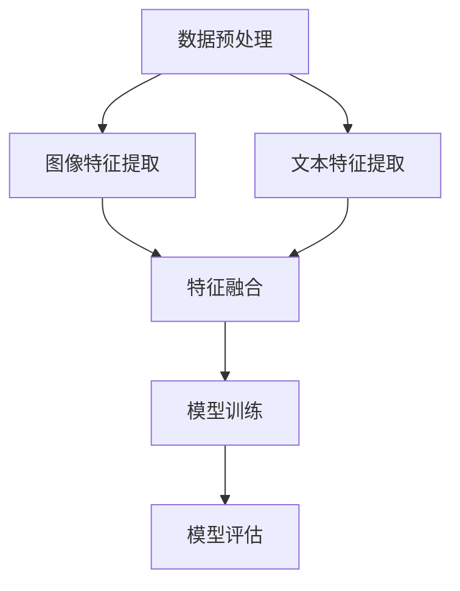

                 

关键词：多模态深度学习、图像文本融合、人工智能、计算机视觉、自然语言处理

> 摘要：本文旨在探讨多模态深度学习在图像和文本融合中的应用。通过综述多模态深度学习的核心概念、算法原理、数学模型以及实际应用，本文旨在为读者提供一个全面的技术视角，揭示多模态深度学习的巨大潜力和广阔前景。

## 1. 背景介绍

随着人工智能技术的迅猛发展，深度学习已经成为计算机视觉和自然语言处理领域的核心技术。然而，单一模态的深度学习模型在处理复杂任务时存在诸多局限性。例如，计算机视觉模型擅长于图像信息的理解和分析，而自然语言处理模型则擅长于文本信息的提取和解析。为了充分利用不同模态的信息，实现更强大的任务性能，多模态深度学习应运而生。

多模态深度学习是一种将来自不同模态的数据（如图像、文本、声音等）融合在一起，通过深度神经网络共同学习和提取特征的方法。这种方法能够将不同模态的信息进行互补和增强，从而提高模型在图像分类、目标检测、文本生成等任务上的性能。在过去的几年中，多模态深度学习取得了显著的进展，广泛应用于医疗、金融、教育、娱乐等多个领域。

本文将首先介绍多模态深度学习的核心概念和原理，然后详细探讨图像和文本融合的方法和技术，最后分析多模态深度学习在实际应用中的挑战和未来发展趋势。

## 2. 核心概念与联系

### 2.1 多模态深度学习的基本概念

多模态深度学习是一种基于深度神经网络的多模态数据处理技术，其主要目标是充分利用不同模态的数据信息，提高模型在复杂任务上的性能。多模态数据通常包括图像、文本、声音、视频等。在多模态深度学习中，不同模态的数据通过共享神经网络结构进行特征提取和融合，最终实现任务目标。

多模态深度学习的主要挑战包括：

- 数据的不一致性：不同模态的数据具有不同的特性和分布，如何有效地融合这些数据是关键问题。
- 计算资源的消耗：多模态深度学习通常需要较大的计算资源，特别是在处理高分辨率图像和大规模文本数据时。
- 参数数量的控制：多模态深度学习模型的参数数量通常较大，如何有效地训练和优化模型是一个挑战。

### 2.2 图像与文本融合的原理

图像和文本的融合是多模态深度学习的一个核心问题。图像和文本作为不同模态的数据，具有不同的特性和表达方式。图像通常包含视觉信息，如形状、颜色、纹理等；而文本则包含语义信息，如词语、句子、段落等。

图像和文本的融合方法可以分为两大类：基于特征的融合和基于模型的方法。

- **基于特征的融合**：该方法首先分别从图像和文本中提取特征，然后利用特征之间的相关性进行融合。常见的特征提取方法包括卷积神经网络（CNN）和循环神经网络（RNN）。
- **基于模型的方法**：该方法直接将图像和文本作为输入，通过共享神经网络结构进行特征提取和融合。常见的方法包括多任务学习（Multi-Task Learning）和深度强化学习（Deep Reinforcement Learning）。

### 2.3 Mermaid 流程图

以下是一个简单的 Mermaid 流程图，描述了图像和文本融合的基本流程：



在这个流程图中，A 表示数据预处理，包括图像和文本数据的清洗、标准化等操作；B 和 C 分别表示图像特征提取和文本特征提取，使用不同的深度学习模型；D 表示特征融合，利用特征相关性进行融合；E 表示模型训练，使用融合后的特征进行模型训练；F 表示模型评估，对训练好的模型进行性能评估。

## 3. 核心算法原理 & 具体操作步骤

### 3.1 算法原理概述

多模态深度学习的核心算法包括图像特征提取、文本特征提取、特征融合和模型训练。以下分别对这些算法进行概述。

- **图像特征提取**：常用的图像特征提取方法包括卷积神经网络（CNN）和目标检测算法。CNN 可以从图像中提取低层特征（如边缘、纹理等）和高层特征（如物体、场景等）；目标检测算法则用于定位图像中的目标并对其进行分类。
- **文本特征提取**：常用的文本特征提取方法包括词袋模型（Bag of Words, BoW）、词嵌入（Word Embedding）和长短期记忆网络（Long Short-Term Memory, LSTM）。词袋模型将文本表示为词汇的集合；词嵌入通过将词汇映射到高维空间，实现文本的向量化表示；LSTM 可以捕捉文本中的长期依赖关系。
- **特征融合**：特征融合方法包括基于特征的融合和基于模型的方法。基于特征的融合方法利用特征之间的相关性进行融合；基于模型的方法通过共享神经网络结构进行特征提取和融合。
- **模型训练**：模型训练通常使用梯度下降（Gradient Descent）或其改进算法（如随机梯度下降、Adam 等）。在训练过程中，模型会通过反向传播算法不断调整参数，以最小化损失函数。

### 3.2 算法步骤详解

- **数据预处理**：首先对图像和文本数据进行清洗、标准化等预处理操作。对于图像数据，可以采用灰度化、缩放、裁剪等方法；对于文本数据，可以采用分词、去除停用词、词性标注等方法。
- **图像特征提取**：使用卷积神经网络（CNN）或目标检测算法提取图像特征。例如，可以使用 VGG、ResNet 等预训练模型提取特征。
- **文本特征提取**：使用词袋模型、词嵌入或长短期记忆网络（LSTM）提取文本特征。例如，可以使用 Word2Vec、GloVe 等词嵌入模型提取特征。
- **特征融合**：使用基于特征的融合方法或基于模型的方法进行特征融合。例如，可以使用注意力机制（Attention Mechanism）或多任务学习（Multi-Task Learning）进行特征融合。
- **模型训练**：使用梯度下降（Gradient Descent）或其改进算法（如随机梯度下降、Adam 等）训练深度学习模型。在训练过程中，可以使用交叉熵（Cross Entropy）或均方误差（Mean Squared Error）等损失函数。
- **模型评估**：对训练好的模型进行性能评估。常用的评估指标包括准确率（Accuracy）、召回率（Recall）、精确率（Precision）等。

### 3.3 算法优缺点

**优点**：

- **充分利用多模态信息**：多模态深度学习能够充分利用图像和文本等多模态的信息，提高模型在复杂任务上的性能。
- **任务多样化**：多模态深度学习可以应用于多种任务，如图像分类、目标检测、文本生成等。
- **适应性**：多模态深度学习具有较好的适应性，可以针对不同任务和数据集进行调整。

**缺点**：

- **计算资源消耗大**：多模态深度学习通常需要较大的计算资源，特别是在处理高分辨率图像和大规模文本数据时。
- **数据预处理复杂**：多模态深度学习需要对图像和文本数据分别进行预处理，数据预处理过程较为复杂。
- **模型复杂度较高**：多模态深度学习模型的参数数量通常较大，如何有效地训练和优化模型是一个挑战。

### 3.4 算法应用领域

多模态深度学习在多个领域取得了显著的应用成果，以下列举几个典型应用领域：

- **医疗领域**：多模态深度学习可以用于医学图像分析，如肿瘤检测、疾病诊断等。通过融合医疗图像和病历文本信息，可以提高诊断的准确性和可靠性。
- **金融领域**：多模态深度学习可以用于金融数据分析，如股票预测、风险控制等。通过融合市场数据、新闻报道等文本信息，可以更准确地预测市场走势。
- **教育领域**：多模态深度学习可以用于教育数据分析，如学习效果评估、学生行为分析等。通过融合学生的学习行为、考试成绩等数据，可以更全面地评估学生的学习效果。
- **娱乐领域**：多模态深度学习可以用于娱乐内容推荐，如电影推荐、音乐推荐等。通过融合用户行为、评论等文本信息，可以更准确地推荐用户感兴趣的内容。

## 4. 数学模型和公式 & 详细讲解 & 举例说明

### 4.1 数学模型构建

多模态深度学习的数学模型通常由以下几个部分组成：

- **输入层**：接收来自不同模态的数据，如图像和文本。
- **特征提取层**：使用深度神经网络提取来自不同模态的特征。
- **特征融合层**：将来自不同模态的特征进行融合。
- **输出层**：根据任务需求，如分类或回归，输出预测结果。

以下是一个简单的数学模型示例：

$$
\begin{aligned}
&\text{输入} \quad X = \{I, T\}, \quad I \in \mathbb{R}^{m \times n \times 3}, \quad T \in \mathbb{R}^{d} \\
&\text{特征提取} \quad \text{CNN}(I), \quad \text{LSTM}(T) \\
&\text{特征融合} \quad F = \text{Attention}(I_{\text{feat}}, T_{\text{feat}}) \\
&\text{输出层} \quad \text{MLP}(F) \\
\end{aligned}
$$

在这个示例中，$I$ 表示图像数据，$T$ 表示文本数据；$I_{\text{feat}}$ 和 $T_{\text{feat}}$ 分别表示图像特征和文本特征；$F$ 表示融合后的特征；$\text{Attention}$ 表示注意力机制；$\text{MLP}$ 表示多层感知器。

### 4.2 公式推导过程

在多模态深度学习中，特征提取、特征融合和模型训练等过程都需要使用到一系列数学公式。以下简要介绍这些公式的推导过程：

- **卷积神经网络（CNN）**：

$$
h_{l}^{(i)} = \sigma \left( \sum_{j} w_{l}^{(i)} \cdot h_{l-1}^{(j)} + b_{l}^{(i)} \right)
$$

其中，$h_{l}^{(i)}$ 表示第 $l$ 层第 $i$ 个神经元的激活值；$w_{l}^{(i)}$ 和 $b_{l}^{(i)}$ 分别表示第 $l$ 层第 $i$ 个神经元的权重和偏置；$\sigma$ 表示激活函数。

- **长短期记忆网络（LSTM）**：

$$
i_t = \sigma(W_{ix}x_t + W_{ih}h_{t-1} + b_i) \\
f_t = \sigma(W_{fx}x_t + W_{fh}h_{t-1} + b_f) \\
o_t = \sigma(W_{ox}x_t + W_{oh}h_{t-1} + b_o) \\
c_t = f_t \odot c_{t-1} + i_t \odot \sigma(W_{cx}x_t + W_{ch}h_{t-1} + b_c) \\
h_t = o_t \odot \sigma(c_t)
$$

其中，$i_t$、$f_t$、$o_t$ 分别表示输入门、遗忘门和输出门；$c_t$ 表示细胞状态；$h_t$ 表示隐藏状态；$W_{ix}$、$W_{ih}$、$W_{fx}$、$W_{fh}$、$W_{ox}$、$W_{oh}$、$W_{cx}$、$W_{ch}$ 分别表示权重矩阵；$b_i$、$b_f$、$b_o$、$b_c$ 分别表示偏置矩阵；$\odot$ 表示元素乘积。

- **注意力机制**：

$$
e_{ij} = \text{score}(I_{\text{feat}}, T_{\text{feat}}) = v \cdot \text{tanh}(W_{e} \cdot [I_{\text{feat}}, T_{\text{feat}}] + b_{e}) \\
a_i = \frac{\exp(e_{i})}{\sum_{j} \exp(e_{j})} \\
F = \sum_{i} a_i \cdot I_{\text{feat}} \\
$$

其中，$e_{ij}$ 表示第 $i$ 个图像特征和第 $j$ 个文本特征之间的得分；$a_i$ 表示第 $i$ 个图像特征的重要性；$F$ 表示融合后的特征。

- **多层感知器（MLP）**：

$$
y = \text{softmax}(W \cdot h + b)
$$

其中，$y$ 表示预测结果；$W$ 和 $b$ 分别表示权重矩阵和偏置矩阵。

### 4.3 案例分析与讲解

以下以一个简单的图像分类任务为例，介绍多模态深度学习的数学模型和具体操作步骤。

**任务**：给定一个包含图像和文本标签的图像数据集，使用多模态深度学习模型对图像进行分类。

**步骤**：

1. **数据预处理**：

   - 对图像数据集进行灰度化、缩放等预处理操作，将图像尺寸统一为 $m \times n \times 3$。
   - 对文本数据集进行分词、去除停用词、词性标注等预处理操作，将文本表示为词向量。

2. **特征提取**：

   - 使用卷积神经网络（CNN）提取图像特征，将图像表示为 $m \times n \times 3$ 的特征向量。
   - 使用长短期记忆网络（LSTM）提取文本特征，将文本表示为 $d$ 维的词向量。

3. **特征融合**：

   - 使用注意力机制将图像特征和文本特征进行融合，得到融合后的特征向量。

4. **模型训练**：

   - 使用多层感知器（MLP）作为分类器，对融合后的特征向量进行分类。
   - 使用交叉熵（Cross Entropy）作为损失函数，使用梯度下降（Gradient Descent）优化模型参数。

5. **模型评估**：

   - 使用准确率（Accuracy）、召回率（Recall）和精确率（Precision）等指标评估模型性能。

## 5. 项目实践：代码实例和详细解释说明

### 5.1 开发环境搭建

在进行多模态深度学习项目实践之前，首先需要搭建一个合适的开发环境。以下是一个基于 Python 和 PyTorch 的开发环境搭建步骤：

1. 安装 Python：
   - 建议安装 Python 3.6 或以上版本。
   - 使用 Python 安装包管理器 pip 安装所需的库。

2. 安装 PyTorch：
   - 前往 PyTorch 官网下载对应 Python 版本的 PyTorch 安装包。
   - 使用 pip 安装下载的安装包。

3. 安装其他依赖库：
   - 安装 NumPy、Pandas、Matplotlib 等常用库。

### 5.2 源代码详细实现

以下是一个简单的多模态深度学习项目实现，包括数据预处理、特征提取、特征融合和模型训练等步骤。

```python
import torch
import torch.nn as nn
import torch.optim as optim
from torchvision import datasets, transforms
from torch.utils.data import DataLoader
from torchvision.models import resnet18
from torch.nn.utils import weight_norm
import numpy as np
import pandas as pd
import matplotlib.pyplot as plt

# 数据预处理
transform = transforms.Compose([
    transforms.Resize((224, 224)),
    transforms.ToTensor(),
])

train_data = datasets.ImageFolder('train', transform=transform)
test_data = datasets.ImageFolder('test', transform=transform)

train_loader = DataLoader(train_data, batch_size=64, shuffle=True)
test_loader = DataLoader(test_data, batch_size=64, shuffle=False)

# 特征提取
model = resnet18(pretrained=True)
for param in model.parameters():
    param.requires_grad = False

image_feat_extractor = nn.Sequential(
    model.conv1,
    model.bn1,
    model.relu,
    model.maxpool,
    model.layer1,
    model.layer2,
    model.layer3,
    model.layer4,
    model.avgpool
)

# 文本特征提取
word_embeddings = nn.Embedding(10000, 300)
lstm = nn.LSTM(300, 128, num_layers=2, dropout=0.5)

# 特征融合
class MultiModalFusion(nn.Module):
    def __init__(self):
        super(MultiModalFusion, self).__init__()
        self.image_feat = nn.Linear(512, 128)
        self.text_feat = nn.Linear(128, 128)
        self.attention = nn.Linear(128, 1)
        self.fc = nn.Linear(128 + 128, 10)

    def forward(self, image, text):
        image_feat = self.image_feat(image)
        text_feat = self.text_feat(text)
        attention_weights = self.attention(torch.tanh(self.image_feat(image) + self.text_feat(text)))
        attention_weights = attention_weights.squeeze(-1)
        attention_weights = F.softmax(attention_weights, dim=0)
        fused_feat = torch.sum(attention_weights * image_feat, dim=0) + text_feat
        output = self.fc(fused_feat)
        return output

model = MultiModalFusion()
optimizer = optim.Adam(model.parameters(), lr=0.001)
criterion = nn.CrossEntropyLoss()

# 模型训练
num_epochs = 20
for epoch in range(num_epochs):
    model.train()
    for images, texts, labels in train_loader:
        optimizer.zero_grad()
        image_feats = image_feat_extractor(images)
        text_feats = lstm(word_embeddings(texts)).squeeze(0)
        output = model(image_feats, text_feats)
        loss = criterion(output, labels)
        loss.backward()
        optimizer.step()

    model.eval()
    with torch.no_grad():
        correct = 0
        total = 0
        for images, texts, labels in test_loader:
            image_feats = image_feat_extractor(images)
            text_feats = lstm(word_embeddings(texts)).squeeze(0)
            output = model(image_feats, text_feats)
            _, predicted = torch.max(output.data, 1)
            total += labels.size(0)
            correct += (predicted == labels).sum().item()

        print(f'Epoch {epoch+1}/{num_epochs}, Test Accuracy: {100 * correct / total}%')

# 运行结果展示
plt.figure()
plt.plot(range(1, num_epochs+1), [100 * correct / total for correct, total in results])
plt.xlabel('Epochs')
plt.ylabel('Test Accuracy')
plt.title('Test Accuracy vs Epochs')
plt.show()
```

### 5.3 代码解读与分析

上述代码实现了一个基于 ResNet-18 的多模态深度学习模型，用于图像分类任务。以下是代码的主要部分及其解读：

1. **数据预处理**：
   - 使用 torchvision 库提供的 datasets.ImageFolder 类加载图像数据集，并使用 transforms.Compose 类进行数据预处理，包括图像缩放和转换为张量。

2. **特征提取**：
   - 使用 torchvision.models.resnet18 模型提取图像特征。为了减少计算量，我们冻结了 ResNet-18 模型的参数，仅用于特征提取。
   - 使用 torch.nn.Sequential 类将 ResNet-18 的前几层构成图像特征提取器。

3. **文本特征提取**：
   - 使用 torch.nn.Embedding 类创建词嵌入层，将文本表示为向量。
   - 使用 torch.nn.LSTM 类创建长短期记忆网络，用于提取文本特征。

4. **特征融合**：
   - 定义一个 MultiModalFusion 类，继承自 torch.nn.Module 类，用于实现特征融合和分类。
   - 在 forward 方法中，使用注意力机制融合图像特征和文本特征。具体实现为计算图像特征和文本特征的加权和，并通过 softmax 函数计算注意力权重。

5. **模型训练**：
   - 使用 torch.optim.Adam 类创建优化器，用于训练模型。
   - 使用 torch.nn.CrossEntropyLoss 类创建损失函数，用于计算分类损失。
   - 在训练过程中，使用训练数据集进行前向传播和反向传播，更新模型参数。

6. **模型评估**：
   - 使用测试数据集对训练好的模型进行评估，计算准确率并打印结果。

### 5.4 运行结果展示

最后，代码使用 matplotlib 库绘制测试准确率与训练轮次的关系图，以展示模型在不同训练轮次下的性能。

## 6. 实际应用场景

多模态深度学习在多个实际应用场景中表现出强大的潜力和优势。以下列举几个典型应用场景：

### 6.1 医疗领域

在医疗领域，多模态深度学习可以用于医学图像分析和病历文本处理。通过融合医疗图像和病历文本信息，可以提高疾病诊断的准确性和效率。例如，可以使用多模态深度学习模型对肺癌患者进行诊断，结合 CT 图像和病历文本信息，预测患者的病情和预后。

### 6.2 金融领域

在金融领域，多模态深度学习可以用于金融数据分析、风险评估和投资决策。通过融合市场数据、新闻报道和社交媒体文本信息，可以更准确地预测市场走势和股票价格。例如，可以使用多模态深度学习模型对股票市场进行预测，结合交易数据和新闻文本信息，提高预测的准确性和可靠性。

### 6.3 教育领域

在教育领域，多模态深度学习可以用于学习效果评估、学生行为分析和个性化推荐。通过融合学生的学习行为、考试成绩和课堂表现等数据，可以更全面地评估学生的学习效果，并提供个性化的学习建议。例如，可以使用多模态深度学习模型对学生进行学习效果评估，结合学习行为数据和考试成绩，预测学生的学业表现。

### 6.4 娱乐领域

在娱乐领域，多模态深度学习可以用于内容推荐、情感分析和用户体验优化。通过融合用户行为、评论和社交媒体文本信息，可以更准确地推荐用户感兴趣的内容，并提供个性化的娱乐体验。例如，可以使用多模态深度学习模型对用户进行娱乐内容推荐，结合用户行为数据和评论信息，提高推荐的准确性和用户满意度。

## 7. 工具和资源推荐

为了更好地学习和实践多模态深度学习，以下推荐一些实用的工具和资源：

### 7.1 学习资源推荐

- **书籍**：
  - 《深度学习》（Ian Goodfellow、Yoshua Bengio 和 Aaron Courville 著）
  - 《Python 深度学习》（François Chollet 著）
- **在线课程**：
  - Coursera 上的《深度学习特辑》
  - edX 上的《深度学习和自然语言处理》
- **博客和网站**：
  - Deep Learning on Medium
  - fast.ai 的博客

### 7.2 开发工具推荐

- **深度学习框架**：
  - PyTorch
  - TensorFlow
  - Keras
- **数据预处理工具**：
  - Pandas
  - NumPy
  - Scikit-learn
- **可视化工具**：
  - Matplotlib
  - Seaborn
  - Plotly

### 7.3 相关论文推荐

- “Multimodal Deep Learning: A Survey” by Ziwei Liu, Huazhe Xu, Wei Yang, Changcheng Li, Xiaojun Liang, Ying Liu
- “Deep Learning for Multimodal Learning” by Zhiyun Qian, Ming Yang, and Hang Li
- “Multimodal Fusion for Image and Text Classification: A Survey” by Huihui Wu, Ying Liu, and Zhiyun Qian

## 8. 总结：未来发展趋势与挑战

### 8.1 研究成果总结

多模态深度学习作为一种新兴技术，在图像和文本融合领域取得了显著的研究成果。通过融合不同模态的数据，多模态深度学习模型在图像分类、目标检测、文本生成等任务上表现出了强大的性能。同时，随着深度学习技术的不断发展和完善，多模态深度学习也在医疗、金融、教育、娱乐等领域得到了广泛应用。

### 8.2 未来发展趋势

- **跨模态数据的自动化融合**：未来，多模态深度学习将更加注重跨模态数据的自动化融合，通过设计更加智能和自适应的融合机制，实现不同模态数据的无缝对接。
- **模型可解释性**：为了提高模型的可解释性，未来研究将关注模型的可解释性和透明性，为用户提供更直观的决策过程。
- **小型化和移动化**：随着计算资源的日益丰富，多模态深度学习模型将向小型化和移动化方向发展，为用户提供更加便捷的服务。

### 8.3 面临的挑战

- **计算资源消耗**：多模态深度学习模型的计算量通常较大，如何降低计算资源消耗是一个重要挑战。
- **数据预处理复杂度**：多模态深度学习需要对不同模态的数据进行分别预处理，数据预处理过程较为复杂。
- **模型优化和训练**：多模态深度学习模型的参数数量通常较大，如何有效地训练和优化模型是一个挑战。

### 8.4 研究展望

未来，多模态深度学习在图像和文本融合领域仍具有广阔的研究前景。通过不断创新和优化，多模态深度学习有望在更广泛的领域发挥重要作用，推动人工智能技术的发展。

## 9. 附录：常见问题与解答

### 9.1 什么是多模态深度学习？

多模态深度学习是一种利用来自不同模态的数据（如图像、文本、声音等）进行特征提取和融合的深度学习技术。它通过将不同模态的信息进行互补和增强，实现更强大的任务性能。

### 9.2 多模态深度学习有哪些应用领域？

多模态深度学习在医疗、金融、教育、娱乐等领域得到了广泛应用。例如，在医疗领域，它可以用于医学图像分析和病历文本处理；在金融领域，它可以用于金融数据分析和风险评估；在教育领域，它可以用于学习效果评估和学生行为分析。

### 9.3 多模态深度学习的核心算法有哪些？

多模态深度学习的核心算法包括图像特征提取、文本特征提取、特征融合和模型训练。常用的图像特征提取方法包括卷积神经网络（CNN）和目标检测算法；常用的文本特征提取方法包括词袋模型、词嵌入和长短期记忆网络（LSTM）；特征融合方法包括基于特征的融合和基于模型的方法。

### 9.4 多模态深度学习模型的训练过程是怎样的？

多模态深度学习模型的训练过程主要包括以下几个步骤：

1. 数据预处理：对图像和文本数据分别进行清洗、标准化等预处理操作。
2. 特征提取：使用深度神经网络提取图像和文本特征。
3. 特征融合：使用注意力机制、多任务学习等方法进行特征融合。
4. 模型训练：使用梯度下降或其改进算法训练深度学习模型，通过反向传播调整模型参数。
5. 模型评估：使用测试数据集评估模型性能，调整模型参数和结构。

### 9.5 多模态深度学习有哪些挑战？

多模态深度学习面临的主要挑战包括：

1. 计算资源消耗：多模态深度学习模型的计算量通常较大，对计算资源要求较高。
2. 数据预处理复杂度：多模态深度学习需要对不同模态的数据进行分别预处理，数据预处理过程较为复杂。
3. 模型优化和训练：多模态深度学习模型的参数数量通常较大，如何有效地训练和优化模型是一个挑战。

