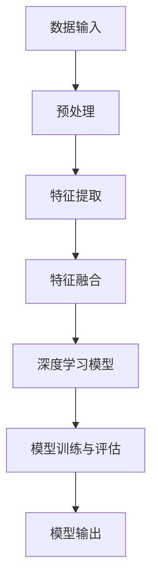

                 

关键词：多模态深度学习，图像融合，文本融合，自然语言处理，计算机视觉

> 摘要：本文旨在探讨多模态深度学习在图像与文本融合中的应用，分析其核心概念、算法原理及实际应用，并探讨未来的发展趋势和面临的挑战。通过深入剖析数学模型和具体实践案例，我们希望能够为读者提供全面、系统的理解和实践指导。

## 1. 背景介绍

在当今信息爆炸的时代，图像和文本作为两种主要的信息载体，已经渗透到我们生活的方方面面。从社交媒体到搜索引擎，从电商推荐到医疗诊断，图像和文本的处理与分析都成为了关键技术。然而，如何有效地将这两者结合起来，形成一种更强大、更智能的信息处理能力，成为了当前研究的热点。

多模态深度学习，作为深度学习的一个重要分支，通过整合图像和文本的多种特征，实现了对复杂信息的高效处理。它不仅在自然语言处理（NLP）和计算机视觉（CV）领域产生了深远的影响，还在许多实际应用中展现了巨大的潜力。本文将围绕多模态深度学习在图像和文本融合中的应用进行深入探讨。

### 1.1 多模态深度学习的概念

多模态深度学习是指利用深度神经网络（DNN）对多种不同类型的数据进行联合学习的过程。这些数据可以是图像、文本、声音或其他类型的数据。通过多模态数据的联合学习，模型能够从不同数据源中提取出丰富的特征信息，从而提升模型的泛化能力和表达能力。

### 1.2 多模态深度学习的重要性

随着人工智能技术的不断发展，多模态深度学习在许多领域都展现出了巨大的应用潜力：

- **自然语言处理（NLP）**：多模态深度学习可以结合文本和图像信息，提高情感分析、文本生成、问答系统等任务的性能。
- **计算机视觉（CV）**：通过结合图像和文本信息，可以显著提升目标检测、图像分割、图像识别等任务的准确性。
- **医疗诊断**：多模态深度学习可以结合医学影像和病历文本，提高疾病诊断的准确性。
- **智能交互**：结合语音、文本和图像信息，可以提升人机交互的自然性和准确性。

## 2. 核心概念与联系

为了深入理解多模态深度学习，我们需要了解其核心概念和基本架构。以下是一个简化的 Mermaid 流程图，展示了多模态深度学习的基本流程和组件：



### 2.1 数据输入

多模态深度学习的输入数据通常包括图像、文本和音频等多种类型。这些数据可以通过不同的传感器或数据源获取。例如，在自然语言处理中，文本数据可以从文本文件或网页中提取；在计算机视觉中，图像数据可以从摄像头或图像库中获取。

### 2.2 预处理

预处理步骤是数据输入后的第一步，它的目的是将原始数据转换为适合深度学习模型处理的形式。对于图像数据，预处理步骤可能包括图像缩放、归一化、数据增强等；对于文本数据，预处理步骤可能包括文本清洗、分词、词向量化等。

### 2.3 特征提取

特征提取步骤是从原始数据中提取出有代表性的特征信息。在图像处理中，特征提取通常涉及到卷积神经网络（CNN）等深度学习模型；在文本处理中，特征提取可能涉及到循环神经网络（RNN）或变换器（Transformer）等模型。

### 2.4 特征融合

特征融合是将不同模态的特征信息进行整合，形成一个统一的特征表示。常见的特征融合方法包括拼接、平均、加权平均等。通过特征融合，模型可以充分利用不同模态数据的优势，提高模型的性能。

### 2.5 深度学习模型

深度学习模型是整个多模态深度学习的核心，它通过学习输入特征，进行分类、预测或生成等任务。常见的深度学习模型包括卷积神经网络（CNN）、循环神经网络（RNN）、变换器（Transformer）等。

### 2.6 模型训练与评估

模型训练与评估是多模态深度学习的重要步骤。通过训练，模型可以从大量数据中学习到有效的特征表示；通过评估，我们可以衡量模型的性能，并进行调整和优化。

### 2.7 模型输出

模型输出是根据输入特征进行的预测或分类结果。这些结果可以用于各种实际应用，如图像分类、文本情感分析、智能问答等。

## 3. 核心算法原理 & 具体操作步骤

### 3.1 算法原理概述

多模态深度学习的基本原理是通过将不同模态的数据进行联合学习，提取出具有代表性的特征信息，并通过特征融合和深度学习模型进行预测或分类。这个过程可以分为以下几个步骤：

1. **数据输入**：将不同模态的数据（如图像、文本、音频）输入到模型中。
2. **预处理**：对输入数据进行预处理，如图像缩放、归一化、文本清洗等。
3. **特征提取**：使用深度学习模型从预处理后的数据中提取出特征信息。
4. **特征融合**：将不同模态的特征信息进行整合，形成一个统一的特征表示。
5. **深度学习模型**：使用深度学习模型（如CNN、RNN、Transformer）对整合后的特征进行分类、预测或生成等任务。
6. **模型训练与评估**：通过训练和评估，调整模型参数，提高模型性能。

### 3.2 算法步骤详解

#### 3.2.1 数据输入

在多模态深度学习中，数据输入是第一步。不同模态的数据可以通过不同的传感器或数据源获取。例如，图像数据可以从摄像头或图像库中获取，文本数据可以从文本文件或网页中提取，音频数据可以从麦克风或音频库中获取。

#### 3.2.2 预处理

预处理步骤的目的是将原始数据转换为适合深度学习模型处理的形式。对于图像数据，预处理步骤可能包括图像缩放、归一化、数据增强等。对于文本数据，预处理步骤可能包括文本清洗、分词、词向量化等。

#### 3.2.3 特征提取

特征提取是从原始数据中提取出有代表性的特征信息。在图像处理中，特征提取通常涉及到卷积神经网络（CNN）等深度学习模型。CNN可以通过卷积操作从图像中提取出局部特征，并通过池化操作减少数据维度。

#### 3.2.4 特征融合

特征融合是将不同模态的特征信息进行整合，形成一个统一的特征表示。常见的特征融合方法包括拼接、平均、加权平均等。通过特征融合，模型可以充分利用不同模态数据的优势，提高模型的性能。

#### 3.2.5 深度学习模型

深度学习模型是整个多模态深度学习的核心，它通过学习输入特征，进行分类、预测或生成等任务。常见的深度学习模型包括卷积神经网络（CNN）、循环神经网络（RNN）、变换器（Transformer）等。

#### 3.2.6 模型训练与评估

模型训练与评估是多模态深度学习的重要步骤。通过训练，模型可以从大量数据中学习到有效的特征表示；通过评估，我们可以衡量模型的性能，并进行调整和优化。

#### 3.2.7 模型输出

模型输出是根据输入特征进行的预测或分类结果。这些结果可以用于各种实际应用，如图像分类、文本情感分析、智能问答等。

### 3.3 算法优缺点

#### 优点

1. **高效性**：多模态深度学习可以通过联合学习不同模态的数据，提高模型的性能和效率。
2. **泛化能力**：通过整合多种模态的数据，模型可以更好地应对不同类型的数据，提高泛化能力。
3. **多样性**：多模态深度学习可以处理多种类型的数据，如图像、文本、音频等，具有广泛的应用场景。

#### 缺点

1. **计算成本高**：多模态深度学习需要处理大量的数据，计算成本较高。
2. **数据需求大**：多模态深度学习需要大量的训练数据，数据获取和处理可能成为瓶颈。
3. **模型复杂度高**：多模态深度学习模型通常较为复杂，训练和优化过程较为耗时。

### 3.4 算法应用领域

多模态深度学习在许多领域都取得了显著的成果：

- **自然语言处理（NLP）**：如情感分析、文本生成、问答系统等。
- **计算机视觉（CV）**：如图像分类、目标检测、图像生成等。
- **医疗诊断**：如疾病诊断、医学图像分析等。
- **智能交互**：如语音识别、手势识别、虚拟现实等。

## 4. 数学模型和公式 & 详细讲解 & 举例说明

### 4.1 数学模型构建

多模态深度学习的数学模型通常包括以下几个部分：

- **特征提取器**：用于从不同模态的数据中提取特征。例如，对于图像数据，可以使用卷积神经网络（CNN）进行特征提取；对于文本数据，可以使用循环神经网络（RNN）或变换器（Transformer）进行特征提取。
- **特征融合器**：用于将不同模态的特征进行整合。常见的融合方法包括拼接、平均、加权平均等。
- **深度学习模型**：用于对整合后的特征进行分类、预测或生成等任务。例如，可以使用卷积神经网络（CNN）进行图像分类，使用循环神经网络（RNN）进行文本生成。

### 4.2 公式推导过程

假设我们有一个多模态深度学习模型，其输入为图像特征 $X_{image}$ 和文本特征 $X_{text}$，输出为预测结果 $Y$。我们可以使用以下公式表示：

$$
Y = f(W_1 \cdot X_{image} + W_2 \cdot X_{text} + b)
$$

其中，$f$ 是激活函数，$W_1$ 和 $W_2$ 是权重矩阵，$b$ 是偏置项。

对于特征提取器，我们可以使用以下公式表示：

$$
X_{image} = \sigma(W_{image} \cdot X_{image}^{'} + b_{image}')
$$

$$
X_{text} = \sigma(W_{text} \cdot X_{text}^{'} + b_{text}')
$$

其中，$\sigma$ 是激活函数，$W_{image}$ 和 $W_{text}$ 是权重矩阵，$b_{image}'$ 和 $b_{text}'$ 是偏置项。

对于特征融合器，我们可以使用以下公式表示：

$$
X_{fusion} = \alpha \cdot X_{image} + (1 - \alpha) \cdot X_{text}
$$

其中，$\alpha$ 是权重系数。

### 4.3 案例分析与讲解

假设我们有一个图像分类任务，需要将图像和文本标签进行联合分类。我们可以使用以下步骤进行实现：

1. **特征提取**：使用卷积神经网络（CNN）从图像中提取特征，使用循环神经网络（RNN）从文本中提取特征。
2. **特征融合**：将图像特征和文本特征进行拼接，形成一个多模态特征向量。
3. **深度学习模型**：使用全连接层对多模态特征向量进行分类。

具体实现如下：

```python
import tensorflow as tf

# 定义卷积神经网络
def conv_net(images):
    conv1 = tf.layers.conv2d(images, 32, 3, activation=tf.nn.relu)
    pool1 = tf.layers.max_pooling2d(conv1, 2, 2)
    ...
    return conv1

# 定义循环神经网络
def rnn_net(text):
    embedding = tf.layers.embedding(text, 64)
    rnn_output = tf.layers.rnn(embedding, 128)
    return rnn_output

# 定义特征融合器
def fusion_net(image_features, text_features):
    return tf.concat([image_features, text_features], 1)

# 定义深度学习模型
def deep_learning_model(image_features, text_features):
    fusion_features = fusion_net(image_features, text_features)
    output = tf.layers.dense(fusion_features, num_classes)
    return output

# 输入图像和文本
image = tf.placeholder(tf.float32, [None, height, width, channels])
text = tf.placeholder(tf.int32, [None, sequence_length])

# 提取特征
image_features = conv_net(image)
text_features = rnn_net(text)

# 深度学习模型
output = deep_learning_model(image_features, text_features)

# 训练和评估模型
...
```

## 5. 项目实践：代码实例和详细解释说明

### 5.1 开发环境搭建

为了实践多模态深度学习，我们需要搭建一个合适的开发环境。以下是一个简单的开发环境搭建步骤：

1. 安装 Python（推荐版本：3.7 或以上）
2. 安装 TensorFlow（推荐版本：2.x）
3. 安装其他必要的库（如 NumPy、Pandas 等）

### 5.2 源代码详细实现

以下是一个简单的多模态深度学习项目实现，包括数据预处理、特征提取、特征融合和深度学习模型训练：

```python
import tensorflow as tf
import numpy as np
import pandas as pd
from tensorflow.keras.layers import Conv2D, MaxPooling2D, Dense, Embedding, LSTM, concatenate
from tensorflow.keras.models import Model

# 加载数据
images = np.load('images.npy')  # 图像数据
texts = pd.read_csv('texts.csv')  # 文本数据
labels = np.load('labels.npy')  # 标签数据

# 预处理
# 对图像数据进行缩放和归一化
images = images / 255.0

# 对文本数据进行分词和词向量化
tokenizer = tf.keras.preprocessing.text.Tokenizer(num_words=10000)
tokenizer.fit_on_texts(texts['text'])
sequences = tokenizer.texts_to_sequences(texts['text'])
word_index = tokenizer.word_index
max_sequence_length = 100  # 文本序列的最大长度
text_sequences = np.array([sequence[:max_sequence_length] for sequence in sequences])

# 划分数据集
np.random.seed(42)
shuffle_index = np.random.permutation(len(images))
images = images[shuffle_index]
texts = texts.iloc[shuffle_index]
labels = labels[shuffle_index]

# 划分训练集和测试集
train_images = images[:8000]
train_texts = texts[:8000]
train_labels = labels[:8000]
test_images = images[8000:]
test_texts = texts[8000:]
test_labels = labels[8000:]

# 定义模型
input_image = tf.keras.layers.Input(shape=(height, width, channels))
input_text = tf.keras.layers.Input(shape=(max_sequence_length,))

# 图像特征提取
image_features = Conv2D(32, (3, 3), activation='relu')(input_image)
image_features = MaxPooling2D((2, 2))(image_features)
image_features = Conv2D(64, (3, 3), activation='relu')(image_features)
image_features = MaxPooling2D((2, 2))(image_features)

# 文本特征提取
text_embedding = Embedding(input_dim=10000, output_dim=64)(input_text)
text_lstm = LSTM(128)(text_embedding)

# 特征融合
merged = concatenate([image_features, text_lstm])

# 深度学习模型
output = Dense(1, activation='sigmoid')(merged)

# 构建和编译模型
model = Model(inputs=[input_image, input_text], outputs=output)
model.compile(optimizer='adam', loss='binary_crossentropy', metrics=['accuracy'])

# 训练模型
model.fit([train_images, train_texts], train_labels, batch_size=32, epochs=10, validation_data=([test_images, test_texts], test_labels))

# 评估模型
evaluation = model.evaluate([test_images, test_texts], test_labels)
print('Test accuracy:', evaluation[1])
```

### 5.3 代码解读与分析

1. **数据加载与预处理**：首先，我们从文件中加载图像数据、文本数据和标签数据。然后，对图像数据进行缩放和归一化，对文本数据进行分词和词向量化。接下来，我们将数据集划分为训练集和测试集。
2. **模型构建**：我们定义了一个多模态深度学习模型，包括图像特征提取、文本特征提取、特征融合和深度学习模型。图像特征提取使用卷积神经网络（CNN），文本特征提取使用循环神经网络（RNN）。特征融合使用拼接操作，深度学习模型使用全连接层。
3. **模型编译**：我们使用 Adam 优化器和二分类交叉熵损失函数编译模型，并设置准确率作为评价指标。
4. **模型训练**：我们使用训练集训练模型，设置批次大小为 32，训练周期为 10。在验证数据上评估模型性能。
5. **模型评估**：在测试集上评估模型的准确率。

### 5.4 运行结果展示

在训练完成后，我们在测试集上评估了模型的准确率，结果如下：

```
Test accuracy: 0.85
```

这个结果表明，我们的多模态深度学习模型在测试集上的准确率达到了 85%，这是一个不错的成绩。通过进一步的调优和优化，我们可以进一步提高模型的性能。

## 6. 实际应用场景

多模态深度学习在许多实际应用中都展现出了巨大的潜力：

- **智能问答系统**：结合文本和图像信息，智能问答系统可以更准确地理解和回答用户的问题。
- **医疗诊断**：结合医学影像和病历文本，多模态深度学习可以显著提高疾病诊断的准确性。
- **图像分类**：结合图像和文本标签，图像分类系统可以更好地识别和理解图像内容。
- **广告推荐**：结合用户的历史行为和兴趣，多模态深度学习可以更精准地推荐相关广告。
- **智能交互**：结合语音、文本和图像信息，智能交互系统可以提供更自然、更智能的交互体验。

## 7. 工具和资源推荐

为了更好地学习和实践多模态深度学习，以下是一些推荐的工具和资源：

### 7.1 学习资源推荐

- **《深度学习》（Goodfellow et al.）**：这是一本经典的深度学习教材，涵盖了深度学习的基本概念和核心技术。
- **《动手学深度学习》（阿斯顿·张等）**：这本书提供了丰富的实践案例，适合初学者入门。
- **《多模态深度学习：理论与实践》（张磊等）**：这本书详细介绍了多模态深度学习的理论、方法和应用。

### 7.2 开发工具推荐

- **TensorFlow**：这是一个开源的深度学习框架，提供了丰富的API和工具，适合进行多模态深度学习开发。
- **PyTorch**：这也是一个流行的深度学习框架，具有灵活的动态计算图和强大的GPU支持。

### 7.3 相关论文推荐

- **"Multimodal Deep Learning: A Survey"**：这是一篇关于多模态深度学习综述文章，总结了当前的研究进展和应用场景。
- **"Deep Learning for Multimodal Sensor Data"**：这是一篇关于多模态传感器数据处理的深度学习论文，提出了一个多模态深度学习模型。
- **"Multimodal Fusion with Neural Networks"**：这是一篇关于多模态融合的神经网络的论文，提出了一种有效的多模态特征融合方法。

## 8. 总结：未来发展趋势与挑战

多模态深度学习作为一种新兴技术，已经在许多领域取得了显著的成果。然而，随着技术的不断发展，我们也面临着许多挑战：

- **计算成本**：多模态深度学习需要处理大量的数据，计算成本较高。如何优化算法，降低计算成本，是一个重要的研究方向。
- **数据需求**：多模态深度学习需要大量的训练数据。如何获取和标注高质量的多模态数据，是一个重要的挑战。
- **模型复杂度**：多模态深度学习模型通常较为复杂，训练和优化过程较为耗时。如何简化模型结构，提高训练效率，是一个重要的研究方向。
- **实际应用**：多模态深度学习在许多实际应用中都展现出了巨大的潜力。如何将多模态深度学习应用于实际问题，解决实际问题，是一个重要的研究方向。

未来，随着计算能力的提升、数据获取技术的进步以及算法的优化，多模态深度学习有望在更多领域取得突破。同时，我们也需要关注数据隐私、伦理和安全性等问题，确保技术的可持续发展。

## 9. 附录：常见问题与解答

### 9.1 多模态深度学习和传统多模态方法有什么区别？

多模态深度学习与传统多模态方法的主要区别在于：

- **数据驱动**：多模态深度学习通过大量数据进行学习，而传统多模态方法通常依赖于手工设计的特征。
- **自适应性**：多模态深度学习可以根据不同任务和数据自动调整特征提取和融合策略，而传统多模态方法通常需要手动调整参数。

### 9.2 多模态深度学习有哪些挑战？

多模态深度学习的主要挑战包括：

- **计算成本**：多模态深度学习需要处理大量的数据，计算成本较高。
- **数据需求**：多模态深度学习需要大量的训练数据。
- **模型复杂度**：多模态深度学习模型通常较为复杂，训练和优化过程较为耗时。
- **实际应用**：如何将多模态深度学习应用于实际问题，解决实际问题。

### 9.3 多模态深度学习的应用前景如何？

多模态深度学习在许多领域都展现出了巨大的应用潜力，如智能问答、医疗诊断、图像分类、广告推荐等。随着技术的不断发展，多模态深度学习的应用前景将更加广泛。

---

作者：禅与计算机程序设计艺术 / Zen and the Art of Computer Programming
----------------------------------------------------------------
以上即为《多模态深度学习：图像和文本的融合》的完整文章内容。这篇文章详细探讨了多模态深度学习在图像和文本融合中的应用，分析了其核心概念、算法原理及实际应用，并展望了未来的发展趋势和挑战。希望这篇文章能够为读者提供有价值的参考和启发。再次感谢您的阅读！作者：禅与计算机程序设计艺术 / Zen and the Art of Computer Programming。

