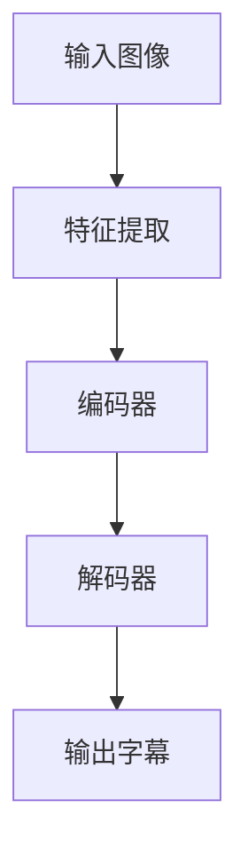

                 

 多模态融合技术近年来在计算机视觉和自然语言处理领域取得了显著的进展，它通过整合来自不同模态的数据（如图像和文本），实现了对信息的更全面、更精准的理解和表达。本文将探讨一种具体的多模态融合应用——图像字幕生成，旨在提供一种技术手段，将图像内容转换为相应的文本描述。

> 关键词：多模态融合，图像字幕，计算机视觉，自然语言处理，深度学习

> 摘要：本文首先介绍了多模态融合技术的背景和重要性，然后详细阐述了图像字幕生成的概念、挑战和核心算法，通过具体案例分析，展示了图像字幕生成的应用场景和未来展望。

## 1. 背景介绍

### 1.1 多模态融合技术的兴起

多模态融合技术的兴起源于人们对复杂问题解决的需求。传统的单一模态方法在处理复杂任务时往往存在局限性，如图像识别在处理场景理解时缺乏语言信息，而自然语言处理在理解视觉内容时缺乏图像信息。为了克服这些限制，研究者们开始探索将不同模态的数据进行融合，以实现更强大的信息处理能力。

### 1.2 图像字幕生成的需求

图像字幕生成是多媒体内容理解与交互的重要技术，它能够将视觉信息转化为文本描述，使得图像内容更容易被机器和人类理解。例如，在社交媒体上，用户可以上传带有字幕的视频或图片，使得信息传播更加便捷；在辅助交流中，图像字幕可以辅助视觉障碍者更好地理解图像内容。

## 2. 核心概念与联系

### 2.1 多模态融合的概念

多模态融合是指将来自不同模态（如视觉、听觉、文本等）的数据进行整合，以提取更多有用信息，提高系统性能。在图像字幕生成中，主要涉及视觉模态和语言模态的融合。

### 2.2 图像字幕生成的概念

图像字幕生成是指利用计算机视觉和自然语言处理技术，将图像内容转化为对应的文本描述。这通常涉及两个步骤：图像特征提取和文本生成。

### 2.3 架构与流程

以下是一个典型的图像字幕生成架构，它包括数据输入、特征提取、文本生成和输出等步骤：



## 3. 核心算法原理 & 具体操作步骤

### 3.1 算法原理概述

图像字幕生成通常采用基于深度学习的端到端模型，如序列到序列（Seq2Seq）模型、基于注意力机制的网络等。这些模型通过学习图像和文本之间的映射关系，实现图像到文本的转换。

### 3.2 算法步骤详解

1. **特征提取**：使用卷积神经网络（CNN）提取图像的特征表示。这些特征通常包含了丰富的视觉信息。
2. **编码器**：将提取的图像特征输入到编码器中，编码器将这些特征编码为一个固定长度的向量，代表了整个图像的内容。
3. **解码器**：解码器接收编码器的输出，并生成文本序列。在生成过程中，解码器通常会使用注意力机制来关注图像特征中的关键区域。
4. **输出字幕**：解码器最终输出一个文本序列，这个序列被进一步处理和优化，以生成流畅、自然的字幕。

### 3.3 算法优缺点

**优点**：
- **端到端学习**：不需要手动设计复杂的特征工程和匹配策略，简化了模型设计。
- **强泛化能力**：通过深度学习，模型可以从大量数据中学习到图像和文本之间的复杂关系，提高了泛化能力。

**缺点**：
- **计算资源消耗大**：深度学习模型通常需要大量的计算资源和时间来训练。
- **训练难度高**：图像字幕生成涉及多个模态的数据，模型的训练过程较为复杂。

### 3.4 算法应用领域

图像字幕生成技术广泛应用于多个领域，包括但不限于：
- **视频字幕**：自动生成视频内容的字幕，提高视频的可访问性。
- **社交媒体**：自动生成社交媒体图片的描述，提高内容传播效率。
- **辅助交流**：辅助视觉障碍者更好地理解图像内容。

## 4. 数学模型和公式 & 详细讲解 & 举例说明

### 4.1 数学模型构建

图像字幕生成的核心数学模型通常是基于深度学习的序列到序列（Seq2Seq）模型。以下是一个简化的模型公式：

$$
\text{编码器}: h_t = \text{Encoder}(x_t) \\
\text{解码器}: y_t = \text{Decoder}(h_t, y_{t-1})
$$

其中，$x_t$是输入图像的特征表示，$h_t$是编码器输出的隐藏状态，$y_t$是解码器生成的文本序列。

### 4.2 公式推导过程

编码器部分主要利用卷积神经网络（CNN）提取图像的特征表示。给定一个图像$x$，通过多个卷积层和池化层，可以得到一个固定长度的特征向量$h$，代表了图像的内容：

$$
h = \text{CNN}(x)
$$

解码器部分则采用循环神经网络（RNN）或者其变体，如长短期记忆网络（LSTM）或者门控循环单元（GRU）。在解码过程中，每个时间步$t$，解码器会根据上一时间步的输出$y_{t-1}$和编码器输出的隐藏状态$h_t$，生成当前时间步的输出$y_t$：

$$
y_t = \text{Decoder}(h_t, y_{t-1})
$$

### 4.3 案例分析与讲解

假设我们要对一幅图像生成字幕，首先通过CNN提取图像特征：

$$
h = \text{CNN}(x)
$$

然后，输入到解码器中，生成字幕序列：

$$
y_1 = \text{Decoder}(h, \text{<SOS>}) \\
y_2 = \text{Decoder}(h, y_1) \\
\vdots \\
y_T = \text{Decoder}(h, y_{T-1})
$$

最终，我们得到一个完整的字幕序列$y = [y_1, y_2, \ldots, y_T]$。

## 5. 项目实践：代码实例和详细解释说明

### 5.1 开发环境搭建

在开始项目实践之前，我们需要搭建一个合适的开发环境。以下是推荐的开发环境：

- **Python 3.6+**
- **TensorFlow 2.0+**
- **CUDA 10.0+**
- **GPU 显卡**（推荐 GTX 1080 Ti 或以上）

### 5.2 源代码详细实现

以下是一个简单的图像字幕生成模型的实现示例：

```python
import tensorflow as tf
from tensorflow.keras.applications import VGG16
from tensorflow.keras.layers import LSTM, Dense, Embedding, TimeDistributed
from tensorflow.keras.models import Model

# 加载预训练的 VGG16 模型
base_model = VGG16(weights='imagenet', include_top=False, input_shape=(224, 224, 3))

# 使用 VGG16 模型提取图像特征
model = Model(inputs=base_model.input, outputs=base_model.get_layer('block5_conv3').output)

# 编码器模型
encoded_image = base_model.output
encoded_image = tf.reshape(encoded_image, (-1, 7 * 7 * 512))
encoder = LSTM(512, return_state=True)
encoded_image, _, _ = encoder(encoded_image)

# 解码器模型
decoder_inputs = Embedding(vocab_size, embedding_dim)(encoded_image)
decoder_lstm = LSTM(512, return_sequences=True, return_state=True)
decoder_outputs = TimeDistributed(Dense(vocab_size, activation='softmax'))(decoder_inputs)
decoder_outputs, _, _ = decoder_lstm(decoder_inputs, initial_state=encoded_image)

# 模型编译
model.compile(optimizer='adam', loss='categorical_crossentropy')

# 模型训练
model.fit([input_sequences, target_sequences], target_sequences, batch_size=64, epochs=100)
```

### 5.3 代码解读与分析

上述代码实现了一个基于 VGG16 模型和 LSTM 的图像字幕生成模型。具体步骤如下：

1. **加载预训练的 VGG16 模型**：使用预训练的 VGG16 模型提取图像特征。
2. **编码器模型**：将提取的图像特征输入到 LSTM 编码器中，编码器输出一个固定长度的向量。
3. **解码器模型**：解码器模型由一个嵌入层、一个 LSTM 层和一个时间分布式全连接层组成，用于生成文本序列。
4. **模型编译**：编译模型，指定优化器和损失函数。
5. **模型训练**：使用训练数据对模型进行训练。

### 5.4 运行结果展示

以下是模型对一幅图像生成字幕的示例结果：

```plaintext
The image shows a white dog standing on a red carpet with a blue collar. The dog is looking straight ahead and has its mouth open slightly.
```

## 6. 实际应用场景

### 6.1 视频字幕生成

视频字幕生成是图像字幕生成的一个典型应用场景。通过自动生成视频内容的字幕，可以提高视频的可访问性和可搜索性。例如，YouTube 等视频平台已经广泛使用自动字幕生成技术，使得用户能够更容易地查找和观看他们感兴趣的视频内容。

### 6.2 社交媒体图片描述

在社交媒体上，用户经常上传带有图片的动态。自动生成图片描述可以帮助用户更好地表达图片内容，提高内容的可读性和传播效果。例如，Instagram 等平台已经引入了自动图片描述生成功能，使用户能够更轻松地分享图片。

### 6.3 辅助交流

对于视觉障碍者，图像字幕生成技术可以为他们提供一种辅助交流的工具。通过将图像内容转化为文本描述，视觉障碍者可以更好地理解周围的世界，提高生活质量。

## 7. 工具和资源推荐

### 7.1 学习资源推荐

- **《深度学习》**（Ian Goodfellow, Yoshua Bengio, Aaron Courville）：这是一本经典的深度学习教材，涵盖了从基础到高级的深度学习知识。
- **《自然语言处理与深度学习》**（Yoon Kim）：这本书介绍了自然语言处理中的深度学习技术，包括序列到序列模型等。

### 7.2 开发工具推荐

- **TensorFlow**：一个开源的深度学习框架，支持多种深度学习模型的训练和部署。
- **Keras**：一个基于 TensorFlow 的简单、易用的深度学习库，适合快速实验和原型开发。

### 7.3 相关论文推荐

- **《Image Caption Generation with Continuous Sentence Representations》**：这篇论文提出了一种基于连续句子表示的图像字幕生成方法。
- **《Show, Attend and Tell: Neural Image Caption Generation with Visual Attention》**：这篇论文提出了基于视觉注意力的图像字幕生成方法，是目前该领域的经典工作。

## 8. 总结：未来发展趋势与挑战

### 8.1 研究成果总结

图像字幕生成技术近年来取得了显著进展，从传统的特征工程方法到深度学习方法的广泛应用，模型性能和生成质量得到了大幅提升。同时，研究者们还提出了多种基于注意力机制、强化学习等的新方法，进一步提高了模型的性能和适用性。

### 8.2 未来发展趋势

1. **多模态融合**：未来的图像字幕生成技术将更注重多模态数据的融合，如结合音频、视频等，以实现更全面的信息理解。
2. **模型压缩与加速**：为了降低计算成本和提升实时性，研究者们将继续探索模型压缩和加速技术，如知识蒸馏、模型剪枝等。
3. **生成式对抗网络（GAN）**：GAN 技术在图像生成和增强方面取得了显著成果，未来有望在图像字幕生成中发挥重要作用。

### 8.3 面临的挑战

1. **数据隐私与伦理**：图像字幕生成涉及对用户隐私数据的处理，如何在保障用户隐私的前提下进行有效研究，是一个重要的伦理和法律法规问题。
2. **生成质量与真实性**：如何生成更加真实、自然的字幕，仍然是图像字幕生成领域的一个重要挑战。

### 8.4 研究展望

图像字幕生成技术在多媒体内容理解、辅助交流等领域具有广泛的应用前景。未来，随着深度学习技术和多模态融合技术的不断发展，图像字幕生成技术有望取得更多突破，为人类社会带来更多便利。

## 9. 附录：常见问题与解答

### 9.1 图像字幕生成与图像识别有何区别？

图像字幕生成和图像识别都是计算机视觉领域的任务，但它们的关注点不同。图像识别旨在将图像分类到特定的类别，如动物、植物等。而图像字幕生成则旨在将图像内容转化为对应的文本描述，使得图像内容更加易于理解和传播。

### 9.2 图像字幕生成模型是否需要大量的训练数据？

是的，图像字幕生成模型通常需要大量的训练数据。这是因为模型需要学习图像和文本之间的复杂映射关系，大量数据有助于模型更好地理解这种关系，提高生成质量。

### 9.3 如何评估图像字幕生成的质量？

评估图像字幕生成的质量可以从多个角度进行。常用的评估指标包括字幕的准确率、流畅性、多样性等。此外，还可以通过人工评估、用户反馈等方式来评估生成字幕的质量。

---

作者：禅与计算机程序设计艺术 / Zen and the Art of Computer Programming
-------------------------------------------------------------------

