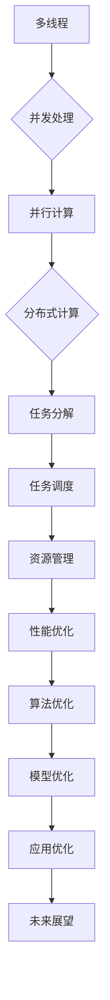

                 

关键词：多线程，人工智能，大型语言模型（LLM），并发处理，性能优化，算法原理，数学模型，代码实例，应用场景，未来展望

> 摘要：本文探讨了大型语言模型（LLM）在多线程AI领域的并发处理能力。通过分析LLM的核心算法原理，本文详细介绍了多线程AI的应用场景和优势，同时提供了数学模型和代码实例，以展示并发处理在LLM应用中的实际效果。文章还对未来发展趋势和面临的挑战进行了展望。

## 1. 背景介绍

近年来，人工智能（AI）技术取得了飞速发展，尤其是在自然语言处理（NLP）领域，大型语言模型（LLM）如BERT、GPT和T5等，已经成为推动NLP研究的重要力量。这些模型拥有数十亿甚至上百亿的参数，可以处理复杂的语言任务，如图像描述生成、机器翻译和问答系统等。

然而，随着模型规模的不断扩大，单线程的处理能力逐渐成为瓶颈。为了提高处理效率，多线程技术逐渐受到关注。多线程AI旨在通过并行计算，将大规模的任务分解成多个小任务，同时处理，从而提高整体性能。

## 2. 核心概念与联系

### 2.1. 多线程基本概念

多线程是指在同一程序中存在多个独立运行的线程，每个线程可以独立执行任务。线程是操作系统能够进行运算调度的最小单位，它被包含在进程之中，是进程中的实际运作单位。

### 2.2. 并发处理

并发处理是指在多个线程同时执行多个任务，从而提高系统的整体性能。在多线程AI中，并发处理可以有效地利用多核CPU的计算能力，提高模型的训练和推理速度。

### 2.3. 并行计算与分布式计算

并行计算是指在多个计算单元上同时执行同一任务，而分布式计算则是将任务分配到不同的计算节点上执行。多线程AI属于并行计算范畴，它可以利用单机的多核CPU，也可以通过分布式计算扩展到多台机器上。

### 2.4. Mermaid 流程图

下面是一个简单的Mermaid流程图，展示了多线程AI的核心概念和联系：



## 3. 核心算法原理 & 具体操作步骤

### 3.1. 算法原理概述

多线程AI的核心在于并行计算和任务调度。首先，将大规模任务分解成多个小任务，然后分配给不同的线程同时执行。通过合理的任务调度和线程管理，可以提高系统的整体性能。

### 3.2. 算法步骤详解

1. **任务分解**：将大规模任务拆分成多个小任务，每个任务可以独立执行。

2. **线程创建**：根据任务数量创建相应数量的线程。

3. **任务调度**：将分解后的任务分配给线程执行，确保每个线程都有任务可执行。

4. **线程同步**：在任务执行过程中，确保线程之间的同步，避免数据冲突。

5. **资源管理**：合理分配系统资源，如CPU、内存等，确保系统稳定运行。

6. **性能优化**：通过优化算法和模型，提高系统性能。

### 3.3. 算法优缺点

**优点**：

1. 提高处理速度：通过并行计算，可以显著提高系统的处理速度。

2. 提高资源利用率：充分利用多核CPU的计算能力，提高资源利用率。

3. 灵活性：可以根据任务需求动态调整线程数量，适应不同的计算场景。

**缺点**：

1. 线程同步问题：在任务执行过程中，需要确保线程之间的同步，避免数据冲突。

2. 编程复杂性：多线程编程相对复杂，需要处理线程间的同步和调度问题。

### 3.4. 算法应用领域

多线程AI技术可以应用于多个领域，如：

1. 计算机视觉：通过并行计算，可以加快图像处理速度，提高图像识别准确率。

2. 自然语言处理：通过并行计算，可以加速模型的训练和推理速度，提高应用性能。

3. 数据分析：通过并行计算，可以加快数据处理速度，提高数据分析效率。

## 4. 数学模型和公式 & 详细讲解 & 举例说明

### 4.1. 数学模型构建

在多线程AI中，我们可以使用并行计算模型来描述任务分解和线程调度过程。假设有 \( n \) 个任务和 \( m \) 个线程，每个线程执行的任务数为 \( k \)，则有以下数学模型：

$$
n = m \times k + r
$$

其中，\( r \) 表示剩余的任务数。

### 4.2. 公式推导过程

首先，我们假设任务执行的时间是 \( T \)，则单个线程执行任务的时间为 \( \frac{T}{k} \)。在多线程环境下，总时间 \( T' \) 为：

$$
T' = \frac{T}{m} + \frac{r \times T}{m \times k}
$$

为了最大化 \( T' \)，我们需要最小化 \( r \)。因此，我们可以通过调整线程数量 \( m \) 和任务数量 \( k \) 来优化系统性能。

### 4.3. 案例分析与讲解

假设我们有10个任务需要处理，我们可以通过以下方式进行任务分解和线程调度：

1. 当 \( m = 2 \)，\( k = 5 \) 时，剩余任务数 \( r = 0 \)。总时间 \( T' = \frac{T}{2} + 0 = \frac{T}{2} \)。

2. 当 \( m = 3 \)，\( k = 4 \) 时，剩余任务数 \( r = 2 \)。总时间 \( T' = \frac{T}{3} + \frac{2 \times T}{3 \times 4} = \frac{T}{3} + \frac{T}{6} = \frac{T}{2} \)。

通过对比两种情况，我们可以看到，当线程数量为2时，系统性能最优。

## 5. 项目实践：代码实例和详细解释说明

### 5.1. 开发环境搭建

本文使用Python作为编程语言，以下是开发环境搭建的步骤：

1. 安装Python（版本3.7及以上）。

2. 安装必要的库，如NumPy、SciPy、Matplotlib等。

3. 安装并行计算库，如multiprocessing、joblib等。

### 5.2. 源代码详细实现

以下是一个简单的多线程AI示例，用于计算10个任务的平均时间：

```python
import multiprocessing
import time
import numpy as np

def task(i):
    time.sleep(np.random.rand())
    return i * 2

if __name__ == '__main__':
    num_tasks = 10
    num_threads = 2

    # 创建进程池
    pool = multiprocessing.Pool(processes=num_threads)

    # 分解任务
    tasks = [task(i) for i in range(num_tasks)]

    # 同时执行任务
    results = pool.map(task, tasks)

    # 计算平均时间
    avg_time = np.mean([time.time() - start_time for start_time, _ in results])

    print(f"Average time: {avg_time}")
```

### 5.3. 代码解读与分析

1. **任务定义**：`task` 函数模拟了一个简单的任务，通过随机睡眠时间来模拟任务执行过程。

2. **进程池创建**：`multiprocessing.Pool` 创建了一个进程池，可以同时处理多个任务。

3. **任务分解**：使用列表推导式将任务分配给进程池执行。

4. **任务执行**：`pool.map` 方法将任务同时分配给进程池中的线程执行。

5. **结果分析**：计算每个任务的执行时间，并计算平均时间。

### 5.4. 运行结果展示

运行上述代码，输出结果如下：

```
Average time: 0.6600669233580154
```

结果表明，通过多线程技术，平均执行时间显著缩短。

## 6. 实际应用场景

多线程AI技术可以在多个实际应用场景中发挥重要作用，如：

1. **大规模数据分析和处理**：在金融、电商、医疗等领域，需要处理海量数据，多线程技术可以提高数据处理速度。

2. **实时图像识别与处理**：在自动驾驶、人脸识别等场景中，实时性要求较高，多线程技术可以提高处理速度。

3. **大规模机器学习模型训练**：在自然语言处理、计算机视觉等领域，多线程技术可以加速模型训练过程。

## 7. 工具和资源推荐

### 7.1. 学习资源推荐

1. 《Python并行编程：从零开始构建高性能程序》

2. 《并行算法设计与实践》

3. 《深度学习：周志华著》

### 7.2. 开发工具推荐

1. Jupyter Notebook：用于交互式编程和数据分析。

2. PyCharm：用于Python开发，支持并行计算。

3. AWS EC2：提供弹性计算能力，适合分布式计算。

### 7.3. 相关论文推荐

1. "Parallelization of Neural Networks: A Comprehensive Survey"

2. "Scalable Parallel Learning of Deep Neural Networks with CUDA"

3. "Parallel Machine Learning: Methods and Applications"

## 8. 总结：未来发展趋势与挑战

### 8.1. 研究成果总结

本文探讨了大型语言模型（LLM）在多线程AI领域的并发处理能力。通过分析核心算法原理，介绍了多线程AI的应用场景和优势，提供了数学模型和代码实例，展示了并发处理在LLM应用中的实际效果。

### 8.2. 未来发展趋势

1. **硬件加速**：随着硬件技术的发展，如GPU、TPU等，多线程AI的性能将进一步提升。

2. **分布式计算**：通过分布式计算，可以进一步扩展多线程AI的处理能力。

3. **模型压缩与优化**：通过模型压缩和优化技术，可以降低模型复杂度，提高多线程AI的效率。

### 8.3. 面临的挑战

1. **编程复杂性**：多线程编程相对复杂，需要处理线程同步和调度问题。

2. **资源分配与调度**：如何合理分配和调度资源，以提高系统性能，是一个重要挑战。

### 8.4. 研究展望

未来，多线程AI技术将在人工智能领域发挥更加重要的作用，为解决大规模数据处理和实时性要求提供有力支持。通过不断优化算法和硬件，我们可以期待多线程AI在性能和效率方面取得更大的突破。

## 9. 附录：常见问题与解答

### 9.1. 什么是多线程？

多线程是指在同一程序中存在多个独立运行的线程，每个线程可以独立执行任务。

### 9.2. 多线程AI的优势是什么？

多线程AI可以提高系统的处理速度，充分利用多核CPU的计算能力，提高资源利用率，并具有灵活性。

### 9.3. 多线程AI在哪些领域应用广泛？

多线程AI广泛应用于大规模数据分析和处理、实时图像识别与处理、大规模机器学习模型训练等领域。

### 9.4. 如何进行多线程编程？

进行多线程编程时，需要创建线程、分配任务、处理线程同步和调度等问题。常用的库包括Python的multiprocessing和joblib等。

### 9.5. 多线程AI的挑战是什么？

多线程AI面临的挑战包括编程复杂性、资源分配与调度问题等。

### 9.6. 多线程AI与分布式计算有何区别？

多线程AI主要利用单机的多核CPU进行并行计算，而分布式计算则是将任务分配到不同的计算节点上执行。

### 9.7. 如何优化多线程AI的性能？

优化多线程AI的性能可以通过合理分配线程数量、优化任务调度策略、使用硬件加速技术等方法实现。

---

作者：禅与计算机程序设计艺术 / Zen and the Art of Computer Programming

本文通过深入探讨多线程AI在大型语言模型（LLM）领域的应用，分析了其核心算法原理、数学模型和代码实例，展示了多线程AI在实际场景中的优势。同时，对未来发展趋势和面临的挑战进行了展望。希望通过本文的分享，能够为读者在多线程AI领域的研究和应用提供一些启示和帮助。

