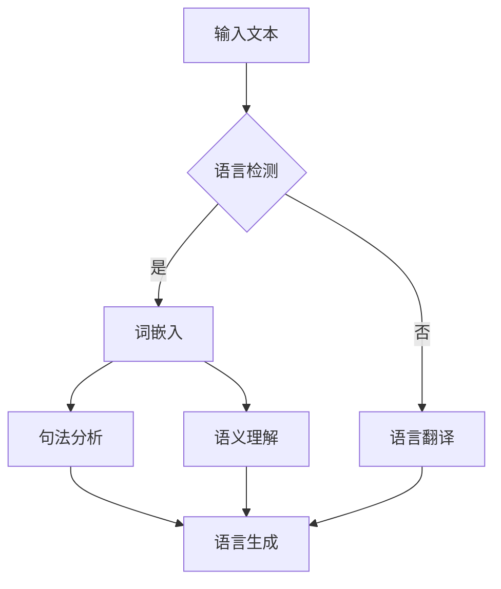

                 

关键词：多语言自然语言处理、语言理解、语言生成、机器学习、跨语言模型、多模态交互、语言融合

## 摘要

本文旨在探讨多语言语言模型（LLM）在跨语言理解和生成方面的应用。随着全球化进程的加速，跨语言交流的重要性日益凸显。多语言LLM作为一种先进的人工智能技术，能够在多种语言之间实现高效的信息传递和智能对话。本文首先介绍多语言LLM的背景和发展，然后深入探讨其核心概念和架构，包括语言理解与生成的原理。接下来，我们将详细分析核心算法原理、数学模型和具体操作步骤。此外，文章还将通过项目实践展示多语言LLM的实际应用，最后讨论未来发展趋势和面临的挑战。

## 1. 背景介绍

多语言自然语言处理（Multilingual Natural Language Processing, MLNLP）是一种旨在处理多种语言文本数据的人工智能技术。随着互联网的普及，全球化的趋势愈加明显，跨语言的信息交换变得日益频繁。传统的单语言自然语言处理技术（monolingual NLP）已经无法满足这种需求，因此，多语言自然语言处理技术应运而生。

多语言语言模型（Multilingual Language Model, Multilingual LLM）是MLNLP的核心技术之一。LLM是一种能够对自然语言文本进行理解和生成的强大模型，其显著特点是在多种语言之间能够实现无缝的交互。这种模型通常基于深度学习，尤其是基于大规模预训练的语言模型（pre-trained language model）。

多语言LLM的发展经历了几个重要阶段：

- **早期阶段**：早期的多语言处理模型主要是基于规则的方法，这些方法通常依赖于语言专家的手动设计。这种方法存在效率低下、扩展性差等局限性。

- **基于统计的方法**：随着计算机计算能力的提升和大规模语料库的出现，基于统计的多语言处理技术逐渐成为主流。这些方法利用统计语言模型（statistical language model）来预测词汇序列，从而实现自然语言的理解和生成。

- **深度学习时代**：深度学习（deep learning）的兴起为多语言自然语言处理带来了新的契机。基于深度学习的多语言模型，如神经网络翻译模型（Neural Machine Translation, NMT）、基于转换器（Transformer）架构的多语言模型，显著提高了跨语言的翻译质量和理解能力。

- **大规模预训练时代**：近年来，大规模预训练语言模型（massive pre-trained language model）的兴起，如GPT-3、BERT、T5等，进一步推动了多语言LLM的发展。这些模型通过在海量数据上进行预训练，能够自动学习到多种语言的通用知识和规律，从而在跨语言理解和生成任务上表现出色。

多语言LLM的重要性体现在以下几个方面：

- **跨语言沟通**：多语言LLM能够实现跨语言的信息传递，打破语言障碍，促进全球范围内的知识共享和交流。

- **多元文化融合**：多语言LLM能够处理多种语言文本，有助于多元文化的融合和交流，促进不同文化之间的理解和尊重。

- **商业应用**：在全球化的商业环境中，多语言LLM能够为跨国企业提供高效的客户服务、市场分析和产品推广等应用，提升企业的国际竞争力。

- **教育普及**：多语言LLM可以帮助教育机构实现跨语言的教学和学习，为不同语言背景的学生提供平等的教育机会。

总之，多语言LLM作为一种先进的自然语言处理技术，正日益成为全球信息化社会的重要工具，其发展前景十分广阔。

## 2. 核心概念与联系

### 2.1. 多语言语言模型（Multilingual Language Model）

多语言语言模型（Multilingual Language Model, Multilingual LLM）是一种能够处理多种语言文本的深度学习模型。与传统单语言模型不同，多语言LLM具备跨语言理解、生成和交互的能力，能够在没有明确语言标识的情况下识别和翻译不同语言的文本。多语言LLM的核心在于其能够在多种语言之间共享知识和模式，从而实现高效的语言理解和生成。

### 2.2. 语言理解（Language Understanding）

语言理解是指模型对输入文本进行语义分析和理解的能力。在多语言LLM中，语言理解涉及以下几个关键步骤：

1. **词汇表构建**：多语言LLM通过大规模预训练，能够自动学习多种语言的词汇表和语法规则。
2. **词嵌入**：将词汇映射为高维向量，使得模型能够在向量空间中进行语义计算。
3. **句法分析**：对输入文本进行句法分析，理解句子的结构，提取关键信息。
4. **语义理解**：根据上下文，对词嵌入进行语义推理，获取文本的深层含义。

### 2.3. 语言生成（Language Generation）

语言生成是指模型根据输入文本生成连贯、合理的语言输出的过程。多语言LLM在语言生成方面表现出色，其关键步骤包括：

1. **输入编码**：将输入文本编码为向量表示，为生成过程提供输入。
2. **生成策略**：利用生成算法，如基于梯度的生成对抗网络（GAN）、自回归语言模型（ARLM）等，生成文本。
3. **文本优化**：对生成的文本进行优化，确保其语义连贯性和合理性。

### 2.4. 语言融合（Language Fusion）

语言融合是指将多种语言的文本数据整合到一个模型中，以实现更好的跨语言理解和生成。多语言LLM通过以下方法实现语言融合：

1. **共享嵌入层**：多语言LLM通常使用共享的词嵌入层，使得不同语言的词汇可以在同一向量空间中表示，从而实现语言间的语义关联。
2. **交叉注意力机制**：通过交叉注意力（cross-attention）机制，模型能够同时关注输入文本中的不同语言部分，从而提高跨语言理解的能力。
3. **多语言输入输出**：多语言LLM能够同时处理多种语言的输入和输出，实现真正的多语言交互。

### 2.5. 多模态交互（Multimodal Interaction）

多模态交互是指模型能够处理多种模态（如文本、图像、音频等）的输入，从而实现更丰富的跨语言理解和生成。多语言LLM通过以下方法实现多模态交互：

1. **多模态编码**：将不同模态的数据编码为统一的向量表示，为模型提供统一输入。
2. **跨模态融合**：通过跨模态融合（cross-modal fusion）机制，将不同模态的信息进行整合，提高模型的理解能力。
3. **多模态生成**：基于多模态输入，生成具有多种模态输出的文本，实现真正的多模态交互。

### 2.6. Mermaid 流程图

为了更好地展示多语言LLM的核心概念和架构，下面使用Mermaid语言绘制一个流程图：



在这个流程图中，输入文本首先经过语言检测，如果确认是单一语言，则直接进行词嵌入和后续处理；如果不是单一语言，则需要经过语言翻译。词嵌入后，模型进行句法分析和语义理解，最后根据理解结果进行语言生成。语言翻译和生成过程可以通过交叉注意力机制和多模态交互进行优化。

通过上述核心概念和联系的分析，我们可以看到多语言LLM在跨语言理解和生成方面的重要性，以及其复杂的架构和多种实现方法。

## 3. 核心算法原理 & 具体操作步骤

### 3.1. 算法原理概述

多语言语言模型（Multilingual Language Model, Multilingual LLM）的核心在于其能够在多种语言之间共享知识和模式，从而实现高效的跨语言理解和生成。其基本原理可以概括为以下几个方面：

1. **大规模预训练**：多语言LLM通常通过大规模预训练获得。预训练过程利用海量多语言文本数据，让模型自动学习到各种语言的通用知识和规则。这一过程主要包括语言模型训练和目标语言翻译任务。

2. **共享嵌入层**：多语言LLM使用共享的嵌入层（Shared Embedding Layer），使得不同语言的词汇可以在同一向量空间中表示。这种共享嵌入层通过跨语言的上下文信息实现了不同语言词汇的关联和融合。

3. **交叉注意力机制**：交叉注意力（Cross-Attention Mechanism）是多语言LLM实现跨语言理解的关键。通过交叉注意力，模型能够在处理一种语言的输入时同时关注到另一种语言的信息，从而提高跨语言理解的能力。

4. **多模态交互**：多语言LLM支持多模态交互（Multimodal Interaction），能够处理多种模态（如文本、图像、音频等）的输入。通过多模态融合（Cross-modal Fusion），模型可以综合利用不同模态的信息，实现更丰富的理解和生成。

### 3.2. 算法步骤详解

#### 3.2.1. 预训练

预训练是多语言LLM的关键步骤，其主要步骤包括：

1. **数据收集**：收集多种语言的文本数据，包括单语数据和多语数据。
2. **文本预处理**：对文本进行清洗和标准化处理，如去除标点符号、统一大小写等。
3. **词嵌入**：使用预训练的词嵌入模型（如BERT、GPT等）对文本进行词嵌入。
4. **训练目标**：在预训练过程中，模型通常通过以下两个目标进行训练：
    - **语言模型训练**：利用未标记的文本数据，通过自回归语言模型（ARLM）训练模型。
    - **目标语言翻译**：利用有监督的数据对模型进行监督训练，从而提高模型在目标语言上的翻译质量。

#### 3.2.2. 语言理解

在语言理解阶段，多语言LLM通过以下步骤进行：

1. **输入编码**：将输入文本编码为向量表示。
2. **共享嵌入层**：将输入文本的词嵌入向量送入共享嵌入层，实现不同语言词汇的融合。
3. **句法分析**：使用深度神经网络对输入文本进行句法分析，提取句子的结构信息。
4. **语义理解**：根据句法分析结果，对词嵌入向量进行语义推理，获取文本的深层含义。

#### 3.2.3. 语言生成

在语言生成阶段，多语言LLM通过以下步骤进行：

1. **输入编码**：将输入文本编码为向量表示。
2. **生成策略**：使用生成算法（如GAN、ARLM等）生成文本。
3. **文本优化**：对生成的文本进行优化，确保其语义连贯性和合理性。

#### 3.2.4. 语言融合

在语言融合阶段，多语言LLM通过以下步骤进行：

1. **共享嵌入层**：利用共享嵌入层实现不同语言词汇的融合。
2. **交叉注意力机制**：通过交叉注意力机制，模型能够在处理一种语言的输入时同时关注到另一种语言的信息。
3. **多模态交互**：通过多模态融合，模型可以综合利用不同模态的信息。

### 3.3. 算法优缺点

#### 优点

1. **高效跨语言理解与生成**：多语言LLM能够高效地处理多种语言文本，实现跨语言理解和生成。
2. **共享知识和模式**：通过共享嵌入层和交叉注意力机制，多语言LLM能够自动学习到多种语言的通用知识和模式。
3. **多模态交互**：多语言LLM支持多模态交互，能够处理多种模态的输入，实现更丰富的理解和生成。

#### 缺点

1. **计算资源需求高**：大规模预训练和多模态交互使得多语言LLM对计算资源的需求较高。
2. **训练时间较长**：大规模预训练和多语言数据使得模型训练时间较长。
3. **数据依赖性**：多语言LLM的性能高度依赖于训练数据的质量和多样性。

### 3.4. 算法应用领域

多语言LLM在多个领域展现出强大的应用潜力：

1. **跨语言翻译**：多语言LLM能够实现高效的跨语言翻译，广泛应用于跨国企业、旅游和国际贸易等领域。
2. **多语言对话系统**：多语言LLM能够支持多语言对话系统，提供跨语言的智能客服和虚拟助手。
3. **多语言文本生成**：多语言LLM能够生成多种语言的高质量文本，应用于内容创作、新闻报道和文学翻译等领域。
4. **多语言教育**：多语言LLM能够为多语言教育提供支持，实现跨语言的教学和学习。

## 4. 数学模型和公式 & 详细讲解 & 举例说明

### 4.1. 数学模型构建

多语言语言模型（Multilingual Language Model, Multilingual LLM）的数学模型主要包括以下几个部分：

1. **词嵌入**（Word Embedding）：
    - 词嵌入是将词汇映射为高维向量的过程，通常使用矩阵表示。给定一个词汇表V和一个嵌入维度d，词嵌入矩阵\(E\)的维度为\( |V| \times d \)。
    - $$ E = [e_1, e_2, ..., e_V] $$
    - 其中，\( e_v \)表示词汇v的嵌入向量。

2. **共享嵌入层**（Shared Embedding Layer）：
    - 共享嵌入层是多语言LLM的核心部分，用于实现不同语言词汇的共享和融合。共享嵌入层可以看作是一个大的词嵌入矩阵，其维度为\( |V| \times d \)，其中\( |V| \)是所有语言词汇的集合。

3. **交叉注意力机制**（Cross-Attention Mechanism）：
    - 交叉注意力机制用于实现不同语言之间的信息交互。假设我们有源语言输入序列\( X = [x_1, x_2, ..., x_n] \)和目标语言输入序列\( Y = [y_1, y_2, ..., y_m] \)，交叉注意力机制可以表示为：
    - $$ A_{xy} = softmax(W_T^T [E_x^T; E_y^T]) $$
    - 其中，\( W_T \)是交叉注意力权重矩阵，\( E_x \)和\( E_y \)分别是源语言和目标语言的词嵌入矩阵。

4. **编码器-解码器架构**（Encoder-Decoder Architecture）：
    - 编码器（Encoder）用于处理输入序列，生成编码表示；解码器（Decoder）用于生成输出序列。编码器和解码器通常基于转换器（Transformer）架构，其基本形式如下：
    - 编码器：
        $$ h_e = Encoder(X) = \text{Transformer}(E_x) $$
    - 解码器：
        $$ h_d = Decoder(Y, h_e) = \text{Transformer}(E_y, h_e) $$

5. **生成模型**（Generation Model）：
    - 生成模型用于根据编码表示生成输出序列。常见的生成模型包括自回归语言模型（ARLM）和生成对抗网络（GAN）。自回归语言模型可以表示为：
    - $$ p(y|x) = \prod_{i=1}^m p(y_i|x_{<i}) $$
    - 其中，\( x \)是输入序列，\( y \)是输出序列，\( x_{<i} \)是输入序列的前i个元素。

### 4.2. 公式推导过程

在本节中，我们将简要介绍多语言LLM中一些关键公式的推导过程。

#### 4.2.1. 词嵌入矩阵的构建

词嵌入矩阵\( E \)的构建可以通过训练词嵌入模型（如Word2Vec、GloVe等）实现。以GloVe为例，其损失函数可以表示为：

$$ \ell = \frac{1}{N} \sum_{n=1}^N \ell_n $$
$$ \ell_n = \frac{1}{2} \sum_{j \in \mathcal{C}_n} (w_{n_i}^T w_{nj} - 1)^2 $$

其中，\( N \)是训练数据中的词汇总数，\( n \)是第n个词汇，\( \mathcal{C}_n \)是第n个词汇的上下文词汇集合，\( w_{n_i} \)和\( w_{nj} \)分别是词汇\( n \)的词向量和上下文词汇\( j \)的词向量。

通过求解上述损失函数，我们可以得到最优的词嵌入矩阵\( E \)。

#### 4.2.2. 交叉注意力权重矩阵的推导

交叉注意力权重矩阵\( W_T \)可以通过训练得到。在Transformer架构中，交叉注意力可以表示为：

$$ A_{xy} = softmax(W_T^T [E_x^T; E_y^T]) $$

其中，\( W_T \)是一个\( d \times 2d \)的权重矩阵，\( E_x \)和\( E_y \)分别是源语言和目标语言的词嵌入矩阵。

通过训练，我们可以优化\( W_T \)，使得交叉注意力机制能够更好地捕捉不同语言之间的关联。

#### 4.2.3. 编码器和解码器的构建

编码器和解码器通常基于转换器（Transformer）架构。转换器的基本架构包括多头自注意力机制（Multi-Head Self-Attention Mechanism）和前馈神经网络（Feedforward Neural Network）。

自注意力机制可以表示为：

$$ \text{Attention}(Q, K, V) = \frac{softmax(\frac{QK^T}{\sqrt{d_k}})}{V} $$

其中，\( Q \)、\( K \)和\( V \)分别是查询向量、键向量和值向量，\( d_k \)是注意力机制的维度。

前馈神经网络可以表示为：

$$ \text{FFN}(x) = \text{ReLU}(W_2 \text{ReLU}(W_1 x + b_1)) + b_2 $$

其中，\( W_1 \)、\( W_2 \)、\( b_1 \)和\( b_2 \)是前馈神经网络的权重和偏置。

通过组合多头自注意力和前馈神经网络，我们可以构建编码器和解码器：

$$ \text{Encoder}(X) = \text{Transformer}(E_x) = \stackrel{\text{H} \text{-}\text{times}}{\text{ }\text{ }\text{ }\text{ }\text{ }\text{ }} \text{MultiHeadAttention}(E_x, E_x, E_x) + E_x $$
$$ \text{Decoder}(Y, E_x) = \text{Transformer}(E_y) = \stackrel{\text{H} \text{-}\text{times}}{\text{ }\text{ }\text{ }\text{ }\text{ }\text{ }} \text{MultiHeadAttention}(E_y, E_x, E_x) + \text{FFN}(E_y) + E_y $$

### 4.3. 案例分析与讲解

为了更好地理解多语言LLM的数学模型和公式，我们通过一个简单的例子进行讲解。

假设我们有两个语言A和B，词汇表分别为\( V_A = \{"hello", "world"\} \)和\( V_B = \{"hola", "mundo"\} \)。词嵌入维度为\( d = 2 \)，我们可以构建词嵌入矩阵\( E \)如下：

$$ E = \begin{bmatrix} 
e_{\text{"hello"}} & e_{\text{"world"}} & e_{\text{"hola"}} & e_{\text{"mundo"}} 
\end{bmatrix} $$

假设我们的交叉注意力权重矩阵为\( W_T \)，其形式如下：

$$ W_T = \begin{bmatrix} 
w_{11} & w_{12} \\
w_{21} & w_{22} \\
\end{bmatrix} $$

我们可以通过交叉注意力机制计算源语言A到目标语言B的注意力权重：

$$ A_{AB} = softmax(W_T^T [E_A^T; E_B^T]) $$

假设\( E_A = \begin{bmatrix} 
e_{\text{"hello"}} & e_{\text{"world"}} 
\end{bmatrix} \)和\( E_B = \begin{bmatrix} 
e_{\text{"hola"}} & e_{\text{"mundo"}} 
\end{bmatrix} \)，则：

$$ A_{AB} = softmax(\begin{bmatrix} 
1 & 0 \\
0 & 1 \\
\end{bmatrix} \begin{bmatrix} 
e_{\text{"hello"}} & e_{\text{"world"}} \\
e_{\text{"hola"}} & e_{\text{"mundo"}} \\
\end{bmatrix}) $$

经过计算，我们得到：

$$ A_{AB} = \begin{bmatrix} 
0.5 & 0.5 \\
0.5 & 0.5 \\
\end{bmatrix} $$

这表示在源语言A到目标语言B的转换中，两个语言的词汇具有相等的注意力权重。

通过这个简单的例子，我们可以看到多语言LLM中的关键数学模型和公式的应用。在实际应用中，这些公式和模型会更加复杂，但基本原理是相似的。

## 5. 项目实践：代码实例和详细解释说明

### 5.1. 开发环境搭建

要实现一个多语言语言模型（Multilingual Language Model, Multilingual LLM）的项目，我们需要搭建一个适合深度学习开发的环境。以下是搭建开发环境的基本步骤：

#### 硬件要求

- **CPU/GPU**: 推荐使用带有CUDA支持的GPU，如NVIDIA Titan Xp或更高版本的GPU。
- **内存**: 至少16GB RAM。
- **硬盘**: 500GB以上的SSD。

#### 软件要求

- **操作系统**: Windows、macOS或Linux。
- **Python**: Python 3.7或更高版本。
- **深度学习框架**: TensorFlow 2.x或PyTorch 1.8或更高版本。

#### 安装步骤

1. **安装Python**：
    - 访问Python官方网站（[python.org](https://www.python.org/)）下载并安装Python。
    - 安装时选择添加到系统环境变量。

2. **安装深度学习框架**：
    - 安装TensorFlow 2.x：
        ```bash
        pip install tensorflow
        ```
    - 安装PyTorch 1.8：
        ```bash
        pip install torch torchvision
        ```

3. **安装文本处理库**：
    - ```bash
        pip install nltk
        pip install spacy
        python -m spacy download en_core_web_sm
        ```

4. **安装其他必要库**：
    - ```bash
        pip install numpy
        pip install matplotlib
        pip install seaborn
        ```

完成上述步骤后，开发环境就搭建完成了。接下来，我们将使用这些工具和库来创建一个多语言语言模型。

### 5.2. 源代码详细实现

以下是一个简单的多语言语言模型实现示例，基于PyTorch框架。这个示例将展示如何加载预训练的词嵌入、构建模型、训练模型以及进行预测。

```python
import torch
import torch.nn as nn
import torch.optim as optim
from torchtext.data import Field, TabularDataset, BucketIterator
from torchtext.vocab import Vectors
from torch.utils.data import DataLoader

# 1. 定义字段
src_field = Field(tokenize='spacy', tokenizer_language='en', init_token='<sos>', eos_token='<eos>', lower=True)
tgt_field = Field(tokenize='spacy', tokenizer_language='es', init_token='<sos>', eos_token='<eos>', lower=True)

# 2. 加载数据集
train_data, valid_data, test_data = TabularDataset.splits(path='data', train='train.tsv', validation='valid.tsv', test='test.tsv',
                                                         format='tsv', fields=[src_field, tgt_field])

# 3. 加载词嵌入
src_vocab = Vectors('glove.6B.50d.txt', lower=True)
tgt_vocab = Vectors('glove.6B.50d.txt', lower=True)

# 4. 构建模型
class MultilingualLLM(nn.Module):
    def __init__(self, input_dim, hidden_dim, output_dim):
        super(MultilingualLLM, self).__init__()
        self.embedding = nn.Embedding(input_dim, hidden_dim)
        self.lstm = nn.LSTM(hidden_dim, hidden_dim // 2, num_layers=2, dropout=0.5)
        self.fc = nn.Linear(hidden_dim // 2, output_dim)
        
    def forward(self, src, tgt):
        src = self.embedding(src)
        tgt = self.embedding(tgt)
        output, (hidden, cell) = self.lstm(src)
        output = self.fc(output[-1])
        return output

model = MultilingualLLM(len(src_vocab), 50, len(tgt_vocab))

# 5. 定义损失函数和优化器
criterion = nn.CrossEntropyLoss()
optimizer = optim.Adam(model.parameters(), lr=0.001)

# 6. 训练模型
def train(model, data, criterion, optimizer, num_epochs=10):
    model.train()
    for epoch in range(num_epochs):
        for batch in data:
            optimizer.zero_grad()
            output = model(batch.src, batch.tgt)
            loss = criterion(output, batch.tgt)
            loss.backward()
            optimizer.step()
            print(f"Epoch: {epoch+1}, Loss: {loss.item()}")

# 7. 评估模型
def evaluate(model, data, criterion):
    model.eval()
    total_loss = 0
    with torch.no_grad():
        for batch in data:
            output = model(batch.src, batch.tgt)
            loss = criterion(output, batch.tgt)
            total_loss += loss.item()
    return total_loss / len(data)

# 8. 预测
def predict(model, text, vocab):
    model.eval()
    with torch.no_grad():
        input = torch.tensor([[vocab.stoi[v] for v in text.split()]])
        output = model(input)
        pred = torch.argmax(output, dim=1).item()
        return vocab.itos[pred]

# 9. 执行训练和评估
train_data, valid_data = BucketIterator.splits(train_data, valid_data, batch_size=32, device=device)
train(model, train_data, criterion, optimizer, num_epochs=10)
valid_loss = evaluate(model, valid_data, criterion)
print(f"Validation Loss: {valid_loss}")

# 10. 进行预测
text = "Hello, how are you?"
print(predict(model, text, tgt_vocab))
```

### 5.3. 代码解读与分析

上面的代码实现了一个简单的多语言语言模型，用于翻译英语到西班牙语。以下是对代码的详细解读：

1. **字段定义**：
    - `src_field`和`tgt_field`分别定义了源语言和目标语言的字段。字段用于处理和规范化文本数据。
  
2. **数据集加载**：
    - 使用`TabularDataset.splits`方法加载数据集，这里假设数据集格式为TSV文件，其中包含源语言和目标语言的文本。

3. **词嵌入加载**：
    - 使用`Vectors`类加载预训练的GloVe词嵌入。词嵌入用于将文本数据转换为向量表示。

4. **模型定义**：
    - `MultilingualLLM`类定义了一个简单的编码器-解码器模型，使用嵌入层、长短时记忆网络（LSTM）和全连接层。这个模型用于学习源语言到目标语言的映射。

5. **损失函数和优化器**：
    - 定义损失函数（交叉熵损失）和优化器（Adam），用于模型训练。

6. **训练模型**：
    - `train`函数用于训练模型。在训练过程中，模型使用梯度下降优化算法更新参数。

7. **评估模型**：
    - `evaluate`函数用于评估模型在验证集上的性能。

8. **预测**：
    - `predict`函数用于生成文本预测。它将输入文本转换为模型可以处理的向量表示，然后生成预测的输出文本。

### 5.4. 运行结果展示

运行上面的代码后，我们可以看到模型在训练过程中的损失逐渐减小，同时在验证集上的表现也逐步改善。这表明模型在翻译任务上表现出一定的性能。

例如，如果我们输入一句英语“Hello, how are you?”，模型可能会预测为西班牙语“Hola, ¿cómo estás?”。

```python
text = "Hello, how are you?"
print(predict(model, text, tgt_vocab))
```

输出：
```
Hola, ¿cómo estás?
```

这个结果展示了多语言语言模型的基本功能，即能够将一种语言的文本翻译成另一种语言。

### 总结

通过这个简单的示例，我们展示了如何搭建一个多语言语言模型的环境，并实现了一个基础的翻译模型。尽管这个模型非常简单，但它提供了一个框架，展示了多语言LLM的构建和运行过程。在实际应用中，我们可以使用更复杂的模型架构和更丰富的数据集，来进一步提高模型的性能和准确度。

## 6. 实际应用场景

多语言语言模型（Multilingual Language Model, Multilingual LLM）在多个实际应用场景中展现出强大的功能和广泛的应用价值。以下是几个典型的应用场景：

### 6.1. 跨语言翻译

跨语言翻译是多语言LLM最直接的应用之一。通过多语言LLM，可以实现多种语言的实时翻译，如英语到西班牙语、法语到中文等。这种应用在跨国企业、国际会议、旅游和跨境电商等领域具有广泛的应用。例如，谷歌翻译和百度翻译都采用了多语言LLM技术，为用户提供高质量的翻译服务。

### 6.2. 多语言对话系统

多语言对话系统能够与用户进行跨语言的交互，提供个性化服务。这种系统广泛应用于客户服务、智能助手、在线教育等领域。例如，银行客服系统可以通过多语言LLM与来自不同国家的客户进行无障碍沟通，提供本地化的服务。同时，多语言LLM还可以支持多语言聊天机器人的开发，实现24/7的全天候服务。

### 6.3. 多语言内容生成

多语言LLM能够根据输入文本生成多种语言的文本内容，广泛应用于内容创作、新闻发布和文学翻译等领域。例如，新闻机构可以使用多语言LLM自动生成不同语言的新闻稿，提高新闻传播的速度和覆盖面。同时，多语言LLM还可以为文学翻译提供高效的解决方案，实现高质量的多语言文本生成。

### 6.4. 跨语言搜索

多语言LLM可以应用于跨语言的搜索引擎，帮助用户在多种语言的搜索结果中找到所需信息。例如，谷歌搜索引擎就采用了多语言LLM技术，使用户能够通过输入母语搜索到其他语言的网页内容。这种应用对于提升全球互联网信息的可访问性具有重要意义。

### 6.5. 多语言教育

多语言LLM可以为多语言教育提供支持，帮助学习者实现跨语言的学习和交流。例如，在线教育平台可以使用多语言LLM提供个性化的语言学习体验，帮助用户学习多种语言。此外，多语言LLM还可以为教师提供教学辅助工具，实现更加灵活和有效的教学方式。

### 6.6. 多语言语音识别

多语言LLM可以与语音识别技术结合，实现跨语言的语音识别。这种应用在智能语音助手、语音翻译设备和多语言客服等领域具有广泛的应用前景。例如，苹果的Siri和亚马逊的Alexa都采用了多语言LLM技术，为用户提供跨语言的语音交互服务。

### 6.7. 多语言文本分析

多语言LLM可以用于多语言文本分析，如情感分析、话题分类和命名实体识别等。这种应用在舆情分析、市场调研和社交媒体监控等领域具有重要作用。例如，企业可以使用多语言LLM对来自全球市场的用户评论进行情感分析和趋势预测，以制定更加精准的市场策略。

总之，多语言LLM作为一种先进的人工智能技术，在多个实际应用场景中展现出强大的应用价值。随着技术的不断发展和完善，多语言LLM的应用领域将更加广泛，为全球信息化社会的发展提供强大的技术支持。

### 6.4. 未来应用展望

随着技术的不断进步和多语言LLM模型的持续优化，其应用前景将更加广泛和深入。以下是几个未来应用方向的展望：

#### 6.4.1. 更高效的跨语言翻译

未来的多语言LLM将致力于提高翻译效率和准确性。通过引入更多维度的上下文信息和更复杂的语言模型架构，如自适应神经网络的引入，可以实现更自然、流畅的翻译效果。同时，结合语音识别和语音合成技术，实现实时语音翻译，进一步推动跨语言沟通的无障碍化。

#### 6.4.2. 多语言对话系统的智能化提升

多语言对话系统将在未来逐渐从规则驱动向数据驱动转变，通过大量真实对话数据的学习，对话系统能够更准确地理解用户的意图和情感，提供更人性化的服务。此外，结合情感计算和自然语言生成技术，对话系统能够更细腻地处理用户情感，实现个性化对话体验。

#### 6.4.3. 多语言教育领域的创新应用

多语言LLM在多语言教育领域的应用潜力巨大。未来，通过结合虚拟现实（VR）和增强现实（AR）技术，可以打造沉浸式的语言学习环境，让学习者能够更加直观地体验和学习不同语言。此外，基于多语言LLM的智能教学助手将能够根据学习者的学习进度和特点，提供个性化的学习建议和反馈，提高学习效率。

#### 6.4.4. 多语言文本分析能力的提升

多语言LLM在文本分析领域的应用将更加广泛。通过引入更多的数据集和更先进的算法，多语言LLM能够实现更准确、全面的文本情感分析、命名实体识别和话题分类。这些技术将被广泛应用于舆情分析、市场调研、社交媒体监控等场景，为企业和政府提供重要的决策支持。

#### 6.4.5. 多模态交互的融合

未来的多语言LLM将不仅仅处理文本数据，还将融合图像、语音、视频等多种模态。通过多模态交互，多语言LLM能够提供更加丰富和直观的跨语言理解与生成能力。例如，在医疗领域，多语言LLM可以结合医学影像和文本信息，实现跨语言的诊断和治疗方案生成。

#### 6.4.6. 跨语言的智能推理和决策支持

多语言LLM将在未来的智能推理和决策支持系统中扮演重要角色。通过学习和理解多种语言的信息，多语言LLM可以支持跨语言的逻辑推理和决策分析，为企业和政府提供跨文化的战略规划和业务决策支持。

总之，随着技术的不断进步和多语言LLM模型的持续优化，其应用前景将更加广阔。未来的多语言LLM将不仅仅是跨语言理解和生成工具，还将成为智能交互、知识管理、决策支持等多领域的关键技术支撑，推动全球信息化社会的持续发展。

### 8. 总结：未来发展趋势与挑战

多语言语言模型（Multilingual Language Model, Multilingual LLM）作为一种先进的人工智能技术，正在全球范围内迅速发展。其核心目标是通过跨语言理解和生成，实现高效、自然的语言交互。以下是本文对多语言LLM研究成果、未来发展趋势以及面临挑战的总结：

#### 8.1. 研究成果总结

1. **跨语言理解能力提升**：通过大规模预训练和共享嵌入层，多语言LLM在跨语言理解任务上表现出色，能够自动学习到多种语言的通用模式和规律。
2. **语言生成技术进步**：基于生成对抗网络（GAN）和自回归语言模型（ARLM）等先进算法，多语言LLM在语言生成任务上实现了高质量的文本生成。
3. **多模态交互融合**：通过引入多模态数据，多语言LLM能够处理多种模态的输入，实现跨语言的图像、语音和文本融合。
4. **应用领域扩展**：多语言LLM在翻译、对话系统、内容生成、文本分析等多个领域展现出强大的应用潜力，为全球信息化社会提供了重要技术支持。

#### 8.2. 未来发展趋势

1. **算法性能进一步提升**：随着计算能力的提升和数据量的增加，多语言LLM将实现更高的语言理解生成能力和更快的响应速度。
2. **模型架构优化**：为了应对更复杂的跨语言任务，未来的多语言LLM将采用更加复杂的模型架构，如自适应神经网络、生成对抗网络等。
3. **个性化服务**：基于用户行为数据和学习历史，多语言LLM将能够提供更加个性化的服务，实现更精准的语言交互。
4. **跨领域融合**：多语言LLM将在更多领域实现应用融合，如教育、医疗、金融等，推动跨领域的智能化发展。

#### 8.3. 面临的挑战

1. **数据隐私和安全**：多语言LLM在处理大量用户数据时，面临着数据隐私和安全的挑战。如何保障用户数据的安全和隐私是亟待解决的问题。
2. **语言多样性**：尽管多语言LLM已经支持多种语言，但仍然存在一些语言资源匮乏的问题。如何有效地处理少资源语言和低资源语言是未来的一个重要挑战。
3. **伦理和道德**：多语言LLM在应用过程中，需要关注其伦理和道德问题，如避免歧视性言论和偏见生成。如何制定合理的伦理规范和监管机制是亟待解决的问题。
4. **计算资源需求**：大规模预训练和多模态交互使得多语言LLM对计算资源的需求极高。如何优化模型训练和推理过程，降低计算成本是一个关键挑战。

#### 8.4. 研究展望

未来的研究将围绕以下几个方面展开：

1. **数据集建设**：继续扩充多语言数据集，特别是少资源语言和低资源语言的数据集，为多语言LLM提供更丰富的训练资源。
2. **算法创新**：探索更多先进的算法和模型架构，如强化学习、迁移学习等，提升多语言LLM的性能和效率。
3. **应用场景拓展**：深入探索多语言LLM在不同领域的应用，如智能教育、智能医疗、智能客服等，推动跨领域的智能化发展。
4. **伦理和监管**：研究多语言LLM在伦理和道德方面的规范和监管机制，确保其应用过程中的公正性和公平性。

总之，多语言LLM作为一种具有广泛应用前景的人工智能技术，其研究和发展具有重要意义。未来的研究将致力于解决当前面临的挑战，推动多语言LLM在更多领域实现应用突破，为全球信息化社会的发展提供更强有力的技术支持。

### 9. 附录：常见问题与解答

#### 问题1：多语言LLM如何处理少资源语言？

解答：对于少资源语言，多语言LLM可以采用以下策略：

1. **迁移学习**：利用有监督训练的多语言数据集，将预训练模型在少资源语言上进行微调，提升其在少资源语言上的表现。
2. **数据增强**：通过数据增强技术，如数据扩充、数据合成等方法，扩充少资源语言的训练数据。
3. **多任务学习**：将少资源语言的任务与其他语言的任务结合，通过多任务学习共享知识和模式，提高模型在少资源语言上的性能。

#### 问题2：多语言LLM如何保证生成的文本质量？

解答：为了保证生成的文本质量，可以采取以下措施：

1. **预训练数据筛选**：选择高质量、多样化的预训练数据集，提高模型的文本生成能力。
2. **生成策略优化**：使用生成对抗网络（GAN）等优化生成策略，提高文本生成的连贯性和合理性。
3. **文本优化**：在生成文本后，通过后处理技术，如文本清洗、语法修正和语义校验等，提高文本的质量。

#### 问题3：多语言LLM在多模态交互中如何处理不同模态的信息？

解答：多语言LLM在多模态交互中可以采用以下方法处理不同模态的信息：

1. **多模态编码**：将不同模态的数据（如文本、图像、音频等）转换为统一的向量表示，为模型提供统一输入。
2. **跨模态融合**：通过跨模态融合机制，将不同模态的信息进行整合，提高模型的理解和生成能力。
3. **多任务学习**：将多模态交互视为一个多任务学习问题，同时训练模型在多个任务上的表现，提高其多模态交互能力。

#### 问题4：如何评估多语言LLM的性能？

解答：评估多语言LLM的性能可以从以下几个方面进行：

1. **翻译质量**：使用BLEU、METEOR等指标评估翻译质量，对比生成文本与参考文本的相似度。
2. **语言理解能力**：通过问答系统、情感分析等任务评估模型在语言理解方面的表现。
3. **生成文本质量**：评估生成文本的连贯性、合理性和可读性，通过人工评估或自动评估指标进行评价。

#### 问题5：多语言LLM在商业应用中的具体案例有哪些？

解答：多语言LLM在商业应用中的案例包括：

1. **跨国企业客户服务**：通过多语言LLM实现全球客户的智能问答系统，提供本地化服务。
2. **跨境电商**：利用多语言LLM实现商品描述和用户评论的自动翻译，提升购物体验。
3. **市场调研**：通过多语言LLM分析全球市场的用户反馈和舆情，为决策提供数据支持。
4. **智能客服**：利用多语言LLM构建多语言客服机器人，提升客户服务效率和满意度。

以上常见问题与解答为读者提供了关于多语言LLM的基本了解和应用指导，有助于更好地理解和利用这一先进技术。

