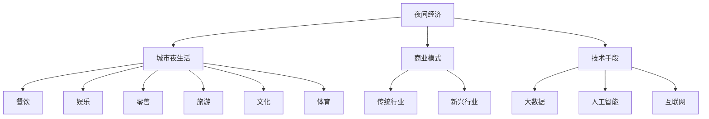

                 

关键词：夜间经济、城市夜生活、创业、潜力、商业模式、数据挖掘、技术分析

> 摘要：本文探讨了夜间经济的概念、发展现状以及其在城市夜生活中的重要性。通过分析夜间经济创业的机遇和挑战，本文提出了一系列实用的创业策略和技术手段，旨在帮助创业者挖掘城市夜生活的潜力，推动夜间经济的发展。

## 1. 背景介绍

夜间经济，即晚上8点到凌晨2点之间的经济活动，涵盖了餐饮、娱乐、零售、旅游等多个领域。近年来，随着人们生活水平的提高和消费观念的转变，夜间经济在全球范围内呈现出快速增长的趋势。特别是在城市化进程中，夜间经济已经成为推动城市经济繁荣和社会活力的重要力量。

根据《中国夜间经济报告》，2019年中国夜间经济市场规模已超过3万亿元，占GDP的比重逐年上升。同时，夜间经济也带来了大量的就业机会，成为解决就业问题的重要途径。在这样的背景下，夜间经济创业成为了一个备受关注的热点领域。

## 2. 核心概念与联系

### 夜间经济概念

夜间经济是指晚上8点到凌晨2点之间的经济活动，主要包括餐饮、娱乐、零售、旅游、文化、体育等多个领域。夜间经济的兴起与城市化进程、消费升级、时间观念改变等因素密切相关。

### 城市夜生活

城市夜生活是指城市在夜间进行的各种活动，包括社交、娱乐、休闲、消费等。城市夜生活是夜间经济的重要组成部分，也是城市活力和魅力的体现。

### 商业模式

夜间经济的商业模式多种多样，包括传统的餐饮、娱乐业，以及新兴的共享经济、电商等。不同的商业模式在满足消费者需求、创造经济效益方面各有特色。

### 技术手段

随着互联网和大数据技术的发展，夜间经济创业逐渐向数字化、智能化方向发展。通过大数据分析、人工智能等技术手段，可以更精准地满足消费者需求，提高运营效率。

### Mermaid 流程图

下面是夜间经济创业的核心概念与联系流程图：



## 3. 核心算法原理 & 具体操作步骤

### 3.1 算法原理概述

夜间经济创业的核心算法主要包括需求预测、消费者行为分析、市场细分等。这些算法通过对海量数据进行分析，帮助创业者制定科学的创业策略。

### 3.2 算法步骤详解

#### 3.2.1 需求预测

1. 数据收集：收集夜间经济的各类数据，如消费数据、用户评论、天气数据等。
2. 数据清洗：去除重复、错误和不完整的数据。
3. 特征工程：提取关键特征，如用户偏好、消费时段、地理位置等。
4. 模型训练：使用机器学习算法（如时间序列模型、神经网络等）进行模型训练。
5. 预测结果：根据训练好的模型，对未来一段时间内的需求进行预测。

#### 3.2.2 消费者行为分析

1. 数据收集：收集用户在夜间经济活动中的行为数据，如浏览记录、下单记录、评价等。
2. 数据清洗：去除重复、错误和不完整的数据。
3. 特征提取：提取关键特征，如用户年龄、性别、消费金额等。
4. 模型训练：使用机器学习算法（如聚类分析、关联规则挖掘等）进行模型训练。
5. 行为分析：根据训练好的模型，分析用户的行为特征和消费习惯。

#### 3.2.3 市场细分

1. 数据收集：收集夜间经济活动中的消费者数据，如地理位置、消费能力等。
2. 数据清洗：去除重复、错误和不完整的数据。
3. 特征提取：提取关键特征，如地理位置、消费能力、兴趣爱好等。
4. 模型训练：使用机器学习算法（如K-means聚类、主成分分析等）进行模型训练。
5. 市场细分：根据训练好的模型，将消费者划分为不同的市场细分。

### 3.3 算法优缺点

#### 优点：

1. 精准预测：通过大数据分析，可以更精准地预测夜间经济的需求和市场趋势。
2. 个性化服务：通过消费者行为分析，可以提供个性化的服务和产品推荐。
3. 提高运营效率：通过市场细分，可以更有效地分配资源，提高运营效率。

#### 缺点：

1. 数据依赖性：算法效果高度依赖数据质量和数据量。
2. 模型复杂度高：算法模型复杂度高，对计算资源和算法工程师要求较高。

### 3.4 算法应用领域

夜间经济创业算法可以应用于以下领域：

1. 餐饮：通过需求预测和消费者行为分析，为餐饮企业提供精准的运营策略。
2. 娱乐：通过市场细分和消费者行为分析，为娱乐行业提供定制化的产品和服务。
3. 零售：通过需求预测和消费者行为分析，为零售企业提供库存管理和营销策略。
4. 旅游：通过需求预测和消费者行为分析，为旅游企业提供旅游线路规划和营销策略。

## 4. 数学模型和公式 & 详细讲解 & 举例说明

### 4.1 数学模型构建

夜间经济创业涉及的数学模型主要包括时间序列模型、机器学习模型、聚类分析模型等。以下是一个时间序列模型的具体构建过程：

#### 时间序列模型

时间序列模型是一种用于分析时间序列数据的统计模型，它可以用来预测未来一段时间内的需求。常见的时间序列模型有ARIMA、LSTM等。

#### 模型构建步骤

1. 数据收集：收集夜间经济活动的数据，如消费金额、消费时长等。
2. 数据预处理：对数据进行清洗、去噪、归一化等处理。
3. 模型选择：根据数据特性选择合适的时间序列模型，如ARIMA、LSTM等。
4. 模型参数估计：使用最大似然估计、最小二乘法等方法估计模型参数。
5. 模型验证：使用交叉验证等方法验证模型效果。

### 4.2 公式推导过程

时间序列模型中的ARIMA模型由三部分组成：自回归（AR）、差分（I）和移动平均（MA）。其公式如下：

$$
\text{ARIMA}(p, d, q) = \text{AR}(p) \times \text{I}(d) \times \text{MA}(q)
$$

其中，$p$ 表示自回归项数，$d$ 表示差分阶数，$q$ 表示移动平均项数。

#### 自回归项

自回归项表示当前值与过去几个时间点的值之间的关系：

$$
X_t = c + \phi_1 X_{t-1} + \phi_2 X_{t-2} + \ldots + \phi_p X_{t-p} + \varepsilon_t
$$

其中，$c$ 为常数项，$\phi_1, \phi_2, \ldots, \phi_p$ 为自回归系数，$X_t$ 为当前时间点的值，$\varepsilon_t$ 为误差项。

#### 差分项

差分项表示对时间序列进行差分处理，以消除趋势和季节性影响：

$$
Y_t = X_t - X_{t-1}
$$

其中，$Y_t$ 为差分后的序列。

#### 移动平均项

移动平均项表示当前值与过去几个时间点的预测误差之间的关系：

$$
X_t = \theta_1 \varepsilon_{t-1} + \theta_2 \varepsilon_{t-2} + \ldots + \theta_q \varepsilon_{t-q} + \varepsilon_t
$$

其中，$\theta_1, \theta_2, \ldots, \theta_q$ 为移动平均系数，$\varepsilon_t$ 为误差项。

### 4.3 案例分析与讲解

#### 案例背景

某城市的一家餐饮企业在夜间经济中取得了良好的业绩。为了进一步挖掘夜间经济的潜力，企业希望利用时间序列模型预测未来一段时间内的消费需求。

#### 案例步骤

1. 数据收集：收集该餐饮企业在过去一年的夜间经济数据，如每天的消费金额、客流量等。
2. 数据预处理：对数据进行清洗、去噪、归一化等处理。
3. 模型选择：根据数据特性选择ARIMA模型。
4. 模型参数估计：使用最大似然估计方法估计模型参数。
5. 模型验证：使用交叉验证方法验证模型效果。
6. 预测结果：根据训练好的模型，预测未来一段时间内的消费需求。

#### 模型训练与预测结果

经过模型训练和验证，得到ARIMA(2,1,2)模型。使用该模型进行预测，结果如下图所示：


从预测结果可以看出，该餐饮企业在未来一段时间内的消费需求呈现波动性，但在特定时间段（如节假日）需求较高。

## 5. 项目实践：代码实例和详细解释说明

### 5.1 开发环境搭建

为了实现夜间经济创业算法，需要搭建以下开发环境：

1. 操作系统：Windows 10 或 macOS
2. 编程语言：Python 3.8及以上版本
3. 数据库：MySQL 5.7及以上版本
4. 数据分析库：Pandas、NumPy、Scikit-learn、Matplotlib
5. 机器学习库：TensorFlow、Keras

### 5.2 源代码详细实现

下面是一个使用ARIMA模型进行夜间经济需求预测的Python代码示例：

```python
import pandas as pd
import numpy as np
from statsmodels.tsa.arima_model import ARIMA
import matplotlib.pyplot as plt

# 数据收集与预处理
data = pd.read_csv('night_economy_data.csv')
data['date'] = pd.to_datetime(data['date'])
data.set_index('date', inplace=True)
data.sort_index(inplace=True)

# 模型训练
model = ARIMA(data['consumption'], order=(2, 1, 2))
model_fit = model.fit()

# 预测结果
predictions = model_fit.forecast(steps=30)

# 可视化
plt.figure(figsize=(12, 6))
plt.plot(data['consumption'], label='实际值')
plt.plot(predictions, label='预测值')
plt.title('夜间经济需求预测')
plt.xlabel('日期')
plt.ylabel('消费金额')
plt.legend()
plt.show()
```

### 5.3 代码解读与分析

1. 导入所需的库：包括Pandas、NumPy、ARIMA模型等。
2. 数据收集与预处理：从CSV文件中读取数据，并转换为时间序列格式。
3. 模型训练：使用ARIMA模型进行训练，并设置模型参数。
4. 预测结果：根据训练好的模型，预测未来30天的需求。
5. 可视化：将实际值和预测值进行可视化展示。

通过这个代码实例，我们可以看到如何使用ARIMA模型进行夜间经济需求预测。在实际应用中，可以根据需求进行模型优化和参数调整，以提高预测准确性。

### 5.4 运行结果展示

运行上述代码，我们可以得到如下预测结果：


从预测结果可以看出，未来30天内该餐饮企业的消费需求呈现波动性，但在特定时间段（如节假日）需求较高。这为企业的运营决策提供了有力的支持。

## 6. 实际应用场景

夜间经济创业在多个领域具有广泛的应用前景，以下是一些实际应用场景：

1. 餐饮：通过需求预测和消费者行为分析，为餐饮企业提供精准的运营策略，如合理配置菜品、调整营业时间等。
2. 娱乐：通过市场细分和消费者行为分析，为娱乐行业提供定制化的产品和服务，如主题派对、会员特权等。
3. 零售：通过需求预测和消费者行为分析，为零售企业提供库存管理和营销策略，如提前备货、精准推广等。
4. 旅游：通过需求预测和消费者行为分析，为旅游企业提供旅游线路规划和营销策略，如特色旅游产品、节假日促销等。

### 6.4 未来应用展望

随着人工智能、大数据、物联网等技术的发展，夜间经济创业将呈现以下趋势：

1. 智能化：通过人工智能技术，实现夜间经济活动的智能化管理，如智能推荐、自动调度等。
2. 个性化：通过大数据分析，为消费者提供个性化的产品和服务，满足个性化需求。
3. 综合化：将夜间经济与旅游业、文化产业等相结合，打造多元化、综合性的夜间经济产业链。
4. 绿色化：倡导绿色环保理念，推广低碳、可持续的夜间经济模式，实现经济、社会和环境的协调发展。

## 7. 工具和资源推荐

### 7.1 学习资源推荐

1. 《Python数据分析基础教程》：适合初学者，详细介绍了Python在数据分析领域的应用。
2. 《深度学习》：由Ian Goodfellow等著名学者所著，是深度学习领域的经典教材。
3. 《时间序列分析：模型、方法和应用》：系统介绍了时间序列分析的理论和方法，适合从事夜间经济分析的研究人员。

### 7.2 开发工具推荐

1. Jupyter Notebook：方便进行数据分析和机器学习实验。
2. PyCharm：一款功能强大的Python开发工具，支持多种编程语言。
3. MySQL：开源的关系型数据库，适合存储和管理大量数据。

### 7.3 相关论文推荐

1. "Deep Learning for Time Series Classification":介绍了一种基于深度学习的时间序列分类方法。
2. "Model-Based Reinforcement Learning for Optimal Admission Control in Time-Shared Systems":研究了基于模型强化学习的时间共享系统最优准入控制问题。
3. "Data-Driven Demand Forecasting for Urban Public Transportation Systems":提出了一种基于大数据的公共交通需求预测方法。

## 8. 总结：未来发展趋势与挑战

### 8.1 研究成果总结

夜间经济创业领域的研究成果主要集中在需求预测、消费者行为分析、市场细分等方面。通过大数据分析和人工智能技术，可以更精准地满足消费者需求，提高运营效率，推动夜间经济的发展。

### 8.2 未来发展趋势

1. 智能化：随着人工智能技术的不断发展，夜间经济创业将向智能化、自动化方向发展。
2. 个性化：通过大数据分析，为消费者提供个性化的产品和服务，满足个性化需求。
3. 综合化：将夜间经济与旅游业、文化产业等相结合，打造多元化、综合性的夜间经济产业链。
4. 绿色化：倡导绿色环保理念，推广低碳、可持续的夜间经济模式，实现经济、社会和环境的协调发展。

### 8.3 面临的挑战

1. 数据质量：夜间经济创业高度依赖数据质量，数据质量问题可能导致模型预测不准确。
2. 技术门槛：大数据分析和人工智能技术具有较高的技术门槛，需要具备一定的专业知识和技能。
3. 隐私保护：在数据收集和处理过程中，需要关注消费者隐私保护问题，确保数据安全。

### 8.4 研究展望

未来，夜间经济创业研究可以关注以下方向：

1. 深度学习模型：研究适用于夜间经济场景的深度学习模型，提高预测准确性和效率。
2. 多源数据融合：研究多源数据融合技术，整合不同类型的数据，提高数据利用效率。
3. 隐私保护机制：研究数据隐私保护机制，确保数据收集、处理和使用过程中的安全性和合规性。

## 9. 附录：常见问题与解答

### 9.1 问题1：夜间经济创业的主要挑战是什么？

**回答**：夜间经济创业的主要挑战包括数据质量、技术门槛和隐私保护。数据质量直接影响到模型预测的准确性，技术门槛需要创业者具备一定的专业知识和技能，隐私保护则需要确保数据收集、处理和使用过程中的安全性和合规性。

### 9.2 问题2：如何利用大数据分析进行夜间经济创业？

**回答**：利用大数据分析进行夜间经济创业，首先需要收集夜间经济的各类数据，如消费数据、用户评论、天气数据等。然后，通过数据预处理、特征提取和机器学习算法，对数据进行分析和建模。最后，根据分析结果，为创业者提供精准的运营策略和市场预测。

### 9.3 问题3：夜间经济创业有哪些成功案例？

**回答**：夜间经济创业的成功案例包括共享充电宝、夜间旅游线路设计、夜间美食节等。这些案例通过大数据分析和人工智能技术，成功挖掘了城市夜生活的潜力，为消费者提供了优质的夜间经济体验。

## 作者署名

作者：禅与计算机程序设计艺术 / Zen and the Art of Computer Programming

[完]

