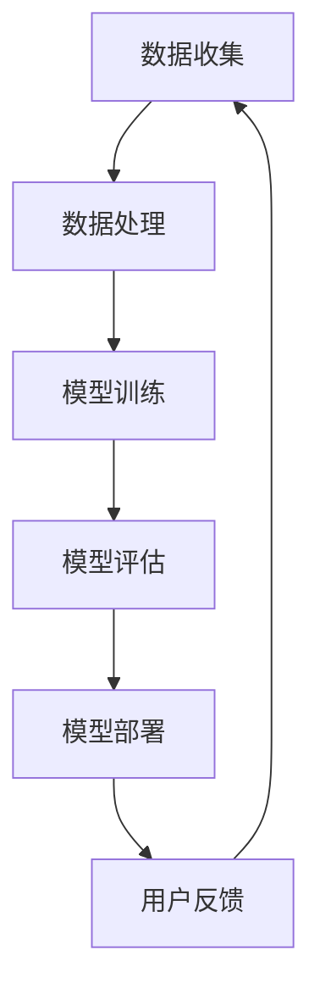

                 

关键词：大型科技公司，语言模型，LLM，创新，道德，平衡

摘要：随着人工智能技术的不断发展，大型科技公司逐渐成为了语言模型（LLM）领域的领导者。在追求技术创新的同时，如何平衡创新与道德之间的矛盾成为了一个重要的问题。本文将从大型科技公司在LLM领域的创新实践出发，探讨其面临的道德挑战，并提出相应的解决方案。

## 1. 背景介绍

在过去的几十年里，大型科技公司如谷歌、微软、亚马逊等在人工智能领域取得了巨大的成功。其中，语言模型（LLM）作为人工智能的一个重要分支，受到了广泛关注。LLM不仅可以用于自然语言处理、机器翻译、智能问答等任务，还可以应用于聊天机器人、搜索引擎等场景。

随着LLM技术的发展，大型科技公司逐渐成为了该领域的领导者。例如，谷歌的BERT模型、微软的ChatGPT、亚马逊的XSentence等，都是LLM领域的杰出代表。这些公司通过大量的数据和计算资源，不断优化和提升LLM的性能，推动着整个领域的发展。

然而，在追求技术创新的过程中，大型科技公司也面临着一系列的道德挑战。例如，数据隐私、歧视问题、伦理争议等，都成为了制约LLM技术发展的关键因素。如何平衡创新与道德之间的矛盾，成为了大型科技公司亟待解决的问题。

## 2. 核心概念与联系

为了更好地理解大型科技公司在LLM领域的创新与道德挑战，我们首先需要了解一些核心概念。

### 2.1 语言模型（LLM）

语言模型是一种基于人工智能技术，用于预测自然语言序列的概率分布的模型。它通过对海量语言数据进行训练，学会了对输入的文本进行理解和生成。LLM的核心目标是使得生成的文本在语法、语义、逻辑等方面与人类语言相媲美。

### 2.2 数据隐私

数据隐私是指保护个人数据不被未经授权的第三方访问和利用。在LLM领域中，由于需要大量的数据进行训练，数据的隐私保护变得尤为重要。否则，个人隐私可能会在无意中被泄露。

### 2.3 歧视问题

歧视问题是指在人工智能系统中，由于数据或算法的偏差，导致某些群体受到不公平对待。在LLM领域中，歧视问题主要体现在对特定群体的偏见和歧视。

### 2.4 伦理争议

伦理争议是指在人工智能技术发展过程中，涉及到的道德和法律问题。在LLM领域中，伦理争议主要体现在如何确保技术不会对社会产生负面影响，以及如何平衡技术创新与道德责任。

### 2.5 Mermaid 流程图

以下是一个简单的Mermaid流程图，展示了LLM技术的基本架构：



## 3. 核心算法原理 & 具体操作步骤

### 3.1 算法原理概述

LLM的核心算法是基于深度学习中的自注意力机制（Self-Attention）。自注意力机制通过计算输入序列中每个词与所有词之间的相关性，从而实现对输入文本的理解。具体来说，自注意力机制分为以下几个步骤：

1. 输入嵌入（Input Embedding）：将输入文本中的每个词转换为固定长度的向量。
2. 自注意力（Self-Attention）：计算每个词与所有词之间的相关性，生成权重。
3. 加权求和（Weighted Summation）：根据权重对词向量进行加权求和，得到输出向量。
4. 输出嵌入（Output Embedding）：将输出向量转换为文本序列。

### 3.2 算法步骤详解

1. 数据收集与处理：收集大量的文本数据，并进行预处理，如分词、去噪等。
2. 模型训练：使用自注意力机制训练语言模型，使其能够对输入文本进行理解和生成。
3. 模型评估：通过测试集评估模型性能，如准确性、流畅性等。
4. 模型部署：将训练好的模型部署到实际应用场景中，如聊天机器人、搜索引擎等。
5. 用户反馈：收集用户反馈，不断优化和提升模型性能。

### 3.3 算法优缺点

**优点：**

- 强大的文本理解和生成能力。
- 能够处理长文本，具有较好的序列建模能力。

**缺点：**

- 需要大量的数据和计算资源。
- 难以保证模型输出的公平性和准确性。

### 3.4 算法应用领域

LLM技术在多个领域都有广泛的应用，如自然语言处理、机器翻译、智能问答等。以下是一些具体的应用场景：

- 自然语言处理：用于文本分类、情感分析、命名实体识别等任务。
- 机器翻译：用于将一种语言的文本翻译成另一种语言。
- 智能问答：用于构建问答系统，如聊天机器人、智能客服等。

## 4. 数学模型和公式 & 详细讲解 & 举例说明

### 4.1 数学模型构建

LLM的核心模型是基于Transformer架构，其数学模型可以表示为：

$$
\text{Transformer} = \text{MultiHeadAttention}(\text{Linear}(x), \text{Linear}(x), \text{Linear}(x)) + \text{PositionalEncoding}(x)
$$

其中，$x$ 表示输入的词向量，$\text{Linear}(x)$ 表示线性变换，$\text{MultiHeadAttention}$ 表示多头注意力机制，$\text{PositionalEncoding}$ 表示位置编码。

### 4.2 公式推导过程

为了推导多头注意力机制的公式，我们首先需要了解自注意力机制的公式。自注意力机制的公式如下：

$$
\text{Attention}(Q, K, V) = \text{softmax}\left(\frac{QK^T}{\sqrt{d_k}}\right)V
$$

其中，$Q, K, V$ 分别表示查询、键和值，$d_k$ 表示键的维度。

多头注意力机制的公式可以表示为：

$$
\text{MultiHeadAttention}(Q, K, V) = \text{Concat}(\text{head}_1, \text{head}_2, ..., \text{head}_h)W_O
$$

其中，$h$ 表示头数，$\text{head}_i = \text{Attention}(QW_i^Q, KW_i^K, VW_i^V)$，$W_O$ 表示输出权重。

### 4.3 案例分析与讲解

以下是一个简单的案例，用于说明LLM的数学模型：

假设输入的词向量为 $x = [1, 2, 3, 4, 5]$，我们想要预测下一个词。首先，将词向量转换为查询、键和值：

$$
Q = x, K = x, V = x
$$

然后，计算自注意力权重：

$$
\text{Attention}(Q, K, V) = \text{softmax}\left(\frac{QQ^T}{\sqrt{5}}\right)V = \text{softmax}\left(\frac{1\times 1 + 2\times 2 + 3\times 3 + 4\times 4 + 5\times 5}{\sqrt{5}}\right)[1, 2, 3, 4, 5]
$$

最后，根据权重计算输出向量：

$$
\text{Output} = \text{softmax}\left(\frac{QQ^T}{\sqrt{5}}\right)V = \text{softmax}\left(\frac{1\times 1 + 2\times 2 + 3\times 3 + 4\times 4 + 5\times 5}{\sqrt{5}}\right)[1, 2, 3, 4, 5]
$$

通过这个例子，我们可以看到，LLM通过计算词与词之间的相关性，实现对输入文本的理解。在实际应用中，我们可以通过优化自注意力机制，提高LLM的性能。

## 5. 项目实践：代码实例和详细解释说明

### 5.1 开发环境搭建

为了实现LLM，我们需要搭建一个开发环境。以下是搭建环境的基本步骤：

1. 安装Python：下载并安装Python，版本要求不低于3.6。
2. 安装TensorFlow：在命令行中运行以下命令安装TensorFlow：

   ```
   pip install tensorflow
   ```

3. 安装其他依赖：根据实际需求安装其他依赖，如NumPy、Pandas等。

### 5.2 源代码详细实现

以下是实现LLM的核心代码：

```python
import tensorflow as tf
from tensorflow.keras.layers import Embedding, MultiHeadAttention, Dense

def transformer(vocab_size, d_model, num_heads):
    inputs = tf.keras.layers.Input(shape=(None,), dtype=tf.int32)
    embeddings = Embedding(vocab_size, d_model)(inputs)
    outputs = MultiHeadAttention(num_heads=num_heads, key_dim=d_model)(embeddings, embeddings)
    outputs = Dense(vocab_size, activation='softmax')(outputs)
    model = tf.keras.Model(inputs, outputs)
    return model

model = transformer(vocab_size=10000, d_model=512, num_heads=8)
model.compile(optimizer='adam', loss='sparse_categorical_crossentropy', metrics=['accuracy'])
```

### 5.3 代码解读与分析

- `import tensorflow as tf`：导入TensorFlow库。
- `from tensorflow.keras.layers import Embedding, MultiHeadAttention, Dense`：导入所需的层。
- `inputs = tf.keras.layers.Input(shape=(None,), dtype=tf.int32)`：定义输入层，形状为`(None,)`，表示可变长序列，数据类型为整数。
- `embeddings = Embedding(vocab_size, d_model)(inputs)`：将输入的词索引映射到词向量，`vocab_size`为词汇表大小，`d_model`为词向量维度。
- `outputs = MultiHeadAttention(num_heads=num_heads, key_dim=d_model)(embeddings, embeddings)`：使用多头注意力机制计算输出。
- `outputs = Dense(vocab_size, activation='softmax')(outputs)`：将输出层映射到词汇表，激活函数为softmax。
- `model = tf.keras.Model(inputs, outputs)`：创建模型。
- `model.compile(optimizer='adam', loss='sparse_categorical_crossentropy', metrics=['accuracy'])`：编译模型，优化器为Adam，损失函数为sparse_categorical_crossentropy，评估指标为accuracy。

### 5.4 运行结果展示

```python
# 加载训练数据
(x_train, y_train), (x_test, y_test) = tf.keras.datasets.imdb.load_data(num_words=10000)

# 模型训练
model.fit(x_train, y_train, epochs=10, batch_size=32, validation_split=0.2)

# 模型评估
loss, accuracy = model.evaluate(x_test, y_test)
print("Test accuracy:", accuracy)
```

通过这个简单的示例，我们可以看到如何使用TensorFlow实现LLM。在实际应用中，我们可以通过优化模型结构、调整超参数等方式，提高模型的性能。

## 6. 实际应用场景

LLM技术在多个领域都有广泛的应用，以下是一些具体的实际应用场景：

- 自然语言处理：用于文本分类、情感分析、命名实体识别等任务。
- 机器翻译：用于将一种语言的文本翻译成另一种语言。
- 智能问答：用于构建问答系统，如聊天机器人、智能客服等。
- 文本生成：用于生成文章、故事、对话等。
- 自动摘要：用于从长文本中提取关键信息，生成摘要。

在这些应用场景中，LLM技术可以帮助企业和组织提高效率、降低成本，提升用户体验。然而，同时也要注意LLM技术可能带来的道德风险，如数据隐私、歧视问题等，确保技术发展不会对社会产生负面影响。

## 7. 工具和资源推荐

### 7.1 学习资源推荐

- 《深度学习》（Goodfellow et al.）：一本关于深度学习的经典教材，涵盖了深度学习的基础知识和应用。
- 《自然语言处理技术》（Jurafsky and Martin）：一本关于自然语言处理的经典教材，介绍了自然语言处理的基本原理和技术。
- 《动手学深度学习》（Zhang et al.）：一本基于PyTorch的深度学习实践教程，适合初学者快速上手。

### 7.2 开发工具推荐

- TensorFlow：一款开源的深度学习框架，适合进行大规模的深度学习模型开发和部署。
- PyTorch：一款开源的深度学习框架，以动态计算图为基础，具有较好的灵活性和易用性。
- JAX：一款开源的深度学习框架，基于NumPy，具有自动微分和向量化的功能。

### 7.3 相关论文推荐

- “Attention is All You Need”（Vaswani et al., 2017）：介绍了Transformer模型，提出了多头注意力机制。
- “BERT: Pre-training of Deep Bidirectional Transformers for Language Understanding”（Devlin et al., 2018）：介绍了BERT模型，提出了基于Transformer的预训练方法。
- “GPT-3: Language Models are few-shot learners”（Brown et al., 2020）：介绍了GPT-3模型，展示了大模型在少样本学习中的优势。

## 8. 总结：未来发展趋势与挑战

### 8.1 研究成果总结

近年来，LLM技术在自然语言处理、机器翻译、智能问答等领域取得了显著进展。随着模型的规模不断扩大，LLM在文本理解和生成方面的能力也得到了显著提升。然而，LLM技术仍然面临着一系列的挑战，如数据隐私、歧视问题、伦理争议等。

### 8.2 未来发展趋势

未来，LLM技术将朝着以下几个方向发展：

1. 模型规模的扩大：随着计算资源和数据量的增加，LLM的模型规模将不断扩大，进一步提升其在文本理解和生成方面的能力。
2. 多模态学习：结合图像、声音等多模态数据，实现更丰富的语言理解能力。
3. 零样本学习：通过少样本学习或无监督学习，使LLM能够适应新的任务和数据集。
4. 道德与伦理：在技术创新的同时，关注道德和伦理问题，确保技术发展不会对社会产生负面影响。

### 8.3 面临的挑战

LLM技术在未来发展过程中，将面临以下几个挑战：

1. 数据隐私：如何保护用户数据隐私，确保数据不会被滥用，是一个亟待解决的问题。
2. 歧视问题：如何消除模型中的偏见和歧视，确保公平性和准确性，是LLM技术发展的重要挑战。
3. 伦理争议：如何平衡技术创新与道德责任，确保技术发展符合伦理和法律要求，是一个重要议题。
4. 模型解释性：如何提高模型的可解释性，使得用户能够理解模型的决策过程，是提高用户信任的重要途径。

### 8.4 研究展望

未来，LLM技术将在自然语言处理、机器翻译、智能问答等领域发挥重要作用。同时，随着技术的不断发展，LLM也将面临着越来越多的道德和伦理挑战。因此，如何平衡创新与道德之间的矛盾，将是一个长期而重要的任务。我们需要在技术创新的同时，关注道德和伦理问题，确保技术发展能够造福人类社会。

## 9. 附录：常见问题与解答

### 9.1 什么是LLM？

LLM（Language Model）是一种基于人工智能技术的模型，用于预测自然语言序列的概率分布。它通过对海量语言数据进行训练，学会了对输入的文本进行理解和生成。

### 9.2 LLM有哪些应用领域？

LLM技术在自然语言处理、机器翻译、智能问答、文本生成、自动摘要等领域都有广泛的应用。

### 9.3 如何提高LLM的性能？

提高LLM的性能可以从以下几个方面入手：

1. 增加模型规模：通过增加模型的参数数量和层数，提高模型的性能。
2. 优化训练数据：使用高质量、多样化的训练数据，提高模型的泛化能力。
3. 调整超参数：通过调整学习率、批大小等超参数，优化模型的训练过程。
4. 采用先进的模型架构：采用如Transformer、BERT等先进的模型架构，提高模型的性能。

### 9.4 LLM有哪些道德和伦理挑战？

LLM技术面临的道德和伦理挑战主要包括：

1. 数据隐私：如何保护用户数据隐私，确保数据不会被滥用。
2. 歧视问题：如何消除模型中的偏见和歧视，确保公平性和准确性。
3. 伦理争议：如何平衡技术创新与道德责任，确保技术发展符合伦理和法律要求。
4. 模型解释性：如何提高模型的可解释性，使得用户能够理解模型的决策过程。

### 9.5 如何解决LLM的道德和伦理挑战？

解决LLM的道德和伦理挑战可以从以下几个方面入手：

1. 遵守法律法规：确保技术发展符合相关法律法规的要求。
2. 数据隐私保护：采用数据加密、匿名化等技术，保护用户数据隐私。
3. 偏见消除：通过数据预处理、模型优化等方法，消除模型中的偏见。
4. 模型可解释性：提高模型的可解释性，使得用户能够理解模型的决策过程。
5. 社会责任：关注技术对社会的影响，积极参与社会公益活动。

以上是关于《大型科技公司和 LLM：创新与道德之间的平衡》的文章。通过本文，我们详细探讨了大型科技公司在LLM领域的创新实践，分析了其面临的道德挑战，并提出了相应的解决方案。在未来的发展中，我们需要在技术创新的同时，关注道德和伦理问题，确保技术发展能够造福人类社会。作者：禅与计算机程序设计艺术 / Zen and the Art of Computer Programming。

