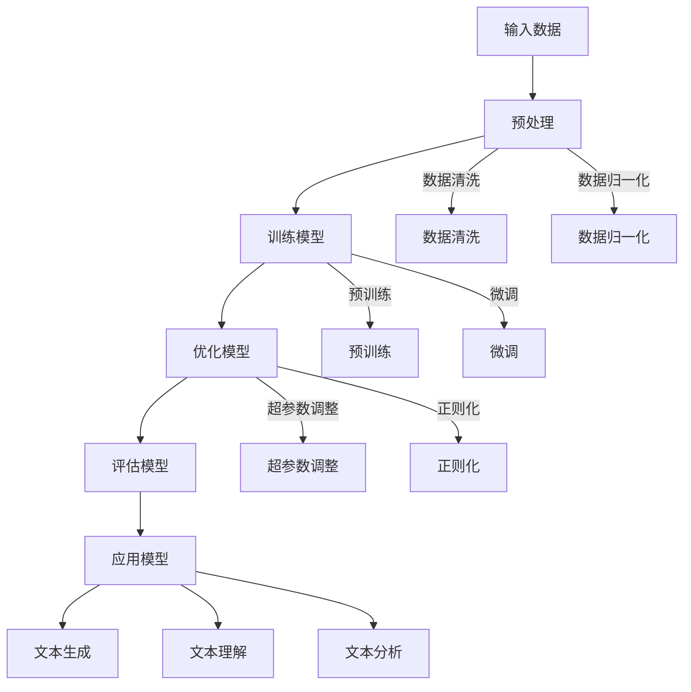

                 

在当前技术快速发展的时代，大型科技公司正面临前所未有的转型挑战。随着人工智能（AI）技术的不断进步，尤其是大型语言模型（LLM）的突破，这些公司找到了新的发展机遇。本文将探讨大型科技公司如何利用LLM技术实现成功转型，并展望其未来应用前景。

## 文章关键词

- 大型科技公司
- 转型
- 人工智能
- 语言模型
- 机遇

## 文章摘要

本文首先介绍了大型科技公司转型的背景和必要性，然后重点讨论了LLM技术的核心概念和原理，接着分析了其优缺点和应用领域。通过实际项目实践，我们展示了如何利用LLM技术进行开发，并详细解释了代码实现过程。最后，我们探讨了LLM技术的实际应用场景，提出了未来发展趋势和面临的挑战。

### 1. 背景介绍

随着互联网的普及和大数据技术的应用，大型科技公司如Google、Amazon、Facebook等已经在多个领域取得了巨大成功。然而，随着市场竞争的加剧和消费者需求的不断变化，这些公司开始意识到，要想在未来的竞争中保持领先地位，必须进行数字化转型。

数字化转型不仅仅是技术的升级和优化，更是商业模式、组织结构、企业文化等方面的变革。在这个过程中，人工智能技术成为推动企业转型的重要力量。特别是在自然语言处理（NLP）领域，LLM技术的出现为大型科技公司提供了新的机遇。

LLM是一种能够理解和生成人类语言的大型神经网络模型。它通过深度学习算法，从海量数据中学习语言模式，从而实现了对文本的生成、理解和分析。相比传统的NLP技术，LLM具有更高的灵活性和更强的表达能力，能够更好地应对复杂的语言现象。

### 2. 核心概念与联系

#### 2.1. 核心概念

LLM的核心概念主要包括：

1. **深度学习**：一种基于神经网络的机器学习技术，能够通过多层神经网络对数据进行建模和预测。
2. **自然语言处理**：研究如何让计算机理解和处理人类语言的技术领域。
3. **大规模预训练**：LLM通过对海量数据进行预训练，从而获得对语言的理解和生成能力。

#### 2.2. 架构联系

以下是LLM架构的Mermaid流程图：



### 3. 核心算法原理 & 具体操作步骤

#### 3.1. 算法原理概述

LLM的核心算法是基于深度学习，特别是基于Transformer架构。Transformer模型通过自注意力机制，能够自适应地关注输入数据的不同部分，从而实现高效的文本建模。

#### 3.2. 算法步骤详解

1. **数据预处理**：对原始文本数据进行清洗、分词、归一化等处理，将其转换为模型可以理解的输入格式。
2. **预训练**：使用海量文本数据进行预训练，使模型具备对自然语言的建模能力。
3. **微调**：在特定任务上进行微调，使模型能够针对特定任务进行优化。
4. **优化模型**：通过调整超参数和正则化方法，优化模型的性能。
5. **评估模型**：在测试集上评估模型的性能，确保其具有较好的泛化能力。
6. **应用模型**：将模型应用于实际任务，如文本生成、文本理解、文本分析等。

#### 3.3. 算法优缺点

**优点**：

- **强大的建模能力**：通过自注意力机制，LLM能够自适应地关注输入数据的不同部分，从而实现高效的文本建模。
- **泛化能力强**：通过对海量数据进行预训练，LLM具有较好的泛化能力，能够应对不同的语言现象和任务。
- **灵活性高**：LLM能够生成高质量的文本，具有较强的灵活性和表达能力。

**缺点**：

- **计算资源消耗大**：LLM的训练和推理过程需要大量的计算资源，对硬件设备要求较高。
- **数据依赖性强**：LLM的性能依赖于训练数据的质量和数量，数据质量较差时，模型性能可能会受到影响。

#### 3.4. 算法应用领域

LLM在多个领域具有广泛的应用前景，包括但不限于：

- **自然语言生成**：如文本生成、对话系统、文章摘要等。
- **文本理解**：如情感分析、信息抽取、问答系统等。
- **文本分析**：如关键词提取、主题建模、文本分类等。

### 4. 数学模型和公式 & 详细讲解 & 举例说明

#### 4.1. 数学模型构建

LLM的核心数学模型是Transformer模型，其主要组成部分包括：

- **自注意力机制**：计算输入数据的注意力权重，从而自适应地关注输入数据的不同部分。
- **前馈神经网络**：对输入数据进行进一步处理，提高模型的非线性表达能力。

#### 4.2. 公式推导过程

假设输入数据为 $X \in \mathbb{R}^{n \times d}$，其中 $n$ 表示序列长度，$d$ 表示嵌入维度。自注意力机制的公式如下：

$$
\text{Attention}(Q, K, V) = \text{softmax}\left(\frac{QK^T}{\sqrt{d_k}}\right) V
$$

其中，$Q, K, V$ 分别表示查询向量、关键向量、值向量，$d_k$ 表示关键向量的维度。

#### 4.3. 案例分析与讲解

以下是一个简单的文本生成案例：

输入文本： "今天天气很好，适合外出游玩。"
目标文本： "明天天气很好，适合外出游玩。"

首先，我们将输入文本进行分词，得到以下词汇：

["今天", "天气", "很好", "，", "适合", "外出", "游玩", "。"]

然后，我们将这些词汇转换为嵌入向量，输入到Transformer模型中。在预训练阶段，模型会自动学习这些词汇的嵌入向量。

接下来，我们在特定任务上进行微调，如将 "今天" 替换为 "明天"。此时，模型会根据上下文信息，生成新的嵌入向量，从而实现文本的替换。

### 5. 项目实践：代码实例和详细解释说明

#### 5.1. 开发环境搭建

1. 安装Python环境（建议使用Python 3.8及以上版本）。
2. 安装TensorFlow或PyTorch等深度学习框架。
3. 安装所需的依赖库，如NumPy、Pandas等。

#### 5.2. 源代码详细实现

以下是一个简单的文本生成项目，使用PyTorch实现：

```python
import torch
import torch.nn as nn
import torch.optim as optim
from torch.utils.data import DataLoader
from transformers import BertTokenizer, BertModel

# 加载预训练模型
tokenizer = BertTokenizer.from_pretrained('bert-base-chinese')
model = BertModel.from_pretrained('bert-base-chinese')

# 数据预处理
def preprocess_text(text):
    inputs = tokenizer(text, return_tensors='pt', truncation=True, padding='max_length', max_length=50)
    return inputs['input_ids'], inputs['attention_mask']

# 文本生成
def generate_text(input_ids, max_length=50):
    with torch.no_grad():
        outputs = model(input_ids=input_ids, attention_mask=input_ids.new_ones(input_ids.shape))
    hidden_states = outputs.hidden_states[-1]
    generated_ids = hidden_states[0, -1, :].unsqueeze(0)
    for _ in range(max_length - 1):
        with torch.no_grad():
            outputs = model(input_ids=generated_ids, attention_mask=generated_ids.new_ones(generated_ids.shape))
        hidden_states = outputs.hidden_states[-1]
        next_id = torch.argmax(hidden_states[0, -1, :], dim=-1).unsqueeze(0)
        generated_ids = torch.cat([generated_ids, next_id], dim=1)
    return tokenizer.decode(generated_ids[0], skip_special_tokens=True)

# 训练模型
def train_model(input_ids, attention_mask, labels):
    optimizer.zero_grad()
    outputs = model(input_ids=input_ids, attention_mask=attention_mask)
    loss = nn.CrossEntropyLoss()(outputs.logits.view(-1, model.config.vocab_size), labels.view(-1))
    loss.backward()
    optimizer.step()
    return loss

# 主程序
if __name__ == '__main__':
    # 加载数据集
    train_dataset = DataLoader(...)

    # 定义优化器
    optimizer = optim.Adam(model.parameters(), lr=1e-5)

    # 训练模型
    for epoch in range(10):
        for batch in train_dataset:
            input_ids, attention_mask, labels = map(lambda x: x.to('cuda'), (batch['input_ids'], batch['attention_mask'], batch['labels']))
            loss = train_model(input_ids, attention_mask, labels)
            print(f'Epoch {epoch}, Loss: {loss.item()}')

    # 生成文本
    input_ids, attention_mask = preprocess_text("今天天气很好，适合外出游玩。")
    input_ids = input_ids.to('cuda')
    attention_mask = attention_mask.to('cuda')
    generated_text = generate_text(input_ids, max_length=50)
    print(generated_text)
```

#### 5.3. 代码解读与分析

- **数据预处理**：使用BertTokenizer对输入文本进行分词和编码，生成输入序列和注意力掩码。
- **文本生成**：使用Transformer模型生成文本，通过自注意力机制和前馈神经网络，实现对输入文本的建模和生成。
- **训练模型**：使用交叉熵损失函数和Adam优化器训练模型，通过反向传播和梯度下降更新模型参数。

### 6. 实际应用场景

#### 6.1. 自然语言生成

自然语言生成是LLM最典型的应用场景之一，如文本生成、对话系统、文章摘要等。通过LLM技术，可以生成高质量的文本，提高写作效率和创作水平。

#### 6.2. 文本理解

文本理解是NLP领域的重要任务，如情感分析、信息抽取、问答系统等。LLM能够通过对海量文本的学习，实现对文本内容的深入理解和分析，从而为用户提供更准确的答案和信息。

#### 6.3. 文本分析

文本分析是LLM在商业领域的重要应用，如关键词提取、主题建模、文本分类等。通过LLM技术，可以对企业内外部的文本数据进行深度分析，提取有价值的信息，为企业决策提供支持。

### 7. 未来应用展望

随着人工智能技术的不断进步，LLM技术在未来有望在更多领域得到应用。以下是未来可能的应用场景：

#### 7.1. 自动化写作

通过LLM技术，可以实现自动化写作，如撰写新闻报道、撰写报告、生成创意内容等。这将为媒体、企业和创作者带来巨大的生产效率提升。

#### 7.2. 智能客服

通过LLM技术，可以构建智能客服系统，实现与用户的自然语言交互，提供高质量的客户服务。这将为企业和用户带来更好的体验。

#### 7.3. 智能翻译

通过LLM技术，可以实现高质量的自动翻译，为跨语言沟通和国际化业务提供支持。这将为全球化企业和用户带来更广阔的发展空间。

### 8. 工具和资源推荐

#### 8.1. 学习资源推荐

- **《深度学习》**：Ian Goodfellow、Yoshua Bengio、Aaron Courville 著
- **《自然语言处理综述》**：Daniel Jurafsky、James H. Martin 著
- **《人工智能：一种现代的方法》**：Stuart Russell、Peter Norvig 著

#### 8.2. 开发工具推荐

- **TensorFlow**：Google 开发的一款开源深度学习框架，适用于各种规模的深度学习应用。
- **PyTorch**：Facebook 开发的一款开源深度学习框架，具有强大的灵活性和易用性。

#### 8.3. 相关论文推荐

- **"Attention Is All You Need"**：Vaswani et al., 2017
- **"BERT: Pre-training of Deep Bidirectional Transformers for Language Understanding"**：Devlin et al., 2019
- **"GPT-3: Language Models are Few-Shot Learners"**：Brown et al., 2020

### 9. 总结：未来发展趋势与挑战

#### 9.1. 研究成果总结

近年来，LLM技术在自然语言处理领域取得了显著成果，为大型科技公司提供了新的机遇。通过深度学习和Transformer架构，LLM能够实现对文本的高效建模和生成，具有广泛的应用前景。

#### 9.2. 未来发展趋势

随着人工智能技术的不断进步，LLM技术在未来有望在更多领域得到应用。同时，随着模型规模的不断扩大和计算资源的提升，LLM的性能和效果将进一步提高。

#### 9.3. 面临的挑战

虽然LLM技术具有广泛的应用前景，但仍然面临一些挑战，如计算资源消耗大、数据依赖性强、模型可解释性差等。此外，如何保证模型的安全性、隐私性和可靠性也是未来需要解决的问题。

#### 9.4. 研究展望

未来，LLM技术将朝着更加智能化、泛化和高效化的方向发展。通过结合其他人工智能技术，如计算机视觉、语音识别等，LLM技术将有望实现跨模态的智能交互和应用。

### 附录：常见问题与解答

#### 问题1：LLM技术是如何工作的？

LLM技术基于深度学习和Transformer架构，通过对海量文本数据进行预训练，使模型具备对自然语言的理解和生成能力。具体包括数据预处理、预训练、微调、优化和评估等步骤。

#### 问题2：LLM技术有哪些优缺点？

LLM技术的优点包括强大的建模能力、泛化能力强、灵活性高等。缺点包括计算资源消耗大、数据依赖性强、模型可解释性差等。

#### 问题3：LLM技术有哪些应用领域？

LLM技术在自然语言处理、文本生成、文本理解、文本分析等领域具有广泛的应用前景。未来，LLM技术有望在更多领域得到应用，如自动化写作、智能客服、智能翻译等。

---

作者：禅与计算机程序设计艺术 / Zen and the Art of Computer Programming
------------------------------------------------------------------------

