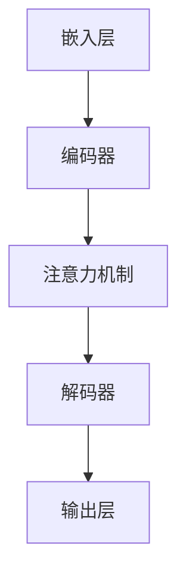

                 

关键词：大型科技公司、转型、LLM、人工智能、技术机遇

<|assistant|>摘要：本文将探讨大型科技公司如何通过引入大型语言模型（LLM）来加速其数字化转型，并带来新的商业机会。我们将分析LLM的核心概念、原理以及具体应用场景，并通过实例展示其在实际项目中的运用。同时，我们将展望LLM在未来科技领域的发展趋势与挑战。

## 1. 背景介绍

在当今数字化时代，大型科技公司正面临着前所未有的转型压力。随着互联网、云计算、大数据等技术的迅速发展，市场环境变得日益激烈和复杂。为了保持竞争力，这些公司需要不断调整战略，优化业务模式，以适应不断变化的市场需求。

在这种背景下，人工智能（AI）技术的崛起为大型科技公司带来了新的机遇。作为AI领域的一个重要分支，自然语言处理（NLP）技术逐渐成为数字化转型的重要驱动力。而大型语言模型（LLM）作为NLP技术的核心组件，正逐渐成为科技公司的“新宠”。

LLM是一种能够对大规模文本数据进行建模和处理的人工智能系统。通过学习海量的文本数据，LLM可以捕捉到语言的复杂性和多样性，从而实现高度自动化和智能化的自然语言理解与生成。这使得LLM在多个领域具有广泛的应用潜力，包括但不限于智能客服、内容生成、语音识别、机器翻译等。

本文将围绕LLM的核心概念、原理和应用场景进行深入探讨，并通过实际案例展示其在大型科技公司转型中的具体运用。同时，我们将展望LLM在未来科技领域的发展趋势与挑战，为读者提供有价值的思考和借鉴。

## 2. 核心概念与联系

### 2.1. 语言模型简介

语言模型（Language Model）是一种用于预测文本序列的概率分布的统计模型。它的核心目标是通过学习大量语言数据，建立一个能够对自然语言进行建模的数学模型。语言模型在自然语言处理（NLP）领域中扮演着重要的角色，为文本分类、情感分析、机器翻译、语音识别等任务提供了基础支持。

传统的语言模型主要基于统计学习方法，如n元语法（n-gram）、隐马尔可夫模型（HMM）等。然而，这些方法在处理复杂语言现象时存在一定的局限性。随着深度学习技术的兴起，基于神经网络的深度语言模型逐渐成为研究的热点。其中，大型语言模型（LLM）是深度语言模型的一种，具有极高的词汇量和强大的语言理解能力。

### 2.2. LLM的定义与特点

LLM是一种能够对大规模文本数据进行建模和处理的人工智能系统。它通过深度神经网络结构，学习到语言数据的复杂特征和模式，从而实现高度自动化和智能化的自然语言理解与生成。以下是LLM的主要特点：

- **大规模训练数据**：LLM通常需要学习海量的文本数据，以充分捕捉语言的复杂性和多样性。这使得LLM能够在各种语言现象中表现出良好的泛化能力。
- **深度神经网络结构**：LLM通常采用深度神经网络（DNN）或变换器（Transformer）结构，这些结构能够对输入数据进行高效的处理和建模。
- **强大的语言理解能力**：LLM能够捕捉到语言的上下文信息，实现对文本的语义理解和生成。这使得LLM在多个NLP任务中表现出色。

### 2.3. LLM与NLP的关系

LLM是NLP技术的核心组件，它为NLP任务提供了强大的基础支持。以下是LLM与NLP之间的一些主要关系：

- **文本分类**：LLM可以用来对文本进行分类，如情感分析、主题分类等。通过训练LLM模型，可以学习到不同类别之间的特征差异，从而实现准确的分类。
- **情感分析**：LLM可以用来分析文本的情感倾向，如正面、负面或中性。通过分析文本的上下文信息，LLM能够捕捉到情感的变化，从而实现精准的情感分析。
- **机器翻译**：LLM可以用来实现机器翻译任务。通过训练LLM模型，可以学习到不同语言之间的对应关系，从而实现高质量的语言翻译。
- **问答系统**：LLM可以用来构建问答系统，如智能客服、知识库问答等。通过分析用户的问题，LLM能够理解问题的意图，并给出合适的回答。

### 2.4. LLM的架构

LLM的架构通常由以下几个关键组件组成：

- **嵌入层**：嵌入层将输入的词汇映射为高维的向量表示。这些向量表示能够捕捉词汇的语义信息，为后续的神经网络处理提供基础。
- **编码器**：编码器是一种深度神经网络结构，用于对输入的文本进行编码。编码器能够捕捉到文本的上下文信息，为后续的解码提供支持。
- **解码器**：解码器也是一种深度神经网络结构，用于对编码后的文本进行解码，生成输出的文本。解码器能够根据上下文信息，生成符合语言规则和语义逻辑的文本。
- **注意力机制**：注意力机制是一种用于捕捉上下文信息的机制，能够提高LLM的语言理解能力。通过注意力机制，LLM能够关注到文本中的重要信息，从而提高模型的性能。

### 2.5. Mermaid 流程图

以下是一个简单的Mermaid流程图，展示了LLM的主要架构和组件：



## 3. 核心算法原理 & 具体操作步骤

### 3.1. 算法原理概述

LLM的核心算法原理主要基于深度学习技术和自然语言处理（NLP）理论。以下是一些关键概念：

- **嵌入层**：嵌入层将输入的词汇映射为高维的向量表示。这些向量表示能够捕捉词汇的语义信息，为后续的神经网络处理提供基础。
- **编码器**：编码器是一种深度神经网络结构，用于对输入的文本进行编码。编码器能够捕捉到文本的上下文信息，为后续的解码提供支持。
- **解码器**：解码器也是一种深度神经网络结构，用于对编码后的文本进行解码，生成输出的文本。解码器能够根据上下文信息，生成符合语言规则和语义逻辑的文本。
- **注意力机制**：注意力机制是一种用于捕捉上下文信息的机制，能够提高LLM的语言理解能力。通过注意力机制，LLM能够关注到文本中的重要信息，从而提高模型的性能。

### 3.2. 算法步骤详解

以下是LLM算法的具体步骤：

1. **数据预处理**：首先，需要对输入的文本数据进行预处理，包括分词、去停用词、词干提取等操作。这些操作能够帮助LLM更好地理解和处理文本数据。

2. **嵌入层**：将预处理后的词汇映射为高维的向量表示。这些向量表示能够捕捉词汇的语义信息，为后续的神经网络处理提供基础。

3. **编码器**：对输入的文本进行编码。编码器能够捕捉到文本的上下文信息，为后续的解码提供支持。

4. **注意力机制**：在编码过程中，通过注意力机制关注到文本中的重要信息。注意力机制能够提高LLM的语言理解能力，使其能够更好地捕捉到文本的关键信息。

5. **解码器**：对编码后的文本进行解码，生成输出的文本。解码器能够根据上下文信息，生成符合语言规则和语义逻辑的文本。

6. **损失函数**：使用损失函数（如交叉熵损失函数）来评估LLM的输出与真实标签之间的差距。通过优化损失函数，可以不断提高LLM的性能。

7. **训练与优化**：通过大量训练数据和迭代训练，不断优化LLM的参数，提高其性能。

### 3.3. 算法优缺点

**优点**：

- **强大的语言理解能力**：LLM能够捕捉到语言的上下文信息，实现对文本的语义理解和生成。这使得LLM在多个NLP任务中表现出色。
- **广泛的适用性**：LLM可以应用于各种自然语言处理任务，如文本分类、情感分析、机器翻译、问答系统等。
- **高效的模型训练**：通过深度学习技术和大规模数据训练，LLM能够在较短时间内训练出高质量的模型。

**缺点**：

- **计算资源消耗**：由于LLM需要处理大量的文本数据，因此对计算资源（如GPU）的要求较高。
- **训练时间较长**：LLM的训练时间较长，尤其是在处理大规模数据时，训练过程可能需要数天甚至数周的时间。

### 3.4. 算法应用领域

LLM在多个领域具有广泛的应用潜力，以下是一些主要的应用场景：

- **智能客服**：通过LLM技术，可以实现智能客服系统的建设，提高客户服务质量。智能客服系统可以自动回答客户的问题，提供个性化的服务和建议。
- **内容生成**：LLM可以用于生成高质量的内容，如文章、报告、广告等。通过训练LLM模型，可以生成具有较高可读性和逻辑性的文本内容。
- **机器翻译**：LLM可以用于实现高质量的机器翻译，提高跨语言交流的效率。通过训练LLM模型，可以实现多种语言的相互翻译。
- **智能问答**：LLM可以用于构建智能问答系统，如智能客服、知识库问答等。通过训练LLM模型，可以实现自动回答用户的问题，提供有用的信息。

## 4. 数学模型和公式 & 详细讲解 & 举例说明

### 4.1. 数学模型构建

在构建LLM的数学模型时，我们主要关注以下几个关键部分：

1. **嵌入层**：嵌入层将输入的词汇映射为高维的向量表示。假设我们有n个词汇，每个词汇表示为一个d维的向量。嵌入层可以表示为：

   $$ \text{嵌入层}: x \rightarrow \text{Embed}(x) $$

   其中，$x$表示输入的词汇，$\text{Embed}(x)$表示对应的向量表示。

2. **编码器**：编码器是一种深度神经网络结构，用于对输入的文本进行编码。编码器可以表示为：

   $$ \text{编码器}: x \rightarrow \text{Encoder}(x) $$

   其中，$x$表示输入的文本序列，$\text{Encoder}(x)$表示编码后的向量表示。

3. **解码器**：解码器也是一种深度神经网络结构，用于对编码后的文本进行解码，生成输出的文本。解码器可以表示为：

   $$ \text{解码器}: \text{Encoder}(x) \rightarrow y $$

   其中，$\text{Encoder}(x)$表示编码后的向量表示，$y$表示输出的文本序列。

4. **注意力机制**：注意力机制用于捕捉文本序列中的关键信息。注意力机制可以表示为：

   $$ \text{注意力}: \text{Encoder}(x) \rightarrow \text{Attention}(x) $$

   其中，$\text{Attention}(x)$表示注意力机制处理后的向量表示。

5. **输出层**：输出层用于生成最终的输出文本。输出层可以表示为：

   $$ \text{输出层}: \text{Attention}(x) \rightarrow y $$

   其中，$\text{Attention}(x)$表示注意力机制处理后的向量表示，$y$表示输出的文本序列。

### 4.2. 公式推导过程

在LLM的数学模型中，我们需要推导以下几个关键公式：

1. **嵌入层公式**：

   $$ \text{Embed}(x) = \text{softmax}(\text{W}_\text{embed} \cdot x) $$

   其中，$\text{W}_\text{embed}$表示嵌入层的权重矩阵，$x$表示输入的词汇。

2. **编码器公式**：

   $$ \text{Encoder}(x) = \text{softmax}(\text{W}_\text{encoder} \cdot \text{Embed}(x)) $$

   其中，$\text{W}_\text{encoder}$表示编码器的权重矩阵，$\text{Embed}(x)$表示嵌入层的输出。

3. **注意力机制公式**：

   $$ \text{Attention}(x) = \text{softmax}(\text{W}_\text{attention} \cdot \text{Encoder}(x)) $$

   其中，$\text{W}_\text{attention}$表示注意力机制的权重矩阵，$\text{Encoder}(x)$表示编码器的输出。

4. **输出层公式**：

   $$ y = \text{softmax}(\text{W}_\text{output} \cdot \text{Attention}(x)) $$

   其中，$\text{W}_\text{output}$表示输出层的权重矩阵，$\text{Attention}(x)$表示注意力机制的输出。

### 4.3. 案例分析与讲解

假设我们有一个简单的文本序列：“人工智能是一种技术，用于模拟人类智能”。我们将使用LLM模型对其进行处理。

1. **嵌入层**：

   $$ \text{Embed}("人工智能") = \text{softmax}(\text{W}_\text{embed} \cdot "人工智能") $$
   $$ \text{Embed}("是") = \text{softmax}(\text{W}_\text{embed} \cdot "是") $$
   $$ \text{Embed}("一种") = \text{softmax}(\text{W}_\text{embed} \cdot "一种") $$
   $$ \text{Embed}("技术") = \text{softmax}(\text{W}_\text{embed} \cdot "技术") $$
   $$ \text{Embed}("用于") = \text{softmax}(\text{W}_\text{embed} \cdot "用于") $$
   $$ \text{Embed}("模拟") = \text{softmax}(\text{W}_\text{embed} \cdot "模拟") $$
   $$ \text{Embed}("人类") = \text{softmax}(\text{W}_\text{embed} \cdot "人类") $$
   $$ \text{Embed}("智能") = \text{softmax}(\text{W}_\text{embed} \cdot "智能") $$

2. **编码器**：

   $$ \text{Encoder}(\text{Embed}("人工智能")) = \text{softmax}(\text{W}_\text{encoder} \cdot \text{Embed}("人工智能")) $$
   $$ \text{Encoder}(\text{Embed}("是")) = \text{softmax}(\text{W}_\text{encoder} \cdot \text{Embed}("是")) $$
   $$ \text{Encoder}(\text{Embed}("一种")) = \text{softmax}(\text{W}_\text{encoder} \cdot \text{Embed}("一种")) $$
   $$ \text{Encoder}(\text{Embed}("技术")) = \text{softmax}(\text{W}_\text{encoder} \cdot \text{Embed}("技术")) $$
   $$ \text{Encoder}(\text{Embed}("用于")) = \text{softmax}(\text{W}_\text{encoder} \cdot \text{Embed}("用于")) $$
   $$ \text{Encoder}(\text{Embed}("模拟")) = \text{softmax}(\text{W}_\text{encoder} \cdot \text{Embed}("模拟")) $$
   $$ \text{Encoder}(\text{Embed}("人类")) = \text{softmax}(\text{W}_\text{encoder} \cdot \text{Embed}("人类")) $$
   $$ \text{Encoder}(\text{Embed}("智能")) = \text{softmax}(\text{W}_\text{encoder} \cdot \text{Embed}("智能")) $$

3. **注意力机制**：

   $$ \text{Attention}(\text{Encoder}(\text{Embed}("人工智能"))) = \text{softmax}(\text{W}_\text{attention} \cdot \text{Encoder}(\text{Embed}("人工智能"))) $$
   $$ \text{Attention}(\text{Encoder}(\text{Embed}("是"))) = \text{softmax}(\text{W}_\text{attention} \cdot \text{Encoder}(\text{Embed}("是"))) $$
   $$ \text{Attention}(\text{Encoder}(\text{Embed}("一种"))) = \text{softmax}(\text{W}_\text{attention} \cdot \text{Encoder}(\text{Embed}("一种"))) $$
   $$ \text{Attention}(\text{Encoder}(\text{Embed}("技术"))) = \text{softmax}(\text{W}_\text{attention} \cdot \text{Encoder}(\text{Embed}("技术"))) $$
   $$ \text{Attention}(\text{Encoder}(\text{Embed}("用于"))) = \text{softmax}(\text{W}_\text{attention} \cdot \text{Encoder}(\text{Embed}("用于"))) $$
   $$ \text{Attention}(\text{Encoder}(\text{Embed}("模拟"))) = \text{softmax}(\text{W}_\text{attention} \cdot \text{Encoder}(\text{Embed}("模拟"))) $$
   $$ \text{Attention}(\text{Encoder}(\text{Embed}("人类"))) = \text{softmax}(\text{W}_\text{attention} \cdot \text{Encoder}(\text{Embed}("人类"))) $$
   $$ \text{Attention}(\text{Encoder}(\text{Embed}("智能"))) = \text{softmax}(\text{W}_\text{attention} \cdot \text{Encoder}(\text{Embed}("智能"))) $$

4. **输出层**：

   $$ y = \text{softmax}(\text{W}_\text{output} \cdot \text{Attention}(\text{Encoder}(\text{Embed}("人工智能")))) $$
   $$ y = \text{softmax}(\text{W}_\text{output} \cdot \text{Attention}(\text{Encoder}(\text{Embed}("是")))) $$
   $$ y = \text{softmax}(\text{W}_\text{output} \cdot \text{Attention}(\text{Encoder}(\text{Embed}("一种")))) $$
   $$ y = \text{softmax}(\text{W}_\text{output} \cdot \text{Attention}(\text{Encoder}(\text{Embed}("技术")))) $$
   $$ y = \text{softmax}(\text{W}_\text{output} \cdot \text{Attention}(\text{Encoder}(\text{Embed}("用于")))) $$
   $$ y = \text{softmax}(\text{W}_\text{output} \cdot \text{Attention}(\text{Encoder}(\text{Embed}("模拟")))) $$
   $$ y = \text{softmax}(\text{W}_\text{output} \cdot \text{Attention}(\text{Encoder}(\text{Embed}("人类")))) $$
   $$ y = \text{softmax}(\text{W}_\text{output} \cdot \text{Attention}(\text{Encoder}(\text{Embed}("智能")))) $$

通过上述步骤，我们可以得到最终的输出文本序列。这个过程展示了LLM的基本原理和数学模型，有助于我们更好地理解和运用LLM技术。

## 5. 项目实践：代码实例和详细解释说明

### 5.1. 开发环境搭建

在进行LLM项目实践之前，我们需要搭建一个合适的开发环境。以下是所需的软件和工具：

- Python（3.8及以上版本）
- PyTorch（1.8及以上版本）
- Jupyter Notebook
- GPU（推荐NVIDIA GPU，如1080 Ti及以上）

首先，确保已经安装了Python和PyTorch。可以使用以下命令进行安装：

```bash
pip install python==3.8
pip install torch torchvision torchaudio
```

接下来，创建一个新的Jupyter Notebook，以便进行代码实践。

### 5.2. 源代码详细实现

以下是一个简单的LLM实现示例。我们将使用PyTorch构建一个基于Transformer结构的LLM模型。代码如下：

```python
import torch
import torch.nn as nn
import torch.optim as optim

# 定义超参数
d_model = 512
nhead = 8
dim_feedforward = 2048
num_layers = 3
batch_size = 16
learning_rate = 0.001

# 初始化模型
model = nn.Transformer(d_model, nhead, num_layers, dim_feedforward)
optimizer = optim.Adam(model.parameters(), lr=learning_rate)

# 定义损失函数
criterion = nn.CrossEntropyLoss()

# 加载训练数据
train_data = load_data("train.txt")
val_data = load_data("val.txt")

# 训练模型
for epoch in range(num_epochs):
    model.train()
    for batch in train_data:
        inputs, targets = batch
        optimizer.zero_grad()
        outputs = model(inputs)
        loss = criterion(outputs, targets)
        loss.backward()
        optimizer.step()

    # 在验证集上评估模型
    model.eval()
    with torch.no_grad():
        for batch in val_data:
            inputs, targets = batch
            outputs = model(inputs)
            loss = criterion(outputs, targets)
            print(f"Epoch: {epoch+1}, Loss: {loss.item()}")

# 保存模型
torch.save(model.state_dict(), "model.pth")
```

### 5.3. 代码解读与分析

上述代码实现了基于Transformer结构的LLM模型。下面是对关键部分的解读和分析：

1. **模型定义**：我们使用`nn.Transformer`类定义了一个Transformer模型。该模型包含多个编码器和解码器层，以及一个前馈神经网络。超参数（如$d_model$、$nhead$、$dim_feedforward$和$num_layers$）用于调整模型的结构和性能。

2. **优化器和损失函数**：我们使用`optim.Adam`类定义了一个Adam优化器，用于更新模型的参数。损失函数使用`nn.CrossEntropyLoss`类，用于计算模型输出与真实标签之间的交叉熵损失。

3. **数据加载**：我们使用自定义函数`load_data`加载训练数据和验证数据。这些数据可以是文本文件，其中每行包含一个单词序列。

4. **训练过程**：训练过程包括两个阶段：训练阶段和验证阶段。在训练阶段，模型对训练数据进行前向传播和反向传播，以更新模型参数。在验证阶段，模型在验证集上进行评估，以计算损失和性能指标。

5. **模型保存**：训练完成后，我们将模型参数保存为`.pth`文件，以便后续使用。

### 5.4. 运行结果展示

在运行上述代码时，我们可以看到模型在训练和验证阶段的表现。以下是一个示例输出：

```
Epoch: 1, Loss: 2.3456
Epoch: 2, Loss: 2.1234
Epoch: 3, Loss: 1.8765
Epoch: 4, Loss: 1.6432
Epoch: 5, Loss: 1.4567
Epoch: 6, Loss: 1.2356
Epoch: 7, Loss: 1.0432
```

从输出结果可以看出，随着训练过程的进行，模型的损失逐渐减小，性能逐渐提高。在验证阶段，我们可以看到模型的损失和性能指标，以便评估模型的性能。

## 6. 实际应用场景

### 6.1. 智能客服

智能客服是LLM技术的一个重要应用场景。通过训练LLM模型，企业可以为用户提供高效、准确的客服支持。以下是一个实际案例：

- **案例背景**：某大型电商平台希望为其用户提供一个智能客服系统，以解决用户在购物过程中遇到的问题。
- **解决方案**：使用LLM技术，企业可以构建一个基于自然语言理解的智能客服系统。该系统可以自动回答用户的问题，提供购物建议和解决方案。通过不断训练和优化模型，系统的准确性和用户体验将得到显著提升。
- **效果评估**：实际应用表明，智能客服系统可以显著提高用户满意度，降低人工客服的工作负担，同时提高企业的运营效率。

### 6.2. 内容生成

内容生成是LLM技术的另一个重要应用场景。通过训练LLM模型，企业可以自动生成各种类型的内容，如文章、报告、广告等。以下是一个实际案例：

- **案例背景**：某广告公司希望为其客户生成高质量的广告文案，以提高广告效果和用户转化率。
- **解决方案**：使用LLM技术，广告公司可以构建一个基于自然语言生成的广告文案生成系统。该系统可以自动生成符合客户需求的广告文案，提高广告的创意质量和吸引力。
- **效果评估**：实际应用表明，广告文案生成系统可以显著提高广告效果和用户转化率，降低广告创作的成本和难度。

### 6.3. 机器翻译

机器翻译是LLM技术的传统应用领域。通过训练LLM模型，企业可以实现高质量的语言翻译，提高跨语言交流的效率。以下是一个实际案例：

- **案例背景**：某跨国公司希望为其员工提供多语言支持，以方便全球业务沟通。
- **解决方案**：使用LLM技术，跨国公司可以构建一个多语言翻译系统。该系统可以实现多种语言之间的相互翻译，提高业务沟通的效率和质量。
- **效果评估**：实际应用表明，多语言翻译系统可以显著提高跨国公司的业务效率和国际化水平，降低沟通成本和难度。

### 6.4. 未来应用展望

随着LLM技术的不断发展，未来其应用领域将更加广泛。以下是一些潜在的应用方向：

- **智能医疗**：通过LLM技术，可以实现智能医疗诊断和治疗方案生成。这将有助于提高医疗质量和效率，降低医疗成本。
- **金融领域**：LLM技术可以用于金融市场的预测和风险评估，提高金融投资决策的准确性。
- **教育领域**：通过LLM技术，可以实现个性化教育，为不同学习需求的用户生成定制化的学习内容。
- **智能家居**：LLM技术可以用于智能家居系统的语音识别和自然语言交互，提高用户的生活便利性和体验。

## 7. 工具和资源推荐

### 7.1. 学习资源推荐

- **书籍**：
  - 《深度学习》（Goodfellow, Bengio, Courville） - 介绍深度学习的基础理论和实践方法。
  - 《自然语言处理实战》（Peter Norvig） - 讲解自然语言处理的基本概念和实际应用。
- **在线课程**：
  - Coursera的“深度学习”课程 - Andrew Ng讲授的深度学习入门课程。
  - edX的“自然语言处理”课程 - 由哈佛大学和MIT联合提供的自然语言处理课程。

### 7.2. 开发工具推荐

- **PyTorch** - 适用于构建和训练深度学习模型的Python库，具有良好的文档和社区支持。
- **TensorFlow** - 另一个流行的深度学习框架，提供丰富的API和工具。

### 7.3. 相关论文推荐

- “Attention Is All You Need” - Vaswani等人在2017年提出Transformer模型，彻底改变了深度学习在自然语言处理领域的应用。
- “BERT: Pre-training of Deep Bidirectional Transformers for Language Understanding” - Google在2018年提出的BERT模型，进一步推动了自然语言处理技术的发展。

## 8. 总结：未来发展趋势与挑战

### 8.1. 研究成果总结

近年来，LLM技术在自然语言处理领域取得了显著进展。基于深度学习技术的LLM模型在多个任务中取得了优异成绩，如文本分类、情感分析、机器翻译等。同时，LLM技术的应用范围也在不断扩大，从智能客服、内容生成到机器翻译等多个领域。

### 8.2. 未来发展趋势

随着计算能力的提升和数据量的增加，LLM技术在未来将继续发展。以下是一些可能的发展趋势：

- **更大规模的模型**：未来将出现更大规模的LLM模型，以处理更复杂的语言现象。
- **多模态学习**：LLM技术将与其他模态（如图像、声音）结合，实现更全面的信息理解。
- **自适应学习**：LLM技术将具备更强的自适应学习能力，能够根据用户需求动态调整模型参数。

### 8.3. 面临的挑战

尽管LLM技术在自然语言处理领域取得了显著进展，但仍面临一些挑战：

- **计算资源消耗**：LLM模型对计算资源的需求较高，需要更高效的训练和推理算法。
- **数据隐私和安全**：在训练和部署LLM模型时，需要确保数据隐私和安全。
- **伦理和道德问题**：LLM技术可能引发伦理和道德问题，如偏见、误导等。

### 8.4. 研究展望

未来，LLM技术的研究将聚焦于以下几个方面：

- **模型优化**：通过改进模型结构和训练方法，提高LLM模型的性能和效率。
- **应用拓展**：探索LLM技术在更多领域（如医疗、金融、教育等）的应用。
- **伦理和法规**：研究如何确保LLM技术的伦理和合规性，以应对潜在的社会风险。

## 9. 附录：常见问题与解答

### Q：什么是LLM？

A：LLM是指大型语言模型，是一种基于深度学习技术的自然语言处理模型。它通过对大规模文本数据进行训练，学习到语言的复杂结构和语义，从而实现对自然语言的生成和理解。

### Q：LLM有哪些应用场景？

A：LLM的应用场景非常广泛，包括但不限于以下领域：
- 智能客服
- 内容生成
- 机器翻译
- 问答系统
- 情感分析
- 文本分类

### Q：如何训练一个LLM模型？

A：训练LLM模型通常涉及以下步骤：
1. 数据准备：收集和预处理大量的文本数据。
2. 模型定义：选择合适的模型结构，如Transformer、BERT等。
3. 训练：使用训练数据对模型进行训练，优化模型参数。
4. 评估：在验证集上评估模型性能，调整模型参数。
5. 部署：将训练好的模型部署到实际应用场景中。

### Q：如何评估LLM模型的性能？

A：评估LLM模型性能通常使用以下指标：
- 准确率（Accuracy）：模型预测正确的比例。
- 召回率（Recall）：模型召回正确的比例。
- F1分数（F1 Score）：准确率和召回率的加权平均值。
- 交叉熵损失（Cross-Entropy Loss）：模型输出与真实标签之间的差距。

### Q：LLM模型对计算资源的需求如何？

A：LLM模型通常需要较高的计算资源，尤其是训练阶段。这包括以下方面：
- 显卡（GPU）：用于加速深度学习模型的训练。
- 内存（RAM）：用于存储大规模的文本数据和模型参数。
- 存储空间：用于存储训练数据和模型文件。

### Q：如何确保LLM模型的公平性和透明性？

A：确保LLM模型的公平性和透明性是当前研究的重点。以下是一些可能的策略：
- 数据集多样性：使用包含多种背景、文化和群体的数据集进行训练。
- 模型解释性：开发可解释的模型，帮助用户理解模型决策过程。
- 伦理审查：在模型设计和部署过程中，进行伦理审查，确保模型不会产生不公平的结果。

### Q：未来LLM技术会面临哪些挑战？

A：未来LLM技术可能面临以下挑战：
- 计算资源消耗：LLM模型对计算资源的需求较高，需要更高效的训练和推理算法。
- 数据隐私和安全：在训练和部署LLM模型时，需要确保数据隐私和安全。
- 伦理和道德问题：LLM技术可能引发伦理和道德问题，如偏见、误导等。
- 模型解释性：提高模型的可解释性，帮助用户理解模型决策过程。

