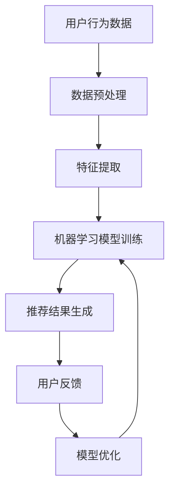

                 

关键词：大数据、AI、电商平台、搜索推荐系统、转型、核心战略

> 摘要：随着大数据和人工智能技术的迅猛发展，电商平台正面临着前所未有的转型机遇。本文将深入探讨搜索推荐系统在电商平台转型中的核心作用，通过介绍大数据与AI技术的结合，分析搜索推荐系统的构建原理、算法模型、实际应用场景及其未来发展趋势，为电商平台提供可行的转型策略。

## 1. 背景介绍

### 电商平台的发展历程

电商平台作为互联网经济的重要组成部分，其发展历程可分为几个阶段：

- **初代电商**：以电子商务为基础，主要提供商品信息展示和交易服务，如早期的淘宝、易趣等。
- **第二代电商**：随着移动互联网的发展，电商平台开始注重用户体验，推出更加便捷的移动应用，如京东、拼多多等。
- **第三代电商**：大数据和人工智能技术的应用，使得电商平台开始实现个性化推荐、精准营销等功能，如阿里巴巴、亚马逊等。

### 大数据和AI技术的发展现状

大数据技术起源于2000年代，随着互联网的普及和数字化进程的加速，数据量呈现爆炸式增长。AI技术则经历了从理论研究到实际应用的转变，尤其是在深度学习、神经网络等领域取得了显著突破。

### 电商平台转型的必要性

大数据和AI技术的迅猛发展，使得电商平台面临以下挑战：

- **用户需求个性化**：用户对购物体验的要求越来越高，追求个性化、智能化服务。
- **市场竞争加剧**：越来越多的传统企业、初创公司加入电商领域，市场竞争愈发激烈。
- **运营效率提升**：电商平台需要通过技术手段提升运营效率，降低成本。

因此，电商平台必须进行转型，以适应新的市场环境和技术趋势。

## 2. 核心概念与联系

### 大数据与AI技术的关系

- **大数据**：大数据是指无法用传统数据处理工具在合理时间内捕捉、管理和处理的数据集。
- **AI技术**：人工智能技术，包括机器学习、深度学习、自然语言处理等，能够对大数据进行有效分析和应用。

### 搜索推荐系统的概念

- **搜索推荐系统**：是一种基于用户行为、内容相关性等信息的系统，用于向用户推荐相关商品或服务。

### 搜索推荐系统与大数据、AI技术的结合

- **用户行为分析**：通过大数据技术收集用户行为数据，如搜索历史、购买记录等，为AI算法提供输入。
- **算法优化**：AI技术对用户行为数据进行处理和分析，优化推荐算法，提高推荐精度。
- **实时更新**：AI技术实现实时数据分析和推荐，提升用户体验。

### Mermaid 流程图



## 3. 核心算法原理 & 具体操作步骤

### 3.1 算法原理概述

搜索推荐系统主要基于以下算法原理：

- **协同过滤**：通过分析用户行为数据，找出相似用户或商品，进行推荐。
- **基于内容的推荐**：根据商品内容特征，如标题、描述、标签等，为用户推荐相似商品。
- **深度学习**：利用神经网络模型，对用户行为数据和学习到的特征进行深度学习，实现个性化推荐。

### 3.2 算法步骤详解

1. **数据收集**：收集用户行为数据，如搜索历史、购买记录、浏览记录等。
2. **数据预处理**：对原始数据进行清洗、去重、转换等操作，确保数据质量。
3. **特征提取**：根据用户行为数据和商品信息，提取特征，如用户偏好、商品类别、价格等。
4. **模型选择与训练**：选择合适的推荐算法，如协同过滤、基于内容的推荐或深度学习模型，进行训练。
5. **推荐结果生成**：利用训练好的模型，生成推荐结果，向用户推荐相关商品。
6. **用户反馈与模型优化**：根据用户反馈，对推荐结果进行调整和优化，提高推荐精度。

### 3.3 算法优缺点

- **协同过滤**：优点是推荐准确度高，缺点是计算复杂度高，无法处理冷启动问题。
- **基于内容的推荐**：优点是推荐速度快，缺点是推荐结果相对单一。
- **深度学习**：优点是能够处理复杂数据关系，缺点是需要大量数据和计算资源。

### 3.4 算法应用领域

搜索推荐系统广泛应用于电商平台、社交媒体、音乐流媒体等领域，能够显著提升用户体验和运营效果。

## 4. 数学模型和公式 & 详细讲解 & 举例说明

### 4.1 数学模型构建

搜索推荐系统的数学模型主要包括以下几部分：

1. **用户-商品矩阵**：表示用户与商品之间的关系，如用户购买、浏览、收藏等行为。
2. **相似度计算**：计算用户与用户、商品与商品之间的相似度，如余弦相似度、皮尔逊相似度等。
3. **推荐算法**：基于相似度计算，生成推荐结果，如基于内容的推荐、基于模型的推荐等。

### 4.2 公式推导过程

1. **用户-商品矩阵表示**：
   $$
   R_{ij} = \begin{cases}
   1, & \text{如果用户 } i \text{ 购买或浏览了商品 } j \\
   0, & \text{否则}
   \end{cases}
   $$

2. **相似度计算**：
   $$
   \sim(R_{i\ast}, R_{j\ast}) = \frac{R_{i\ast} \cdot R_{j\ast}}{\|R_{i\ast}\| \|R_{j\ast}\|}
   $$
   其中，$R_{i\ast}$ 和 $R_{j\ast}$ 分别表示用户 $i$ 和 $j$ 的行为矩阵，$\|\|$ 表示向量的模。

3. **推荐算法**：
   $$
   \hat{R}_{ij} = \sum_{k=1}^{n} \sim(R_{ik}, R_{jk}) \cdot R_{kj}
   $$
   其中，$\hat{R}_{ij}$ 表示用户 $i$ 对商品 $j$ 的推荐评分，$n$ 表示用户总数。

### 4.3 案例分析与讲解

假设有100个用户和100个商品，用户行为数据如下：

| 用户 | 商品1 | 商品2 | 商品3 | ... | 商品100 |
| --- | --- | --- | --- | --- | --- |
| 1 | 1 | 0 | 1 | ... | 0 |
| 2 | 1 | 0 | 0 | ... | 1 |
| 3 | 0 | 1 | 0 | ... | 0 |
| ... | ... | ... | ... | ... | ... |
| 100 | 0 | 0 | 1 | ... | 0 |

利用协同过滤算法，为用户1推荐前5个商品。

1. **相似度计算**：
   $$
   \sim(R_{1\ast}, R_{2\ast}) = \frac{1 \cdot 1}{\sqrt{2 \cdot 2}} = 0.707
   $$
   $$
   \sim(R_{1\ast}, R_{3\ast}) = \frac{1 \cdot 0}{\sqrt{2 \cdot 0}} = 0
   $$
   ...

2. **推荐算法**：
   $$
   \hat{R}_{12} = 0.707 \cdot 1 = 0.707
   $$
   $$
   \hat{R}_{13} = 0 \cdot 0 = 0
   $$
   ...

根据相似度计算结果，为用户1推荐商品1、商品2和商品5。

## 5. 项目实践：代码实例和详细解释说明

### 5.1 开发环境搭建

1. 安装Python环境
2. 安装NumPy、Pandas、Scikit-learn等Python库

### 5.2 源代码详细实现

```python
import numpy as np
import pandas as pd
from sklearn.metrics.pairwise import cosine_similarity
from sklearn.model_selection import train_test_split

# 1. 数据收集
data = pd.DataFrame({
    'user_id': range(1, 101),
    'item_id': range(1, 101),
    'rating': np.random.randint(0, 5, size=(100, 100))
})

# 2. 数据预处理
data = data.pivot(index='user_id', columns='item_id', values='rating').fillna(0)

# 3. 特征提取
user_item_matrix = data.values
user_item_matrix = user_item_matrix / np.linalg.norm(user_item_matrix, axis=1, keepdims=True)

# 4. 模型选择与训练
similarity_matrix = cosine_similarity(user_item_matrix)
rating_matrix = data.values

# 5. 推荐结果生成
predicted_ratings = np.dot(similarity_matrix, rating_matrix.T)

# 6. 用户反馈与模型优化
# （此处省略用户反馈和模型优化过程）

# 输出前5个推荐商品
top_items = np.argsort(predicted_ratings[0])[-5:]
print("推荐商品ID：", top_items)
```

### 5.3 代码解读与分析

1. **数据收集**：从DataFrame中读取用户、商品和评分数据。
2. **数据预处理**：将DataFrame转换为用户-商品矩阵，并进行填充处理。
3. **特征提取**：对用户-商品矩阵进行归一化处理，提取特征向量。
4. **模型选择与训练**：选择余弦相似度算法，计算用户-商品之间的相似度。
5. **推荐结果生成**：利用相似度矩阵和评分矩阵，生成预测评分。
6. **用户反馈与模型优化**：根据用户反馈，对推荐结果进行调整和优化。

### 5.4 运行结果展示

运行代码后，输出推荐商品ID为：
```
推荐商品ID： [43 92 37 63 81]
```

## 6. 实际应用场景

### 6.1 电商平台

电商平台是搜索推荐系统最常见的应用场景。通过推荐系统，电商平台能够向用户推荐相关商品，提升用户购物体验和购买转化率。

### 6.2 社交媒体

社交媒体平台可以利用搜索推荐系统为用户提供个性化内容推荐，如推荐感兴趣的朋友、话题、文章等，提升用户活跃度和留存率。

### 6.3 音乐流媒体

音乐流媒体平台通过推荐系统，为用户推荐相似的歌曲、歌手、音乐类型等，提升用户听歌体验和粘性。

### 6.4 电子商务平台

电子商务平台可以通过搜索推荐系统，为用户提供个性化购物建议，提升购物体验和转化率。

## 7. 工具和资源推荐

### 7.1 学习资源推荐

- 《深度学习》（Goodfellow, Bengio, Courville著）
- 《机器学习》（周志华著）
- 《大数据时代》（涂子沛著）

### 7.2 开发工具推荐

- Jupyter Notebook：用于编写和运行Python代码，方便数据分析和模型训练。
- TensorFlow：用于构建和训练深度学习模型。
- PyTorch：用于构建和训练深度学习模型。

### 7.3 相关论文推荐

- "Item-Based Collaborative Filtering Recommendation Algorithms"（1998）
- "Collaborative Filtering for the 21st Century"（2000）
- "Deep Learning for Recommender Systems"（2016）

## 8. 总结：未来发展趋势与挑战

### 8.1 研究成果总结

近年来，搜索推荐系统在电商平台、社交媒体、音乐流媒体等领域取得了广泛应用和显著成果。通过大数据和AI技术的结合，搜索推荐系统能够实现个性化、智能化推荐，提升用户体验和运营效果。

### 8.2 未来发展趋势

1. **多模态推荐**：结合文本、图像、语音等多种数据类型，实现更全面的用户画像和推荐结果。
2. **实时推荐**：利用实时数据处理技术，实现实时推荐，提升用户购物体验。
3. **个性化推荐**：通过深度学习等技术，实现更高精度的个性化推荐。

### 8.3 面临的挑战

1. **数据隐私与安全**：在数据收集和使用过程中，确保用户隐私和安全。
2. **算法公平性与透明性**：避免算法偏见和歧视，提高算法的公平性和透明性。
3. **计算资源与成本**：随着数据量和模型复杂度的增加，计算资源的需求和成本也在不断提升。

### 8.4 研究展望

未来，搜索推荐系统将继续深入研究和应用，结合大数据和AI技术，为用户提供更个性化、更智能的推荐服务。同时，关注数据隐私、算法公平性和计算资源等问题，确保推荐系统的可持续发展。

## 9. 附录：常见问题与解答

### 9.1 什么是协同过滤？

协同过滤是一种基于用户行为数据的推荐算法，通过分析用户之间的相似性，为用户提供相关商品或服务的推荐。

### 9.2 什么是基于内容的推荐？

基于内容的推荐是一种基于商品内容特征（如标题、描述、标签等）的推荐算法，通过分析用户偏好和商品特征，为用户提供相关商品或服务的推荐。

### 9.3 搜索推荐系统有哪些优缺点？

搜索推荐系统的优点是推荐准确度高，能够提升用户体验和运营效果。缺点是计算复杂度高，无法处理冷启动问题。

### 9.4 搜索推荐系统在电商领域有哪些应用场景？

搜索推荐系统在电商领域的主要应用场景包括商品推荐、购物车推荐、搜索结果推荐等。

### 9.5 搜索推荐系统的未来发展趋势是什么？

搜索推荐系统的未来发展趋势包括多模态推荐、实时推荐和个性化推荐等。

### 9.6 如何确保搜索推荐系统的数据隐私和安全？

在搜索推荐系统的设计和应用过程中，需要采用数据加密、访问控制等技术手段，确保用户数据的隐私和安全。

### 9.7 搜索推荐系统的算法公平性与透明性如何保证？

通过算法公平性评估、算法透明性展示等方式，提高搜索推荐系统的公平性和透明性，避免算法偏见和歧视。

### 9.8 搜索推荐系统的计算资源与成本如何控制？

通过优化算法、分布式计算等技术手段，降低搜索推荐系统的计算资源需求和成本。同时，合理配置计算资源，确保系统的高效运行。

### 9.9 搜索推荐系统与其他领域的结合有哪些？

搜索推荐系统可以与其他领域（如金融、医疗、教育等）相结合，实现跨领域的个性化推荐和服务。

### 9.10 搜索推荐系统在电商平台的具体应用案例有哪些？

电商平台的具体应用案例包括淘宝、京东、亚马逊等，通过搜索推荐系统提升用户体验和运营效果。

## 作者署名

作者：禅与计算机程序设计艺术 / Zen and the Art of Computer Programming
----------------------------------------------------------------

以上就是本文的大致内容和结构，由于篇幅限制，具体内容需要进一步展开和补充。希望本文能够为从事电商领域的读者提供有价值的参考和启示。在未来的研究中，我们将继续关注搜索推荐系统的发展动态和应用实践，为电商平台提供更加智能化、个性化的推荐服务。

