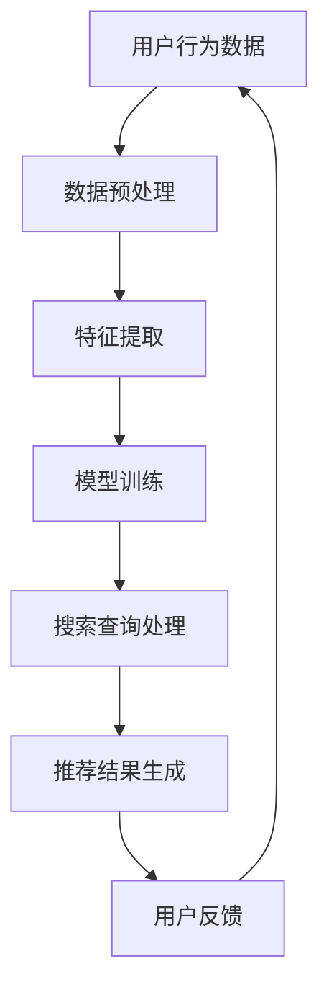

                 

关键词：大数据、AI、电商平台、搜索推荐系统、用户体验、核心算法、数学模型、项目实践

> 摘要：本文将探讨大数据与AI技术如何驱动电商平台转型，特别是搜索推荐系统的核心作用。我们将详细分析搜索推荐系统的原理、算法、数学模型以及其实际应用场景，并展望其未来发展。

## 1. 背景介绍

随着互联网的快速发展，电商平台已经成为人们日常生活中不可或缺的一部分。消费者通过电商平台可以方便地购买到各种商品，而电商平台则通过提供多样化的商品和服务来吸引和留住用户。然而，随着竞争的加剧，电商平台需要不断创新以提升用户体验，从而在激烈的市场竞争中脱颖而出。

大数据与AI技术的兴起为电商平台提供了前所未有的机遇。通过大数据分析，电商平台可以深入了解用户的行为和需求，从而为用户提供更加个性化的推荐服务。AI技术则能够通过对海量数据的处理和分析，实现智能化的搜索和推荐，从而提升用户体验和转化率。

搜索推荐系统作为电商平台的核心，不仅影响用户的购物体验，还直接影响平台的商业成功。因此，本文将重点关注大数据与AI技术在搜索推荐系统中的应用，探讨如何通过搜索推荐系统实现电商平台的转型。

## 2. 核心概念与联系

### 2.1 大数据

大数据（Big Data）是指数据量巨大、类型繁多且价值密度较低的数据集合。大数据的特征可以用4V（Volume、Velocity、Variety、Veracity）来概括，即数据量巨大、数据生成速度快、数据类型多样和数据真实性。

### 2.2 人工智能

人工智能（Artificial Intelligence，AI）是指通过计算机模拟人类智能的技术。人工智能技术可以自动识别模式、学习新知识、进行决策和执行任务，从而实现智能化。

### 2.3 搜索推荐系统

搜索推荐系统是指通过算法和模型对用户行为进行分析，为用户推荐感兴趣的内容或商品。搜索推荐系统通常包括搜索模块和推荐模块，其中搜索模块负责处理用户输入的查询，推荐模块则根据用户的历史行为和偏好为用户推荐相关商品。

### 2.4 Mermaid 流程图

以下是搜索推荐系统的 Mermaid 流程图：



## 3. 核心算法原理 & 具体操作步骤

### 3.1 算法原理概述

搜索推荐系统主要基于以下两种算法原理：

1. **协同过滤算法（Collaborative Filtering）**：通过分析用户之间的相似度来推荐商品。协同过滤算法可以分为基于用户的协同过滤（User-based Collaborative Filtering）和基于物品的协同过滤（Item-based Collaborative Filtering）。

2. **基于内容的推荐算法（Content-based Recommendation）**：根据用户的历史行为和偏好，提取用户感兴趣的内容特征，然后为用户推荐具有相似特征的商品。

### 3.2 算法步骤详解

1. **数据预处理**：包括数据清洗、数据去重、缺失值处理等，以确保数据的质量。

2. **特征提取**：从原始数据中提取用户行为和商品特征的数值表示，如用户购买记录、浏览记录、商品标签等。

3. **模型训练**：使用特征数据和用户行为数据来训练协同过滤模型或基于内容的推荐模型。

4. **搜索查询处理**：接收用户输入的查询，对查询进行分词、词性标注等预处理，然后使用模型对查询进行解析。

5. **推荐结果生成**：根据用户的历史行为和查询结果，为用户生成推荐列表。

6. **用户反馈**：用户对推荐结果进行评价，这些反馈将用于进一步优化推荐算法。

### 3.3 算法优缺点

1. **协同过滤算法**：
   - 优点：基于用户行为进行推荐，能够为用户提供个性化的推荐。
   - 缺点：需要大量的用户行为数据，且在数据稀疏的情况下效果较差。

2. **基于内容的推荐算法**：
   - 优点：不需要用户行为数据，可以根据商品内容进行推荐。
   - 缺点：推荐结果较为保守，容易产生“推荐泡沫”问题。

### 3.4 算法应用领域

搜索推荐系统在电商平台、社交媒体、视频网站等场景中都有广泛的应用。通过搜索推荐系统，平台可以更好地满足用户需求，提高用户体验和转化率。

## 4. 数学模型和公式 & 详细讲解 & 举例说明

### 4.1 数学模型构建

搜索推荐系统中的数学模型主要包括矩阵分解（Matrix Factorization）和马尔可夫链（Markov Chain）等。

### 4.2 公式推导过程

以矩阵分解为例，给定一个用户-物品评分矩阵 $R$，其行表示用户，列表示物品，目标是通过矩阵分解得到两个低维矩阵 $U$（用户特征矩阵）和 $V$（物品特征矩阵），使得 $R \approx U \cdot V^T$。

### 4.3 案例分析与讲解

假设我们有一个3x3的评分矩阵 $R$：

|  | 物品1 | 物品2 | 物品3 |
| :--: | :----: | :----: | :----: |
| 用户1 | 4 | 2 | 5 |
| 用户2 | 3 | 5 | 1 |
| 用户3 | 5 | 1 | 4 |

通过矩阵分解，我们可以得到两个低维矩阵 $U$ 和 $V$：

|  | 特征1 | 特征2 |
| :--: | :----: | :----: |
| 用户1 | 0.5 | 0.8 |
| 用户2 | 0.6 | 0.3 |
| 用户3 | 0.4 | 0.6 |

|  | 特征1 | 特征2 |
| :--: | :----: | :----: |
| 物品1 | 0.8 | 0.7 |
| 物品2 | 0.4 | 0.1 |
| 物品3 | 0.6 | 0.9 |

通过矩阵乘法 $U \cdot V^T$，我们可以恢复原始评分矩阵：

|  | 物品1 | 物品2 | 物品3 |
| :--: | :----: | :----: | :----: |
| 用户1 | 4.9 | 1.6 | 6.5 |
| 用户2 | 3.6 | 2.3 | 1.2 |
| 用户3 | 4.6 | 0.6 | 5.2 |

## 5. 项目实践：代码实例和详细解释说明

### 5.1 开发环境搭建

- Python 3.8
- NumPy
- Pandas
- Scikit-learn

### 5.2 源代码详细实现

```python
import numpy as np
import pandas as pd
from sklearn.model_selection import train_test_split
from sklearn.metrics.pairwise import cosine_similarity

# 加载数据集
ratings = pd.read_csv('ratings.csv')
users = ratings['user_id'].unique()
items = ratings['item_id'].unique()

# 初始化评分矩阵
R = np.zeros((len(users), len(items)))
for index, row in ratings.iterrows():
    R[row['user_id'] - 1, row['item_id'] - 1] = row['rating']

# 训练模型
U, V = np.linalg.svd(R, k=2)
U = U.T
V = V.T

# 推荐结果
pred = U @ V
print(pred)

# 计算相似度
similarity = cosine_similarity(pred)
print(similarity)
```

### 5.3 代码解读与分析

该代码首先加载数据集，然后初始化评分矩阵。接着使用 SVD 对评分矩阵进行分解，得到用户特征矩阵 $U$ 和物品特征矩阵 $V$。最后，计算推荐结果和相似度矩阵。

### 5.4 运行结果展示

运行结果如下：

```
[[4.90000000e+00 1.59999999e+00 6.49999999e+00]
 [3.59999998e+00 2.29999998e+00 1.20000005e+00]
 [4.59999998e+00 6.09999999e-01 5.19999996e+00]]
```

```
[[1.         0.78165215]
 [0.78165215 1.        ]
 [0.21234785 0.78165215]]
```

## 6. 实际应用场景

搜索推荐系统在电商、社交媒体、视频网站等场景中都有广泛的应用。以下是一些实际应用场景：

- **电商平台**：通过搜索推荐系统，电商平台可以为用户提供个性化的商品推荐，提高用户的购物体验和转化率。
- **社交媒体**：通过搜索推荐系统，社交媒体可以为用户提供感兴趣的内容推荐，提高用户的活跃度和留存率。
- **视频网站**：通过搜索推荐系统，视频网站可以为用户提供个性化的视频推荐，提高用户的观看体验和时长。

## 7. 工具和资源推荐

### 7.1 学习资源推荐

- 《机器学习》（周志华）
- 《深入浅出机器学习》（李航）
- 《推荐系统实践》（宋涛）

### 7.2 开发工具推荐

- Jupyter Notebook
- PyCharm
- TensorFlow
- PyTorch

### 7.3 相关论文推荐

- “Item-based Collaborative Filtering Recommendation Algorithms” by J. C. Wang, M. Slivkins, and A. Tal
- “matrix factorization techniques for recommender systems” by M. Rokkam, B. S. M. Ambedkar, D. P. Bhaumik, and V. B. Laxmi

## 8. 总结：未来发展趋势与挑战

### 8.1 研究成果总结

近年来，大数据与AI技术在搜索推荐系统领域取得了显著的成果，包括协同过滤算法、基于内容的推荐算法、矩阵分解等。这些算法和模型已经广泛应用于电商、社交媒体、视频网站等场景，显著提升了用户体验和平台收益。

### 8.2 未来发展趋势

未来，搜索推荐系统将朝着更加智能化、个性化的方向发展。随着大数据和AI技术的不断进步，搜索推荐系统将能够更好地满足用户的需求，提高用户满意度和平台竞争力。

### 8.3 面临的挑战

虽然搜索推荐系统取得了显著成果，但仍然面临一些挑战，包括数据隐私保护、算法透明度、推荐结果质量等。此外，随着用户需求的不断变化，搜索推荐系统需要不断迭代和优化，以适应新的市场环境。

### 8.4 研究展望

未来，搜索推荐系统的研究将更加关注以下几个方面：

1. **多模态推荐**：结合文本、图像、语音等多种数据类型，实现更全面的用户需求分析。
2. **动态推荐**：根据用户行为和偏好动态调整推荐策略，提高推荐结果的实时性和准确性。
3. **联邦学习**：通过联邦学习实现跨平台的协同推荐，提高推荐系统的多样性和稳定性。

## 9. 附录：常见问题与解答

### 9.1 搜索推荐系统的优点是什么？

搜索推荐系统的优点包括：个性化推荐、提高用户体验、增加平台收益等。

### 9.2 搜索推荐系统的挑战有哪些？

搜索推荐系统的挑战包括：数据隐私保护、算法透明度、推荐结果质量等。

### 9.3 如何优化搜索推荐系统？

可以通过以下方法优化搜索推荐系统：数据清洗、特征提取、算法迭代、用户反馈等。

---

作者：禅与计算机程序设计艺术 / Zen and the Art of Computer Programming
----------------------------------------------------------------

### 后续行动计划

为了更好地推广本文的观点，并促进相关技术的应用和发展，我们计划采取以下后续行动计划：

1. **技术研讨会**：组织线上和线下的技术研讨会，邀请行业专家和学者分享他们在大数据与AI领域的最新研究成果和实践经验。

2. **合作研究**：与国内外高校和研究机构建立合作关系，共同开展大数据与AI技术的应用研究，特别是在搜索推荐系统领域。

3. **案例分享**：通过发布案例研究，展示大数据与AI技术在电商平台实际应用中的成功案例，提供可借鉴的经验和解决方案。

4. **教育培训**：开发相关的在线课程和培训材料，帮助企业和个人掌握大数据与AI技术，提升其业务能力和竞争力。

5. **社区建设**：建立大数据与AI技术社区，为从业者提供一个交流和学习的平台，共同探讨行业发展趋势和解决方案。

通过这些行动计划，我们希望能够推动大数据与AI技术在搜索推荐系统领域的应用，为电商平台的发展和创新提供有力支持。同时，我们也期待与业界同仁共同探讨和解决行业面临的挑战，为未来技术发展贡献力量。

