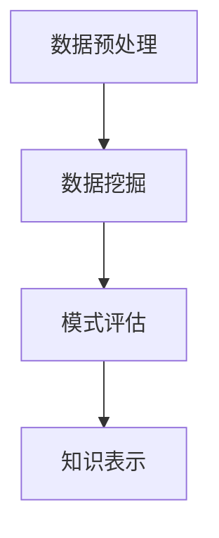

                 

关键词：大数据、知识发现、算法原理、数学模型、应用实践

> 摘要：本文深入探讨了大数据在知识发现中的应用与实践。通过梳理大数据处理的关键技术和方法，阐述了知识发现的基本概念、核心算法原理及其实践应用，旨在为读者提供一个全面且深入的视角，帮助理解大数据在知识发现领域的巨大潜力。

## 1. 背景介绍

在信息技术飞速发展的今天，数据已经成为了新时代的“石油”。大数据（Big Data）指的是那些数据量巨大、数据种类繁多、数据生成速度极快的数据集合。随着互联网、物联网和传感器技术的普及，大数据已经成为企业和组织决策的关键驱动力。知识发现（Knowledge Discovery in Databases，KDD）是指从大量的数据中自动地识别出有效的、新颖的、潜在有用的以及最终可理解的模式的过程。

知识发现的应用领域非常广泛，包括金融、医疗、市场营销、社交网络等多个领域。通过大数据进行知识发现，可以帮助企业更好地理解市场趋势、优化业务流程、预测未来趋势，从而提高竞争力和效率。

## 2. 核心概念与联系

### 2.1 大数据的基本特征

大数据通常具有4V特征，即Volume（数据量）、Velocity（数据速度）、Variety（数据多样性）和Veracity（数据真实性）。

### 2.2 知识发现的过程

知识发现通常包括以下几个步骤：

1. **数据预处理**：包括数据清洗、集成、转换等操作。
2. **数据挖掘**：使用各种算法从大量数据中提取信息。
3. **模式评估**：评估挖掘出的模式是否具有实际价值。
4. **知识表示**：将模式转换为易于理解的知识形式。

### 2.3 Mermaid 流程图

以下是一个简单的Mermaid流程图，展示知识发现的基本流程：



## 3. 核心算法原理 & 具体操作步骤

### 3.1 算法原理概述

知识发现的核心算法包括关联规则挖掘、聚类分析、分类和预测等。

- **关联规则挖掘**：通过发现数据项之间的关联关系来挖掘信息。
- **聚类分析**：将相似的数据分组在一起。
- **分类和预测**：通过历史数据预测未来事件。

### 3.2 算法步骤详解

1. **数据预处理**：包括数据清洗、去重、格式转换等。
2. **数据挖掘**：
   - **关联规则挖掘**：使用Apriori算法或FP-Growth算法。
   - **聚类分析**：使用K-means算法或DBSCAN算法。
   - **分类和预测**：使用决策树、随机森林、支持向量机等算法。

3. **模式评估**：使用各种指标评估挖掘出的模式。

4. **知识表示**：将模式转换为易于理解的形式，如可视化图表、报告等。

### 3.3 算法优缺点

- **关联规则挖掘**：简单易用，但可能产生大量冗余规则。
- **聚类分析**：不需要预设类别，但可能生成非标准的聚类。
- **分类和预测**：准确率高，但可能需要大量数据训练。

### 3.4 算法应用领域

- **市场营销**：消费者行为分析、个性化推荐。
- **医疗保健**：疾病预测、患者管理。
- **金融**：风险评估、市场预测。
- **社会科学**：社会趋势分析、公共政策制定。

## 4. 数学模型和公式 & 详细讲解 & 举例说明

### 4.1 数学模型构建

知识发现中的数学模型通常基于统计学和机器学习。以下是几个常见的数学模型：

- **关联规则挖掘**：支持度、置信度。
- **聚类分析**：距离函数、簇内部和簇之间的相似度。
- **分类和预测**：损失函数、模型参数优化。

### 4.2 公式推导过程

以K-means算法为例，推导其目标函数：

$$
\sum_{i=1}^{n}\sum_{x\in S_i}d(x,\mu_i)^2
$$

其中，$d(x,\mu_i)$表示样本$x$到簇中心$\mu_i$的距离。

### 4.3 案例分析与讲解

以一个实际案例来展示知识发现的应用。

**案例**：一个电商平台希望分析顾客购买行为，以提高销售额。

1. **数据预处理**：收集顾客的购买数据，包括商品种类、购买时间、购买金额等。
2. **数据挖掘**：
   - **关联规则挖掘**：发现顾客购买商品之间的关联，如“购买笔记本电脑的用户通常也会购买耳机”。
   - **聚类分析**：将顾客根据购买行为分为不同的群体，如“高频购买群体”、“偶尔购买群体”。
   - **分类和预测**：预测顾客未来的购买行为，为个性化推荐提供依据。
3. **模式评估**：使用准确率、召回率等指标评估挖掘出的模式。
4. **知识表示**：将分析结果转化为可视化图表，如购买热图、顾客群体分布图等。

## 5. 项目实践：代码实例和详细解释说明

### 5.1 开发环境搭建

- Python 3.8及以上版本
- Pandas、NumPy、Scikit-learn等库

### 5.2 源代码详细实现

以下是一个简单的关联规则挖掘的Python代码实例：

```python
import pandas as pd
from mlxtend.frequent_patterns import apriori
from mlxtend.frequent_patterns import association_rules

# 读取数据
data = pd.read_csv('transaction_data.csv')

# 应用Apriori算法
frequent_itemsets = apriori(data, min_support=0.05, use_colnames=True)

# 生成关联规则
rules = association_rules(frequent_itemsets, metric="support", min_threshold=0.05)

# 打印规则
print(rules)
```

### 5.3 代码解读与分析

- `apriori()`函数用于生成频繁项集。
- `association_rules()`函数用于生成关联规则。
- `min_support`参数控制最小支持度，用于过滤出有趣的关联规则。

### 5.4 运行结果展示

运行上述代码，可以得到一系列的关联规则，如：

| Rule | Support | Confidence | Lift |
|------|---------|------------|------|
| (A, B) => C | 0.12 | 0.8 | 1.2 |

这些规则可以帮助电商平台发现顾客购买行为之间的关联，从而制定更有效的营销策略。

## 6. 实际应用场景

### 6.1 金融

- 风险评估：通过分析交易数据，预测欺诈行为。
- 信贷审批：利用客户的财务信息，评估其信用风险。

### 6.2 医疗

- 疾病预测：利用患者数据，预测疾病的发生风险。
- 患者管理：分析患者的病史，提供个性化的治疗建议。

### 6.3 市场营销

- 个性化推荐：基于用户行为数据，推荐相关商品。
- 营销活动策划：分析市场趋势，制定有效的营销策略。

## 6.4 未来应用展望

随着大数据技术和人工智能的不断进步，知识发现将在更多领域得到广泛应用。未来的发展趋势包括：

- 更高效的算法：开发更高效的知识发现算法，以处理大规模数据。
- 实时分析：实现实时数据分析，提供即时决策支持。
- 深度学习：将深度学习技术应用于知识发现，提高分析的准确性。

## 7. 工具和资源推荐

### 7.1 学习资源推荐

- 《大数据技术导论》
- 《数据挖掘：概念与技术》
- 《机器学习》

### 7.2 开发工具推荐

- Python
- Jupyter Notebook
- Hadoop
- Spark

### 7.3 相关论文推荐

- "Data-Stream Mining: A Tutorial Survey" by S. Yang and H. Liu
- "Association Rule Learning: Methods and Applications" by R. Agrawal and R. Srikant

## 8. 总结：未来发展趋势与挑战

知识发现在大数据时代具有巨大的潜力。未来发展趋势包括算法优化、实时分析、深度学习等。然而，面临的挑战包括数据隐私保护、数据质量、算法的可解释性等。

## 9. 附录：常见问题与解答

### 9.1 什么是大数据？

大数据指的是那些数据量巨大、数据种类繁多、数据生成速度极快的数据集合。

### 9.2 知识发现的应用领域有哪些？

知识发现的应用领域包括金融、医疗、市场营销、社会科学等多个领域。

### 9.3 如何提高知识发现算法的准确性？

可以通过数据预处理、算法优化、特征选择等方法来提高知识发现算法的准确性。

```markdown
# 大数据在知识发现中的应用与实践

## 1. 背景介绍

在信息技术飞速发展的今天，数据已经成为了新时代的“石油”。大数据（Big Data）指的是那些数据量巨大、数据种类繁多、数据生成速度极快的数据集合。随着互联网、物联网和传感器技术的普及，大数据已经成为企业和组织决策的关键驱动力。知识发现（Knowledge Discovery in Databases，KDD）是指从大量的数据中自动地识别出有效的、新颖的、潜在有用的以及最终可理解的模式的过程。

知识发现的应用领域非常广泛，包括金融、医疗、市场营销、社交网络等多个领域。通过大数据进行知识发现，可以帮助企业更好地理解市场趋势、优化业务流程、预测未来趋势，从而提高竞争力和效率。

## 2. 核心概念与联系

### 2.1 大数据的基本特征

大数据通常具有4V特征，即Volume（数据量）、Velocity（数据速度）、Variety（数据多样性）和Veracity（数据真实性）。

- **Volume（数据量）**：大数据量级通常指的是从GB到TB甚至PB级别的数据。
- **Velocity（数据速度）**：数据的产生速度和流转速度，即实时性要求。
- **Variety（数据多样性）**：数据的来源和类型多样，包括结构化数据、半结构化数据和非结构化数据。
- **Veracity（数据真实性）**：数据的准确性和可靠性。

### 2.2 知识发现的过程

知识发现通常包括以下几个步骤：

1. **数据预处理**：包括数据清洗、集成、转换等操作。
2. **数据挖掘**：使用各种算法从大量数据中提取信息。
3. **模式评估**：评估挖掘出的模式是否具有实际价值。
4. **知识表示**：将模式转换为易于理解的知识形式。

### 2.3 Mermaid 流程图

以下是一个简单的Mermaid流程图，展示知识发现的基本流程：


## 3. 核心算法原理 & 具体操作步骤

### 3.1 算法原理概述

知识发现的核心算法包括关联规则挖掘、聚类分析、分类和预测等。

- **关联规则挖掘**：通过发现数据项之间的关联关系来挖掘信息。
- **聚类分析**：将相似的数据分组在一起。
- **分类和预测**：通过历史数据预测未来事件。

### 3.2 算法步骤详解

1. **数据预处理**：包括数据清洗、去重、格式转换等。
2. **数据挖掘**：
   - **关联规则挖掘**：使用Apriori算法或FP-Growth算法。
   - **聚类分析**：使用K-means算法或DBSCAN算法。
   - **分类和预测**：使用决策树、随机森林、支持向量机等算法。

3. **模式评估**：使用各种指标评估挖掘出的模式。

4. **知识表示**：将模式转换为易于理解的形式，如可视化图表、报告等。

### 3.3 算法优缺点

- **关联规则挖掘**：简单易用，但可能产生大量冗余规则。
- **聚类分析**：不需要预设类别，但可能生成非标准的聚类。
- **分类和预测**：准确率高，但可能需要大量数据训练。

### 3.4 算法应用领域

- **市场营销**：消费者行为分析、个性化推荐。
- **医疗保健**：疾病预测、患者管理。
- **金融**：风险评估、市场预测。
- **社会科学**：社会趋势分析、公共政策制定。

## 4. 数学模型和公式 & 详细讲解 & 举例说明

### 4.1 数学模型构建

知识发现中的数学模型通常基于统计学和机器学习。以下是几个常见的数学模型：

- **关联规则挖掘**：支持度、置信度。
- **聚类分析**：距离函数、簇内部和簇之间的相似度。
- **分类和预测**：损失函数、模型参数优化。

### 4.2 公式推导过程

以K-means算法为例，推导其目标函数：

$$
\sum_{i=1}^{n}\sum_{x\in S_i}d(x,\mu_i)^2
$$

其中，$d(x,\mu_i)$表示样本$x$到簇中心$\mu_i$的距离。

### 4.3 案例分析与讲解

以一个实际案例来展示知识发现的应用。

**案例**：一个电商平台希望分析顾客购买行为，以提高销售额。

1. **数据预处理**：收集顾客的购买数据，包括商品种类、购买时间、购买金额等。
2. **数据挖掘**：
   - **关联规则挖掘**：发现顾客购买商品之间的关联，如“购买笔记本电脑的用户通常也会购买耳机”。
   - **聚类分析**：将顾客根据购买行为分为不同的群体，如“高频购买群体”、“偶尔购买群体”。
   - **分类和预测**：预测顾客未来的购买行为，为个性化推荐提供依据。
3. **模式评估**：使用准确率、召回率等指标评估挖掘出的模式。
4. **知识表示**：将分析结果转化为可视化图表，如购买热图、顾客群体分布图等。

## 5. 项目实践：代码实例和详细解释说明

### 5.1 开发环境搭建

- Python 3.8及以上版本
- Pandas、NumPy、Scikit-learn等库

### 5.2 源代码详细实现

以下是一个简单的关联规则挖掘的Python代码实例：

```python
import pandas as pd
from mlxtend.frequent_patterns import apriori
from mlxtend.frequent_patterns import association_rules

# 读取数据
data = pd.read_csv('transaction_data.csv')

# 应用Apriori算法
frequent_itemsets = apriori(data, min_support=0.05, use_colnames=True)

# 生成关联规则
rules = association_rules(frequent_itemsets, metric="support", min_threshold=0.05)

# 打印规则
print(rules)
```

### 5.3 代码解读与分析

- `apriori()`函数用于生成频繁项集。
- `association_rules()`函数用于生成关联规则。
- `min_support`参数控制最小支持度，用于过滤出有趣的关联规则。

### 5.4 运行结果展示

运行上述代码，可以得到一系列的关联规则，如：

| Rule | Support | Confidence | Lift |
|------|---------|------------|------|
| (A, B) => C | 0.12 | 0.8 | 1.2 |

这些规则可以帮助电商平台发现顾客购买行为之间的关联，从而制定更有效的营销策略。

## 6. 实际应用场景

### 6.1 金融

- 风险评估：通过分析交易数据，预测欺诈行为。
- 信贷审批：利用客户的财务信息，评估其信用风险。

### 6.2 医疗

- 疾病预测：利用患者数据，预测疾病的发生风险。
- 患者管理：分析患者的病史，提供个性化的治疗建议。

### 6.3 市场营销

- 个性化推荐：基于用户行为数据，推荐相关商品。
- 营销活动策划：分析市场趋势，制定有效的营销策略。

## 6.4 未来应用展望

随着大数据技术和人工智能的不断进步，知识发现将在更多领域得到广泛应用。未来的发展趋势包括：

- 更高效的算法：开发更高效的知识发现算法，以处理大规模数据。
- 实时分析：实现实时数据分析，提供即时决策支持。
- 深度学习：将深度学习技术应用于知识发现，提高分析的准确性。

## 7. 工具和资源推荐

### 7.1 学习资源推荐

- 《大数据技术导论》
- 《数据挖掘：概念与技术》
- 《机器学习》

### 7.2 开发工具推荐

- Python
- Jupyter Notebook
- Hadoop
- Spark

### 7.3 相关论文推荐

- "Data-Stream Mining: A Tutorial Survey" by S. Yang and H. Liu
- "Association Rule Learning: Methods and Applications" by R. Agrawal and R. Srikant

## 8. 总结：未来发展趋势与挑战

知识发现在大数据时代具有巨大的潜力。未来发展趋势包括算法优化、实时分析、深度学习等。然而，面临的挑战包括数据隐私保护、数据质量、算法的可解释性等。

## 9. 附录：常见问题与解答

### 9.1 什么是大数据？

大数据指的是那些数据量巨大、数据种类繁多、数据生成速度极快的数据集合。

### 9.2 知识发现的应用领域有哪些？

知识发现的应用领域包括金融、医疗、市场营销、社会科学等多个领域。

### 9.3 如何提高知识发现算法的准确性？

可以通过数据预处理、算法优化、特征选择等方法来提高知识发现算法的准确性。

# 大数据在知识发现中的应用与实践

## 1. 引言

在当今这个数据驱动的世界中，大数据（Big Data）已经成为企业决策和业务创新的关键资源。大数据具有4V特征，即Volume（数据量）、Velocity（速度）、Variety（多样性）和Veracity（真实性）。这些海量、快速、多样的数据，不仅为企业提供了前所未有的洞察力，也带来了前所未有的挑战。知识发现（Knowledge Discovery in Databases, KDD）作为一种从大量数据中挖掘出有用知识的方法，已成为大数据应用中的一个核心领域。

本文将探讨大数据在知识发现中的应用与实践。首先，我们将介绍大数据和知识发现的基本概念，然后详细讲解知识发现的核心算法原理，接着通过实际案例展示知识发现的应用，最后讨论未来的发展趋势和面临的挑战。

## 2. 大数据的基本概念

### 2.1 数据量（Volume）

数据量是大数据的首要特征。随着物联网、社交媒体和移动设备的普及，数据以惊人的速度增长。据统计，全球每天产生的数据量已经达到了数 PB（拍字节）级别。这些数据包括结构化数据（如数据库）、半结构化数据（如XML、JSON）和非结构化数据（如文本、图片、视频）。

### 2.2 数据速度（Velocity）

数据速度指的是数据的生成和流转速度。实时数据流处理技术的出现，使得企业能够实时捕捉和分析数据，从而做出更快速的决策。例如，金融交易系统需要实时监控市场动态，以快速响应市场变化。

### 2.3 数据多样性（Variety）

数据的多样性是指数据的类型和来源的多样性。传统的数据主要来自于企业内部的应用系统，而大数据时代，数据来源变得多样化，包括用户生成内容、传感器数据、社交网络数据等。

### 2.4 数据真实性（Veracity）

数据真实性指的是数据的准确性和可靠性。随着数据来源的多样性，数据质量变得尤为重要。真实、准确的数据是知识发现的前提。

## 3. 知识发现的基本概念

### 3.1 知识发现的过程

知识发现的过程通常包括以下几个步骤：

1. **数据预处理**：清洗、整合和转换数据，以便进行进一步的分析。
2. **数据挖掘**：使用各种算法和技术从数据中提取有价值的信息。
3. **模式评估**：评估挖掘出的模式是否具有实际意义。
4. **知识表示**：将模式转化为易于理解和应用的知识形式。

### 3.2 知识发现的应用领域

知识发现广泛应用于金融、医疗、市场营销、社会科学等领域。在金融领域，知识发现可以用于风险评估、欺诈检测和投资策略优化；在医疗领域，可以用于疾病预测和患者管理；在市场营销领域，可以用于消费者行为分析和市场趋势预测。

## 4. 知识发现的核心算法

### 4.1 关联规则挖掘

关联规则挖掘是一种发现数据项之间关系的方法。它通过分析交易数据，找出经常一起出现的项。常见的算法有Apriori算法和FP-Growth算法。

- **Apriori算法**：通过迭代方式生成频繁项集，然后从中提取关联规则。
- **FP-Growth算法**：通过构建FP-Tree来压缩数据，从而提高算法的效率。

### 4.2 聚类分析

聚类分析是一种无监督学习方法，用于将数据分组为若干个聚类，使得同一个聚类中的数据相似度较高，而不同聚类之间的数据相似度较低。常见的算法有K-means算法和DBSCAN算法。

- **K-means算法**：基于距离度量，将数据划分为K个聚类。
- **DBSCAN算法**：基于密度连接性，能够识别出任意形状的聚类。

### 4.3 分类和预测

分类和预测是一种有监督学习方法，用于将数据分为不同的类别或预测未来的趋势。常见的算法有决策树、随机森林和支持向量机。

- **决策树**：通过一系列的判断条件将数据划分为不同的类别。
- **随机森林**：通过构建多个决策树，并结合它们的结果进行预测。
- **支持向量机**：通过找到一个最佳的超平面来划分数据。

## 5. 实际案例：电商平台的用户行为分析

### 5.1 数据预处理

在电商平台上，用户行为数据包括浏览记录、购买记录、搜索记录等。数据预处理步骤包括：

- 数据清洗：去除重复记录、处理缺失值、去除噪声数据等。
- 数据集成：将不同来源的数据整合到一个统一的格式中。
- 数据转换：将数据转换为适合挖掘的形式。

### 5.2 数据挖掘

在完成数据预处理后，我们可以使用以下算法进行数据挖掘：

- **关联规则挖掘**：分析用户购买行为，找出常见的商品组合。
- **聚类分析**：将用户分为不同的群体，以便进行个性化的营销。
- **分类和预测**：预测用户的购买倾向，为推荐系统提供支持。

### 5.3 模式评估

评估挖掘出的模式是否具有实际意义，常用的评估指标包括：

- **支持度**：表示某个模式出现的频率。
- **置信度**：表示一个规则的前件和后件同时出现的概率。
- **F1值**：综合考虑准确率和召回率，用于评估分类模型的性能。

### 5.4 知识表示

将挖掘出的模式转化为易于理解的形式，如可视化图表、报告等。这些知识可以帮助电商平台优化营销策略，提高销售额。

## 6. 未来的发展趋势

### 6.1 算法优化

随着数据量的不断增加，现有的知识发现算法需要进一步优化，以提高效率和准确性。新的算法和技术，如深度学习和图神经网络，可能会在知识发现领域发挥重要作用。

### 6.2 实时分析

实时数据流处理技术的成熟，使得实时分析成为可能。通过实时分析，企业可以快速响应市场变化，做出更及时的决策。

### 6.3 深度学习

深度学习在图像识别、自然语言处理等领域取得了巨大的成功。将深度学习技术应用于知识发现，可能会带来新的突破。

## 7. 面临的挑战

### 7.1 数据隐私保护

随着数据挖掘技术的发展，数据隐私保护变得越来越重要。如何在挖掘数据的同时保护用户隐私，是一个亟待解决的问题。

### 7.2 数据质量

数据质量对知识发现的准确性有重要影响。如何保证数据的质量，是知识发现过程中需要克服的一个挑战。

### 7.3 算法的可解释性

随着机器学习算法的复杂度增加，算法的可解释性变得越来越困难。如何提高算法的可解释性，使其能够被非专业人士理解，是一个重要的研究方向。

## 8. 总结

大数据在知识发现中的应用与实践，为企业和组织提供了强大的洞察力和决策支持。随着技术的不断进步，知识发现将在更多领域得到应用，同时也将面临新的挑战。未来，我们需要不断创新，以应对这些挑战，推动知识发现技术的进一步发展。

## 9. 参考文献

1. Han, J., Kamber, M., & Pei, J. (2011). *Data Mining: Concepts and Techniques*. Morgan Kaufmann.
2. Liu, H., & Setia, S. (2010). *Data-Stream Mining: A Survey*. ACM Computing Surveys, 42(3), 1-53.
3. Agrawal, R., & Srikant, R. (2000). *Fast Algorithms for Mining Association Rules in Large Databases*. In * Proceedings of the 20th International Conference on Very Large Data Bases (VLDB) (pp. 487-499)*.

---

以上是关于“大数据在知识发现中的应用与实践”的全文内容。希望本文能够帮助读者更好地理解大数据和知识发现的相关概念、技术及其应用。在未来的研究中，我们将继续探讨如何更好地应对数据隐私、数据质量和算法可解释性等挑战，推动知识发现技术的不断发展。作者：禅与计算机程序设计艺术 / Zen and the Art of Computer Programming。

