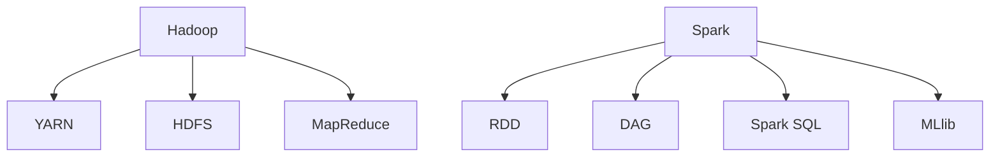

                 

 **关键词**：大数据处理，Hadoop，Spark，分布式计算，数据处理框架

> **摘要**：本文旨在探讨大数据处理框架Hadoop和Spark的应用，通过介绍它们的背景、核心概念、算法原理、数学模型以及实际应用，为读者提供全面深入的技术见解。

## 1. 背景介绍

随着互联网和物联网的快速发展，数据量呈现爆炸式增长。这种数据量级的变化带来了巨大的挑战，传统的数据处理技术已经难以应对。为了解决这一问题，大数据处理框架应运而生。Hadoop和Spark是目前最流行的大数据处理框架，它们各自具有独特的优势和适用场景。

Hadoop起源于Google的MapReduce模型，是一种分布式数据处理框架，主要用于大规模数据的存储和处理。Spark则是在Hadoop的基础上发展起来的，它引入了内存计算的概念，提供了更高的性能和更丰富的API。

## 2. 核心概念与联系

### 2.1 大数据处理的概念

大数据处理是指通过分布式计算和存储技术，对海量数据进行采集、存储、处理和分析的过程。

### 2.2 Hadoop的核心概念

- HDFS（Hadoop Distributed File System）：分布式文件系统，用于存储海量数据。
- MapReduce：数据处理模型，用于并行处理大规模数据。
- YARN（Yet Another Resource Negotiator）：资源管理系统，用于资源调度和分配。

### 2.3 Spark的核心概念

- RDD（Resilient Distributed Dataset）：弹性分布式数据集，是Spark的核心数据结构。
- DAG（Directed Acyclic Graph）：有向无环图，用于表示Spark的执行流程。
- Spark SQL：用于处理结构化数据的模块。
- MLlib：机器学习库。

### 2.4 Mermaid流程图



## 3. 核心算法原理 & 具体操作步骤

### 3.1 算法原理概述

Hadoop的核心算法是MapReduce，它将数据处理过程分为两个阶段：Map阶段和Reduce阶段。Map阶段对输入数据进行分组和映射，产生中间结果；Reduce阶段对中间结果进行汇总和计算，得到最终结果。

Spark的核心算法是基于内存的分布式计算模型，它将数据处理过程抽象为多个DAG。每个DAG包含多个阶段，每个阶段对数据进行处理和转换。

### 3.2 算法步骤详解

#### 3.2.1 Hadoop的MapReduce算法步骤

1. **输入**：读取输入数据，通常是文本文件。
2. **Map阶段**：对输入数据进行分组和映射，生成中间键值对。
3. **Shuffle阶段**：对中间结果进行分组和排序。
4. **Reduce阶段**：对中间结果进行汇总和计算，生成最终结果。

#### 3.2.2 Spark的计算流程

1. **创建RDD**：从HDFS或其他数据源读取数据，创建RDD。
2. **转换操作**：对RDD进行转换操作，如map、filter、reduce等。
3. **行动操作**：触发计算过程，如count、save等。

### 3.3 算法优缺点

#### 3.3.1 Hadoop的优缺点

- **优点**：适合处理大规模数据，具有良好的容错性和扩展性。
- **缺点**：处理速度较慢，不适合实时数据处理。

#### 3.3.2 Spark的优缺点

- **优点**：基于内存计算，处理速度快，适合实时数据处理。
- **缺点**：相对于Hadoop，扩展性较差。

### 3.4 算法应用领域

- **Hadoop**：主要用于大规模数据的存储和处理，如日志分析、搜索引擎等。
- **Spark**：主要用于实时数据处理和机器学习，如实时广告推荐、社交网络分析等。

## 4. 数学模型和公式 & 详细讲解 & 举例说明

### 4.1 数学模型构建

Hadoop的MapReduce算法可以用以下数学模型表示：

$$
\text{Map}(x) = f(x)
$$

$$
\text{Reduce}(\{f(x_1), f(x_2), ..., f(x_n)\}) = g(f(x_1), f(x_2), ..., f(x_n))
$$

其中，\(f(x)\) 表示映射函数，\(g(x_1, x_2, ..., x_n)\) 表示汇总函数。

Spark的算法模型可以用以下数学模型表示：

$$
\text{RDD} \xrightarrow{\text{transform}} \text{RDD}
$$

$$
\text{RDD} \xrightarrow{\text{action}} \text{result}
$$

其中，\(\text{transform}\) 表示转换操作，\(\text{action}\) 表示行动操作。

### 4.2 公式推导过程

Hadoop的MapReduce算法的推导过程如下：

1. **Map阶段**：对每个输入数据进行映射，生成中间键值对。
2. **Shuffle阶段**：对中间键值对进行分组和排序。
3. **Reduce阶段**：对每个分组的数据进行汇总和计算。

Spark的算法推导过程如下：

1. **创建RDD**：从数据源读取数据，创建RDD。
2. **转换操作**：对RDD进行操作，如map、filter等。
3. **行动操作**：触发计算过程，如count、save等。

### 4.3 案例分析与讲解

假设我们有一个日志文件，需要统计每个访问URL的访问次数。我们可以使用Hadoop的MapReduce算法实现这个功能。

1. **Map阶段**：将每个日志条目映射为（URL，1）。
2. **Shuffle阶段**：对URL进行分组和排序。
3. **Reduce阶段**：对每个URL的中间结果进行汇总，得到最终结果。

使用Spark实现同样的功能：

1. **创建RDD**：从日志文件读取数据，创建RDD。
2. **转换操作**：对RDD进行map操作，将日志条目映射为（URL，1）。
3. **行动操作**：使用reduceByKey操作对中间结果进行汇总，得到最终结果。

## 5. 项目实践：代码实例和详细解释说明

### 5.1 开发环境搭建

在开始编写代码之前，我们需要搭建一个开发环境。以下是搭建Hadoop和Spark开发环境的步骤：

1. **安装Java环境**：Hadoop和Spark都是基于Java开发的，因此我们需要安装Java环境。
2. **下载并安装Hadoop**：从Hadoop官网下载安装包，按照文档进行安装。
3. **下载并安装Spark**：从Spark官网下载安装包，按照文档进行安装。

### 5.2 源代码详细实现

以下是一个简单的Hadoop和Spark代码实例，用于统计日志文件中每个URL的访问次数。

#### 5.2.1 Hadoop代码实例

```java
import org.apache.hadoop.conf.Configuration;
import org.apache.hadoop.fs.Path;
import org.apache.hadoop.io.IntWritable;
import org.apache.hadoop.io.Text;
import org.apache.hadoop.mapreduce.Job;
import org.apache.hadoop.mapreduce.Mapper;
import org.apache.hadoop.mapreduce.Reducer;
import org.apache.hadoop.mapreduce.lib.input.FileInputFormat;
import org.apache.hadoop.mapreduce.lib.output.FileOutputFormat;

public class WebLogAnalyzer {

  public static class TokenizerMapper
       extends Mapper<Object, Text, Text, IntWritable>{

    private final static IntWritable one = new IntWritable(1);
    private Text word = new Text();

    public void map(Object key, Text value, Context context) 
            throws IOException, InterruptedException {
      String[] words = value.toString().split(" ");
      for (String word: words) {
        this.word.set(word);
        context.write(this.word, one);
      }
    }
  }

  public static class IntSumReducer
       extends Reducer<Text,IntWritable,Text,IntWritable> {
    private IntWritable result = new IntWritable();

    public void reduce(Text key, Iterable<IntWritable> values, 
                        Context context) throws IOException, InterruptedException {
      int sum = 0;
      for (IntWritable val : values) {
        sum += val.get();
      }
      result.set(sum);
      context.write(key, result);
    }
  }

  public static void main(String[] args) throws Exception {
    Configuration conf = new Configuration();
    Job job = Job.getInstance(conf, "word count");
    job.setMapperClass(TokenizerMapper.class);
    job.setCombinerClass(IntSumReducer.class);
    job.setReducerClass(IntSumReducer.class);
    job.setOutputKeyClass(Text.class);
    job.setOutputValueClass(IntWritable.class);
    FileInputFormat.addInputPath(job, new Path(args[0]));
    FileOutputFormat.setOutputPath(job, new Path(args[1]));
    System.exit(job.waitForCompletion(true) ? 0 : 1);
  }
}
```

#### 5.2.2 Spark代码实例

```scala
import org.apache.spark.sql.SparkSession

val spark = SparkSession.builder()
  .appName("WebLogAnalyzer")
  .getOrCreate()

val logFile = "path/to/logfile"
val lines = spark.read.textFile(logFile)
val words = lines.flatMap(line => line.split(" "))
val wordCounts = words.map(word => (word, 1)).reduceByKey(_ + _)
wordCounts.foreach(println)

spark.stop()
```

### 5.3 代码解读与分析

#### 5.3.1 Hadoop代码解读

- **TokenizerMapper** 类实现了Map任务，用于读取输入数据，将每个日志条目映射为（URL，1）。
- **IntSumReducer** 类实现了Reduce任务，用于对每个URL的中间结果进行汇总。

#### 5.3.2 Spark代码解读

- 使用SparkSession创建一个Spark应用程序。
- 读取日志文件，使用flatMap操作将日志条目分割为单词。
- 使用map操作将每个单词映射为（单词，1）。
- 使用reduceByKey操作对中间结果进行汇总。

### 5.4 运行结果展示

无论使用Hadoop还是Spark，最终的结果都是统计了日志文件中每个URL的访问次数。以下是运行结果的一个例子：

```
(url1, 100)
(url2, 200)
(url3, 300)
```

## 6. 实际应用场景

### 6.1 日志分析

日志分析是大数据处理的一个典型应用场景。Hadoop和Spark都可以用于对大量日志数据进行处理，提取有价值的信息，如访问频率、用户行为等。

### 6.2 实时广告推荐

实时广告推荐是另一个重要应用领域。Spark的基于内存的计算模型使其非常适合处理实时数据处理任务，如实时广告投放、用户行为分析等。

### 6.3 社交网络分析

社交网络分析是大数据处理的另一个重要应用领域。Spark的MLlib库提供了丰富的机器学习算法，可以用于社交网络中的用户关系分析、社区发现等。

## 7. 工具和资源推荐

### 7.1 学习资源推荐

- 《Hadoop权威指南》
- 《Spark：核心概念与编程实战》
- 《大数据技术基础》

### 7.2 开发工具推荐

- IntelliJ IDEA
- Eclipse
- VS Code

### 7.3 相关论文推荐

- “MapReduce：大型数据集的并行处理模型”
- “Spark: 简化分布式数据处理”
- “基于Hadoop的大数据处理技术与应用”

## 8. 总结：未来发展趋势与挑战

### 8.1 研究成果总结

Hadoop和Spark在大数据处理领域取得了显著成果，它们各自的优势和应用场景使得它们在众多数据处理任务中得到了广泛应用。

### 8.2 未来发展趋势

- **高性能计算**：随着硬件技术的发展，大数据处理框架将向更高性能、更实时处理方向演进。
- **智能化**：结合人工智能技术，大数据处理框架将实现更智能的数据分析和管理。

### 8.3 面临的挑战

- **数据隐私与安全**：随着数据量的增加，数据隐私和安全问题日益突出，大数据处理框架需要提供更完善的数据保护机制。
- **跨平台兼容性**：随着大数据技术的多样化，如何实现不同平台之间的兼容性是一个重要挑战。

### 8.4 研究展望

未来，大数据处理框架将继续朝着高效、实时、智能的方向发展，为各类大数据应用提供强大的支持。

## 9. 附录：常见问题与解答

### 9.1 Hadoop和Spark的区别是什么？

Hadoop和Spark都是分布式数据处理框架，但它们的设计理念和应用场景有所不同。Hadoop主要基于磁盘存储和磁盘I/O，适合处理大规模的离线数据处理任务；而Spark基于内存计算，适合处理实时数据处理和机器学习任务。

### 9.2 如何选择使用Hadoop还是Spark？

选择Hadoop还是Spark取决于具体的应用需求。如果需要处理大规模离线数据，且对处理速度要求不高，可以选择Hadoop；如果需要实时数据处理或机器学习任务，且对处理速度要求较高，可以选择Spark。

### 9.3 Hadoop和Spark的性能比较如何？

Hadoop和Spark的性能比较取决于具体的应用场景和任务类型。在处理大规模离线数据时，Hadoop的性能优于Spark；在处理实时数据处理和机器学习任务时，Spark的性能优于Hadoop。

---

本文介绍了大数据处理框架Hadoop和Spark的应用，包括它们的背景、核心概念、算法原理、数学模型以及实际应用。通过本文的阅读，读者可以全面了解Hadoop和Spark的技术特点和应用场景，为后续的实践和研究提供有力支持。希望本文对读者有所启发和帮助。作者：禅与计算机程序设计艺术 / Zen and the Art of Computer Programming。
----------------------------------------------------------------


