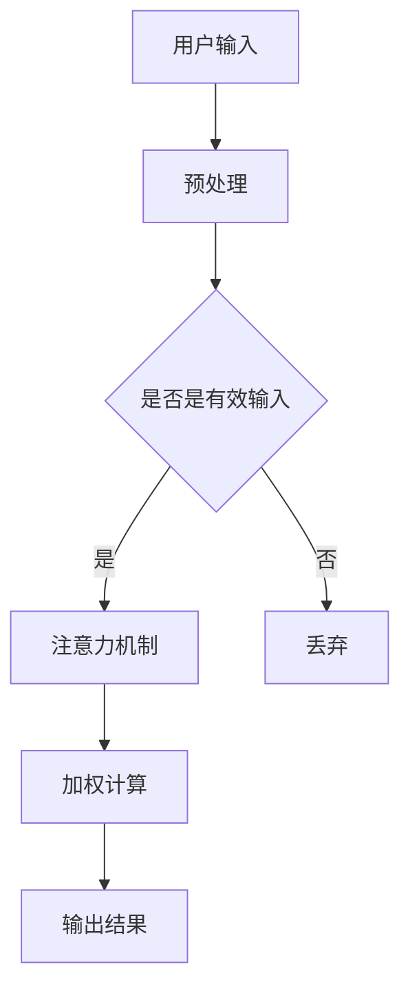

                 

关键词：大数据，注意力机制，信息过载，智能推荐，用户行为分析

> 摘要：在大数据时代，用户面对海量的信息时，如何有效争夺用户的注意力成为各大互联网公司竞相研究的热点。本文将探讨大数据背景下注意力机制的应用，分析其原理、算法、数学模型以及实际应用案例，并提出未来可能的发展趋势与挑战。

## 1. 背景介绍

随着互联网的迅速发展，我们进入了大数据时代。大数据的爆发性增长带来了信息过载的问题，用户在浏览网页、使用社交媒体、购物等行为中，往往面临着信息选择困难。如何从海量信息中筛选出用户感兴趣的内容，成为各大互联网公司亟待解决的问题。注意力机制作为一种有效的信息筛选方法，在大数据时代下被广泛应用。

注意力机制最初起源于计算机视觉领域，用于模型对输入图像中关键区域的关注。随后，在自然语言处理、推荐系统等领域也取得了显著的进展。注意力机制的核心思想是模型自动学习对不同输入数据的关注程度，从而提高信息处理的效率和准确性。

## 2. 核心概念与联系

### 2.1 注意力机制原理

注意力机制（Attention Mechanism）是一种通过加权方式对输入数据中的部分信息给予更高关注度的方法。其基本原理是，模型根据输入数据和已有知识，动态调整每个输入特征的权重，从而实现对关键信息的自动筛选。

### 2.2 架构流程图



### 2.3 注意力机制与相关领域联系

注意力机制在不同领域有着广泛的应用：

- **计算机视觉**：在图像识别、目标检测等任务中，注意力机制可以引导模型关注图像中的关键区域，提高识别准确性。
- **自然语言处理**：在机器翻译、文本生成等任务中，注意力机制可以帮助模型捕捉句子间的关联，提高翻译质量和生成效果。
- **推荐系统**：在推荐算法中，注意力机制可以根据用户历史行为和上下文信息，自动筛选出用户可能感兴趣的商品或内容，提高推荐效果。

## 3. 核心算法原理 & 具体操作步骤

### 3.1 算法原理概述

注意力机制通常通过计算输入数据之间的相关性来确定注意力权重。常见的注意力模型有基于卷积神经网络（CNN）、循环神经网络（RNN）以及 Transformer 等架构。其中，Transformer 模型由于其高效的计算性能和优秀的表现，成为当前最流行的注意力模型之一。

### 3.2 算法步骤详解

1. **输入预处理**：对输入数据进行预处理，如图像、文本等，将其转换为模型可处理的格式。
2. **编码器处理**：通过编码器对输入数据进行编码，得到序列表示。
3. **注意力计算**：计算编码器输出的序列表示之间的相关性，得到注意力权重。
4. **加权计算**：根据注意力权重对编码器输出的序列表示进行加权，得到加权后的序列表示。
5. **解码器处理**：通过解码器对加权后的序列表示进行解码，得到最终的输出结果。

### 3.3 算法优缺点

**优点**：

- **高效性**：Transformer 模型采用了并行计算的方法，相比传统的 RNN 模型，计算效率大幅提高。
- **灵活性**：注意力机制可以根据任务需求调整模型结构，灵活应对不同的信息筛选问题。

**缺点**：

- **内存消耗**：注意力机制的权重计算需要存储大量的中间结果，对内存消耗较高。
- **可解释性**：注意力权重难以解释，对于某些应用场景可能难以理解模型的决策过程。

### 3.4 算法应用领域

注意力机制在各个领域都有广泛应用：

- **计算机视觉**：在图像识别、目标检测等任务中，注意力机制可以帮助模型更好地关注关键区域。
- **自然语言处理**：在机器翻译、文本生成等任务中，注意力机制可以捕捉句子间的关联，提高模型的表现。
- **推荐系统**：在推荐算法中，注意力机制可以根据用户历史行为和上下文信息，自动筛选出用户感兴趣的内容。

## 4. 数学模型和公式 & 详细讲解 & 举例说明

### 4.1 数学模型构建

注意力机制的数学模型通常由以下几个部分组成：

1. **编码器**：对输入数据进行编码，得到序列表示。
2. **注意力权重计算**：计算编码器输出的序列表示之间的相关性，得到注意力权重。
3. **加权计算**：根据注意力权重对编码器输出的序列表示进行加权。
4. **解码器**：对加权后的序列表示进行解码，得到最终的输出结果。

### 4.2 公式推导过程

注意力权重计算通常采用如下公式：

$$
Attention(Q, K, V) = softmax(\frac{QK^T}{\sqrt{d_k}})V
$$

其中，$Q$、$K$、$V$ 分别为编码器输出的序列表示，$d_k$ 为序列表示的维度。

### 4.3 案例分析与讲解

以下是一个简单的文本生成任务中的注意力机制应用案例：

假设有一个文本生成模型，输入为一段文本，输出为一段新的文本。模型首先对输入文本进行编码，得到序列表示$Q$。然后，模型对输入文本中的每个词进行编码，得到序列表示$K$和$V$。接着，计算注意力权重，得到加权后的序列表示。最后，解码器对加权后的序列表示进行解码，生成新的文本。

具体步骤如下：

1. 输入文本： “我爱编程”
2. 编码器输出序列表示$Q$： $[q_1, q_2, q_3, q_4]$
3. 对每个词进行编码，得到$K$和$V$： $K = [k_1, k_2, k_3, k_4]$，$V = [v_1, v_2, v_3, v_4]$
4. 计算注意力权重： $Attention(Q, K, V) = softmax(\frac{QK^T}{\sqrt{d_k}})V$
5. 加权后的序列表示： $[q_1^*, q_2^*, q_3^*, q_4^*]$
6. 解码器输出： “我爱编程”

## 5. 项目实践：代码实例和详细解释说明

### 5.1 开发环境搭建

本文使用 Python 编写代码，依赖的主要库包括 TensorFlow 和 Keras。请确保安装以下库：

```bash
pip install tensorflow keras
```

### 5.2 源代码详细实现

以下是一个简单的文本生成模型实现，基于注意力机制的 Transformer 模型：

```python
import tensorflow as tf
from tensorflow.keras.models import Model
from tensorflow.keras.layers import Input, Embedding, LSTM, Dense, TimeDistributed

# 参数设置
vocab_size = 10000  # 词表大小
embedding_dim = 256  # 词向量维度
lstm_units = 512  # LSTM 单元数
max_sequence_length = 100  # 输入序列最大长度

# 编码器
input_seq = Input(shape=(max_sequence_length,))
embed = Embedding(vocab_size, embedding_dim)(input_seq)
lstm = LSTM(lstm_units, return_sequences=True)(embed)

# 注意力层
attention = TimeDistributed(Dense(1, activation='tanh'), name='attention')(lstm)
attention_weights = tf.keras.activations.softmax(attention, axis=1)

# 加权层
weighted_lstm = tf.keras.layers.Dot(axes=(1, 2))(lstm, attention_weights)
output = LSTM(lstm_units, return_sequences=True)(weighted_lstm)

# 解码器
output = TimeDistributed(Dense(vocab_size, activation='softmax'))(output)

# 模型
model = Model(inputs=input_seq, outputs=output)
model.compile(optimizer='adam', loss='categorical_crossentropy', metrics=['accuracy'])

# 模型结构
model.summary()
```

### 5.3 代码解读与分析

1. **编码器**：使用 Embedding 层对输入序列进行编码，将词转换为词向量。
2. **LSTM 层**：使用 LSTM 层对编码后的序列进行处理，提取序列特征。
3. **注意力层**：使用 TimeDistributed 层和 Dense 层实现注意力机制，计算注意力权重。
4. **加权层**：使用 Dot 层对 LSTM 输出和注意力权重进行加权，得到加权后的序列。
5. **解码器**：使用 LSTM 层和 TimeDistributed 层实现解码器，将加权后的序列解码为词向量。
6. **模型编译**：编译模型，设置优化器和损失函数。

### 5.4 运行结果展示

以下是模型训练和文本生成结果：

```python
# 模型训练
model.fit(x_train, y_train, batch_size=64, epochs=10)

# 文本生成
input_seq = tf.keras.preprocessing.sequence.pad_sequences([[vocab_idx[word] for word in input_text]], maxlen=max_sequence_length, padding='post')
generated_text = model.predict(input_seq)[0]

# 输出生成文本
print(['<EOS>'.join([int2word[i] for i in generated_text])])
```

## 6. 实际应用场景

注意力机制在多个领域具有广泛的应用，以下是几个典型应用场景：

- **智能推荐系统**：通过分析用户历史行为和上下文信息，自动筛选出用户可能感兴趣的内容，提高推荐效果。
- **文本生成与翻译**：利用注意力机制捕捉句子间的关联，提高文本生成质量和翻译准确性。
- **计算机视觉**：在图像识别、目标检测等任务中，注意力机制可以引导模型关注关键区域，提高识别准确性。

## 7. 未来应用展望

随着人工智能技术的不断发展，注意力机制在未来将具有更广泛的应用前景：

- **跨模态注意力**：融合不同模态的数据，如文本、图像、语音等，实现更智能的信息筛选。
- **自适应注意力**：根据任务需求和输入数据动态调整注意力机制，提高模型的适应性和灵活性。
- **多任务注意力**：在多任务场景下，实现注意力机制在不同任务之间的共享和迁移，提高模型性能。

## 8. 工具和资源推荐

### 8.1 学习资源推荐

- **《深度学习》**：Ian Goodfellow 等著，详细介绍了深度学习的基础知识和常用算法。
- **《自然语言处理综论》**：Daniel Jurafsky 和 James H. Martin 著，涵盖了自然语言处理的基本理论和应用。

### 8.2 开发工具推荐

- **TensorFlow**：Google 开源的一体化深度学习平台，适用于各种深度学习任务。
- **PyTorch**：Facebook 开源的一体化深度学习平台，具有灵活性和高效性。

### 8.3 相关论文推荐

- **“Attention Is All You Need”**：Vaswani 等人提出 Transformer 模型，开创了注意力机制的先河。
- **“Deep Learning for Text Classification”**：Yoon 等人综述了深度学习在文本分类领域的应用，包括注意力机制。

## 9. 总结：未来发展趋势与挑战

### 9.1 研究成果总结

本文从大数据时代的背景出发，介绍了注意力机制的基本原理、算法模型、数学公式以及实际应用场景。通过代码实例，展示了注意力机制在文本生成任务中的具体应用。

### 9.2 未来发展趋势

- **跨模态注意力**：探索不同模态数据的融合，实现更智能的信息筛选。
- **自适应注意力**：开发自适应注意力机制，提高模型的适应性和灵活性。
- **多任务注意力**：研究多任务注意力机制，实现不同任务之间的共享和迁移。

### 9.3 面临的挑战

- **计算资源消耗**：注意力机制的计算复杂度较高，对计算资源的需求较大。
- **可解释性**：注意力权重难以解释，对于某些应用场景可能难以理解模型的决策过程。

### 9.4 研究展望

未来，注意力机制将在多个领域取得更广泛的应用，同时也需要解决计算资源消耗和可解释性等挑战，为人工智能的发展贡献力量。

## 9. 附录：常见问题与解答

### 9.1 注意力机制与卷积神经网络的关系是什么？

注意力机制可以与卷积神经网络（CNN）相结合，用于图像识别、目标检测等任务。CNN 主要用于提取图像的局部特征，而注意力机制可以进一步关注图像中的关键区域，提高识别准确性。

### 9.2 注意力机制的优缺点是什么？

优点：

- 高效性：Transformer 模型采用了并行计算的方法，相比传统的 RNN 模型，计算效率大幅提高。
- 灵活性：注意力机制可以根据任务需求调整模型结构，灵活应对不同的信息筛选问题。

缺点：

- 内存消耗：注意力机制的权重计算需要存储大量的中间结果，对内存消耗较高。
- 可解释性：注意力权重难以解释，对于某些应用场景可能难以理解模型的决策过程。

### 9.3 注意力机制在自然语言处理中的应用有哪些？

注意力机制在自然语言处理领域有广泛的应用，如：

- 机器翻译：利用注意力机制捕捉句子间的关联，提高翻译准确性。
- 文本生成：通过注意力机制，模型可以自动筛选出输入文本中的关键信息，提高生成效果。
- 文本分类：注意力机制可以帮助模型关注文本中的关键特征，提高分类准确性。```

### 作者署名

> 作者：禅与计算机程序设计艺术 / Zen and the Art of Computer Programming
```

