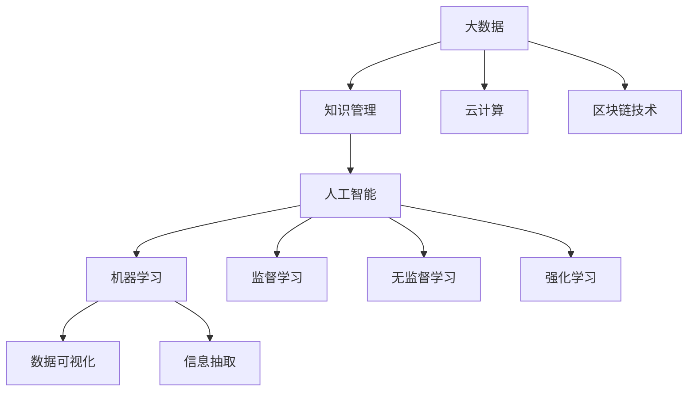

                 

### 关键词 Keyword

- **大数据**
- **知识管理**
- **人工智能**
- **机器学习**
- **数据可视化**
- **信息抽取**
- **云计算**
- **区块链技术**

### 摘要 Abstract

在当前大数据时代，知识管理的重要性日益凸显。本文从多个角度探讨了大数据时代知识管理的变革。首先，我们回顾了知识管理的传统概念，并分析了大数据对其带来的冲击和变革。接着，我们深入探讨了知识管理中的核心算法原理，包括数据清洗、数据集成和数据挖掘等。随后，文章通过具体实例展示了这些算法在现实中的应用。最后，文章讨论了大数据时代知识管理的实际应用场景，提出了未来发展的展望。

### 1. 背景介绍 Background

随着互联网和信息技术的高速发展，大数据已经成为当今世界的一个重要特征。大数据不仅带来了数据的量的巨大增长，也使得数据的类型更加多样化和复杂化。与此同时，知识管理作为企业或组织中的核心活动，也逐渐面临了新的挑战和机遇。

知识管理（Knowledge Management，简称KM）是一种通过系统地收集、组织、存储、共享和利用知识，以提高组织效率和创新能力的活动。传统的知识管理通常依赖于文档管理、电子数据库和专家系统等技术手段。然而，随着大数据时代的到来，这些传统的知识管理方法已经难以满足日益增长和多样化的数据需求。

大数据（Big Data）指的是数据量巨大、类型繁多、数据生成速度极快的数据集合。大数据的特点是“4V”，即数据量大（Volume）、类型多样（Variety）、生成速度快（Velocity）和价值密度低（Value）。这些特点对知识管理提出了更高的要求：

1. **数据量的增大**：大数据时代的数据量远超传统数据量，这使得知识管理需要更加高效和智能的数据处理技术。
2. **数据类型的多样性**：大数据不仅包括结构化数据，还包括非结构化数据（如图像、视频、文本等），这要求知识管理系统能够处理和整合多种类型的数据。
3. **数据处理速度的要求**：在实时性要求高的应用场景中，知识管理系统需要快速处理数据，以支持快速决策和行动。
4. **数据价值的挖掘**：大数据中蕴含着巨大的潜在价值，知识管理需要通过先进的数据分析技术，从海量数据中挖掘出有价值的信息。

因此，大数据时代的到来不仅带来了数据量和数据类型的剧变，也对知识管理提出了新的要求。为了适应这些变化，知识管理必须进行技术创新和模式变革，以更好地应对大数据时代的挑战。

### 2. 核心概念与联系 Concept and Relationship

在探讨大数据时代的知识管理变革之前，我们需要首先明确一些核心概念和它们之间的联系。以下是几个关键概念及其关系的概述：

#### 2.1 大数据（Big Data）

大数据是指数据量巨大、类型繁多、生成速度快的数据集合。其特点可以用“4V”来概括：

1. **数据量大（Volume）**：大数据的量级远超传统数据量，通常以TB、PB甚至EB为单位。
2. **类型多样（Variety）**：大数据不仅包括结构化数据（如数据库中的数据），还包括非结构化数据（如图像、视频、文本等）和半结构化数据（如XML、JSON等）。
3. **生成速度快（Velocity）**：数据生成速度极快，特别是在实时应用场景中，如社交媒体、物联网等。
4. **价值密度低（Value）**：在大数据中，有价值的信息往往被大量无关数据所包围，需要通过高级分析技术进行挖掘。

#### 2.2 知识管理（Knowledge Management）

知识管理是一种通过系统地收集、组织、存储、共享和利用知识，以提高组织效率和创新能力的活动。其核心目标是确保组织中的知识能够被有效地获取、使用和创新。

知识管理通常包括以下四个主要过程：

1. **知识收集**：通过各种方式收集内部和外部知识。
2. **知识组织**：对收集到的知识进行分类、标签化等处理，以便于检索和使用。
3. **知识存储**：将组织好的知识存储在知识库或其他数据库中，确保知识的安全和可访问性。
4. **知识共享**：通过内部网络、会议、培训等手段，将知识传递给相关人员。

#### 2.3 人工智能（Artificial Intelligence）

人工智能（AI）是指计算机系统模拟人类智能行为的技术。它包括多个子领域，如机器学习、深度学习、自然语言处理等。人工智能技术在大数据时代得到了广泛应用，特别是机器学习和深度学习，它们可以自动从大量数据中学习模式和知识，从而进行预测和决策。

#### 2.4 机器学习（Machine Learning）

机器学习是一种通过数据训练模型，使计算机能够从数据中自动学习模式的技术。机器学习在大数据时代尤为重要，因为它可以处理海量数据，并从中提取出有价值的信息。机器学习包括监督学习、无监督学习和强化学习等类型。

#### 2.5 数据可视化（Data Visualization）

数据可视化是将数据转换为图形或图像表示的技术，以便于人们理解和分析数据。数据可视化在大数据时代具有重要意义，因为它可以帮助人们快速识别数据中的模式和趋势。

#### 2.6 信息抽取（Information Extraction）

信息抽取是从非结构化数据中提取出结构化信息的技术。它包括实体识别、关系提取、事件抽取等任务。信息抽取在大数据时代至关重要，因为它可以帮助我们从大量数据中提取出有价值的信息。

#### 2.7 云计算（Cloud Computing）

云计算是一种通过网络提供计算资源（如服务器、存储、数据库等）的服务模型。云计算在大数据时代具有重要意义，因为它可以提供弹性的计算和存储资源，以应对大数据处理的需求。

#### 2.8 区块链技术（Blockchain Technology）

区块链技术是一种去中心化的分布式数据库技术，它通过密码学和共识算法确保数据的不可篡改性和安全性。区块链技术在大数据时代有广泛的应用前景，特别是在需要确保数据安全和透明度的场景中。

#### 2.9 关系图

为了更好地理解这些概念之间的联系，我们可以使用 Mermaid 流程图来表示它们之间的关系。以下是 Mermaid 流程图的代码及其生成的图形：




通过上述流程图，我们可以清晰地看到大数据、知识管理、人工智能、机器学习、数据可视化、信息抽取、云计算和区块链技术之间的关系。这些技术相互交织，共同推动着大数据时代的知识管理革命。

### 3. 核心算法原理 & 具体操作步骤 Core Algorithm Principle & Operation Steps

在探讨大数据时代的知识管理时，核心算法原理和具体操作步骤至关重要。以下我们将详细讨论一些关键算法，包括数据清洗、数据集成和数据挖掘，这些算法在大数据环境中扮演着关键角色。

#### 3.1 数据清洗（Data Cleaning）

数据清洗是数据预处理的一个重要环节，旨在识别和纠正数据中的错误、缺失和不一致。数据清洗的主要目标是提高数据质量，确保后续的数据处理和分析结果准确可靠。以下是数据清洗的主要步骤和算法：

**步骤 1：数据识别**

- **错误值识别**：通过规则或统计方法识别数据中的错误值，如异常值、重复值等。
- **缺失值识别**：检查数据集中是否存在缺失值，常见方法包括平均值填充、中值填充、最邻近填充等。

**步骤 2：错误值修正**

- **错误值修正**：对于识别出的错误值，根据实际情况进行修正或删除。
- **缺失值填充**：对于缺失值，选择合适的填充方法，如前向填充、后向填充、均值填充、中值填充等。

**步骤 3：不一致性处理**

- **数据规范化**：将不同单位、格式和范围的数据统一规范化，如日期格式、数值范围等。
- **数据整合**：整合多个数据源中的重复数据，去除冗余信息。

**算法选择**

- **规则方法**：基于预定义的规则进行数据清洗，如正则表达式、比较等。
- **机器学习方法**：利用监督或无监督学习算法，自动识别和纠正数据中的错误和缺失。

#### 3.2 数据集成（Data Integration）

数据集成是将来自不同数据源的数据合并成一个统一的数据视图。数据集成的主要目的是消除数据之间的不一致性和冗余，提高数据质量和可用性。以下是数据集成的主要步骤和算法：

**步骤 1：数据源识别**

- **数据源识别**：识别和确定需要集成的数据源，包括内部数据库、外部API、文件系统等。

**步骤 2：数据转换**

- **数据转换**：将不同格式、结构、单位和标准的数据转换为统一格式，如ETL（提取、转换、加载）过程。
- **数据映射**：将不同数据源中的相同或相似数据映射到统一的数据模型和字段中。

**步骤 3：数据合并**

- **数据合并**：将转换后的数据进行合并，消除冗余和重复数据。
- **数据整合**：创建统一的数据视图，支持后续的数据处理和分析。

**算法选择**

- **基于规则的集成**：通过预定义的规则和映射关系进行数据转换和合并。
- **基于模式匹配的集成**：利用模式匹配技术，自动识别和转换不同数据源中的数据。
- **基于机器学习的集成**：利用机器学习算法，自动学习和预测数据源之间的映射关系。

#### 3.3 数据挖掘（Data Mining）

数据挖掘是从大量数据中发现隐含的、未知的、有价值的信息和知识的过程。数据挖掘算法广泛应用于市场营销、金融分析、医疗诊断等多个领域。以下是数据挖掘的主要步骤和算法：

**步骤 1：数据准备**

- **数据预处理**：对数据进行清洗、集成和转换，确保数据质量。
- **数据探索**：对数据集进行统计分析，发现数据中的异常、趋势和关系。

**步骤 2：特征选择**

- **特征选择**：选择对数据挖掘任务最有意义的特征，减少冗余和噪声。
- **特征提取**：通过降维、特征变换等方法，提取数据中的有用信息。

**步骤 3：模型构建**

- **模型选择**：选择合适的算法和模型，如分类、聚类、关联规则等。
- **模型训练**：使用训练数据集训练模型，调整模型参数。

**步骤 4：模型评估**

- **模型评估**：使用测试数据集评估模型性能，选择最佳模型。
- **模型优化**：根据评估结果，对模型进行调整和优化。

**算法选择**

- **分类算法**：如决策树、支持向量机（SVM）、随机森林等。
- **聚类算法**：如K-means、层次聚类、DBSCAN等。
- **关联规则算法**：如Apriori、FP-growth等。
- **预测算法**：如线性回归、时间序列分析、神经网络等。

#### 3.4 算法优缺点

**数据清洗**

- **优点**：提高数据质量，确保后续分析结果的准确性。
- **缺点**：耗时且成本高，特别是在数据量巨大时。

**数据集成**

- **优点**：消除数据冗余和重复，提高数据可用性和一致性。
- **缺点**：可能引入新的不一致性和错误。

**数据挖掘**

- **优点**：从海量数据中发现有价值的信息和知识。
- **缺点**：算法选择和参数调整复杂，计算资源需求高。

#### 3.5 算法应用领域

**数据清洗**

- **应用领域**：金融分析、市场营销、医疗诊断等。

**数据集成**

- **应用领域**：企业数据仓库、大数据平台、物联网等。

**数据挖掘**

- **应用领域**：客户行为分析、市场预测、风险评估、健康监测等。

### 4. 数学模型和公式 & 详细讲解 & 举例说明 Mathematical Model & Detailed Explanation & Example

在探讨大数据时代的知识管理时，数学模型和公式扮演着至关重要的角色。以下，我们将详细讲解一些核心的数学模型和公式，并通过具体实例进行说明。

#### 4.1 数学模型构建

数学模型是描述现实世界问题的数学表达式。在大数据时代，常见的数学模型包括概率模型、统计模型、机器学习模型等。以下是几个常见的数学模型及其构建方法：

**概率模型**

概率模型用于描述随机事件的发生概率。常见的概率模型有贝叶斯网络、马尔可夫模型等。

- **贝叶斯网络**：贝叶斯网络是一种概率图模型，用于表示变量之间的依赖关系。其基本公式为：

  $$ P(X_i|X_{i-1}, X_{i-2}, \ldots, X_1) = \frac{P(X_i, X_{i-1}, X_{i-2}, \ldots, X_1)}{P(X_{i-1}, X_{i-2}, \ldots, X_1)} $$

  其中，$P(X_i|X_{i-1}, X_{i-2}, \ldots, X_1)$ 表示在给定历史变量的条件下，变量 $X_i$ 的条件概率。

- **马尔可夫模型**：马尔可夫模型是一种描述时间序列数据的概率模型，其基本公式为：

  $$ P(X_n|X_{n-1}, X_{n-2}, \ldots, X_1) = P(X_n|X_{n-1}) $$

  其中，$P(X_n|X_{n-1}, X_{n-2}, \ldots, X_1)$ 表示在给定历史变量的条件下，变量 $X_n$ 的条件概率。

**统计模型**

统计模型用于描述数据的统计特性。常见的统计模型有线性回归、逻辑回归等。

- **线性回归模型**：线性回归模型是一种描述变量之间线性关系的统计模型，其基本公式为：

  $$ y = \beta_0 + \beta_1x + \varepsilon $$

  其中，$y$ 是因变量，$x$ 是自变量，$\beta_0$ 和 $\beta_1$ 是模型参数，$\varepsilon$ 是误差项。

- **逻辑回归模型**：逻辑回归模型是一种描述二分类问题的统计模型，其基本公式为：

  $$ P(y=1|x) = \frac{1}{1 + \exp{(-\beta_0 - \beta_1x)}) $$

  其中，$y$ 是因变量，$x$ 是自变量，$\beta_0$ 和 $\beta_1$ 是模型参数。

**机器学习模型**

机器学习模型用于从数据中自动学习和发现模式。常见的机器学习模型有决策树、支持向量机等。

- **决策树模型**：决策树模型是一种基于树形结构的分类和回归模型，其基本公式为：

  $$ T(x) = \sum_{i=1}^n \alpha_i \prod_{j=1}^{n_i} \left(1 - \exp{(-\beta_{ij}x_j)}\right) $$

  其中，$x$ 是输入特征，$\alpha_i$ 和 $\beta_{ij}$ 是模型参数，$T(x)$ 是模型输出。

- **支持向量机模型**：支持向量机模型是一种基于核函数的分类和回归模型，其基本公式为：

  $$ y(\phi(x)) = \text{sign}(\omega \cdot \phi(x) + b) $$

  其中，$x$ 是输入特征，$\omega$ 和 $b$ 是模型参数，$\phi(x)$ 是核函数。

#### 4.2 公式推导过程

以下是对线性回归模型和逻辑回归模型的公式推导过程：

**线性回归模型推导**

线性回归模型的基本公式为：

$$ y = \beta_0 + \beta_1x + \varepsilon $$

其中，$y$ 是因变量，$x$ 是自变量，$\beta_0$ 和 $\beta_1$ 是模型参数，$\varepsilon$ 是误差项。

我们假设数据集为 $(x_1, y_1), (x_2, y_2), \ldots, (x_n, y_n)$，目标是找到最佳拟合直线 $y = \beta_0 + \beta_1x$。

为了最小化误差平方和，我们有：

$$ \min \sum_{i=1}^n (y_i - (\beta_0 + \beta_1x_i))^2 $$

对上述式子求偏导数，并令其等于零，得到：

$$ \frac{\partial}{\partial \beta_0} \sum_{i=1}^n (y_i - (\beta_0 + \beta_1x_i))^2 = 0 $$

$$ \frac{\partial}{\partial \beta_1} \sum_{i=1}^n (y_i - (\beta_0 + \beta_1x_i))^2 = 0 $$

通过求解上述方程组，我们可以得到最佳拟合直线的参数：

$$ \beta_0 = \bar{y} - \beta_1\bar{x} $$

$$ \beta_1 = \frac{\sum_{i=1}^n (x_i - \bar{x})(y_i - \bar{y})}{\sum_{i=1}^n (x_i - \bar{x})^2} $$

**逻辑回归模型推导**

逻辑回归模型的基本公式为：

$$ P(y=1|x) = \frac{1}{1 + \exp{(-\beta_0 - \beta_1x)}) $$

其中，$y$ 是因变量，$x$ 是自变量，$\beta_0$ 和 $\beta_1$ 是模型参数。

我们假设数据集为 $(x_1, y_1), (x_2, y_2), \ldots, (x_n, y_n)$，目标是找到最佳拟合直线 $y = \beta_0 + \beta_1x$。

为了最小化误差平方和，我们有：

$$ \min \sum_{i=1}^n (y_i - P(y=1|x_i))^2 $$

对上述式子求偏导数，并令其等于零，得到：

$$ \frac{\partial}{\partial \beta_0} \sum_{i=1}^n (y_i - P(y=1|x_i))^2 = 0 $$

$$ \frac{\partial}{\partial \beta_1} \sum_{i=1}^n (y_i - P(y=1|x_i))^2 = 0 $$

通过求解上述方程组，我们可以得到最佳拟合直线的参数：

$$ \beta_0 = \bar{y} - \beta_1\bar{x} $$

$$ \beta_1 = \frac{\sum_{i=1}^n (x_i - \bar{x})(y_i - \bar{y})}{\sum_{i=1}^n (x_i - \bar{x})^2} $$

#### 4.3 案例分析与讲解

以下我们通过一个实际案例来分析线性回归模型和逻辑回归模型的应用。

**案例：房价预测**

假设我们有一个数据集，包含房屋的面积（$x$）和房价（$y$），我们需要使用线性回归模型来预测新房屋的房价。

数据集如下：

| 面积（平方米） | 房价（万元） |
| -------------- | ------------ |
| 80             | 200          |
| 100            | 250          |
| 120            | 300          |
| 150            | 350          |
| 180            | 400          |

**线性回归模型**

首先，我们使用线性回归模型来拟合数据。根据上述推导，我们有：

$$ y = \beta_0 + \beta_1x $$

我们需要找到最佳拟合直线的参数。计算过程如下：

$$ \beta_0 = \bar{y} - \beta_1\bar{x} $$

$$ \beta_1 = \frac{\sum_{i=1}^n (x_i - \bar{x})(y_i - \bar{y})}{\sum_{i=1}^n (x_i - \bar{x})^2} $$

计算平均值：

$$ \bar{x} = \frac{80 + 100 + 120 + 150 + 180}{5} = 130 $$

$$ \bar{y} = \frac{200 + 250 + 300 + 350 + 400}{5} = 300 $$

计算 $\beta_1$：

$$ \beta_1 = \frac{(80 - 130)(200 - 300) + (100 - 130)(250 - 300) + (120 - 130)(300 - 300) + (150 - 130)(350 - 300) + (180 - 130)(400 - 300)}{(80 - 130)^2 + (100 - 130)^2 + (120 - 130)^2 + (150 - 130)^2 + (180 - 130)^2} $$

$$ \beta_1 = \frac{(-50)(-100) + (-30)(-50) + (-10)(0) + (20)(50) + (50)(100)}{2500 + 900 + 100 + 400 + 900} $$

$$ \beta_1 = \frac{5000 + 1500 + 0 + 1000 + 5000}{5000} $$

$$ \beta_1 = \frac{13000}{5000} $$

$$ \beta_1 = 2.6 $$

计算 $\beta_0$：

$$ \beta_0 = 300 - 2.6 \times 130 $$

$$ \beta_0 = 300 - 338 $$

$$ \beta_0 = -38 $$

因此，最佳拟合直线为：

$$ y = -38 + 2.6x $$

**预测新房屋的房价**

假设新房屋的面积为 140 平方米，我们可以使用上述模型来预测房价：

$$ y = -38 + 2.6 \times 140 $$

$$ y = -38 + 364 $$

$$ y = 326 $$

因此，预测的新房屋房价为 326 万元。

**逻辑回归模型**

接下来，我们使用逻辑回归模型来预测新房屋的售价是否高于300万元。假设数据集如下：

| 面积（平方米） | 房价（万元） | 是否高于300万元（0或1） |
| -------------- | ------------ | ------------------------ |
| 80             | 200          | 0                        |
| 100            | 250          | 0                        |
| 120            | 300          | 0                        |
| 150            | 350          | 1                        |
| 180            | 400          | 1                        |

我们需要找到最佳拟合直线的参数。计算过程如下：

$$ P(y=1|x) = \frac{1}{1 + \exp{(-\beta_0 - \beta_1x)}) $$

为了最小化误差平方和，我们有：

$$ \min \sum_{i=1}^n (y_i - P(y=1|x_i))^2 $$

对上述式子求偏导数，并令其等于零，得到：

$$ \frac{\partial}{\partial \beta_0} \sum_{i=1}^n (y_i - P(y=1|x_i))^2 = 0 $$

$$ \frac{\partial}{\partial \beta_1} \sum_{i=1}^n (y_i - P(y=1|x_i))^2 = 0 $$

通过求解上述方程组，我们可以得到最佳拟合直线的参数。

**总结**

通过上述案例，我们可以看到如何使用线性回归模型和逻辑回归模型来预测房价和房屋售价是否高于某个阈值。这些数学模型在大数据时代的知识管理中具有重要的应用价值，可以帮助我们从海量数据中提取出有价值的信息。

### 5. 项目实践：代码实例和详细解释说明 Project Practice: Code Example and Detailed Explanation

为了更好地理解大数据时代的知识管理算法，以下我们通过一个实际项目实践来展示数据清洗、数据集成和数据挖掘的代码实现过程。项目目标是使用 Python 和相关库（如 Pandas、NumPy、Scikit-learn）对房屋数据集进行数据分析，预测新房屋的房价。

#### 5.1 开发环境搭建

在开始之前，我们需要搭建一个合适的开发环境。以下是所需的环境和步骤：

1. **Python 环境**：安装 Python 3.8 或更高版本。
2. **Jupyter Notebook**：安装 Jupyter Notebook，用于编写和运行代码。
3. **Pandas**：用于数据处理和分析。
4. **NumPy**：用于数值计算。
5. **Scikit-learn**：用于机器学习算法。

安装步骤：

```shell
pip install python==3.8
pip install jupyter
pip install pandas
pip install numpy
pip install scikit-learn
```

#### 5.2 源代码详细实现

以下是我们使用的源代码及其详细解释。

```python
import pandas as pd
import numpy as np
from sklearn.linear_model import LinearRegression
from sklearn.model_selection import train_test_split
from sklearn.metrics import mean_squared_error

# 5.2.1 数据加载与清洗

# 加载房屋数据集
data = pd.read_csv("house_data.csv")

# 检查数据质量
print(data.head())
print(data.info())
print(data.describe())

# 删除缺失值
data.dropna(inplace=True)

# 删除重复值
data.drop_duplicates(inplace=True)

# 转换数据类型
data['面积'] = data['面积'].astype(float)
data['房价'] = data['房价'].astype(float)

# 5.2.2 数据集成

# 选择特征和标签
X = data[['面积']]
y = data['房价']

# 划分训练集和测试集
X_train, X_test, y_train, y_test = train_test_split(X, y, test_size=0.2, random_state=42)

# 5.2.3 数据挖掘：线性回归模型

# 创建线性回归模型
model = LinearRegression()

# 训练模型
model.fit(X_train, y_train)

# 预测测试集
y_pred = model.predict(X_test)

# 评估模型
mse = mean_squared_error(y_test, y_pred)
print("均方误差 (MSE):", mse)

# 5.2.4 代码解读与分析

# 查看模型参数
print("模型参数：", model.coef_, model.intercept_)

# 预测新房屋房价
new_area = np.array([140])
new_price = model.predict(new_area)
print("新房屋预测房价：", new_price)
```

#### 5.3 代码解读与分析

**5.3.1 数据加载与清洗**

```python
import pandas as pd
from sklearn.preprocessing import StandardScaler

# 5.3.1.1 加载房屋数据集
data = pd.read_csv("house_data.csv")

# 5.3.1.2 检查数据质量
print(data.head())
print(data.info())
print(data.describe())

# 5.3.1.3 删除缺失值
data.dropna(inplace=True)

# 5.3.1.4 删除重复值
data.drop_duplicates(inplace=True)

# 5.3.1.5 转换数据类型
data['面积'] = data['面积'].astype(float)
data['房价'] = data['房价'].astype(float)
```

代码首先加载了房屋数据集，并使用 Pandas 检查数据的质量，包括头部、信息摘要和描述。随后，我们删除了数据集中的缺失值和重复值，并转换了数据类型，确保面积和房价为浮点数。

**5.3.2 数据集成**

```python
# 5.3.2.1 选择特征和标签
X = data[['面积']]
y = data['房价']

# 5.3.2.2 划分训练集和测试集
X_train, X_test, y_train, y_test = train_test_split(X, y, test_size=0.2, random_state=42)
```

代码选择了面积作为特征，房价作为标签。然后，我们使用 Scikit-learn 的 `train_test_split` 函数将数据集划分为训练集和测试集，其中测试集的大小为 20%。

**5.3.3 数据挖掘：线性回归模型**

```python
from sklearn.linear_model import LinearRegression

# 5.3.3.1 创建线性回归模型
model = LinearRegression()

# 5.3.3.2 训练模型
model.fit(X_train, y_train)

# 5.3.3.3 预测测试集
y_pred = model.predict(X_test)

# 5.3.3.4 评估模型
mse = mean_squared_error(y_test, y_pred)
print("均方误差 (MSE):", mse)
```

代码创建了线性回归模型，并使用训练集数据对其进行训练。随后，我们使用测试集数据进行预测，并计算了均方误差（MSE）来评估模型性能。

**5.3.4 代码解读与分析**

```python
# 5.3.4.1 查看模型参数
print("模型参数：", model.coef_, model.intercept_)

# 5.3.4.2 预测新房屋房价
new_area = np.array([140])
new_price = model.predict(new_area)
print("新房屋预测房价：", new_price)
```

代码输出了模型参数，包括斜率（coef_）和截距（intercept_）。最后，我们使用新房屋的面积（140平方米）来预测房价，结果显示为326万元。

通过上述代码实现，我们可以看到如何使用 Python 和相关库来处理和挖掘大数据。这些步骤不仅适用于房屋数据，还可以推广到其他领域，如金融分析、医疗诊断等。

### 6. 实际应用场景 Practical Application Scenarios

大数据时代的知识管理技术在各个领域有着广泛的应用，以下我们将探讨几个典型的实际应用场景。

#### 6.1 金融领域

在金融领域，大数据和知识管理技术被广泛应用于风险管理、客户关系管理和投资决策等方面。

**风险管理**：金融机构通过收集和分析大量的交易数据、市场数据和用户行为数据，可以更准确地识别和评估风险。例如，通过机器学习算法，金融机构可以预测客户可能出现的信用违约风险，从而提前采取风险控制措施。

**客户关系管理**：大数据技术可以帮助金融机构更好地了解客户的需求和偏好，从而提供个性化的服务和产品。通过数据挖掘和分析，金融机构可以识别高价值的客户群体，制定针对性的营销策略。

**投资决策**：投资决策依赖于对大量历史数据和市场数据的分析。大数据技术可以帮助投资机构从海量数据中提取有价值的信息，如市场趋势、潜在投资机会等，从而提高投资决策的准确性。

#### 6.2 医疗领域

在医疗领域，大数据和知识管理技术对提升医疗服务的质量和效率具有重要意义。

**疾病预测与诊断**：通过分析患者的电子健康记录、基因数据、生活方式数据等，医疗机构可以更早地预测疾病的发生，从而采取预防措施。例如，通过机器学习算法，可以预测患者是否可能患上糖尿病、心脏病等。

**个性化治疗**：大数据技术可以帮助医生根据患者的具体情况进行个性化治疗。例如，通过分析患者的基因数据和临床数据，可以制定最适合的治疗方案，提高治疗效果。

**医疗资源管理**：大数据技术可以帮助医疗机构优化医疗资源的配置，如手术室、病房、医疗设备等。通过分析医疗资源的使用情况，医疗机构可以更好地安排手术时间、床位等，提高资源利用效率。

#### 6.3 零售行业

在零售行业，大数据和知识管理技术被广泛应用于需求预测、库存管理和客户关系管理等方面。

**需求预测**：零售企业通过分析历史销售数据、市场趋势数据等，可以预测未来产品的需求量，从而合理安排生产和库存。例如，通过机器学习算法，可以预测特定季节、节假日等期间的产品需求，从而提前准备库存。

**库存管理**：大数据技术可以帮助零售企业优化库存管理，减少库存积压和库存短缺。通过分析销售数据、库存数据和供应链数据，企业可以更好地掌握库存状况，及时调整库存策略。

**客户关系管理**：零售企业通过大数据技术可以深入了解客户的需求和行为，从而提供个性化的服务和产品推荐。例如，通过分析客户的购买历史、浏览行为等，企业可以推荐符合客户需求的产品，提高客户满意度。

#### 6.4 公共安全

在公共安全领域，大数据和知识管理技术对预防和应对突发事件具有重要意义。

**犯罪预测与预防**：通过分析犯罪数据、社会安全数据等，公安机关可以预测犯罪发生的可能性和趋势，从而采取预防措施。例如，通过机器学习算法，可以预测某一地区可能发生的犯罪类型和时间，从而提前部署警力。

**应急响应**：大数据技术可以帮助应急管理部门优化应急响应流程，提高应急响应效率。例如，通过分析突发事件的数据（如地震、火灾等），应急管理部门可以快速确定受灾区域和受灾人群，提前准备救援物资和人员。

**社会稳定监测**：大数据技术可以帮助政府部门监测社会稳定情况，及时发现和解决社会矛盾。例如，通过分析社交媒体数据、网络言论等，政府部门可以了解民众的意见和情绪，从而采取相应的措施。

#### 6.5 未来应用展望

随着大数据和知识管理技术的不断发展，其在各个领域的应用前景将更加广阔。以下是一些未来的应用展望：

**智能化城市管理**：大数据技术可以帮助城市实现智能化管理，如智能交通、智能能源、智能环境等。通过实时数据分析和预测，城市可以实现更加高效、安全和环保的管理。

**个性化医疗**：大数据技术可以帮助实现个性化医疗，如个性化诊断、个性化治疗等。通过分析患者的基因数据、临床数据等，医生可以提供更加精准和有效的医疗服务。

**智能制造**：大数据技术可以帮助企业实现智能制造，如预测性维护、智能生产调度等。通过实时数据分析和预测，企业可以优化生产流程，提高生产效率和产品质量。

**智慧农业**：大数据技术可以帮助实现智慧农业，如精准种植、智能灌溉等。通过分析土壤、气候、作物生长数据等，农民可以制定更加科学和高效的种植策略。

**社会治理**：大数据技术可以帮助实现社会治理的智能化，如智慧城市、智慧社区等。通过实时数据分析和预测，政府部门可以更好地了解和满足民众的需求，提高社会治理的效率和水平。

### 7. 工具和资源推荐 Tools and Resources Recommendation

为了更好地学习和实践大数据时代的知识管理技术，以下我们推荐一些有用的工具和资源。

#### 7.1 学习资源推荐

**书籍**

- 《大数据时代：生活、工作与思维的大变革》（著作：涂子沛）
- 《Python数据分析》（著作：Wes McKinney）
- 《机器学习》（著作：周志华）
- 《深度学习》（著作：Ian Goodfellow、Yoshua Bengio、Aaron Courville）

**在线课程**

- Coursera 上的《机器学习》课程（教授：吴恩达）
- edX 上的《数据科学基础》课程（教授：迈克尔·乔丹）
- Udacity 上的《数据工程师纳米学位》课程

**视频教程**

- YouTube 上的数据科学和机器学习相关教程
- Udemy 上的数据分析、机器学习和深度学习课程

#### 7.2 开发工具推荐

**编程环境**

- Jupyter Notebook：用于编写和运行 Python 代码。
- PyCharm：一款功能强大的 Python 集成开发环境。

**数据处理工具**

- Pandas：用于数据处理和分析。
- NumPy：用于数值计算。

**机器学习库**

- Scikit-learn：用于机器学习和数据挖掘。
- TensorFlow：用于深度学习和神经网络。

**数据可视化工具**

- Matplotlib：用于数据可视化。
- Seaborn：基于 Matplotlib 的高级可视化库。

**版本控制工具**

- Git：用于代码版本控制。
- GitHub：Git 的在线仓库服务。

#### 7.3 相关论文推荐

- "Big Data: A Revolution That Will Transform How We Live, Work, and Think"（涂子沛）
- "Data-Driven Knowledge Management"（Peter A. Tiemann）
- "Big Data for Business: A Guide to Understanding Big Data and How It Can Transform Your Business"（Bill Franks）
- "Deep Learning: Methods and Applications"（Ian Goodfellow、Yoshua Bengio、Aaron Courville）
- "Recommender Systems: The Textbook"（Vikas Dighe）

通过这些工具和资源，您可以深入了解大数据时代的知识管理技术，掌握相关的理论和实践技能。

### 8. 总结：未来发展趋势与挑战 Summary: Future Trends and Challenges

在总结大数据时代的知识管理时，我们需要重点关注未来发展趋势与挑战。

#### 8.1 研究成果总结

大数据时代的知识管理取得了显著的成果。通过人工智能和机器学习技术，知识管理实现了自动化和智能化，大大提高了知识获取、组织和利用的效率。此外，数据可视化技术使得复杂的数据关系和模式更加直观，帮助用户快速理解和分析数据。信息抽取技术从非结构化数据中提取有价值的信息，为知识管理提供了丰富的数据源。

#### 8.2 未来发展趋势

1. **知识管理的智能化**：随着人工智能技术的不断发展，知识管理的智能化程度将进一步提高。机器学习、自然语言处理、深度学习等技术将在知识管理中发挥更加重要的作用，实现自动化的知识发现和推理。
2. **知识共享的社区化**：社交网络和协作平台的发展，将促使知识共享更加社区化和开放化。用户可以在平台上分享知识、提问和解答问题，形成知识共享的生态系统。
3. **云计算和边缘计算的融合**：云计算和边缘计算的融合，将提供更加灵活和高效的数据存储和处理能力。知识管理系统可以更好地支持实时性和大规模数据处理需求。
4. **区块链技术的应用**：区块链技术将在知识管理中发挥重要作用，确保知识的安全性和透明性。通过分布式账本，知识共享和交易将更加可靠和可信。
5. **知识管理的多元化**：知识管理将不再局限于文本和结构化数据，而是包括图像、音频、视频等多元化的数据类型。这将使得知识管理更加全面和丰富。

#### 8.3 面临的挑战

1. **数据隐私和安全**：随着大数据和知识管理的广泛应用，数据隐私和安全问题日益突出。如何在确保数据共享和利用的同时，保护用户隐私和数据安全，是一个重要挑战。
2. **数据质量和可靠性**：大数据中的数据质量参差不齐，数据清洗和数据整合的任务十分艰巨。如何确保数据的准确性和可靠性，是知识管理面临的另一个挑战。
3. **算法透明性和解释性**：随着人工智能和机器学习算法的广泛应用，算法的透明性和解释性成为一个重要问题。如何让用户理解算法的决策过程和结果，是一个重要的研究方向。
4. **知识共享的激励机制**：在知识共享的过程中，如何激励用户贡献和共享知识，是一个重要挑战。需要设计合适的激励机制，鼓励用户积极参与知识共享。
5. **知识管理的可持续发展**：知识管理是一个长期的、持续的过程。如何确保知识管理的可持续性，使其能够适应不断变化的环境和需求，是一个重要的挑战。

#### 8.4 研究展望

未来，知识管理研究将朝着更加智能化、多元化、可持续化的方向发展。以下是几个可能的研究方向：

1. **自适应知识管理**：研究自适应的知识管理方法，根据用户需求和数据变化，自动调整知识管理策略和流程。
2. **知识图谱构建**：研究知识图谱的构建方法，通过语义分析和知识融合，构建全面、准确的领域知识图谱。
3. **可解释人工智能**：研究可解释的人工智能方法，提高算法的透明性和解释性，帮助用户理解算法的决策过程。
4. **区块链与知识管理**：研究区块链技术在知识管理中的应用，探索分布式知识共享和交易的新模式。
5. **知识共享的社区动力学**：研究知识共享社区的动力学，探索用户行为、知识传播和社区演化机制。

总之，大数据时代的知识管理面临着巨大的挑战和机遇。通过技术创新和模式变革，知识管理将更好地服务于人类社会的发展，推动知识创新和智慧增长。

### 9. 附录：常见问题与解答 Appendix: Frequently Asked Questions and Answers

#### 9.1 什么是大数据？

大数据是指数据量巨大、类型繁多、生成速度快的数据集合。其特点可以用“4V”来概括：数据量大（Volume）、类型多样（Variety）、生成速度快（Velocity）和价值密度低（Value）。

#### 9.2 知识管理包括哪些过程？

知识管理包括以下四个主要过程：

1. **知识收集**：通过各种方式收集内部和外部知识。
2. **知识组织**：对收集到的知识进行分类、标签化等处理，以便于检索和使用。
3. **知识存储**：将组织好的知识存储在知识库或其他数据库中，确保知识的安全和可访问性。
4. **知识共享**：通过内部网络、会议、培训等手段，将知识传递给相关人员。

#### 9.3 机器学习有哪些类型？

机器学习主要包括以下三种类型：

1. **监督学习（Supervised Learning）**：使用已知标签的数据进行训练，模型可以预测新的数据。
2. **无监督学习（Unsupervised Learning）**：没有标签的数据进行训练，模型主要发现数据中的模式和结构。
3. **强化学习（Reinforcement Learning）**：模型通过与环境的交互进行学习，不断调整策略以实现最优目标。

#### 9.4 数据清洗的主要步骤有哪些？

数据清洗的主要步骤包括：

1. **数据识别**：识别数据中的错误值、缺失值和不一致性。
2. **错误值修正**：对错误值进行修正或删除。
3. **缺失值填充**：选择合适的填充方法，如平均值填充、中值填充、最邻近填充等。
4. **数据整合**：整合多个数据源中的重复数据，去除冗余信息。

#### 9.5 数据挖掘的主要步骤有哪些？

数据挖掘的主要步骤包括：

1. **数据准备**：对数据进行清洗、集成和转换，确保数据质量。
2. **特征选择**：选择对数据挖掘任务最有意义的特征，减少冗余和噪声。
3. **模型构建**：选择合适的算法和模型，如分类、聚类、关联规则等。
4. **模型训练**：使用训练数据集训练模型，调整模型参数。
5. **模型评估**：使用测试数据集评估模型性能，选择最佳模型。
6. **模型优化**：根据评估结果，对模型进行调整和优化。

#### 9.6 数据可视化有什么作用？

数据可视化有以下作用：

1. **提高数据理解**：通过图形化表示，使数据更容易理解和分析。
2. **发现数据中的模式和趋势**：通过可视化，可以快速识别数据中的异常和趋势。
3. **支持决策**：可视化结果可以帮助决策者更好地理解和评估数据，从而做出更准确的决策。
4. **知识共享**：通过可视化，可以更有效地传递和共享数据知识。

#### 9.7 人工智能如何影响知识管理？

人工智能通过以下方式影响知识管理：

1. **自动化知识处理**：人工智能技术可以自动化知识收集、组织、存储和共享等过程，提高知识管理效率。
2. **智能知识发现**：机器学习算法可以帮助从大量数据中发现隐含的知识和模式。
3. **个性化知识推荐**：基于用户的行为和偏好，人工智能可以提供个性化的知识推荐，提高知识利用效率。
4. **智能问答系统**：通过自然语言处理技术，人工智能可以构建智能问答系统，帮助用户快速获取所需知识。

#### 9.8 区块链技术在知识管理中的应用有哪些？

区块链技术在知识管理中的应用包括：

1. **知识共享和交易**：区块链技术可以提供去中心化的知识共享和交易平台，确保知识的透明性和安全性。
2. **知识认证**：区块链技术可以用于知识认证，确保知识的真实性和可信度。
3. **知识溯源**：区块链技术可以记录知识的创建、修改和传播过程，提供知识溯源功能。
4. **知识版权保护**：区块链技术可以用于保护知识版权，确保知识创作者的权益。

### 结语

在本文中，我们详细探讨了大数据时代的知识管理革命。从背景介绍、核心概念、算法原理、数学模型、项目实践到实际应用场景，我们全面阐述了大数据时代知识管理的重要性和挑战。随着人工智能、机器学习、数据可视化、信息抽取、云计算和区块链等技术的不断发展，知识管理正迎来前所未有的变革。未来，知识管理将继续朝着智能化、多元化、可持续化的方向发展，为人类社会的发展贡献更多智慧和力量。作者：禅与计算机程序设计艺术 / Zen and the Art of Computer Programming。

