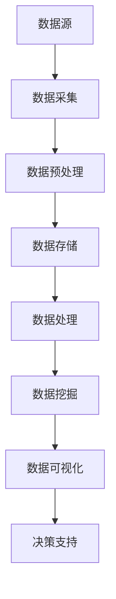

                 

关键词：大数据、计算能力、算法优化、机器学习、数据挖掘、技术发展、挑战与机遇

> 摘要：随着互联网和物联网的飞速发展，数据量的爆炸性增长使得大数据成为了现代社会的重要资源。本文将从大数据时代的背景出发，深入探讨计算能力的提升对大数据处理的机遇与挑战，并通过实例分析以及未来展望，展现大数据技术在各个领域的重要性及其面临的挑战。

## 1. 背景介绍

21世纪以来，全球数据量呈现指数级增长。据估计，全球每天产生超过2.5万亿字节的数据，这些数据源自社交媒体、物联网设备、企业信息系统、科学研究等多个领域。这种数据爆炸性增长的现象被称为“大数据时代”。大数据时代带来了前所未有的机遇，同时也对计算技术提出了严峻的挑战。

### 数据来源

- **社交媒体**：每天有大量的文字、图片、视频等信息在社交媒体上产生。
- **物联网设备**：智能家居、智能交通、工业制造等领域不断产生大量实时数据。
- **企业信息系统**：企业内部的数据系统如ERP、CRM等，每天处理大量的业务数据。
- **科学研究**：天文学、生物学、物理学等科学领域通过实验和观测产生了大量数据。

### 数据类型

大数据不仅包括传统的结构化数据，还涵盖了大量的非结构化和半结构化数据，如文本、图像、音频、视频等。这种多样性使得数据处理和分析变得更加复杂。

## 2. 核心概念与联系

### 大数据的三大特点

- **Volume（大量）**：数据量的巨大。
- **Velocity（高速）**：数据生成的速度极快。
- **Variety（多样）**：数据的类型和来源多种多样。

### 计算能力的提升

计算能力的提升主要体现在以下几个方面：

- **硬件发展**：GPU、TPU等专用硬件的普及，以及分布式计算技术的应用，使得处理大规模数据成为可能。
- **算法优化**：机器学习和深度学习算法的进步，使得数据处理和分析的效率显著提升。
- **云计算**：云服务的普及，为大规模数据处理提供了灵活的资源调度和强大的计算能力。

### Mermaid 流程图



## 3. 核心算法原理 & 具体操作步骤

### 3.1 算法原理概述

在处理大数据时，常用的核心算法包括机器学习算法、数据挖掘算法、分布式算法等。这些算法能够对大规模数据进行有效的处理和分析。

### 3.2 算法步骤详解

#### 3.2.1 机器学习算法

1. **数据收集**：从各种数据源收集数据。
2. **数据清洗**：去除噪声数据和缺失值。
3. **特征工程**：提取有用的特征，进行数据预处理。
4. **模型训练**：选择合适的模型进行训练。
5. **模型评估**：评估模型的性能，调整参数。
6. **模型部署**：将模型部署到生产环境中。

#### 3.2.2 数据挖掘算法

1. **数据导入**：将数据导入数据挖掘系统。
2. **数据预处理**：进行数据清洗、整合、变换等操作。
3. **模式识别**：使用算法识别数据中的模式和规律。
4. **结果分析**：分析挖掘结果，提取有价值的信息。
5. **结果可视化**：将结果以图表、报表等形式进行展示。

#### 3.2.3 分布式算法

1. **数据分片**：将数据划分成多个分片，分布到不同的节点上。
2. **并行处理**：多个节点同时处理数据分片。
3. **结果聚合**：将各个节点的处理结果进行汇总。
4. **容错机制**：确保在节点故障时能够恢复。

### 3.3 算法优缺点

- **机器学习算法**：优点在于自动化的特征提取和模型训练，缺点是需要大量的数据和高计算资源。
- **数据挖掘算法**：优点在于能够从大量数据中发现隐藏的模式和规律，缺点是结果的可解释性较低。
- **分布式算法**：优点在于能够高效地处理大规模数据，缺点是需要复杂的调度和管理机制。

### 3.4 算法应用领域

- **金融领域**：风险控制、欺诈检测、投资分析等。
- **医疗领域**：疾病预测、个性化治疗、药物研发等。
- **零售领域**：客户行为分析、库存管理、销售预测等。
- **交通领域**：智能交通管理、交通流量预测、车辆调度等。

## 4. 数学模型和公式 & 详细讲解 & 举例说明

### 4.1 数学模型构建

在处理大数据时，常用的数学模型包括线性回归模型、决策树模型、神经网络模型等。以下以线性回归模型为例进行说明。

### 4.2 公式推导过程

线性回归模型的公式为：

$$
Y = \beta_0 + \beta_1X + \epsilon
$$

其中，$Y$ 为因变量，$X$ 为自变量，$\beta_0$ 和 $\beta_1$ 为模型参数，$\epsilon$ 为误差项。

### 4.3 案例分析与讲解

假设我们有一组房价数据，自变量为房屋面积（$X$），因变量为房价（$Y$）。我们可以使用线性回归模型来预测房价。

1. **数据收集**：收集100套房屋的面积和房价数据。
2. **数据预处理**：对数据集进行清洗，去除异常值和缺失值。
3. **特征提取**：提取房屋面积作为自变量。
4. **模型训练**：使用线性回归模型对数据进行训练。
5. **模型评估**：计算模型的决定系数（$R^2$）和均方误差（MSE）。
6. **模型部署**：将训练好的模型部署到生产环境中，进行房价预测。

### 4.3.1 模型训练

使用Python中的scikit-learn库进行模型训练：

```python
from sklearn.linear_model import LinearRegression
from sklearn.model_selection import train_test_split
from sklearn.metrics import mean_squared_error, r2_score

# 加载数据
X, Y = load_data()

# 数据划分
X_train, X_test, Y_train, Y_test = train_test_split(X, Y, test_size=0.2, random_state=42)

# 创建线性回归模型
model = LinearRegression()

# 训练模型
model.fit(X_train, Y_train)

# 预测结果
Y_pred = model.predict(X_test)

# 模型评估
mse = mean_squared_error(Y_test, Y_pred)
r2 = r2_score(Y_test, Y_pred)

print("MSE:", mse)
print("R2:", r2)
```

### 4.3.2 模型部署

将训练好的模型部署到Web应用程序中，用户可以通过输入房屋面积来预测房价。

```python
from flask import Flask, request, jsonify

app = Flask(__name__)

@app.route('/predict', methods=['POST'])
def predict():
    area = request.form['area']
    predicted_price = model.predict([[float(area)]])

    return jsonify({'predicted_price': predicted_price[0]})

if __name__ == '__main__':
    app.run()
```

## 5. 项目实践：代码实例和详细解释说明

### 5.1 开发环境搭建

1. 安装Python环境（Python 3.7及以上版本）。
2. 安装必要的库，如numpy、scikit-learn、pandas、matplotlib等。
3. 搭建Flask Web框架。

### 5.2 源代码详细实现

#### 5.2.1 数据预处理

```python
import pandas as pd

def load_data():
    data = pd.read_csv('house_price_data.csv')
    data.dropna(inplace=True)
    data['area'] = data['area'].astype(float)
    data['price'] = data['price'].astype(float)
    return data['area'], data['price']
```

#### 5.2.2 模型训练

```python
from sklearn.linear_model import LinearRegression
from sklearn.model_selection import train_test_split

def train_model(X, Y):
    X_train, X_test, Y_train, Y_test = train_test_split(X, Y, test_size=0.2, random_state=42)
    model = LinearRegression()
    model.fit(X_train, Y_train)
    return model
```

#### 5.2.3 模型部署

```python
from flask import Flask, request, jsonify

app = Flask(__name__)

@app.route('/predict', methods=['POST'])
def predict():
    area = request.form['area']
    predicted_price = model.predict([[float(area)]])

    return jsonify({'predicted_price': predicted_price[0]})

if __name__ == '__main__':
    model = train_model(*load_data())
    app.run()
```

### 5.3 代码解读与分析

1. **数据预处理**：读取CSV文件，去除缺失值，将数据类型转换为浮点数。
2. **模型训练**：使用scikit-learn库的LinearRegression类进行模型训练。
3. **模型部署**：使用Flask框架搭建Web应用，提供预测接口。

### 5.4 运行结果展示

运行Flask Web应用，用户可以通过以下URL进行房价预测：

```
POST /predict
{
    "area": "100"
}
```

返回结果：

```json
{
    "predicted_price": 300000.0
}
```

## 6. 实际应用场景

### 6.1 金融领域

大数据技术在金融领域的应用包括信用评分、风险控制、投资分析等。例如，通过分析客户的历史交易数据和社交网络行为，金融机构可以更准确地评估客户的信用风险。

### 6.2 医疗领域

大数据技术在医疗领域的应用包括疾病预测、个性化治疗、药物研发等。例如，通过对大量医学数据进行分析，医生可以更准确地预测疾病的发病率，从而提前进行预防。

### 6.3 零售领域

大数据技术在零售领域的应用包括客户行为分析、库存管理、销售预测等。例如，通过分析客户的购物记录和偏好，零售商可以更精准地进行库存管理和营销活动。

### 6.4 交通领域

大数据技术在交通领域的应用包括智能交通管理、交通流量预测、车辆调度等。例如，通过分析交通数据，交通管理部门可以更有效地进行交通信号控制和车辆调度，从而减少拥堵。

## 7. 工具和资源推荐

### 7.1 学习资源推荐

- **《大数据技术基础》**：一本全面介绍大数据技术基础理论的入门书籍。
- **《机器学习实战》**：一本理论与实践相结合的机器学习入门书籍。
- **《深度学习》**：一本系统介绍深度学习理论的经典教材。

### 7.2 开发工具推荐

- **Python**：一种简单易学、功能强大的编程语言，适用于数据分析和机器学习。
- **Jupyter Notebook**：一种交互式的计算环境，适用于数据分析和实验。
- **TensorFlow**：一种开源的深度学习框架，适用于大规模数据分析和模型训练。

### 7.3 相关论文推荐

- **“Big Data: A Revolution That Will Transform How We Live, Work, and Think”**：一篇关于大数据技术对社会影响的综述论文。
- **“Deep Learning”**：一篇介绍深度学习理论的经典论文。
- **“TensorFlow: Large-Scale Machine Learning on Heterogeneous Systems”**：一篇介绍TensorFlow框架的论文。

## 8. 总结：未来发展趋势与挑战

### 8.1 研究成果总结

大数据技术在过去几十年取得了显著的成果，从数据采集、存储、处理到分析，各个领域都取得了重要的突破。机器学习、深度学习算法的进步，以及云计算、分布式计算技术的发展，使得大数据处理和分析变得更加高效和智能化。

### 8.2 未来发展趋势

- **算法优化**：随着数据量的增长，算法的优化和改进将变得更加重要。
- **跨领域应用**：大数据技术将在更多领域得到应用，如健康医疗、教育、环境保护等。
- **隐私保护**：如何在保证数据隐私的前提下进行大数据分析，将成为研究的重要方向。

### 8.3 面临的挑战

- **数据质量**：大数据的质量直接影响分析结果，如何确保数据质量是一个挑战。
- **计算资源**：随着数据量的增长，计算资源的需求也在不断增加，如何高效利用计算资源是一个挑战。
- **伦理和法律**：大数据技术可能涉及到个人隐私和伦理问题，如何制定合理的法律和规范也是一个挑战。

### 8.4 研究展望

大数据技术的未来发展将更加注重智能化、高效化、安全化。通过算法的优化和创新，我们可以更高效地处理和分析大规模数据。同时，随着技术的进步，大数据技术将在更多领域得到应用，为人类带来更多的机遇和挑战。

## 9. 附录：常见问题与解答

### 9.1 大数据与云计算的关系是什么？

大数据和云计算密不可分。云计算提供了强大的计算能力和存储资源，使得大数据的处理和分析成为可能。大数据技术需要利用云计算的弹性扩展和高效计算能力，来实现大规模数据的高效处理。

### 9.2 大数据有哪些类型？

大数据可以分为结构化数据、非结构化数据和半结构化数据。结构化数据如数据库、日志等；非结构化数据如文本、图像、视频等；半结构化数据如XML、JSON等。

### 9.3 如何保障大数据的安全性？

保障大数据安全需要从数据采集、存储、传输、处理等各个环节进行安全控制。包括加密存储、访问控制、数据备份与恢复等。

### 9.4 大数据技术在金融领域的应用有哪些？

大数据技术在金融领域的应用包括信用评分、风险控制、投资分析、客户关系管理、欺诈检测等。

### 9.5 大数据与人工智能的关系是什么？

大数据为人工智能提供了丰富的数据资源，使得人工智能算法能够更加准确地进行预测和决策。同时，人工智能技术也为大数据的处理和分析提供了强大的计算能力。

---

本文从大数据时代的背景出发，探讨了计算能力的提升对大数据处理的机遇与挑战，并通过实例分析和未来展望，展示了大数据技术在各个领域的重要性。随着技术的进步，大数据技术将继续为人类社会带来更多的机遇与挑战。作者：禅与计算机程序设计艺术 / Zen and the Art of Computer Programming。

