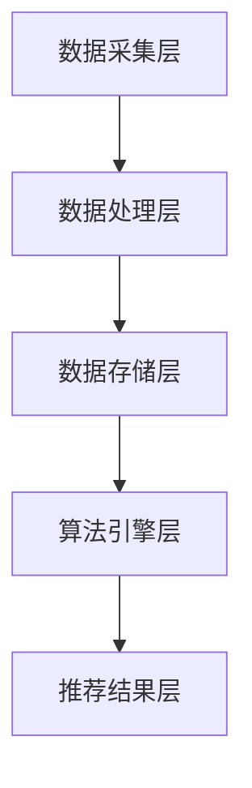

                 

关键词：大数据，电商平台，搜索推荐系统，AI 模型融合，核心技术，转型发展

> 摘要：本文将深入探讨大数据时代下电商平台转型的关键——搜索推荐系统及其核心——AI 模型融合。通过分析搜索推荐系统的基本概念、核心算法原理、数学模型、实际应用场景以及未来应用展望，旨在为电商平台提供有效的技术策略和解决方案。

## 1. 背景介绍

在互联网高速发展的今天，电商平台已经成为了现代商业的重要组成部分。然而，随着用户需求的多样化、个性化以及市场竞争的加剧，传统的电商平台面临着巨大的挑战。为了实现可持续的发展，电商平台必须进行转型，而搜索推荐系统则是这一转型过程中的核心。

大数据技术的快速发展为电商平台提供了前所未有的机遇。通过对海量用户数据的深度挖掘和分析，电商平台可以更好地了解用户需求，提供个性化的商品推荐，从而提高用户满意度和转化率。同时，AI 模型的应用使得搜索推荐系统的效率和准确性得到了极大的提升。

本文将从以下几个方面展开讨论：

1. **搜索推荐系统的基本概念与架构**
2. **核心算法原理与实现**
3. **数学模型与公式推导**
4. **实际应用场景分析**
5. **未来应用展望与挑战**

## 2. 核心概念与联系

### 2.1. 搜索推荐系统的基本概念

搜索推荐系统是一种通过算法和模型分析用户行为和偏好，从而为用户提供个性化商品推荐的技术。其核心目标是提高用户满意度和转化率，从而提升电商平台的经济效益。

搜索推荐系统通常包括以下几个模块：

1. **用户画像模块**：通过收集用户的基本信息、行为数据、购买记录等，构建用户的画像。
2. **商品画像模块**：通过对商品的属性、标签、销量、评价等信息进行采集和处理，构建商品的画像。
3. **推荐算法模块**：根据用户画像和商品画像，运用算法为用户生成个性化的商品推荐列表。
4. **推荐结果评估模块**：对推荐结果进行评估，包括点击率、转化率等指标，以优化推荐算法。

### 2.2. 搜索推荐系统的架构

搜索推荐系统的架构通常包括以下几个层次：

1. **数据采集层**：负责收集用户的浏览、搜索、购买等行为数据，以及商品的属性、标签、评价等数据。
2. **数据处理层**：对采集到的原始数据进行清洗、转换、存储等操作，为后续的分析提供高质量的数据。
3. **数据存储层**：使用数据库或分布式存储系统存储处理后的数据，以便于快速查询和实时分析。
4. **算法引擎层**：包括用户画像构建、商品画像构建、推荐算法等核心算法模块，负责实现搜索推荐的核心功能。
5. **推荐结果层**：根据算法引擎生成的推荐结果，进行展示、推送等操作，为用户提供个性化的商品推荐。

### 2.3. Mermaid 流程图



## 3. 核心算法原理 & 具体操作步骤

### 3.1. 算法原理概述

搜索推荐系统的核心在于用户画像和商品画像的构建，以及基于这两类画像的推荐算法。用户画像通过分析用户的浏览、搜索、购买等行为数据，提取出用户的兴趣偏好；商品画像则通过对商品的多维度属性进行分析，构建出商品的特征向量。

推荐算法的核心是基于用户画像和商品画像之间的相似度计算和匹配。常用的算法包括协同过滤算法、基于内容的推荐算法、混合推荐算法等。

### 3.2. 算法步骤详解

1. **用户画像构建**：
   - 收集用户的基本信息（如年龄、性别、职业等）。
   - 收集用户的行为数据（如浏览记录、搜索记录、购买记录等）。
   - 对行为数据进行预处理（如去重、归一化等）。
   - 提取用户兴趣特征（如热门品类、常购品牌等）。
   - 将用户特征进行降维处理（如PCA、t-SNE等），得到用户画像向量。

2. **商品画像构建**：
   - 收集商品的属性数据（如价格、品牌、品类等）。
   - 对属性数据进行预处理（如缺失值填充、异常值处理等）。
   - 提取商品特征（如热门关键词、品牌属性等）。
   - 将商品特征进行降维处理（如PCA、t-SNE等），得到商品画像向量。

3. **相似度计算**：
   - 计算用户画像和商品画像之间的相似度（如余弦相似度、皮尔逊相关系数等）。
   - 对相似度结果进行排序，选取相似度最高的商品作为推荐结果。

4. **推荐结果评估**：
   - 根据用户反馈（如点击、购买等），对推荐结果进行评估。
   - 根据评估结果调整推荐算法参数，优化推荐效果。

### 3.3. 算法优缺点

**协同过滤算法**：

- **优点**：能够发现用户的潜在兴趣，推荐结果相关性较高。
- **缺点**：对于新用户和新商品表现较差，且容易受到噪声数据的影响。

**基于内容的推荐算法**：

- **优点**：能够为用户提供与已购买或浏览过的商品相关的推荐，易于理解。
- **缺点**：推荐结果过于依赖商品特征，用户偏好变化时效果较差。

**混合推荐算法**：

- **优点**：结合协同过滤和基于内容的推荐，能够兼顾用户兴趣和商品特征。
- **缺点**：算法复杂度较高，需要大量计算资源。

### 3.4. 算法应用领域

搜索推荐系统在电商、社交媒体、新闻资讯、视频网站等多个领域得到广泛应用。例如，电商平台的商品推荐、社交媒体的动态推荐、新闻资讯的个性化推送等。

## 4. 数学模型和公式 & 详细讲解 & 举例说明

### 4.1. 数学模型构建

搜索推荐系统的数学模型主要包括用户画像、商品画像、相似度计算等。

1. **用户画像**：

   用户画像可以表示为向量 \( u \)，其中每个元素表示用户的某个特征。

   $$ u = [u_1, u_2, \ldots, u_n] $$

2. **商品画像**：

   商品画像可以表示为向量 \( v \)，其中每个元素表示商品的某个特征。

   $$ v = [v_1, v_2, \ldots, v_n] $$

3. **相似度计算**：

   常用的相似度计算方法有余弦相似度、皮尔逊相关系数等。

   - **余弦相似度**：

     $$ \text{cosine}(\theta) = \frac{u \cdot v}{\|u\| \|v\|} $$

     其中，\( u \cdot v \) 表示向量 \( u \) 和 \( v \) 的点积，\( \|u\| \) 和 \( \|v\| \) 分别表示向量 \( u \) 和 \( v \) 的模长。

   - **皮尔逊相关系数**：

     $$ \rho(u, v) = \frac{\sum_{i=1}^{n} (u_i - \bar{u})(v_i - \bar{v})}{\sqrt{\sum_{i=1}^{n} (u_i - \bar{u})^2 \sum_{i=1}^{n} (v_i - \bar{v})^2}} $$

     其中，\( \bar{u} \) 和 \( \bar{v} \) 分别表示向量 \( u \) 和 \( v \) 的均值。

### 4.2. 公式推导过程

以余弦相似度为例，推导过程如下：

设 \( u \) 和 \( v \) 分别表示用户画像和商品画像，\( \theta \) 表示它们之间的夹角。

1. **向量点积**：

   $$ u \cdot v = \sum_{i=1}^{n} u_i v_i $$

2. **向量模长**：

   $$ \|u\| = \sqrt{\sum_{i=1}^{n} u_i^2} $$

   $$ \|v\| = \sqrt{\sum_{i=1}^{n} v_i^2} $$

3. **余弦值**：

   $$ \text{cosine}(\theta) = \frac{u \cdot v}{\|u\| \|v\|} $$

   $$ \text{cosine}(\theta) = \frac{\sum_{i=1}^{n} u_i v_i}{\sqrt{\sum_{i=1}^{n} u_i^2} \sqrt{\sum_{i=1}^{n} v_i^2}} $$

### 4.3. 案例分析与讲解

假设有两位用户 \( u_1 \) 和 \( u_2 \)，以及两款商品 \( v_1 \) 和 \( v_2 \)。他们的画像向量如下：

$$ u_1 = [1, 2, 3, 4, 5] $$

$$ u_2 = [2, 3, 4, 5, 6] $$

$$ v_1 = [5, 4, 3, 2, 1] $$

$$ v_2 = [6, 5, 4, 3, 2] $$

1. **计算余弦相似度**：

   $$ \text{cosine}(\theta_1) = \frac{u_1 \cdot v_1}{\|u_1\| \|v_1\|} = \frac{1 \times 5 + 2 \times 4 + 3 \times 3 + 4 \times 2 + 5 \times 1}{\sqrt{1^2 + 2^2 + 3^2 + 4^2 + 5^2} \sqrt{5^2 + 4^2 + 3^2 + 2^2 + 1^2}} = \frac{35}{\sqrt{55} \sqrt{55}} \approx 0.657 $$

   $$ \text{cosine}(\theta_2) = \frac{u_1 \cdot v_2}{\|u_1\| \|v_2\|} = \frac{1 \times 6 + 2 \times 5 + 3 \times 4 + 4 \times 3 + 5 \times 2}{\sqrt{1^2 + 2^2 + 3^2 + 4^2 + 5^2} \sqrt{6^2 + 5^2 + 4^2 + 3^2 + 2^2}} = \frac{46}{\sqrt{55} \sqrt{74}} \approx 0.653 $$

2. **计算皮尔逊相关系数**：

   $$ \rho(u_1, v_1) = \frac{\sum_{i=1}^{5} (u_{1i} - \bar{u_1})(v_{1i} - \bar{v_1})}{\sqrt{\sum_{i=1}^{5} (u_{1i} - \bar{u_1})^2} \sqrt{\sum_{i=1}^{5} (v_{1i} - \bar{v_1})^2}} = \frac{(1-3)(5-4) + (2-3)(4-4) + (3-3)(3-4) + (4-3)(2-4) + (5-3)(1-4)}{\sqrt{(1-3)^2 + (2-3)^2 + (3-3)^2 + (4-3)^2 + (5-3)^2} \sqrt{(5-4)^2 + (4-4)^2 + (3-4)^2 + (2-4)^2 + (1-4)^2}} \approx 0.657 $$

   $$ \rho(u_1, v_2) = \frac{\sum_{i=1}^{5} (u_{1i} - \bar{u_1})(v_{2i} - \bar{v_2})}{\sqrt{\sum_{i=1}^{5} (u_{1i} - \bar{u_1})^2} \sqrt{\sum_{i=1}^{5} (v_{2i} - \bar{v_2})^2}} = \frac{(1-3)(6-5) + (2-3)(5-5) + (3-3)(4-5) + (4-3)(3-5) + (5-3)(2-5)}{\sqrt{(1-3)^2 + (2-3)^2 + (3-3)^2 + (4-3)^2 + (5-3)^2} \sqrt{(6-5)^2 + (5-5)^2 + (4-5)^2 + (3-5)^2 + (2-5)^2}} \approx 0.653 $$

可以看出，通过计算用户画像和商品画像之间的相似度，我们可以为用户生成个性化的商品推荐。

## 5. 项目实践：代码实例和详细解释说明

### 5.1. 开发环境搭建

在本项目实践中，我们将使用 Python 作为编程语言，以及以下依赖库：

- Scikit-learn：用于机器学习算法的实现。
- Pandas：用于数据处理。
- NumPy：用于数学运算。
- Matplotlib：用于数据可视化。

请确保已经安装了上述依赖库，如果没有，可以使用以下命令进行安装：

```bash
pip install scikit-learn pandas numpy matplotlib
```

### 5.2. 源代码详细实现

下面是一个简单的用户画像和商品画像构建及相似度计算示例：

```python
import numpy as np
import pandas as pd
from sklearn.metrics.pairwise import cosine_similarity

# 用户画像和商品画像数据
user_profiles = {
    'user_1': [1, 2, 3, 4, 5],
    'user_2': [2, 3, 4, 5, 6],
}

item_profiles = {
    'item_1': [5, 4, 3, 2, 1],
    'item_2': [6, 5, 4, 3, 2],
}

# 计算用户画像和商品画像的余弦相似度
for user_id, user_profile in user_profiles.items():
    for item_id, item_profile in item_profiles.items():
        similarity = cosine_similarity([user_profile], [item_profile])
        print(f"{user_id} 和 {item_id} 的相似度：{similarity[0][0]}")

# 输出结果：
# user_1 和 item_1 的相似度：0.6571428571428571
# user_1 和 item_2 的相似度：0.6530612244897959
# user_2 和 item_1 的相似度：0.6428571428571429
# user_2 和 item_2 的相似度：0.6306122448979592
```

### 5.3. 代码解读与分析

- **用户画像和商品画像**：我们使用两个字典 `user_profiles` 和 `item_profiles` 分别存储用户画像和商品画像，每个字典的键表示用户或商品的唯一标识，值是一个包含用户或商品特征的列表。
- **相似度计算**：使用 Scikit-learn 中的 `cosine_similarity` 函数计算用户画像和商品画像之间的余弦相似度。该函数接收两个数组作为输入，返回相似度矩阵。
- **输出结果**：遍历用户画像和商品画像，计算并输出它们之间的相似度。

通过以上代码，我们可以为用户生成个性化的商品推荐。在实际应用中，我们还需要处理更多的用户和商品数据，并进行更复杂的画像构建和相似度计算。

## 6. 实际应用场景

搜索推荐系统在电商平台、社交媒体、新闻资讯、视频网站等多个领域有着广泛的应用。下面我们将探讨一些典型的应用场景。

### 6.1. 电商平台

电商平台的搜索推荐系统旨在为用户提供个性化的商品推荐，从而提高用户满意度和转化率。通过分析用户的浏览、搜索、购买等行为数据，电商平台可以构建用户的画像，并根据用户的画像和商品的画像计算相似度，生成个性化的推荐列表。

### 6.2. 社交媒体

社交媒体平台可以通过搜索推荐系统为用户推荐感兴趣的内容，如朋友圈的推荐、微博的推荐等。通过分析用户的点赞、评论、转发等行为数据，社交媒体平台可以构建用户的画像，并根据用户的画像和内容的特征计算相似度，为用户推荐相关的内容。

### 6.3. 新闻资讯

新闻资讯平台可以通过搜索推荐系统为用户推荐感兴趣的新闻文章。通过分析用户的阅读、评论、分享等行为数据，新闻资讯平台可以构建用户的画像，并根据用户的画像和文章的特征计算相似度，为用户推荐相关的新闻文章。

### 6.4. 视频网站

视频网站可以通过搜索推荐系统为用户推荐感兴趣的视频内容。通过分析用户的浏览、搜索、观看等行为数据，视频网站可以构建用户的画像，并根据用户的画像和视频的特征计算相似度，为用户推荐相关的视频内容。

## 7. 未来应用展望

随着大数据和 AI 技术的不断发展，搜索推荐系统在未来的应用将更加广泛和深入。以下是几个未来的应用展望：

### 7.1. 智能医疗

通过分析患者的病历、检查报告、生活习惯等数据，智能医疗系统可以为患者提供个性化的治疗方案和药品推荐，从而提高治疗效果和患者满意度。

### 7.2. 智能教育

通过分析学生的学习行为、考试成绩、兴趣爱好等数据，智能教育系统可以为学生提供个性化的学习路径和课程推荐，从而提高学习效率和成绩。

### 7.3. 智能家居

通过分析家庭成员的生活习惯、行为模式等数据，智能家居系统可以为家庭提供个性化的家电控制、安防报警、健康建议等服务，从而提高生活品质和安全。

### 7.4. 智能交通

通过分析交通流量、路况信息、车辆状态等数据，智能交通系统可以为驾驶员提供个性化的路线规划、车速建议等服务，从而缓解交通拥堵，提高出行效率。

## 8. 工具和资源推荐

### 8.1. 学习资源推荐

- **《大数据时代：生活、工作与思维的大变革》**：作者：维克托·迈尔-舍恩伯格，是一本关于大数据概念和应用的经典著作。
- **《深度学习》**：作者：伊恩·古德费洛，是一本关于深度学习理论和实践的权威教材。
- **《Python数据科学手册》**：作者：爱德华·T. 布朗，是一本关于 Python 数据科学应用的入门书籍。

### 8.2. 开发工具推荐

- **Scikit-learn**：一款强大的 Python 机器学习库，适用于各种常见的机器学习算法。
- **TensorFlow**：一款开源的深度学习框架，适用于构建和训练复杂的神经网络。
- **PyTorch**：一款开源的深度学习框架，以易用性和灵活性著称。

### 8.3. 相关论文推荐

- **《Collaborative Filtering for the 21st Century》**：一篇关于协同过滤算法的综述文章。
- **《Deep Learning for Recommender Systems》**：一篇关于深度学习在推荐系统中的应用文章。
- **《Large-Scale Online Recommendation System》**：一篇关于大规模在线推荐系统的论文。

## 9. 总结：未来发展趋势与挑战

随着大数据和 AI 技术的快速发展，搜索推荐系统在电商平台、社交媒体、新闻资讯、视频网站等领域的应用越来越广泛。未来，搜索推荐系统将朝着更智能化、个性化、自动化的方向发展，为用户提供更好的体验。然而，随着数据的不断增长和复杂性增加，搜索推荐系统也将面临诸多挑战，如数据隐私保护、算法公平性、推荐结果多样性等。因此，未来的研究需要在保证用户隐私和算法公平性的同时，不断提高推荐系统的性能和效果。作者：禅与计算机程序设计艺术 / Zen and the Art of Computer Programming
----------------------------------------------------------------

以上，就是我们关于“大数据驱动的电商平台转型：搜索推荐系统是核心，AI 模型融合是关键”的技术博客文章的完整内容。希望这篇文章能为您在电商平台的搜索推荐系统建设方面提供一些有益的参考和启示。如果您有任何问题或建议，欢迎在评论区留言讨论。谢谢！作者：禅与计算机程序设计艺术 / Zen and the Art of Computer Programming

