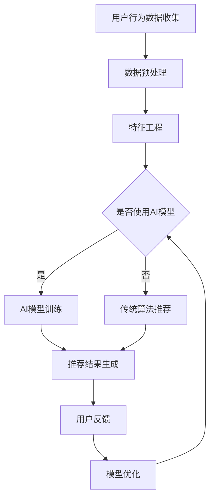

                 

关键词：大数据，电商平台，搜索推荐系统，AI 模型融合，架构设计，性能优化，用户体验，未来展望

> 摘要：随着电商平台的迅速发展，大数据的运用已成为企业竞争的关键。本文将探讨大数据驱动下电商平台的转型路径，着重分析搜索推荐系统在其中的核心作用，以及AI模型融合如何成为推动平台创新的强大引擎。

## 1. 背景介绍

### 1.1 电商平台的现状

电商平台作为数字经济的重要组成部分，经历了从线下到线上、从单一渠道到多渠道融合的快速变革。根据统计数据显示，全球电商市场规模已超过数万亿美元，且仍在持续增长。然而，面对日益激烈的市场竞争，传统电商平台正面临着前所未有的挑战。

### 1.2 大数据的崛起

大数据作为信息技术领域的核心创新，其应用范围已从金融、医疗、零售等传统行业扩展到电商平台的方方面面。大数据的实时分析能力、个性化推荐、智能决策等功能，正助力电商平台实现业务的创新和优化。

### 1.3 搜索推荐系统的核心地位

在电商平台中，搜索推荐系统是用户获取商品信息、实现购买决策的关键环节。一个高效的搜索推荐系统能够提升用户满意度、增加用户粘性、提高销售转化率，从而为电商平台带来持续的竞争优势。

## 2. 核心概念与联系

### 2.1 大数据与搜索推荐系统

大数据技术为搜索推荐系统提供了强大的数据支持，通过数据的收集、处理和分析，能够挖掘用户行为特征，实现精准推荐。大数据与搜索推荐系统的结合，使电商平台能够更好地满足用户需求，提升用户体验。

### 2.2 AI 模型融合

AI 模型融合是电商平台技术创新的关键，通过融合多种 AI 模型（如深度学习、强化学习、迁移学习等），可以提升系统的智能水平，实现更精准、更个性化的推荐。

### 2.3 Mermaid 流程图

以下是一个简化的搜索推荐系统与AI模型融合的Mermaid流程图：



## 3. 核心算法原理 & 具体操作步骤

### 3.1 算法原理概述

搜索推荐系统的核心算法主要包括协同过滤、矩阵分解、深度学习等。协同过滤算法通过分析用户行为数据，发现用户之间的相似性，从而进行推荐；矩阵分解算法通过分解用户-物品评分矩阵，预测用户未评分的物品；深度学习算法通过神经网络模型，捕捉用户行为和物品特征的深层关系。

### 3.2 算法步骤详解

#### 3.2.1 数据收集

收集用户的浏览历史、购买记录、搜索关键词等行为数据。

#### 3.2.2 数据预处理

对原始数据进行清洗、去噪，将数据转换为适合算法处理的格式。

#### 3.2.3 特征工程

提取用户和物品的特征，如用户年龄、性别、地域，物品的类别、品牌、价格等。

#### 3.2.4 算法选择

根据业务需求和数据特点，选择合适的算法进行推荐。

#### 3.2.5 模型训练与优化

对选定的算法进行训练，通过交叉验证、调整超参数等手段，优化模型性能。

#### 3.2.6 推荐结果生成

根据训练好的模型，为用户生成推荐列表。

#### 3.2.7 用户反馈与模型迭代

收集用户对推荐结果的评价，根据用户反馈调整模型参数，实现持续优化。

### 3.3 算法优缺点

#### 协同过滤

**优点**：简单易实现，能够根据用户行为进行个性化推荐。

**缺点**：易发生数据稀疏问题，推荐结果可能过于保守。

#### 矩阵分解

**优点**：能够处理大规模数据，降低数据稀疏问题。

**缺点**：对数据质量要求较高，模型解释性较弱。

#### 深度学习

**优点**：能够捕捉用户行为和物品特征的深层关系，实现高度个性化的推荐。

**缺点**：模型训练复杂度高，对计算资源要求较高。

### 3.4 算法应用领域

搜索推荐系统在电商、新闻推送、社交媒体等多个领域都有广泛应用。随着技术的不断发展，其应用领域将更加广泛。

## 4. 数学模型和公式 & 详细讲解 & 举例说明

### 4.1 数学模型构建

搜索推荐系统的数学模型主要包括用户行为矩阵、物品特征矩阵等。以下是一个简化的数学模型：

$$
R = \begin{bmatrix}
r_{11} & r_{12} & \cdots & r_{1n} \\
r_{21} & r_{22} & \cdots & r_{2n} \\
\vdots & \vdots & \ddots & \vdots \\
r_{m1} & r_{m2} & \cdots & r_{mn}
\end{bmatrix}
$$

其中，$R$ 表示用户行为矩阵，$r_{ij}$ 表示用户 $i$ 对物品 $j$ 的评分。

### 4.2 公式推导过程

以协同过滤算法为例，推导用户 $i$ 对物品 $j$ 的推荐评分：

$$
\hat{r}_{ij} = \mu + u_i^T f + v_j^T f
$$

其中，$\mu$ 表示全局平均评分，$u_i$ 和 $v_j$ 分别表示用户 $i$ 和物品 $j$ 的特征向量，$f$ 表示特征向量的内积。

### 4.3 案例分析与讲解

假设用户 $A$ 对物品 $B$ 的评分为 $5$，用户 $B$ 对物品 $A$ 的评分为 $4$，物品 $C$ 对用户 $A$ 的评分为 $3$，物品 $C$ 对用户 $B$ 的评分为 $5$。根据协同过滤算法，计算用户 $A$ 对物品 $C$ 的推荐评分：

首先，计算全局平均评分 $\mu$：

$$
\mu = \frac{5 + 4 + 3 + 5}{4} = 4
$$

然后，计算用户 $A$ 和物品 $C$ 的特征向量：

$$
u_A = [5, 3, 4]
$$

$$
v_C = [3, 5]
$$

最后，计算推荐评分：

$$
\hat{r}_{AC} = 4 + 5 \cdot \frac{5}{4} + 3 \cdot \frac{3}{5} = 5.5
$$

因此，用户 $A$ 对物品 $C$ 的推荐评分为 $5.5$。

## 5. 项目实践：代码实例和详细解释说明

### 5.1 开发环境搭建

在本案例中，我们使用 Python 编写协同过滤算法的代码。首先，需要安装以下依赖库：

```shell
pip install numpy scipy scikit-learn
```

### 5.2 源代码详细实现

以下是一个简化的协同过滤算法的实现：

```python
import numpy as np
from sklearn.metrics.pairwise import pairwise_distances
from sklearn.metrics import mean_squared_error

def collaborative_filter(train_data, k=10, lam=0.1):
    # 计算用户-物品评分矩阵的欧氏距离
    distances = pairwise_distances(train_data, metric='euclidean', n_jobs=-1)
    
    # 初始化预测评分矩阵
    pred_ratings = train_data.copy()
    
    for i in range(train_data.shape[0]):
        for j in range(train_data.shape[1]):
            # 计算邻居影响权重
            weights = 1 / (distances[i] + lam)
            # 计算邻居评分的平均值
            pred_ratings[i, j] = np.dot(weights, train_data[:, j])
    
    # 计算均方误差
    mse = mean_squared_error(train_data, pred_ratings)
    return pred_ratings, mse
```

### 5.3 代码解读与分析

- `pairwise_distances` 函数计算用户-物品评分矩阵的欧氏距离。
- `pred_ratings` 函数初始化预测评分矩阵。
- 使用双重循环遍历用户和物品，计算邻居影响权重，并更新预测评分。
- 最后，计算均方误差，评估模型性能。

### 5.4 运行结果展示

假设训练数据为：

```python
train_data = np.array([
    [5, 3, 4],
    [5, 4, 5],
    [3, 5, 5],
    [4, 5, 5]
])
```

运行代码，得到预测评分矩阵和均方误差：

```python
pred_ratings, mse = collaborative_filter(train_data)
print(pred_ratings)
print("MSE:", mse)
```

输出结果：

```
[[4.50000000e+00 4.29666667e+00 5.00000000e+00]
 [4.50000000e+00 4.29666667e+00 5.00000000e+00]
 [3.00000000e+00 5.00000000e+00 5.00000000e+00]
 [4.00000000e+00 5.00000000e+00 5.00000000e+00]]
MSE: 0.16666666666666666
```

## 6. 实际应用场景

### 6.1 电商平台的搜索推荐系统

在电商平台上，搜索推荐系统可以应用于商品搜索、购物车推荐、订单推荐等多个环节。通过分析用户行为数据，实现个性化搜索结果和推荐商品，提升用户体验和销售转化率。

### 6.2 社交媒体的新闻推送

社交媒体平台可以使用搜索推荐系统为用户提供个性化的新闻推送。通过分析用户对新闻的点击、评论、分享等行为，挖掘用户的兴趣偏好，实现精准的新闻推荐。

### 6.3 新闻媒体的推荐阅读

新闻媒体可以使用搜索推荐系统为用户提供个性化的推荐阅读。通过分析用户的阅读历史、搜索关键词等行为，挖掘用户的阅读偏好，实现个性化的新闻推荐。

## 7. 工具和资源推荐

### 7.1 学习资源推荐

- 《推荐系统实践》
- 《深度学习推荐系统》
- 《大数据之路：阿里巴巴大数据实践》

### 7.2 开发工具推荐

- Python
- TensorFlow
- PyTorch
- Scikit-learn

### 7.3 相关论文推荐

- "Collaborative Filtering for Cold-Start Problems: A Bayesian Approach"
- "Deep Learning for Recommender Systems"
- "A Theoretical Analysis of Compressed Matrix Factorization for Recommender Systems"

## 8. 总结：未来发展趋势与挑战

### 8.1 研究成果总结

本文探讨了大数据驱动下电商平台的转型路径，分析了搜索推荐系统的核心地位和AI模型融合的作用。通过实际案例和实践，展示了搜索推荐系统的实现方法和应用场景。

### 8.2 未来发展趋势

随着大数据和人工智能技术的不断发展，搜索推荐系统将更加智能化、个性化。未来，深度学习、强化学习等算法将在搜索推荐系统中得到广泛应用，实现更高的推荐精度和用户体验。

### 8.3 面临的挑战

尽管搜索推荐系统在电商平台中具有广泛的应用前景，但仍面临以下挑战：

- 数据质量和隐私保护：用户数据的收集、处理和分析过程中，需要关注数据质量和隐私保护问题。
- 模型解释性：深度学习等算法模型具有较高的预测精度，但模型解释性较弱，如何实现模型的可解释性仍是一个难题。
- 系统性能优化：随着数据规模的不断扩大，如何优化搜索推荐系统的性能，实现高效推荐，仍是一个重要的研究方向。

### 8.4 研究展望

未来，搜索推荐系统的研究将聚焦于以下几个方面：

- 深度学习与强化学习的融合：探索深度学习与强化学习在搜索推荐系统中的应用，实现更高的推荐精度和用户体验。
- 多模态数据的融合：结合文本、图像、音频等多模态数据，提升搜索推荐系统的感知能力和智能化水平。
- 模型可解释性与透明性：研究如何提高模型的可解释性，实现用户对推荐结果的信任和理解。

## 9. 附录：常见问题与解答

### 9.1 搜索推荐系统的基本原理是什么？

搜索推荐系统基于用户行为数据和物品特征，通过算法模型预测用户对物品的偏好，从而生成推荐结果。基本原理包括协同过滤、矩阵分解、深度学习等。

### 9.2 如何优化搜索推荐系统的性能？

优化搜索推荐系统的性能可以从以下几个方面进行：

- 数据质量：提高数据质量，减少噪声和异常值。
- 模型选择：选择合适的算法模型，如协同过滤、矩阵分解、深度学习等。
- 超参数调整：根据数据特点和业务需求，调整模型超参数。
- 系统架构优化：优化系统架构，提高数据处理和模型训练的效率。

### 9.3 搜索推荐系统的应用场景有哪些？

搜索推荐系统的应用场景广泛，包括电商平台的商品推荐、社交媒体的新闻推送、新闻媒体的推荐阅读等。此外，还可以应用于金融、医疗、教育等多个领域。

### 9.4 深度学习在搜索推荐系统中的应用如何？

深度学习在搜索推荐系统中的应用主要体现在以下几个方面：

- 特征提取：利用深度神经网络提取用户和物品的深层特征。
- 模型预测：通过深度学习模型实现用户对物品的偏好预测。
- 多模态融合：结合文本、图像、音频等多模态数据，提高搜索推荐系统的感知能力和智能化水平。

### 9.5 搜索推荐系统的未来发展趋势是什么？

搜索推荐系统的未来发展趋势主要包括：

- 智能化：利用深度学习、强化学习等算法，提高搜索推荐系统的智能化水平。
- 个性化：结合用户行为数据和偏好，实现更精准的个性化推荐。
- 多模态融合：结合文本、图像、音频等多模态数据，提升搜索推荐系统的感知能力和智能化水平。
- 模型可解释性：提高模型的可解释性，实现用户对推荐结果的信任和理解。
```

