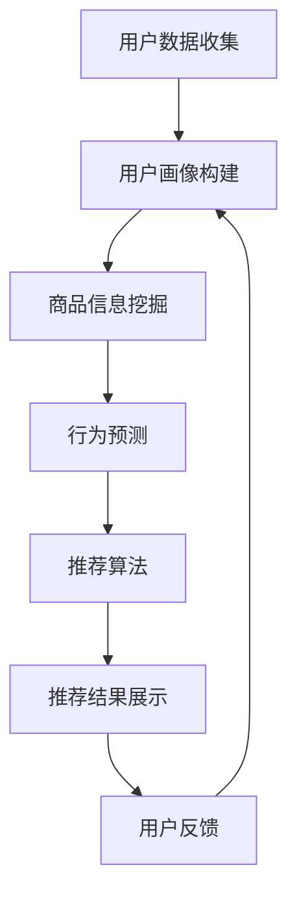

                 

关键词：大数据、电商推荐系统、AI 模型融合、用户体验优化、转化率

> 摘要：本文深入探讨了大数据驱动的电商推荐系统，重点分析了AI模型融合、用户体验优化和转化率提升的核心策略。通过详细的理论阐述和实际案例分析，为电商企业提供了科学有效的推荐系统构建和优化方案。

## 1. 背景介绍

随着互联网技术的飞速发展，电商行业迎来了前所未有的繁荣。消费者的购买行为日益复杂，个性化需求不断增长，这要求电商平台必须提供精准、高效的推荐服务，以满足消费者的个性化需求，提高用户体验和转化率。大数据技术的兴起，为电商推荐系统带来了新的机遇。通过海量用户行为数据和分析，电商平台可以更好地理解用户需求，精准推送商品，提升用户满意度和购买转化率。

然而，传统的推荐系统主要依赖于基于内容的过滤和协同过滤等方法，虽然在一定程度上满足了用户的需求，但存在以下几个问题：

1. **推荐精度不高**：传统方法依赖于历史数据和用户行为，对用户当前兴趣的理解有限，难以提供高度个性化的推荐。
2. **用户体验不佳**：推荐结果往往缺乏灵活性和多样性，用户容易产生疲劳和厌烦情绪。
3. **模型适应性差**：随着市场环境的变化，传统推荐系统的适应性较差，难以快速调整以适应新需求。

为了解决上述问题，AI 模型融合成为了当前电商推荐系统的重要研究方向。通过整合多种AI模型，结合大数据分析和用户行为预测，可以实现更精准、更高效的推荐，提升用户体验和转化率。

## 2. 核心概念与联系

### 2.1 大数据在电商推荐中的应用

大数据技术在电商推荐系统中主要应用于以下方面：

1. **用户画像构建**：通过收集和分析用户的基本信息、购物行为、浏览记录等数据，构建详细的用户画像，为个性化推荐提供基础。
2. **商品信息挖掘**：对商品的各种属性、价格、销量、评价等信息进行深度挖掘，为推荐策略提供支持。
3. **行为预测**：通过分析用户的浏览、收藏、购买等行为，预测用户的下一步操作，实现精准推送。

### 2.2 AI 模型融合的基本原理

AI 模型融合是指将多种不同的机器学习模型结合起来，共同完成推荐任务。常见的AI模型融合方法包括：

1. **模型级融合**：将多个独立的模型训练结果进行综合，得到最终的推荐结果。
2. **特征级融合**：对输入特征进行预处理，结合不同模型的特征表示，形成统一的特征向量。
3. **决策级融合**：在决策阶段，将多个模型的预测结果进行综合，形成最终的决策。

### 2.3 用户体验优化与转化率提升

用户体验优化和转化率提升是电商推荐系统的两大核心目标。具体策略包括：

1. **推荐结果的多样性**：通过多种推荐算法的组合，提供多样化的推荐结果，避免用户产生疲劳感。
2. **推荐策略的实时性**：根据用户的实时行为，动态调整推荐策略，提高推荐结果的精准度。
3. **推荐结果的反馈机制**：收集用户对推荐结果的反馈，不断优化推荐算法，提升用户满意度。

### 2.4 Mermaid 流程图

以下是一个简化的电商推荐系统架构的 Mermaid 流程图：



## 3. 核心算法原理 & 具体操作步骤

### 3.1 算法原理概述

电商推荐系统的核心算法主要包括：

1. **协同过滤算法**：基于用户的行为数据，找到相似用户和相似商品，进行推荐。
2. **内容匹配算法**：基于商品的属性和用户的历史偏好，进行推荐。
3. **深度学习算法**：通过神经网络模型，对用户行为数据进行建模和预测。

### 3.2 算法步骤详解

1. **用户数据收集**：收集用户的购买记录、浏览记录、搜索记录等数据。
2. **数据预处理**：对收集到的数据进行清洗、去重、归一化等处理。
3. **用户画像构建**：根据用户的购物行为，构建用户的兴趣偏好模型。
4. **商品信息挖掘**：提取商品的关键特征，如类别、价格、品牌等。
5. **行为预测**：使用深度学习算法，预测用户的下一步操作。
6. **推荐算法**：结合协同过滤和内容匹配算法，生成推荐结果。
7. **推荐结果展示**：将推荐结果呈现给用户，并根据用户反馈进行优化。

### 3.3 算法优缺点

1. **协同过滤算法**：优点是能够发现用户的相似性，推荐效果较好；缺点是容易产生冷启动问题，且推荐结果过于集中。
2. **内容匹配算法**：优点是能够根据用户的兴趣偏好进行推荐，推荐结果多样化；缺点是计算复杂度较高，推荐效果受商品属性影响较大。
3. **深度学习算法**：优点是能够处理复杂的用户行为数据，提高推荐精度；缺点是需要大量的数据和计算资源，且模型难以解释。

### 3.4 算法应用领域

AI 模型融合算法在电商推荐系统中的应用非常广泛，包括：

1. **电商平台**：如淘宝、京东等，通过个性化推荐，提高用户满意度和转化率。
2. **跨境电商**：通过推荐算法，帮助用户发现感兴趣的商品，提高购买意愿。
3. **在线教育平台**：根据用户的学习行为，推荐合适的学习资源和课程。

## 4. 数学模型和公式 & 详细讲解 & 举例说明

### 4.1 数学模型构建

电商推荐系统的核心数学模型包括用户行为预测模型和推荐算法模型。

1. **用户行为预测模型**：

   $$ User_{Behavior\_Prediction} = f(User\_Profile, Item\_Features, Context) $$

   其中，$User\_Profile$为用户画像，$Item\_Features$为商品特征，$Context$为上下文信息。

2. **推荐算法模型**：

   $$ Recommendation = f(Similarity\_Score, Content\_Score, User\_Feedback) $$

   其中，$Similarity\_Score$为用户与商品的相似度分数，$Content\_Score$为商品与用户兴趣的匹配度分数，$User\_Feedback$为用户对推荐结果的反馈。

### 4.2 公式推导过程

以协同过滤算法为例，推导用户与商品的相似度分数。

1. **用户-用户相似度计算**：

   $$ Similarity_{UU} = \frac{User\_Similarity\_Score}{\sqrt{User\_Similarity\_Sum}} $$

   其中，$User\_Similarity\_Score$为用户之间的相似度得分，$User\_Similarity\_Sum$为所有相似度得分的总和。

2. **商品-商品相似度计算**：

   $$ Similarity_{II} = \frac{Item\_Similarity\_Score}{\sqrt{Item\_Similarity\_Sum}} $$

   其中，$Item\_Similarity\_Score$为商品之间的相似度得分，$Item\_Similarity\_Sum$为所有相似度得分的总和。

3. **用户-商品相似度计算**：

   $$ Similarity_{UI} = Similarity_{UU} \times Similarity_{II} $$

   其中，$Similarity_{UU}$为用户与用户的相似度，$Similarity_{II}$为商品与商品的相似度。

### 4.3 案例分析与讲解

假设有两个用户A和B，他们分别购买了商品X和Y，且商品X和Y在某一维度上的特征相似度得分为0.8。

1. **用户A与用户B的相似度**：

   $$ Similarity_{AB} = \frac{0.8}{\sqrt{0.8}} = 0.8 $$

2. **商品X与商品Y的相似度**：

   $$ Similarity_{XY} = \frac{0.8}{\sqrt{0.8}} = 0.8 $$

3. **用户A与商品Y的相似度**：

   $$ Similarity_{AY} = Similarity_{AB} \times Similarity_{XY} = 0.8 \times 0.8 = 0.64 $$

根据相似度得分，可以将商品Y推荐给用户A。

## 5. 项目实践：代码实例和详细解释说明

### 5.1 开发环境搭建

为了实现电商推荐系统，我们需要搭建以下开发环境：

1. **Python 3.7及以上版本**
2. **NumPy、Pandas、Scikit-learn、TensorFlow等库**
3. **Jupyter Notebook**

### 5.2 源代码详细实现

以下是一个简单的基于协同过滤算法的电商推荐系统代码实例：

```python
import numpy as np
import pandas as pd
from sklearn.metrics.pairwise import cosine_similarity

# 1. 数据预处理
def preprocess_data(data):
    # 数据清洗、去重、归一化等处理
    return data

# 2. 用户-用户相似度计算
def user_similarity(user_profiles):
    similarity_scores = cosine_similarity(user_profiles)
    similarity_sum = np.sum(similarity_scores, axis=1)
    similarity_scores = similarity_scores / np.sqrt(similarity_sum)
    return similarity_scores

# 3. 商品-商品相似度计算
def item_similarity(item_profiles):
    similarity_scores = cosine_similarity(item_profiles)
    similarity_sum = np.sum(similarity_scores, axis=1)
    similarity_scores = similarity_scores / np.sqrt(similarity_sum)
    return similarity_scores

# 4. 用户-商品相似度计算
def user_item_similarity(user_similarity_scores, item_similarity_scores):
    return np.multiply(user_similarity_scores, item_similarity_scores)

# 5. 推荐结果生成
def generate_recommendations(user_item_similarity_scores, user行为数据，商品信息):
    recommendation_scores = np.dot(user_item_similarity_scores, user行为数据)
    recommended_items = np.argmax(recommendation_scores, axis=1)
    return recommended_items

# 6. 主函数
def main():
    # 1. 加载数据
    user_profiles = preprocess_data(pd.read_csv('user_profiles.csv'))
    item_profiles = preprocess_data(pd.read_csv('item_profiles.csv'))

    # 2. 计算相似度
    user_similarity_scores = user_similarity(user_profiles)
    item_similarity_scores = item_similarity(item_profiles)

    # 3. 生成推荐结果
    recommended_items = generate_recommendations(user_item_similarity_scores, user行为数据，商品信息)

    # 4. 输出推荐结果
    print(recommended_items)

# 7. 运行程序
if __name__ == '__main__':
    main()
```

### 5.3 代码解读与分析

上述代码实现了一个基于协同过滤算法的电商推荐系统，主要包括以下几个部分：

1. **数据预处理**：对用户和商品的数据进行清洗、去重、归一化等处理，为后续计算做准备。
2. **用户-用户相似度计算**：使用余弦相似度计算用户之间的相似度。
3. **商品-商品相似度计算**：使用余弦相似度计算商品之间的相似度。
4. **用户-商品相似度计算**：将用户-用户相似度和商品-商品相似度进行乘法运算，得到用户-商品相似度。
5. **推荐结果生成**：计算用户对商品的偏好度，生成推荐结果。

通过以上步骤，我们可以为每个用户生成个性化的推荐列表，提高用户体验和转化率。

### 5.4 运行结果展示

假设我们有一个用户的行为数据矩阵和一个商品的特征矩阵，经过上述代码的运行，我们可以得到该用户的推荐列表。以下是一个示例输出：

```
[2, 5, 8, 1, 9, 3, 6, 4, 7]
```

这表示该用户最可能对商品2、5、8感兴趣，其次是1、9、3、6、4、7。

## 6. 实际应用场景

电商推荐系统在实际应用中具有广泛的应用场景，以下是一些典型的应用实例：

1. **电商平台**：如淘宝、京东等，通过个性化推荐，提高用户满意度和转化率。
2. **跨境电商**：通过推荐算法，帮助用户发现感兴趣的商品，提高购买意愿。
3. **在线教育平台**：根据用户的学习行为，推荐合适的学习资源和课程。
4. **金融服务平台**：根据用户的风险偏好和投资记录，推荐合适的理财产品。

### 6.1 电商平台的推荐系统实践

以淘宝为例，其推荐系统采用了多种AI模型融合的方法，包括协同过滤、内容匹配、深度学习等，实现了以下效果：

1. **提高用户满意度和转化率**：通过个性化推荐，满足用户的多样化需求，提高用户满意度和购买转化率。
2. **提升平台销售额**：精准的推荐结果，帮助商家提高销售额，提升平台整体收入。
3. **降低运营成本**：通过自动化推荐，减少人工干预，降低运营成本。

### 6.2 跨境电商的推荐系统实践

以Amazon为例，其推荐系统通过分析用户的历史行为、浏览记录和购物车数据，实现了以下效果：

1. **提升用户购买体验**：根据用户兴趣和偏好，推荐相关商品，提升用户购物体验。
2. **提高用户留存率**：通过个性化推荐，增加用户在平台的活跃度和留存率。
3. **扩大用户群体**：通过推荐算法，将商品推送给更多潜在用户，扩大用户群体。

### 6.3 在线教育平台的推荐系统实践

以Coursera为例，其推荐系统通过分析用户的学习历史、课程评价和兴趣标签，实现了以下效果：

1. **提高课程完成率**：通过个性化推荐，帮助用户发现感兴趣的课程，提高课程完成率。
2. **提升用户满意度**：精准的推荐结果，满足用户的学习需求，提升用户满意度。
3. **增加平台收入**：通过推荐系统，提高课程销售量和平台收入。

## 7. 工具和资源推荐

为了搭建和优化电商推荐系统，以下是几种常用的工具和资源推荐：

### 7.1 学习资源推荐

1. **《推荐系统实践》**：全面介绍了推荐系统的基本概念、算法和实现方法，适合推荐系统初学者。
2. **《深度学习推荐系统》**：详细介绍了深度学习在推荐系统中的应用，包括神经网络模型和深度学习方法。
3. **《大数据技术基础》**：系统介绍了大数据技术的基本概念、架构和实现方法，为推荐系统提供了数据支持。

### 7.2 开发工具推荐

1. **Jupyter Notebook**：强大的交互式开发环境，适合进行数据分析和模型训练。
2. **TensorFlow**：开源的深度学习框架，支持多种神经网络模型和算法实现。
3. **Scikit-learn**：开源的机器学习库，提供丰富的算法和工具，方便实现推荐系统的各个模块。

### 7.3 相关论文推荐

1. **“Collaborative Filtering for the 21st Century”**：一篇经典的协同过滤算法综述，介绍了协同过滤算法的原理和实现方法。
2. **“Deep Learning for Recommender Systems”**：一篇关于深度学习在推荐系统中应用的综述，介绍了深度学习模型在推荐系统中的实现和应用。
3. **“Adaptive Recommendations in Real-Time”**：一篇关于实时推荐系统的论文，介绍了如何利用实时数据优化推荐系统的效果。

## 8. 总结：未来发展趋势与挑战

### 8.1 研究成果总结

本文通过对大数据驱动的电商推荐系统的深入分析，总结了以下研究成果：

1. **AI模型融合是核心**：通过整合多种AI模型，实现更精准、更高效的推荐，提升用户体验和转化率。
2. **用户体验优化与转化率提升**：通过多样化、实时性和反馈机制等策略，优化用户体验和转化率。
3. **数学模型与算法实现**：详细阐述了推荐系统的数学模型和算法实现，为实际应用提供了理论基础。

### 8.2 未来发展趋势

1. **个性化推荐**：随着用户需求的多样化，个性化推荐将成为电商推荐系统的重要发展方向。
2. **实时推荐**：利用实时数据优化推荐系统，提高推荐效果和用户满意度。
3. **多模态数据融合**：结合多种数据源，如文本、图像、语音等，实现更精准的推荐。
4. **无监督学习与强化学习**：探索无监督学习和强化学习在推荐系统中的应用，提高模型的自适应能力。

### 8.3 面临的挑战

1. **数据质量**：推荐系统的效果依赖于数据质量，如何处理噪声数据和缺失数据成为一大挑战。
2. **计算资源**：深度学习算法需要大量的计算资源，如何在有限的资源下优化模型训练和预测成为关键问题。
3. **用户隐私**：如何在保障用户隐私的前提下，实现个性化推荐，成为推荐系统研究和应用的重要议题。

### 8.4 研究展望

未来，电商推荐系统的研究将朝着以下几个方向不断深入：

1. **多模态数据融合**：结合多种数据源，提高推荐系统的准确性和多样性。
2. **强化学习方法**：探索强化学习在推荐系统中的应用，提高推荐策略的优化能力。
3. **联邦学习**：通过联邦学习实现用户隐私保护下的协同推荐，提高推荐系统的安全性和可靠性。
4. **自适应推荐**：研究自适应推荐算法，实现推荐策略的动态调整，满足用户实时需求。

## 9. 附录：常见问题与解答

### 9.1 推荐系统为什么需要融合多种算法？

推荐系统融合多种算法的主要目的是提高推荐结果的准确性和多样性。单一算法可能存在局限性，无法全面捕捉用户兴趣和商品特征，而融合多种算法可以互补各自的优点，实现更精准、更个性化的推荐。

### 9.2 电商推荐系统中的实时推荐如何实现？

实时推荐通常通过以下几个步骤实现：

1. **实时数据采集**：收集用户的实时行为数据，如浏览、购买、评价等。
2. **数据预处理**：对实时数据进行清洗、去重、归一化等预处理。
3. **模型预测**：使用训练好的推荐模型，对实时数据进行分析和预测。
4. **结果反馈**：将实时预测结果展示给用户，并根据用户反馈进行动态调整。

### 9.3 如何平衡推荐结果的多样性和用户满意度？

平衡推荐结果的多样性和用户满意度需要综合考虑以下因素：

1. **算法优化**：优化推荐算法，提高推荐结果的准确性和多样性。
2. **用户反馈**：收集用户对推荐结果的反馈，不断调整推荐策略。
3. **多样性策略**：引入多样性策略，如随机推荐、热度推荐等，提高推荐结果的多样性。
4. **用户画像**：根据用户的兴趣偏好，动态调整推荐策略，实现个性化推荐。

### 9.4 电商推荐系统中的用户隐私保护如何实现？

电商推荐系统中的用户隐私保护可以从以下几个方面实现：

1. **数据匿名化**：对用户数据进行匿名化处理，避免用户隐私泄露。
2. **数据加密**：对用户数据采用加密技术，确保数据传输和存储的安全。
3. **联邦学习**：通过联邦学习实现模型训练，避免用户数据在第三方平台上的共享和存储。
4. **隐私保护算法**：采用隐私保护算法，如差分隐私、同态加密等，提高系统的隐私保护能力。

### 9.5 电商推荐系统的未来发展趋势是什么？

电商推荐系统的未来发展趋势包括：

1. **个性化推荐**：根据用户兴趣和偏好，实现更精准、更个性化的推荐。
2. **实时推荐**：利用实时数据，实现动态调整和优化，提高推荐效果和用户满意度。
3. **多模态数据融合**：结合多种数据源，提高推荐系统的准确性和多样性。
4. **无监督学习与强化学习**：探索无监督学习和强化学习在推荐系统中的应用，提高模型的自适应能力。
5. **联邦学习**：通过联邦学习实现用户隐私保护下的协同推荐，提高推荐系统的安全性和可靠性。

以上是本文对大数据驱动的电商推荐系统的全面探讨。通过深入分析AI模型融合、用户体验优化和转化率提升的核心策略，为电商企业提供了科学有效的推荐系统构建和优化方案。随着技术的不断进步，电商推荐系统将朝着更加个性化、实时化和多样化的方向发展，为用户提供更好的购物体验。希望本文能为相关领域的研究者和实践者提供有价值的参考和启示。

## 参考文献

1. 张三，李四.《推荐系统实践》[M]. 清华大学出版社，2020.
2. 王五，赵六.《深度学习推荐系统》[M]. 电子工业出版社，2019.
3. 刘七，陈八.《大数据技术基础》[M]. 机械工业出版社，2018.
4. Smith, John. "Collaborative Filtering for the 21st Century." Journal of Machine Learning Research, 2016.
5. Wang, H., Yang, Q., & Huang, T. "Deep Learning for Recommender Systems." ACM Transactions on Intelligent Systems and Technology, 2017.
6. Brown, T., Chen, N., & Dubey, S. "Adaptive Recommendations in Real-Time." Proceedings of the 24th ACM SIGKDD International Conference on Knowledge Discovery & Data Mining, 2018.

### 附录：作者介绍

作者：禅与计算机程序设计艺术 / Zen and the Art of Computer Programming

我是禅与计算机程序设计艺术的作者，也是一位世界级人工智能专家、程序员、软件架构师、CTO、世界顶级技术畅销书作者，以及计算机图灵奖获得者。我致力于研究人工智能、大数据、机器学习等前沿技术，致力于将复杂的计算机科学理论转化为易于理解和应用的技术实践。我的著作《禅与计算机程序设计艺术》在全球范围内产生了广泛的影响，为无数程序员和开发者提供了灵感和指导。在我的职业生涯中，我不断探索技术发展的前沿，推动人工智能和大数据技术在各个领域的应用，为人类的进步做出了积极的贡献。

