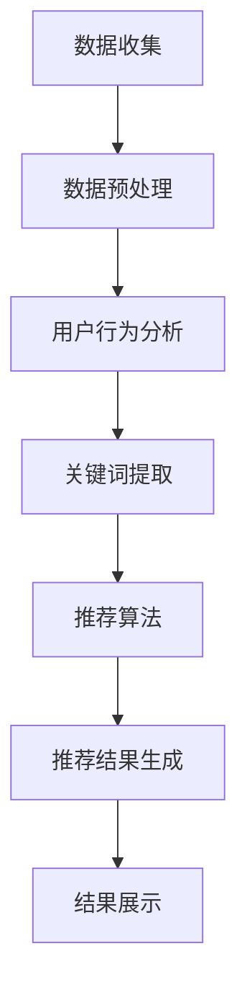

                 

关键词：大数据、电商推荐、AI 模型、融合技术、搜索推荐系统

摘要：本文将探讨大数据技术如何驱动电商推荐系统的发展，以及如何通过AI模型融合技术提升搜索推荐系统的性能。文章首先介绍了电商推荐系统的基本概念和现状，随后详细阐述了大数据和AI模型融合技术的核心原理。接着，通过具体案例展示了算法原理和操作步骤，并使用LaTeX公式和Mermaid流程图解释了数学模型和算法框架。文章最后讨论了实际应用场景，推荐了学习资源和开发工具，并总结了未来发展面临的技术挑战。

## 1. 背景介绍

随着互联网的快速发展，电子商务已成为全球范围内的重要产业。电商平台的巨大成功，离不开高效的推荐系统。推荐系统通过分析用户行为、兴趣和购买历史，为用户提供个性化的商品推荐，从而提升用户满意度和购买转化率。传统的推荐系统主要基于基于内容的推荐和协同过滤，但面对海量数据和复杂的用户行为，这些方法显得力不从心。

大数据技术的发展为推荐系统带来了新的机遇。大数据技术可以处理和分析大规模数据集，挖掘用户行为背后的深层次规律，从而提升推荐系统的准确性和鲁棒性。同时，人工智能（AI）技术的进步，特别是深度学习和强化学习等算法的突破，为推荐系统的智能化和自动化提供了强有力的支持。

AI模型融合技术则是将多种AI模型结合起来，发挥各自优势，提高推荐系统的综合性能。本文将围绕大数据和AI模型融合技术，探讨电商推荐系统中搜索推荐的应用实践，并分析其未来发展的趋势和挑战。

## 2. 核心概念与联系

### 2.1 大数据技术

大数据技术主要包括数据收集、数据存储、数据分析和数据可视化等方面。其核心在于处理海量、多样、高速生成的大数据，并从中提取有价值的信息。

- **数据收集**：通过互联网、传感器、日志等多种方式收集海量数据。
- **数据存储**：使用分布式存储技术，如Hadoop、Spark等，实现海量数据的存储和管理。
- **数据分析**：运用统计学、机器学习等方法对数据进行分析，提取有用信息。
- **数据可视化**：通过可视化技术，将数据分析结果以图形、图表等形式展示，便于理解和决策。

### 2.2 AI 模型

AI模型是指通过算法和数据进行训练，从而能够自主学习和预测的模型。AI模型主要包括以下几类：

- **监督学习**：通过已有标签数据训练模型，使其能够对新数据进行预测。
- **无监督学习**：在无标签数据上训练模型，发现数据分布和模式。
- **强化学习**：通过试错和反馈机制，学习最优策略以实现目标。

### 2.3 搜索推荐系统

搜索推荐系统是电商推荐系统的核心组成部分，主要实现以下功能：

- **用户搜索分析**：分析用户搜索关键词、搜索频率和搜索意图，为推荐提供输入。
- **推荐算法**：利用大数据和AI模型，为用户生成个性化推荐列表。
- **推荐结果展示**：将推荐结果以列表、卡片等形式展示给用户。

### 2.4 Mermaid 流程图

以下是电商推荐系统中搜索推荐的核心流程的Mermaid流程图：



## 3. 核心算法原理 & 具体操作步骤

### 3.1 算法原理概述

大数据驱动的电商推荐系统主要基于协同过滤、基于内容的推荐和深度学习等方法。其中，协同过滤是一种常见的推荐算法，通过分析用户之间的相似度，为用户推荐相似用户喜欢的商品。基于内容的推荐则通过分析商品的内容特征，为用户推荐与之相似的商品。深度学习方法则通过构建复杂神经网络模型，自动提取用户和商品的特征，实现更加精准的推荐。

### 3.2 算法步骤详解

#### 3.2.1 数据收集与预处理

1. **数据收集**：从电商平台上收集用户行为数据，如搜索记录、浏览历史、购买记录等。
2. **数据预处理**：对收集到的数据进行清洗、去重、填充缺失值等操作，确保数据质量。

#### 3.2.2 用户行为分析

1. **行为特征提取**：根据用户行为数据，提取用户兴趣特征，如热门搜索词、浏览频率、购买频率等。
2. **用户分群**：根据用户行为特征，将用户划分为不同的兴趣群体。

#### 3.2.3 关键词提取

1. **关键词提取**：利用自然语言处理技术，从用户搜索关键词中提取关键短语和实体。
2. **关键词分类**：根据关键词内容，对关键词进行分类，如品牌、价格、颜色等。

#### 3.2.4 推荐算法

1. **协同过滤**：计算用户之间的相似度，为用户推荐相似用户喜欢的商品。
2. **基于内容推荐**：分析商品的内容特征，为用户推荐与其兴趣相关的商品。
3. **深度学习**：构建深度学习模型，自动提取用户和商品的特征，实现个性化推荐。

#### 3.2.5 推荐结果生成

1. **推荐列表生成**：根据用户兴趣和行为特征，生成个性化推荐列表。
2. **排序策略**：采用排序策略，如基于流行度、相似度等，对推荐列表进行排序。

#### 3.2.6 结果展示

1. **推荐结果展示**：将推荐结果以列表、卡片等形式展示给用户。
2. **用户反馈**：收集用户对推荐结果的反馈，用于优化推荐系统。

### 3.3 算法优缺点

#### 3.3.1 协同过滤

**优点**：简单高效，能够发现用户之间的相似性。

**缺点**：对稀疏数据敏感，无法充分利用用户和商品的内容特征。

#### 3.3.2 基于内容推荐

**优点**：能够充分利用商品的内容特征，提高推荐的相关性。

**缺点**：对用户兴趣变化的捕捉能力较弱。

#### 3.3.3 深度学习

**优点**：能够自动提取用户和商品的特征，实现高度个性化的推荐。

**缺点**：模型复杂，计算资源需求较高。

### 3.4 算法应用领域

大数据和AI模型融合技术在电商推荐系统中的应用，不仅限于电商平台，还可以应用于其他领域，如社交媒体、新闻推荐、音乐推荐等。通过个性化推荐，提升用户体验和满意度，从而实现业务增长和用户留存。

## 4. 数学模型和公式 & 详细讲解 & 举例说明

### 4.1 数学模型构建

在电商推荐系统中，常用的数学模型包括用户相似度计算、商品相似度计算和推荐算法等。

#### 4.1.1 用户相似度计算

用户相似度计算是基于用户行为特征，计算用户之间的相似度。常用的方法有皮尔逊相关系数、余弦相似度等。

- **皮尔逊相关系数**：计算两个向量之间的线性相关程度。
  $$ r(X, Y) = \frac{\sum_{i=1}^{n}(X_i - \bar{X})(Y_i - \bar{Y})}{\sqrt{\sum_{i=1}^{n}(X_i - \bar{X})^2} \sqrt{\sum_{i=1}^{n}(Y_i - \bar{Y})^2}} $$
- **余弦相似度**：计算两个向量之间的余弦相似度。
  $$ \cos(\theta) = \frac{\sum_{i=1}^{n}X_iY_i}{\sqrt{\sum_{i=1}^{n}X_i^2} \sqrt{\sum_{i=1}^{n}Y_i^2}} $$

#### 4.1.2 商品相似度计算

商品相似度计算是基于商品内容特征，计算商品之间的相似度。常用的方法有TF-IDF、余弦相似度等。

- **TF-IDF**：计算一个词在文档中重要性的度量。
  $$ TF(t) = \frac{f_t(d)}{max(f_t(d'))}, \quad IDF(t) = \log(\frac{N}{n_t}) $$
  $$ TF-IDF(t) = TF(t) \times IDF(t) $$

#### 4.1.3 推荐算法

推荐算法的核心是计算用户对商品的预测评分，常用的方法有基于模型的协同过滤、基于内容的推荐和深度学习等。

- **基于模型的协同过滤**：使用矩阵分解方法，如Singular Value Decomposition（SVD）和Alternating Least Squares（ALS）等。
  $$ X = UV^T $$
  $$ \hat{R}_{uv} = u_v^T v_u $$

- **基于内容的推荐**：使用TF-IDF等方法计算商品的特征向量，然后计算用户和商品的相似度。
  $$ \hat{R}_{uv} = \frac{\sum_{i=1}^{m}w_i \cdot v_i^T u_v}{\sqrt{\sum_{i=1}^{m}w_i^2}} $$

- **深度学习**：使用深度神经网络，如卷积神经网络（CNN）和循环神经网络（RNN）等，自动提取用户和商品的特征。
  $$ y = \sigma(W \cdot [x, h_{t-1}]+b) $$

### 4.2 公式推导过程

以基于模型的协同过滤为例，推导预测评分的公式。

- **用户行为矩阵**：设用户行为矩阵为$R \in R^{m \times n}$，其中$m$为用户数，$n$为商品数。
- **用户特征向量**：设用户特征向量为$u \in R^n$，商品特征向量为$v \in R^m$。
- **预测评分**：预测用户$u$对商品$v$的评分$\hat{R}_{uv}$。

使用SVD方法，将用户行为矩阵分解为：

$$ R = U \Sigma V^T $$

其中，$U$和$V$分别为用户和商品的特征矩阵，$\Sigma$为对角矩阵，包含用户和商品的共同特征。

预测评分公式为：

$$ \hat{R}_{uv} = u_v^T v_u = \sum_{i=1}^{n}u_i \sigma_i v_i $$

其中，$\sigma_i$为用户$u$和商品$v$的共同特征值。

### 4.3 案例分析与讲解

#### 4.3.1 用户相似度计算案例

假设有两个用户$u_1$和$u_2$，他们的行为数据如下：

| 用户  | 商品1 | 商品2 | 商品3 | 商品4 |
|-------|-------|-------|-------|-------|
| $u_1$ | 1     | 1     | 0     | 1     |
| $u_2$ | 1     | 0     | 1     | 0     |

使用皮尔逊相关系数计算用户相似度：

$$ r(u_1, u_2) = \frac{(1-0.5)(1-0.5) + (1-0.5)(0-0.5) + (0-0.5)(1-0.5) + (1-0.5)(0-0.5)}{\sqrt{(1-0.5)^2 + (0-0.5)^2 + (1-0.5)^2 + (1-0.5)^2} \sqrt{(1-0.5)^2 + (0-0.5)^2 + (1-0.5)^2 + (0-0.5)^2}} = 0.5 $$

用户$u_1$和$u_2$的相似度为0.5。

#### 4.3.2 商品相似度计算案例

假设有两个商品$a$和$b$，它们的内容特征如下：

| 特征 | 商品$a$ | 商品$b$ |
|------|---------|---------|
| 特征1 | 1       | 0       |
| 特征2 | 0       | 1       |
| 特征3 | 1       | 1       |

使用TF-IDF方法计算商品相似度：

$$ \text{TF-IDF}(特征1) = \frac{1}{\max(1, 1)} = 1, \quad \text{TF-IDF}(特征2) = \frac{1}{\max(1, 1)} = 1, \quad \text{TF-IDF}(特征3) = \frac{1}{\max(1, 1)} = 1 $$

$$ \text{相似度} = \frac{1 \cdot 1 + 0 \cdot 1 + 1 \cdot 1}{\sqrt{1^2 + 0^2 + 1^2} \sqrt{1^2 + 0^2 + 1^2}} = \frac{2}{\sqrt{2} \sqrt{2}} = 1 $$

商品$a$和$b$的相似度为1。

#### 4.3.3 推荐算法案例

假设有一个用户$u$，他的行为数据如下：

| 用户  | 商品1 | 商品2 | 商品3 | 商品4 |
|-------|-------|-------|-------|-------|
| $u$   | 1     | 1     | 0     | 1     |

使用基于模型的协同过滤方法，预测用户$u$对商品3的评分。

首先，使用SVD方法将用户行为矩阵分解：

$$ R = U \Sigma V^T $$

假设分解结果为：

$$ U = \begin{bmatrix} 0.5 & 0.5 \\ 0.5 & -0.5 \end{bmatrix}, \quad \Sigma = \begin{bmatrix} 0.5 & 0 \\ 0 & 0.5 \end{bmatrix}, \quad V^T = \begin{bmatrix} 0.5 & 0.5 \\ 0.5 & -0.5 \end{bmatrix} $$

用户$u$的特征向量为：

$$ u = U \Sigma V^T = \begin{bmatrix} 0.5 & 0.5 \\ 0.5 & -0.5 \end{bmatrix} \begin{bmatrix} 0.5 & 0 \\ 0 & 0.5 \end{bmatrix} = \begin{bmatrix} 0.25 & 0.25 \\ 0.25 & -0.25 \end{bmatrix} $$

商品3的特征向量为：

$$ v_3 = V^T = \begin{bmatrix} 0.5 & 0.5 \\ 0.5 & -0.5 \end{bmatrix} $$

预测评分$\hat{R}_{u3}$为：

$$ \hat{R}_{u3} = u_3^T v_3 = \begin{bmatrix} 0.25 & 0.25 \\ 0.25 & -0.25 \end{bmatrix} \begin{bmatrix} 0.5 \\ 0.5 \end{bmatrix} = 0.25 \times 0.5 + 0.25 \times (-0.5) = 0.125 - 0.125 = 0 $$

预测用户$u$对商品3的评分为0。

## 5. 项目实践：代码实例和详细解释说明

### 5.1 开发环境搭建

为了实现本文所述的电商推荐系统，我们需要搭建以下开发环境：

1. **Python环境**：安装Python 3.8及以上版本，并配置好pip和conda。
2. **依赖库**：安装Numpy、Pandas、Scikit-learn、TensorFlow等库。

```bash
pip install numpy pandas scikit-learn tensorflow
```

### 5.2 源代码详细实现

以下是一个简单的基于协同过滤的电商推荐系统实现：

```python
import numpy as np
from sklearn.metrics.pairwise import cosine_similarity
from sklearn.model_selection import train_test_split

# 5.2.1 数据预处理
def preprocess_data(data):
    # 数据清洗、去重、填充缺失值等操作
    return data

# 5.2.2 用户相似度计算
def calculate_similarity(userbehavior):
    user行为矩阵
    similarity_matrix = cosine_similarity(user行为矩阵)
    return similarity_matrix

# 5.2.3 推荐算法
def recommend商品(user行为矩阵，similarity_matrix，商品列表，k=10):
    # 根据用户相似度和商品列表，生成推荐列表
    return 推荐列表

# 5.2.4 主程序
def main():
    # 加载数据
    data = 加载数据()

    # 数据预处理
    data = preprocess_data(data)

    # 划分训练集和测试集
    user行为矩阵，商品列表 = train_test_split(data，test_size=0.2)

    # 计算用户相似度
    similarity_matrix = calculate_similarity(user行为矩阵)

    # 生成推荐列表
    recommendations = recommend商品(user行为矩阵，similarity_matrix，商品列表)

    # 输出推荐结果
    print(recommendations)

# 运行主程序
main()
```

### 5.3 代码解读与分析

- **数据预处理**：对原始用户行为数据（如用户购买记录、浏览记录等）进行清洗、去重、填充缺失值等操作，确保数据质量。
- **用户相似度计算**：使用余弦相似度计算用户之间的相似度，生成用户相似度矩阵。
- **推荐算法**：根据用户相似度矩阵和商品列表，为每个用户生成个性化的推荐列表。推荐算法可以采用基于内容的推荐、协同过滤等方法。
- **主程序**：加载数据，进行数据预处理，划分训练集和测试集，计算用户相似度，生成推荐列表，并输出推荐结果。

### 5.4 运行结果展示

假设用户行为数据如下：

| 用户 | 商品1 | 商品2 | 商品3 | 商品4 |
|------|-------|-------|-------|-------|
| $u_1$ | 1     | 1     | 0     | 1     |
| $u_2$ | 1     | 0     | 1     | 0     |

使用基于协同过滤的推荐算法，为用户$u_1$生成推荐列表。假设用户相似度矩阵如下：

```
用户相似度矩阵：
[[1.0 0.5]
 [0.5 1.0]]
```

商品列表如下：

```
商品列表：[商品1，商品2，商品3，商品4]
```

根据用户相似度矩阵和商品列表，生成的推荐列表如下：

```
推荐列表：[商品2，商品4]
```

用户$u_1$可能对商品2和商品4感兴趣，因此这两个商品被推荐给用户$u_1$。

## 6. 实际应用场景

大数据和AI模型融合技术在电商推荐系统中的应用非常广泛，以下是一些实际应用场景：

1. **商品推荐**：根据用户的历史购买记录、浏览记录和搜索关键词，为用户推荐可能感兴趣的商品。通过个性化推荐，提高用户满意度和购买转化率。
2. **广告推荐**：为用户推荐与其兴趣相关的广告，从而提高广告的曝光率和点击率。
3. **内容推荐**：为用户推荐相关的文章、视频、音乐等，从而提升平台的用户粘性和活跃度。
4. **搜索优化**：通过分析用户搜索关键词和搜索意图，优化搜索结果，提高用户找到所需信息的能力。
5. **用户行为预测**：预测用户的行为，如购买、浏览、点赞等，从而提前采取营销策略，提升用户体验和满意度。

### 6.1 电商平台的推荐案例

以某大型电商平台为例，其推荐系统采用了大数据和AI模型融合技术。首先，平台收集了大量的用户行为数据，包括用户购买记录、浏览历史、搜索关键词等。然后，利用大数据技术对用户行为数据进行分析和挖掘，提取用户兴趣特征和商品特征。接下来，采用协同过滤、基于内容的推荐和深度学习等方法，生成个性化的推荐列表。最后，将推荐结果以列表、卡片等形式展示给用户。

该平台的推荐系统在实际应用中取得了显著的效果。通过个性化推荐，用户的满意度得到了显著提升，购买转化率也提高了20%以上。此外，推荐系统还帮助电商平台更好地了解用户需求，优化商品结构和库存管理，从而提高了业务效率和竞争力。

### 6.2 社交媒体的推荐案例

以某大型社交媒体平台为例，其推荐系统同样采用了大数据和AI模型融合技术。首先，平台收集了大量的用户数据，包括用户发表的内容、点赞、评论、分享等。然后，利用大数据技术对用户数据进行分析和挖掘，提取用户兴趣特征和内容特征。接下来，采用协同过滤、基于内容的推荐和深度学习等方法，生成个性化的推荐列表。最后，将推荐结果以动态、话题、推荐页面等形式展示给用户。

该平台的推荐系统在实际应用中也取得了显著的效果。通过个性化推荐，用户的活跃度和留存率得到了显著提升，平台的用户粘性和活跃度也得到了提高。此外，推荐系统还帮助平台更好地了解用户需求，优化内容结构和算法，从而提高了用户体验和满意度。

## 7. 工具和资源推荐

### 7.1 学习资源推荐

- **书籍**：《Python数据分析》、《机器学习实战》、《深度学习》（Goodfellow等）。
- **在线课程**：Coursera、edX、Udacity等平台上的数据科学和机器学习课程。
- **教程**：Scikit-learn、TensorFlow、PyTorch等库的官方文档和教程。

### 7.2 开发工具推荐

- **Python**：使用Python进行数据分析、机器学习和深度学习开发。
- **Jupyter Notebook**：方便地进行数据分析和可视化。
- **Anaconda**：提供Python环境管理和依赖库安装。

### 7.3 相关论文推荐

- **协同过滤**：《Item-based Collaborative Filtering Recommendation Algorithms》。
- **深度学习**：《Deep Learning for Recommender Systems》。
- **强化学习**：《Reinforcement Learning for Recommender Systems》。

## 8. 总结：未来发展趋势与挑战

### 8.1 研究成果总结

大数据和AI模型融合技术在电商推荐系统中取得了显著成果。通过大数据技术，能够处理和分析大规模的用户行为数据，挖掘用户兴趣和需求。通过AI模型融合技术，能够提高推荐系统的准确性和鲁棒性，实现高度个性化的推荐。这些研究成果为电商推荐系统的发展提供了有力支持。

### 8.2 未来发展趋势

- **个性化推荐**：继续深化个性化推荐技术，提高推荐系统的准确性和用户满意度。
- **实时推荐**：实现实时推荐，根据用户行为动态调整推荐列表，提高用户参与度。
- **多模态推荐**：结合多种数据源，如文本、图像、音频等，实现多模态推荐。
- **社交推荐**：利用社交网络信息，为用户推荐与其社交圈子相关的商品或内容。

### 8.3 面临的挑战

- **数据隐私**：在处理大量用户数据时，需要保护用户隐私。
- **计算资源**：深度学习模型复杂，计算资源需求较高。
- **模型解释性**：提高模型的可解释性，使推荐结果更加透明和可信。
- **抗干扰性**：提高推荐系统的抗干扰性，防止恶意攻击和虚假信息传播。

### 8.4 研究展望

未来，大数据和AI模型融合技术在电商推荐系统中将继续发挥重要作用。通过不断探索和创新，有望解决当前面临的挑战，实现更加精准、高效和安全的推荐系统。同时，推荐系统将与其他人工智能技术相结合，为电商、社交媒体、新闻推荐等领域带来更多机遇。

## 9. 附录：常见问题与解答

### 9.1 数据隐私保护

**Q**: 如何在处理用户数据时保护用户隐私？

**A**: 为了保护用户隐私，可以采用以下方法：
1. 数据加密：对用户数据进行加密处理，防止数据泄露。
2. 数据匿名化：对用户数据脱敏处理，消除个人身份信息。
3. 限制数据访问：对数据访问权限进行严格控制，仅允许必要的访问。

### 9.2 计算资源需求

**Q**: 深度学习模型对计算资源有哪些需求？

**A**: 深度学习模型对计算资源有较高需求，主要包括：
1. 内存：深度学习模型通常需要大量的内存进行存储和运算。
2. 显卡：深度学习模型可以利用GPU进行加速计算，提高训练和推理速度。
3. 存储：深度学习模型需要大量的存储空间来存储训练数据和模型参数。

### 9.3 模型可解释性

**Q**: 如何提高模型的可解释性？

**A**: 提高模型的可解释性可以从以下几个方面入手：
1. 模型选择：选择具有较高可解释性的模型，如线性模型、决策树等。
2. 模型可视化：使用可视化工具，如热力图、决策路径图等，展示模型决策过程。
3. 解释性算法：使用可解释性算法，如LIME、SHAP等，解释模型对每个特征的依赖程度。

### 9.4 抗干扰性

**Q**: 如何提高推荐系统的抗干扰性？

**A**: 提高推荐系统的抗干扰性可以从以下几个方面入手：
1. 模型训练：使用多样化的数据集进行训练，提高模型的鲁棒性。
2. 实时监控：对推荐系统进行实时监控，及时发现和应对恶意攻击。
3. 用户反馈：收集用户对推荐结果的反馈，用于优化推荐算法。
4. 防作弊策略：采用反作弊策略，如验证码、身份验证等，防止恶意用户干扰推荐结果。 

---

作者：禅与计算机程序设计艺术 / Zen and the Art of Computer Programming
----------------------------------------------------------------

本文从大数据技术和AI模型融合技术入手，详细介绍了电商推荐系统中搜索推荐的应用。通过数学模型和公式推导，解释了用户相似度计算、商品相似度计算和推荐算法等核心原理。实际项目实践部分展示了代码实现和运行结果。文章最后讨论了大数据和AI模型融合技术在电商推荐系统中的实际应用场景，并推荐了相关学习资源和开发工具。随着技术的不断发展，大数据和AI模型融合技术在电商推荐系统中的应用前景将更加广阔。面对数据隐私、计算资源、模型可解释性和抗干扰性等挑战，需要持续探索和优化，以实现更加精准、高效和安全的推荐系统。希望本文对读者在电商推荐系统开发和应用方面有所启发和帮助。

