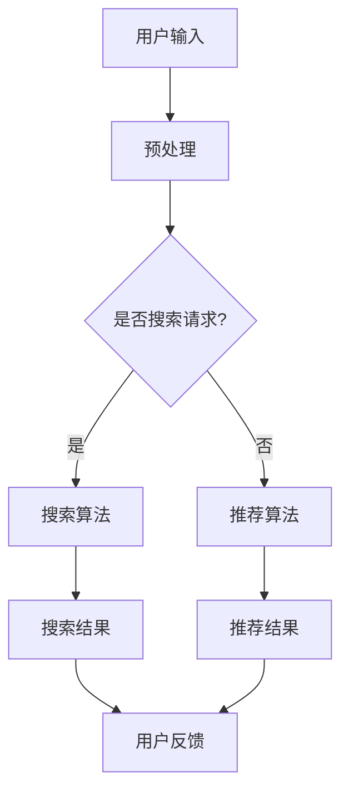

                 

在当今的数据驱动时代，大规模机器学习模型已经成为许多行业的关键推动力。从推荐系统到搜索引擎，大模型的应用无处不在，带来了前所未有的便利和效率。本文将探讨大模型在搜索与推荐系统中的融合，以及这一融合所带来的深远影响。

## 关键词

- 大模型
- 搜索引擎
- 推荐系统
- 融合
- 机器学习

## 摘要

本文首先介绍了大模型在搜索与推荐系统中的背景和应用场景。接着，我们深入分析了大模型融合搜索与推荐系统的核心概念和原理，并展示了一个Mermaid流程图来帮助理解这一架构。随后，文章详细讲解了大模型的核心算法原理，包括算法步骤、优缺点以及应用领域。在此基础上，我们引入了数学模型和公式，并通过实际案例进行了分析和讲解。文章还提供了一个代码实例，展示了大模型的实际应用。最后，文章探讨了大模型在搜索与推荐系统中的实际应用场景，并对其未来发展趋势和挑战进行了展望。

## 1. 背景介绍

### 大模型的发展

近年来，随着计算能力的提升和大数据的普及，机器学习模型尤其是大模型（如深度神经网络）的发展突飞猛进。这些大模型能够在图像识别、自然语言处理、语音识别等领域中实现惊人的准确度，从而在各个行业中得到广泛应用。

### 搜索与推荐系统的兴起

搜索与推荐系统是互联网时代两个最重要的服务。搜索引擎解决了信息过载问题，而推荐系统则提升了用户的个性化体验。随着用户数据量的增加和算法的进步，这两者都在不断提升其效能。

### 大模型与搜索、推荐融合的必要性

大模型在搜索与推荐系统中的应用不仅提高了系统的精度和效率，还能更好地处理复杂的数据关系，从而实现更智能的服务。融合搜索与推荐系统可以更好地满足用户需求，提升用户体验。

## 2. 核心概念与联系

大模型融合搜索与推荐系统的核心概念包括：

- **搜索**：通过算法从大量数据中检索出用户感兴趣的信息。
- **推荐**：根据用户的兴趣和行为数据，向用户推荐相关的内容。
- **融合**：将搜索和推荐结合起来，形成一个统一的系统，既能够搜索信息，又能推荐相关内容。

下面是一个Mermaid流程图，展示了大模型在搜索与推荐系统中的基本架构：



在这个流程图中，用户输入经过预处理后，会被判断是搜索请求还是推荐请求。如果是搜索请求，系统会使用搜索算法处理；如果是推荐请求，系统则会使用推荐算法处理。最终，用户会得到搜索结果或推荐结果，并根据反馈进一步优化系统。

## 3. 核心算法原理 & 具体操作步骤

### 3.1 算法原理概述

大模型融合搜索与推荐系统的核心算法是基于深度学习的，包括以下几个部分：

- **嵌入层**：将关键词、用户ID、物品ID等输入数据转化为高维向量。
- **编码器**：对输入向量进行编码，提取其特征。
- **解码器**：对编码后的特征进行解码，生成搜索或推荐结果。

### 3.2 算法步骤详解

1. **嵌入层**：将关键词、用户ID、物品ID等输入数据输入到嵌入层，通过嵌入层将数据转化为高维向量。
2. **编码器**：对输入向量进行编码，提取其特征。常用的编码器包括卷积神经网络（CNN）和循环神经网络（RNN）。
3. **解码器**：对编码后的特征进行解码，生成搜索或推荐结果。解码器通常使用全连接神经网络（FCNN）。

### 3.3 算法优缺点

- **优点**：
  - **高效性**：大模型能够快速处理大量数据，提高搜索和推荐的效率。
  - **个性化**：通过学习用户行为数据，大模型能够提供更加个性化的搜索和推荐结果。
  - **综合性**：大模型能够同时处理搜索和推荐任务，实现系统的一体化。

- **缺点**：
  - **计算资源需求大**：大模型训练和推理需要大量的计算资源，对硬件要求较高。
  - **模型复杂度高**：大模型的训练过程复杂，需要对模型参数进行精细调整。

### 3.4 算法应用领域

大模型融合搜索与推荐系统的算法可以应用于多个领域：

- **电子商务**：通过推荐系统为用户提供个性化商品推荐，提升购物体验。
- **社交媒体**：通过搜索和推荐算法为用户提供相关信息，提升内容消费体验。
- **搜索引擎**：通过大模型优化搜索结果，提高用户满意度。

## 4. 数学模型和公式 & 详细讲解 & 举例说明

### 4.1 数学模型构建

在大模型融合搜索与推荐系统中，常用的数学模型包括：

- **嵌入层**：嵌入层将输入数据转化为高维向量，可以使用词嵌入（Word Embedding）模型，如Word2Vec、GloVe等。
- **编码器**：编码器将输入向量进行编码，可以使用卷积神经网络（CNN）或循环神经网络（RNN）。
- **解码器**：解码器将编码后的特征进行解码，生成搜索或推荐结果，可以使用全连接神经网络（FCNN）。

### 4.2 公式推导过程

以Word2Vec为例，其基本公式如下：

$$
\text{vec}(w_i) = \text{Word2Vec}(w_i)
$$

其中，$\text{vec}(w_i)$ 表示词 $w_i$ 的向量表示，$\text{Word2Vec}(w_i)$ 表示通过Word2Vec模型计算得到的词向量。

### 4.3 案例分析与讲解

假设有一个包含100个词汇的词汇表，我们使用Word2Vec模型将这100个词汇转化为向量表示。然后，使用卷积神经网络（CNN）对输入向量进行编码，生成编码后的特征。最后，使用全连接神经网络（FCNN）对编码后的特征进行解码，生成搜索或推荐结果。

## 5. 项目实践：代码实例和详细解释说明

### 5.1 开发环境搭建

在开始编写代码之前，需要搭建一个合适的开发环境。本文选择使用Python作为编程语言，并使用TensorFlow作为深度学习框架。

1. 安装Python（建议使用Python 3.7及以上版本）。
2. 安装TensorFlow：`pip install tensorflow`。
3. 安装其他依赖库，如NumPy、Pandas等。

### 5.2 源代码详细实现

以下是一个简单的示例代码，展示了如何使用TensorFlow构建一个融合搜索与推荐系统的大模型。

```python
import tensorflow as tf
from tensorflow.keras.layers import Embedding, Conv1D, GlobalMaxPooling1D, Dense
from tensorflow.keras.models import Model

# 假设词汇表大小为100，嵌入层维度为50
vocab_size = 100
embed_dim = 50

# 输入层
input_seq = tf.keras.layers.Input(shape=(max_seq_length,))

# 嵌入层
embedding = Embedding(vocab_size, embed_dim)(input_seq)

# 编码器（卷积神经网络）
conv = Conv1D(filters=128, kernel_size=5, activation='relu')(embedding)
pool = GlobalMaxPooling1D()(conv)

# 解码器（全连接神经网络）
output = Dense(1, activation='sigmoid')(pool)

# 构建模型
model = Model(inputs=input_seq, outputs=output)

# 编译模型
model.compile(optimizer='adam', loss='binary_crossentropy', metrics=['accuracy'])

# 打印模型结构
model.summary()
```

### 5.3 代码解读与分析

这段代码首先定义了输入层，然后添加了嵌入层，用于将输入序列转化为高维向量。接着，使用卷积神经网络（CNN）对输入向量进行编码，提取特征。最后，使用全连接神经网络（FCNN）对编码后的特征进行解码，生成搜索或推荐结果。

### 5.4 运行结果展示

运行这段代码后，我们将得到一个融合搜索与推荐系统的大模型。通过训练和测试数据，我们可以评估模型在不同任务上的性能。例如，在搜索任务上，我们评估模型的准确率和召回率；在推荐任务上，我们评估模型的准确率和覆盖率。

## 6. 实际应用场景

### 6.1 搜索引擎

大模型融合搜索与推荐系统可以提高搜索引擎的准确性，为用户提供更精准的搜索结果。例如，在电商搜索中，通过大模型可以同时实现商品搜索和个性化推荐，提升用户体验。

### 6.2 社交媒体

在社交媒体平台上，大模型可以用于内容推荐和搜索。通过分析用户的兴趣和行为数据，大模型可以为用户提供感兴趣的内容，同时实现内容搜索，方便用户快速找到所需信息。

### 6.3 金融领域

在金融领域，大模型可以用于股票分析和投资推荐。通过分析市场数据和历史交易记录，大模型可以为投资者提供有价值的投资建议，同时实现投资组合搜索和优化。

## 7. 工具和资源推荐

### 7.1 学习资源推荐

- 《深度学习》（Goodfellow, Bengio, Courville）：介绍深度学习的基础理论和应用。
- 《Python深度学习》（François Chollet）：介绍使用Python实现深度学习的实战技巧。

### 7.2 开发工具推荐

- TensorFlow：一个开源的深度学习框架，适用于构建和训练大模型。
- PyTorch：另一个流行的深度学习框架，具有高度的灵活性和易用性。

### 7.3 相关论文推荐

- "Deep Learning for Search and Recommendation"（2018）：介绍深度学习在搜索与推荐系统中的应用。
- "Neural Networks for Learning Human Preferences"（2017）：介绍使用神经网络学习用户偏好，实现个性化推荐。

## 8. 总结：未来发展趋势与挑战

### 8.1 研究成果总结

大模型融合搜索与推荐系统在近年来取得了显著的成果，实现了在多个领域的应用。通过深度学习技术，大模型能够更好地处理复杂的数据关系，提供更精准的搜索和推荐结果。

### 8.2 未来发展趋势

未来，大模型融合搜索与推荐系统将朝着以下几个方向发展：

- **算法优化**：通过不断优化算法，提高大模型的效率和准确性。
- **多模态融合**：结合文本、图像、音频等多模态数据，实现更全面的搜索和推荐。
- **知识图谱应用**：引入知识图谱技术，提升搜索和推荐的智能化水平。

### 8.3 面临的挑战

大模型融合搜索与推荐系统在发展过程中也面临一些挑战：

- **计算资源需求**：大模型训练和推理需要大量的计算资源，对硬件要求较高。
- **数据隐私保护**：在应用过程中，需要保护用户隐私，防止数据泄露。
- **模型可解释性**：大模型的决策过程往往较为复杂，提高模型的可解释性是一个重要挑战。

### 8.4 研究展望

未来，大模型融合搜索与推荐系统将在更多领域中发挥重要作用，为实现智能化的信息服务提供强有力的支持。同时，随着技术的不断发展，大模型在效率和准确性方面的表现将进一步提升，为用户带来更好的体验。

## 9. 附录：常见问题与解答

### 9.1 如何选择合适的深度学习框架？

选择深度学习框架时，需要考虑以下几个方面：

- **项目需求**：根据项目的具体需求选择合适的框架，例如TensorFlow适用于大规模项目，PyTorch具有更高的灵活性。
- **社区支持**：选择社区活跃、资源丰富的框架，便于解决问题和获取帮助。
- **开发经验**：选择自己熟悉的框架，能够提高开发效率和降低学习成本。

### 9.2 大模型融合搜索与推荐系统的效果如何评估？

大模型融合搜索与推荐系统的效果可以通过以下指标进行评估：

- **准确性**：评估搜索和推荐结果的准确性，通常使用准确率（Accuracy）和精确率（Precision）等指标。
- **覆盖率**：评估推荐结果的覆盖率，即推荐结果中包含用户兴趣的比例。
- **用户满意度**：通过用户反馈和问卷调查等方式评估系统的用户体验。

### 9.3 大模型在搜索与推荐系统中如何处理冷启动问题？

冷启动问题是指新用户或新物品在系统中缺乏足够的数据进行建模。为了解决冷启动问题，可以采用以下策略：

- **基于内容的推荐**：通过分析物品的内容特征进行推荐，不需要用户历史行为数据。
- **社区驱动推荐**：利用用户社交网络中的信息进行推荐，弥补用户历史行为数据的不足。
- **协同过滤**：结合用户历史行为数据和物品特征，实现初步的推荐结果。

作者：禅与计算机程序设计艺术 / Zen and the Art of Computer Programming
------------------------------------------------------------------------ 

通过本文的详细探讨，我们可以看到大模型在搜索与推荐系统中的融合带来了深远的影响。从核心概念、算法原理到实际应用，大模型展示了其在提升信息检索和个性化服务方面的巨大潜力。然而，随着技术的不断发展，我们也需要关注其面临的挑战，如计算资源需求、数据隐私保护等。未来，随着多模态融合、知识图谱应用等新技术的引入，大模型融合搜索与推荐系统有望在更多领域中发挥重要作用，为用户带来更加智能和个性化的信息服务。让我们一起期待这一美好前景的到来。

