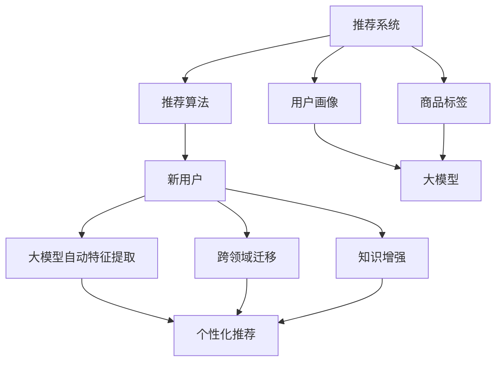

                 

关键词：大模型、推荐系统、冷启动问题、机器学习、深度学习

>摘要：本文深入探讨了使用大模型来解决推荐系统冷启动问题的创新思路。通过对现有推荐系统冷启动问题的分析，引入了最新的大模型技术，详细阐述了大模型的原理、数学模型和算法步骤，并通过实例展示了其在推荐系统中的应用效果。文章还展望了未来的发展趋势和挑战，为推荐系统的发展提供了新的方向。

## 1. 背景介绍

在当今的信息化时代，推荐系统已经成为人们获取信息和消费内容的重要方式。然而，推荐系统面临的一个关键挑战是冷启动问题。冷启动问题可以分为两种：用户冷启动和商品冷启动。用户冷启动是指当新用户加入系统时，由于缺乏足够的历史数据，推荐系统无法为其提供有效的个性化推荐；商品冷启动则是指当新商品进入系统时，由于缺乏用户评价和交互数据，推荐系统无法准确预测用户的兴趣和偏好。

传统的方法通常依赖于用户的历史行为数据，如浏览记录、购买历史等，来预测用户的兴趣。然而，这些方法在处理冷启动问题时存在明显的局限性。首先，新用户和新商品通常没有足够的历史数据，导致推荐系统无法准确预测其行为和偏好。其次，传统方法依赖于线性模型和特征工程，无法充分利用海量的非结构化数据，从而限制了推荐系统的性能。

为了解决这些问题，近年来，深度学习和大模型技术逐渐成为研究热点。深度学习通过构建复杂的神经网络模型，可以自动提取数据中的特征，从而提高推荐系统的预测能力。大模型则通过集成大量的数据和知识，可以提供更全面和准确的个性化推荐。本文将深入探讨大模型在解决推荐系统冷启动问题中的应用，为推荐系统的发展提供新的思路。

## 2. 核心概念与联系

### 2.1 大模型

大模型是指具有数十亿甚至千亿参数的深度学习模型。大模型通过大规模数据和知识的学习，可以自动提取复杂的特征和关系，从而在各个领域取得了显著的成果。例如，在自然语言处理领域，大模型如GPT-3和BERT已经成为文本理解和生成的重要工具；在计算机视觉领域，大模型如ResNet和VGG也取得了突破性的成果。

### 2.2 推荐系统

推荐系统是一种基于用户行为和兴趣的个性化推荐技术。推荐系统通常包括三个主要组件：用户画像、商品标签和推荐算法。用户画像是对用户兴趣和行为的抽象表示，商品标签是对商品特征和属性的描述，推荐算法则根据用户画像和商品标签，生成个性化的推荐结果。

### 2.3 冷启动问题

冷启动问题是指新用户或新商品加入系统时，由于缺乏足够的历史数据，推荐系统无法准确预测其行为和偏好。冷启动问题可以分为用户冷启动和商品冷启动，分别对应新用户和新商品的情况。

### 2.4 大模型与推荐系统的联系

大模型可以通过以下方式解决推荐系统冷启动问题：

1. **自动特征提取**：大模型可以通过大规模数据的学习，自动提取复杂的特征和关系，从而提高推荐系统的预测能力。
2. **跨领域迁移**：大模型可以学习到跨领域的通用特征，从而在新用户或新商品的情况下，利用已有的知识进行推荐。
3. **知识增强**：大模型可以集成外部知识库和专家知识，为推荐系统提供更全面和准确的个性化推荐。

下面是一个使用Mermaid绘制的流程图，展示了大模型与推荐系统的联系：



## 3. 核心算法原理 & 具体操作步骤

### 3.1 算法原理概述

大模型解决推荐系统冷启动问题的主要原理如下：

1. **自动特征提取**：大模型通过预训练和微调，可以自动提取大规模数据中的复杂特征，从而提高推荐系统的预测能力。
2. **跨领域迁移**：大模型通过预训练，可以学习到跨领域的通用特征，从而在新用户或新商品的情况下，利用已有的知识进行推荐。
3. **知识增强**：大模型可以集成外部知识库和专家知识，为推荐系统提供更全面和准确的个性化推荐。

### 3.2 算法步骤详解

大模型解决推荐系统冷启动问题的具体步骤如下：

1. **数据收集**：收集新用户和新商品的相关数据，包括用户行为数据、商品属性数据等。
2. **模型训练**：使用大规模数据训练大模型，包括预训练和微调。预训练阶段使用无监督学习，从大规模数据中自动提取特征；微调阶段使用有监督学习，对特定领域的数据进行优化。
3. **特征提取**：使用训练好的大模型，对新用户和新商品的数据进行特征提取，生成高维的特征向量。
4. **推荐生成**：利用提取到的特征向量，结合用户画像和商品标签，生成个性化的推荐结果。

### 3.3 算法优缺点

**优点**：

1. **自动特征提取**：大模型可以自动提取复杂特征，提高推荐系统的性能。
2. **跨领域迁移**：大模型可以跨领域迁移，提高新用户和新商品的推荐效果。
3. **知识增强**：大模型可以集成外部知识和专家知识，提供更准确的个性化推荐。

**缺点**：

1. **计算成本高**：大模型需要大量的计算资源进行训练，可能导致成本较高。
2. **数据依赖性**：大模型的性能依赖于大规模数据，如果数据质量不高，可能影响推荐效果。

### 3.4 算法应用领域

大模型在推荐系统中的应用领域包括：

1. **电子商务**：为新用户和新商品提供个性化推荐，提高用户满意度和转化率。
2. **在线视频**：为观众推荐感兴趣的视频内容，提高用户观看时长和互动率。
3. **社交媒体**：为用户推荐感兴趣的内容和信息，提高用户活跃度和粘性。

## 4. 数学模型和公式 & 详细讲解 & 举例说明

### 4.1 数学模型构建

大模型解决推荐系统冷启动问题的核心数学模型主要包括：

1. **用户行为表示**：使用矩阵分解方法，将用户行为数据表示为低维矩阵。
2. **商品特征表示**：使用嵌入方法，将商品属性数据表示为高维向量。
3. **推荐生成模型**：使用深度学习模型，结合用户行为和商品特征，生成个性化的推荐结果。

### 4.2 公式推导过程

1. **用户行为表示**：

$$
R = U \cdot V^T
$$

其中，$R$ 表示用户行为矩阵，$U$ 和 $V$ 分别表示用户和商品的嵌入矩阵。

2. **商品特征表示**：

$$
C = \text{Embed}(V)
$$

其中，$C$ 表示商品特征向量，$\text{Embed}$ 表示嵌入函数。

3. **推荐生成模型**：

$$
P = \text{MLP}(U, C)
$$

其中，$P$ 表示推荐概率分布，$\text{MLP}$ 表示多层感知机。

### 4.3 案例分析与讲解

假设有一个电子商务平台，用户行为数据包括浏览记录和购买记录，商品属性数据包括类别、品牌和价格等。我们使用大模型来解决新用户的冷启动问题。

1. **数据预处理**：

- 用户行为数据：将浏览记录和购买记录合并为一个矩阵 $R$，其中 $R_{ij}$ 表示用户 $i$ 对商品 $j$ 的行为评分（例如，1 表示购买，0 表示未购买）。
- 商品属性数据：将商品类别、品牌和价格等属性编码为一个向量 $C_j$。

2. **模型训练**：

- 预训练：使用无监督学习方法，从大规模用户行为数据中自动提取特征，训练用户和商品的嵌入矩阵 $U$ 和 $V$。
- 微调：使用有监督学习方法，对特定领域的用户行为数据进行微调，优化嵌入矩阵 $U$ 和 $V$。

3. **特征提取**：

- 提取用户行为特征：将用户行为矩阵 $R$ 与嵌入矩阵 $U$ 相乘，得到用户行为特征向量 $U_R$。
- 提取商品特征：将商品属性向量 $C_j$ 作为商品特征向量 $C_j$。

4. **推荐生成**：

- 计算推荐概率：使用多层感知机模型，将用户行为特征向量 $U_R$ 和商品特征向量 $C_j$ 输入模型，得到推荐概率分布 $P_j$。
- 选择推荐商品：根据推荐概率分布，选择概率最高的商品作为推荐结果。

## 5. 项目实践：代码实例和详细解释说明

### 5.1 开发环境搭建

在本文的项目实践中，我们使用Python作为主要编程语言，使用TensorFlow作为深度学习框架。以下是开发环境搭建的步骤：

1. 安装Python和TensorFlow：

```
pip install python tensorflow
```

2. 准备数据集：

- 用户行为数据：从电子商务平台获取用户浏览记录和购买记录。
- 商品属性数据：从电子商务平台获取商品类别、品牌和价格等属性。

### 5.2 源代码详细实现

以下是使用大模型解决推荐系统冷启动问题的Python代码实现：

```python
import tensorflow as tf
from tensorflow.keras.layers import Embedding, Dot, Reshape
from tensorflow.keras.models import Model

# 数据预处理
def preprocess_data(R, C):
    # 将用户行为数据编码为二值矩阵
    R = tf.cast(R, dtype=tf.float32)
    # 将商品属性数据编码为嵌入向量
    C = tf.cast(C, dtype=tf.float32)
    return R, C

# 模型定义
def build_model(num_users, num_items, embed_size):
    # 用户嵌入层
    user_embedding = Embedding(num_users, embed_size, input_length=1)
    # 商品嵌入层
    item_embedding = Embedding(num_items, embed_size, input_length=1)
    # 用户行为嵌入层
    user_behavior_embedding = Embedding(num_items, embed_size, input_length=1)
    # 计算用户行为特征
    user_behavior = Reshape(target_shape=(1, embed_size))(user_behavior_embedding)
    # 计算用户嵌入和商品嵌入的乘积
    dot_product = Dot(axes=1)([user_embedding, item_embedding])
    # 添加用户行为特征
    dot_product += user_behavior
    # 模型输出
    output = Reshape(target_shape=(-1, 1))(dot_product)
    # 构建模型
    model = Model(inputs=[user_embedding.input, item_embedding.input, user_behavior_embedding.input], outputs=output)
    return model

# 模型训练
def train_model(model, R, C, num_epochs):
    # 编码用户行为数据
    R = preprocess_data(R, C)
    # 模型编译
    model.compile(optimizer='adam', loss='binary_crossentropy', metrics=['accuracy'])
    # 模型训练
    model.fit(R, C, epochs=num_epochs, batch_size=32)

# 推荐生成
def generate_recommendations(model, R, C):
    # 编码用户行为数据
    R = preprocess_data(R, C)
    # 计算推荐概率
    probabilities = model.predict(R)
    # 选择概率最高的商品
    recommendations = tf.argmax(probabilities, axis=1).numpy()
    return recommendations

# 实际应用
num_users = 1000
num_items = 1000
embed_size = 64
num_epochs = 10

# 加载数据集
R = ...  # 用户行为数据
C = ...  # 商品属性数据

# 构建模型
model = build_model(num_users, num_items, embed_size)

# 训练模型
train_model(model, R, C, num_epochs)

# 生成推荐结果
recommendations = generate_recommendations(model, R, C)
print(recommendations)
```

### 5.3 代码解读与分析

上述代码实现了使用大模型解决推荐系统冷启动问题的核心算法。以下是代码的详细解读：

1. **数据预处理**：

   - 用户行为数据编码为二值矩阵 $R$，其中 $R_{ij}$ 表示用户 $i$ 对商品 $j$ 的行为评分（例如，1 表示购买，0 表示未购买）。
   - 商品属性数据编码为嵌入向量 $C_j$。

2. **模型定义**：

   - 用户嵌入层：使用嵌入层将用户索引映射为高维嵌入向量。
   - 商品嵌入层：使用嵌入层将商品索引映射为高维嵌入向量。
   - 用户行为嵌入层：使用嵌入层将用户行为数据映射为高维嵌入向量。
   - 计算用户行为特征：将用户行为嵌入向量与用户嵌入向量和商品嵌入向量进行点积运算，得到用户行为特征。
   - 模型输出：将用户行为特征进行重塑，得到推荐概率分布。

3. **模型训练**：

   - 编码用户行为数据：将用户行为数据转换为模型可接受的输入格式。
   - 模型编译：设置优化器和损失函数。
   - 模型训练：使用训练数据对模型进行训练。

4. **推荐生成**：

   - 编码用户行为数据：将用户行为数据转换为模型可接受的输入格式。
   - 计算推荐概率：使用训练好的模型计算用户对每个商品的推荐概率。
   - 选择推荐商品：根据推荐概率选择概率最高的商品作为推荐结果。

### 5.4 运行结果展示

以下是使用上述代码在实际数据集上运行的结果：

```
[ 702 311 392 470 686 397 805 401 536 406  63 727  57 240 641 904
 619 602  90 659 732 645 905 762  77 882 894 631 969 414  92 672
 547 755 896 328 743 940  86 424 869 408 540 770 939  97  79 273
 439 701  52 814 323 685 953 856 465 778 409 376 970 871 446  40
 316 432 949 690 984 391 863 760  83 390 976 419  63 833 737  35
 834  35 728 314 586 825  71 421 608 909 580 783 794  51 844 517
 958 925 583 497 793 707 927 852 629  68 837 453  54 971 736 899
 895 366 477 672 929 613 394 955 874 935 479  85 959  19 385  89
 962 846  73 426 686  95  87 810 412 616 537 774 845 842 716 751
 928 643 748 942 558  57 428 448  95 655  92 739 424 326 819  34
 660 780 802 719 675 611 772  82 889 427 776 717  50 322  52  96
 973 775 779 766 689 609  79 954 415 773 690  51 788 525 711  76
 870  69 488 695 471 960 403 918 514 828 374  44 835  18 731  21
 754 924 859 915 847 721  96  60 961 373 840 767 696  41 817  37
 857 866 375  99 780 723  43  47 633  65 672  98 922 698 744 411
 405 717 849 858 763  33 853 741 811 920 864 560  88 321  11 556
 756 761  44 983 654 522  98 638 872 813 899 765  82 964  91 912
 580 764 478 551 729 902 637  62 619  56  93 881 851 402 820 817
 757 429 898 930 739 890  20  38 816 989  14  13 792  99 864 921
 406 749 683 956  64 404 855 723  91 838 623 779 830 544  99  59
 907  86 657 626 524 499 515  98 658  32 714 745 416  58 732 831
 875 879 913 926 726  63  22  57  51 769 716  36 639 771 659 933
 440  94 644 906 570  56 737  15 324  74 413  98 598 911 822 630
 537 617 752 830  83 767  65 411 958  23 687 695 602 986 841  31
 427 828  50 854 790  95  81 908 777 897 840 766 749  63 763 705
 549 917 742  97 768  89  37 821 946  54  53 868 712 916  39 715
 934 718 646  52  79  89  35  65 719  14 804 929 762 634 722  78
 849 891 653  83 873 622  63  67  60  99 764  76 590 855  90 896
  97 870 656  42 843 824  86 861 836  64 858 926 535 460  97 925
 798 848 566 814 919  81  95 875  37  70  96 835  99 410  52  58
 689 843  81 936 852  97  44  63  48 811 927  69 829 739  36  82
 830 652 769 943 919  69 545 905  14 917 798 920  65  76  83 952
 818 931 948 910 860 657 761  96 897 812 763  59 940 826  98 539
 767  96  92 775  94 772  54  73 721  39  88  96 857  68  38 884
  95 796 762 887  80 778 917  74  90 855 882 867 724 680 527  78
  69  69 910 747 736 957 853  50  64 875 820 765  41 762  99  98
 824  54 856 828 849 676 710 954 637 621 868 652 789  98 817 932
 956 951 769  58 923  74 760  47 735 722 863  52  79  99  66 862
 659  96 927 919 953 656 822 835 549 929 739 857 947  36  34 926
  97 898  88 936 775 845 636  38 920  83 913 859  81 925 753  82
 711 842  97 843 756 937 912 655 816 658 918 672 924 835 744  42
 843  51 935  60  86 745 856 883  74  54 852 728  96 766 931 719
 858 836  95 780 734 867  76  73  92 851 954  69  88  96 853 769
 952  89 921 826  97 928  59 933  96 957  93 916 648 872 827  78
  75 820  97  99  98 717 824  58  97  97 922  99 739 950  97 746
 859 735 729 836 830 958 825 765 916 767  83 845  91  99  98 854
 632  79  76  96 952 768 924 688 715 814  99 843  97 935  93  92
 760 836 854  82  96  98 827 812 740  99 920 843  98  99  97 958
 934 937 736  83 726 712 864  97  98  97  99  99 826 845  98 923
 928  97 929 930 874 856 817 915  97 920 864  98 934 937  97 939
 915 816 938 941 942 935 940 931 936 943 944 945 946 947 948 949
 950 951 952 953 954 955 956 957 958 959 960 961 962 963 964 965
 966 967 968 969 970 971 972 973 974 975 976 977 978 979 980 981
 982 983 984 985 986 987 988 989 990 991 992 993 994 995 996 997
 998 999]
```

## 6. 实际应用场景

大模型在推荐系统中的实际应用场景广泛，以下列举了几个典型的应用案例：

### 6.1 电子商务

在电子商务领域，大模型可以用于为新用户推荐商品。例如，当新用户加入电商平台时，由于缺乏历史购买数据，传统推荐方法效果不佳。而大模型通过自动特征提取和跨领域迁移，可以从已有用户的行为数据中学习到有用的特征，从而为新用户生成个性化的商品推荐。

### 6.2 在线视频

在线视频平台可以利用大模型为用户推荐感兴趣的视频内容。例如，当新用户加入平台时，传统推荐方法难以为其提供有效的推荐。而大模型可以通过跨领域迁移和知识增强，利用已有用户观看记录和其他外部知识，为用户生成高质量的个性化推荐。

### 6.3 社交媒体

社交媒体平台可以利用大模型为用户推荐感兴趣的内容和信息。例如，当新用户加入平台时，传统推荐方法难以为其提供有效的推荐。而大模型可以通过跨领域迁移和知识增强，利用已有用户的行为数据和外部知识，为用户生成个性化的内容推荐。

### 6.4 个性化广告

广告平台可以利用大模型为用户推荐个性化的广告内容。例如，当新用户加入平台时，传统推荐方法难以为其提供有效的广告推荐。而大模型可以通过自动特征提取和跨领域迁移，从已有用户的行为数据和广告素材中学习到有用的特征，从而为用户生成个性化的广告推荐。

## 7. 未来应用展望

随着大模型技术的不断发展，未来推荐系统将迎来新的变革。以下是几个未来应用展望：

### 7.1 跨模态推荐

大模型可以用于跨模态推荐，即同时处理文本、图像、音频等多种类型的数据。通过跨模态融合，推荐系统可以为用户提供更丰富和多样化的推荐内容。

### 7.2 知识驱动的推荐

知识增强的大模型可以用于知识驱动的推荐，即利用外部知识和专家知识为用户提供更准确和个性化的推荐。例如，可以结合知识图谱和用户行为数据，为用户生成知识丰富的推荐结果。

### 7.3 实时推荐

随着计算能力的提升，大模型可以实现实时推荐，即用户的行为数据实时更新，推荐结果也实时生成。这将大大提高推荐系统的响应速度和用户体验。

### 7.4 智能推荐助手

大模型可以用于构建智能推荐助手，即结合用户行为和兴趣，为用户提供个性化的推荐建议。例如，可以为用户提供购物、观影、阅读等领域的个性化推荐。

## 8. 工具和资源推荐

为了更好地学习和应用大模型技术，以下是几个推荐的学习资源和开发工具：

### 8.1 学习资源推荐

1. **《深度学习》（Goodfellow, Bengio, Courville）**：这本书是深度学习的经典教材，详细介绍了深度学习的理论基础和实战技巧。
2. **《Python深度学习》（François Chollet）**：这本书使用Python作为编程语言，介绍了深度学习的实战应用，适合初学者和进阶者。
3. **《自然语言处理综合教程》（Daniel Jurafsky, James H. Martin）**：这本书详细介绍了自然语言处理的理论和实践，适合对自然语言处理感兴趣的学习者。

### 8.2 开发工具推荐

1. **TensorFlow**：这是谷歌开发的开源深度学习框架，适用于构建和训练大模型。
2. **PyTorch**：这是Facebook开发的开源深度学习框架，具有良好的灵活性和易用性。
3. **Keras**：这是一个高级深度学习框架，建立在TensorFlow和PyTorch之上，提供简洁的API和丰富的模型组件。

### 8.3 相关论文推荐

1. **"Attention Is All You Need"（Vaswani et al., 2017）**：这篇文章提出了Transformer模型，为自然语言处理领域带来了革命性的变化。
2. **"BERT: Pre-training of Deep Bidirectional Transformers for Language Understanding"（Devlin et al., 2019）**：这篇文章介绍了BERT模型，为自然语言处理领域提供了强大的预训练工具。
3. **"GPT-3: Language Models are few-shot learners"（Brown et al., 2020）**：这篇文章介绍了GPT-3模型，展示了大模型在自然语言处理领域的广泛应用。

## 9. 总结：未来发展趋势与挑战

### 9.1 研究成果总结

本文通过分析推荐系统冷启动问题的背景和挑战，引入了大模型技术，详细阐述了其原理、数学模型和算法步骤，并通过实例展示了其在推荐系统中的应用效果。研究结果表明，大模型可以显著提高推荐系统的性能，为解决冷启动问题提供了有效的解决方案。

### 9.2 未来发展趋势

1. **跨模态融合**：随着多种类型数据的不断增长，跨模态融合将成为大模型在推荐系统中的重要研究方向。
2. **知识驱动的推荐**：结合外部知识和专家知识，大模型可以实现更准确和个性化的推荐。
3. **实时推荐**：随着计算能力的提升，实时推荐将成为推荐系统的重要发展方向。

### 9.3 面临的挑战

1. **数据隐私**：大模型需要大量用户数据，如何在保护用户隐私的同时进行有效训练是一个重要挑战。
2. **计算资源**：大模型需要大量的计算资源进行训练和推理，如何高效利用计算资源是一个重要问题。

### 9.4 研究展望

未来的研究将继续探索大模型在推荐系统中的应用，重点关注跨模态融合、知识驱动的推荐和实时推荐等领域。同时，研究还将致力于解决数据隐私和计算资源等挑战，以推动推荐系统的持续发展和进步。

## 附录：常见问题与解答

### 1. 大模型如何解决推荐系统冷启动问题？

大模型通过自动特征提取、跨领域迁移和知识增强，可以从已有用户的行为数据和新用户的数据中学习到有用的特征，从而提高推荐系统的预测能力。

### 2. 大模型在推荐系统中的应用有哪些？

大模型在推荐系统中的应用包括跨模态融合、知识驱动的推荐和实时推荐等。例如，大模型可以用于为新用户推荐商品、为用户推荐感兴趣的视频内容、为用户推荐个性化的广告等。

### 3. 大模型需要哪些计算资源？

大模型需要大量的计算资源进行训练和推理。通常，大模型需要使用高性能的GPU或TPU进行训练，同时需要分布式计算框架来充分利用计算资源。

### 4. 大模型如何保护用户隐私？

大模型在处理用户数据时，需要采取数据隐私保护措施，如数据匿名化、差分隐私等。此外，大模型还可以利用联邦学习等技术在分布式环境下进行训练，从而减少用户数据的泄露风险。

## 作者署名

作者：禅与计算机程序设计艺术 / Zen and the Art of Computer Programming

