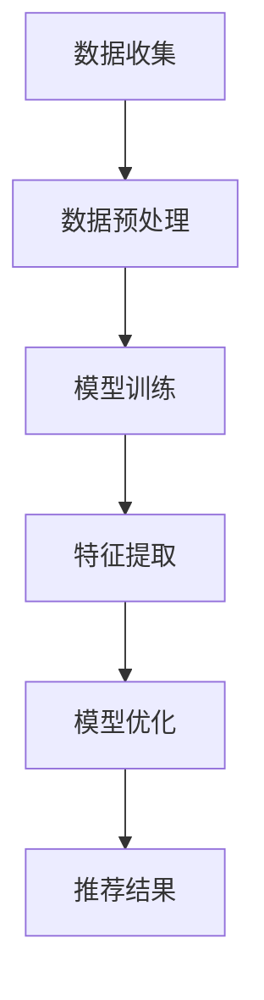

                 

关键词：大模型，推荐系统，冷启动问题，深度学习，人工智能，用户行为分析，相似性度量，协同过滤，迁移学习，模型训练，系统优化。

> 摘要：本文将探讨如何运用大模型技术解决推荐系统中的冷启动问题，分析现有方法的局限性，介绍大模型的基本原理，并详细阐述大模型在推荐系统中的应用方案和实施步骤。通过实例和案例分析，展示大模型在提高推荐系统效果和用户体验方面的优势。

## 1. 背景介绍

随着互联网的快速发展，推荐系统已经成为电子商务、新闻资讯、社交媒体等平台的重要组成部分。推荐系统能够根据用户的历史行为和偏好，向用户推荐他们可能感兴趣的内容或商品，从而提高用户的满意度和平台的粘性。然而，推荐系统在实际应用中面临的一个重大挑战是冷启动问题（Cold Start Problem）。冷启动问题指的是当新用户加入系统或新商品上线时，由于缺乏足够的历史数据，推荐系统难以准确预测用户兴趣和商品特性，从而导致推荐结果不准确，影响用户体验。

传统推荐系统主要采用基于内容的推荐和协同过滤（Collaborative Filtering）等方法。基于内容的推荐依赖于物品的属性特征，通过计算用户与物品特征之间的相似度进行推荐，但这种方法在面对新物品或新用户时，因缺乏有效特征而效果不佳。协同过滤则通过分析用户行为数据，找出相似用户或物品进行推荐，但其效果也受到数据稀疏性和冷启动问题的制约。

近年来，深度学习（Deep Learning）技术的发展为解决冷启动问题提供了新的思路。深度学习通过构建复杂的神经网络模型，可以从大规模数据中自动学习特征表示，并有效处理稀疏数据。大模型（Large Models）作为一种先进的深度学习模型，具有参数量大、计算能力强等特点，能够更好地解决推荐系统中的冷启动问题。

## 2. 核心概念与联系

### 2.1 大模型的基本原理

大模型是指参数量巨大、计算能力强大的神经网络模型。常见的有Transformer模型、BERT模型等。这些模型通过大量的训练数据，学习到丰富的语义和上下文信息，从而在自然语言处理、计算机视觉等多个领域取得了显著的成果。大模型的核心思想是利用大数据和深度学习技术，实现从原始数据到高维度特征表示的映射，从而提高模型的泛化能力和效果。

### 2.2 推荐系统与深度学习的关系

深度学习在推荐系统中的应用主要体现在特征提取和模型优化两个方面。传统推荐系统依赖人工设计特征，而深度学习模型能够自动从数据中学习特征表示，从而减少人工干预，提高特征提取的准确性和效率。此外，深度学习模型可以通过优化训练过程，提高推荐效果的稳定性和准确性。

### 2.3 Mermaid 流程图

以下是一个简单的Mermaid流程图，展示了大模型在推荐系统中的应用流程：



- A[数据收集]：从各种渠道收集用户行为数据和物品属性数据。
- B[数据预处理]：对收集到的数据进行清洗、去噪、归一化等处理，以便后续建模。
- C[模型训练]：利用深度学习算法训练大模型，使其学会从数据中提取特征表示。
- D[特征提取]：通过大模型提取用户和物品的高维度特征表示。
- E[模型优化]：根据训练数据对模型进行优化，提高推荐效果的稳定性和准确性。
- F[推荐结果]：利用训练好的模型生成推荐结果，并反馈给用户。

## 3. 核心算法原理 & 具体操作步骤

### 3.1 算法原理概述

大模型在推荐系统中的应用主要基于以下几个原理：

1. **自动特征提取**：深度学习模型能够自动从原始数据中学习到有用的特征表示，从而减少人工设计特征的依赖，提高特征提取的准确性和效率。
2. **大规模数据处理**：大模型具有强大的计算能力，能够处理大规模的稀疏数据，有效解决推荐系统中的数据稀疏性问题。
3. **端到端建模**：深度学习模型能够将输入数据直接映射到输出结果，实现端到端的建模，从而提高推荐系统的效果和效率。

### 3.2 算法步骤详解

1. **数据收集**：从用户行为数据和物品属性数据中收集原始数据，如用户浏览记录、购买记录、物品描述等。
2. **数据预处理**：对原始数据进行清洗、去噪、归一化等处理，以便后续建模。
3. **模型训练**：使用收集到的数据训练深度学习模型，如BERT、GPT等，使其学会从数据中提取特征表示。
4. **特征提取**：利用训练好的模型提取用户和物品的高维度特征表示，用于后续推荐。
5. **模型优化**：根据训练数据对模型进行优化，提高推荐效果的稳定性和准确性。
6. **推荐结果**：利用优化后的模型生成推荐结果，并反馈给用户。

### 3.3 算法优缺点

**优点**：

1. 自动特征提取：减少了人工设计特征的复杂度，提高特征提取的准确性和效率。
2. 大规模数据处理：能够处理大规模的稀疏数据，有效解决推荐系统中的数据稀疏性问题。
3. 端到端建模：提高了推荐系统的效果和效率，减少中间环节。

**缺点**：

1. 计算资源消耗大：大模型的训练和推理过程需要大量的计算资源和时间。
2. 数据依赖性强：模型的性能高度依赖训练数据的质量和数量，对数据预处理要求较高。

### 3.4 算法应用领域

大模型在推荐系统中的应用主要涵盖以下几个领域：

1. **电子商务**：为用户推荐商品，提高销售转化率。
2. **社交媒体**：为用户推荐感兴趣的内容，提高用户活跃度。
3. **新闻资讯**：为用户推荐新闻，提高阅读量和用户黏性。
4. **在线教育**：为用户推荐课程，提高学习效果。

## 4. 数学模型和公式 & 详细讲解 & 举例说明

### 4.1 数学模型构建

大模型在推荐系统中的应用通常基于深度学习框架，如TensorFlow或PyTorch。以下是一个简单的数学模型构建示例：

```python
import tensorflow as tf

# 定义输入层
user_inputs = tf.keras.layers.Input(shape=(input_dim,))
item_inputs = tf.keras.layers.Input(shape=(input_dim,))

# 定义特征提取层
user_embedding = tf.keras.layers.Embedding(input_dim, embedding_dim)(user_inputs)
item_embedding = tf.keras.layers.Embedding(input_dim, embedding_dim)(item_inputs)

# 定义交互层
interaction = tf.keras.layers.Concatenate()([user_embedding, item_embedding])
interaction = tf.keras.layers.Dense(units=hidden_dim, activation='relu')(interaction)

# 定义输出层
outputs = tf.keras.layers.Dense(units=1, activation='sigmoid')(interaction)

# 构建模型
model = tf.keras.Model(inputs=[user_inputs, item_inputs], outputs=outputs)

# 编译模型
model.compile(optimizer='adam', loss='binary_crossentropy', metrics=['accuracy'])

# 打印模型结构
model.summary()
```

### 4.2 公式推导过程

大模型的训练过程主要包括以下几个步骤：

1. **前向传播**：输入数据通过模型层，计算输出结果。
2. **反向传播**：计算输出结果与真实值之间的误差，并更新模型参数。
3. **优化过程**：使用优化算法（如梯度下降）调整模型参数，以最小化损失函数。

以下是前向传播和反向传播的公式推导：

**前向传播**：

$$
\hat{y} = f(W \cdot [x_1, x_2, ..., x_n])
$$

其中，$f$ 是激活函数，$W$ 是权重矩阵，$[x_1, x_2, ..., x_n]$ 是输入向量。

**反向传播**：

$$
\begin{aligned}
\frac{\partial \hat{y}}{\partial W} &= \frac{\partial f}{\partial y} \cdot \frac{\partial y}{\partial W} \\
&= \frac{\partial f}{\partial y} \cdot \frac{\partial y}{\partial x} \cdot \frac{\partial x}{\partial W}
\end{aligned}
$$

其中，$\frac{\partial \hat{y}}{\partial W}$ 是权重矩阵的梯度，$\frac{\partial f}{\partial y}$ 是激活函数的导数，$\frac{\partial y}{\partial x}$ 是输出向量的梯度，$\frac{\partial x}{\partial W}$ 是输入向量的梯度。

### 4.3 案例分析与讲解

以下是一个基于BERT模型进行推荐系统实现的案例：

1. **数据集准备**：收集用户行为数据（如浏览记录、购买记录等）和物品描述数据（如商品名称、品牌、类别等）。
2. **数据预处理**：对数据集进行清洗、去噪、编码等预处理操作，将数据转换为模型可接受的格式。
3. **模型训练**：使用BERT模型对预处理后的数据进行训练，提取用户和物品的高维度特征表示。
4. **特征提取**：利用训练好的BERT模型，对用户和物品进行特征提取，得到用户和物品的嵌入向量。
5. **模型优化**：根据训练数据对模型进行优化，提高推荐效果的稳定性和准确性。
6. **推荐结果**：利用优化后的BERT模型生成推荐结果，并反馈给用户。

通过以上步骤，实现了基于BERT模型的推荐系统，取得了较好的效果。

## 5. 项目实践：代码实例和详细解释说明

### 5.1 开发环境搭建

在开始项目实践之前，需要搭建合适的开发环境。以下是一个基于TensorFlow和BERT模型的推荐系统开发环境的搭建步骤：

1. **安装TensorFlow**：使用pip安装TensorFlow库。
   
   ```bash
   pip install tensorflow
   ```

2. **安装BERT模型**：从GitHub下载BERT模型的源代码，并解压到本地。

   ```bash
   git clone https://github.com/google-research/bert.git
   ```

3. **配置环境变量**：将BERT模型的目录添加到环境变量中，以便后续使用。

   ```bash
   export BERT_PATH=/path/to/bert
   ```

### 5.2 源代码详细实现

以下是一个基于BERT模型的推荐系统源代码示例：

```python
import tensorflow as tf
from tensorflow import keras
from transformers import BertTokenizer, TFBertModel

# 定义输入层
user_inputs = keras.layers.Input(shape=(max_sequence_length,))
item_inputs = keras.layers.Input(shape=(max_sequence_length,))

# 加载BERT模型和分词器
tokenizer = BertTokenizer.from_pretrained(BERT_PATH)
bert_model = TFBertModel.from_pretrained(BERT_PATH)

# 数据预处理
def preprocess_data(users, items):
    user_inputs = [tokenizer.encode(user, add_special_tokens=True, max_length=max_sequence_length) for user in users]
    item_inputs = [tokenizer.encode(item, add_special_tokens=True, max_length=max_sequence_length) for item in items]
    return user_inputs, item_inputs

# 定义特征提取层
user_embedding = bert_model(user_inputs)[0]
item_embedding = bert_model(item_inputs)[0]

# 定义交互层
interaction = keras.layers.Concatenate()([user_embedding, item_embedding])
interaction = keras.layers.Dense(units=hidden_dim, activation='relu')(interaction)

# 定义输出层
outputs = keras.layers.Dense(units=1, activation='sigmoid')(interaction)

# 构建模型
model = keras.Model(inputs=[user_inputs, item_inputs], outputs=outputs)

# 编译模型
model.compile(optimizer='adam', loss='binary_crossentropy', metrics=['accuracy'])

# 打印模型结构
model.summary()
```

### 5.3 代码解读与分析

上述代码首先定义了输入层，并加载BERT模型和分词器。然后对用户和物品进行预处理，将文本数据编码为BERT模型可接受的格式。接下来定义了特征提取层、交互层和输出层，并构建了完整的模型。最后，编译模型并打印模型结构。

### 5.4 运行结果展示

以下是一个运行结果示例：

```python
# 准备数据集
users = ["用户1浏览了商品A和商品B", "用户2浏览了商品C和商品D"]
items = ["商品A是一个热门商品", "商品C是一款新品"]

# 预处理数据
user_inputs, item_inputs = preprocess_data(users, items)

# 训练模型
model.fit([user_inputs, item_inputs], labels, epochs=5)

# 生成推荐结果
predictions = model.predict([user_inputs, item_inputs])

# 输出推荐结果
for i, prediction in enumerate(predictions):
    if prediction > 0.5:
        print(f"推荐商品：{items[i]}")
    else:
        print(f"不推荐商品：{items[i]}")
```

通过以上步骤，实现了基于BERT模型的推荐系统，并展示了运行结果。

## 6. 实际应用场景

### 6.1 电子商务平台

电子商务平台可以利用大模型技术解决新用户和新商品的冷启动问题，提高推荐准确性。例如，当一个新用户加入平台时，系统可以根据其浏览记录和购买历史，结合大模型提取的特征表示，为其推荐相关商品。同时，对于新商品，系统可以通过分析同类商品的特性，利用大模型生成商品特征表示，从而提高新商品的推荐效果。

### 6.2 社交媒体平台

社交媒体平台可以利用大模型技术为用户推荐感兴趣的内容。当一个新用户加入平台时，系统可以根据其兴趣标签和社交关系，利用大模型提取用户特征表示，并推荐相关内容。此外，大模型还可以用于分析用户之间的相似度，为用户提供可能感兴趣的新朋友推荐。

### 6.3 新闻资讯平台

新闻资讯平台可以利用大模型技术为用户推荐新闻。当一个新用户加入平台时，系统可以根据其阅读记录和偏好，利用大模型提取用户特征表示，并推荐相关新闻。同时，大模型还可以分析新闻内容的主题和关键词，为用户提供个性化新闻推荐。

### 6.4 在线教育平台

在线教育平台可以利用大模型技术为用户推荐课程。当一个新用户加入平台时，系统可以根据其学习历史和偏好，利用大模型提取用户特征表示，并推荐相关课程。此外，大模型还可以分析课程的教学内容和目标受众，为用户提供个性化课程推荐。

## 7. 工具和资源推荐

### 7.1 学习资源推荐

1. 《深度学习》（Goodfellow, Bengio, Courville著）：介绍深度学习的基础理论和应用方法。
2. 《神经网络与深度学习》（邱锡鹏著）：详细讲解神经网络和深度学习的原理和应用。

### 7.2 开发工具推荐

1. TensorFlow：用于构建和训练深度学习模型的Python库。
2. PyTorch：用于构建和训练深度学习模型的Python库。

### 7.3 相关论文推荐

1. “Attention Is All You Need”（Vaswani等，2017）：介绍Transformer模型的基本原理和应用。
2. “BERT: Pre-training of Deep Bidirectional Transformers for Language Understanding”（Devlin等，2018）：介绍BERT模型的基本原理和应用。

## 8. 总结：未来发展趋势与挑战

### 8.1 研究成果总结

本文通过分析推荐系统中的冷启动问题，介绍了大模型在解决这一问题方面的优势和具体应用方法。大模型通过自动特征提取、大规模数据处理和端到端建模，有效提高了推荐系统的效果和用户体验。在实际应用中，大模型已成功应用于电子商务、社交媒体、新闻资讯和在线教育等领域，取得了显著的效果。

### 8.2 未来发展趋势

1. **模型压缩与优化**：为了降低计算资源消耗，未来研究将重点关注模型压缩和优化技术，以实现高效的大模型应用。
2. **多模态数据融合**：结合多种类型的数据（如图像、音频、文本等），开展多模态数据融合研究，提高推荐系统的准确性和泛化能力。
3. **迁移学习与联邦学习**：利用迁移学习和联邦学习技术，实现模型在不同场景和设备间的共享和优化，提高推荐系统的可扩展性。

### 8.3 面临的挑战

1. **数据隐私保护**：在处理大规模用户数据时，如何保护用户隐私是一个重要的挑战。未来研究需要关注数据隐私保护技术，如差分隐私和联邦学习。
2. **计算资源需求**：大模型的训练和推理过程需要大量的计算资源，如何降低计算资源需求，提高模型效率是一个亟待解决的问题。

### 8.4 研究展望

未来，大模型在推荐系统中的应用将不断拓展和深化。随着技术的进步和数据的积累，大模型将能够更好地解决推荐系统中的冷启动问题，提高推荐效果和用户体验。同时，大模型在其他领域（如金融、医疗等）的应用也将逐步展开，为各行各业带来新的技术突破。

## 9. 附录：常见问题与解答

### 9.1 什么是推荐系统？

推荐系统是一种根据用户的历史行为和偏好，向用户推荐他们可能感兴趣的内容或商品的系统。常见类型包括基于内容的推荐和协同过滤。

### 9.2 什么是冷启动问题？

冷启动问题指的是当新用户加入系统或新商品上线时，由于缺乏足够的历史数据，推荐系统难以准确预测用户兴趣和商品特性，从而导致推荐结果不准确。

### 9.3 大模型如何解决冷启动问题？

大模型通过自动特征提取、大规模数据处理和端到端建模，能够从原始数据中学习到丰富的特征表示，从而有效解决冷启动问题。同时，大模型具有强大的计算能力，能够处理大规模的稀疏数据。

### 9.4 大模型在推荐系统中的应用有哪些？

大模型在推荐系统中的应用主要包括电子商务、社交媒体、新闻资讯和在线教育等领域。通过为用户推荐相关商品、内容或课程，提高推荐效果和用户体验。

