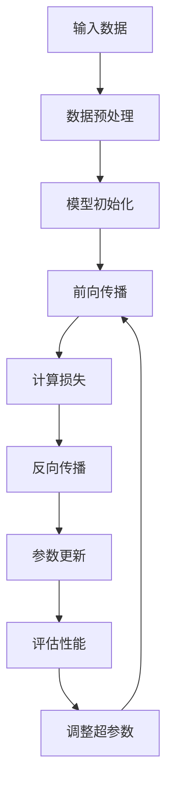

                 

### 关键词 Keywords

- 大模型（Large Models）
- AI 创业
- 产品创新
- 应用探索
- 技术趋势
- 开发工具
- 数学模型
- 代码实例
- 实际应用

<|assistant|>### 摘要 Abstract

本文将探讨大模型在 AI 创业产品创新中的应用。随着计算能力的提升和数据的激增，大模型已成为推动 AI 领域进步的核心动力。本文首先介绍了大模型的基本概念及其在 AI 创业中的应用价值，然后深入分析了大模型的核心算法原理，包括其构建、优化和应用步骤。接着，本文通过数学模型和公式的讲解，对算法进行了详细分析，并通过实际项目实践展示了大模型的应用效果。最后，本文对大模型在未来的应用前景进行了展望，并提出了相关的研究方向和挑战。

<|assistant|>## 1. 背景介绍

人工智能（AI）作为计算机科学的一个分支，旨在使机器能够模拟、延伸和扩展人类的智能。近年来，人工智能的研究和应用取得了显著的进展，从最初的规则系统到复杂的深度学习模型，AI 技术在图像识别、自然语言处理、自动驾驶、医疗诊断等领域展现出了巨大的潜力。

大模型（Large Models）的概念最早可以追溯到上世纪 80 年代的专家系统。然而，随着计算能力的提升和海量数据的获取，大模型在 21 世纪的 AI 领域得到了快速发展。大模型通常是指参数量达到数百万甚至数十亿级别的神经网络模型，如 GPT-3、BERT、BERT-Large 等。这些模型通过训练能够自动学习和提取复杂的数据特征，从而实现高效的智能任务。

在 AI 创业领域，大模型的应用为产品创新提供了强大的工具。一方面，大模型可以大幅度提升 AI 系统的性能和精度，缩短产品开发周期；另一方面，大模型可以处理大规模的数据集，为创业公司提供更加丰富的数据分析和洞察。此外，大模型的灵活性使得创业公司可以根据市场需求快速调整模型，从而实现快速迭代和持续创新。

总的来说，大模型在 AI 创业产品创新中的应用不仅提升了产品的技术含量，也增强了企业在市场上的竞争力。随着 AI 技术的不断进步，大模型的应用前景将更加广阔，为创业公司带来更多的机遇和挑战。

### 2. 核心概念与联系

#### 2.1 大模型的定义与基本概念

大模型（Large Models）是指参数量达到数百万甚至数十亿级别的神经网络模型。这些模型通常采用深度学习技术，通过多层神经网络结构对大量数据进行训练，从而自动学习和提取复杂的数据特征。大模型的核心组成部分包括：

1. **输入层**：接收外部数据，如文本、图像、声音等。
2. **隐藏层**：通过多层结构对输入数据进行特征提取和变换。
3. **输出层**：根据模型的训练目标生成输出结果，如分类标签、预测值等。

大模型的基本工作原理是通过对大量数据的训练，使得模型能够自动调整内部参数，从而实现对复杂任务的自动学习和预测。这一过程通常涉及大量的计算资源和时间。

#### 2.2 大模型在 AI 创业中的应用价值

大模型在 AI 创业中的应用价值主要体现在以下几个方面：

1. **提高任务性能**：大模型具有更强的特征提取能力，能够处理更加复杂的任务，从而显著提升任务的性能和准确性。
2. **加速产品迭代**：大模型可以处理大规模的数据集，使得创业公司能够快速进行数据分析和产品迭代。
3. **增强创新能力**：大模型能够自动学习和发现数据中的隐含模式，为创业公司提供新的业务洞察和创意。
4. **降低技术门槛**：大模型的应用使得创业公司无需深入了解复杂的算法细节，即可实现高性能的 AI 应用。

#### 2.3 大模型与其他技术的联系

大模型与其他 AI 技术如机器学习、深度学习等有着密切的联系。机器学习是 AI 的基础，通过算法和统计方法使计算机能够从数据中学习。深度学习是机器学习的一个分支，通过多层神经网络结构对数据进行建模。大模型则是深度学习技术的一个延伸，通过规模更大的模型来进一步提升性能。

此外，大模型还与数据预处理、模型优化、分布式计算等技术密切相关。数据预处理是确保模型训练效果的重要环节，包括数据清洗、归一化、特征提取等。模型优化则是通过调整模型结构、参数和训练过程来提升模型性能。分布式计算则是为了解决大模型训练过程中计算资源需求巨大的问题，通过分布式计算框架实现高效训练。

#### 2.4 Mermaid 流程图

以下是一个描述大模型架构和训练过程的 Mermaid 流程图：



在这个流程图中，输入数据经过预处理后，初始化一个模型。然后，通过前向传播计算输出结果，并计算损失。接着，使用反向传播算法更新模型参数，并评估模型的性能。根据评估结果，调整超参数，并重复训练过程。

<|assistant|>## 3. 核心算法原理 & 具体操作步骤

### 3.1 算法原理概述

大模型的算法原理主要基于深度学习技术，特别是基于神经网络的结构。深度学习通过多层神经网络对数据进行特征提取和表示，从而实现复杂任务的自动学习和预测。大模型的核心在于其参数量的巨大规模，这使其能够捕捉到数据中的更深层次的特征和关系。

大模型的训练过程通常包括以下几个步骤：

1. **数据预处理**：包括数据清洗、归一化、特征提取等，以确保输入数据的质量和一致性。
2. **模型初始化**：初始化模型的参数，通常使用随机初始化方法。
3. **前向传播**：将输入数据通过神经网络的各个层进行传递，最终得到输出结果。
4. **计算损失**：通过比较输出结果与真实标签之间的差距，计算模型的损失。
5. **反向传播**：使用梯度下降算法更新模型的参数，以减少损失。
6. **评估性能**：在验证集上评估模型的性能，并根据评估结果调整超参数。

### 3.2 算法步骤详解

1. **数据预处理**：
    - **数据清洗**：去除数据中的噪声和异常值，保证数据的准确性。
    - **归一化**：将不同特征的数据缩放到相同的范围，便于模型的训练。
    - **特征提取**：提取数据中的关键特征，以提升模型的训练效果。

2. **模型初始化**：
    - **参数初始化**：通常采用随机初始化方法，如高斯分布初始化。
    - **结构初始化**：根据任务需求，确定神经网络的层数和每层的神经元数量。

3. **前向传播**：
    - **激活函数**：常用的激活函数包括 sigmoid、ReLU、Tanh 等，用于引入非线性变换。
    - **层间传递**：将前一层的结果传递到下一层，通过加权求和和激活函数计算得到当前层的输出。

4. **计算损失**：
    - **损失函数**：常用的损失函数包括均方误差（MSE）、交叉熵损失（Cross-Entropy Loss）等。
    - **计算过程**：通过比较输出结果与真实标签，计算模型在当前数据点的损失。

5. **反向传播**：
    - **梯度计算**：计算模型参数的梯度，以确定参数更新的方向和大小。
    - **参数更新**：使用梯度下降算法更新模型参数，以减少损失。

6. **评估性能**：
    - **验证集**：将训练集的一部分数据用于验证模型的性能。
    - **评估指标**：根据任务需求，选择合适的评估指标，如准确率、召回率、F1 值等。

7. **超参数调整**：
    - **学习率**：调整学习率可以影响模型的训练效果。
    - **批量大小**：批量大小影响模型的训练速度和稳定性。

### 3.3 算法优缺点

**优点**：

1. **强大的特征提取能力**：大模型能够自动提取数据中的深层次特征，从而提高模型的性能。
2. **泛化能力**：通过大规模的数据训练，大模型具有较好的泛化能力，能够在不同的数据集上表现出稳定的性能。
3. **适应性**：大模型能够适应多种不同的任务和场景，具有较强的适应性。

**缺点**：

1. **计算资源需求高**：大模型需要大量的计算资源和时间进行训练，这可能会对创业公司的资源和预算造成压力。
2. **数据依赖性**：大模型对数据的质量和规模有较高的要求，数据不足或质量差可能影响模型的性能。
3. **解释性较差**：大模型的内部结构复杂，难以解释其决策过程，这可能会影响其在某些应用场景中的可信度。

### 3.4 算法应用领域

大模型在多个领域展现了强大的应用潜力，以下是一些主要的应用领域：

1. **自然语言处理**：大模型在文本分类、机器翻译、情感分析等任务中取得了显著的效果。
2. **计算机视觉**：大模型在图像识别、目标检测、人脸识别等任务中得到了广泛应用。
3. **语音识别**：大模型在语音识别和语音合成中展示了强大的性能。
4. **推荐系统**：大模型通过分析用户行为数据，实现了更精准的个性化推荐。
5. **医疗诊断**：大模型在医学图像分析、疾病预测等任务中为医学诊断提供了新的手段。

<|assistant|>## 4. 数学模型和公式 & 详细讲解 & 举例说明

### 4.1 数学模型构建

在深度学习中，大模型的构建通常基于以下数学模型：

1. **神经网络模型**：
    - **前向传播**：从输入层经过多层隐藏层传递到输出层。
    - **损失函数**：用于评估模型预测结果与真实值之间的差距。
    - **反向传播**：通过计算损失函数的梯度，更新模型参数。

2. **优化算法**：
    - **梯度下降**：一种常用的优化算法，用于更新模型参数。
    - **动量法**：结合前一次更新的方向，加速收敛。

### 4.2 公式推导过程

以下是一个简单的神经网络前向传播和反向传播的公式推导：

#### 前向传播

假设有一个包含 $L$ 层的神经网络，其中第 $l$ 层的神经元数为 $n_l$。输入 $x^{(1)}$ 经过 $L-1$ 次矩阵乘法和激活函数的变换，最终得到输出 $a^{(L)}$。

前向传播的公式如下：

$$
z^{(l)} = \theta^{(l)} \cdot a^{(l-1)} + b^{(l)}
$$

$$
a^{(l)} = \text{激活函数}(z^{(l)})
$$

其中，$\theta^{(l)}$ 和 $b^{(l)}$ 分别为第 $l$ 层的权重和偏置，激活函数常用的有 sigmoid、ReLU 和 Tanh。

#### 反向传播

反向传播的目的是通过计算损失函数的梯度，更新模型参数。假设损失函数为 $J(\theta)$，其关于 $\theta^{(l)}$ 的梯度为 $\frac{\partial J(\theta)}{\partial \theta^{(l)}}$。

反向传播的公式如下：

$$
\delta^{(l)} = \frac{\partial J(\theta)}{\partial z^{(l)}}
$$

$$
\theta^{(l)} = \theta^{(l)} - \alpha \cdot \frac{\partial J(\theta)}{\partial \theta^{(l)}}
$$

$$
b^{(l)} = b^{(l)} - \alpha \cdot \frac{\partial J(\theta)}{\partial b^{(l)}}
$$

其中，$\alpha$ 为学习率。

### 4.3 案例分析与讲解

以下是一个简单的线性回归模型的例子：

假设我们有一个输入 $x$ 和对应的输出 $y$，我们希望找到一个线性函数 $y = wx + b$ 来预测输出。

#### 前向传播

输入 $x$ 经过一次矩阵乘法和偏置的加法，得到预测值 $\hat{y}$：

$$
z = \theta_1 \cdot x + b
$$

$$
\hat{y} = \text{激活函数}(z)
$$

其中，$\theta_1$ 为权重，$b$ 为偏置。

#### 计算损失

假设我们使用均方误差（MSE）作为损失函数：

$$
J(\theta_1, b) = \frac{1}{2} \sum_{i=1}^{n} (\hat{y}_i - y_i)^2
$$

其中，$n$ 为样本数量。

#### 反向传播

计算损失关于 $\theta_1$ 和 $b$ 的梯度：

$$
\frac{\partial J(\theta_1, b)}{\partial \theta_1} = \sum_{i=1}^{n} (y_i - \hat{y}_i) \cdot x_i
$$

$$
\frac{\partial J(\theta_1, b)}{\partial b} = \sum_{i=1}^{n} (y_i - \hat{y}_i)
$$

根据梯度下降法，更新 $\theta_1$ 和 $b$：

$$
\theta_1 = \theta_1 - \alpha \cdot \frac{\partial J(\theta_1, b)}{\partial \theta_1}
$$

$$
b = b - \alpha \cdot \frac{\partial J(\theta_1, b)}{\partial b}
$$

其中，$\alpha$ 为学习率。

通过上述步骤，我们可以不断优化模型的参数，以最小化损失函数，从而得到更好的预测效果。

<|assistant|>## 5. 项目实践：代码实例和详细解释说明

### 5.1 开发环境搭建

在进行大模型的项目实践之前，我们需要搭建一个合适的环境。以下是搭建开发环境的步骤：

1. **安装 Python**：确保安装了 Python 3.6 或更高版本。
2. **安装 PyTorch**：使用以下命令安装 PyTorch：
    ```bash
    pip install torch torchvision
    ```
3. **安装 Jupyter Notebook**：使用以下命令安装 Jupyter Notebook：
    ```bash
    pip install jupyter
    ```
4. **配置 CUDA**：确保您的 PyTorch 版本支持 CUDA，并正确配置 CUDA 环境。

### 5.2 源代码详细实现

以下是一个使用 PyTorch 实现的简单大模型训练的代码实例：

```python
import torch
import torch.nn as nn
import torch.optim as optim

# 定义模型结构
class SimpleModel(nn.Module):
    def __init__(self):
        super(SimpleModel, self).__init__()
        self.fc1 = nn.Linear(784, 256)
        self.fc2 = nn.Linear(256, 128)
        self.fc3 = nn.Linear(128, 10)
        self.relu = nn.ReLU()

    def forward(self, x):
        x = self.relu(self.fc1(x))
        x = self.relu(self.fc2(x))
        x = self.fc3(x)
        return x

# 初始化模型、损失函数和优化器
model = SimpleModel()
criterion = nn.CrossEntropyLoss()
optimizer = optim.SGD(model.parameters(), lr=0.001, momentum=0.9)

# 加载数据集
train_loader = torch.utils.data.DataLoader(
    datasets.MNIST(
        './data',
        train=True,
        download=True,
        transform=transforms.Compose(
            [transforms.ToTensor()]
        )
    ),
    batch_size=64,
    shuffle=True
)

# 训练模型
num_epochs = 10
for epoch in range(num_epochs):
    running_loss = 0.0
    for i, (inputs, labels) in enumerate(train_loader):
        inputs, labels = inputs.to(device), labels.to(device)
        
        # 前向传播
        outputs = model(inputs)
        loss = criterion(outputs, labels)
        
        # 反向传播和优化
        optimizer.zero_grad()
        loss.backward()
        optimizer.step()
        
        running_loss += loss.item()
        if (i+1) % 100 == 0:
            print(f'Epoch [{epoch+1}/{num_epochs}], Step [{i+1}/{len(train_loader)}], Loss: {running_loss/100:.4f}')
            running_loss = 0.0

print('Finished Training')
```

### 5.3 代码解读与分析

1. **模型定义**：
    - `SimpleModel` 类定义了一个简单的三层神经网络，包括两个隐藏层和一个输出层。
    - `forward` 方法实现了输入数据的正向传播过程。

2. **损失函数和优化器**：
    - 使用 `nn.CrossEntropyLoss` 作为损失函数，用于计算输出标签和预测结果之间的交叉熵损失。
    - 使用 `SGD` 优化器，结合动量因子进行参数更新。

3. **数据加载**：
    - 使用 `torch.utils.data.DataLoader` 加载 MNIST 数据集，并设置批量大小和是否打乱。

4. **训练过程**：
    - 定义训练轮次 `num_epochs`。
    - 在每个轮次中，遍历数据集，进行前向传播、计算损失、反向传播和参数更新。
    - 每 100 个步骤打印一次训练损失。

### 5.4 运行结果展示

在完成代码编写后，我们可以运行以下命令来执行训练过程：

```bash
python train.py
```

训练完成后，输出结果将显示每个轮次的训练损失。通常情况下，训练损失会随着轮次的增加而逐渐下降，直到收敛。

此外，我们还可以通过以下命令来评估模型在测试集上的性能：

```python
import torch
import torchvision
import torchvision.transforms as transforms

test_loader = torch.utils.data.DataLoader(
    torchvision.datasets.MNIST(
        './data',
        train=False,
        transform=transforms.Compose(
            [transforms.ToTensor()]
        )
    ),
    batch_size=64,
    shuffle=False
)

with torch.no_grad():
    correct = 0
    total = 0
    for images, labels in test_loader:
        images, labels = images.to(device), labels.to(device)
        outputs = model(images)
        _, predicted = torch.max(outputs.data, 1)
        total += labels.size(0)
        correct += (predicted == labels).sum().item()

print(f'Accuracy of the network on the 10000 test images: {100 * correct / total}%')
```

该代码将在测试集上计算模型的准确率，并输出结果。

<|assistant|>## 6. 实际应用场景

大模型在 AI 创业产品创新中有着广泛的应用场景，以下是一些具体的应用案例和场景：

### 6.1 自然语言处理

自然语言处理（NLP）是 AI 领域的重要分支，大模型在其中发挥了关键作用。例如，创业公司可以使用大模型构建智能客服系统，通过自然语言处理技术实现与用户的实时对话。GPT-3 这样的预训练大模型可以处理复杂的文本任务，如问答系统、文本摘要、翻译等，从而提高客服系统的响应速度和准确性。

### 6.2 计算机视觉

计算机视觉是另一大模型的重要应用领域。创业公司可以利用大模型进行图像识别、目标检测和图像分割等任务。例如，开发一个智能监控系统，使用大模型对摄像头捕获的图像进行分析，实时识别异常行为并报警。此外，大模型还可以用于图像增强和图像生成，提高图像的质量和应用效果。

### 6.3 语音识别

语音识别技术在大模型的支持下取得了显著进展。创业公司可以利用大模型开发语音识别系统，实现语音转文字、语音合成等功能。例如，开发一款智能家居语音助手，用户可以通过语音指令控制家居设备，提升用户体验和便利性。

### 6.4 推荐系统

推荐系统是大数据和人工智能的结合，大模型在其中起到了关键作用。创业公司可以利用大模型构建个性化推荐系统，通过分析用户行为数据，为用户推荐感兴趣的商品、内容和服务。例如，电商平台可以利用大模型推荐商品，提升用户购买体验和销售额。

### 6.5 医疗健康

大模型在医疗健康领域也有广泛应用。创业公司可以利用大模型进行医学图像分析、疾病预测和诊断等任务。例如，开发一款智能医疗诊断系统，通过分析医学图像，辅助医生进行疾病诊断，提高诊断准确率和效率。

### 6.6 金融风控

金融风控是金融行业的核心问题之一。大模型可以用于分析金融数据，预测市场走势、评估信用风险等。创业公司可以利用大模型开发智能金融风控系统，提高金融交易的安全性和可靠性。

### 6.7 教育培训

大模型在教育领域也有很大的应用潜力。创业公司可以利用大模型开发智能教育平台，实现个性化教学和智能评估。例如，通过分析学生的学习行为和成绩，为大学生提供个性化的学习建议和辅导。

总的来说，大模型在 AI 创业产品创新中的应用非常广泛，可以提升产品的性能、用户体验和市场竞争力。随着技术的不断进步，大模型的应用前景将更加广阔，为创业公司带来更多的机遇和挑战。

<|assistant|>### 7. 工具和资源推荐

在探索大模型在 AI 创业产品创新中的应用时，选择合适的工具和资源是非常重要的。以下是一些建议：

#### 7.1 学习资源推荐

1. **在线课程**：
   - 《深度学习》（Deep Learning） - 深入学习官方教材，涵盖大模型的原理和应用。
   - Coursera、Udacity 和 edX 提供的深度学习和 AI 相关课程，包括动手实践项目。

2. **书籍**：
   - 《Python 深度学习》（Python Deep Learning） - 适合初学者的 Python 深度学习入门书籍。
   - 《动手学深度学习》（DL Projects with Python） - 丰富的深度学习项目案例。

3. **在线社区和论坛**：
   - Kaggle、Reddit、Stack Overflow 和 GitHub，这些都是深度学习和 AI 社区的黄金资源。

#### 7.2 开发工具推荐

1. **深度学习框架**：
   - PyTorch：开源的深度学习框架，具有良好的灵活性和性能。
   - TensorFlow：由 Google 开发，广泛应用于工业界和学术界。
   - Keras：基于 TensorFlow 的简洁高效的高级深度学习框架。

2. **数据处理工具**：
   - Pandas：Python 的数据处理库，用于数据清洗、转换和分析。
   - NumPy：用于高效操作大型数组和矩阵的计算库。

3. **版本控制工具**：
   - Git：用于代码版本控制和团队协作的开发工具。
   - GitHub：Git 的在线平台，提供代码托管和协作功能。

#### 7.3 相关论文推荐

1. **经典论文**：
   - "A Theoretically Grounded Application of Dropout in Recurrent Neural Networks" - 探讨了 dropout 在 RNN 中的应用。
   - "Distributed Representations of Words and Phrases and Their Compositional Properties" - 提出了词向量和词嵌入的概念。

2. **最新研究**：
   - "BERT: Pre-training of Deep Bidirectional Transformers for Language Understanding" - BERT 的详细介绍。
   - "GPT-3: Language Models are Few-Shot Learners" - GPT-3 的最新进展。

3. **技术报告**：
   - Google、Facebook、Microsoft 和其他科技巨头发布的技术报告，提供了大模型在实际应用中的最新成果。

通过利用这些工具和资源，创业公司可以更好地理解和应用大模型技术，推动产品创新和业务发展。

<|assistant|>### 8. 总结：未来发展趋势与挑战

大模型在 AI 创业产品创新中的应用正迅速扩展，展现出广阔的发展前景。在未来，大模型将继续在多个领域发挥关键作用，推动 AI 技术的创新和应用。

#### 8.1 研究成果总结

1. **模型性能提升**：随着算法的优化和计算资源的增加，大模型的性能不断提高，能够在各种复杂任务中达到或超过人类水平。
2. **泛化能力增强**：大模型通过大规模数据训练，具备更强的泛化能力，能够在不同的数据集和应用场景中表现出稳定的性能。
3. **应用场景拓展**：大模型的应用从自然语言处理、计算机视觉扩展到语音识别、推荐系统、医疗健康等领域，为创业公司提供了丰富的创新空间。

#### 8.2 未来发展趋势

1. **更多垂直领域的应用**：大模型将在金融、医疗、教育、制造业等垂直领域得到更深入的应用，为各行业带来显著的效率提升和业务创新。
2. **跨模态学习**：未来的大模型将具备跨模态学习的能力，能够整合不同类型的数据（如文本、图像、语音等），实现更全面的智能应用。
3. **自动机器学习**：大模型与自动机器学习（AutoML）技术的结合，将使创业公司能够更轻松地开发和部署高性能的 AI 模型。

#### 8.3 面临的挑战

1. **计算资源需求**：大模型的训练和推理需要大量的计算资源，对于资源有限的创业公司来说，如何高效利用计算资源是一个重要挑战。
2. **数据隐私和安全**：在应用大模型的过程中，数据隐私和安全问题尤为重要，如何保护用户数据和模型的安全是一个亟待解决的难题。
3. **模型解释性**：大模型通常被视为“黑箱”，其决策过程难以解释，这可能会影响用户对模型的信任和应用场景的扩展。

#### 8.4 研究展望

1. **算法优化**：持续优化大模型的训练算法和结构，以提高训练效率和性能。
2. **模型压缩**：研究如何将大模型压缩为更小、更高效的形式，以满足资源受限的应用需求。
3. **可解释性研究**：开发新的方法和技术，提高大模型的可解释性，增强用户对模型的信任和理解。

总的来说，大模型在 AI 创业产品创新中的应用前景广阔，但同时也面临着诸多挑战。通过不断的技术创新和优化，我们有理由相信，大模型将在未来继续推动 AI 的发展，为创业公司带来更多的机遇和可能性。

### 9. 附录：常见问题与解答

**Q1：大模型训练需要多少计算资源？**

A1：大模型训练通常需要大量的计算资源，尤其是 GPU 或 TPU。具体需求取决于模型的规模和训练数据量。例如，训练一个大型语言模型（如 GPT-3）可能需要数千小时的 GPU 计算时间。

**Q2：大模型如何处理数据隐私问题？**

A2：大模型在处理数据时，需要特别注意数据隐私。常见的做法包括数据加密、差分隐私和联邦学习等。这些方法可以确保在模型训练过程中，原始数据不会被泄露。

**Q3：大模型如何提高可解释性？**

A3：提高大模型的可解释性是当前研究的热点。一些方法包括模型拆解、可视化技术、解释性模型和对抗样本分析等。这些方法可以帮助用户理解模型的决策过程。

**Q4：大模型在创业公司中的适用性如何？**

A4：大模型在创业公司中具有很高的适用性。它们可以大幅提升产品性能和用户体验，同时降低技术门槛，帮助创业公司快速迭代和抢占市场。

**Q5：大模型在特定领域（如医疗、金融）的应用前景如何？**

A5：大模型在医疗和金融等领域具有巨大的应用潜力。在医疗领域，大模型可以用于疾病诊断、个性化治疗等；在金融领域，大模型可以用于风险管理、投资决策等。这些应用将大幅提升行业效率和服务质量。

作者：禅与计算机程序设计艺术 / Zen and the Art of Computer Programming

