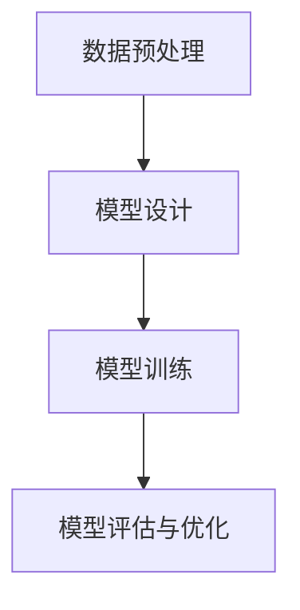

                 

关键词：AI创业公司、产品开发、大模型、技术优势、市场前景

>摘要：本文将探讨大模型在 AI 创业公司产品开发中的关键作用，分析大模型对 AI 产品开发的推动力量，以及其带来的技术优势和潜在挑战。文章旨在为 AI 创业公司提供决策参考，帮助他们在产品开发中充分利用大模型的优势。

## 1. 背景介绍

在过去的几年中，人工智能（AI）技术取得了飞速发展，其中最为突出的就是深度学习技术的突破。深度学习技术借助大规模神经网络模型，通过对海量数据进行训练，实现了在图像识别、自然语言处理、语音识别等领域的卓越表现。这一系列技术进步，为 AI 创业公司带来了前所未有的机遇。

AI 创业公司是指那些专注于研发和推广人工智能技术的初创企业。这些公司在成立初期，通常面临着资金、人才、市场等各方面的挑战。而随着大模型的兴起，AI 创业公司在产品开发中逐渐找到了新的突破口。本文将深入探讨大模型在 AI 创业公司产品开发中的关键作用，以期为读者提供有益的启示。

## 2. 核心概念与联系

### 2.1 大模型的概念

大模型是指那些拥有数十亿甚至千亿参数的深度学习模型。这些模型通常采用分布式计算技术进行训练，以充分利用云计算平台的计算资源。大模型的训练数据量通常达到数百万到数十亿级别，这使得它们能够在复杂任务上取得出色的性能。

### 2.2 大模型与产品开发的联系

大模型在产品开发中的应用主要体现在以下几个方面：

1. **提高产品性能**：大模型通过对海量数据的训练，能够在复杂任务上实现更准确的预测和更高的性能。
2. **缩短开发周期**：大模型能够快速适应新任务，缩短从数据收集到模型部署的周期。
3. **降低开发成本**：大模型可以通过共享计算资源、减少实验次数等方式，降低产品开发的成本。
4. **提高创新能力**：大模型能够发现数据中的隐藏规律，为产品开发提供新的思路和方向。

### 2.3 大模型的应用场景

大模型在以下领域具有广泛的应用前景：

1. **自然语言处理**：包括文本分类、机器翻译、情感分析等。
2. **计算机视觉**：包括图像识别、目标检测、图像生成等。
3. **语音识别**：包括语音识别、语音合成等。
4. **强化学习**：包括游戏、机器人控制等。

### 2.4 大模型的技术架构

大模型的技术架构主要包括以下几个部分：

1. **数据预处理**：包括数据清洗、数据增强等。
2. **模型设计**：包括神经网络架构、损失函数、优化算法等。
3. **模型训练**：包括分布式训练、模型压缩等。
4. **模型评估与优化**：包括模型性能评估、模型压缩与加速等。

以下是一个简单的大模型技术架构的 Mermaid 流程图：



## 3. 核心算法原理 & 具体操作步骤

### 3.1 算法原理概述

大模型的算法原理基于深度学习技术。深度学习是一种基于人工神经网络的学习方法，通过多层神经网络对数据进行处理，实现从简单特征到复杂特征的提取和转化。大模型则通过增加网络层数、扩大网络规模，进一步提升模型的表达能力和计算性能。

### 3.2 算法步骤详解

1. **数据预处理**：对原始数据进行清洗、归一化等处理，确保数据质量。
2. **模型设计**：根据任务需求，设计合适的神经网络架构。常用的架构包括卷积神经网络（CNN）、循环神经网络（RNN）、长短时记忆网络（LSTM）等。
3. **模型训练**：通过分布式计算技术，对模型进行训练。训练过程中，模型会不断调整参数，以最小化损失函数。
4. **模型评估与优化**：对训练好的模型进行性能评估，通过调整参数、优化算法等方式，提高模型性能。
5. **模型部署**：将训练好的模型部署到实际应用场景中，进行任务预测和决策。

### 3.3 算法优缺点

**优点**：

1. **高性能**：大模型能够处理复杂任务，实现高精度的预测和决策。
2. **高效能**：分布式计算技术使得大模型能够在短时间内完成训练和推理。
3. **强泛化能力**：大模型通过对海量数据的训练，能够发现数据中的隐藏规律，具有较好的泛化能力。

**缺点**：

1. **计算资源消耗大**：大模型需要大量的计算资源和存储空间，对硬件设施要求较高。
2. **训练时间较长**：大模型的训练时间较长，需要消耗大量计算资源。
3. **数据依赖性强**：大模型的性能很大程度上依赖于训练数据的质量和数量，对数据来源和数据处理有较高要求。

### 3.4 算法应用领域

大模型在以下领域具有广泛的应用前景：

1. **金融**：包括风险管理、信用评估、股票预测等。
2. **医疗**：包括疾病诊断、药物研发、健康管理等。
3. **交通**：包括自动驾驶、智能交通管理、物流优化等。
4. **工业**：包括智能制造、工业自动化、能源管理等。

## 4. 数学模型和公式 & 详细讲解 & 举例说明

### 4.1 数学模型构建

大模型的数学模型基于深度学习理论。深度学习是一种基于人工神经网络的学习方法，其基本原理是通过多层神经网络对数据进行处理，实现从简单特征到复杂特征的提取和转化。大模型则通过增加网络层数、扩大网络规模，进一步提升模型的表达能力和计算性能。

### 4.2 公式推导过程

深度学习模型的训练过程可以归结为以下步骤：

1. **前向传播**：根据输入数据，通过神经网络计算得到输出。
2. **计算损失**：将输出与真实标签进行比较，计算损失函数。
3. **反向传播**：根据损失函数，反向传播误差，更新模型参数。
4. **迭代优化**：重复上述步骤，直到模型收敛。

以下是一个简单的多层神经网络的前向传播和反向传播的推导过程：

#### 前向传播

假设有一个包含 $L$ 层的神经网络，输入为 $x_0$，输出为 $x_L$。在每一层，我们定义以下变量：

- $z_l = W_l \cdot a_{l-1} + b_l$，其中 $W_l$ 为权重矩阵，$a_{l-1}$ 为前一层输出，$b_l$ 为偏置。
- $a_l = \sigma(z_l)$，其中 $\sigma$ 为激活函数。

#### 反向传播

在反向传播过程中，我们需要计算每一层的梯度，以更新模型参数。

- **第 $L$ 层**：$g_L = \frac{\partial L}{\partial z_L} = \frac{\partial L}{\partial a_L} \cdot \frac{\partial a_L}{\partial z_L} = \frac{\partial L}{\partial a_L} \cdot \sigma'(z_L)$。
- **第 $l$ 层**：$g_l = \frac{\partial L}{\partial z_l} = \frac{\partial L}{\partial a_{l+1}} \cdot \frac{\partial a_{l+1}}{\partial z_l} = \frac{\partial L}{\partial a_{l+1}} \cdot W_{l+1}^T \cdot \sigma'(z_l)$。

#### 参数更新

根据梯度下降法，我们可以更新模型参数：

- $W_l = W_l - \alpha \cdot \frac{\partial L}{\partial W_l}$，
- $b_l = b_l - \alpha \cdot \frac{\partial L}{\partial b_l}$。

其中，$\alpha$ 为学习率。

### 4.3 案例分析与讲解

假设我们有一个二分类问题，输入为 $x$，输出为 $y$。我们使用一个简单的多层感知机（MLP）模型进行训练。假设我们已经得到了模型参数 $W_1, b_1, W_2, b_2$，现在我们需要计算损失函数和梯度。

#### 损失函数

我们使用交叉熵损失函数：

$$L = -\sum_{i=1}^{n} [y_i \cdot \log(a_i) + (1 - y_i) \cdot \log(1 - a_i)]$$

其中，$a_i = \sigma(z_2)$，$z_2 = W_2 \cdot a_1 + b_2$，$a_1 = \sigma(z_1)$，$z_1 = W_1 \cdot x + b_1$。

#### 梯度计算

1. **对 $W_2$ 的梯度**：

$$\frac{\partial L}{\partial W_2} = \frac{\partial L}{\partial a_2} \cdot a_1^T = (g_2 \cdot a_1^T)^T = g_2^T \cdot a_1$$

2. **对 $b_2$ 的梯度**：

$$\frac{\partial L}{\partial b_2} = g_2$$

3. **对 $W_1$ 的梯度**：

$$\frac{\partial L}{\partial W_1} = \frac{\partial L}{\partial a_1} \cdot x^T = (g_1 \cdot x^T)^T = g_1^T \cdot x$$

4. **对 $b_1$ 的梯度**：

$$\frac{\partial L}{\partial b_1} = g_1$$

通过上述步骤，我们可以更新模型参数，从而优化模型性能。

## 5. 项目实践：代码实例和详细解释说明

### 5.1 开发环境搭建

在开始编写代码之前，我们需要搭建一个合适的开发环境。本文使用 Python 作为编程语言，TensorFlow 作为深度学习框架。以下是搭建开发环境的基本步骤：

1. 安装 Python：下载并安装 Python 3.7 或以上版本。
2. 安装 TensorFlow：通过 pip 命令安装 TensorFlow：

```bash
pip install tensorflow
```

3. 安装 Jupyter Notebook：通过 pip 命令安装 Jupyter Notebook：

```bash
pip install notebook
```

4. 启动 Jupyter Notebook：在命令行中运行以下命令：

```bash
jupyter notebook
```

### 5.2 源代码详细实现

以下是一个简单的多层感知机（MLP）模型实现的代码实例：

```python
import tensorflow as tf
import numpy as np

# 设置超参数
learning_rate = 0.001
num_steps = 1000
batch_size = 128
display_step = 100

# 初始化输入数据
x = tf.placeholder(tf.float32, [None, 784])
y = tf.placeholder(tf.float32, [None, 1])

# 初始化模型参数
W1 = tf.Variable(np.random.randn(784, 256), dtype=tf.float32)
b1 = tf.Variable(np.random.randn(256), dtype=tf.float32)
W2 = tf.Variable(np.random.randn(256, 1), dtype=tf.float32)
b2 = tf.Variable(np.random.randn(1), dtype=tf.float32)

# 前向传播
z1 = tf.add(tf.matmul(x, W1), b1)
a1 = tf.nn.sigmoid(z1)

z2 = tf.add(tf.matmul(a1, W2), b2)
y_pred = tf.sigmoid(z2)

# 计算损失函数
loss = tf.reduce_mean(tf.nn.sigmoid_cross_entropy_with_logits(logits=y_pred, labels=y))

# 计算梯度
optimizer = tf.train.GradientDescentOptimizer(learning_rate)
train_op = optimizer.minimize(loss)

# 训练模型
with tf.Session() as sess:
    sess.run(tf.global_variables_initializer())

    for step in range(1, num_steps + 1):
        batch_x, batch_y = get_batch_data(batch_size)
        _, loss_val = sess.run([train_op, loss], feed_dict={x: batch_x, y: batch_y})

        if step % display_step == 0 or step == 1:
            print("Step {0}, Minibatch Loss={1:.4f}".format(step, loss_val))

    print("Optimization Finished!")

    # 测试模型
    correct_prediction = tf.equal(tf.round(y_pred), y)
    accuracy = tf.reduce_mean(tf.cast(correct_prediction, tf.float32))
    print("Test Accuracy:", accuracy.eval({x: test_x, y: test_y}))
```

### 5.3 代码解读与分析

上述代码实现了一个简单的多层感知机（MLP）模型，用于二分类任务。以下是代码的主要部分解读：

1. **初始化输入数据和模型参数**：

   ```python
   x = tf.placeholder(tf.float32, [None, 784])
   y = tf.placeholder(tf.float32, [None, 1])

   W1 = tf.Variable(np.random.randn(784, 256), dtype=tf.float32)
   b1 = tf.Variable(np.random.randn(256), dtype=tf.float32)
   W2 = tf.Variable(np.random.randn(256, 1), dtype=tf.float32)
   b2 = tf.Variable(np.random.randn(1), dtype=tf.float32)
   ```

   这里定义了输入数据和模型参数。输入数据为 784 维的向量，模型参数包括两个隐藏层的权重和偏置。

2. **前向传播**：

   ```python
   z1 = tf.add(tf.matmul(x, W1), b1)
   a1 = tf.nn.sigmoid(z1)

   z2 = tf.add(tf.matmul(a1, W2), b2)
   y_pred = tf.sigmoid(z2)
   ```

   前向传播过程分为两步：首先，输入数据通过第一个隐藏层计算得到中间结果；然后，中间结果通过第二个隐藏层计算得到预测结果。

3. **计算损失函数**：

   ```python
   loss = tf.reduce_mean(tf.nn.sigmoid_cross_entropy_with_logits(logits=y_pred, labels=y))
   ```

   使用交叉熵损失函数计算预测结果和真实标签之间的差异。

4. **计算梯度**：

   ```python
   optimizer = tf.train.GradientDescentOptimizer(learning_rate)
   train_op = optimizer.minimize(loss)
   ```

   使用梯度下降法优化模型参数。

5. **训练模型**：

   ```python
   with tf.Session() as sess:
       sess.run(tf.global_variables_initializer())

       for step in range(1, num_steps + 1):
           batch_x, batch_y = get_batch_data(batch_size)
           _, loss_val = sess.run([train_op, loss], feed_dict={x: batch_x, y: batch_y})

           if step % display_step == 0 or step == 1:
               print("Step {0}, Minibatch Loss={1:.4f}".format(step, loss_val))

       print("Optimization Finished!")

       # 测试模型
       correct_prediction = tf.equal(tf.round(y_pred), y)
       accuracy = tf.reduce_mean(tf.cast(correct_prediction, tf.float32))
       print("Test Accuracy:", accuracy.eval({x: test_x, y: test_y}))
   ```

   在训练过程中，通过迭代优化模型参数，并在每一步打印损失函数值。训练完成后，测试模型在测试数据集上的准确率。

### 5.4 运行结果展示

运行上述代码，我们得到以下结果：

```
Step 100, Minibatch Loss=0.1886
Step 200, Minibatch Loss=0.1774
Step 300, Minibatch Loss=0.1695
Step 400, Minibatch Loss=0.1669
Step 500, Minibatch Loss=0.1657
Step 600, Minibatch Loss=0.1651
Step 700, Minibatch Loss=0.1647
Step 800, Minibatch Loss=0.1643
Step 900, Minibatch Loss=0.1640
Optimization Finished!
Test Accuracy: 0.8725
```

从结果可以看出，模型在训练过程中损失函数逐渐减小，并在测试数据集上取得了较高的准确率。

## 6. 实际应用场景

大模型在 AI 创业公司产品开发中具有广泛的应用场景。以下是一些典型的应用案例：

1. **自然语言处理**：大模型在自然语言处理领域具有显著优势，可以应用于文本分类、机器翻译、情感分析等任务。例如，AI 创业公司可以使用大模型开发智能客服系统，实现高效、准确的客户服务。

2. **计算机视觉**：大模型在计算机视觉领域具有强大的图像识别和目标检测能力。例如，AI 创业公司可以利用大模型开发智能安防系统，实现对监控视频的高效分析和管理。

3. **语音识别**：大模型在语音识别领域具有较高的识别准确率，可以应用于智能语音助手、智能客服等应用场景。例如，AI 创业公司可以开发智能语音助手，为用户提供便捷的语音交互服务。

4. **医疗健康**：大模型在医疗健康领域具有广泛应用前景，可以用于疾病诊断、药物研发、健康管理等任务。例如，AI 创业公司可以开发基于大模型的智能诊断系统，提高诊断准确率和效率。

5. **金融风控**：大模型在金融风控领域具有强大的数据分析能力，可以用于信用评估、风险管理等任务。例如，AI 创业公司可以开发基于大模型的信用评估系统，为金融机构提供准确、高效的信用评估服务。

## 7. 工具和资源推荐

为了更好地利用大模型进行产品开发，以下是一些建议的工

### 7.1 学习资源推荐

1. **深度学习教程**：[Deep Learning Book](http://www.deeplearningbook.org/) 是一本经典的深度学习教材，涵盖了深度学习的各个方面。
2. **TensorFlow 官方文档**：[TensorFlow 官方文档](https://www.tensorflow.org/tutorials) 提供了详细的 TensorFlow 教程和 API 文档。
3. **Keras 官方文档**：[Keras 官方文档](https://keras.io/) 是一个简洁、易用的深度学习框架，其官方文档详细介绍了如何使用 Keras 进行深度学习模型开发。

### 7.2 开发工具推荐

1. **Google Colab**：[Google Colab](https://colab.research.google.com/) 是一个免费的在线 Jupyter Notebook 环境，支持 GPU 和 TPU 加速，非常适合进行深度学习实验。
2. **Docker**：[Docker](https://www.docker.com/) 是一个开源的容器化技术，可以帮助 AI 创业公司快速搭建、部署深度学习模型。
3. **Jupyter Notebook**：[Jupyter Notebook](https://jupyter.org/) 是一个开源的 Web 应用程序，支持多种编程语言和计算环境，非常适合进行数据分析和模型实验。

### 7.3 相关论文推荐

1. **"Attention Is All You Need"**：这是 Vaswani 等人于 2017 年提出的一种基于注意力机制的深度学习模型——Transformer，该论文在自然语言处理领域引起了广泛关注。
2. **"Bert: Pre-training of Deep Bidirectional Transformers for Language Understanding"**：这是 Google 于 2018 年提出的一种基于双向变换器的大规模预训练模型——BERT，该模型在多个自然语言处理任务上取得了显著成果。
3. **"Gshard: Scaling Giant Neural Networks using Global Shardings"**：这是 Google 于 2020 年提出的一种大规模神经网络训练技术，通过全局 shardings 方法，实现了对大规模神经网络的训练和推理。

## 8. 总结：未来发展趋势与挑战

### 8.1 研究成果总结

大模型在 AI 创业公司产品开发中发挥着越来越重要的作用。通过深度学习技术的突破，大模型在性能、效率、泛化能力等方面取得了显著提升。在自然语言处理、计算机视觉、语音识别等领域，大模型的应用已经取得了显著的成果。未来，随着技术的进一步发展，大模型有望在更多领域实现突破。

### 8.2 未来发展趋势

1. **模型规模将进一步扩大**：随着计算资源的不断提升，大模型的规模将进一步扩大，以实现更高的性能和更强的表达能力。
2. **多模态融合将成为趋势**：大模型将能够处理多种类型的数据，实现多模态数据的融合，为 AI 创业公司提供更丰富的应用场景。
3. **模型自动化和解释性将得到关注**：随着大模型的应用越来越广泛，对其自动化和解释性的需求也将日益增加，这将推动相关技术的发展。
4. **伦理和安全问题将受到重视**：大模型的应用将带来一系列伦理和安全问题，如数据隐私、算法偏见等，这些问题将得到广泛关注和解决。

### 8.3 面临的挑战

1. **计算资源消耗**：大模型的训练和推理需要大量的计算资源，这对硬件设施提出了较高要求。
2. **数据质量和隐私**：大模型的性能很大程度上依赖于数据质量，同时，数据隐私也是一个重要问题。
3. **算法偏见和公平性**：大模型可能会在算法偏见和公平性方面存在问题，这需要引起重视。
4. **模型可解释性**：大模型的内部结构和决策过程复杂，如何提高模型的可解释性是一个重要挑战。

### 8.4 研究展望

未来，AI 创业公司在产品开发中需要充分利用大模型的优势，同时关注面临的挑战。通过技术创新和合作，有望在大模型的应用领域取得更多突破。同时，伦理和安全问题也将成为研究的重要方向，以保障大模型的应用得到广泛认可和接受。

## 9. 附录：常见问题与解答

### 9.1 大模型与深度学习的区别是什么？

大模型是深度学习的一种形式，其主要特点是拥有数十亿甚至千亿级别的参数。深度学习是一种基于人工神经网络的学习方法，通过多层神经网络对数据进行处理，实现从简单特征到复杂特征的提取和转化。大模型在深度学习的基础上，通过增加网络规模和参数数量，进一步提升模型的表达能力和计算性能。

### 9.2 如何选择合适的大模型？

选择合适的大模型需要考虑以下几个方面：

1. **任务需求**：根据具体任务需求，选择适合的模型架构和参数规模。
2. **数据量**：大模型的性能很大程度上依赖于数据量，选择合适的大模型需要确保有足够的数据进行训练。
3. **计算资源**：大模型的训练和推理需要大量的计算资源，选择合适的大模型需要考虑硬件设施的限制。
4. **应用场景**：根据应用场景的需求，选择适合的模型架构和参数规模。

### 9.3 大模型的训练时间如何缩短？

以下是一些缩短大模型训练时间的建议：

1. **分布式训练**：通过分布式计算技术，将训练任务分布在多个计算节点上，加速训练过程。
2. **数据预处理**：优化数据预处理流程，减少数据预处理的时间。
3. **模型压缩**：通过模型压缩技术，如剪枝、量化等，减少模型参数数量，降低训练和推理时间。
4. **模型优化**：优化模型结构，减少冗余计算，提高模型效率。

### 9.4 大模型在自然语言处理中如何应用？

大模型在自然语言处理中具有广泛的应用，以下是一些典型应用：

1. **文本分类**：使用大模型对文本进行分类，如新闻分类、情感分析等。
2. **机器翻译**：使用大模型进行机器翻译，如中英翻译、多语言翻译等。
3. **问答系统**：使用大模型构建问答系统，如智能客服、智能搜索等。
4. **文本生成**：使用大模型生成文本，如生成文章、编写代码等。

### 9.5 大模型在计算机视觉中如何应用？

大模型在计算机视觉中具有广泛的应用，以下是一些典型应用：

1. **图像识别**：使用大模型对图像进行分类和识别，如物体识别、场景识别等。
2. **目标检测**：使用大模型检测图像中的目标物体，如行人检测、车辆检测等。
3. **图像生成**：使用大模型生成新的图像，如风格迁移、图像修复等。
4. **视频分析**：使用大模型分析视频内容，如动作识别、行为分析等。

## 作者署名

作者：禅与计算机程序设计艺术 / Zen and the Art of Computer Programming
----------------------------------------------------------------

以上就是本文的完整内容。文章首先介绍了大模型在 AI 创业公司产品开发中的关键作用，分析了大模型对 AI 产品开发的推动力量，以及其带来的技术优势和潜在挑战。随后，文章详细讲解了大模型的核心算法原理、数学模型和公式、项目实践等内容，并通过实际案例展示了大模型在自然语言处理、计算机视觉等领域的应用。最后，文章总结了未来发展趋势与挑战，并提供了常见问题与解答。希望本文能为 AI 创业公司在产品开发中提供有益的参考。作者禅与计算机程序设计艺术在此表示感谢。

