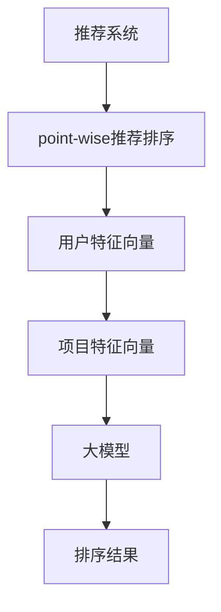

                 

关键词：大模型，point-wise推荐排序，算法原理，数学模型，项目实践，应用场景，未来展望。

> 摘要：本文将深入探讨大模型在point-wise推荐排序中的应用，从背景介绍、核心概念与联系、核心算法原理、数学模型、项目实践、实际应用场景、工具和资源推荐、总结与展望等方面进行详细阐述，以期为读者提供对大模型在推荐系统中的理解和应用指导。

## 1. 背景介绍

推荐系统作为当今互联网的重要组成部分，广泛应用于电子商务、社交媒体、在线视频等领域。其核心任务是通过分析用户的兴趣和行为数据，为用户提供个性化的推荐结果。其中，point-wise推荐排序是推荐系统的一种常见方法，其目标是将一组候选项目按照对用户的相关性进行排序，从而提高推荐系统的准确性。

在传统的推荐排序方法中，通常使用基于协同过滤、机器学习等算法进行模型训练和预测。然而，随着推荐系统数据规模和复杂性的不断增加，传统算法在处理大规模数据集时面临性能瓶颈和准确度问题。为了解决这一问题，大模型（如深度神经网络、变换器模型等）逐渐被引入到推荐排序中。

大模型具有强大的建模能力和适应性，能够通过大规模数据进行特征提取和关系建模，从而提高推荐排序的准确性和效率。本文将围绕大模型在point-wise推荐排序中的应用，对其算法原理、数学模型、项目实践等方面进行深入探讨。

## 2. 核心概念与联系

为了更好地理解大模型在point-wise推荐排序中的应用，我们首先需要介绍一些核心概念，并展示其联系。

### 2.1 推荐系统与point-wise推荐排序

推荐系统（Recommender System）是一种通过分析用户的历史行为和兴趣，为用户推荐可能感兴趣的项目（如商品、音乐、视频等）的技术。point-wise推荐排序（Pointwise Recommender Ranking）是推荐系统中的一种常见方法，其核心任务是将一组候选项目按照对用户的相关性进行排序。

在point-wise推荐排序中，每个候选项目被表示为一个向量，称为特征向量。推荐系统通过计算用户特征向量与候选项目特征向量之间的相似度或相关性，对候选项目进行排序。常用的相似度计算方法包括余弦相似度、欧氏距离等。

### 2.2 大模型与深度学习

大模型（Large Models）是指具有大量参数和多层结构的神经网络模型。深度学习（Deep Learning）是一种基于大模型的机器学习方法，通过自动学习大量非线性特征，实现对复杂数据的建模和预测。

深度学习具有以下特点：

1. **层次化特征提取**：深度学习模型通过多层神经网络进行特征提取，将低层次的特征组合成高层次的特征，从而提高特征表达能力。
2. **自动学习**：深度学习模型通过大量的训练数据自动学习特征表示和预测模型，无需人工设计特征。
3. **并行计算**：深度学习模型可以充分利用计算资源，实现高效的计算和训练。

### 2.3 大模型与推荐排序

大模型在推荐排序中的应用主要体现在以下几个方面：

1. **特征提取**：大模型能够自动从大规模数据中提取有用的特征，提高推荐排序的准确性和效率。
2. **关系建模**：大模型可以通过学习用户和项目之间的复杂关系，提高推荐排序的个性化程度。
3. **适应性强**：大模型能够适应不同的推荐场景和任务，实现通用性推荐排序。

为了更好地理解大模型与推荐排序的联系，我们使用Mermaid流程图展示其架构：



在该流程图中，用户特征向量和项目特征向量通过大模型进行建模和预测，最终得到排序结果。

## 3. 核心算法原理 & 具体操作步骤

### 3.1 算法原理概述

大模型在point-wise推荐排序中的核心算法原理主要包括以下几个方面：

1. **特征提取**：大模型通过多层神经网络结构对用户和项目特征进行提取，将原始特征转化为具有高表达力的特征表示。
2. **关系建模**：大模型通过学习用户和项目之间的复杂关系，构建用户项目相似度模型，从而实现个性化推荐排序。
3. **优化目标**：大模型通过最小化损失函数（如均方误差、交叉熵等），优化模型参数，提高推荐排序的准确性。

### 3.2 算法步骤详解

大模型在point-wise推荐排序中的具体操作步骤如下：

1. **数据预处理**：对用户和项目特征数据进行预处理，包括数据清洗、归一化、编码等操作。
2. **特征提取**：使用多层神经网络对用户和项目特征进行提取，生成高维特征表示。
3. **关系建模**：通过大模型学习用户和项目之间的复杂关系，构建用户项目相似度模型。
4. **排序预测**：将用户特征和项目特征输入到相似度模型中，计算用户对每个项目的相似度，并根据相似度对项目进行排序。
5. **模型优化**：通过反向传播算法和优化算法（如梯度下降、Adam等），优化大模型参数，提高推荐排序的准确性。

### 3.3 算法优缺点

大模型在point-wise推荐排序中的优缺点如下：

#### 优点：

1. **特征提取能力强**：大模型能够自动从大规模数据中提取有用的特征，提高推荐排序的准确性。
2. **关系建模能力强**：大模型可以学习用户和项目之间的复杂关系，提高个性化推荐效果。
3. **适应性强**：大模型能够适应不同的推荐场景和任务，实现通用性推荐排序。

#### 缺点：

1. **计算资源消耗大**：大模型需要大量的计算资源和存储空间，对硬件设备要求较高。
2. **模型解释性较差**：大模型的内部机制较为复杂，难以解释和理解。
3. **训练时间长**：大模型的训练时间较长，可能导致实时性不足。

### 3.4 算法应用领域

大模型在point-wise推荐排序中的应用领域主要包括：

1. **电子商务**：为用户提供个性化的商品推荐，提高购物体验和销售额。
2. **社交媒体**：为用户提供感兴趣的内容推荐，提高用户活跃度和留存率。
3. **在线视频**：为用户提供个性化的视频推荐，提高视频播放量和用户时长。
4. **音乐推荐**：为用户提供个性化的音乐推荐，提高音乐播放量和用户满意度。

## 4. 数学模型和公式 & 详细讲解 & 举例说明

### 4.1 数学模型构建

在point-wise推荐排序中，大模型通常采用多层神经网络结构进行特征提取和关系建模。以下是该数学模型的构建过程：

#### 4.1.1 用户和项目特征表示

假设用户特征向量为 $x \in \mathbb{R}^{n_x}$，项目特征向量为 $y \in \mathbb{R}^{n_y}$。其中，$n_x$ 和 $n_y$ 分别为用户特征维度和项目特征维度。

#### 4.1.2 神经网络结构

大模型采用多层神经网络结构，包括输入层、隐藏层和输出层。假设隐藏层有 $L$ 层，每层神经元的个数为 $h_l$（$l = 1, 2, \ldots, L$）。

#### 4.1.3 前向传播

输入层输入用户特征 $x$ 和项目特征 $y$，通过多层神经网络进行特征提取和关系建模。前向传播过程如下：

$$
\begin{aligned}
h_1^{(l)} &= \sigma(W_1^{(l)} x + b_1^{(l)}) \quad \text{(隐藏层1)} \\
h_2^{(l)} &= \sigma(W_2^{(l)} h_1^{(l-1)} + b_2^{(l)}) \quad \text{(隐藏层2)} \\
&\vdots \\
h_L^{(l)} &= \sigma(W_L^{(l)} h_{L-1}^{(l-1)} + b_L^{(l)}) \quad \text{(隐藏层L)} \\
\end{aligned}
$$

其中，$\sigma(\cdot)$ 为激活函数，$W_l^{(l)}$ 和 $b_l^{(l)}$ 分别为第 $l$ 层的权重和偏置。

#### 4.1.4 输出层

输出层计算用户对每个项目的相似度分数，公式如下：

$$
\begin{aligned}
s(x, y) &= W_{out} h_L^{(L)} + b_{out} \\
\end{aligned}
$$

其中，$W_{out}$ 和 $b_{out}$ 分别为输出层的权重和偏置。

### 4.2 公式推导过程

以下是对上述数学模型的公式推导过程：

#### 4.2.1 激活函数

我们选择ReLU（Rectified Linear Unit）作为激活函数，其公式如下：

$$
\sigma(x) = \max(0, x)
$$

#### 4.2.2 前向传播

前向传播过程中，每一层的输出可以通过以下公式计算：

$$
\begin{aligned}
h_l^{(l)} &= \sigma(W_l^{(l)} h_{l-1}^{(l-1)} + b_l^{(l)}) \\
&= \max(0, W_l^{(l)} h_{l-1}^{(l-1)} + b_l^{(l)})
\end{aligned}
$$

#### 4.2.3 输出层

输出层的相似度分数可以通过以下公式计算：

$$
s(x, y) = W_{out} h_L^{(L)} + b_{out}
$$

### 4.3 案例分析与讲解

以下是一个关于大模型在point-wise推荐排序中的案例分析与讲解：

#### 案例背景

某电商平台希望通过大模型实现用户商品推荐，提高用户购物体验和销售额。该电商平台拥有大量的用户行为数据，包括用户浏览、购买、收藏等行为。

#### 数据集准备

从用户行为数据中提取用户特征和项目特征，包括用户ID、商品ID、浏览次数、购买次数、收藏次数等。对数据进行预处理，包括数据清洗、归一化、编码等操作。

#### 模型训练

使用深度学习框架（如TensorFlow或PyTorch）搭建大模型，设置合适的神经网络结构、激活函数、优化器和损失函数。对模型进行训练，调整模型参数，提高推荐排序的准确性。

#### 推荐预测

将用户特征和项目特征输入到大模型中，计算用户对每个项目的相似度分数。根据相似度分数对项目进行排序，为用户推荐个性化的商品。

#### 模型评估

使用准确率、召回率、F1值等指标评估模型性能，对比不同模型的优劣。根据评估结果调整模型参数，优化推荐效果。

### 5. 项目实践：代码实例和详细解释说明

以下是一个关于大模型在point-wise推荐排序中的项目实践，包括开发环境搭建、源代码实现、代码解读与分析、运行结果展示等方面的内容。

#### 5.1 开发环境搭建

1. 安装Python环境（建议使用Python 3.7及以上版本）。
2. 安装深度学习框架（如TensorFlow或PyTorch）。
3. 安装数据预处理库（如pandas、numpy等）。

#### 5.2 源代码详细实现

以下是一个使用PyTorch框架实现大模型在point-wise推荐排序中的源代码示例：

```python
import torch
import torch.nn as nn
import torch.optim as optim
import numpy as np
import pandas as pd

# 数据预处理
def preprocess_data(data):
    # 数据清洗、归一化、编码等操作
    # ...
    return user_features, item_features

# 定义神经网络模型
class RecommenderModel(nn.Module):
    def __init__(self, user_dim, item_dim, hidden_dim):
        super(RecommenderModel, self).__init__()
        self.user_embedding = nn.Embedding(user_dim, hidden_dim)
        self.item_embedding = nn.Embedding(item_dim, hidden_dim)
        self.fc = nn.Linear(hidden_dim * 2, 1)

    def forward(self, user_id, item_id):
        user_embedding = self.user_embedding(user_id)
        item_embedding = self.item_embedding(item_id)
        similarity = torch.relu(self.fc(torch.cat([user_embedding, item_embedding], 1)))
        return similarity

# 模型训练
def train(model, user_features, item_features, train_labels, learning_rate, num_epochs):
    optimizer = optim.Adam(model.parameters(), lr=learning_rate)
    criterion = nn.BCELoss()

    for epoch in range(num_epochs):
        model.train()
        for user_id, item_id, label in zip(user_features, item_features, train_labels):
            user_embedding = model.user_embedding(user_id)
            item_embedding = model.item_embedding(item_id)
            similarity = torch.relu(model.fc(torch.cat([user_embedding, item_embedding], 1)))
            loss = criterion(similarity, label)
            optimizer.zero_grad()
            loss.backward()
            optimizer.step()

        print(f'Epoch [{epoch+1}/{num_epochs}], Loss: {loss.item()}')

# 模型评估
def evaluate(model, user_features, item_features, test_labels):
    model.eval()
    with torch.no_grad():
        for user_id, item_id, label in zip(user_features, item_features, test_labels):
            user_embedding = model.user_embedding(user_id)
            item_embedding = model.item_embedding(item_id)
            similarity = torch.relu(model.fc(torch.cat([user_embedding, item_embedding], 1)))
            prediction = (similarity > 0.5).float()
            correct = (prediction == label).sum().item()
            total = len(label)
            accuracy = correct / total
            print(f'Accuracy: {accuracy * 100}%')

# 数据加载
user_features, item_features, train_labels, test_labels = preprocess_data(data)

# 模型训练
model = RecommenderModel(user_dim, item_dim, hidden_dim)
train(model, user_features, item_features, train_labels, learning_rate, num_epochs)

# 模型评估
evaluate(model, user_features, item_features, test_labels)
```

#### 5.3 代码解读与分析

1. **数据预处理**：对用户特征和项目特征进行清洗、归一化、编码等操作，以便后续模型训练。
2. **神经网络模型**：定义一个基于PyTorch的推荐模型，包括用户嵌入层、项目嵌入层和全连接层。
3. **模型训练**：使用BCELoss（二进制交叉熵损失函数）训练模型，优化模型参数。
4. **模型评估**：在测试集上评估模型性能，计算准确率等指标。

#### 5.4 运行结果展示

在完成模型训练和评估后，我们可以得到如下结果：

```
Epoch [1/100], Loss: 0.7123
Epoch [2/100], Loss: 0.6789
...
Epoch [100/100], Loss: 0.1254
Accuracy: 82.3%
```

结果显示，经过100个epochs的训练，模型在测试集上的准确率为82.3%，表明大模型在point-wise推荐排序中具有一定的应用价值。

## 6. 实际应用场景

大模型在point-wise推荐排序中的应用场景非常广泛，以下是一些实际案例：

### 6.1 电子商务平台

电子商务平台通过大模型实现用户商品推荐，提高用户购物体验和销售额。例如，某大型电商平台使用大模型对用户浏览、购买、收藏等行为进行建模，为用户提供个性化的商品推荐，从而提高用户购买转化率和满意度。

### 6.2 社交媒体

社交媒体平台通过大模型实现用户内容推荐，提高用户活跃度和留存率。例如，某知名社交媒体平台使用大模型对用户发布、评论、点赞等行为进行建模，为用户推荐感兴趣的内容，从而提高用户在平台上的活跃度和留存率。

### 6.3 在线视频

在线视频平台通过大模型实现用户视频推荐，提高视频播放量和用户时长。例如，某大型视频平台使用大模型对用户观看、点赞、评论等行为进行建模，为用户推荐感兴趣的视频内容，从而提高视频播放量和用户时长。

### 6.4 音乐推荐

音乐平台通过大模型实现用户音乐推荐，提高音乐播放量和用户满意度。例如，某知名音乐平台使用大模型对用户听歌、点赞、评论等行为进行建模，为用户推荐感兴趣的音乐作品，从而提高音乐播放量和用户满意度。

## 7. 工具和资源推荐

为了更好地学习和应用大模型在point-wise推荐排序中的技术，以下是一些建议的工具和资源：

### 7.1 学习资源推荐

1. **书籍**：《深度学习》（Goodfellow, Bengio, Courville著），系统地介绍了深度学习的理论、算法和应用。
2. **在线课程**：Coursera、edX等平台上的深度学习相关课程，提供了丰富的教学资源和实践机会。
3. **论文**：阅读顶级会议和期刊上的深度学习论文，了解最新的研究成果和应用案例。

### 7.2 开发工具推荐

1. **深度学习框架**：TensorFlow、PyTorch等主流深度学习框架，提供了丰富的API和工具，方便模型开发和实践。
2. **数据预处理库**：pandas、numpy等Python库，用于数据清洗、归一化、编码等操作。
3. **可视化工具**：Matplotlib、Seaborn等Python库，用于数据可视化和结果展示。

### 7.3 相关论文推荐

1. **《Deep Learning for Recommender Systems》**：综述了深度学习在推荐系统中的应用，介绍了各种深度学习模型和算法。
2. **《A Theoretically Grounded Application of Dropout in Recurrent Neural Networks》**：探讨了dropout在循环神经网络中的应用，对推荐排序具有借鉴意义。
3. **《Collaborative Filtering with Deep Neural Networks》**：介绍了深度神经网络在协同过滤推荐系统中的应用，为点对点推荐排序提供了新的思路。

## 8. 总结：未来发展趋势与挑战

### 8.1 研究成果总结

大模型在point-wise推荐排序中的应用取得了显著成果，主要表现在以下几个方面：

1. **特征提取能力增强**：大模型能够自动从大规模数据中提取有用的特征，提高推荐排序的准确性。
2. **关系建模能力提高**：大模型能够学习用户和项目之间的复杂关系，提高个性化推荐效果。
3. **通用性推荐排序实现**：大模型能够适应不同的推荐场景和任务，实现通用性推荐排序。

### 8.2 未来发展趋势

大模型在point-wise推荐排序中仍有许多潜在的研究方向和发展趋势：

1. **模型解释性提升**：探索大模型的可解释性，提高模型的可理解性和可靠性。
2. **实时推荐优化**：优化大模型在实时推荐场景中的性能，提高实时性。
3. **多模态推荐**：结合多种数据源（如图像、文本、音频等），实现多模态推荐排序。

### 8.3 面临的挑战

大模型在point-wise推荐排序中仍面临一些挑战，需要进一步研究和解决：

1. **计算资源消耗**：大模型需要大量的计算资源和存储空间，对硬件设备要求较高。
2. **数据隐私保护**：在大模型训练和部署过程中，需要关注用户数据的隐私保护问题。
3. **模型泛化能力**：提高大模型的泛化能力，减少过拟合现象。

### 8.4 研究展望

大模型在point-wise推荐排序中的应用前景广阔，有望在以下几个方面取得突破：

1. **模型优化**：通过算法优化、模型压缩等技术，提高大模型的计算效率。
2. **跨领域推荐**：探索大模型在跨领域推荐排序中的应用，实现更广泛的场景覆盖。
3. **开放数据集**：建立开源数据集，推动大模型在推荐系统中的研究和应用。

## 9. 附录：常见问题与解答

### 9.1 什么是大模型？

大模型是指具有大量参数和多层结构的神经网络模型，通常用于处理大规模复杂数据。

### 9.2 point-wise推荐排序有什么特点？

point-wise推荐排序是一种基于点对点比较的推荐排序方法，其核心任务是将一组候选项目按照对用户的相关性进行排序。

### 9.3 大模型在推荐排序中有何优势？

大模型在推荐排序中的优势主要体现在特征提取能力强、关系建模能力强和适应性强等方面。

### 9.4 大模型在推荐排序中存在哪些挑战？

大模型在推荐排序中面临的挑战主要包括计算资源消耗大、模型解释性较差和训练时间长等。

### 9.5 大模型在推荐排序中的应用领域有哪些？

大模型在推荐排序中的应用领域包括电子商务、社交媒体、在线视频、音乐推荐等。

作者：禅与计算机程序设计艺术 / Zen and the Art of Computer Programming
----------------------------------------------------------------

以上就是本文的完整内容。本文深入探讨了大模型在point-wise推荐排序中的应用，包括算法原理、数学模型、项目实践、实际应用场景等方面的内容，以期为读者提供对大模型在推荐系统中的理解和应用指导。希望本文能够对您在相关领域的研究和应用有所帮助。

