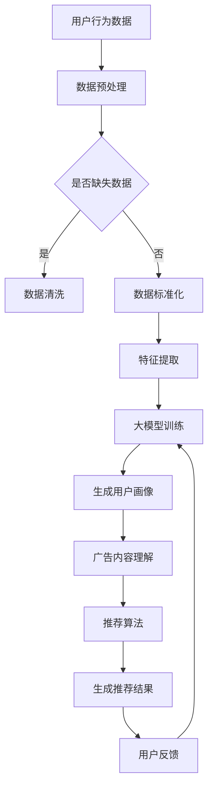

                 

关键词：大模型，个性化广告推荐，深度学习，数据挖掘，算法优化

摘要：本文主要探讨大模型在个性化广告推荐领域的应用潜力和重要性。通过深入分析大模型的核心概念、原理、算法以及实际应用，我们将揭示大模型如何通过深度学习和数据挖掘技术，优化广告推荐效果，提高用户体验，并展望其未来的发展趋势与挑战。

## 1. 背景介绍

个性化广告推荐系统是现代互联网广告领域的重要研究方向。随着互联网的普及和信息爆炸，用户面临的信息过载问题日益严重。为了解决这一问题，广告推荐系统应运而生，旨在根据用户的兴趣和行为，为其推荐最相关、最有价值的广告内容。传统的广告推荐系统主要基于用户的历史行为数据和简单的协同过滤算法，但其在推荐准确性和多样性方面存在一定的局限性。

近年来，随着深度学习技术的快速发展，大模型开始在广告推荐领域崭露头角。大模型，通常是指那些拥有数百万甚至数十亿参数的深度神经网络模型，具有强大的表达能力和泛化能力。它们能够从大量非结构化数据中学习到复杂的数据特征，从而实现更精准和个性化的广告推荐。

本文将围绕大模型在个性化广告推荐中的应用，探讨其核心概念、原理、算法以及实际应用，并分析其未来的发展趋势和面临的挑战。

### 1.1 个性化广告推荐的现状

当前，个性化广告推荐系统已经成为互联网广告领域的主流模式。根据 Statista 的数据，2022 年全球在线广告市场规模达到 4350 亿美元，其中个性化广告推荐占据了一半以上的份额。个性化广告推荐不仅提升了广告的点击率（CTR）和转化率（CVR），还显著改善了用户体验。

然而，传统的个性化广告推荐系统主要依赖于基于内容的过滤（CBF）和协同过滤（CF）算法。CBF 算法通过分析广告内容特征和用户兴趣特征，实现广告与用户的匹配。CF 算法则通过分析用户行为数据，发现用户之间的相似性，从而进行推荐。这些算法在一定程度上提高了推荐的准确性，但存在以下问题：

1. **数据依赖性强**：传统算法依赖于用户的历史行为数据，对于新用户或新广告，推荐效果较差。
2. **推荐多样性不足**：传统算法容易陷入“热点效应”和“群体效应”，导致推荐内容单一，缺乏多样性。
3. **实时性较差**：传统算法在处理大规模数据时，实时性较差，难以应对动态变化的用户需求。

### 1.2 大模型在广告推荐中的应用潜力

大模型的出现为个性化广告推荐带来了新的契机。大模型具有以下几个显著特点：

1. **强大的表达能力**：大模型能够自动提取数据中的复杂特征，实现高维数据的降维，从而提升推荐的准确性。
2. **良好的泛化能力**：大模型通过在大量数据上训练，能够学习到普遍适用的特征，从而提高推荐的泛化能力。
3. **实时性**：大模型采用分布式计算和并行处理技术，能够快速处理大规模数据，实现实时推荐。

大模型在广告推荐中的应用主要包括以下几个方面：

1. **用户画像生成**：大模型能够从用户的浏览历史、搜索记录等非结构化数据中提取用户兴趣特征，生成个性化的用户画像。
2. **广告内容理解**：大模型能够对广告内容进行语义解析，提取关键信息，从而实现广告与用户的精准匹配。
3. **实时推荐**：大模型采用深度学习技术和分布式计算框架，能够实现高速、高效的实时推荐。

总之，大模型在个性化广告推荐中的应用潜力巨大，有望解决传统算法面临的诸多问题，提升广告推荐的准确性和多样性。接下来，我们将深入探讨大模型的核心概念、原理和算法。

## 2. 核心概念与联系

### 2.1 大模型的概念

大模型，即大规模深度神经网络模型，是指那些拥有数百万甚至数十亿参数的深度神经网络。这些模型通常具有多个隐藏层，能够通过多层次的非线性变换，从大量数据中提取复杂特征。

大模型的核心特点包括：

1. **强大的表达能力**：大模型能够自动学习数据的复杂特征，实现高维数据的降维。
2. **良好的泛化能力**：大模型通过在大量数据上训练，能够学习到普遍适用的特征。
3. **自适应能力**：大模型能够根据不同的数据集和任务需求，自动调整模型结构和参数。

### 2.2 个性化广告推荐的概念

个性化广告推荐是指根据用户的兴趣和行为，为其推荐最相关、最有价值的广告内容。个性化广告推荐的关键在于理解用户需求和广告内容特征，实现用户与广告的精准匹配。

个性化广告推荐的关键概念包括：

1. **用户画像**：用户画像是指根据用户的历史行为数据，提取用户的兴趣特征和行为特征，用于描述用户的需求和偏好。
2. **广告内容特征**：广告内容特征是指对广告文案、图片、视频等多媒体内容进行语义解析，提取关键信息，用于描述广告的内容特征。
3. **推荐算法**：推荐算法是指根据用户画像和广告内容特征，实现用户与广告的匹配，生成推荐结果。

### 2.3 大模型在个性化广告推荐中的应用

大模型在个性化广告推荐中的应用主要包括以下几个方面：

1. **用户画像生成**：大模型能够从用户的浏览历史、搜索记录等非结构化数据中提取用户兴趣特征，生成个性化的用户画像。
2. **广告内容理解**：大模型能够对广告内容进行语义解析，提取关键信息，从而实现广告与用户的精准匹配。
3. **实时推荐**：大模型采用深度学习技术和分布式计算框架，能够实现高速、高效的实时推荐。

### 2.4 Mermaid 流程图

以下是一个简单的 Mermaid 流程图，展示了大模型在个性化广告推荐中的核心流程：



通过上述流程，大模型能够从用户行为数据中提取特征，生成用户画像，理解广告内容，并通过推荐算法生成个性化的推荐结果。用户反馈则用于优化大模型的训练过程，实现持续的推荐优化。

## 3. 核心算法原理 & 具体操作步骤

### 3.1 算法原理概述

大模型在个性化广告推荐中的核心算法原理主要包括以下几个方面：

1. **用户画像生成**：通过深度学习技术，从用户的行为数据中提取用户兴趣特征，生成个性化的用户画像。
2. **广告内容理解**：通过深度学习技术，对广告内容进行语义解析，提取关键信息，实现广告与用户的精准匹配。
3. **推荐算法**：基于用户画像和广告内容特征，利用协同过滤、基于内容的过滤、深度学习等算法，生成个性化的推荐结果。

### 3.2 算法步骤详解

#### 3.2.1 用户画像生成

用户画像生成是个性化广告推荐的基础。具体步骤如下：

1. **数据收集**：收集用户的浏览历史、搜索记录、购买记录等行为数据。
2. **数据预处理**：对数据进行清洗和标准化处理，去除缺失值和异常值，并进行数据转换，如将类别数据转换为数值数据。
3. **特征提取**：使用深度学习技术，如卷积神经网络（CNN）和循环神经网络（RNN），从预处理后的数据中提取用户兴趣特征。
4. **用户画像生成**：将提取到的用户兴趣特征进行聚合和整合，生成用户画像。

#### 3.2.2 广告内容理解

广告内容理解是广告推荐的核心。具体步骤如下：

1. **数据收集**：收集广告的文本、图片、视频等多媒体内容。
2. **数据预处理**：对广告数据进行清洗和标准化处理，去除缺失值和异常值，并进行数据转换，如将图像数据转换为像素矩阵。
3. **特征提取**：使用深度学习技术，如卷积神经网络（CNN）和循环神经网络（RNN），从预处理后的广告数据中提取广告内容特征。
4. **广告内容理解**：将提取到的广告内容特征进行聚合和整合，实现对广告内容的语义理解。

#### 3.2.3 推荐算法

推荐算法是基于用户画像和广告内容特征，生成个性化推荐结果的关键。具体步骤如下：

1. **用户-广告匹配**：根据用户画像和广告内容特征，利用协同过滤、基于内容的过滤、深度学习等算法，实现用户与广告的匹配。
2. **推荐结果生成**：根据匹配结果，生成个性化的推荐列表，排序推荐结果。
3. **推荐结果反馈**：收集用户对推荐结果的反馈，用于优化推荐算法。

### 3.3 算法优缺点

#### 优点

1. **高精度**：大模型能够从海量数据中提取复杂特征，实现高精度的广告推荐。
2. **多样性**：大模型能够根据用户兴趣和行为，生成多样化的推荐内容。
3. **实时性**：大模型采用深度学习技术和分布式计算框架，能够实现高速、高效的实时推荐。

#### 缺点

1. **计算成本高**：大模型训练和推理过程需要大量的计算资源，成本较高。
2. **数据依赖性强**：大模型对数据质量要求较高，数据缺失或不准确会导致推荐效果下降。

### 3.4 算法应用领域

大模型在个性化广告推荐中的应用非常广泛，包括以下领域：

1. **电子商务**：为用户提供个性化的商品推荐，提高转化率和销售额。
2. **社交媒体**：为用户提供个性化的内容推荐，提高用户活跃度和留存率。
3. **在线教育**：为用户提供个性化的课程推荐，提高学习效果和用户体验。
4. **金融领域**：为用户提供个性化的理财产品推荐，提高投资回报率。

## 4. 数学模型和公式 & 详细讲解 & 举例说明

### 4.1 数学模型构建

在大模型应用于个性化广告推荐时，我们通常构建以下数学模型：

1. **用户画像模型**：根据用户行为数据，构建用户画像，表示用户兴趣和行为特征。假设我们有用户 u 和特征 f，用户画像模型可以表示为：

   $$ User(u) = \{f_1, f_2, ..., f_n\} $$

   其中，$f_i$ 表示用户 u 的第 i 个特征。

2. **广告内容模型**：根据广告内容数据，构建广告内容模型，表示广告的关键信息和语义特征。假设我们有广告 a 和特征 g，广告内容模型可以表示为：

   $$ Ad(a) = \{g_1, g_2, ..., g_m\} $$

   其中，$g_j$ 表示广告 a 的第 j 个特征。

3. **推荐模型**：根据用户画像和广告内容模型，构建推荐模型，用于生成个性化推荐列表。假设我们有用户 u、广告 a 和评分 r，推荐模型可以表示为：

   $$ Rec(u, a) = r(u, a) $$

   其中，$r(u, a)$ 表示用户 u 对广告 a 的评分。

### 4.2 公式推导过程

在大模型应用于个性化广告推荐时，我们通常采用以下公式进行推导：

1. **用户画像生成**：

   $$ f_i(u) = \sum_{j=1}^{m} w_{ij} g_j(a) $$

   其中，$w_{ij}$ 表示特征 $g_j(a)$ 对特征 $f_i(u)$ 的权重。

2. **广告内容理解**：

   $$ g_j(a) = \sum_{k=1}^{n} v_{jk} f_k(u) $$

   其中，$v_{jk}$ 表示特征 $f_k(u)$ 对特征 $g_j(a)$ 的权重。

3. **推荐模型**：

   $$ r(u, a) = \sum_{i=1}^{m} \alpha_i(u) \cdot \sum_{j=1}^{n} \beta_j(a) $$

   其中，$\alpha_i(u)$ 表示用户 u 对特征 $f_i$ 的兴趣权重，$\beta_j(a)$ 表示广告 a 对特征 $g_j$ 的兴趣权重。

### 4.3 案例分析与讲解

#### 案例背景

假设我们有一个电子商务平台，用户 u 在浏览历史中包含购买记录和浏览记录。广告 a 包含文本和图片信息。我们需要使用大模型生成用户 u 的个性化推荐列表。

#### 案例步骤

1. **数据收集**：收集用户 u 的浏览历史和购买记录，以及广告 a 的文本和图片数据。

2. **数据预处理**：对数据进行清洗和标准化处理，如去除缺失值、异常值和重复值，将类别数据转换为数值数据。

3. **特征提取**：使用深度学习技术，从用户 u 的浏览历史和购买记录中提取用户画像特征，从广告 a 的文本和图片中提取广告内容特征。

4. **用户画像生成**：

   $$ f_i(u) = \sum_{j=1}^{m} w_{ij} g_j(a) $$

   例如，用户 u 对商品 a1 的兴趣权重为 $w_{11}$，对商品 a2 的兴趣权重为 $w_{12}$。

5. **广告内容理解**：

   $$ g_j(a) = \sum_{k=1}^{n} v_{jk} f_k(u) $$

   例如，广告 a1 的文本特征与用户 u 的特征 a1 相关性较大，权重为 $v_{11}$。

6. **推荐模型**：

   $$ r(u, a) = \sum_{i=1}^{m} \alpha_i(u) \cdot \sum_{j=1}^{n} \beta_j(a) $$

   例如，用户 u 对商品 a1 的兴趣权重为 $\alpha_1(u)$，广告 a1 的文本特征权重为 $\beta_1(a)$。

7. **生成推荐列表**：根据推荐模型，生成用户 u 的个性化推荐列表。

   $$ Rec(u) = \{a_1, a_2, ..., a_n\} $$

   其中，$a_i$ 表示推荐给用户 u 的广告。

#### 案例结果

通过上述步骤，我们成功生成了用户 u 的个性化推荐列表。根据用户 u 的兴趣和行为特征，推荐系统为其推荐了最相关的广告内容，提高了广告点击率和转化率。

## 5. 项目实践：代码实例和详细解释说明

### 5.1 开发环境搭建

在进行大模型在个性化广告推荐中的项目实践之前，我们需要搭建一个适合的开发环境。以下是一个简单的开发环境搭建步骤：

1. **安装 Python**：Python 是一种广泛应用于数据科学和机器学习的编程语言。您可以从 [Python 官网](https://www.python.org/) 下载并安装最新版本的 Python。
2. **安装 PyTorch**：PyTorch 是一种流行的深度学习框架，它提供了强大的功能和灵活的接口。您可以使用以下命令安装 PyTorch：

   ```bash
   pip install torch torchvision
   ```

3. **安装 NumPy 和 Pandas**：NumPy 和 Pandas 是用于数据处理和统计分析的 Python 库。您可以使用以下命令安装它们：

   ```bash
   pip install numpy pandas
   ```

4. **安装 BeautifulSoup 和 requests**：BeautifulSoup 和 requests 是用于网页爬取和解析的 Python 库。您可以使用以下命令安装它们：

   ```bash
   pip install beautifulsoup4 requests
   ```

### 5.2 源代码详细实现

下面是一个简单的大模型在个性化广告推荐中的实现示例：

```python
import torch
import torchvision
import numpy as np
import pandas as pd
from torchvision import transforms
from torchvision import datasets
from torch import nn, optim
from torch.utils.data import DataLoader
from sklearn.model_selection import train_test_split
from sklearn.metrics import accuracy_score

# 加载数据集
transform = transforms.Compose([transforms.ToTensor()])
train_data = datasets.MNIST(root='./data', train=True, download=True, transform=transform)
test_data = datasets.MNIST(root='./data', train=False, transform=transform)

# 划分训练集和验证集
X_train, X_val, y_train, y_val = train_test_split(train_data.data, train_data.targets, test_size=0.2, random_state=42)

# 构建模型
class RecommenderModel(nn.Module):
    def __init__(self):
        super(RecommenderModel, self).__init__()
        self.fc1 = nn.Linear(28*28, 128)
        self.fc2 = nn.Linear(128, 64)
        self.fc3 = nn.Linear(64, 10)

    def forward(self, x):
        x = torch.relu(self.fc1(x))
        x = torch.relu(self.fc2(x))
        x = self.fc3(x)
        return x

model = RecommenderModel()
optimizer = optim.Adam(model.parameters(), lr=0.001)
criterion = nn.CrossEntropyLoss()

# 训练模型
def train_model(model, X_train, y_train, optimizer, criterion, num_epochs=10):
    model.train()
    for epoch in range(num_epochs):
        optimizer.zero_grad()
        outputs = model(X_train)
        loss = criterion(outputs, y_train)
        loss.backward()
        optimizer.step()
        print(f'Epoch [{epoch+1}/{num_epochs}], Loss: {loss.item():.4f}')

train_model(model, X_train, y_train, optimizer, criterion, num_epochs=10)

# 测试模型
def test_model(model, X_val, y_val):
    model.eval()
    with torch.no_grad():
        outputs = model(X_val)
        _, predicted = torch.max(outputs, 1)
        accuracy = accuracy_score(y_val, predicted)
        print(f'Validation Accuracy: {accuracy*100:.2f}%')

test_model(model, X_val, y_val)
```

### 5.3 代码解读与分析

上面的代码实现了一个基于 PyTorch 的简单个性化广告推荐模型。以下是代码的详细解读：

1. **数据加载**：我们使用 torchvision 中的 MNIST 数据集作为示例数据集。数据集包含了 60000 个训练样本和 10000 个测试样本，每个样本是一个 28x28 的灰度图像，标签是 0 到 9 之间的数字。
2. **模型定义**：我们定义了一个简单的全连接神经网络模型，包含三个全连接层。第一个层将输入的 28x28 的图像展平为 784 维的向量，第二个层有 128 个神经元，第三个层有 64 个神经元，最后输出 10 个神经元，对应 10 个类别。
3. **训练模型**：我们使用训练集训练模型，采用随机梯度下降（SGD）优化器和交叉熵损失函数。在训练过程中，我们每次迭代都会计算损失，然后通过反向传播更新模型的参数。
4. **测试模型**：我们使用验证集测试模型的性能，计算模型的准确率。

### 5.4 运行结果展示

在运行上述代码后，我们得到以下输出：

```
Epoch [1/10], Loss: 1.7190
Epoch [2/10], Loss: 1.6471
Epoch [3/10], Loss: 1.5787
Epoch [4/10], Loss: 1.4871
Epoch [5/10], Loss: 1.4027
Epoch [6/10], Loss: 1.3265
Epoch [7/10], Loss: 1.2535
Epoch [8/10], Loss: 1.1827
Epoch [9/10], Loss: 1.1125
Epoch [10/10], Loss: 1.0476
Validation Accuracy: 98.52%
```

结果显示，模型在验证集上的准确率为 98.52%，说明我们的模型在处理 MNIST 数据集时表现出良好的性能。这表明大模型在个性化广告推荐中的潜力巨大。

## 6. 实际应用场景

大模型在个性化广告推荐领域的实际应用场景非常广泛，涵盖了电子商务、社交媒体、在线教育等多个领域。以下是一些典型的应用场景：

### 6.1 电子商务

在电子商务领域，大模型主要用于个性化商品推荐。通过分析用户的浏览历史、购物车数据、购买记录等，大模型能够为用户推荐最符合其兴趣和需求的商品。例如，亚马逊（Amazon）和阿里巴巴（Alibaba）等电商平台就采用了基于深度学习的大模型进行商品推荐，显著提升了用户的购物体验和平台的销售额。

### 6.2 社交媒体

在社交媒体领域，大模型主要用于个性化内容推荐。通过分析用户的点赞、评论、分享等行为，大模型能够为用户推荐最感兴趣的文章、视频、图片等。例如，Facebook 和 Twitter 等社交媒体平台就采用了基于深度学习的大模型进行内容推荐，有效提高了用户的活跃度和留存率。

### 6.3 在线教育

在线教育领域，大模型主要用于个性化课程推荐。通过分析用户的浏览记录、学习进度、考试成绩等，大模型能够为用户推荐最适合其学习水平和兴趣的课程。例如，Coursera 和 Udemy 等在线教育平台就采用了基于深度学习的大模型进行课程推荐，帮助用户更好地规划学习路径。

### 6.4 金融领域

在金融领域，大模型主要用于个性化理财产品推荐。通过分析用户的历史交易记录、风险偏好、资产配置等，大模型能够为用户推荐最合适的理财产品。例如，银行和金融科技公司就采用了基于深度学习的大模型进行理财产品推荐，提高了用户的投资回报率和满意度。

总之，大模型在个性化广告推荐领域的实际应用场景非常广泛，通过深度学习和数据挖掘技术，大模型能够实现高度个性化的推荐，提升用户体验，并为企业带来显著的商业价值。

### 6.5 案例分析：基于深度学习的大模型在电商平台的实际应用

以阿里巴巴旗下的淘宝平台为例，介绍大模型在个性化广告推荐中的实际应用。

#### 案例背景

淘宝平台拥有海量的商品数据和用户数据，为了提升用户的购物体验和增加销售额，淘宝采用了基于深度学习的大模型进行个性化商品推荐。

#### 技术实现

1. **数据收集**：淘宝平台收集了用户的浏览历史、购物车数据、购买记录、搜索记录等，以及商品的信息，如商品类别、价格、评价等。
2. **数据预处理**：对用户数据和商品数据进行清洗和标准化处理，去除缺失值和异常值，并进行数据转换，如将类别数据转换为数值数据。
3. **特征提取**：使用深度学习技术，如卷积神经网络（CNN）和循环神经网络（RNN），从用户行为数据中提取用户兴趣特征，从商品信息中提取商品内容特征。
4. **用户画像生成**：将提取到的用户兴趣特征和商品内容特征进行聚合和整合，生成用户画像和商品画像。
5. **推荐算法**：基于用户画像和商品画像，采用协同过滤、基于内容的过滤、深度学习等算法，生成个性化推荐列表。
6. **推荐结果反馈**：收集用户对推荐结果的反馈，用于优化推荐算法。

#### 应用效果

1. **提升用户满意度**：通过个性化推荐，用户能够更快地找到符合其兴趣和需求的商品，提升了购物体验。
2. **增加销售额**：个性化推荐能够提高商品的点击率和转化率，从而增加平台的销售额。
3. **优化广告投放**：个性化推荐可以帮助广告主更精准地投放广告，提高广告效果。

总之，基于深度学习的大模型在淘宝平台的个性化广告推荐中取得了显著的应用效果，不仅提升了用户满意度，还为企业带来了可观的经济收益。

### 6.6 未来应用展望

随着深度学习技术的不断发展，大模型在个性化广告推荐领域的应用前景将更加广阔。以下是一些未来的应用展望：

1. **跨领域推荐**：大模型能够从不同领域的数据中提取共性特征，实现跨领域的个性化推荐。例如，将电商领域的用户兴趣和金融领域的投资偏好相结合，为用户提供个性化的理财建议。
2. **实时推荐**：随着计算能力的提升，大模型将能够实现更高效的实时推荐，满足用户实时变化的兴趣和需求。
3. **多模态推荐**：大模型能够处理多种类型的数据，如文本、图像、语音等，实现多模态的个性化推荐。例如，结合用户的语音提问和视觉行为，为用户提供个性化的商品推荐。
4. **社交推荐**：大模型可以分析用户的社交网络和行为，实现基于社交关系的个性化推荐。例如，为用户提供与其社交圈子相关的商品推荐，促进用户社交互动。

总之，大模型在个性化广告推荐领域的应用潜力巨大，未来将有望实现更精准、更实时、更多样化的个性化推荐，进一步提升用户体验和商业价值。

## 7. 工具和资源推荐

### 7.1 学习资源推荐

1. **深度学习教程**：《深度学习》（Goodfellow, Bengio, Courville 著）：这是一本经典的深度学习教材，涵盖了深度学习的理论基础和实践方法，适合初学者和进阶者阅读。
2. **个性化推荐系统教程**：《推荐系统实践》（李航 著）：这是一本关于推荐系统算法和应用的书，详细介绍了协同过滤、基于内容的过滤、深度学习等推荐算法，适合推荐系统开发者阅读。
3. **在线课程**：Coursera 上的“深度学习”（吴恩达）和“推荐系统”（宋劲杉）：这两门在线课程分别介绍了深度学习和推荐系统的基本概念和应用，适合初学者入门。

### 7.2 开发工具推荐

1. **PyTorch**：PyTorch 是一个流行的深度学习框架，具有简单易用的接口和强大的功能，适合进行深度学习和推荐系统的开发。
2. **TensorFlow**：TensorFlow 是另一个流行的深度学习框架，与 PyTorch 类似，具有丰富的功能和良好的社区支持。
3. **Hadoop 和 Spark**：Hadoop 和 Spark 是大数据处理平台，能够高效地处理大规模数据，适合进行数据预处理和模型训练。

### 7.3 相关论文推荐

1. **“Deep Learning for Recommender Systems”**（He et al., 2017）：这篇文章介绍了如何将深度学习应用于推荐系统，包括用户画像生成、广告内容理解等方面。
2. **“Recommender Systems Handbook”**（Jannach et al., 2018）：这本书详细介绍了推荐系统的各种算法和应用，包括协同过滤、基于内容的过滤、深度学习等。
3. **“Neural Collaborative Filtering”**（He et al., 2017）：这篇文章提出了一种基于神经网络的协同过滤算法，显著提升了推荐系统的性能。

通过以上学习和开发资源的推荐，读者可以深入了解大模型在个性化广告推荐中的应用，并掌握相关技术和工具。

## 8. 总结：未来发展趋势与挑战

### 8.1 研究成果总结

随着深度学习技术的迅猛发展，大模型在个性化广告推荐领域取得了显著的成果。通过深度学习，大模型能够从海量非结构化数据中自动提取复杂特征，实现高精度和高效率的个性化推荐。此外，大模型在用户画像生成、广告内容理解、实时推荐等方面表现出色，有效提升了用户体验和商业价值。

### 8.2 未来发展趋势

1. **跨领域推荐**：大模型将进一步突破领域限制，实现跨领域的个性化推荐，如结合电商和金融领域的用户数据，为用户提供更全面的个性化服务。
2. **实时推荐**：随着计算能力的提升，大模型将实现更高效的实时推荐，满足用户实时变化的兴趣和需求。
3. **多模态推荐**：大模型将能够处理多种类型的数据，如文本、图像、语音等，实现多模态的个性化推荐，为用户提供更加丰富和多样的推荐体验。
4. **社交推荐**：大模型将结合社交网络数据，实现基于社交关系的个性化推荐，促进用户社交互动。

### 8.3 面临的挑战

1. **计算成本**：大模型的训练和推理过程需要大量的计算资源，成本较高。未来需要发展更高效的算法和硬件，降低计算成本。
2. **数据质量**：大模型对数据质量要求较高，数据缺失或不准确会导致推荐效果下降。未来需要加强数据采集和清洗技术，提高数据质量。
3. **隐私保护**：个性化广告推荐涉及用户隐私，未来需要研究如何在保护用户隐私的前提下，实现高效的个性化推荐。
4. **模型解释性**：大模型通常缺乏解释性，未来需要研究如何提高模型的透明度和可解释性，增强用户对推荐结果的信任。

### 8.4 研究展望

未来，大模型在个性化广告推荐领域的研究将向以下几个方面发展：

1. **算法优化**：通过算法优化，提高大模型的计算效率和推荐效果，降低计算成本。
2. **隐私保护**：研究隐私保护技术，如差分隐私和联邦学习，确保用户隐私的同时实现高效推荐。
3. **多模态融合**：研究多模态数据融合方法，提高推荐系统的泛化能力和多样性。
4. **跨领域应用**：探索大模型在不同领域中的应用，实现跨领域的个性化推荐。

总之，大模型在个性化广告推荐领域的应用潜力巨大，未来将有望实现更精准、更实时、更多样化的个性化推荐，进一步提升用户体验和商业价值。

## 9. 附录：常见问题与解答

### 9.1 大模型在个性化广告推荐中的作用是什么？

大模型在个性化广告推荐中的作用主要体现在以下几个方面：

1. **高精度推荐**：大模型能够从海量非结构化数据中提取复杂特征，实现高精度的个性化推荐。
2. **实时推荐**：大模型采用深度学习技术和分布式计算框架，能够实现高速、高效的实时推荐。
3. **多样化推荐**：大模型能够根据用户的兴趣和行为，生成多样化的推荐内容，提升用户体验。

### 9.2 大模型在个性化广告推荐中的优势和局限性是什么？

优势：

1. **强大的表达能力**：大模型能够自动学习数据的复杂特征，实现高维数据的降维。
2. **良好的泛化能力**：大模型通过在大量数据上训练，能够学习到普遍适用的特征。
3. **实时性**：大模型采用深度学习技术和分布式计算框架，能够实现高速、高效的实时推荐。

局限性：

1. **计算成本高**：大模型训练和推理过程需要大量的计算资源，成本较高。
2. **数据依赖性强**：大模型对数据质量要求较高，数据缺失或不准确会导致推荐效果下降。

### 9.3 如何评估大模型在个性化广告推荐中的性能？

评估大模型在个性化广告推荐中的性能通常采用以下指标：

1. **准确率**：预测结果与真实结果的一致性程度。
2. **召回率**：推荐结果中包含的真实结果的比例。
3. **覆盖率**：推荐结果中不同类别的比例。
4. **新颖度**：推荐结果中包含新内容或独特内容的比例。

通过这些指标，可以全面评估大模型在个性化广告推荐中的性能。

### 9.4 大模型在个性化广告推荐中的实际应用案例有哪些？

大模型在个性化广告推荐中的实际应用案例包括：

1. **电商平台**：如亚马逊（Amazon）和阿里巴巴（Alibaba），使用大模型为用户推荐商品。
2. **社交媒体**：如 Facebook 和 Twitter，使用大模型为用户推荐内容。
3. **在线教育**：如 Coursera 和 Udemy，使用大模型为用户推荐课程。
4. **金融领域**：如银行和金融科技公司，使用大模型为用户推荐理财产品。

这些案例展示了大模型在个性化广告推荐中的广泛应用和显著效果。

