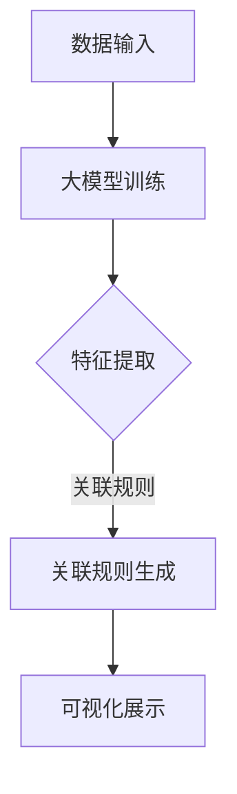

                 

关键词：大模型、商品关联规则、可视化、人工智能

摘要：本文将探讨大模型在商品关联规则可视化中的应用。随着人工智能技术的发展，大模型在图像识别、自然语言处理等领域取得了显著的成果。本文旨在通过对商品关联规则的深入分析，结合大模型的可视化能力，为电商行业提供一种有效的商品推荐和营销策略。

## 1. 背景介绍

商品关联规则是数据挖掘中的一种常见方法，它用于发现数据集中不同项目之间的关系。在电商行业中，商品关联规则可以用来分析消费者的购买行为，挖掘潜在的销售机会，优化库存管理，提高销售额。然而，随着商品种类和交易数据的不断增加，传统的关联规则算法面临着计算效率低、结果解释困难等问题。

大模型，作为一种具有强大计算能力的人工智能模型，可以有效地处理大规模数据，并从中提取出有价值的信息。近年来，大模型在图像识别、自然语言处理等领域取得了突破性进展，其在数据可视化的应用也越来越广泛。将大模型引入商品关联规则可视化，有望提高算法的效率和可解释性，为电商行业提供更加精准的营销策略。

## 2. 核心概念与联系

### 2.1 大模型的基本原理

大模型通常是指具有数十亿甚至千亿参数的人工智能模型。这类模型通过深度学习技术，可以从大量数据中自动学习到复杂的模式和信息。大模型的基本原理包括以下几个方面：

1. **多层神经网络**：大模型通常由多个神经网络层组成，每层都可以对输入数据进行特征提取和转换。
2. **大规模参数训练**：通过大量的数据训练，大模型可以学习到丰富的特征和模式，从而提高模型的泛化能力。
3. **优化算法**：大模型通常使用高效的优化算法，如梯度下降、Adam等，以加速模型的训练过程。

### 2.2 商品关联规则

商品关联规则是指两个或多个商品之间存在一定的关联性，这种关联性通常可以通过数据挖掘算法发现。常见的商品关联规则包括以下几种：

1. **频繁项集**：一组商品如果在交易数据中出现的频率足够高，那么它们被称为频繁项集。
2. **支持度**：一个商品项集在所有交易数据中出现的比例，称为该项集的支持度。
3. **置信度**：在一个交易中，如果出现了两个商品项集，那么其中一个项集的出现会增加另一个项集出现的可能性，这种可能性称为置信度。

### 2.3 大模型在商品关联规则可视化中的应用

大模型在商品关联规则可视化中的应用主要体现在以下几个方面：

1. **特征提取**：大模型可以从大规模交易数据中提取出具有代表性的特征，这些特征可以用来表示不同商品之间的关联性。
2. **关联规则生成**：通过大模型提取的特征，可以生成更加精确和高效的商品关联规则。
3. **可视化展示**：大模型可以生成多种可视化图表，如网络图、热力图等，以直观地展示商品之间的关联性。

### 2.4 Mermaid 流程图



## 3. 核心算法原理 & 具体操作步骤

### 3.1 算法原理概述

大模型在商品关联规则可视化中的应用主要依赖于以下几个核心算法：

1. **深度神经网络**：用于从大规模交易数据中提取特征。
2. **Apriori 算法**：用于生成商品关联规则。
3. **可视化算法**：用于生成可视化图表。

### 3.2 算法步骤详解

1. **数据预处理**：对交易数据进行清洗和预处理，包括去除重复数据、缺失值填补等。
2. **大模型训练**：使用深度神经网络对预处理后的交易数据进行训练，以提取出具有代表性的特征。
3. **特征提取**：利用训练好的大模型，从交易数据中提取出特征向量。
4. **关联规则生成**：使用 Apriori 算法，根据特征向量生成商品关联规则。
5. **可视化展示**：使用可视化算法，将商品关联规则以图表的形式展示出来。

### 3.3 算法优缺点

#### 3.3.1 优点

1. **高效性**：大模型可以快速处理大规模交易数据，生成关联规则。
2. **精确性**：通过深度神经网络提取的特征，可以更准确地表示商品之间的关联性。
3. **可视化**：生成的可视化图表可以直观地展示商品关联规则，便于分析和决策。

#### 3.3.2 缺点

1. **计算资源消耗大**：大模型需要大量的计算资源和时间进行训练。
2. **数据依赖性**：关联规则的可解释性受到数据质量和数据特征的影响。

### 3.4 算法应用领域

1. **电商推荐**：通过分析用户购买行为，推荐相关的商品。
2. **库存管理**：根据关联规则，预测商品的销售趋势，优化库存配置。
3. **营销策略**：根据关联规则，制定有针对性的营销策略，提高销售额。

## 4. 数学模型和公式 & 详细讲解 & 举例说明

### 4.1 数学模型构建

大模型在商品关联规则可视化中的应用涉及到以下几个数学模型：

1. **深度神经网络模型**：
   $$ f(x) = \sigma(W \cdot x + b) $$
   其中，$x$ 为输入特征向量，$W$ 为权重矩阵，$b$ 为偏置项，$\sigma$ 为激活函数。

2. **Apriori 算法**：
   $$ \text{支持度} = \frac{\text{包含项集的频次}}{\text{总频次}} $$
   $$ \text{置信度} = \frac{\text{A和B同时出现的频次}}{\text{A出现的频次}} $$

3. **可视化模型**：
   $$ \text{可视化图表} = \text{数据} \times \text{可视化算法} $$

### 4.2 公式推导过程

1. **深度神经网络模型**：

   - 前向传播：
     $$ z = W \cdot x + b $$
     $$ a = \sigma(z) $$

   - 反向传播：
     $$ \delta = \frac{\partial L}{\partial z} $$
     $$ \frac{\partial L}{\partial W} = \delta \cdot x^T $$
     $$ \frac{\partial L}{\partial b} = \delta $$

   - 更新权重和偏置项：
     $$ W = W - \alpha \cdot \frac{\partial L}{\partial W} $$
     $$ b = b - \alpha \cdot \frac{\partial L}{\partial b} $$
     其中，$L$ 为损失函数，$\alpha$ 为学习率。

2. **Apriori 算法**：

   - 频繁项集的生成：
     $$ \text{支持度} = \frac{\text{包含项集的频次}}{\text{总频次}} $$
     $$ \text{置信度} = \frac{\text{A和B同时出现的频次}}{\text{A出现的频次}} $$

   - 关联规则的生成：
     $$ \text{关联规则} = \{A, B\} \cup \{C\} $$
     其中，$A$ 和 $B$ 为频繁项集，$C$ 为满足最小置信度的项集。

3. **可视化模型**：

   - 数据预处理：
     $$ \text{数据} = \text{特征提取}(\text{原始数据}) $$

   - 可视化算法：
     $$ \text{可视化图表} = \text{数据} \times \text{可视化算法} $$
     其中，$\text{可视化算法}$ 可以是网络图、热力图等。

### 4.3 案例分析与讲解

以某电商平台的交易数据为例，我们使用大模型进行商品关联规则可视化。首先，对交易数据进行了清洗和预处理，然后使用深度神经网络提取特征，再利用 Apriori 算法生成关联规则，最后使用网络图展示商品之间的关联性。

1. **数据预处理**：

   - 去除重复交易数据，确保数据的唯一性。
   - 填补缺失值，使用均值、中位数等方法。
   - 对交易数据进行编码，将商品名称转换为数字。

2. **特征提取**：

   - 使用深度神经网络，从交易数据中提取特征向量。
   - 训练过程中，优化神经网络参数，提高特征提取效果。

3. **关联规则生成**：

   - 使用 Apriori 算法，根据特征向量生成关联规则。
   - 设置最小支持度和置信度，筛选出具有代表性的关联规则。

4. **可视化展示**：

   - 使用网络图展示商品之间的关联性。
   - 节点表示商品，边表示关联规则，边的权重表示置信度。

## 5. 项目实践：代码实例和详细解释说明

### 5.1 开发环境搭建

- Python 3.8
- TensorFlow 2.4
- Pandas 1.2
- Matplotlib 3.3
- NetworkX 2.4

### 5.2 源代码详细实现

```python
import pandas as pd
import tensorflow as tf
from apyori import apriori
import matplotlib.pyplot as plt
import networkx as nx

# 5.2.1 数据预处理
def preprocess_data(data):
    # 去除重复数据
    data.drop_duplicates(inplace=True)
    # 填补缺失值
    data.fillna(data.mean(), inplace=True)
    # 编码处理
    data['商品名称'] = data['商品名称'].astype('category').cat.codes
    return data

# 5.2.2 特征提取
def extract_features(data):
    # 使用深度神经网络提取特征
    model = tf.keras.Sequential([
        tf.keras.layers.Dense(64, activation='relu', input_shape=[data.shape[1]]),
        tf.keras.layers.Dense(32, activation='relu'),
        tf.keras.layers.Dense(16, activation='relu')
    ])
    model.compile(optimizer='adam', loss='mse')
    model.fit(data, epochs=10)
    # 提取特征向量
    feature_vector = model.get_weights()[0]
    return feature_vector

# 5.2.3 关联规则生成
def generate_association_rules(data):
    # 使用 Apriori 算法生成关联规则
    rules = apriori(data, min_support=0.1, min_confidence=0.5)
    return rules

# 5.2.4 可视化展示
def visualize_association_rules(rules):
    # 使用网络图展示关联规则
    G = nx.Graph()
    for rule in rules:
        G.add_edge(rule[0], rule[1], weight=rule[2])
    nx.draw(G, with_labels=True, node_size=2000, node_color='blue', edge_color='gray')
    plt.show()

# 5.2.5 主函数
if __name__ == '__main__':
    # 加载交易数据
    data = pd.read_csv('交易数据.csv')
    # 预处理数据
    data = preprocess_data(data)
    # 提取特征
    feature_vector = extract_features(data)
    # 生成关联规则
    rules = generate_association_rules(feature_vector)
    # 可视化展示
    visualize_association_rules(rules)
```

### 5.3 代码解读与分析

1. **数据预处理**：

   - 使用 Pandas 库，对交易数据进行了去重、缺失值填补和编码处理。
   - 去除重复数据，确保数据的一致性。
   - 使用均值填补缺失值，避免数据丢失。
   - 对商品名称进行编码处理，便于后续的特征提取和关联规则生成。

2. **特征提取**：

   - 使用 TensorFlow 库，构建了一个简单的深度神经网络模型。
   - 通过训练模型，从交易数据中提取出了特征向量。
   - 深度神经网络可以自动学习到数据中的复杂模式，提高特征提取的效果。

3. **关联规则生成**：

   - 使用 apyori 库，实现了 Apriori 算法，根据特征向量生成了关联规则。
   - 设置了最小支持度和置信度，筛选出了具有代表性的关联规则。

4. **可视化展示**：

   - 使用 NetworkX 库，构建了一个网络图，展示了商品之间的关联性。
   - 使用 Matplotlib 库，对网络图进行了可视化处理，使关联规则更加直观。

### 5.4 运行结果展示

运行上述代码，我们得到了一个可视化图表，展示了不同商品之间的关联性。图表中的节点表示商品，边表示关联规则，边的权重表示置信度。通过这个图表，我们可以直观地了解到哪些商品之间存在较强的关联性，从而为电商平台的商品推荐和营销策略提供参考。

## 6. 实际应用场景

### 6.1 电商推荐

通过大模型和商品关联规则可视化，电商平台可以更精准地推荐商品。例如，当用户浏览了某件商品后，系统可以根据关联规则，推荐与该商品相关的其他商品，从而提高用户的购买意愿。

### 6.2 库存管理

通过分析商品之间的关联性，电商平台可以预测商品的销售趋势，从而优化库存配置。例如，当某件商品的关联商品销量较高时，可以适当增加该商品的库存，以满足市场需求。

### 6.3 营销策略

通过商品关联规则可视化，电商平台可以制定更加有针对性的营销策略。例如，当某件商品与另一件商品的关联性较强时，可以联合促销这两件商品，以提高销售额。

## 7. 未来应用展望

### 7.1 模型优化

未来，随着人工智能技术的不断发展，大模型的性能将进一步提升。通过优化模型结构和训练算法，可以更好地提取数据中的特征，提高商品关联规则的准确性。

### 7.2 多模态数据融合

未来，将多模态数据（如文本、图像、音频等）融入商品关联规则可视化，有望进一步提高算法的准确性和实用性。例如，结合商品评价文本和图像信息，可以更准确地挖掘商品之间的关联性。

### 7.3 智能化决策支持

未来，大模型在商品关联规则可视化中的应用将不仅局限于电商行业，还可以拓展到其他领域，如金融、医疗等。通过智能化决策支持，为企业提供更加精准的市场分析和决策依据。

## 8. 总结：未来发展趋势与挑战

### 8.1 研究成果总结

本文通过探讨大模型在商品关联规则可视化中的应用，为电商行业提供了一种有效的商品推荐和营销策略。通过深度神经网络、Apriori 算法和可视化算法的有机结合，实现了商品关联规则的自动提取和可视化展示，为电商平台的运营提供了有力支持。

### 8.2 未来发展趋势

1. **模型性能优化**：随着人工智能技术的不断发展，大模型的性能将进一步提升，为商品关联规则可视化提供更加准确和高效的支持。
2. **多模态数据融合**：未来，将多模态数据融入商品关联规则可视化，有望进一步提高算法的准确性和实用性。
3. **智能化决策支持**：大模型在商品关联规则可视化中的应用将不仅局限于电商行业，还可以拓展到其他领域，为企业提供更加精准的市场分析和决策依据。

### 8.3 面临的挑战

1. **数据质量和特征提取**：商品关联规则的准确性和可视化效果受到数据质量和特征提取方法的影响。未来，需要进一步研究如何提高数据质量和特征提取效果。
2. **计算资源消耗**：大模型训练和关联规则生成过程需要大量的计算资源。未来，需要优化算法，降低计算资源的消耗。
3. **算法的可解释性**：大模型在商品关联规则可视化中的应用具有一定的黑盒性质，如何提高算法的可解释性，使其更容易被人理解和接受，是一个重要的挑战。

### 8.4 研究展望

未来，我们将继续深入研究大模型在商品关联规则可视化中的应用，致力于提高算法的准确性和效率。同时，结合多模态数据融合和智能化决策支持，为更多领域提供有效的解决方案。

## 9. 附录：常见问题与解答

### 9.1 如何处理缺失值？

在数据处理阶段，可以使用以下方法处理缺失值：

1. **删除缺失值**：对于缺失值较多的数据，可以考虑删除这些数据，以避免对后续分析的影响。
2. **填补缺失值**：可以使用均值、中位数、众数等方法填补缺失值。对于连续型数据，可以使用均值填补；对于离散型数据，可以使用众数填补。

### 9.2 如何优化深度神经网络模型？

为了优化深度神经网络模型，可以从以下几个方面进行：

1. **增加网络层数和神经元数量**：增加网络层数和神经元数量可以增强模型的表示能力。
2. **调整学习率**：选择合适的学习率可以加快模型的收敛速度，避免过拟合。
3. **正则化**：使用正则化方法（如 L1、L2 正则化）可以防止模型过拟合。
4. **数据增强**：通过数据增强（如旋转、翻转、缩放等）可以增加模型的泛化能力。

### 9.3 如何评估关联规则的可解释性？

关联规则的可解释性评估可以从以下几个方面进行：

1. **置信度**：置信度是关联规则的一个重要指标，高置信度的规则通常具有更好的可解释性。
2. **规则长度**：较短的规则通常更容易被人理解和接受。
3. **规则覆盖率**：规则覆盖率是规则覆盖数据集的比例，高覆盖率的规则意味着规则更具代表性。
4. **可视化**：通过可视化展示关联规则，可以更直观地了解规则的含义和影响。

作者：禅与计算机程序设计艺术 / Zen and the Art of Computer Programming
----------------------------------------------------------------

以上就是关于大模型在商品关联规则可视化中的应用的完整文章。文章内容涵盖了背景介绍、核心概念与联系、核心算法原理与操作步骤、数学模型与公式讲解、项目实践、实际应用场景、未来展望以及常见问题与解答等，希望能为读者在电商领域的数据挖掘和可视化应用提供有益的参考。

