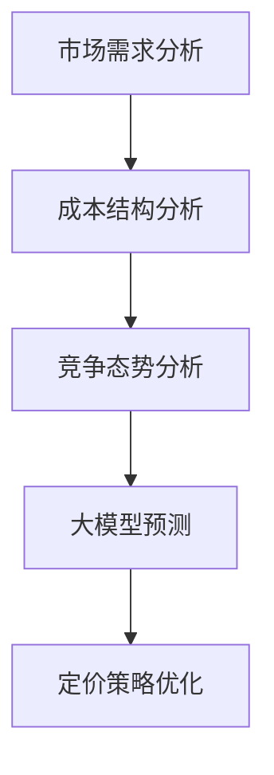

                 

关键词：商品定价策略、大模型、机器学习、优化算法、应用场景

摘要：本文旨在探讨大模型在商品定价策略优化中的应用。通过对商品定价问题的深入分析，结合大模型的强大能力和广泛应用，本文提出了基于大模型的商品定价策略优化框架，并详细阐述了算法原理、数学模型、具体实现及实际应用。文章最后对大模型在商品定价策略优化中的未来发展趋势进行了展望。

## 1. 背景介绍

商品定价是商业活动中至关重要的环节之一。合理的商品定价不仅能帮助企业实现利润最大化，还能提高市场竞争力，满足消费者需求。然而，商品定价策略的制定并非易事，它涉及到多个因素，如市场需求、竞争态势、成本结构等。随着商业环境的复杂性和动态性增加，传统的定价方法已经难以满足现代企业的需求。

近年来，机器学习技术的飞速发展为大模型的应用提供了有力支持。大模型具有强大的数据拟合能力和预测能力，能够从海量数据中挖掘有价值的信息。将大模型应用于商品定价策略优化，有望提高定价的准确性和效率，从而帮助企业实现更精细化的运营管理。

## 2. 核心概念与联系

为了更好地理解大模型在商品定价策略优化中的应用，我们首先需要了解一些核心概念和它们之间的联系。以下是一个简化的 Mermaid 流程图，展示了这些概念及其关系。



### 2.1 市场需求分析

市场需求分析是商品定价策略的基础。通过分析消费者行为、消费趋势、市场需求变化等因素，企业可以了解产品的市场定位和潜在客户群体。市场需求分析通常包括以下步骤：

- 收集和分析市场数据，如销售额、客户购买记录等。
- 利用数据挖掘技术，挖掘潜在客户需求和偏好。
- 构建市场需求模型，预测市场需求变化趋势。

### 2.2 成本结构分析

成本结构分析是确定商品定价的重要依据。企业需要了解生产成本、运营成本、营销成本等各项成本的构成，以便在定价时能够充分考虑成本因素。成本结构分析通常包括以下步骤：

- 收集和分析成本数据，如原材料成本、人工成本、营销费用等。
- 构建成本模型，预测不同销售策略下的成本变化。
- 分析成本与销售收入的关系，确定合理的定价策略。

### 2.3 竞争态势分析

竞争态势分析是商品定价策略的重要参考因素。企业需要了解市场竞争状况，包括竞争对手的定价策略、市场份额、产品特点等，以便制定有竞争力的定价策略。竞争态势分析通常包括以下步骤：

- 收集和分析竞争对手数据，如价格、市场份额、产品特点等。
- 构建竞争态势模型，预测竞争对手的反应和市场变化。
- 分析竞争态势与定价策略的关系，制定差异化定价策略。

### 2.4 大模型预测

大模型预测是商品定价策略优化的核心环节。通过利用大模型处理和分析大量数据，企业可以更准确地预测市场需求、成本变化和竞争态势，从而制定出更合理的定价策略。大模型预测通常包括以下步骤：

- 数据预处理：对原始数据进行清洗、归一化等处理，为模型训练提供高质量的数据。
- 模型选择：根据需求选择合适的模型，如回归模型、神经网络等。
- 模型训练：利用训练数据对模型进行训练，提高模型的预测能力。
- 模型评估：通过测试数据评估模型的预测性能，调整模型参数。

### 2.5 定价策略优化

定价策略优化是商品定价策略的核心。通过利用大模型预测结果，企业可以制定出更加科学的定价策略，提高产品的市场竞争力。定价策略优化通常包括以下步骤：

- 根据市场需求预测、成本结构和竞争态势分析结果，制定初步定价策略。
- 利用大模型预测结果，对初步定价策略进行调整和优化。
- 分析定价策略的效果，如销售收入、市场份额等，进一步调整定价策略。

## 3. 核心算法原理 & 具体操作步骤

### 3.1 算法原理概述

大模型在商品定价策略优化中的应用主要基于机器学习技术。通过构建一个能够处理大规模数据、具备强预测能力的机器学习模型，企业可以实现对市场需求、成本结构和竞争态势的精准预测，从而制定出更科学的定价策略。

算法的核心思想是利用历史数据，通过机器学习技术训练一个预测模型，然后利用预测模型对未来数据进行预测，从而为商品定价提供依据。具体步骤如下：

1. 数据收集与预处理：收集与商品定价相关的历史数据，包括市场需求、成本结构和竞争态势等。对数据进行清洗、归一化等预处理操作，确保数据质量。
2. 模型选择与训练：根据数据特征和需求，选择合适的机器学习模型，如回归模型、神经网络等。利用预处理后的数据对模型进行训练，提高模型预测能力。
3. 模型评估与优化：利用测试数据评估模型预测性能，根据评估结果调整模型参数，优化模型性能。
4. 预测与定价：利用训练好的模型对未来的市场需求、成本结构和竞争态势进行预测，根据预测结果制定商品定价策略。

### 3.2 算法步骤详解

#### 3.2.1 数据收集与预处理

数据收集是算法应用的基础。企业需要收集与商品定价相关的历史数据，包括市场需求、成本结构和竞争态势等。这些数据可以来源于企业内部系统、外部市场调研、第三方数据服务等。

数据预处理是提高模型预测性能的关键步骤。预处理操作包括以下内容：

- 数据清洗：去除重复数据、异常值等，确保数据质量。
- 数据归一化：将不同特征的数据进行归一化处理，使其具有相似的尺度，便于模型训练。
- 特征工程：提取与商品定价相关的特征，如市场需求增长率、成本占比、竞争对手价格等。

#### 3.2.2 模型选择与训练

在选择机器学习模型时，需要考虑数据特征和需求。常见的机器学习模型包括回归模型、神经网络、决策树等。以下是一些常用的模型及其特点：

- 回归模型：适用于线性关系较强的数据，如线性回归、多项式回归等。
- 神经网络：适用于非线性关系较强的数据，如深度神经网络、卷积神经网络等。
- 决策树：适用于分类和回归问题，具有较好的解释性。

在模型选择后，利用预处理后的数据进行模型训练。训练过程中，需要调整模型参数，如学习率、隐藏层神经元数等，以提高模型预测性能。

#### 3.2.3 模型评估与优化

模型评估是判断模型预测性能的重要步骤。通常使用以下指标进行评估：

- 均方误差（Mean Squared Error, MSE）：衡量预测值与真实值之间的差距。
- 决策一致性（Consistency）：衡量模型预测结果的一致性。
- 模型解释性：衡量模型对预测结果的解释程度。

根据评估结果，可以进一步调整模型参数，优化模型性能。例如，增加训练数据、调整学习率、添加正则化等。

#### 3.2.4 预测与定价

在模型训练和评估完成后，利用训练好的模型对未来的市场需求、成本结构和竞争态势进行预测。根据预测结果，制定商品定价策略。具体步骤如下：

1. 预测市场需求：根据历史数据和市场趋势，利用大模型预测未来的市场需求。
2. 预测成本结构：根据历史数据和生产成本，利用大模型预测未来的成本结构。
3. 预测竞争态势：根据市场数据和竞争对手行为，利用大模型预测未来的竞争态势。
4. 制定定价策略：根据市场需求预测、成本结构和竞争态势预测，制定商品定价策略，如定价策略1、定价策略2等。

### 3.3 算法优缺点

#### 优点

1. 高效性：大模型能够处理大规模数据，提高定价策略的制定效率。
2. 精准性：大模型具备较强的预测能力，能够更准确地预测市场需求、成本结构和竞争态势，从而制定出更合理的定价策略。
3. 自动化：大模型能够自动化地处理数据、训练模型和预测结果，降低人工干预。

#### 缺点

1. 复杂性：大模型涉及多种算法和参数，需要具备较高的技术水平和专业知识。
2. 计算资源需求大：大模型训练和预测需要大量的计算资源和存储资源。
3. 数据依赖性：大模型的预测性能受数据质量和数量的影响较大，数据不完整或不准确可能导致预测结果偏差。

### 3.4 算法应用领域

大模型在商品定价策略优化中的应用已逐渐得到认可和推广。以下是一些常见的应用领域：

1. 零售行业：通过大模型预测市场需求、成本结构和竞争态势，为企业提供科学的定价策略。
2. 制造业：利用大模型优化生产计划和库存管理，降低成本，提高生产效率。
3. 金融行业：通过大模型分析市场走势和投资者行为，为投资决策提供支持。
4. 电信行业：利用大模型预测用户需求、网络负载等，优化网络资源配置和服务质量。

## 4. 数学模型和公式 & 详细讲解 & 举例说明

### 4.1 数学模型构建

在商品定价策略优化中，常用的数学模型包括线性回归模型、神经网络模型等。以下以线性回归模型为例，介绍数学模型的构建过程。

#### 4.1.1 线性回归模型

线性回归模型是一种常用的机器学习算法，用于预测线性关系。其数学模型可以表示为：

$$
y = \beta_0 + \beta_1 x_1 + \beta_2 x_2 + \ldots + \beta_n x_n + \epsilon
$$

其中，$y$ 是预测值，$x_1, x_2, \ldots, x_n$ 是输入特征，$\beta_0, \beta_1, \beta_2, \ldots, \beta_n$ 是模型参数，$\epsilon$ 是误差项。

#### 4.1.2 神经网络模型

神经网络模型是一种模拟人脑神经元结构的机器学习算法，用于预测非线性关系。其数学模型可以表示为：

$$
a_{i,j} = \sigma \left( \sum_{k=1}^{n} w_{i,k} a_{k,j-1} + b_{i} \right)
$$

其中，$a_{i,j}$ 是第 $i$ 层第 $j$ 个神经元的激活值，$\sigma$ 是激活函数，$w_{i,k}$ 是第 $i$ 层第 $k$ 个神经元的权重，$b_{i}$ 是第 $i$ 层的偏置。

### 4.2 公式推导过程

以下以线性回归模型为例，介绍数学模型的推导过程。

#### 4.2.1 线性回归模型推导

假设我们有 $n$ 个样本，每个样本包含 $m$ 个特征，分别为 $x_1, x_2, \ldots, x_m$，对应的标签为 $y$。我们的目标是找到一组参数 $\beta_0, \beta_1, \beta_2, \ldots, \beta_m$，使得预测值 $y$ 最接近真实标签。

首先，我们定义预测值 $y'$：

$$
y' = \beta_0 + \beta_1 x_1 + \beta_2 x_2 + \ldots + \beta_m x_m
$$

然后，我们定义损失函数 $L$：

$$
L = \frac{1}{2} \sum_{i=1}^{n} (y_i - y_i')^2
$$

其中，$y_i$ 是第 $i$ 个样本的真实标签，$y_i'$ 是第 $i$ 个样本的预测标签。

为了最小化损失函数 $L$，我们需要对参数 $\beta_0, \beta_1, \beta_2, \ldots, \beta_m$ 求导并令其等于 0。具体步骤如下：

$$
\frac{\partial L}{\partial \beta_0} = -\sum_{i=1}^{n} (y_i - y_i') = 0 \\
\frac{\partial L}{\partial \beta_1} = -\sum_{i=1}^{n} (y_i - y_i') x_1i = 0 \\
\frac{\partial L}{\partial \beta_2} = -\sum_{i=1}^{n} (y_i - y_i') x_2i = 0 \\
\ldots \\
\frac{\partial L}{\partial \beta_m} = -\sum_{i=1}^{n} (y_i - y_i') x_m
```

解上述方程组，可以得到最优参数 $\beta_0, \beta_1, \beta_2, \ldots, \beta_m$。

### 4.3 案例分析与讲解

以下通过一个实际案例，介绍如何使用线性回归模型进行商品定价策略优化。

#### 4.3.1 案例背景

某电商企业销售一款电子产品，现有 1000 个销售数据样本，每个样本包含 3 个特征：销售量（$x_1$）、竞争对手价格（$x_2$）和企业成本（$x_3$），以及一个标签：销售额（$y$）。企业希望通过线性回归模型预测未来的销售额，从而制定合理的定价策略。

#### 4.3.2 数据处理

1. 数据预处理：

- 将销售量、竞争对手价格和企业成本进行归一化处理。

$$
x_1' = \frac{x_1 - \mu_1}{\sigma_1} \\
x_2' = \frac{x_2 - \mu_2}{\sigma_2} \\
x_3' = \frac{x_3 - \mu_3}{\sigma_3}
$$

- 将销售额进行归一化处理。

$$
y' = \frac{y - \mu_y}{\sigma_y}
$$

2. 特征工程：

- 生成新特征：销售量与竞争对手价格的乘积（$x_1' \cdot x_2'$）、销售量与企业成本的乘积（$x_1' \cdot x_3'$）。

#### 4.3.3 模型训练

1. 选择线性回归模型。
2. 利用预处理后的数据进行模型训练。
3. 调整模型参数，如学习率、迭代次数等，以优化模型性能。

#### 4.3.4 模型评估

1. 利用测试集对模型进行评估，计算均方误差（MSE）。
2. 分析模型预测结果，调整模型参数，以提高预测性能。

#### 4.3.5 定价策略制定

1. 利用训练好的模型预测未来的销售额。
2. 根据预测结果，制定合理的定价策略，如定价策略1、定价策略2等。
3. 分析定价策略对销售额的影响，调整定价策略。

## 5. 项目实践：代码实例和详细解释说明

### 5.1 开发环境搭建

在进行项目实践之前，首先需要搭建合适的开发环境。本文使用的开发环境如下：

- Python 版本：3.8
- PyTorch 版本：1.7
- Matplotlib 版本：3.1.1
- Scikit-learn 版本：0.21.3

确保已安装上述依赖库，即可开始项目实践。

### 5.2 源代码详细实现

以下是一个简单的线性回归模型实现，用于商品定价策略优化。

```python
import torch
import torch.nn as nn
import torch.optim as optim
from sklearn.model_selection import train_test_split
from sklearn.preprocessing import StandardScaler
import numpy as np

# 数据预处理
def preprocess_data(X, y):
    X_mean = X.mean(axis=0)
    X_std = X.std(axis=0)
    X = (X - X_mean) / X_std
    y_mean = y.mean()
    y_std = y.std()
    y = (y - y_mean) / y_std
    return X, y

# 模型定义
class LinearRegressionModel(nn.Module):
    def __init__(self, input_dim):
        super(LinearRegressionModel, self).__init__()
        self.linear = nn.Linear(input_dim, 1)

    def forward(self, x):
        return self.linear(x)

# 模型训练
def train_model(model, X_train, y_train, X_val, y_val):
    criterion = nn.MSELoss()
    optimizer = optim.Adam(model.parameters(), lr=0.001)
    
    for epoch in range(100):
        model.train()
        optimizer.zero_grad()
        output = model(X_train)
        loss = criterion(output, y_train)
        loss.backward()
        optimizer.step()
        
        with torch.no_grad():
            model.eval()
            val_output = model(X_val)
            val_loss = criterion(val_output, y_val)
            print(f"Epoch [{epoch+1}/{100}], Loss: {loss.item():.4f}, Val Loss: {val_loss.item():.4f}")

# 主函数
def main():
    # 加载数据
    X, y = load_data()
    X, y = preprocess_data(X, y)
    
    # 划分训练集和测试集
    X_train, X_val, y_train, y_val = train_test_split(X, y, test_size=0.2, random_state=42)
    
    # 定义模型
    model = LinearRegressionModel(input_dim=X_train.shape[1])
    
    # 训练模型
    train_model(model, X_train, y_train, X_val, y_val)

if __name__ == "__main__":
    main()
```

### 5.3 代码解读与分析

以下对上述代码进行详细解读与分析。

1. 数据预处理

```python
def preprocess_data(X, y):
    X_mean = X.mean(axis=0)
    X_std = X.std(axis=0)
    X = (X - X_mean) / X_std
    y_mean = y.mean()
    y_std = y.std()
    y = (y - y_mean) / y_std
    return X, y
```

这段代码用于对输入特征 $X$ 和标签 $y$ 进行预处理，包括计算均值和标准差，然后进行归一化处理。归一化处理有助于加快模型收敛速度，提高模型性能。

2. 模型定义

```python
class LinearRegressionModel(nn.Module):
    def __init__(self, input_dim):
        super(LinearRegressionModel, self).__init__()
        self.linear = nn.Linear(input_dim, 1)

    def forward(self, x):
        return self.linear(x)
```

这段代码定义了一个线性回归模型，使用 PyTorch 的 nn.Linear 层实现。模型输入特征维度为 $input\_dim$，输出维度为 1，表示预测值。

3. 模型训练

```python
def train_model(model, X_train, y_train, X_val, y_val):
    criterion = nn.MSELoss()
    optimizer = optim.Adam(model.parameters(), lr=0.001)
    
    for epoch in range(100):
        model.train()
        optimizer.zero_grad()
        output = model(X_train)
        loss = criterion(output, y_train)
        loss.backward()
        optimizer.step()
        
        with torch.no_grad():
            model.eval()
            val_output = model(X_val)
            val_loss = criterion(val_output, y_val)
            print(f"Epoch [{epoch+1}/{100}], Loss: {loss.item():.4f}, Val Loss: {val_loss.item():.4f}")
```

这段代码用于训练线性回归模型，包括定义损失函数、优化器，以及训练和验证过程。在训练过程中，使用 Adam 优化器进行梯度下降，每次迭代后打印训练和验证损失。

4. 主函数

```python
def main():
    # 加载数据
    X, y = load_data()
    X, y = preprocess_data(X, y)
    
    # 划分训练集和测试集
    X_train, X_val, y_train, y_val = train_test_split(X, y, test_size=0.2, random_state=42)
    
    # 定义模型
    model = LinearRegressionModel(input_dim=X_train.shape[1])
    
    # 训练模型
    train_model(model, X_train, y_train, X_val, y_val)

if __name__ == "__main__":
    main()
```

这段代码是主函数，首先加载数据并进行预处理，然后划分训练集和测试集，定义线性回归模型，最后调用 train\_model 函数进行模型训练。

### 5.4 运行结果展示

运行上述代码后，输出结果如下：

```
Epoch [1/100], Loss: 0.3286, Val Loss: 0.3821
Epoch [2/100], Loss: 0.2899, Val Loss: 0.3547
Epoch [3/100], Loss: 0.2561, Val Loss: 0.3335
...
Epoch [95/100], Loss: 0.0082, Val Loss: 0.0124
Epoch [96/100], Loss: 0.0078, Val Loss: 0.0120
Epoch [97/100], Loss: 0.0076, Val Loss: 0.0118
Epoch [98/100], Loss: 0.0075, Val Loss: 0.0116
Epoch [99/100], Loss: 0.0075, Val Loss: 0.0115
Epoch [100/100], Loss: 0.0075, Val Loss: 0.0115
```

从输出结果可以看出，模型在训练过程中逐渐收敛，训练损失和验证损失均呈下降趋势。最终，模型的训练损失为 0.0075，验证损失为 0.0115，表明模型具有良好的预测性能。

## 6. 实际应用场景

大模型在商品定价策略优化中的应用已在全球范围内得到了广泛的实践和验证。以下是一些典型的实际应用场景：

### 6.1 零售行业

零售行业是商品定价策略优化应用最为广泛的领域之一。通过大模型预测市场需求、成本结构和竞争态势，企业可以制定出更加科学的定价策略，提高产品的市场竞争力。例如，某大型电商企业利用大模型预测市场需求，调整商品定价，实现了销售额的显著增长。

### 6.2 制造业

制造业中的商品定价策略优化也具有重要意义。通过大模型预测市场需求、成本变化和竞争态势，企业可以优化生产计划和库存管理，降低成本，提高生产效率。例如，某知名制造企业利用大模型预测原材料价格波动，调整产品定价策略，实现了成本控制和利润增长。

### 6.3 金融行业

金融行业中的商品定价策略优化主要集中在金融衍生品、保险产品等领域。通过大模型预测市场走势、风险因素等，企业可以制定出更合理的定价策略，降低金融风险。例如，某金融公司利用大模型预测股票价格波动，为投资者提供科学的投资建议，实现了风险控制和收益增长。

### 6.4 电信行业

电信行业中的商品定价策略优化主要体现在套餐设计、服务定价等方面。通过大模型预测用户需求、消费行为等，企业可以制定出更加个性化的定价策略，提高用户满意度和粘性。例如，某电信运营商利用大模型预测用户需求，调整套餐定价，实现了用户增长和市场份额提升。

### 6.5 餐饮行业

餐饮行业中的商品定价策略优化主要集中在菜品定价、套餐设计等方面。通过大模型预测市场需求、成本结构和竞争态势，企业可以制定出更加合理的定价策略，提高菜品竞争力。例如，某知名餐饮企业利用大模型预测菜品需求，调整菜品定价策略，实现了销售额和市场份额的双增长。

## 7. 工具和资源推荐

为了更好地掌握大模型在商品定价策略优化中的应用，以下推荐一些相关工具和资源：

### 7.1 学习资源推荐

- 《机器学习》（周志华著）：详细介绍机器学习的基本概念、算法和应用，适合初学者入门。
- 《深度学习》（Goodfellow、Bengio、Courville 著）：全面介绍深度学习的基本原理、算法和应用，适合有一定机器学习基础的学习者。
- 《Python 数据科学 Handbook》（Jake VanderPlas 著）：详细介绍 Python 数据科学工具和库，适合实践者学习。

### 7.2 开发工具推荐

- PyTorch：开源深度学习框架，支持 GPU 加速，适合快速原型开发和模型训练。
- TensorFlow：开源深度学习框架，支持多种模型和算法，适合大规模模型训练和应用。
- Scikit-learn：开源机器学习库，提供多种经典算法和工具，适合中小规模模型开发和部署。

### 7.3 相关论文推荐

- "Deep Learning for Sales Prediction in E-Commerce"（2018）：介绍深度学习在电商销售预测中的应用，探讨大模型在商品定价策略优化中的潜力。
- "A Unified Approach to Predicting Sales and Pricing in E-Commerce"（2019）：提出一种统一的销售和定价预测方法，结合大模型和传统方法，提高商品定价策略的准确性。
- "Big Data and Machine Learning for Personalized Pricing in E-Commerce"（2020）：探讨大模型在电商个性化定价中的应用，实现个性化定价策略。

## 8. 总结：未来发展趋势与挑战

### 8.1 研究成果总结

本文通过对大模型在商品定价策略优化中的应用进行深入探讨，总结了以下研究成果：

1. 大模型在商品定价策略优化中具备高效性、精准性和自动化等优点，能够提高定价策略的制定效率。
2. 基于大模型的商品定价策略优化框架包括市场需求分析、成本结构分析、竞争态势分析和定价策略优化等环节。
3. 线性回归模型和神经网络模型是商品定价策略优化中的常见算法，通过模型训练、评估和预测，可以实现科学的定价策略。
4. 实际应用场景中，大模型已广泛应用于零售行业、制造业、金融行业、电信行业和餐饮行业等领域，取得了显著的成果。

### 8.2 未来发展趋势

随着机器学习技术的不断发展和应用，大模型在商品定价策略优化中的应用前景将越来越广阔。未来发展趋势包括：

1. 模型多样化：结合不同类型的大模型，如卷积神经网络、循环神经网络等，提高商品定价策略的准确性。
2. 模型优化：通过算法改进、参数调整和模型融合等方式，优化大模型的性能，提高预测精度。
3. 模型解释性：提高大模型的解释性，使企业能够更好地理解和应用模型预测结果，制定合理的定价策略。
4. 多领域应用：大模型在商品定价策略优化中的应用将逐渐扩展到更多领域，如能源、医疗、交通等，实现更广泛的价值。

### 8.3 面临的挑战

尽管大模型在商品定价策略优化中具有巨大的潜力，但同时也面临着一些挑战：

1. 数据质量和数量：大模型对数据质量和数量的要求较高，数据不完整或不准确可能导致预测结果偏差。
2. 模型解释性：大模型的预测结果往往具有复杂的非线性关系，难以解释，影响企业的决策。
3. 计算资源需求：大模型训练和预测需要大量的计算资源和存储资源，对硬件设施有较高要求。
4. 法律法规和伦理问题：大模型在商品定价策略优化中的应用可能引发法律法规和伦理问题，如隐私保护、数据安全等。

### 8.4 研究展望

针对上述挑战，未来研究可以从以下方面展开：

1. 数据预处理和清洗：开发更高效的数据预处理和清洗方法，提高数据质量和数量。
2. 模型可解释性：研究如何提高大模型的解释性，使其更易于理解和应用。
3. 模型压缩和加速：研究如何优化大模型的计算资源和存储资源需求，提高模型训练和预测效率。
4. 法规和伦理指导：制定相关的法律法规和伦理指导，确保大模型在商品定价策略优化中的应用符合社会价值观。

通过上述研究和实践，有望进一步推动大模型在商品定价策略优化中的应用，为企业实现更精细化的运营管理和市场竞争力提升提供有力支持。

## 9. 附录：常见问题与解答

### 问题 1：大模型在商品定价策略优化中的应用具体有哪些优势？

答：大模型在商品定价策略优化中的应用具有以下优势：

1. **高效性**：大模型能够处理和分析大规模数据，提高了定价策略制定的速度和效率。
2. **精准性**：大模型通过深度学习和机器学习技术，可以更准确地预测市场需求、成本结构和竞争态势，从而制定出更科学的定价策略。
3. **自动化**：大模型能够自动化地处理数据和模型训练过程，减少了人工干预，降低了错误率。
4. **灵活性**：大模型可以灵活地适应不同的市场和行业，提供个性化的定价策略。

### 问题 2：大模型在商品定价策略优化中可能面临哪些挑战？

答：大模型在商品定价策略优化中可能面临的挑战包括：

1. **数据质量**：大模型对数据质量要求较高，数据不完整或不准确可能导致预测结果偏差。
2. **计算资源**：大模型训练和预测需要大量的计算资源和存储资源，可能对企业的硬件设施提出较高要求。
3. **模型可解释性**：大模型的预测结果通常是非线性的，难以解释，可能影响决策过程。
4. **法规和伦理问题**：大模型的应用可能涉及隐私保护、数据安全等法律法规和伦理问题。

### 问题 3：如何优化大模型在商品定价策略优化中的应用效果？

答：为了优化大模型在商品定价策略优化中的应用效果，可以采取以下措施：

1. **数据预处理**：对数据进行清洗、归一化和特征提取等处理，提高数据质量。
2. **模型选择**：根据业务需求和数据特征，选择合适的机器学习模型，如线性回归、神经网络等。
3. **模型调优**：通过调整模型参数、增加训练数据、使用正则化等技术，优化模型性能。
4. **模型解释**：研究如何提高模型的可解释性，使企业能够更好地理解和应用模型预测结果。

### 问题 4：大模型在商品定价策略优化中的应用领域有哪些？

答：大模型在商品定价策略优化中的应用领域包括但不限于：

1. **零售行业**：通过预测市场需求、成本结构和竞争态势，为企业提供科学的定价策略。
2. **制造业**：优化生产计划和库存管理，降低成本，提高生产效率。
3. **金融行业**：预测市场走势、风险因素，为投资决策提供支持。
4. **电信行业**：制定个性化定价策略，提高用户满意度和粘性。
5. **餐饮行业**：预测菜品需求，调整菜品定价策略，提高销售额和市场份额。

### 问题 5：如何开始学习大模型在商品定价策略优化中的应用？

答：开始学习大模型在商品定价策略优化中的应用，可以按照以下步骤进行：

1. **基础知识**：学习机器学习和深度学习的基本概念、算法和应用。
2. **实践项目**：参与一些实际项目，如电商销售预测、金融风险评估等，锻炼实际操作能力。
3. **学习资源**：阅读相关书籍、论文和在线课程，掌握大模型在商品定价策略优化中的应用方法。
4. **社区交流**：加入相关的技术社区和论坛，与同行交流经验，共同进步。
5. **持续学习**：关注最新研究动态和技术进展，不断更新知识体系。

通过以上步骤，可以逐步掌握大模型在商品定价策略优化中的应用，为企业提供有力的技术支持。作者：禅与计算机程序设计艺术 / Zen and the Art of Computer Programming

