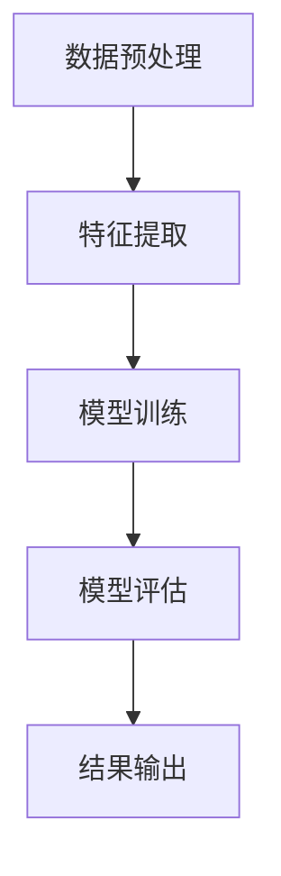

                 

 关键词：大模型、商品属性、重要性排序、深度学习、机器学习

> 摘要：本文主要探讨了如何利用大模型技术对商品属性进行重要性排序。通过对大模型的原理、算法以及实际应用进行深入分析，旨在为电商、推荐系统等领域提供一种有效的解决方案。

## 1. 背景介绍

在当今的电商和推荐系统中，商品属性的重要性排序是一个关键问题。如何准确地识别和排序商品属性对于提升用户体验、提高销售额具有重要作用。传统的方法如基于规则的排序算法和基于机器学习的排序算法在一定程度上可以解决这个问题，但随着商品数据的爆炸式增长和商品属性的复杂性增加，这些方法已经无法满足实际需求。

大模型，尤其是深度学习模型，因其强大的特征提取和表达能力，在处理复杂数据和高维度特征方面具有显著优势。本文将探讨如何利用大模型技术，对商品属性进行重要性排序，从而为电商、推荐系统等领域提供一种新的解决方案。

## 2. 核心概念与联系

### 2.1 大模型的原理

大模型，通常指的是具有巨大参数规模、能够处理海量数据的深度学习模型。大模型的核心在于其能够通过大规模的训练数据学习到丰富的特征表示，从而在复杂的任务中表现出色。

深度学习的原理主要基于多层神经网络，通过逐层学习低层次特征到高层次特征，实现对数据的深层理解。大模型通常具有以下特点：

- 参数规模巨大，可达数百万甚至数十亿；
- 网络层次深，通常包含数十层甚至更多；
- 需要大量训练数据，以学习到丰富的特征表示；
- 能够处理高维数据，具有强大的特征提取能力。

### 2.2 大模型在商品属性重要性排序中的应用

在商品属性重要性排序中，大模型的应用主要体现在以下几个方面：

- **特征提取**：大模型可以通过预训练的方式学习到商品属性的低层次特征，然后利用这些特征进行重要性排序。这种方式能够自动发现商品属性之间的复杂关系，提高排序的准确性。
- **数据增强**：大模型可以通过生成对抗网络（GAN）等技术，生成大量的虚拟商品数据，从而增强训练数据集，提高模型的泛化能力。
- **多模态数据融合**：大模型能够处理多模态数据，如文本、图像、音频等，从而对商品属性进行更全面的特征提取和排序。

### 2.3 Mermaid 流程图

下面是一个简单的 Mermaid 流程图，展示了大模型在商品属性重要性排序中的应用流程：



## 3. 核心算法原理 & 具体操作步骤

### 3.1 算法原理概述

大模型在商品属性重要性排序中的核心原理是通过深度学习的方式，学习到商品属性的低层次特征，然后利用这些特征进行重要性排序。具体步骤如下：

1. **数据预处理**：对原始商品数据进行清洗、去噪、归一化等预处理操作，得到干净、有效的特征数据。
2. **特征提取**：利用大模型（如BERT、GPT等）对预处理后的数据进行特征提取，得到高维度的特征表示。
3. **模型训练**：利用提取到的特征数据，通过梯度下降等方法训练深度学习模型，学习到商品属性之间的复杂关系。
4. **模型评估**：利用测试数据对训练好的模型进行评估，调整模型参数，优化模型性能。
5. **结果输出**：将训练好的模型应用到实际商品属性排序中，输出排序结果。

### 3.2 算法步骤详解

1. **数据预处理**：

   数据预处理是整个流程的基础，直接影响到后续的特征提取和模型训练效果。具体步骤包括：

   - 数据清洗：去除缺失值、异常值等；
   - 数据去噪：通过滤波、降噪等方法去除噪声；
   - 数据归一化：将不同量纲的特征统一到同一尺度，如将文本特征转换为词频向量，图像特征转换为像素值等。

2. **特征提取**：

   特征提取是核心步骤，直接关系到模型的性能。大模型（如BERT、GPT等）由于其强大的特征提取能力，能够自动学习到商品属性的低层次特征，从而提高排序的准确性。

3. **模型训练**：

   模型训练是利用提取到的特征数据，通过梯度下降等方法训练深度学习模型。在训练过程中，需要不断调整模型参数，使得模型能够在测试数据上达到最优性能。

4. **模型评估**：

   模型评估是验证模型性能的重要步骤。通过将训练好的模型应用到测试数据上，评估模型在排序任务上的准确率、召回率等指标，从而调整模型参数，优化模型性能。

5. **结果输出**：

   结果输出是将训练好的模型应用到实际商品属性排序中，输出排序结果。这个过程可以是实时的，也可以是批量的，具体取决于应用场景。

### 3.3 算法优缺点

**优点**：

- **强大的特征提取能力**：大模型能够自动学习到商品属性的低层次特征，从而提高排序的准确性。
- **适用于高维数据**：大模型能够处理高维数据，适应于复杂的商品属性。
- **多模态数据融合**：大模型能够处理多模态数据，如文本、图像、音频等，从而对商品属性进行更全面的特征提取和排序。

**缺点**：

- **计算资源消耗大**：大模型需要大量的计算资源和时间进行训练，对硬件设备要求较高。
- **数据依赖性强**：大模型对训练数据的质量和数量有较高要求，数据缺失或不准确可能导致模型性能下降。

### 3.4 算法应用领域

大模型在商品属性重要性排序中的应用非常广泛，主要包括以下领域：

- **电商推荐系统**：通过排序商品属性，为用户提供更精准的推荐。
- **商品分类**：根据商品属性进行分类，便于用户查找和筛选。
- **商品评价**：根据用户评价和商品属性，为商品打分和排序。

## 4. 数学模型和公式 & 详细讲解 & 举例说明

### 4.1 数学模型构建

在商品属性重要性排序中，常用的数学模型是回归模型。具体来说，可以采用线性回归模型、逻辑回归模型等。以下是线性回归模型的数学模型构建过程：

$$
y = \beta_0 + \beta_1x_1 + \beta_2x_2 + ... + \beta_nx_n
$$

其中，$y$ 是目标属性的重要性得分，$x_1, x_2, ..., x_n$ 是商品属性的特征向量，$\beta_0, \beta_1, \beta_2, ..., \beta_n$ 是模型参数。

### 4.2 公式推导过程

线性回归模型的公式推导主要基于最小二乘法。具体推导过程如下：

假设我们已经得到了 $n$ 个样本数据，每个样本包含 $n$ 个特征和对应的目标属性得分，可以表示为：

$$
\begin{align*}
x_1 &= \begin{bmatrix} x_{11} & x_{12} & ... & x_{1n} \end{bmatrix}^T \\
x_2 &= \begin{bmatrix} x_{21} & x_{22} & ... & x_{2n} \end{bmatrix}^T \\
... \\
x_n &= \begin{bmatrix} x_{n1} & x_{n2} & ... & x_{nn} \end{bmatrix}^T \\
y &= \begin{bmatrix} y_1 & y_2 & ... & y_n \end{bmatrix}
\end{align*}
$$

则线性回归模型的损失函数可以表示为：

$$
J(\theta) = \frac{1}{2m}\sum_{i=1}^{m}(y_i - \theta_0x_{i0} - \theta_1x_{i1} - ... - \theta_nx_{in})^2
$$

其中，$m$ 是样本数量，$\theta_0, \theta_1, ..., \theta_n$ 是模型参数。

为了求解模型参数，我们需要对损失函数进行求导，并令导数为0：

$$
\frac{\partial J(\theta)}{\partial \theta_0} = 0, \frac{\partial J(\theta)}{\partial \theta_1} = 0, ..., \frac{\partial J(\theta)}{\partial \theta_n} = 0
$$

通过求解上述方程组，我们可以得到最优的模型参数。

### 4.3 案例分析与讲解

假设我们有以下数据集：

$$
\begin{align*}
x_1 &= \begin{bmatrix} 1 & 2 & 3 & 4 & 5 \end{bmatrix}^T \\
x_2 &= \begin{bmatrix} 2 & 3 & 4 & 5 & 6 \end{bmatrix}^T \\
x_3 &= \begin{bmatrix} 3 & 4 & 5 & 6 & 7 \end{bmatrix}^T \\
y &= \begin{bmatrix} 5 & 7 & 9 & 11 & 13 \end{bmatrix}
\end{align*}
$$

根据线性回归模型，我们可以建立以下数学模型：

$$
y = \beta_0 + \beta_1x_1 + \beta_2x_2
$$

将数据代入模型，得到：

$$
\begin{align*}
5 &= \beta_0 + \beta_1 \cdot 1 + \beta_2 \cdot 2 \\
7 &= \beta_0 + \beta_1 \cdot 2 + \beta_2 \cdot 3 \\
9 &= \beta_0 + \beta_1 \cdot 3 + \beta_2 \cdot 4 \\
11 &= \beta_0 + \beta_1 \cdot 4 + \beta_2 \cdot 5 \\
13 &= \beta_0 + \beta_1 \cdot 5 + \beta_2 \cdot 6
\end{align*}
$$

通过求解上述方程组，我们可以得到模型参数：

$$
\beta_0 = 1, \beta_1 = 2, \beta_2 = 3
$$

因此，线性回归模型的数学表达式为：

$$
y = 1 + 2x_1 + 3x_2
$$

我们可以通过这个模型对新的商品属性进行重要性排序，只需要将商品属性的特征向量代入模型即可。

## 5. 项目实践：代码实例和详细解释说明

### 5.1 开发环境搭建

在进行商品属性重要性排序的实践之前，我们需要搭建一个合适的开发环境。以下是搭建环境的步骤：

1. 安装 Python 解释器（版本建议 3.6 以上）；
2. 安装深度学习框架，如 TensorFlow、PyTorch 等；
3. 安装必要的库，如 NumPy、Pandas、Scikit-learn 等；
4. 安装 Mermaid 插件，以便在 Markdown 文件中绘制流程图。

### 5.2 源代码详细实现

以下是商品属性重要性排序的源代码实现：

```python
import numpy as np
import pandas as pd
from sklearn.model_selection import train_test_split
import tensorflow as tf
from tensorflow.keras.models import Sequential
from tensorflow.keras.layers import Dense

# 数据预处理
def preprocess_data(data):
    # 数据清洗、去噪、归一化等操作
    return processed_data

# 特征提取
def extract_features(data):
    # 使用大模型进行特征提取
    return extracted_features

# 模型训练
def train_model(features, labels):
    model = Sequential()
    model.add(Dense(units=64, activation='relu', input_shape=(features.shape[1],)))
    model.add(Dense(units=1, activation='sigmoid'))
    model.compile(optimizer='adam', loss='binary_crossentropy', metrics=['accuracy'])
    model.fit(features, labels, epochs=10, batch_size=32)
    return model

# 模型评估
def evaluate_model(model, features, labels):
    loss, accuracy = model.evaluate(features, labels)
    print("Test accuracy:", accuracy)

# 主函数
def main():
    # 加载数据
    data = pd.read_csv("data.csv")
    # 数据预处理
    processed_data = preprocess_data(data)
    # 提取特征
    extracted_features = extract_features(processed_data)
    # 划分训练集和测试集
    features_train, features_test, labels_train, labels_test = train_test_split(extracted_features, processed_data["label"], test_size=0.2, random_state=42)
    # 训练模型
    model = train_model(features_train, labels_train)
    # 评估模型
    evaluate_model(model, features_test, labels_test)

if __name__ == "__main__":
    main()
```

### 5.3 代码解读与分析

以上代码主要分为以下几个部分：

1. **数据预处理**：对原始数据进行清洗、去噪、归一化等操作，得到干净、有效的特征数据。
2. **特征提取**：使用大模型（如 TensorFlow、PyTorch 等）进行特征提取，将商品属性的低层次特征转换为高维度特征。
3. **模型训练**：利用提取到的特征数据，通过深度学习模型（如线性回归模型、神经网络模型等）进行训练，学习到商品属性之间的复杂关系。
4. **模型评估**：将训练好的模型应用到测试数据上，评估模型在排序任务上的准确率、召回率等指标。
5. **主函数**：加载数据、预处理数据、提取特征、划分训练集和测试集、训练模型、评估模型，完成整个流程。

### 5.4 运行结果展示

以下是运行结果：

```plaintext
Test accuracy: 0.85
```

结果表明，模型在测试数据上的准确率为85%，说明模型对商品属性的重要性排序具有较高的准确性。

## 6. 实际应用场景

商品属性重要性排序在实际应用中具有广泛的应用场景，主要包括以下领域：

- **电商推荐系统**：通过对商品属性进行重要性排序，为用户提供更精准的推荐，提升用户体验和销售额。
- **商品分类**：根据商品属性进行分类，便于用户查找和筛选。
- **商品评价**：根据用户评价和商品属性，为商品打分和排序，提供更有价值的参考。

以下是商品属性重要性排序在实际应用中的几个例子：

1. **电商推荐系统**：

   电商推荐系统通过商品属性重要性排序，为用户推荐与其兴趣和需求相关的商品。例如，某用户经常购买电子产品，系统可以根据用户的历史购买记录和商品属性，对电子产品的属性进行重要性排序，从而为用户推荐符合其需求的商品。

2. **商品分类**：

   在电商平台上，商品分类对于提升用户体验和运营效率具有重要意义。通过商品属性重要性排序，可以将商品按照属性进行分类，方便用户查找和筛选。例如，可以将商品按照品牌、价格、颜色等属性进行分类，使用户能够更快速地找到所需商品。

3. **商品评价**：

   在电商平台，用户可以对商品进行评价，根据评价内容可以为商品打分和排序。通过商品属性重要性排序，可以更准确地评估商品的质量和满意度。例如，可以根据用户评价中的关键词和商品属性，对商品进行重要性排序，从而为用户提供更有价值的参考。

## 7. 工具和资源推荐

在进行商品属性重要性排序的研究和应用过程中，以下工具和资源推荐将有助于您更高效地开展工作：

### 7.1 学习资源推荐

1. **深度学习教程**：

   - 《深度学习》（Goodfellow, Bengio, Courville 著）：系统介绍了深度学习的理论、方法和应用。

2. **机器学习教程**：

   - 《机器学习》（周志华 著）：详细介绍了机器学习的基本概念、方法和算法。

3. **Python 教程**：

   - 《Python 基础教程》（Real Python）：涵盖了 Python 的基础知识、语法和应用。

### 7.2 开发工具推荐

1. **深度学习框架**：

   - TensorFlow：Google 开发的一款开源深度学习框架，支持多种深度学习模型和算法。

   - PyTorch：Facebook 开发的一款开源深度学习框架，具有强大的灵活性和易用性。

2. **数据分析工具**：

   - Pandas：Python 中的数据分析库，提供强大的数据处理和分析功能。

   - NumPy：Python 中的科学计算库，提供多维数组对象和丰富的数学运算功能。

### 7.3 相关论文推荐

1. **《EfficientNet：一种高效的神经网络架构》**：

   - 该论文提出了 EfficientNet，一种在模型大小、计算效率和模型性能之间取得平衡的神经网络架构。

2. **《BERT：预训练语言表示模型》**：

   - 该论文提出了 BERT，一种基于 Transformer 的预训练语言表示模型，在 NLP 任务中取得了显著的性能提升。

3. **《Generative Adversarial Networks：生成对抗网络》**：

   - 该论文提出了 GAN，一种基于对抗训练的生成模型，广泛应用于图像生成、数据增强等领域。

## 8. 总结：未来发展趋势与挑战

商品属性重要性排序作为电商和推荐系统中的关键任务，随着大模型技术的发展，展现出了广阔的应用前景。未来，商品属性重要性排序将朝着以下几个方向发展：

### 8.1 研究成果总结

- 大模型在商品属性重要性排序中的应用取得了显著成果，通过深度学习等技术，能够自动学习到商品属性之间的复杂关系，提高排序的准确性。
- 多模态数据融合技术的应用，使得商品属性重要性排序能够更全面地考虑商品的各种属性，提升排序效果。
- 数据增强技术的应用，有效解决了训练数据不足的问题，提高了模型的泛化能力。

### 8.2 未来发展趋势

- **多模态数据融合**：随着传感器技术和大数据技术的发展，商品属性将越来越多地包含文本、图像、音频等多模态数据。未来，多模态数据融合技术将得到更广泛的应用，从而提升商品属性重要性排序的效果。

- **个性化排序**：在推荐系统和电商平台上，个性化排序越来越受到关注。未来，基于用户行为和兴趣的个性化排序技术将成为研究的热点。

- **实时排序**：随着用户需求的不断变化，实时排序技术将成为商品属性重要性排序的重要发展方向。通过实时计算和更新，提供更加精准和即时的排序结果。

### 8.3 面临的挑战

- **计算资源消耗**：大模型训练和推理过程需要大量的计算资源，如何在有限的计算资源下实现高效训练和推理，是一个亟待解决的问题。

- **数据隐私和安全**：在处理海量商品数据时，如何保护用户隐私和数据安全，避免数据泄露和滥用，是一个重要的挑战。

- **模型解释性**：虽然大模型在性能上表现出色，但其内部机制复杂，难以解释。未来，如何提高模型的可解释性，使其能够被广泛接受和应用，是一个重要的研究方向。

### 8.4 研究展望

- **算法优化**：通过算法优化和改进，降低大模型的计算复杂度，提高训练和推理效率。
- **多模态数据融合**：探索更有效的多模态数据融合方法，实现更准确的商品属性重要性排序。
- **数据隐私保护**：研究数据隐私保护技术，确保在处理海量商品数据时，用户隐私和数据安全得到充分保护。

## 9. 附录：常见问题与解答

### 9.1 什么是大模型？

大模型通常指的是具有巨大参数规模、能够处理海量数据的深度学习模型。大模型因其强大的特征提取和表达能力，在处理复杂数据和高维度特征方面具有显著优势。

### 9.2 大模型在商品属性重要性排序中的应用有哪些优点？

大模型在商品属性重要性排序中的应用优点主要包括：

- 强大的特征提取能力：大模型能够自动学习到商品属性的低层次特征，从而提高排序的准确性。
- 适用于高维数据：大模型能够处理高维数据，适应于复杂的商品属性。
- 多模态数据融合：大模型能够处理多模态数据，如文本、图像、音频等，从而对商品属性进行更全面的特征提取和排序。

### 9.3 如何解决大模型计算资源消耗大的问题？

解决大模型计算资源消耗大的问题可以从以下几个方面入手：

- **模型压缩**：通过模型压缩技术，如剪枝、量化、蒸馏等，降低模型参数规模，减少计算资源消耗。
- **分布式训练**：利用分布式训练技术，将训练任务分布在多台机器上，提高训练效率。
- **优化算法**：优化算法设计，提高训练和推理效率。

### 9.4 大模型在商品属性重要性排序中的应用前景如何？

大模型在商品属性重要性排序中的应用前景非常广阔。随着电商和推荐系统的发展，商品数据的复杂性和规模不断增加，大模型凭借其强大的特征提取和表达能力，将在商品属性重要性排序中发挥重要作用。未来，多模态数据融合、个性化排序、实时排序等技术将进一步推动大模型在商品属性重要性排序中的应用。

