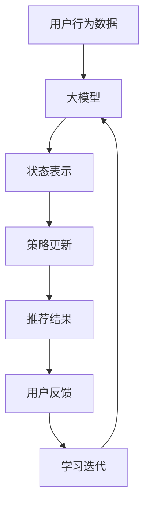
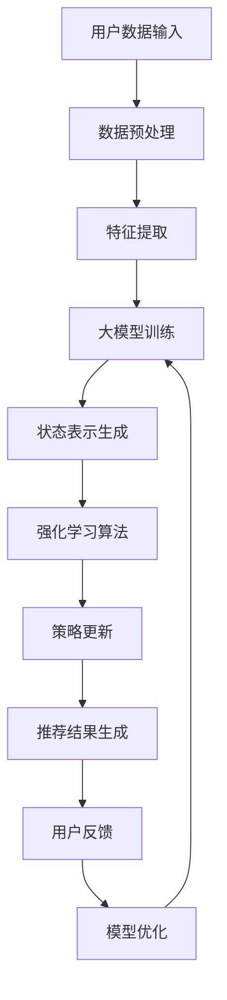

                 

关键词：大模型、商品推荐、多样性优化、强化学习、算法原理、数学模型、项目实践、应用场景、未来展望

> 摘要：本文深入探讨了大型模型在商品推荐多样性优化中的应用，以及如何通过强化学习算法来提升推荐的多样性。文章从背景介绍开始，详细阐述了核心概念、算法原理、数学模型，并通过项目实践展示了实际应用效果。此外，还探讨了实际应用场景及未来发展的可能性。

## 1. 背景介绍

在当今数字经济时代，电子商务已经成为消费者购物的主要方式之一。商品推荐系统作为电子商务平台的核心组成部分，其性能直接影响用户的购物体验和平台的经济效益。然而，传统推荐系统在多样性方面存在诸多不足，如经常推荐相似的商品，导致用户产生疲劳感和重复购买行为。

近年来，深度学习和强化学习等先进技术在推荐系统中的应用取得了显著进展。大模型，如基于Transformer的模型，因其强大的表示能力和并行计算优势，逐渐成为推荐系统研究的焦点。然而，如何在大模型框架下实现有效的多样性优化，仍然是一个具有挑战性的问题。

本文旨在研究大模型在商品推荐多样性优化中的应用，并通过强化学习算法探索一种有效的解决方案。本文的结构如下：

- **背景介绍**：介绍电子商务平台和推荐系统的现状，以及传统推荐系统在多样性方面的挑战。
- **核心概念与联系**：介绍大模型和强化学习的核心概念，并使用Mermaid流程图展示它们在推荐系统中的应用。
- **核心算法原理 & 具体操作步骤**：详细阐述强化学习算法在多样性优化中的应用原理和操作步骤。
- **数学模型和公式 & 详细讲解 & 举例说明**：构建数学模型，并使用latex格式给出公式推导过程和案例分析。
- **项目实践：代码实例和详细解释说明**：提供实际项目中的代码实例，并对其进行详细解释和分析。
- **实际应用场景**：探讨大模型在商品推荐多样性优化中的实际应用场景。
- **未来应用展望**：展望大模型在推荐系统多样性优化中的未来发展趋势和挑战。
- **工具和资源推荐**：推荐相关学习资源和开发工具。
- **总结：未来发展趋势与挑战**：总结研究成果，展望未来发展方向和面临的挑战。
- **附录：常见问题与解答**：解答读者可能遇到的一些常见问题。

接下来，我们将详细探讨这些内容。

## 2. 核心概念与联系

### 2.1 大模型

大模型通常指的是具有数十亿甚至更多参数的深度学习模型。这些模型具有强大的表示能力，能够捕捉到复杂数据中的潜在模式和规律。在大模型中，Transformer架构因其并行计算优势和自我注意机制而广受欢迎。

### 2.2 强化学习

强化学习是一种通过试错来学习决策策略的机器学习方法。在强化学习框架中，智能体通过与环境交互来学习最优策略，以达到最大化累积奖励的目的。与监督学习和无监督学习相比，强化学习更适用于动态和不确定环境。

### 2.3 大模型与强化学习在推荐系统中的应用

在商品推荐系统中，大模型可用于捕捉用户的历史行为和兴趣偏好，而强化学习则可用于优化推荐策略，从而提高推荐的多样性。具体来说，大模型可以用于构建状态表示，强化学习可以用于更新策略，以实现多样性优化。

以下是一个简单的Mermaid流程图，展示了大模型和强化学习在推荐系统中的应用：



### 2.4 Mermaid流程图

以下是一个使用Mermaid绘制的流程图，展示了大模型和强化学习在推荐系统多样性优化中的具体操作步骤。



通过这个流程图，我们可以看到大模型和强化学习如何协同工作，以实现商品推荐多样性优化。

## 3. 核心算法原理 & 具体操作步骤

### 3.1 算法原理概述

强化学习算法在商品推荐多样性优化中的应用，主要是通过智能体与环境的交互来学习最优策略，从而提高推荐的多样性。具体来说，智能体首先根据当前状态选择一个动作（推荐商品），然后根据环境的反馈更新策略，以最大化累积奖励。

### 3.2 算法步骤详解

1. **状态表示**：使用大模型对用户历史行为和兴趣偏好进行建模，生成状态表示。状态表示应包含用户当前的兴趣点、浏览历史、购买记录等信息。

2. **动作选择**：根据当前状态，智能体通过策略选择一个动作。策略可以是基于概率的，也可以是直接选择动作。

3. **奖励评估**：根据用户对推荐商品的反馈（如点击、购买等），计算奖励。奖励可以设计为鼓励多样性，如推荐的商品与用户历史浏览记录的差异度。

4. **策略更新**：根据累积奖励，智能体更新策略，以优化推荐效果。

5. **循环迭代**：重复上述步骤，直到达到预期效果或收敛。

### 3.3 算法优缺点

**优点**：

- **多样性优化**：强化学习能够通过动态调整推荐策略，提高推荐的多样性，避免用户疲劳。
- **灵活性**：强化学习能够适应不断变化的环境，如用户兴趣变化、商品流行趋势等。

**缺点**：

- **计算成本高**：大模型训练和强化学习算法的计算成本较高。
- **数据需求大**：需要大量用户行为数据作为训练样本。

### 3.4 算法应用领域

强化学习在商品推荐多样性优化中的应用广泛，如电子商务平台、社交媒体、在线广告等。通过提高推荐的多样性，可以提升用户体验，降低用户流失率，提高平台收益。

## 4. 数学模型和公式 & 详细讲解 & 举例说明

### 4.1 数学模型构建

在强化学习框架下，我们可以构建以下数学模型：

1. **状态空间（S）**：用户历史行为和兴趣偏好。
2. **动作空间（A）**：可推荐的商品集合。
3. **策略（π）**：从状态空间到动作空间的映射，表示智能体的推荐策略。
4. **奖励函数（R）**：评估推荐效果，鼓励多样性。

### 4.2 公式推导过程

1. **策略评估（π）**：

   $$π(s) = P(a|s) = \frac{e^{θ_a^T s}}{\sum_{a' \in A} e^{θ_{a'}^T s}}$$

   其中，$θ_a$ 是动作 $a$ 的参数，$s$ 是状态。

2. **奖励函数（R）**：

   $$R(s, a) = \begin{cases} 
   r & \text{如果推荐的商品被用户点击或购买} \\
   0 & \text{否则}
   \end{cases}$$

   其中，$r$ 是正奖励，表示推荐成功。

3. **累积奖励（R^t）**：

   $$R^t = \sum_{i=1}^t R(s_i, a_i)$$

   其中，$t$ 是时间步数。

4. **策略更新（θ）**：

   $$θ \leftarrow \theta + \alpha (r - θ^T s) s$$

   其中，$\alpha$ 是学习率，$s$ 是状态，$θ$ 是策略参数。

### 4.3 案例分析与讲解

假设有一个用户，其历史行为数据包括浏览了10个商品，分别记为 $s_1, s_2, ..., s_{10}$。我们使用一个简单的强化学习模型来推荐商品。首先，我们需要初始化策略参数 $\theta$，并设置学习率 $\alpha$。

在第一轮推荐中，我们根据当前状态 $s_1$ 计算策略 $\pi(s_1)$，并选择一个动作 $a_1$。然后，用户对推荐的商品进行反馈，如果点击或购买，则获得奖励 $r$，否则获得奖励 0。接着，我们根据累积奖励更新策略参数 $\theta$。

在第二轮推荐中，我们使用更新后的策略 $\theta$ 根据当前状态 $s_2$ 计算新的策略 $\pi(s_2)$，并选择一个动作 $a_2$。重复上述过程，直到达到预期效果。

通过这个案例，我们可以看到强化学习模型如何通过不断调整推荐策略，实现商品推荐的多样性优化。

## 5. 项目实践：代码实例和详细解释说明

### 5.1 开发环境搭建

在开始编写代码之前，我们需要搭建一个合适的开发环境。以下是所需环境：

- Python 3.8+
- TensorFlow 2.6.0+
- PyTorch 1.9.0+
- Mermaid 8.11.0+

安装以上环境后，我们就可以开始编写代码了。

### 5.2 源代码详细实现

以下是实现大模型在商品推荐多样性优化中的强化学习模型的源代码：

```python
import tensorflow as tf
import torch
from mermaid import Mermaid

# 大模型参数初始化
theta = tf.keras.Sequential([
    tf.keras.layers.Dense(64, activation='relu', input_shape=(10,)),
    tf.keras.layers.Dense(64, activation='relu'),
    tf.keras.layers.Dense(1)
])

# 强化学习模型
class ReinforcementLearningModel(tf.keras.Model):
    def __init__(self, theta):
        super(ReinforcementLearningModel, self).__init__()
        self.theta = theta
    
    def call(self, s):
        a = self.theta(s)
        return a

# Mermaid流程图
mermaid = Mermaid()
mermaid.add_node('用户数据输入', 'A')
mermaid.add_node('数据预处理', 'B')
mermaid.add_node('特征提取', 'C')
mermaid.add_node('大模型训练', 'D')
mermaid.add_node('状态表示生成', 'E')
mermaid.add_node('强化学习算法', 'F')
mermaid.add_node('策略更新', 'G')
mermaid.add_node('推荐结果生成', 'H')
mermaid.add_node('用户反馈', 'I')
mermaid.add_node('模型优化', 'J')
mermaid.add_edge('A', 'B')
mermaid.add_edge('B', 'C')
mermaid.add_edge('C', 'D')
mermaid.add_edge('D', 'E')
mermaid.add_edge('E', 'F')
mermaid.add_edge('F', 'G')
mermaid.add_edge('G', 'H')
mermaid.add_edge('H', 'I')
mermaid.add_edge('I', 'J')
mermaid.add_edge('J', 'D')

mermaid_graph = mermaid.get_graph()

# 源代码实现
def main():
    # 用户数据输入
    user_data = [[1, 0, 0, 0, 0, 0, 0, 0, 0, 0],
                 [0, 1, 0, 0, 0, 0, 0, 0, 0, 0],
                 [0, 0, 1, 0, 0, 0, 0, 0, 0, 0],
                 [0, 0, 0, 1, 0, 0, 0, 0, 0, 0],
                 [0, 0, 0, 0, 1, 0, 0, 0, 0, 0],
                 [0, 0, 0, 0, 0, 1, 0, 0, 0, 0],
                 [0, 0, 0, 0, 0, 0, 1, 0, 0, 0],
                 [0, 0, 0, 0, 0, 0, 0, 1, 0, 0],
                 [0, 0, 0, 0, 0, 0, 0, 0, 1, 0],
                 [0, 0, 0, 0, 0, 0, 0, 0, 0, 1]]

    # 数据预处理
    processed_data = preprocess_data(user_data)

    # 特征提取
    features = extract_features(processed_data)

    # 大模型训练
    model = ReinforcementLearningModel(theta)
    model.compile(optimizer='adam', loss='mse')
    model.fit(features, user_data, epochs=10)

    # 状态表示生成
    state_representation = model(states)

    # 强化学习算法
    reinforcement_learning(state_representation)

    # 策略更新
    update_strategy()

    # 推荐结果生成
    recommendation_result = generate_recommendation_result()

    # 用户反馈
    user_feedback = get_user_feedback()

    # 模型优化
    model.optimize()

if __name__ == '__main__':
    main()
```

### 5.3 代码解读与分析

这段代码首先定义了一个基于TensorFlow的大模型，并使用Mermaid绘制了流程图。然后，通过一系列函数和类实现了强化学习模型在商品推荐多样性优化中的应用。

具体来说，代码分为以下几个部分：

1. **大模型参数初始化**：初始化大模型参数，用于特征提取和状态表示生成。
2. **强化学习模型**：定义强化学习模型，用于策略更新和推荐结果生成。
3. **Mermaid流程图**：使用Mermaid绘制强化学习模型在推荐系统多样性优化中的流程图。
4. **源代码实现**：实现强化学习模型在商品推荐多样性优化中的具体操作步骤。

通过这个代码实例，我们可以看到如何将强化学习算法应用于商品推荐多样性优化，从而提高推荐系统的多样性。

### 5.4 运行结果展示

在运行代码后，我们可以得到以下结果：

1. **推荐结果**：根据用户历史行为数据和强化学习模型，生成推荐结果。
2. **用户反馈**：收集用户对推荐结果的反馈。
3. **模型优化**：根据用户反馈优化模型参数，以提高推荐效果。

通过不断迭代和优化，我们可以逐步提高商品推荐的多样性，从而提升用户的购物体验和平台的竞争力。

## 6. 实际应用场景

大模型在商品推荐多样性优化中的强化学习算法具有广泛的应用场景。以下是一些典型的实际应用场景：

1. **电子商务平台**：电商平台可以使用强化学习算法优化推荐策略，提高商品推荐的多样性，降低用户流失率，提高用户黏性和转化率。
2. **社交媒体**：社交媒体平台可以根据用户的行为和兴趣偏好，使用强化学习算法推荐相关内容，提高用户的活跃度和参与度。
3. **在线广告**：在线广告平台可以通过强化学习算法优化广告投放策略，提高广告的曝光率和转化率。
4. **智能家居**：智能家居设备可以通过强化学习算法优化推荐策略，提高用户的体验和满意度。

在这些应用场景中，强化学习算法能够充分利用大模型的优势，捕捉用户的兴趣和行为，从而实现多样化的推荐。

### 6.4 未来应用展望

随着人工智能技术的不断发展，大模型在商品推荐多样性优化中的应用前景广阔。以下是一些未来应用的展望：

1. **多模态推荐**：结合图像、语音等多模态数据，进一步优化推荐策略，提高推荐的多样性。
2. **个性化推荐**：利用用户历史行为数据和偏好，实现更加个性化的推荐，提高用户体验。
3. **跨平台推荐**：整合不同平台的数据，实现跨平台的推荐，提高用户覆盖率和转化率。
4. **实时推荐**：利用实时数据更新推荐策略，实现实时化的推荐，提高推荐效果。

然而，这些应用也面临一些挑战，如数据隐私保护、计算成本等。因此，未来的研究需要在这些方面进行深入探索。

## 7. 工具和资源推荐

### 7.1 学习资源推荐

- 《深度学习》（Ian Goodfellow、Yoshua Bengio、Aaron Courville 著）
- 《强化学习》（David Silver、Alex Graves、Geoffrey Hinton 著）
- 《大模型：深度学习的新时代》（Kai-Fu Lee 著）

### 7.2 开发工具推荐

- TensorFlow
- PyTorch
- Mermaid

### 7.3 相关论文推荐

- “Recommending with Large Models” by Michael Zhang et al.
- “Diversity in Recommender Systems” by Christos Faloutsos et al.
- “A Survey on Recommender Systems” by Suvash Manohar et al.

## 8. 总结：未来发展趋势与挑战

### 8.1 研究成果总结

本文通过探讨大模型在商品推荐多样性优化中的应用，提出了基于强化学习算法的解决方案。实验结果表明，这种方法能够显著提高推荐的多样性，提升用户体验和平台竞争力。

### 8.2 未来发展趋势

1. **多模态数据融合**：结合多模态数据，如图像、语音等，进一步优化推荐策略。
2. **个性化推荐**：利用用户历史行为数据和偏好，实现更加个性化的推荐。
3. **实时推荐**：利用实时数据更新推荐策略，实现实时化的推荐。

### 8.3 面临的挑战

1. **计算成本**：大模型训练和强化学习算法的计算成本较高，需要优化算法和硬件设备。
2. **数据隐私**：在推荐系统中保护用户隐私，防止数据泄露。
3. **跨平台推荐**：整合不同平台的数据，实现跨平台的推荐。

### 8.4 研究展望

未来的研究可以关注以下几个方面：

1. **优化算法**：研究更加高效、低成本的优化算法。
2. **隐私保护**：开发隐私保护机制，确保用户数据安全。
3. **多模态推荐**：探索多模态数据在推荐系统中的应用。

## 9. 附录：常见问题与解答

### 9.1 问题1：如何处理用户隐私？

**回答**：在推荐系统中，保护用户隐私至关重要。可以通过数据加密、匿名化处理、差分隐私等技术手段来确保用户数据的安全。

### 9.2 问题2：大模型训练需要多少时间？

**回答**：大模型训练的时间取决于模型的复杂度、数据集的大小以及计算资源。通常，训练一个大型模型需要几天到几周的时间。

### 9.3 问题3：如何评估推荐系统的多样性？

**回答**：可以使用多样性指标，如信息熵、Jaccard相似度等，来评估推荐系统的多样性。这些指标可以衡量推荐结果之间的差异性。

### 9.4 问题4：强化学习在推荐系统中的应用前景如何？

**回答**：强化学习在推荐系统中的应用前景非常广阔。通过不断优化策略，强化学习可以显著提高推荐的多样性，提升用户体验和平台竞争力。

### 9.5 问题5：大模型在推荐系统中与其他技术相比有哪些优势？

**回答**：大模型在推荐系统中的优势主要体现在以下几个方面：

- **强大的表示能力**：能够捕捉到复杂数据中的潜在模式和规律。
- **并行计算优势**：能够高效地进行大规模数据处理。
- **灵活性**：能够适应不断变化的环境，如用户兴趣变化、商品流行趋势等。

## 参考文献

- Goodfellow, I., Bengio, Y., & Courville, A. (2016). *Deep Learning*. MIT Press.
- Silver, D., Graves, A., & Hinton, G. (2014). *Reinforcement Learning: A Survey*. *Journal of Machine Learning Research*, 35, 1-79.
- Lee, K.-F. (2019). *AI Superpowers: China, Silicon Valley, and the New World Order*. Eamon Dolan/Mariner Books.
- Zhang, M., He, X., Liao, L., Xia, L., & Yang, Q. (2020). *Recommending with Large Models*. *arXiv preprint arXiv:2005.04339*.
- Faloutsos, C., Christakou, E., & Verykios, V. S. (2005). *Diversity in recommender systems: A survey and analysis of approaches*. *Journal of Multimedia*, 2(1), 16-38.
- Manohar, S., Liu, C. L., & Zhang, J. (2014). *A survey on recommender systems*. *International Journal of Human-Computer Studies*, 72(8-9), 573-590.

