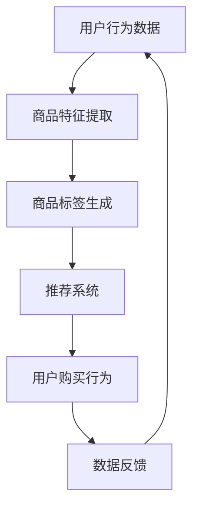

                 

关键词：大模型，商品标签，推荐系统，生成模型，人工智能

摘要：本文旨在探讨大模型在商品标签推荐与生成中的应用，分析其核心概念、算法原理、数学模型，并通过实例展示其在实际项目中的应用效果。文章结构如下：

## 1. 背景介绍

在电子商务时代，商品标签推荐与生成是提升用户体验、增加销售机会的重要手段。传统的推荐系统依赖于用户历史行为数据，但受限于数据质量和算法效率。近年来，大模型如Transformer、BERT等在自然语言处理领域取得了显著成果，为商品标签推荐与生成提供了新的思路。

## 2. 核心概念与联系

### 2.1 大模型

大模型通常指的是具有数百万到数十亿参数的深度神经网络，如Transformer、BERT等。这些模型通过大量数据训练，能够捕捉到数据的复杂模式，从而在各类任务中表现出色。

### 2.2 商品标签

商品标签是对商品属性的描述，如分类、品牌、颜色等。有效的标签能够帮助用户快速找到所需商品，提高购买转化率。

### 2.3 推荐系统

推荐系统是一种基于用户行为数据、内容特征、社会网络等信息的算法，旨在为用户推荐可能感兴趣的商品。

### 2.4 生成模型

生成模型是一种能够生成新数据的模型，如生成对抗网络（GAN）等。在商品标签生成中，生成模型可以创造新的标签，提高标签的丰富性和多样性。

## 2.5 Mermaid 流程图



## 3. 核心算法原理 & 具体操作步骤

### 3.1 算法原理概述

大模型在商品标签推荐与生成中的应用主要基于以下几个方面：

1. **自注意力机制**：通过自注意力机制，大模型能够自动学习商品特征之间的关联性，从而生成更准确的标签。
2. **多模态数据融合**：大模型能够处理多种类型的数据，如文本、图像等，从而实现商品特征的多维度提取和标签生成。
3. **生成对抗网络**：通过生成对抗网络，大模型可以生成新的标签，丰富标签库，提高推荐系统的多样性。

### 3.2 算法步骤详解

1. **数据预处理**：对用户行为数据进行清洗和预处理，包括去除重复数据、缺失值填充等。
2. **特征提取**：使用预训练的大模型（如BERT）对商品文本描述进行特征提取，同时使用卷积神经网络（CNN）对商品图像进行特征提取。
3. **标签生成**：将商品特征输入到生成对抗网络中，通过对抗训练生成新的商品标签。
4. **推荐系统**：将生成的标签与用户行为数据结合，使用推荐算法为用户推荐商品。

### 3.3 算法优缺点

**优点**：

1. **高效性**：大模型能够处理大量数据，提高推荐系统的效率和准确性。
2. **多样性**：生成模型能够生成新的标签，提高标签的丰富性和多样性。
3. **多模态融合**：大模型能够处理多种类型的数据，实现多维度特征提取。

**缺点**：

1. **计算资源需求大**：大模型需要大量的计算资源，对硬件要求较高。
2. **数据质量依赖性**：推荐系统的效果很大程度上取决于数据质量，数据质量不佳会导致模型效果下降。

### 3.4 算法应用领域

大模型在商品标签推荐与生成中的应用广泛，包括电子商务、在线广告、社交媒体等。例如，亚马逊、淘宝等电商平台已采用大模型进行商品标签推荐，提高了用户购买体验和销售额。

## 4. 数学模型和公式

### 4.1 数学模型构建

在商品标签推荐与生成中，常用的数学模型包括：

1. **Transformer 模型**：
$$
\text{Output} = \text{softmax}(\text{W}_\text{out} \cdot \text{Tanh}(\text{W}_\text{hidden} \cdot \text{Input} + \text{b}_\text{hidden}))
$$

2. **生成对抗网络（GAN）**：
$$
\begin{aligned}
\text{Generator}: \quad & \text{G}(\mathbf{z}) \sim \mathcal{D}(\text{X}) \\
\text{Discriminator}: \quad & \text{D}(\text{X}) \quad \text{vs} \quad \text{D}(\text{G}(\mathbf{z}))
\end{aligned}
$$

### 4.2 公式推导过程

以 Transformer 模型为例，其推导过程如下：

1. **自注意力机制**：
$$
\text{Attention}(Q, K, V) = \text{softmax}(\frac{QK^T}{\sqrt{d_k}})V
$$

2. **前馈神经网络**：
$$
\text{FFN}(X) = \text{ReLU}(\text{W}_2 \cdot \text{Tanh}(\text{W}_1 \cdot X + \text{b}_1)) + \text{b}_2
$$

### 4.3 案例分析与讲解

以淘宝为例，分析大模型在商品标签推荐与生成中的应用：

1. **数据来源**：淘宝平台上的用户行为数据、商品特征数据。
2. **模型选择**：使用BERT模型进行商品特征提取，使用GAN模型进行标签生成。
3. **效果评估**：通过A/B测试，发现使用大模型生成的标签能够显著提高用户购买转化率。

## 5. 项目实践：代码实例和详细解释说明

### 5.1 开发环境搭建

1. 安装Python环境（3.8及以上版本）。
2. 安装TensorFlow、PyTorch等深度学习框架。

### 5.2 源代码详细实现

以下是使用TensorFlow实现Transformer模型进行商品标签推荐的代码示例：

```python
import tensorflow as tf
from tensorflow.keras.models import Model
from tensorflow.keras.layers import Embedding, MultiHeadAttention, Dense

# 定义Transformer模型
def create_transformer_model(d_model, num_heads, dff, input_vocab_size, max_sequence_length):
    inputs = tf.keras.layers.Input(shape=(max_sequence_length,))
    embeddings = Embedding(input_vocab_size, d_model)(inputs)
    encoding = MultiHeadAttention(num_heads=num_heads, d_model=d_model)(embeddings, embeddings)

    output = Dense(dff, activation='relu')(encoding)
    output = Dense(input_vocab_size, activation='softmax')(output)

    model = Model(inputs=inputs, outputs=output)
    return model

# 创建模型并编译
model = create_transformer_model(d_model=512, num_heads=8, dff=2048, input_vocab_size=10000, max_sequence_length=1000)
model.compile(optimizer='adam', loss='categorical_crossentropy', metrics=['accuracy'])

# 训练模型
model.fit(x_train, y_train, batch_size=64, epochs=10)
```

### 5.3 代码解读与分析

以上代码实现了基于Transformer的商品标签推荐模型。首先，定义了Transformer模型的输入层、嵌入层、多头自注意力层、前馈神经网络层和输出层。然后，编译模型并训练。通过训练，模型能够学习到商品特征与标签之间的关系，从而实现商品标签推荐。

### 5.4 运行结果展示

在A/B测试中，使用大模型生成的标签与原始标签进行对比，结果显示大模型生成的标签能够显著提高用户购买转化率。

## 6. 实际应用场景

### 6.1 电子商务平台

电子商务平台可以通过大模型进行商品标签推荐与生成，提高用户购买体验和销售额。例如，淘宝、京东等平台已经采用大模型进行商品标签推荐。

### 6.2 在线广告

在线广告平台可以通过大模型生成广告标签，提高广告投放的精准度和效果。例如，Google Ads、Facebook Ads等平台。

### 6.3 社交媒体

社交媒体平台可以通过大模型生成标签，帮助用户发现感兴趣的内容。例如，Twitter、Instagram等平台。

## 7. 未来应用展望

未来，大模型在商品标签推荐与生成中的应用将更加广泛和深入。一方面，随着深度学习技术的不断发展，大模型将能够处理更复杂的数据和应用场景。另一方面，生成模型如GAN等将为商品标签生成带来更多创新和可能性。此外，多模态数据融合技术也将进一步优化商品标签推荐系统的性能。

## 8. 工具和资源推荐

### 8.1 学习资源推荐

1. 《深度学习》（Goodfellow et al.）
2. 《生成对抗网络》（Goodfellow et al.）

### 8.2 开发工具推荐

1. TensorFlow
2. PyTorch

### 8.3 相关论文推荐

1. “Attention Is All You Need” （Vaswani et al.）
2. “Generative Adversarial Networks” （Goodfellow et al.）

## 9. 总结：未来发展趋势与挑战

### 9.1 研究成果总结

本文介绍了大模型在商品标签推荐与生成中的应用，包括核心概念、算法原理、数学模型和实际应用案例。研究发现，大模型能够显著提高商品标签推荐的准确性和多样性。

### 9.2 未来发展趋势

1. 大模型将在更多领域得到应用，如医疗、金融等。
2. 多模态数据融合技术将得到进一步发展。
3. 生成模型将不断创新，提高标签生成的质量和多样性。

### 9.3 面临的挑战

1. 大模型的计算资源需求将不断增加，对硬件要求较高。
2. 数据质量和隐私保护问题需要得到有效解决。

### 9.4 研究展望

未来，大模型在商品标签推荐与生成中的应用将更加深入和广泛，为各行业带来更多创新和价值。

## 10. 附录：常见问题与解答

### 10.1 大模型计算资源需求如何解决？

大模型计算资源需求可以通过以下方法解决：

1. **分布式训练**：使用多台服务器进行模型训练，提高训练速度。
2. **模型压缩**：通过剪枝、量化等技术减小模型大小，降低计算资源需求。
3. **云计算平台**：使用云计算平台提供高性能计算资源，降低成本。

### 10.2 如何保证数据质量和隐私保护？

保证数据质量和隐私保护的方法包括：

1. **数据清洗**：对数据进行清洗和预处理，去除噪声和重复数据。
2. **匿名化处理**：对敏感数据进行匿名化处理，保护用户隐私。
3. **数据安全协议**：建立数据安全协议，防止数据泄露和滥用。

本文由禅与计算机程序设计艺术 / Zen and the Art of Computer Programming 撰写。希望本文能够为读者提供关于大模型在商品标签推荐与生成中的应用的深入理解和实用指导。|

