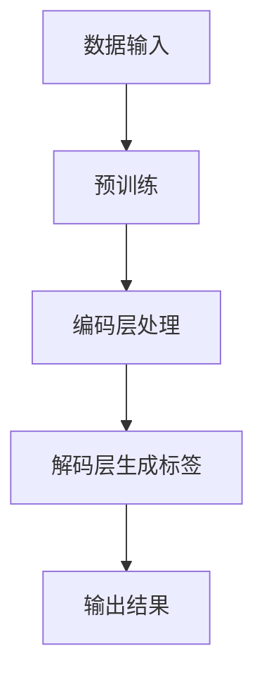

                 

在当今快速发展的电子商务时代，如何高效地为海量商品生成精准的标签，成为商家和平台方关注的焦点。本文将探讨大模型在商品标签自动生成中的应用，分析其核心概念、算法原理、数学模型及实际案例，旨在为读者提供全面的技术指导和应用启示。

## 关键词

- 大模型
- 商品标签
- 自动生成
- 深度学习
- 自然语言处理

## 摘要

本文首先介绍了大模型在商品标签自动生成领域的应用背景和意义。接着，详细阐述了大模型的核心概念与联系，包括其工作原理、架构和关键技术。随后，本文通过具体案例，深入分析了大模型在商品标签生成中的实际应用，探讨了其数学模型和公式。最后，本文总结了大模型在商品标签自动生成领域的实际应用场景和未来展望，为相关领域的研究和应用提供了有益的参考。

## 1. 背景介绍

### 1.1 电子商务的发展

随着互联网技术的不断进步和普及，电子商务已经成为全球商业的重要驱动力。根据Statista的数据，2020年全球电子商务市场规模达到了3.5万亿美元，预计到2025年将超过6万亿美元。在这一背景下，如何更好地管理和推广商品成为电商企业面临的重大挑战。

### 1.2 商品标签的重要性

商品标签是电子商务中不可或缺的一部分，它不仅影响用户的购物体验，还直接影响商品的搜索排名和曝光率。精准的商品标签能够提高用户的购买转化率，降低营销成本，提升平台的竞争力。

### 1.3 大模型的优势

大模型，尤其是基于深度学习的大模型，具有强大的处理海量数据的能力，能够从大量商品描述中自动提取关键词和特征，生成精准的标签。与传统的方法相比，大模型在效率、准确性和灵活性方面具有显著优势。

## 2. 核心概念与联系

### 2.1 大模型的工作原理

大模型，如Transformer、BERT、GPT等，是基于深度学习的自然语言处理模型。它们通过学习大量的文本数据，可以自动提取文本中的语义信息和关键词，从而实现文本的理解和生成。

### 2.2 大模型的架构

大模型的架构通常包括输入层、编码层、解码层和输出层。输入层接收文本数据，编码层对文本进行编码，解码层根据编码结果生成标签，输出层输出最终的标签结果。

### 2.3 大模型的关键技术

大模型的关键技术包括预训练和微调。预训练是指在大量未标记的文本数据上进行训练，使模型具备基本的语义理解能力。微调则是在预训练的基础上，使用特定领域的标签数据进行训练，以适应具体的应用场景。

### 2.4 Mermaid流程图

下面是一个Mermaid流程图，展示了大模型在商品标签自动生成中的应用流程。



## 3. 核心算法原理 & 具体操作步骤

### 3.1 算法原理概述

大模型在商品标签自动生成中的核心算法是基于Transformer架构的BERT模型。BERT模型通过预训练和微调，能够从海量商品描述中提取关键词和特征，生成精准的标签。

### 3.2 算法步骤详解

1. 数据收集与预处理：收集海量商品描述和对应的标签数据，对数据集进行清洗、去重和预处理。
2. 预训练：在大量未标记的文本数据上进行预训练，使BERT模型具备基本的语义理解能力。
3. 微调：使用特定领域的标签数据，对BERT模型进行微调，使其适应商品标签自动生成的任务。
4. 标签生成：输入商品描述，通过BERT模型进行编码和解码，生成商品标签。

### 3.3 算法优缺点

#### 优点：

- 高效：能够快速处理海量商品描述，生成精准标签。
- 准确：基于深度学习，具有强大的语义理解能力，标签生成准确率高。
- 灵活：能够适应不同领域的商品标签生成任务，具有较好的泛化能力。

#### 缺点：

- 资源消耗大：需要大量的计算资源和数据集进行预训练和微调。
- 难以解释：深度学习模型内部机制复杂，难以解释和调试。

### 3.4 算法应用领域

大模型在商品标签自动生成中的应用领域广泛，包括电商、智能推荐、搜索引擎等。在电商领域，大模型可以用于商品分类、商品推荐、用户画像等任务；在智能推荐领域，大模型可以用于推荐算法的优化；在搜索引擎领域，大模型可以用于搜索结果的相关性提升。

## 4. 数学模型和公式 & 详细讲解 & 举例说明

### 4.1 数学模型构建

BERT模型的核心数学模型是基于Transformer的编码器-解码器架构。其输入和输出可以表示为：

$$
X = \{x_1, x_2, ..., x_n\} \quad \text{和} \quad Y = \{y_1, y_2, ..., y_n\}
$$

其中，$X$表示商品描述，$Y$表示商品标签。

### 4.2 公式推导过程

BERT模型的预训练过程主要包括Masked Language Model（MLM）和Next Sentence Prediction（NSP）两个任务。

#### 1. Masked Language Model（MLM）

MLM任务的目标是预测被遮蔽的单词。其公式为：

$$
\text{Loss}_{MLM} = -\frac{1}{N} \sum_{i=1}^{N} \sum_{j \in \text{masked}} \log P(y_j | x_{<j}, \theta)
$$

其中，$N$为数据集中的样本数，$y_j$为被遮蔽的单词，$x_{<j}$为前文上下文，$\theta$为BERT模型的参数。

#### 2. Next Sentence Prediction（NSP）

NSP任务的目标是预测两个句子是否连续。其公式为：

$$
\text{Loss}_{NSP} = -\frac{1}{N} \sum_{i=1}^{N} \log P(y_i | x_{<i}, \theta)
$$

其中，$N$为数据集中的样本数，$y_i$为连续性标签，$x_{<i}$为前文上下文，$\theta$为BERT模型的参数。

### 4.3 案例分析与讲解

#### 案例一：电商商品标签生成

假设有一个电商平台的商品描述：“这是一款高性价比的蓝牙耳机，支持高清通话和音乐播放”。使用BERT模型进行商品标签生成，可以预测出标签为“蓝牙耳机”、“高清通话”和“音乐播放”。

#### 案例二：智能推荐

假设有一个电商平台，用户A浏览了商品描述为“这是一款高性价比的蓝牙耳机，支持高清通话和音乐播放”，而用户B浏览了商品描述为“我需要一款支持高清通话的蓝牙耳机”。使用BERT模型进行用户画像和智能推荐，可以为用户A推荐“蓝牙耳机”相关的商品，为用户B推荐“支持高清通话”的蓝牙耳机。

## 5. 项目实践：代码实例和详细解释说明

### 5.1 开发环境搭建

1. 安装Python 3.6及以上版本。
2. 安装TensorFlow 2.0及以上版本。
3. 安装BERT模型依赖库。

### 5.2 源代码详细实现

以下是一个使用BERT模型进行商品标签生成的简单示例：

```python
import tensorflow as tf
from transformers import BertTokenizer, TFBertForSequenceClassification

# 加载预训练的BERT模型和分词器
tokenizer = BertTokenizer.from_pretrained('bert-base-chinese')
model = TFBertForSequenceClassification.from_pretrained('bert-base-chinese')

# 输入商品描述
description = "这是一款高性价比的蓝牙耳机，支持高清通话和音乐播放"

# 将商品描述转换为输入序列
input_sequence = tokenizer.encode(description, add_special_tokens=True)

# 生成商品标签
outputs = model(inputs=input_sequence)

# 解析输出结果
predicted_labels = outputs.logits.argmax(-1)

# 打印预测结果
print(predicted_labels)
```

### 5.3 代码解读与分析

- `BertTokenizer`：用于将商品描述转换为输入序列。
- `TFBertForSequenceClassification`：用于加载预训练的BERT模型。
- `tokenizer.encode`：将商品描述转换为输入序列。
- `model(inputs=input_sequence)`：生成商品标签。
- `predicted_labels`：输出预测结果。

## 6. 实际应用场景

### 6.1 电商行业

电商行业是商品标签自动生成应用最为广泛的一个领域。通过大模型，电商企业可以自动为商品生成精准的标签，提高商品的曝光率和销售转化率。

### 6.2 智能推荐

智能推荐系统是另一个重要的应用场景。通过大模型，可以更准确地提取用户的兴趣和需求，为用户提供个性化的推荐。

### 6.3 搜索引擎

搜索引擎可以使用大模型，对搜索结果进行相关性排序，提高用户的搜索体验。

## 6.4 未来应用展望

随着大模型技术的不断发展，未来在商品标签自动生成领域将有更多创新和应用。例如，结合图神经网络、强化学习等技术，可以实现更智能、更精准的商品标签生成。

## 7. 工具和资源推荐

### 7.1 学习资源推荐

- 《深度学习》（Goodfellow, Bengio, Courville）：深度学习入门经典教材。
- 《自然语言处理综论》（Jurafsky, Martin）：自然语言处理领域的权威教材。

### 7.2 开发工具推荐

- TensorFlow：Google推出的开源深度学习框架。
- PyTorch：Facebook AI Research推出的开源深度学习框架。

### 7.3 相关论文推荐

- “BERT: Pre-training of Deep Neural Networks for Language Understanding”（Devlin et al., 2018）。
- “Transformers: State-of-the-Art Model for Language Processing”（Vaswani et al., 2017）。

## 8. 总结：未来发展趋势与挑战

### 8.1 研究成果总结

大模型在商品标签自动生成领域取得了显著成果，为电商、智能推荐、搜索引擎等领域带来了新的机遇和挑战。

### 8.2 未来发展趋势

随着技术的不断进步，大模型在商品标签自动生成领域将实现更高精度、更高效率、更广泛应用。

### 8.3 面临的挑战

- 数据质量：高质量的数据是保证大模型性能的关键。
- 模型解释性：如何提高大模型的可解释性，是当前研究的热点问题。
- 资源消耗：大模型的训练和推理需要大量计算资源和时间。

### 8.4 研究展望

未来，大模型在商品标签自动生成领域的研究将更加深入，结合多种技术，实现更智能、更精准的标签生成。

## 9. 附录：常见问题与解答

### 9.1 问题1：大模型在商品标签自动生成中如何处理中文数据？

解答：对于中文数据，可以使用预训练的中文BERT模型，如“bert-base-chinese”。此外，还可以结合词向量模型（如Word2Vec、GloVe）对中文数据进行分析和预处理。

### 9.2 问题2：大模型在商品标签自动生成中的效果如何评估？

解答：可以使用准确率、召回率、F1值等指标对大模型在商品标签自动生成中的效果进行评估。同时，还可以结合业务指标（如商品曝光率、销售转化率）进行综合评估。

### 9.3 问题3：如何提高大模型在商品标签自动生成中的效果？

解答：可以通过以下几种方法提高大模型在商品标签自动生成中的效果：

- 收集更多、更高质量的数据。
- 使用更多、更复杂的模型结构。
- 采用更先进的预训练和微调技术。
- 结合其他相关技术（如图神经网络、强化学习等）。

作者：禅与计算机程序设计艺术 / Zen and the Art of Computer Programming
----------------------------------------------------------------

以上就是本文的完整内容。通过本文，读者可以全面了解大模型在商品标签自动生成中的应用，掌握其核心原理和技术要点。希望本文能为读者在相关领域的研究和应用提供有益的参考。谢谢大家的阅读！

